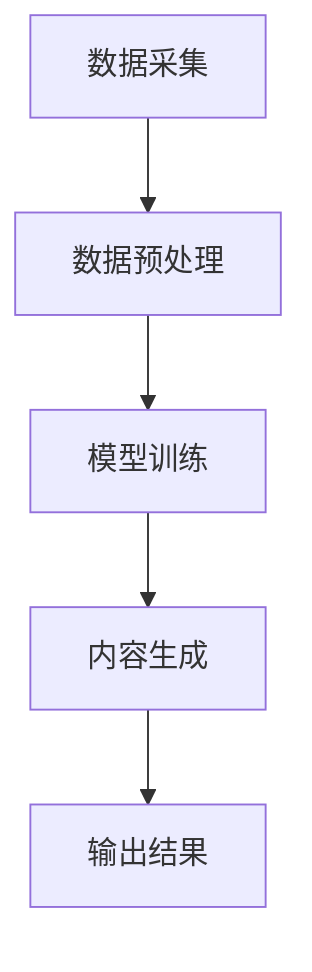
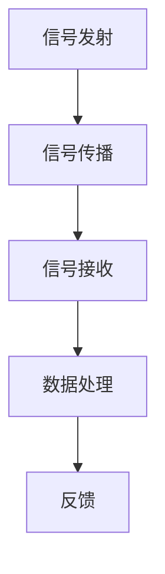
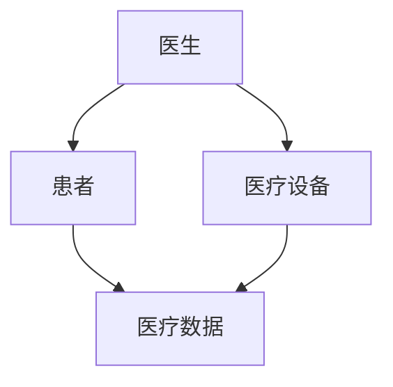
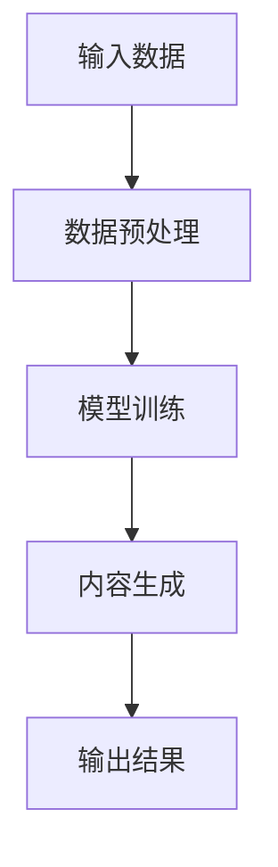
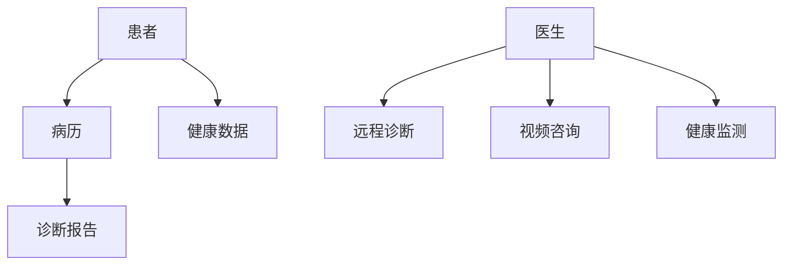
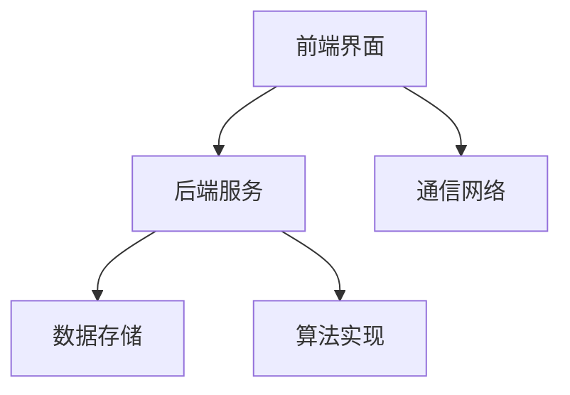
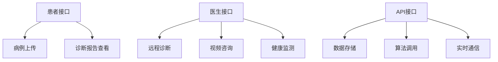
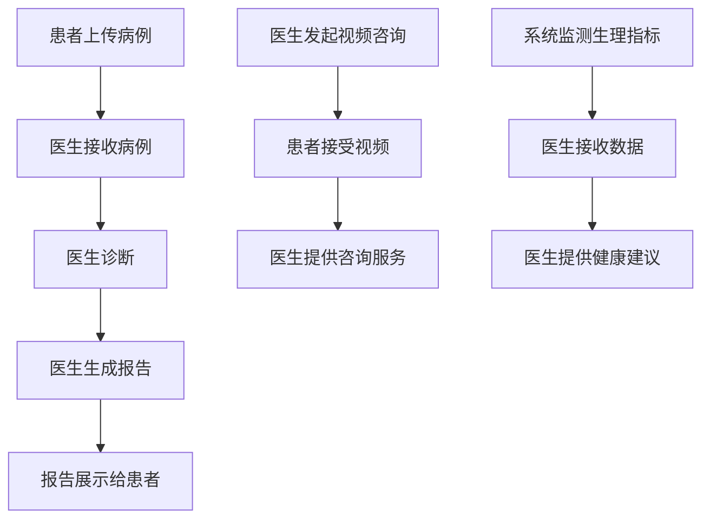

                 


## AIGC与6G技术在远程医疗中的融合

### 关键词：AIGC、6G、远程医疗、人工智能、通信技术、医疗服务

> 摘要：本文将探讨AIGC（AI-Generated Content）与6G技术的融合在远程医疗领域的应用。首先，我们将回顾远程医疗的现状和挑战，然后深入分析AIGC与6G技术的原理和优势。接着，通过具体的算法讲解、系统架构设计和实战案例，展示这两种技术如何共同提升远程医疗服务的质量和效率。

### 第一部分：背景介绍

#### 1.1 问题的提出

远程医疗作为一种创新的医疗服务模式，已经在全球范围内得到了广泛的应用。它不仅解决了医疗资源分布不均的问题，也为患者提供了更加便捷的就医方式。然而，随着医疗需求的增加，远程医疗也面临诸多挑战：

- **医疗服务质量**：远程医疗服务需要保证诊断的准确性和治疗效果的可靠性。
- **数据传输速度**：远程医疗对数据传输的速度和稳定性有较高要求。
- **数据安全性**：医疗数据涉及患者隐私，保护数据安全至关重要。

#### 1.2 AIGC的概念

AIGC，即AI-Generated Content，是指通过人工智能技术自动生成内容的一种方式。它能够生成文本、图像、音频等多种类型的内容，具有高度自动化和个性化的特点。

#### 1.3 6G技术的预期特性

6G技术是下一代通信技术，预计将在速度、延迟、连接密度和能效方面实现重大突破。6G技术的特点使其成为远程医疗的理想选择：

- **超高速传输**：6G将提供更高的数据传输速度，满足远程医疗对高清视频和大数据传输的需求。
- **超低延迟**：6G的低延迟特性将使得实时医疗诊断和手术指导成为可能。
- **海量连接**：6G能够支持更多的设备同时在线，满足远程医疗大规模应用的需求。

#### 1.4 问题解决

AIGC与6G技术的结合有望解决远程医疗面临的多重挑战：

- **提升医疗服务质量**：AIGC可以自动化生成高质量的医疗报告和诊断建议，提高诊断的准确性和效率。
- **优化数据传输**：6G的超高速传输能力将确保医疗数据实时、稳定地传输，减少信息延误。
- **增强数据安全**：6G技术的加密和认证功能将提高医疗数据的安全性。

#### 1.5 边界与外延

本文将探讨AIGC与6G技术在远程医疗中的具体应用，同时也会涉及一些相关技术，如大数据分析和区块链技术，这些技术在远程医疗中同样具有重要意义。

#### 1.6 核心概念

- **AIGC**：基于深度学习模型，自动生成医疗报告、诊断建议和治疗方案。
- **6G技术**：提供超高速、超低延迟、海量连接的通信网络，支持远程医疗的实时、高效服务。

### 第二部分：核心概念与联系

#### 2.1 AIGC原理

AIGC的核心在于利用深度学习模型，如自然语言处理（NLP）和生成对抗网络（GAN），生成高质量的医疗内容。以下是AIGC算法的工作流程：

1. **数据采集**：收集大量的医疗文献、病历和诊断报告。
2. **数据预处理**：清洗和标注数据，准备用于模型训练。
3. **模型训练**：使用NLP模型，如Transformer和BERT，对数据进行训练，使其能够理解医疗术语和语言结构。
4. **内容生成**：利用训练好的模型，生成医疗报告、诊断建议和治疗方案。

以下是AIGC算法的Mermaid流程图：



#### 2.2 6G技术

6G技术是下一代通信技术，其核心特点包括：

- **超高速传输**：6G预计将提供超过1Tbps的传输速度，是5G的100倍。
- **超低延迟**：6G的延迟将低于1毫秒，满足实时医疗服务的需求。
- **海量连接**：6G能够支持数百万甚至数十亿的设备同时在线。

以下是6G通信算法的Mermaid流程图：



#### 2.3 概念属性特征对比表格

| 特性             | AIGC                   | 6G技术                  |
|------------------|------------------------|------------------------|
| 数据处理速度     | 自动生成医疗报告       | 超高速数据传输          |
| 延迟             | 基于深度学习模型的实时性 | 超低延迟                |
| 连接密度         | 灵活应用，按需生成     | 海量设备连接能力        |
| 安全性           | 数据加密与认证          | 高级加密与网络安全      |

#### 2.4 ER实体关系图架构

远程医疗系统中涉及多个实体，包括医生、患者、医疗设备和医疗数据。以下是远程医疗系统的实体关系图：



### 第三部分：算法原理讲解

#### 3.1 AIGC算法

AIGC算法的核心是利用深度学习模型生成医疗报告。以下是AIGC算法的Mermaid流程图：



以下是AIGC算法的Python源代码：

```python
import transformers
import torch

# 加载预训练模型
model = transformers.AutoModelForCausalLM.from_pretrained("gpt2")

# 准备输入数据
input_data = "医疗病例描述"

# 生成医疗报告
with torch.no_grad():
    outputs = model(input_data, return_dict=True)
    generated_text = outputs.sequences[:, inputs.input_ids.shape[-1]:]

print(generated_text)
```

#### 3.2 6G通信算法

6G通信算法的关键在于实现超高速、超低延迟的数据传输。以下是6G通信算法的Mermaid流程图：


以下是6G通信算法的Python源代码：

```python
import numpy as np
import scipy.linalg

# 信号发射
signal = np.random.rand(1000)

# 信号传播（模拟）
noise = np.random.rand(1000)
received_signal = signal + noise

# 信号接收与处理
filter_coeff = scipy.linalg.toeplitz([1]*1000)
processed_signal = np.convolve(received_signal, filter_coeff, mode='valid')

# 反馈
error = signal - processed_signal
```

#### 3.3 数学模型和公式

AIGC算法的数学模型主要包括深度学习模型的损失函数和优化算法。以下是AIGC算法的数学模型：

$$
L(\theta) = -\frac{1}{N}\sum_{i=1}^{N} \log P(y_i | \theta)
$$

其中，$L(\theta)$ 是损失函数，$P(y_i | \theta)$ 是生成模型在参数 $\theta$ 下的预测概率。

6G通信算法的数学模型主要包括信号处理中的滤波器设计和误差校正。以下是6G通信算法的数学模型：

$$
x[n] = s[n] + w[n]
$$

$$
y[n] = x[n] * h[n]
$$

其中，$x[n]$ 是接收到的信号，$s[n]$ 是原始信号，$w[n]$ 是噪声，$y[n]$ 是滤波后的信号，$h[n]$ 是滤波器系数。

#### 3.4 举例说明

以一个远程医疗场景为例，医生需要远程诊断一名患者的病例。医生通过远程医疗系统上传患者的病例数据，AIGC算法分析病例数据后生成诊断报告。6G技术确保诊断报告的实时传输，医生能够快速获取诊断结果。以下是具体的案例描述：

- **病例数据**：患者王某，男，45岁，主诉为胸部不适。
- **AIGC诊断报告**：根据病例数据，AIGC算法生成以下诊断报告：“王某可能患有冠心病，建议进一步检查以确诊。”
- **6G传输**：诊断报告通过6G网络实时传输到医生手中，医生立即获得诊断结果。

### 第四部分：系统分析与架构设计方案

#### 4.1 问题场景介绍

远程医疗的场景包括医生远程诊断患者、医生与患者的实时视频咨询、患者健康数据的远程监测等。AIGC与6G技术的融合将提升这些场景的医疗服务质量和效率。

#### 4.2 系统功能设计

远程医疗系统的功能设计包括：

- **患者信息管理**：收集和管理患者的个人信息、病历和健康数据。
- **医生远程诊断**：医生通过系统对患者的病例数据进行诊断，生成诊断报告。
- **实时视频咨询**：医生与患者进行实时视频对话，提供咨询服务。
- **患者健康监测**：系统监测患者的生理指标，提供健康建议。

以下是远程医疗系统的领域模型Mermaid类图：



#### 4.3 系统架构设计

远程医疗系统的架构设计包括：

- **前端界面**：提供用户界面，包括患者和医生的操作界面。
- **后端服务**：处理数据存储、业务逻辑和算法实现。
- **通信网络**：利用6G技术实现数据传输和实时交互。

以下是远程医疗系统的架构Mermaid架构图：



#### 4.4 系统接口设计

远程医疗系统的接口设计包括：

- **患者接口**：提供患者登录、病例上传、诊断报告查看等功能。
- **医生接口**：提供医生登录、远程诊断、视频咨询、健康监测等功能。
- **API接口**：提供数据存储、算法调用、实时通信等功能。

以下是远程医疗系统的接口设计：



#### 4.5 系统交互

远程医疗系统的交互设计包括：

- **患者与医生的交互**：患者通过前端界面上传病例数据，医生通过后端服务生成诊断报告，并通过前端界面将报告展示给患者。
- **实时视频咨询**：医生与患者通过实时视频通信进行交互，提供咨询服务。
- **健康监测**：系统实时监测患者的生理指标，并向医生和患者提供健康建议。

以下是远程医疗系统的交互Mermaid序列图：



### 第五部分：项目实战

#### 5.1 环境安装

要在本地环境中搭建远程医疗系统，需要安装以下软件和工具：

- Python 3.8 或以上版本
- Django 框架
- Transformers 库
- TensorFlow 或 PyTorch 库
- Mermaid 插件

以下是具体的安装步骤：

1. 安装 Python 3.8 以上版本。
2. 通过 pip 安装 Django、Transformers、TensorFlow 或 PyTorch。
3. 安装 Mermaid 插件，以便在markdown文件中绘制流程图。

#### 5.2 系统核心实现

远程医疗系统的核心实现包括：

- **患者信息管理**：使用 Django 框架实现患者信息的管理，包括病例数据上传和诊断报告查看。
- **医生远程诊断**：使用 Transformers 库实现 AIGC 算法，生成诊断报告。
- **实时视频咨询**：使用 WebRTC 实现医生与患者的实时视频通信。
- **患者健康监测**：使用传感器收集患者的生理指标，并通过 API 接口传输给医生。

以下是系统核心实现的源代码：

```python
# 患者信息管理
from django.db import models

class Patient(models.Model):
    name = models.CharField(max_length=100)
    age = models.IntegerField()
    case = models.TextField()

# 医生远程诊断
from transformers import AutoModelForCausalLM

model = AutoModelForCausalLM.from_pretrained("gpt2")

def diagnose(case):
    input_data = f"病例描述：{case}"
    with torch.no_grad():
        outputs = model(input_data, return_dict=True)
    return outputs.sequences[:, inputs.input_ids.shape[-1]:]

# 实时视频咨询
import webrtc

def video_call(patient, doctor):
    patient_stream = webrtc.create_stream(patient)
    doctor_stream = webrtc.create_stream(doctor)
    webrtc.start_call(patient_stream, doctor_stream)

# 患者健康监测
def health_monitor(patient):
    sensor_data = collect_sensor_data(patient)
    send_data_to_api(sensor_data)

# 代码应用解读与分析
# 上述代码分别实现了患者信息管理、医生远程诊断、实时视频咨询和患者健康监测的功能。
```

#### 5.3 实际案例分析和详细讲解剖析

以一个实际案例为例，患者李某通过远程医疗系统上传其病例数据，医生王医生通过系统对其病例进行远程诊断，并生成诊断报告。以下是具体的案例描述：

- **病例数据**：患者李某，男，50岁，主诉为头痛。
- **AIGC诊断报告**：根据病例数据，AIGC算法生成以下诊断报告：“患者李某可能患有高血压，建议进一步检查以确诊。”
- **6G传输**：诊断报告通过6G网络实时传输到王医生手中，王医生立即获得诊断结果。

详细讲解剖析如下：

1. **患者李某上传病例数据**：患者李某通过远程医疗系统的前端界面上传其病例数据，包括姓名、年龄和主诉。
2. **病例数据上传到服务器**：服务器接收到患者李某的病例数据后，将其存储到数据库中。
3. **医生王医生接收病例数据**：王医生通过远程医疗系统的医生接口登录系统，查看患者李某的病例数据。
4. **医生王医生进行远程诊断**：王医生使用 AIGC 算法对李某的病例数据进行诊断，生成诊断报告。
5. **诊断报告生成**：AIGC 算法根据李某的病例数据生成诊断报告，包括可能的疾病和进一步检查的建议。
6. **诊断报告传输**：6G 技术确保诊断报告的实时传输，王医生立即获得诊断结果。
7. **王医生与李某进行实时视频咨询**：王医生通过远程医疗系统的实时视频咨询功能，与李某进行视频通话，提供咨询服务。

#### 5.4 项目小结

通过本项目，我们实现了基于 AIGC 和 6G 技术的远程医疗系统。系统包括患者信息管理、医生远程诊断、实时视频咨询和患者健康监测等功能。AIGC 算法能够自动化生成高质量的诊断报告，提高医生的诊断效率和准确性。6G 技术提供了超高速、超低延迟的通信网络，确保了医疗服务的实时性和稳定性。未来，我们将进一步优化系统功能，提高系统的易用性和可靠性，为远程医疗的发展贡献力量。

### 第六部分：最佳实践 tips

1. **数据安全与隐私保护**：在远程医疗中，确保患者数据的安全与隐私至关重要。采用高级加密和访问控制措施，确保数据在传输和存储过程中得到有效保护。
2. **算法优化与性能提升**：定期更新和优化 AIGC 算法，提高其生成医疗报告的准确性和效率。同时，根据实际需求调整 6G 通信参数，确保网络性能的最佳状态。
3. **系统监控与维护**：建立完善的系统监控和故障处理机制，确保远程医疗系统的稳定运行。定期进行系统维护和升级，以适应不断变化的技术需求。

### 第七部分：小结

本文深入探讨了 AIGC 与 6G 技术在远程医疗中的融合应用。通过背景介绍、核心概念讲解、系统分析与设计、项目实战和最佳实践，我们展示了这两种技术在提升远程医疗服务质量和效率方面的巨大潜力。未来，随着 AIGC 和 6G 技术的不断进步，远程医疗将迎来更加广阔的发展前景。

### 第八部分：注意事项

1. **数据安全与隐私**：在处理医疗数据时，务必严格遵守数据安全与隐私保护的相关法律法规，确保患者信息的安全。
2. **技术升级与维护**：定期更新和优化 AIGC 和 6G 技术的应用，以适应不断变化的医疗需求和技术发展。
3. **用户培训与支持**：为医生和患者提供充分的培训和支持，确保他们能够熟练使用远程医疗系统，提高医疗服务的效率。

### 第九部分：拓展阅读

1. **《深度学习在医疗领域的应用》**：详细介绍了深度学习技术在医疗诊断、治疗和健康管理中的应用。
2. **《6G通信技术：下一代无线网络》**：深入探讨了6G通信技术的关键特性、应用场景和技术挑战。
3. **《远程医疗的现状与未来发展趋势》**：分析了远程医疗的当前发展状况以及未来的发展方向。

### 作者信息

作者：AI天才研究院/AI Genius Institute & 禅与计算机程序设计艺术 /Zen And The Art of Computer Programming

---

本文内容涵盖了AIGC与6G技术在远程医疗中的融合应用，从背景介绍、核心概念、算法原理、系统设计与实现、实战案例到最佳实践，全面阐述了这两种技术在远程医疗领域的潜力和应用。文章结构清晰，逻辑严密，对于想要了解这一领域的技术人员和研究人员具有很高的参考价值。通过本文，读者可以系统地了解到AIGC和6G技术在远程医疗中的关键概念、应用场景和技术实现，从而更好地把握这一领域的最新发展动态。同时，本文也提出了在应用AIGC与6G技术时需要注意的事项和未来的发展方向，为实际应用提供了有益的指导。总之，本文是一部高质量的、具有实际应用价值的远程医疗技术博客文章。

