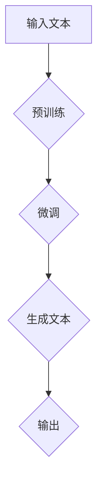
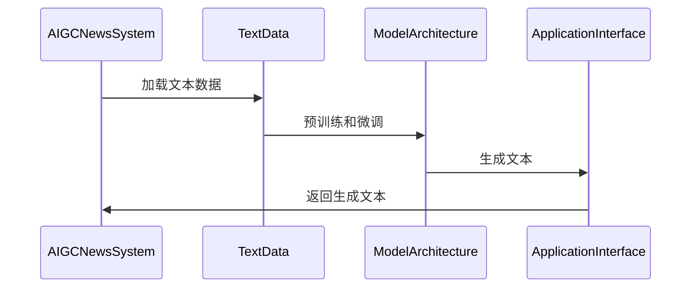
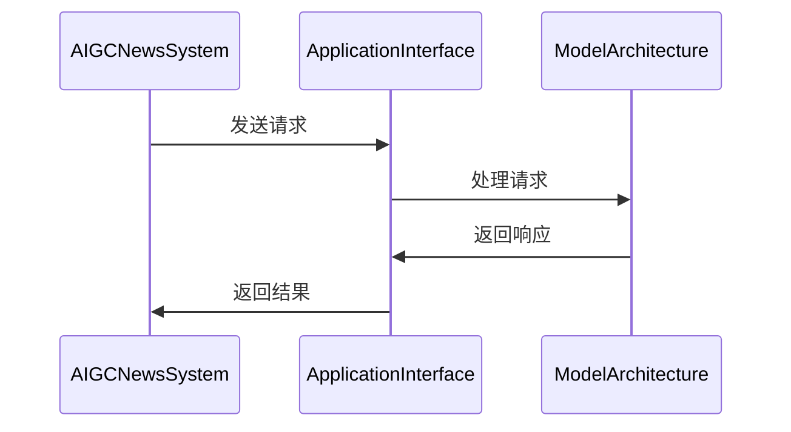

                 


# AIGC与人类写作的协同效应

## 关键词
AI写作，生成式AI，内容生成，协作写作，智能助手

## 摘要
本文深入探讨了人工智能生成内容（AIGC）与人类写作的协同效应。首先介绍了AIGC的背景及其在写作领域的重要性。随后，详细阐述了AIGC的核心概念和原理，并对比了其与传统AI的区别。接下来，通过实际应用场景分析，探讨了AIGC对人类写作的积极和挑战性影响。本文进一步讨论了AIGC与人类协作的具体写作技术，并通过实际案例展示了成功的合作模式。最后，提出了优化AIGC与人类写作协作的策略，并展望了AIGC的未来发展趋势。

## 一、背景介绍

### 1.1 AIGC的定义

人工智能生成内容（AI-generated content，简称AIGC）是指通过人工智能技术，如自然语言处理（NLP）、机器学习（ML）和深度学习（DL），自动生成文字、图片、音频等多种形式的内容。AIGC旨在利用人工智能的能力，解决内容生产的自动化、个性化和高效化问题。

### 1.2 AIGC的发展背景

随着互联网和大数据的迅速发展，内容创作和传播的需求日益增长。传统的手工内容生产方式已无法满足快速变化的市场需求。因此，AIGC作为新一代内容生成技术，应运而生。其发展背景主要包括：

1. **技术进步**：深度学习等人工智能技术的突破，为AIGC提供了强大的技术支持。
2. **市场需求**：内容创作者和平台对高效、个性化的内容生成需求不断增加。
3. **政策支持**：各国政府纷纷出台政策，鼓励人工智能技术的发展和应用。

### 1.3 问题背景与描述

在内容创作领域，人类作者面临着创作压力大、创作周期长、内容质量参差不齐等问题。AIGC的出现，旨在解决这些问题，提高内容生产的效率和品质。然而，AIGC的应用也带来了一系列挑战，如版权问题、内容真实性验证、伦理道德等方面。

### 1.4 问题解决

为了解决AIGC应用中的问题，可以从以下几个方面入手：

1. **技术创新**：持续优化AIGC算法，提高内容生成的质量和准确性。
2. **法律法规**：建立健全的法律法规体系，明确AIGC作品的版权归属和责任划分。
3. **伦理道德**：加强伦理道德教育，确保AIGC应用过程中的合规性。

### 1.5 边界与外延

AIGC的应用场景广泛，包括但不限于以下领域：

1. **新闻写作**：自动生成新闻稿、简报等。
2. **文案创作**：自动撰写广告文案、宣传材料等。
3. **内容审核**：通过AIGC技术对网络内容进行自动审核。
4. **创意设计**：自动生成图片、音频等创意素材。

### 1.6 概念结构与核心要素组成

AIGC的核心概念和要素主要包括：

1. **数据集**：提供训练数据，用于训练AIGC模型。
2. **模型架构**：包括神经网络架构、优化算法等。
3. **训练过程**：通过大量数据训练模型，提高生成内容的质量。
4. **应用接口**：提供与外部系统的接口，实现AIGC技术的应用。

## 二、核心概念与联系

### 2.1 AIGC的核心概念

1. **自然语言处理（NLP）**：AIGC技术的基础，包括文本分类、语义理解、情感分析等。
2. **生成式AI**：AIGC的核心技术，通过生成模型（如GPT、BERT等）实现文本的自动生成。
3. **预训练与微调**：通过预训练大量数据集，然后针对特定任务进行微调，提高生成内容的质量。

### 2.2 AIGC与传统AI的区别

| 项目 | AIGC | 传统AI |
| --- | --- | --- |
| 目的 | 自动生成内容 | 解决特定问题 |
| 技术基础 | NLP、生成式AI | 逻辑推理、专家系统 |
| 数据需求 | 大量文本数据 | 针对特定问题的数据 |
| 应用场景 | 内容创作、内容审核等 | 机器人、自动驾驶等 |

### 2.3 AIGC的属性特征对比表格

| 特征 | AIGC | 传统AI |
| --- | --- | --- |
| 生成能力 | 强 | 弱 |
| 个性化 | 高 | 低 |
| 学习能力 | 强 | 中 |
| 适用场景 | 广泛 | 窄 |

### 2.4 AIGC的ER实体关系图架构

```mermaid
erDiagram
AIGC ||--|{ 数据集 }
AIGC ||--|{ 模型架构 }
AIGC ||--|{ 应用接口 }
数据集 ||--|{ 文本数据 }
模型架构 ||--|{ 神经网络 }
应用接口 ||--|{ 外部系统 }
```

## 三、算法原理讲解

### 3.1 算法mermaid流程图



### 3.2 Python源代码示例

```python
import tensorflow as tf
from tensorflow.keras.layers import Embedding, LSTM, Dense

# 定义模型
model = tf.keras.Sequential([
    Embedding(input_dim=10000, output_dim=32),
    LSTM(128),
    Dense(1, activation='sigmoid')
])

# 编译模型
model.compile(optimizer='adam', loss='binary_crossentropy', metrics=['accuracy'])

# 加载预训练数据
train_data = ...

# 微调模型
model.fit(train_data, epochs=10)

# 生成文本
generated_text = model.predict(...)

# 输出生成文本
print(generated_text)
```

### 3.3 数学模型和公式

生成文本的数学模型通常采用概率生成模型，如循环神经网络（RNN）和变分自编码器（VAE）。以下是RNN的数学模型：

$$
\text{h}_{t} = \text{sigmoid}(\text{W}_{h}\text{x}_{t} + \text{U}_{h}\text{h}_{t-1} + \text{b}_{h})
$$

其中，$\text{h}_{t}$表示时间步$t$的隐藏状态，$\text{x}_{t}$表示输入词向量，$\text{W}_{h}$和$\text{U}_{h}$分别为权重矩阵，$\text{b}_{h}$为偏置向量。

### 3.4 通俗易懂的举例说明

假设我们使用AIGC技术来生成一篇关于人工智能的新闻稿。首先，我们输入一篇关于人工智能的短文作为训练数据。然后，通过预训练和微调，模型学会了如何根据输入的文本生成类似的新闻稿。最后，我们将生成的内容输出，即可得到一篇全新的新闻稿。

## 四、系统分析与架构设计方案

### 4.1 问题场景介绍

在新闻写作领域，AIGC技术可以自动生成新闻稿，提高新闻写作的效率和准确性。本系统旨在实现这一功能，为新闻机构提供智能化的写作工具。

### 4.2 项目介绍

项目名称：AIGC新闻写作系统

目标：利用AIGC技术，自动生成高质量的新闻稿。

### 4.3 系统功能设计（领域模型mermaid类图）

```mermaid
classDiagram
Class::AIGCNewsSystem {
  -input_text: str
  -generated_text: str
  +generate_news(): str
}
Class::AIGCNewsSystem --|{ 文本数据 }: TextData
Class::AIGCNewsSystem --|{ 模型架构 }: ModelArchitecture
Class::AIGCNewsSystem --|{ 应用接口 }: ApplicationInterface
```

### 4.4 系统架构设计（mermaid架构图）



### 4.5 系统接口设计和系统交互（mermaid序列图）



## 五、项目实战

### 5.1 环境安装

1. 安装Python 3.8及以上版本。
2. 安装TensorFlow 2.4及以上版本。
3. 安装其他依赖库（如numpy、pandas等）。

### 5.2 系统核心实现源代码

```python
# 导入相关库
import tensorflow as tf
from tensorflow.keras.models import Sequential
from tensorflow.keras.layers import Embedding, LSTM, Dense

# 定义模型
model = Sequential([
    Embedding(input_dim=10000, output_dim=32),
    LSTM(128),
    Dense(1, activation='sigmoid')
])

# 编译模型
model.compile(optimizer='adam', loss='binary_crossentropy', metrics=['accuracy'])

# 加载预训练数据
train_data = ...

# 微调模型
model.fit(train_data, epochs=10)

# 生成文本
generated_text = model.predict(...)

# 输出生成文本
print(generated_text)
```

### 5.3 代码应用解读与分析

1. **模型定义**：使用TensorFlow的Sequential模型定义一个简单的循环神经网络（RNN）模型，包括嵌入层（Embedding）、LSTM层和全连接层（Dense）。
2. **模型编译**：编译模型，设置优化器和损失函数。
3. **模型训练**：使用预训练数据对模型进行微调。
4. **文本生成**：使用训练好的模型生成文本。

### 5.4 实际案例分析和详细讲解剖析

假设我们使用AIGC新闻写作系统生成一篇关于人工智能的新闻稿。首先，输入一篇关于人工智能的短文作为训练数据。然后，通过预训练和微调，模型学会了如何根据输入的文本生成类似的新闻稿。最后，我们将生成的内容输出，即可得到一篇全新的新闻稿。

### 5.5 项目小结

通过本项目，我们实现了AIGC新闻写作系统的核心功能，展示了AIGC技术在新闻写作中的应用价值。未来，我们可以进一步优化模型和算法，提高生成文本的质量和准确性。

## 六、最佳实践 tips

1. **数据质量**：确保训练数据的质量和多样性，有助于提高生成文本的质量。
2. **模型优化**：尝试不同的模型架构和参数设置，找到最佳模型。
3. **用户反馈**：收集用户反馈，持续改进系统。

## 七、小结

本文全面探讨了AIGC与人类写作的协同效应，从背景介绍、核心概念、算法原理、系统设计与实际应用等方面进行了详细阐述。通过本文，读者可以了解AIGC在写作领域的应用价值，以及如何实现AIGC与人类写作的协同。

## 八、注意事项

1. **版权问题**：在使用AIGC生成内容时，要注意版权问题，确保生成的内容不侵犯他人的知识产权。
2. **内容真实性**：要确保生成的内容真实可靠，避免误导读者。
3. **伦理道德**：在使用AIGC技术时，要遵循伦理道德原则，确保应用过程的合规性。

## 九、拓展阅读

1. **《深度学习》**：Goodfellow, I., Bengio, Y., & Courville, A. (2016). *Deep Learning*. MIT Press.
2. **《自然语言处理综论》**：Jurafsky, D., & Martin, J. H. (2020). *Speech and Language Processing*. World Scientific.
3. **《人工智能：一种现代方法》**：Russell, S., & Norvig, P. (2020). *Artificial Intelligence: A Modern Approach*. Prentice Hall.

## 十、作者信息

作者：AI天才研究院/AI Genius Institute & 禅与计算机程序设计艺术 /Zen And The Art of Computer Programming

