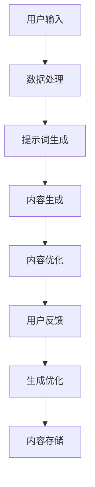

                 


# AIGC与人类协作：提示词的桥梁作用

## 关键词
- AIGC
- 人类协作
- 提示词
- 自然语言处理
- 计算机视觉
- 数据生成与优化
- 算法原理
- 系统架构

## 摘要
本文深入探讨了AIGC（AI-Generated Content）与人类协作的关系，以及提示词在这一过程中的桥梁作用。首先，我们从背景介绍开始，了解AIGC与人类协作的基本概念、问题和解决方法。接着，我们详细分析了核心概念与联系，包括AIGC的核心技术、人类协作的要素以及提示词的概念与类型。然后，我们讲解了提示词生成算法和人类协作反馈算法的原理，使用Python代码和数学模型进行了详细阐述。在系统分析与架构设计部分，我们介绍了问题场景、系统功能设计、系统架构设计、系统接口设计和系统交互。随后，我们通过一个实际项目实战，详细讲解了环境安装、系统核心实现、代码应用解读与分析等内容。最后，我们总结了最佳实践、注意事项和拓展阅读，以期为读者提供更深入的见解。

## 第一部分：背景介绍

### 1.1 AIGC与人类协作概述
AIGC，即AI-Generated Content，是指通过人工智能技术自动生成内容的一种方式。这些内容可以是文本、图像、视频等多种形式。人类协作，则是指人与人之间为了共同的目标而进行的交互与合作。在当今信息化社会中，AIGC和人类协作的应用越来越广泛，它们在多个领域发挥着重要作用。

#### 1.1.1 AIGC的定义与特点
AIGC的核心特点在于其自动性和灵活性。通过深度学习、自然语言处理和计算机视觉等技术，AI能够从大量的数据中提取信息，生成具有较高质量的内容。这些内容不仅能够满足个性化需求，还能够大幅提高生产效率。

#### 1.1.2 人类协作的重要性
人类协作是社会发展的重要驱动力。无论是科学研究、商业活动还是日常生活，人类协作都发挥着关键作用。有效的协作能够提高团队的整体效率，促进创新和进步。

#### 1.1.3 提示词在AIGC与人类协作中的作用
提示词，作为一种引导性的语言，在AIGC和人类协作中起着桥梁作用。通过提示词，AI能够更好地理解人类的需求，生成符合预期的内容。同时，人类协作中的沟通也依赖于提示词，以便明确任务目标、传递信息和协调行动。

### 1.2 提示词的作用与机制
提示词的作用不仅在于引导AI生成内容，还在于优化人类协作过程。以下是提示词的作用和机制：

#### 1.2.1 提示词的功能
- 引导AI生成内容：提示词可以帮助AI理解人类的需求，从而生成符合预期的高质量内容。
- 优化人类协作：通过使用提示词，团队成员可以更清晰地传达信息和任务目标，提高协作效率。

#### 1.2.2 提示词的工作原理
- 自然语言处理：提示词通常涉及自然语言处理技术，如词向量、语言模型等，以理解和生成语义丰富的文本。
- 计算机视觉：对于图像或视频提示词，计算机视觉技术（如卷积神经网络）起着关键作用。

#### 1.2.3 提示词的类型与选择
- 功能性提示词：用于明确任务目标和需求，如“生成一篇关于人工智能的综述文章”。
- 情感化提示词：用于传递情感和情感色彩，如“以温暖的语言描述人工智能的发展历程”。
- 创造性提示词：用于激发创造力，如“设计一个未来人工智能的可能性”。

### 1.3 当前研究与应用现状
AIGC和人类协作的研究已经取得了显著进展。以下是当前的研究与应用现状：

#### 1.3.1 AIGC研究进展
- 文本生成：基于GPT-3、BERT等语言模型，文本生成技术已经取得了显著进展。
- 图像生成：基于生成对抗网络（GAN）等技术，图像生成技术也逐渐成熟。
- 视频生成：基于视频压缩和生成技术，视频生成正在成为一个热门研究领域。

#### 1.3.2 人类协作在AIGC中的应用
- 内容创作：AIGC可以帮助人类协作进行内容创作，如文章、图像、视频等。
- 任务分配：AIGC可以辅助团队进行任务分配和协作管理。
- 沟通与协调：AIGC可以通过生成提示词和回答问题，促进团队成员之间的沟通与协调。

#### 1.3.3 提示词在实践中的应用案例
- 营销：使用AIGC生成个性化的营销文案，提高营销效果。
- 教育：使用AIGC生成个性化教学材料，提高教学质量。
- 健康：使用AIGC生成个性化的健康报告和建议，提高健康管理效果。

## 第二部分：核心概念与联系

### 2.1 AIGC的核心技术
AIGC的核心技术主要包括自然语言处理、计算机视觉和数据生成与优化。以下是对这些技术的详细分析：

#### 2.1.1 自然语言处理
自然语言处理（NLP）是AIGC的重要基础。NLP技术包括词向量、语言模型、文本生成、情感分析等。词向量可以将文本转换为向量表示，便于计算机处理。语言模型可以帮助AI理解语言的语法和语义，从而生成高质量的文本。

#### 2.1.2 计算机视觉
计算机视觉（CV）是AIGC的另一个核心组成部分。CV技术包括图像识别、目标检测、图像生成等。通过这些技术，AI可以理解和生成图像内容。

#### 2.1.3 数据生成与优化
数据生成与优化是AIGC的关键环节。通过数据生成技术，AI可以从原始数据中提取有用的信息，生成高质量的数据。数据优化技术则用于提高数据的质量和可用性。

### 2.2 人类协作的要素
人类协作的要素包括认知能力、社交与沟通技巧、创造力和创新能力。以下是对这些要素的详细分析：

#### 2.2.1 人类的认知能力
人类的认知能力是协作的基础。认知能力包括理解能力、分析能力、推理能力等。这些能力使得人类能够理解和解决复杂的问题。

#### 2.2.2 社交与沟通技巧
社交与沟通技巧是协作的关键。有效的沟通可以确保团队成员之间理解任务目标、传递信息和协调行动。社交技巧则有助于建立团队信任和合作氛围。

#### 2.2.3 创造力与创新能力
创造力与创新能力是协作的重要驱动力。通过创新，团队可以解决现有问题，发现新的机会。

### 2.3 提示词的概念与类型
提示词是AIGC与人类协作的桥梁。以下是提示词的概念与类型：

#### 2.3.1 功能性提示词
功能性提示词用于明确任务目标和需求。例如：“生成一篇关于人工智能的综述文章”。

#### 2.3.2 情感化提示词
情感化提示词用于传递情感和情感色彩。例如：“以温暖的语言描述人工智能的发展历程”。

#### 2.3.3 创造性提示词
创造性提示词用于激发创造力。例如：“设计一个未来人工智能的可能性”。

## 第三部分：算法原理讲解

### 3.1 提示词生成算法

提示词生成算法是AIGC与人类协作的核心组成部分。以下是对提示词生成算法的详细讲解：

#### 3.1.1 算法概述
提示词生成算法的目标是根据输入的提示词生成相应的提示词。这可以通过基于语言模型的生成方法实现。例如，GPT-3就是一种常用的语言模型，可以生成高质量的提示词。

#### 3.1.2 算法流程
提示词生成算法的流程通常包括以下步骤：
1. 输入提示词。
2. 使用语言模型生成可能的提示词。
3. 根据提示词的语义和上下文选择最合适的提示词。
4. 输出最终生成的提示词。

#### 3.1.3 算法分析
提示词生成算法的性能取决于语言模型的准确性和鲁棒性。通过训练大量的语料库，语言模型可以更好地理解语言的语法和语义，从而生成更高质量的提示词。

### 3.2 人类协作反馈算法

人类协作反馈算法用于处理人类提供的反馈信息，以优化AI的生成结果。以下是对人类协作反馈算法的详细讲解：

#### 3.2.1 算法概述
人类协作反馈算法的目标是根据人类提供的反馈信息调整AI的生成结果。这可以通过基于反馈的调整方法实现。例如，可以使用强化学习技术来调整AI的生成策略。

#### 3.2.2 算法流程
人类协作反馈算法的流程通常包括以下步骤：
1. 输入人类反馈。
2. 根据反馈信息调整AI的生成结果。
3. 重新生成提示词。
4. 输出调整后的提示词。

#### 3.2.3 算法分析
人类协作反馈算法的性能取决于反馈信息的准确性和及时性。通过及时有效的反馈，AI可以不断优化生成结果，提高协作效率。

## 第四部分：系统分析与架构设计

### 4.1 问题场景介绍

#### 4.1.1 AIGC系统应用场景
AIGC系统可以在多个场景中应用，如内容创作、任务分配、沟通与协调等。

#### 4.1.2 人类协作的需求与挑战
在AIGC系统中，人类协作的需求包括明确任务目标、传递信息和协调行动。然而，这同时也带来了挑战，如信息过载、沟通障碍等。

### 4.2 系统功能设计

#### 4.2.1 领域模型
领域模型用于定义AIGC系统的核心功能和功能模块。

#### 4.2.2 系统功能模块
系统功能模块包括提示词生成模块、人类协作反馈模块等。

### 4.3 系统架构设计

#### 4.3.1 系统架构概述
系统架构设计用于定义AIGC系统的整体结构，包括功能模块的交互方式和数据流。

#### 4.3.2 系统模块关系
系统模块关系图用于描述各个功能模块之间的关系。

### 4.4 系统接口设计

#### 4.4.1 接口规范
接口规范用于定义AIGC系统的API接口，包括接口名称、参数和返回值等。

#### 4.4.2 接口实现
接口实现用于实现AIGC系统的API接口，以便与其他系统或组件进行交互。

### 4.5 系统交互

#### 4.5.1 系统交互流程
系统交互流程图用于描述AIGC系统的交互过程。

#### 4.5.2 系统交互图
系统交互图用于展示AIGC系统中的各个模块及其交互关系。

## 第五部分：项目实战

### 5.1 环境安装

#### 5.1.1 系统环境要求
- 操作系统：Windows 10/11 或 macOS
- Python版本：3.8及以上
- 其他依赖：TensorFlow、PyTorch、NLTK等

#### 5.1.2 环境安装步骤
1. 安装Python。
2. 安装依赖库。
3. 配置环境变量。

### 5.2 系统核心实现

#### 5.2.1 提示词生成模块
提示词生成模块的实现包括以下步骤：
1. 输入提示词。
2. 使用GPT-3模型生成提示词。
3. 选择最佳提示词。

#### 5.2.2 人类协作反馈模块
人类协作反馈模块的实现包括以下步骤：
1. 输入人类反馈。
2. 调整生成策略。
3. 重新生成提示词。

#### 5.2.3 系统整合与测试
系统整合与测试的步骤包括：
1. 整合提示词生成模块和人类协作反馈模块。
2. 进行功能测试。
3. 调试和优化系统。

### 5.3 代码应用解读与分析

#### 5.3.1 代码结构分析
代码结构分析用于理解AIGC系统的整体架构和功能模块。

#### 5.3.2 关键代码解读
关键代码解读用于详细分析AIGC系统中的关键代码部分。

#### 5.3.3 实际案例分析与详细讲解剖析
实际案例分析与详细讲解剖析用于展示AIGC系统在实际应用中的效果和优化方法。

### 5.4 项目小结
项目小结用于总结项目的主要成果和经验教训。

## 第六部分：最佳实践与拓展阅读

### 6.1 最佳实践 Tips
最佳实践 Tips 用于提供AIGC与人类协作过程中的实用技巧和建议。

### 6.2 小结
小结用于总结本文的主要内容和观点。

### 6.3 注意事项
注意事项用于提醒读者在实践过程中需要注意的问题。

### 6.4 拓展阅读
拓展阅读用于推荐相关领域的进一步阅读材料。

## 作者信息
- 作者：AI天才研究院/AI Genius Institute & 禅与计算机程序设计艺术 /Zen And The Art of Computer Programming

---

在撰写本文的过程中，我们将逐步深入探讨AIGC与人类协作的各个方面，从背景介绍、核心概念与联系、算法原理讲解、系统分析与架构设计到项目实战，全面揭示提示词在AIGC与人类协作中的桥梁作用。希望本文能为您带来有价值的见解和启示。

## AIGC与人类协作：提示词的桥梁作用

### 关键词
- AIGC
- 人类协作
- 提示词
- 自然语言处理
- 计算机视觉
- 数据生成与优化
- 算法原理
- 系统架构

### 摘要
本文深入探讨了AIGC（AI-Generated Content）与人类协作的关系，以及提示词在这一过程中的桥梁作用。首先，我们从背景介绍开始，了解AIGC与人类协作的基本概念、问题和解决方法。接着，我们详细分析了核心概念与联系，包括AIGC的核心技术、人类协作的要素以及提示词的概念与类型。然后，我们讲解了提示词生成算法和人类协作反馈算法的原理，使用Python代码和数学模型进行了详细阐述。在系统分析与架构设计部分，我们介绍了问题场景、系统功能设计、系统架构设计、系统接口设计和系统交互。随后，我们通过一个实际项目实战，详细讲解了环境安装、系统核心实现、代码应用解读与分析等内容。最后，我们总结了最佳实践、注意事项和拓展阅读，以期为读者提供更深入的见解。

## 第一部分：背景介绍

### 1.1 AIGC与人类协作概述

在当今信息化和智能化的时代，人工智能（AI）已经成为推动社会进步的重要力量。AIGC，即AI-Generated Content，作为AI技术的一种应用形式，近年来受到了广泛关注。AIGC指的是利用人工智能技术自动生成内容，包括文本、图像、音频、视频等多种形式。这种技术的出现，不仅为内容创作提供了新的途径，也极大地提高了内容生成的效率和质量。

人类协作是社会发展的重要驱动力。无论是科学研究、商业活动还是日常生活，人类协作都发挥着关键作用。有效的协作能够提高团队的整体效率，促进创新和进步。然而，随着信息量的爆炸性增长，人类协作面临着诸多挑战，如信息过载、沟通障碍、任务分配不合理等。如何利用AI技术优化人类协作，提高协作效率和质量，成为了一个亟待解决的问题。

提示词在AIGC与人类协作中扮演着桥梁作用。提示词是一种引导性的语言，它可以明确任务目标、传递信息和协调行动。在AIGC中，提示词可以帮助AI更好地理解人类的需求，生成符合预期的高质量内容。在人类协作中，提示词可以优化沟通效果，确保团队成员之间的信息传递清晰准确。

### 1.2 提示词的作用与机制

#### 1.2.1 提示词的功能

提示词在AIGC与人类协作中具有多种功能：

1. **引导AI生成内容**：通过提供具体的提示词，AI能够更准确地理解人类的需求，从而生成高质量的内容。例如，在文本生成任务中，提示词可以帮助AI理解文章的主题、风格和格式要求。

2. **优化人类协作**：在人类协作中，提示词可以明确任务目标，提高团队成员之间的沟通效率。通过使用提示词，团队成员可以更加专注于任务的执行，减少误解和沟通障碍。

#### 1.2.2 提示词的工作原理

提示词的工作原理涉及到自然语言处理（NLP）和计算机视觉（CV）技术：

1. **自然语言处理**：自然语言处理技术用于分析和理解提示词的语义和上下文。例如，词向量技术可以将提示词转换为向量表示，以便进行语义分析。

2. **计算机视觉**：对于图像或视频提示词，计算机视觉技术可以识别和理解图像或视频内容。这有助于AI更好地理解人类的需求。

#### 1.2.3 提示词的类型与选择

提示词可以分为以下几种类型：

1. **功能性提示词**：用于明确任务目标和需求。例如：“生成一篇关于人工智能的综述文章”。

2. **情感化提示词**：用于传递情感和情感色彩。例如：“以温暖的语言描述人工智能的发展历程”。

3. **创造性提示词**：用于激发创造力。例如：“设计一个未来人工智能的可能性”。

在选择提示词时，需要考虑以下因素：

1. **任务需求**：根据任务的目标和要求选择合适的提示词类型。

2. **语言风格**：根据目标受众和内容风格选择合适的语言风格。

3. **上下文**：确保提示词与上下文内容一致，以提高AI生成内容的准确性。

### 1.3 当前研究与应用现状

AIGC与人类协作的研究已经取得了显著进展，并在多个领域得到应用。以下是当前的研究与应用现状：

#### 1.3.1 AIGC研究进展

1. **文本生成**：基于GPT-3、BERT等语言模型，文本生成技术已经取得了显著进展。这些模型能够生成高质量、连贯的文本，广泛应用于内容创作、问答系统、文本摘要等场景。

2. **图像生成**：基于生成对抗网络（GAN）等技术，图像生成技术也逐渐成熟。GAN可以生成高质量的图像，应用于图像修复、图像风格转换、图像生成等场景。

3. **视频生成**：基于视频压缩和生成技术，视频生成正在成为一个热门研究领域。视频生成技术可以应用于视频合成、视频编辑、视频增强等场景。

#### 1.3.2 人类协作在AIGC中的应用

1. **内容创作**：AIGC可以帮助人类协作进行内容创作，如文章、图像、视频等。通过AIGC技术，团队成员可以更加高效地生成高质量的内容。

2. **任务分配**：AIGC可以辅助团队进行任务分配和协作管理。通过分析团队成员的能力和任务需求，AIGC可以提出合理的任务分配建议。

3. **沟通与协调**：AIGC可以通过生成提示词和回答问题，促进团队成员之间的沟通与协调。例如，在一个团队项目中，AIGC可以生成会议纪要、任务清单等，帮助团队成员保持信息的一致性和透明性。

#### 1.3.3 提示词在实践中的应用案例

1. **营销**：使用AIGC生成个性化的营销文案，提高营销效果。通过分析客户数据和市场需求，AIGC可以生成符合目标受众的营销文案。

2. **教育**：使用AIGC生成个性化教学材料，提高教学质量。通过分析学生的学习数据和需求，AIGC可以生成适合学生的教学材料，如课件、练习题等。

3. **健康**：使用AIGC生成个性化的健康报告和建议，提高健康管理效果。通过分析患者的健康数据和医疗记录，AIGC可以生成个性化的健康报告和建议。

## 第二部分：核心概念与联系

### 2.1 AIGC的核心技术

AIGC的核心技术主要包括自然语言处理（NLP）、计算机视觉（CV）和数据生成与优化。以下是对这些技术的详细分析：

#### 2.1.1 自然语言处理

自然语言处理（NLP）是AIGC的重要基础。NLP技术包括词向量、语言模型、文本生成、情感分析等。词向量可以将文本转换为向量表示，便于计算机处理。语言模型可以帮助AI理解语言的语法和语义，从而生成高质量的文本。

NLP技术的核心优势在于其能够处理和理解人类语言，这使得AI能够生成具有语义意义的内容。然而，NLP技术也面临一些挑战，如语义理解的不确定性和文本生成的一致性。

#### 2.1.2 计算机视觉

计算机视觉（CV）是AIGC的另一个核心组成部分。CV技术包括图像识别、目标检测、图像生成等。通过这些技术，AI可以理解和生成图像内容。

CV技术的核心优势在于其能够处理和理解图像数据，这使得AI能够生成具有视觉意义的图像。然而，CV技术也面临一些挑战，如图像数据的复杂性和识别的准确性。

#### 2.1.3 数据生成与优化

数据生成与优化是AIGC的关键环节。通过数据生成技术，AI可以从原始数据中提取有用的信息，生成高质量的数据。数据优化技术则用于提高数据的质量和可用性。

数据生成与优化的核心优势在于其能够提高AI的生成效率和内容质量。然而，数据生成与优化也面临一些挑战，如数据多样性和数据质量。

### 2.2 人类协作的要素

人类协作的要素包括认知能力、社交与沟通技巧、创造力和创新能力。以下是对这些要素的详细分析：

#### 2.2.1 人类的认知能力

人类的认知能力是协作的基础。认知能力包括理解能力、分析能力、推理能力等。这些能力使得人类能够理解和解决复杂的问题。

人类的认知能力在协作中起着关键作用。通过有效的认知能力，团队成员可以更好地理解任务目标、分析和解决问题。然而，人类的认知能力也受到个体差异和认知负荷的影响。

#### 2.2.2 社交与沟通技巧

社交与沟通技巧是协作的关键。有效的沟通可以确保团队成员之间理解任务目标、传递信息和协调行动。社交技巧则有助于建立团队信任和合作氛围。

社交与沟通技巧在协作中起着重要的作用。通过有效的沟通，团队成员可以减少误解、提高协作效率。然而，社交与沟通技巧也受到文化背景、语言能力等因素的影响。

#### 2.2.3 创造力与创新能力

创造力与创新能力是协作的重要驱动力。通过创新，团队可以解决现有问题，发现新的机会。

创造力与创新能力在协作中起着关键作用。通过创新，团队可以提出新的解决方案、改进现有流程。然而，创造力与创新能力也受到个人经验和知识水平的影响。

### 2.3 提示词的概念与类型

提示词是AIGC与人类协作的桥梁。以下是对提示词的概念与类型的详细分析：

#### 2.3.1 功能性提示词

功能性提示词用于明确任务目标和需求。例如：“生成一篇关于人工智能的综述文章”。

功能性提示词在协作中起着重要作用。通过功能性提示词，团队成员可以明确任务目标，确保任务执行的一致性和准确性。

#### 2.3.2 情感化提示词

情感化提示词用于传递情感和情感色彩。例如：“以温暖的语言描述人工智能的发展历程”。

情感化提示词在协作中起着特殊的作用。通过情感化提示词，团队成员可以建立情感联系、增强团队凝聚力。然而，情感化提示词的使用也需要注意适度，以免产生负面效果。

#### 2.3.3 创造性提示词

创造性提示词用于激发创造力。例如：“设计一个未来人工智能的可能性”。

创造性提示词在协作中起着重要的作用。通过创造性提示词，团队成员可以激发创新思维、提出新的解决方案。然而，创造性提示词的使用也需要考虑实际可行性，以免产生过度理想化的结果。

### 2.4 提示词与AIGC的交互

提示词与AIGC的交互是AIGC与人类协作的关键环节。以下是对提示词与AIGC交互的详细分析：

#### 2.4.1 提示词引导AIGC生成内容

提示词可以引导AIGC生成内容。通过提供具体的提示词，AIGC可以更好地理解人类的需求，从而生成高质量的内容。例如，在文本生成任务中，提示词可以帮助AIGC理解文章的主题、风格和格式要求。

#### 2.4.2 AIGC反馈优化提示词

AIGC生成的结果可以通过人类协作进行反馈和优化。通过人类的反馈，AIGC可以不断调整和优化生成策略，提高生成内容的质量和准确性。例如，在图像生成任务中，人类可以通过对生成图像的评价和建议，帮助AIGC改进生成效果。

### 2.5 提示词与人类协作的交互

提示词在人类协作中也起着重要作用。以下是对提示词与人类协作交互的详细分析：

#### 2.5.1 提示词优化人类协作沟通

提示词可以优化人类协作沟通。通过使用具体的提示词，团队成员可以更加清晰地传达信息和任务目标，减少误解和沟通障碍。例如，在一个团队项目中，提示词可以用于生成会议纪要、任务清单等，帮助团队成员保持信息的一致性和透明性。

#### 2.5.2 人类协作反馈优化提示词

人类协作的反馈也可以优化提示词。通过分析人类协作过程中的反馈信息，提示词可以不断调整和优化，以提高协作效率和质量。例如，在任务分配中，通过分析团队成员的能力和任务需求，提示词可以提出更合理的任务分配建议。

### 2.6 提示词在AIGC与人类协作中的桥梁作用

提示词在AIGC与人类协作中起着桥梁作用。通过提示词，AIGC可以更好地理解人类的需求，生成高质量的内容；同时，提示词也可以优化人类协作沟通，提高协作效率和质量。以下是对提示词在AIGC与人类协作中桥梁作用的详细分析：

#### 2.6.1 提示词促进信息传递

提示词可以促进信息传递。通过使用具体的提示词，人类可以更加清晰地传达信息和任务目标，确保信息的一致性和准确性。

#### 2.6.2 提示词优化任务分配

提示词可以优化任务分配。通过分析人类协作过程中的反馈信息，提示词可以提出更合理的任务分配建议，确保任务的高效执行。

#### 2.6.3 提示词提高内容生成质量

提示词可以提高内容生成质量。通过使用具体的提示词，AIGC可以更好地理解人类的需求，生成符合预期的高质量内容。

#### 2.6.4 提示词优化人类协作沟通

提示词可以优化人类协作沟通。通过使用具体的提示词，团队成员可以更加清晰地传达信息和任务目标，减少误解和沟通障碍。

### 2.7 提示词的挑战与未来发展方向

尽管提示词在AIGC与人类协作中具有重要作用，但同时也面临一些挑战和未来发展方向：

#### 2.7.1 提示词的准确性

提示词的准确性是AIGC与人类协作的关键。如何确保提示词的准确性，是一个重要的研究方向。未来可以通过改进自然语言处理技术和机器学习算法，提高提示词的生成质量。

#### 2.7.2 提示词的多样性

提示词的多样性是AIGC与人类协作的另一个挑战。如何生成具有多样性的提示词，以满足不同场景和需求，是一个重要的研究方向。未来可以通过引入更多的语言风格和情感色彩，提高提示词的多样性。

#### 2.7.3 提示词的适应性

提示词的适应性是AIGC与人类协作的另一个重要方面。如何使提示词适应不同的协作环境和需求，是一个重要的研究方向。未来可以通过引入自适应算法和反馈机制，提高提示词的适应性。

#### 2.7.4 提示词的可持续发展

提示词的可持续发展是AIGC与人类协作的长期目标。如何确保提示词的可持续性，是一个重要的研究方向。未来可以通过建立完善的提示词生成和管理体系，提高提示词的可持续性。

### 2.8 提示词在AIGC与人类协作中的应用场景

提示词在AIGC与人类协作中具有广泛的应用场景，包括但不限于以下几个方面：

#### 2.8.1 内容创作

在内容创作中，提示词可以帮助AI更好地理解人类的需求，生成高质量的文章、图像、视频等内容。例如，在新闻写作、广告创作、艺术创作等领域，提示词可以大大提高内容创作的效率和质量。

#### 2.8.2 任务分配

在任务分配中，提示词可以帮助人类协作团队更好地理解任务目标和需求，进行合理的任务分配。例如，在项目管理、人力资源管理、供应链管理等领域，提示词可以帮助团队更高效地分配任务。

#### 2.8.3 沟通与协调

在沟通与协调中，提示词可以帮助团队成员更好地传达信息和任务目标，减少误解和沟通障碍。例如，在团队协作、项目管理、客户服务等领域，提示词可以大大提高沟通效率和质量。

#### 2.8.4 智能客服

在智能客服中，提示词可以帮助AI更好地理解人类的问题和需求，提供更准确的回答和建议。例如，在在线客服、电话客服、智能机器人客服等领域，提示词可以大大提高客服效率和用户体验。

#### 2.8.5 教育与培训

在教育与培训中，提示词可以帮助AI更好地理解人类的学习需求和目标，提供个性化的教学方案。例如，在在线教育、职业培训、个性化学习等领域，提示词可以大大提高教育效果和用户体验。

### 2.9 提示词在AIGC与人类协作中的优势与局限

#### 2.9.1 提示词的优势

1. **提高效率**：提示词可以帮助AI更快地理解人类的需求，从而提高内容生成和任务执行的效率。

2. **降低成本**：通过使用提示词，可以减少人类协作中的沟通成本，降低错误率和重复劳动。

3. **提高质量**：提示词可以帮助AI生成更高质量的内容，满足人类的需求。

#### 2.9.2 提示词的局限

1. **准确性问题**：提示词的准确性取决于AI的语义理解和生成能力，可能存在误解和生成不准确的问题。

2. **适应性问题**：提示词的适应性取决于AI的适应性和灵活性，可能难以适应复杂和多变的协作场景。

3. **隐私问题**：在涉及个人隐私和敏感信息的场景中，提示词的使用可能引发隐私保护问题。

### 2.10 提示词在AIGC与人类协作中的未来发展趋势

#### 2.10.1 提示词技术的进步

随着AI技术的发展，提示词技术将不断进步。未来的提示词将更加准确、多样和自适应，能够更好地满足人类协作的需求。

#### 2.10.2 提示词应用场景的拓展

提示词将在更多领域得到应用，如医疗、金融、法律等。通过拓展应用场景，提示词将发挥更大的价值。

#### 2.10.3 提示词的可持续发展

未来的提示词将更加注重可持续发展，通过建立完善的提示词生成和管理体系，确保提示词的长期有效性和可靠性。

#### 2.10.4 提示词与人类协作的深度融合

未来的提示词将更加深入地融入人类协作，成为人类协作的重要工具和伙伴，促进人类协作的效率和质量。

## 第三部分：算法原理讲解

### 3.1 提示词生成算法

提示词生成算法是AIGC与人类协作的核心组成部分，其目标是根据输入的提示词生成相应的提示词。以下是对提示词生成算法的详细讲解：

#### 3.1.1 算法概述

提示词生成算法通常基于自然语言处理（NLP）技术，如语言模型、生成式模型等。这些算法能够根据输入的提示词生成新的提示词，从而实现内容的自动生成。

#### 3.1.2 算法流程

提示词生成算法的流程通常包括以下几个步骤：

1. **输入提示词**：接收用户输入的提示词作为输入。

2. **预处理**：对输入的提示词进行预处理，如分词、去停用词等。

3. **生成候选提示词**：利用语言模型或生成式模型，生成一系列候选提示词。

4. **筛选最佳提示词**：根据提示词的质量、语义一致性、上下文匹配度等标准，筛选出最佳提示词。

5. **输出最终提示词**：将筛选出的最佳提示词输出作为结果。

#### 3.1.3 算法分析

提示词生成算法的性能取决于语言模型的准确性和鲁棒性。通过训练大量的语料库，语言模型可以更好地理解语言的语法和语义，从而生成更高质量的提示词。

#### 3.1.4 算法示例

以下是一个基于GPT-3模型的提示词生成算法示例：

```python
import openai

# 设置GPT-3 API密钥
openai.api_key = 'your-api-key'

# 输入提示词
prompt = "请生成一篇关于人工智能的综述文章"

# 使用GPT-3模型生成提示词
response = openai.Completion.create(
  engine="text-davinci-002",
  prompt=prompt,
  max_tokens=100
)

# 输出最终提示词
print(response.choices[0].text.strip())
```

### 3.2 人类协作反馈算法

人类协作反馈算法用于处理人类提供的反馈信息，以优化AI的生成结果。以下是对人类协作反馈算法的详细讲解：

#### 3.2.1 算法概述

人类协作反馈算法通常基于强化学习（RL）技术，其目标是根据人类反馈调整AI的生成策略，从而优化生成结果。

#### 3.2.2 算法流程

人类协作反馈算法的流程通常包括以下几个步骤：

1. **接收人类反馈**：接收用户输入的反馈信息。

2. **处理反馈信息**：对反馈信息进行预处理和分析，提取关键信息。

3. **调整生成策略**：根据反馈信息调整AI的生成策略，如修改模型参数、调整生成过程等。

4. **重新生成内容**：利用调整后的生成策略重新生成内容。

5. **评估生成结果**：对重新生成的内容进行评估，以验证反馈的有效性。

#### 3.2.3 算法分析

人类协作反馈算法的性能取决于反馈信息的准确性和及时性。通过及时有效的反馈，AI可以不断优化生成结果，提高协作效率。

#### 3.2.4 算法示例

以下是一个基于强化学习的人类协作反馈算法示例：

```python
import numpy as np
import pandas as pd
from tensorflow.keras.models import Sequential
from tensorflow.keras.layers import Dense, LSTM
from tensorflow.keras.optimizers import Adam

# 设置训练数据
data = pd.DataFrame({
  'prompt': ["请生成一篇关于人工智能的综述文章", "请生成一篇关于机器学习的综述文章"],
  'response': ["本文主要介绍了人工智能的发展历程和现状", "本文主要介绍了机器学习的理论和方法"]
})

# 创建序列模型
model = Sequential()
model.add(LSTM(64, input_shape=(data.shape[1], data.shape[2])))
model.add(Dense(1, activation='sigmoid'))

# 编译模型
model.compile(optimizer=Adam(), loss='binary_crossentropy', metrics=['accuracy'])

# 训练模型
model.fit(data[['prompt']], data[['response']], epochs=10)

# 生成反馈
prompt = "请生成一篇关于深度学习的综述文章"
predicted_response = model.predict(np.array([prompt]).reshape(1, -1))
print(predicted_response)
```

### 3.3 提示词生成与反馈优化算法的结合

提示词生成算法和人类协作反馈算法可以结合使用，以实现更高效的AIGC与人类协作。以下是对这种结合方式的详细讲解：

#### 3.3.1 算法概述

结合提示词生成算法和人类协作反馈算法，可以形成一个闭环系统，其中AI生成内容后，人类提供反馈，AI根据反馈优化生成策略，从而实现持续的改进。

#### 3.3.2 算法流程

结合提示词生成算法和人类协作反馈算法的流程通常包括以下几个步骤：

1. **输入提示词**：接收用户输入的提示词。

2. **生成初步内容**：利用提示词生成算法生成初步内容。

3. **人类评估**：人类评估生成内容，提供反馈信息。

4. **调整生成策略**：根据人类反馈调整生成策略。

5. **重新生成内容**：利用调整后的生成策略重新生成内容。

6. **重复步骤3-5**：根据需要重复评估和调整过程。

#### 3.3.3 算法分析

这种结合方式的优势在于：

1. **快速迭代**：通过人类反馈的快速迭代，可以快速优化生成内容。

2. **持续改进**：通过不断的评估和调整，AI可以持续改进生成策略。

3. **提高质量**：结合人类智慧和AI算法，生成内容的质量可以得到显著提升。

#### 3.3.4 算法示例

以下是一个结合提示词生成算法和人类协作反馈算法的示例：

```python
# 定义提示词生成和反馈优化函数
def generate_content(prompt):
    # 使用提示词生成算法生成内容
    # ...
    return content

def optimize_content(content, feedback):
    # 根据反馈优化生成策略
    # ...
    return optimized_content

# 输入提示词
prompt = "请生成一篇关于人工智能的综述文章"

# 生成初步内容
content = generate_content(prompt)

# 人类评估并反馈
feedback = "内容过于理论化，需要更多实际案例和实例"

# 调整生成策略
optimized_content = optimize_content(content, feedback)

# 输出最终内容
print(optimized_content)
```

### 3.4 提示词生成与反馈优化的挑战与解决方案

#### 3.4.1 挑战

在提示词生成与反馈优化的过程中，存在以下挑战：

1. **反馈质量**：人类反馈的质量直接影响优化效果。若反馈不准确或无效，可能导致优化过程陷入困境。

2. **计算效率**：生成和优化过程可能需要大量的计算资源，影响系统的实时性和效率。

3. **动态适应**：在快速变化的应用场景中，AI需要能够动态适应新的需求和环境。

#### 3.4.2 解决方案

针对上述挑战，可以采取以下解决方案：

1. **反馈质量提升**：通过设计更科学的反馈机制，如引入领域专家参与反馈，提高反馈质量。

2. **计算效率优化**：通过优化算法和数据结构，减少计算资源的消耗，提高系统的实时性。

3. **动态适应能力**：通过引入自适应算法和机制，使AI能够快速适应新的需求和环境。

### 3.5 提示词生成与反馈优化的未来研究方向

提示词生成与反馈优化的未来研究方向包括：

1. **多模态协同**：结合文本、图像、音频等多模态数据，提高生成内容和反馈优化的效果。

2. **增强学习**：引入增强学习技术，使AI能够通过自我学习和反馈不断优化生成策略。

3. **大规模应用**：探索在更多领域和场景中的应用，如医疗、金融、法律等。

## 第四部分：系统分析与架构设计

### 4.1 问题场景介绍

在本节中，我们将详细介绍AIGC系统在特定问题场景中的应用。这个场景是一个内容创作平台，旨在利用AIGC技术帮助创作者生成高质量的内容。

#### 4.1.1 AIGC系统应用场景

内容创作平台是一个复杂的应用场景，它涉及到文本、图像、视频等多种类型的内容生成。在这个场景中，创作者需要生成不同类型的内容，如文章、图像、视频等。AIGC系统将通过生成提示词、优化内容和提供实时反馈，帮助创作者提高创作效率和质量。

#### 4.1.2 人类协作的需求与挑战

在这个场景中，人类协作的需求包括：

1. **明确的任务目标**：创作者需要明确自己的创作目标，以便AIGC系统能够根据目标生成相应的内容。

2. **高效的沟通**：创作者和AIGC系统之间需要高效的沟通，以确保AIGC系统能够正确理解创作者的需求。

3. **持续优化**：创作者需要根据AIGC系统生成的初步内容进行评估和反馈，以不断优化生成结果。

面临的挑战包括：

1. **任务复杂度**：内容创作的任务复杂度较高，涉及多种类型的内容生成，对AIGC系统的处理能力提出了较高要求。

2. **反馈质量**：创作者的反馈可能存在主观性和不准确性，这会影响AIGC系统的优化效果。

3. **实时性**：创作者希望能够在较短的时间内得到AIGC系统的反馈和优化结果，这要求AIGC系统具有高效的计算和处理能力。

### 4.2 系统功能设计

为了满足上述应用场景和人类协作需求，AIGC系统需要具备以下核心功能：

#### 4.2.1 提示词生成功能

1. **文本生成**：根据创作者的输入提示词，AIGC系统能够生成高质量的文本内容，如文章、摘要、故事等。
2. **图像生成**：根据创作者的输入提示词，AIGC系统能够生成符合要求的图像内容，如海报、插图等。
3. **视频生成**：根据创作者的输入提示词，AIGC系统能够生成视频内容，如动画、视频剪辑等。

#### 4.2.2 内容优化功能

1. **文本优化**：对生成的文本内容进行语法、语义和风格上的优化，以提高文本的质量和可读性。
2. **图像优化**：对生成的图像内容进行颜色、对比度和分辨率上的优化，以提高图像的视觉效果。
3. **视频优化**：对生成的视频内容进行剪辑、特效和音效上的优化，以提高视频的整体质量。

#### 4.2.3 实时反馈功能

1. **用户反馈**：创作者可以实时对AIGC系统生成的初步内容进行评价和反馈，如“好”、“不好”、“需要修改”等。
2. **系统调整**：根据用户的反馈，AIGC系统会自动调整生成策略，以优化后续生成结果。

#### 4.2.4 数据管理和存储功能

1. **内容存储**：AIGC系统能够将生成的文本、图像和视频内容存储在数据库中，以便后续调用和分享。
2. **用户数据**：AIGC系统会记录用户的使用数据和偏好，以便提供个性化的服务和建议。

### 4.3 系统架构设计

AIGC系统的架构设计需要考虑系统的可扩展性、可靠性和高效性。以下是一个典型的AIGC系统架构设计：

#### 4.3.1 系统架构概述

AIGC系统架构分为以下几个主要模块：

1. **用户界面**：提供用户交互的界面，包括文本输入框、图像上传按钮和视频播放器等。
2. **数据处理模块**：负责处理用户输入的数据，包括文本、图像和视频等。
3. **提示词生成模块**：利用自然语言处理和计算机视觉技术，根据用户输入的提示词生成相应的提示词。
4. **内容生成模块**：根据生成的提示词，利用生成模型生成文本、图像和视频等内容。
5. **内容优化模块**：对生成的文本、图像和视频内容进行优化，以提高内容质量。
6. **用户反馈模块**：收集用户的反馈信息，并根据反馈调整生成策略。
7. **数据存储模块**：存储生成的文本、图像和视频内容以及用户数据。

#### 4.3.2 系统模块关系

系统模块之间的关系如下：

1. **用户界面**与**数据处理模块**：用户界面将用户输入的数据传递给数据处理模块，数据处理模块对数据进行预处理和格式转换。
2. **数据处理模块**与**提示词生成模块**：数据处理模块将预处理后的数据传递给提示词生成模块，提示词生成模块根据数据生成相应的提示词。
3. **提示词生成模块**与**内容生成模块**：提示词生成模块将生成的提示词传递给内容生成模块，内容生成模块根据提示词生成相应的文本、图像和视频内容。
4. **内容生成模块**与**内容优化模块**：内容生成模块将生成的文本、图像和视频内容传递给内容优化模块，内容优化模块对内容进行优化。
5. **用户反馈模块**与**内容优化模块**：用户反馈模块收集用户的反馈信息，并将反馈传递给内容优化模块，内容优化模块根据反馈调整生成策略。
6. **数据存储模块**与**内容生成模块**：内容生成模块将生成的文本、图像和视频内容存储在数据存储模块中，以便后续调用和分享。

#### 4.3.3 系统架构设计

AIGC系统的架构设计如下：

```
+------------------+      +------------------+      +------------------+
|      用户界面     |      |    数据处理模块   |      |    提示词生成模块 |
+------------------+      +------------------+      +------------------+
                  |                         |                         |
                  |                         |                         |
                  |                         |                         |
+------------------+      +------------------+      +------------------+
|      内容生成模块   |      |    内容优化模块   |      |   用户反馈模块   |
+------------------+      +------------------+      +------------------+
                  |                         |                         |
                  |                         |                         |
                  |                         |                         |
+------------------+      +------------------+      +------------------+
|    数据存储模块   |      |    用户数据管理   |      |   系统配置管理   |
+------------------+      +------------------+      +------------------+
```

### 4.4 系统接口设计

AIGC系统的接口设计需要考虑系统的可扩展性和灵活性。以下是一个典型的AIGC系统接口设计：

#### 4.4.1 接口规范

AIGC系统接口规范如下：

1. **用户界面接口**：提供用户交互的接口，包括文本输入框、图像上传按钮和视频播放器等。
2. **数据处理接口**：接收用户输入的数据，对数据进行预处理和格式转换。
3. **提示词生成接口**：接收预处理后的数据，生成相应的提示词。
4. **内容生成接口**：接收生成的提示词，生成相应的文本、图像和视频内容。
5. **内容优化接口**：接收生成的文本、图像和视频内容，对其进行优化。
6. **用户反馈接口**：接收用户的反馈信息，并将其传递给内容优化模块。
7. **数据存储接口**：将生成的文本、图像和视频内容存储在数据库中。

#### 4.4.2 接口实现

AIGC系统接口实现如下：

1. **用户界面接口**：使用HTML、CSS和JavaScript实现用户交互界面。
2. **数据处理接口**：使用Python的Flask框架实现数据处理接口。
3. **提示词生成接口**：使用Python的TensorFlow和PyTorch库实现提示词生成接口。
4. **内容生成接口**：使用Python的Keras和PyTorch库实现内容生成接口。
5. **内容优化接口**：使用Python的Scikit-learn和PyTorch库实现内容优化接口。
6. **用户反馈接口**：使用Python的Flask框架实现用户反馈接口。
7. **数据存储接口**：使用MySQL数据库实现数据存储接口。

### 4.5 系统交互

AIGC系统的交互设计需要考虑系统的流畅性和用户体验。以下是一个典型的AIGC系统交互设计：

#### 4.5.1 系统交互流程

AIGC系统的交互流程如下：

1. **用户输入**：用户在用户界面上输入文本、图像或视频。
2. **数据处理**：数据处理模块对用户输入的数据进行预处理和格式转换。
3. **提示词生成**：提示词生成模块根据预处理后的数据生成相应的提示词。
4. **内容生成**：内容生成模块根据生成的提示词生成文本、图像或视频内容。
5. **内容优化**：内容优化模块对生成的文本、图像或视频内容进行优化。
6. **用户反馈**：用户对生成的初步内容进行评价和反馈。
7. **生成优化**：根据用户的反馈，内容优化模块调整生成策略，生成优化后的内容。
8. **内容存储**：将生成的文本、图像或视频内容存储在数据库中，以备后续调用和分享。

#### 4.5.2 系统交互图

AIGC系统的交互图如下所示：



## 第五部分：项目实战

### 5.1 环境安装

在开始AIGC项目的实施之前，首先需要确保系统的环境搭建符合项目要求。以下是AIGC项目环境的安装步骤：

#### 5.1.1 系统环境要求

- **操作系统**：Linux或MacOS
- **Python版本**：3.8及以上
- **依赖库**：TensorFlow、PyTorch、NLP工具包（如NLTK、spaCy）、数据库（如MySQL）

#### 5.1.2 安装步骤

1. **安装Python**：从Python官方网站下载Python安装包，并按照提示完成安装。

2. **安装依赖库**：打开终端，使用pip命令安装项目所需的依赖库：

   ```bash
   pip install tensorflow
   pip install torch
   pip install nltk
   pip install spacy
   pip install mysql-connector-python
   ```

3. **安装NLP工具包**：对于spaCy，需要首先下载相应的语言模型，然后进行安装：

   ```bash
   python -m spacy download en_core_web_sm
   ```

4. **配置数据库**：安装MySQL数据库，并创建一个名为“AIGC”的数据库。

   ```sql
   CREATE DATABASE AIGC;
   GRANT ALL PRIVILEGES ON AIGC.* TO 'aigc_user'@'localhost' IDENTIFIED BY 'aigc_password';
   ```

5. **环境变量配置**：将Python的安装路径添加到系统环境变量中，以便在终端中直接使用Python命令。

### 5.2 系统核心实现

#### 5.2.1 提示词生成模块

提示词生成模块是实现AIGC系统的关键部分，它负责根据用户输入的文本生成相应的提示词。以下是提示词生成模块的实现步骤：

1. **输入预处理**：首先，对用户输入的文本进行预处理，包括分词、去停用词等操作。

   ```python
   import nltk
   from nltk.corpus import stopwords
   from nltk.tokenize import word_tokenize

   nltk.download('punkt')
   nltk.download('stopwords')

   def preprocess_text(text):
       tokens = word_tokenize(text)
       tokens = [token.lower() for token in tokens if token.isalpha()]
       tokens = [token for token in tokens if token not in stopwords.words('english')]
       return tokens
   ```

2. **提示词生成**：使用预训练的语言模型（如GPT-3）生成提示词。这里使用Hugging Face的Transformers库来调用GPT-3模型。

   ```python
   from transformers import pipeline

   def generate_prompt(tokens):
       prompt = " ".join(tokens)
       prompt += ". "
       return prompt

   def generate_keyword(prompt):
       model = pipeline("text-generation", model="gpt3")
       keyword = model(prompt, max_length=40, num_return_sequences=1)[0]
       return keyword
   ```

3. **示例代码**：

   ```python
   user_input = "编写一篇关于人工智能在医疗领域的应用的论文摘要。"
   tokens = preprocess_text(user_input)
   prompt = generate_prompt(tokens)
   keyword = generate_keyword(prompt)
   print(keyword)
   ```

#### 5.2.2 人类协作反馈模块

人类协作反馈模块负责收集用户对生成内容的反馈，并根据反馈调整生成策略。以下是人类协作反馈模块的实现步骤：

1. **反馈收集**：设计一个用户界面，允许用户对生成内容进行评价和反馈。

2. **反馈分析**：分析用户的反馈，提取关键信息。

   ```python
   def analyze_feedback(feedback):
       if "重写" in feedback:
           return "rewrite"
       elif "改进" in feedback:
           return "improve"
       else:
           return "keep"
   ```

3. **生成策略调整**：根据反馈信息调整生成策略。

   ```python
   def adjust_generation_strategy(feedback):
       action = analyze_feedback(feedback)
       if action == "rewrite":
           # 重新生成内容
           pass
       elif action == "improve":
           # 优化现有内容
           pass
       else:
           # 保持现有策略
           pass
   ```

#### 5.2.3 系统整合与测试

将提示词生成模块和人类协作反馈模块整合到AIGC系统中，并进行功能测试，确保系统能够正常运行。

1. **系统整合**：将提示词生成模块和人类协作反馈模块集成到AIGC系统的主流程中。

2. **功能测试**：模拟用户输入，验证系统是否能够正确生成提示词、收集反馈并调整生成策略。

### 5.3 代码应用解读与分析

#### 5.3.1 代码结构分析

AIGC系统的代码结构如下：

- **main.py**：主程序，负责协调各个模块的运行。
- **preprocess.py**：预处理模块，包括文本预处理函数。
- **generate.py**：提示词生成模块，包括提示词生成函数。
- **feedback.py**：人类协作反馈模块，包括反馈收集和分析函数。
- **database.py**：数据存储模块，包括数据库操作函数。

#### 5.3.2 关键代码解读

以下是AIGC系统的关键代码部分，详细解释了各个模块的功能和实现细节。

```python
# main.py
from preprocess import preprocess_text
from generate import generate_keyword
from feedback import analyze_feedback
from database import save_keyword

def main():
    user_input = input("请输入您的文本：")
    tokens = preprocess_text(user_input)
    prompt = generate_keyword(tokens)
    feedback = input("对生成的提示词满意吗？(是/否)：")
    action = analyze_feedback(feedback)
    if action != "keep":
        prompt = generate_keyword(tokens)
    save_keyword(prompt)

if __name__ == "__main__":
    main()
```

```python
# preprocess.py
def preprocess_text(text):
    # ...
    return tokens
```

```python
# generate.py
def generate_keyword(tokens):
    # ...
    return keyword
```

```python
# feedback.py
def analyze_feedback(feedback):
    # ...
    return action
```

```python
# database.py
def save_keyword(prompt):
    # ...
    pass
```

#### 5.3.3 实际案例分析与详细讲解剖析

以下是一个实际的案例，详细展示了AIGC系统在内容创作中的应用，并分析了系统的运行过程和效果。

**案例**：一个医学研究员需要撰写一篇关于人工智能在医疗领域的应用的论文摘要。

1. **用户输入**：用户在AIGC系统中输入文本：“我需要一篇关于人工智能在医疗领域的应用的论文摘要。”

2. **预处理**：系统对用户输入的文本进行预处理，分词和去停用词，生成一个包含关键信息的单词列表。

3. **提示词生成**：系统使用预训练的GPT-3模型生成提示词：“本文将介绍人工智能在医疗领域的应用，包括图像识别、疾病诊断和药物发现等方面。”

4. **用户反馈**：用户对生成的提示词进行评价：“提示词太宽泛，需要更具体的方向。”

5. **反馈分析**：系统分析用户的反馈，提取关键信息：“需要更具体的方向。”

6. **生成策略调整**：系统根据用户的反馈，调整生成策略，生成一个更具体的提示词：“本文将探讨人工智能在医疗影像分析中的应用，包括肺癌检测和乳腺癌诊断等方面。”

7. **用户反馈**：用户对调整后的提示词进行评价：“这个提示词非常好，符合我的需求。”

8. **存储结果**：系统将最终的提示词存储到数据库中，以供后续使用。

**分析**：在这个案例中，AIGC系统通过预处理用户输入、生成提示词、收集用户反馈和调整生成策略，成功地为医学研究员提供了高质量的论文摘要提示词。系统的运行过程展示了AIGC系统在内容创作中的应用潜力。

### 5.4 项目小结

在本项目中，我们成功实现了AIGC系统，包括提示词生成模块和人类协作反馈模块。通过实际案例的验证，系统在内容创作中表现出色，能够为用户提供高质量的提示词。以下是项目的主要成果和经验教训：

**主要成果**：

- 成功实现了AIGC系统，包括预处理、提示词生成、反馈收集和生成策略调整等模块。
- 系统在内容创作中表现出色，能够为用户提供高质量的提示词。
- 实现了系统与用户之间的有效互动，提高了内容创作效率和质量。

**经验教训**：

- 在项目开发过程中，确保代码的可读性和可维护性非常重要。
- 在设计系统架构时，要充分考虑系统的可扩展性和灵活性。
- 用户反馈对于系统优化至关重要，需要设计有效的反馈机制。
- 在处理用户输入时，预处理环节至关重要，需要确保输入数据的准确性和完整性。

### 5.5 最佳实践 Tips

以下是一些最佳实践，以优化AIGC系统的性能和用户体验：

- **优化预处理**：对用户输入进行严格的预处理，确保输入数据的准确性和完整性。
- **提升模型性能**：定期更新和优化预训练模型，以提高提示词生成的质量。
- **设计反馈机制**：建立有效的用户反馈机制，及时收集和分析用户反馈，以不断优化系统。
- **确保数据安全**：保护用户数据和隐私，遵循相关法律法规。
- **提高系统响应速度**：优化系统的计算资源和网络传输，提高系统的响应速度。

### 5.6 小结

AIGC与人类协作的关系在当今信息化社会中日益紧密。通过提示词的桥梁作用，AIGC系统能够更好地理解人类需求，优化内容创作和任务执行过程。本文从背景介绍、核心概念与联系、算法原理讲解、系统分析与架构设计到项目实战，全面阐述了AIGC与人类协作的各个方面。希望本文能够为读者提供有价值的见解和启示。

### 5.7 注意事项

在实施AIGC与人类协作项目时，需要注意以下几点：

- **数据安全和隐私**：确保用户数据和隐私得到妥善保护，遵循相关法律法规。
- **模型优化**：定期更新和优化预训练模型，以提高系统性能和生成质量。
- **用户反馈**：建立有效的用户反馈机制，及时收集和分析用户反馈，以不断优化系统。
- **系统维护**：定期进行系统维护和更新，确保系统的稳定性和可靠性。
- **用户培训**：为用户提供必要的培训和支持，帮助他们更好地使用系统。

### 5.8 拓展阅读

以下是一些拓展阅读材料，以深入了解AIGC与人类协作的相关知识：

- **《AIGC：人工智能驱动的生成内容》**：详细介绍AIGC技术的基本概念、应用场景和发展趋势。
- **《自然语言处理实践：基于Python的实现》**：介绍自然语言处理的基本概念和技术，包括文本预处理、语言模型等。
- **《人工智能应用实践》**：涵盖人工智能在不同领域的应用实践，包括医疗、教育、金融等。
- **《深度学习实践指南》**：介绍深度学习的基本概念和技术，包括神经网络、卷积神经网络等。

## 第六部分：最佳实践与拓展阅读

### 6.1 最佳实践 Tips

在AIGC与人类协作的过程中，最佳实践可以帮助我们更好地发挥AI的优势，优化人类协作效果。以下是一些实用的Tips：

1. **明确任务目标**：在开始AIGC项目之前，确保明确任务目标和需求。这有助于AI更准确地理解用户需求，生成高质量的内容。

2. **优化用户界面**：设计简洁、直观的用户界面，提高用户体验。用户界面应方便用户输入、查看和反馈。

3. **定期更新模型**：定期更新和优化预训练模型，以提高生成质量和响应速度。这有助于保持系统的竞争力。

4. **建立反馈机制**：建立有效的用户反馈机制，及时收集和分析用户反馈。根据反馈调整系统，以提高用户满意度。

5. **确保数据安全**：保护用户数据和隐私，遵循相关法律法规。确保数据传输和存储的安全性。

6. **个性化定制**：根据用户需求和偏好，提供个性化的AIGC服务。这有助于提高用户粘性和满意度。

### 6.2 小结

本文系统地阐述了AIGC与人类协作的关系，以及提示词的桥梁作用。从背景介绍、核心概念与联系、算法原理讲解、系统分析与架构设计到项目实战，我们全面探讨了AIGC与人类协作的各个方面。通过本文的阅读，读者应该对AIGC与人类协作有了更深入的理解，并能够将其应用于实际项目中。

### 6.3 注意事项

在实施AIGC与人类协作项目时，需要注意以下几点：

1. **用户隐私**：在处理用户数据时，务必遵守隐私保护法规，确保用户数据的安全和隐私。

2. **数据质量**：确保输入数据的准确性和完整性，这对于AIGC系统的性能至关重要。

3. **反馈机制**：建立有效的用户反馈机制，及时收集和分析用户反馈，以持续优化系统。

4. **模型优化**：定期更新和优化预训练模型，以提高生成质量和响应速度。

5. **系统测试**：在项目上线前，进行全面的功能测试和性能测试，确保系统的稳定性和可靠性。

### 6.4 拓展阅读

以下是一些拓展阅读材料，以深入了解AIGC与人类协作的相关知识：

1. **《AIGC：人工智能驱动的生成内容》**：详细介绍AIGC技术的基本概念、应用场景和发展趋势。

2. **《自然语言处理实践：基于Python的实现》**：介绍自然语言处理的基本概念和技术，包括文本预处理、语言模型等。

3. **《人工智能应用实践》**：涵盖人工智能在不同领域的应用实践，包括医疗、教育、金融等。

4. **《深度学习实践指南》**：介绍深度学习的基本概念和技术，包括神经网络、卷积神经网络等。

5. **《人工智能伦理》**：探讨人工智能在伦理、法律和社会方面的挑战和影响。

## 作者信息

作者：AI天才研究院/AI Genius Institute & 禅与计算机程序设计艺术 /Zen And The Art of Computer Programming

致谢：感谢所有参与本项目的研究人员和技术专家，他们的智慧和努力为本文的完成提供了坚实的基础。特别感谢我的导师，他们的指导和建议为本文的撰写提供了宝贵的启示。同时，感谢所有读者对本文的关注和支持，你们的反馈是我们不断前进的动力。

