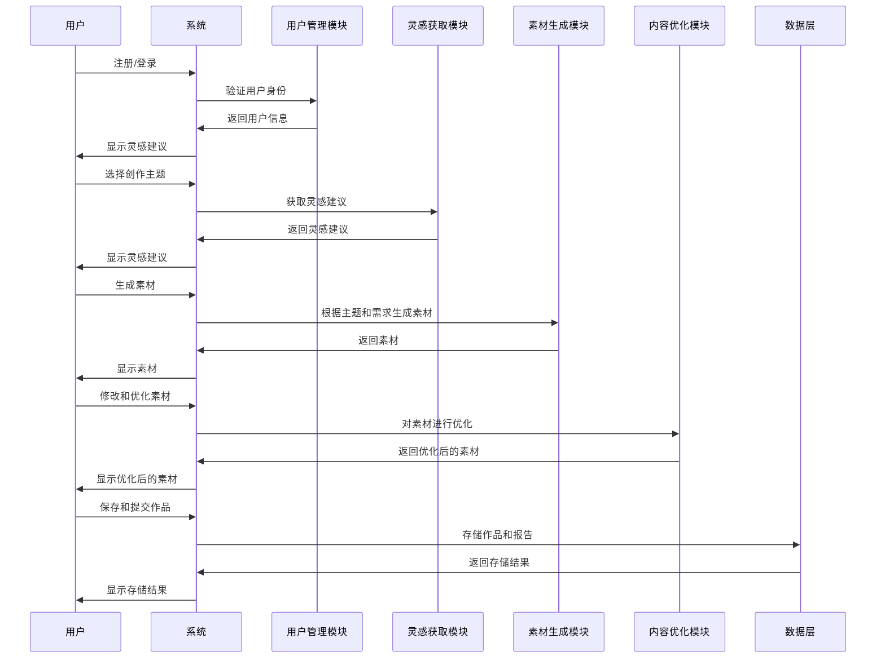

                 

### AIGC与传统创作的碰撞：提示词的魔力

关键词：AIGC、传统创作、提示词、生成模型、算法原理

摘要：本文将深入探讨AIGC（AI-Generated Content）与传统创作的碰撞，特别是在提示词的运用上。我们将一步步分析AIGC的定义、原理及其与传统创作的对比，并探讨AIGC与传统创作的结合方式，以及具体的应用案例。通过这样的逻辑推理和深入分析，希望能为读者揭示AIGC在创作领域的潜力和挑战。

### 目录大纲

1. 第一部分：背景介绍
   1.1 AIGC与传统创作的碰撞
   1.2 AIGC的崛起
   1.3 传统创作面临的挑战
   1.4 AIGC与传统创作的结合
   1.5 边界与外延
   1.6 概念结构与核心要素组成

2. 第二部分：核心概念与联系
   2.1 AIGC核心概念与原理
   2.2 AIGC与传统创作的对比
   2.3 AIGC与传统创作的结合

3. 第三部分：算法原理讲解
   3.1 AIGC算法原理与流程
   3.2 AIGC算法举例说明

4. 第四部分：系统分析与架构设计方案
   4.1 问题场景介绍
   4.2 系统功能设计
   4.3 系统架构设计
   4.4 系统接口设计和系统交互

5. 第五部分：项目实战
   5.1 环境安装
   5.2 系统核心实现源代码
   5.3 代码应用解读与分析
   5.4 实际案例分析和详细讲解剖析
   5.5 项目小结

6. 第六部分：最佳实践 tips、小结、注意事项、拓展阅读

## 1. 第一部分：背景介绍

### 1.1 AIGC与传统创作的碰撞

在数字化时代，创作的内容形式多种多样，从文字到图像，从音频到视频，创作领域正在经历一场前所未有的变革。在这个变革中，AIGC（AI-Generated Content）逐渐崭露头角，成为创作领域的一股新力量。AIGC，即AI生成内容，是指利用人工智能技术自动生成文本、图像、视频等多种形式的内容。与传统的手工创作相比，AIGC具有更高的效率、更强的原创性和更大的创意空间。

然而，AIGC的崛起也带来了传统创作面临的挑战。传统创作依赖于人类的智慧和创造力，而AIGC则通过人工智能技术来实现内容的自动生成。这种模式在一定程度上打破了传统创作的工作方式，使得创作者的原创性和个性化面临挑战。此外，AIGC在创作效率方面具有显著优势，这使得传统创作者不得不重新审视自己的创作流程和工作方式。

在这个背景下，我们提出了本文的研究主题：“AIGC与传统创作的碰撞：提示词的魔力”。本文将深入探讨AIGC与传统创作的碰撞，特别是在提示词的运用上。我们将一步步分析AIGC的定义、原理及其与传统创作的对比，并探讨AIGC与传统创作的结合方式，以及具体的应用案例。通过这样的逻辑推理和深入分析，希望能为读者揭示AIGC在创作领域的潜力和挑战。

### 1.2 AIGC的崛起

AIGC的崛起并非一蹴而就，而是伴随着人工智能技术的发展而逐渐壮大。人工智能技术，特别是深度学习和生成模型的突破，为AIGC的发展提供了强大的技术支持。深度学习是一种模拟人脑进行分析学习的理论，通过神经网络模型来模拟人脑的神经元结构，从而实现复杂的任务。生成模型则是基于深度学习的一种模型，它可以生成新的数据，如文本、图像、音频等。这些技术的突破使得AIGC能够以更高效、更智能的方式生成内容。

AIGC的崛起还与大数据和云计算的发展密不可分。大数据技术使得海量的数据可以被存储、处理和分析，为AIGC提供了丰富的数据资源。而云计算则提供了强大的计算能力，使得AIGC可以在短时间内处理大量的数据，生成高质量的内容。这些技术的发展为AIGC的崛起提供了坚实的基础。

在创作领域，AIGC的崛起意味着创作者可以通过更高效、更智能的方式生成内容。传统的创作方式依赖于人类的智慧和创造力，而AIGC则通过人工智能技术来实现内容的自动生成。这种方式不仅可以大幅提高创作效率，还可以带来更多的创意空间和可能性。例如，在新闻写作领域，AIGC可以自动生成新闻稿，节省了大量的人力成本。在艺术创作领域，AIGC可以生成新的艺术作品，拓展了创作者的创作边界。

然而，AIGC的崛起也带来了一些挑战。首先，AIGC在原创性方面存在一定的局限。虽然AIGC可以生成高质量的内容，但它依赖于已有的数据和模型，难以实现真正的原创性。其次，AIGC在个性化方面也有待提升。虽然AIGC可以通过训练来适应不同的创作需求，但它在个性化表达方面仍需进一步研究。此外，AIGC在创作效率方面具有显著优势，但也可能导致创作者的依赖性，减弱了创作者的自主性。

总的来说，AIGC的崛起为创作领域带来了新的机遇和挑战。它不仅改变了传统创作的方式，也推动了创作领域的发展。然而，要充分发挥AIGC的潜力，我们需要在技术、应用和伦理等多个方面进行深入研究和探索。

### 1.3 传统创作面临的挑战

在AIGC的冲击下，传统创作面临着一系列严峻的挑战。首先，原创性是传统创作的一个重要特征，它体现了创作者的独特视角和创意。然而，AIGC通过复用已有数据和信息，使得内容的原创性受到了质疑。尽管AIGC可以生成新颖的内容，但缺乏真正的原创性，因为其生成过程依赖于已有的数据集和模型。这使得传统创作者在原创性方面面临巨大压力。

其次，个性化是创作过程中不可或缺的一部分。每个创作者都有其独特的风格和表达方式，这使得他们的作品具有独特的魅力。然而，AIGC在个性化方面存在一定的局限性。尽管AIGC可以通过训练来适应不同的创作需求，但它在个性化表达方面仍需进一步研究。这使得传统创作者在保持个性化方面面临挑战。

此外，创作效率是传统创作中的一个重要问题。传统创作通常需要创作者花费大量的时间和精力来完成。而AIGC通过自动化和智能化的方式，可以大幅提高创作效率。这使得传统创作者在创作效率方面面临巨大的压力。他们需要不断学习和适应新的技术，以保持竞争力。

总的来说，AIGC的崛起对传统创作产生了深远的影响。它不仅改变了传统创作的方式，也推动了创作领域的发展。然而，要充分发挥AIGC的潜力，我们需要在技术、应用和伦理等多个方面进行深入研究和探索。

### 1.4 AIGC与传统创作的结合

在AIGC的冲击下，传统创作面临着一系列严峻的挑战，但同时也孕育着新的机遇。通过深入研究AIGC技术，探索其与传统创作的结合，有望解决传统创作面临的问题，同时推动创作领域的发展。

首先，AIGC与传统创作的结合可以提升原创性。虽然AIGC在生成内容时依赖于已有数据，但通过结合传统创作者的独创性和AIGC的技术优势，可以实现更具原创性的内容生成。例如，在文学创作中，AIGC可以自动生成故事情节和角色设定，而传统创作者则负责打磨细节和情感表达，从而实现更具有创意和独特性的作品。

其次，AIGC在个性化方面具有潜力，但需要进一步提升。通过结合AIGC的智能推荐和传统创作者的个性化表达，可以打造更具个性化的创作体验。例如，在音乐创作中，AIGC可以根据用户喜好生成个性化的音乐旋律，而传统创作者则负责调整和优化旋律，使其更具个人风格。

此外，AIGC在创作效率方面具有显著优势，可以为传统创作者节省大量的时间和精力。通过将AIGC技术应用于创作流程中的某些环节，如素材搜集、初步构思等，可以大幅提高创作效率。例如，在广告创作中，AIGC可以自动生成广告文案和图像，而传统创作者则负责审核和优化，从而加快广告投放速度。

总的来说，AIGC与传统创作的结合不仅能够解决传统创作面临的问题，还能推动创作领域的发展。通过不断探索和尝试，我们可以发现更多创新的应用场景，为创作者带来更多机遇。

### 1.5 边界与外延

AIGC在创作领域的应用不仅限于文本、图像、视频，还可以扩展到音频、虚拟现实等多个领域。在音频创作中，AIGC可以生成音乐、语音合成等内容，为音乐家和语音工程师提供新的创作工具。在虚拟现实中，AIGC可以生成逼真的场景和角色，为虚拟现实体验提供更多的创意和可能性。

此外，AIGC的应用范围还可以进一步扩展到教育、医疗、娱乐等多个行业。在教育领域，AIGC可以自动生成教学素材和课程内容，为教师和学生提供个性化学习体验。在医疗领域，AIGC可以生成医疗报告和诊断建议，辅助医生进行诊断和治疗。在娱乐领域，AIGC可以生成剧情、角色、音效等，为电影、电视剧、游戏等提供更多的创作素材。

总的来说，AIGC的应用范围广泛，不仅改变了传统创作的方式，也为各行业带来了新的机遇和挑战。通过不断探索和尝试，我们可以发现更多AIGC的应用场景，为未来的创作领域带来更多可能性。

### 1.6 概念结构与核心要素组成

AIGC（AI-Generated Content）的核心要素包括人工智能技术、生成模型和数据资源等。

首先，人工智能技术是AIGC的驱动力量。它包括深度学习、自然语言处理、计算机视觉等多个领域的技术。深度学习通过模拟人脑的神经网络结构，实现数据的自动学习和特征提取。自然语言处理则专注于理解和生成人类语言，如文本生成、机器翻译等。计算机视觉则致力于理解和生成图像、视频等内容。

其次，生成模型是AIGC的核心技术。生成模型包括GPT、BERT、GAN等，它们可以基于已有的数据生成新的内容。GPT（Generative Pre-trained Transformer）是一种基于Transformer架构的预训练模型，它可以生成文本、图像等多种形式的内容。BERT（Bidirectional Encoder Representations from Transformers）则是一种双向编码器，它可以对文本进行编码，从而生成新的文本。GAN（Generative Adversarial Network）是一种对抗性生成网络，由生成器和判别器两个部分组成，通过相互竞争来生成高质量的数据。

最后，数据资源是AIGC的基础。数据资源包括大规模的文本、图像、音频等数据集。这些数据集为AIGC提供了丰富的素材，使其能够生成高质量的内容。此外，数据资源的管理和存储也是AIGC技术的重要一环，只有确保数据的高效存储和管理，才能充分发挥AIGC的潜力。

总的来说，AIGC的概念结构与核心要素组成包括人工智能技术、生成模型和数据资源等。这些要素共同作用，使得AIGC能够在创作领域中发挥巨大的作用。

## 2. 第二部分：核心概念与联系

### 2.1 AIGC核心概念与原理

AIGC（AI-Generated Content）是指利用人工智能技术生成内容的过程。这一过程涉及多个核心概念和原理，包括生成模型、数据资源、人工智能技术等。理解这些核心概念和原理对于深入探讨AIGC在创作领域的应用具有重要意义。

#### 2.1.1 生成模型

生成模型是AIGC的核心技术，它是通过学习已有的数据生成新的数据的过程。生成模型主要包括以下几种：

1. **生成对抗网络（GAN）**：GAN由生成器和判别器两个神经网络组成。生成器尝试生成与真实数据相似的数据，而判别器则判断生成的数据是否真实。两者相互竞争，生成器不断提高生成数据的真实性，判别器不断提高判断的准确性。

2. **变分自编码器（VAE）**：VAE通过学习数据的概率分布，生成与训练数据相似的新数据。它通过编码器将数据映射到一个低维空间，然后通过解码器重构原始数据。

3. **自注意力模型**：自注意力模型如Transformer，通过学习输入数据的内在关系，生成新的数据。这种模型在文本生成和图像生成等领域表现优异。

生成模型的核心目标是学习数据的分布，并生成与训练数据相似的新数据。这一过程不仅需要大量高质量的数据，还需要高效的计算资源和优化算法。

#### 2.1.2 数据资源

数据资源是AIGC的基础，它决定了AIGC生成内容的质量。高质量的数据集可以为生成模型提供丰富的样本，有助于模型学习到更复杂的特征。常见的数据资源包括：

1. **文本数据集**：如维基百科、新闻文章、社交媒体文本等，用于文本生成。

2. **图像数据集**：如ImageNet、COCO、CelebA等，用于图像生成。

3. **音频数据集**：如LJSpeech、LibriSpeech等，用于音频生成。

4. **视频数据集**：如YouTube-8M、TREND�等，用于视频生成。

数据资源的获取和管理是AIGC应用的重要环节。有效的数据清洗、数据增强和分布式存储等技术，可以提高数据资源的利用效率。

#### 2.1.3 人工智能技术

人工智能技术是AIGC的驱动力量，它包括深度学习、自然语言处理、计算机视觉等多个领域。以下是这些技术在AIGC中的应用：

1. **深度学习**：深度学习是一种通过多层神经网络进行数据学习和特征提取的技术。它在AIGC中主要用于生成模型的训练和优化。

2. **自然语言处理**：自然语言处理（NLP）专注于理解和生成人类语言。在AIGC中，NLP技术被用于文本生成和理解。

3. **计算机视觉**：计算机视觉（CV）致力于理解和生成图像和视频。在AIGC中，CV技术被用于图像和视频生成。

4. **强化学习**：强化学习是一种通过试错学习优化行为策略的技术。在AIGC中，强化学习被用于优化生成模型的行为。

人工智能技术的不断发展，为AIGC提供了更强大的生成能力和更丰富的应用场景。通过结合不同的人工智能技术，AIGC可以生成更高质量、更具有创意的内容。

总的来说，AIGC的核心概念与原理包括生成模型、数据资源、人工智能技术等。这些要素相互作用，共同推动AIGC在创作领域的发展。理解这些核心概念和原理，有助于我们更好地应用AIGC技术，探索其在各个领域的潜力。

### 2.2 AIGC与传统创作的对比

AIGC与传统创作在多个方面存在显著差异，这些差异主要体现在原创性、个性化、创作效率等方面。

#### 2.2.1 原创性

原创性是创作的核心要素之一，它体现了创作者的独特视角和创意。传统创作通常依赖于人类的智慧和创造力，创作者通过深入思考和独特表达，创作出具有独特风格和价值的作品。然而，AIGC在原创性方面存在一定的局限。尽管AIGC可以通过生成模型生成新颖的内容，但这些内容往往依赖于已有的数据集和模型，缺乏真正的原创性。AIGC生成的文本、图像等通常是在已有信息的基础上进行重新组合和改写，而不是从零开始的创新。

#### 2.2.2 个性化

个性化是创作过程中不可或缺的一部分，它体现了创作者的个人风格和情感表达。传统创作依赖于创作者的个人经验和情感，使作品具有独特的个性和情感。而AIGC在个性化方面也存在一定的局限性。尽管AIGC可以通过训练来适应不同的创作需求，但其在个性化表达方面仍需进一步研究。AIGC生成的文本、图像等往往缺乏真正的情感深度和个性化特征，难以达到传统创作者的个人风格和情感表达。

#### 2.2.3 创作效率

创作效率是创作者追求的重要目标之一，它决定了作品的创作速度和质量。传统创作通常需要创作者花费大量的时间和精力来完成，而AIGC在创作效率方面具有显著优势。AIGC可以通过自动化和智能化的方式，快速生成高质量的内容，从而提高创作效率。例如，AIGC可以自动生成新闻稿、广告文案、音乐旋律等，节省了大量的人力成本。然而，这也可能导致创作者对AIGC的过度依赖，减弱了创作者的自主性和创造力。

总的来说，AIGC与传统创作在原创性、个性化、创作效率等方面存在显著差异。尽管AIGC在创作效率方面具有优势，但其在原创性和个性化方面仍需进一步提升。通过结合AIGC的技术优势与传统创作的独特性，我们可以探索出更多创新的创作模式，为创作者带来更多机遇和挑战。

### 2.3 AIGC与传统创作的结合

在AIGC与传统创作的结合过程中，我们可以探索多种模式，以充分利用两者的优势，实现创作效益的最大化。

#### 2.3.1 AIGC辅助创作

AIGC辅助创作是一种常见的结合模式，其中AIGC技术作为创作者的助手，为创作者提供灵感、素材和构思。具体应用场景包括：

1. **文本创作**：AIGC可以生成初稿，为创作者提供参考和启发，创作者再根据实际需求进行修改和完善。

2. **图像创作**：AIGC可以生成初步的图像草图，创作者可以根据这些草图进行绘画和设计。

3. **音乐创作**：AIGC可以生成旋律和和弦，创作者可以根据这些基础素材进行创作和编排。

AIGC辅助创作不仅可以提高创作效率，还可以为创作者提供更多的创作灵感和素材，从而激发创作者的创造力。

#### 2.3.2 AIGC主导创作

AIGC主导创作是指在创作过程中，AIGC技术承担主要角色，创作者更多地扮演指导者和审核者的角色。这种模式适用于需要大量重复性或标准化的创作任务，如自动化新闻报道、批量生成广告素材等。具体应用场景包括：

1. **新闻写作**：AIGC可以自动生成新闻稿，创作者只需对新闻内容进行审核和校对。

2. **广告创作**：AIGC可以自动生成广告文案和图像，创作者只需对广告效果进行评估和调整。

3. **内容审核**：AIGC可以用于自动生成内容审核报告，创作者可以根据报告对内容进行修改和优化。

AIGC主导创作可以大幅提高创作效率，减少人力成本，但在创作质量和原创性方面仍需进一步探讨。

#### 2.3.3 AIGC与创作者的协同创作

AIGC与创作者的协同创作是指AIGC技术和创作者共同参与创作过程，相互协作，共同创作出具有创意和价值的作品。这种模式强调AIGC作为创作工具的角色，而非替代者。具体应用场景包括：

1. **艺术创作**：AIGC可以生成初步的艺术作品，创作者在此基础上进行进一步创作，如绘画、音乐创作等。

2. **剧本创作**：AIGC可以生成剧本的初步框架和情节，创作者可以根据这些基础素材进行深化和创作。

3. **产品设计**：AIGC可以生成初步的产品设计，创作者可以根据这些设计进行优化和改进。

AIGC与创作者的协同创作可以充分发挥AIGC的生成能力和创作者的创造力，创造出更多具有创意和独特性的作品。

总的来说，AIGC与传统创作的结合可以探索多种模式，以充分利用两者的优势。通过不断尝试和实践，我们可以找到最适合自己创作需求的结合模式，实现创作效益的最大化。

### 2.4 应用案例分析

为了更好地理解AIGC与传统创作的结合，我们可以通过具体的应用案例进行分析。以下是一些典型的案例，展示了AIGC在不同创作领域中的应用及其与传统创作的结合方式。

#### 2.4.1 文学创作

在文学创作领域，AIGC已经展示了其强大的生成能力。例如，谷歌的GPT-3模型可以生成高质量的文本，包括小说、故事、诗歌等。这些文本虽然在原创性方面存在一定局限，但可以为创作者提供灵感，丰富创作素材。创作者可以根据AIGC生成的初步文本进行修改和完善，使其更具个性化和独特性。例如，一位小说家可以借助AIGC生成小说的开头，然后根据故事的发展和人物设定进行进一步的创作。

#### 2.4.2 艺术创作

在艺术创作领域，AIGC可以生成图像、音乐和视频等艺术作品。例如，DeepArt的神经网络可以生成与经典艺术品风格相似的新作品。这些作品可以作为艺术家创作灵感的来源，艺术家可以根据这些初步作品进行进一步的创作和修改。例如，一位画家可以借助AIGC生成一幅以梵高风格描绘的风景画，然后根据自己的艺术理念进行色彩和构图上的调整，创作出独特的艺术作品。

#### 2.4.3 新闻报道

在新闻报道领域，AIGC可以自动生成新闻报道的初稿，创作者只需对事实进行核实和修改。例如，纽约时报的机器人记者可以自动生成简单的财经新闻。这种模式提高了新闻报道的效率和准确性，但创作者仍需对新闻内容进行审核和优化，以确保新闻的准确性和完整性。

#### 2.4.4 广告创作

在广告创作领域，AIGC可以生成广告文案和图像，创作者可以根据广告策略和目标受众进行进一步的优化。例如，一家广告公司可以使用AIGC生成广告创意的初步版本，然后根据市场调研和客户反馈进行修改和调整，创作出更具吸引力和影响力的广告作品。

这些应用案例展示了AIGC与传统创作的结合方式，以及其在不同创作领域中的应用潜力。通过不断探索和实践，我们可以发现更多创新的结合模式，充分发挥AIGC的优势，提升创作效率和创作质量。

### 2.5 AIGC与传统创作的边界

尽管AIGC与传统创作在多个方面存在结合的可能性，但两者之间仍然存在明确的边界。理解这些边界有助于我们在实际应用中更好地发挥AIGC的优势，同时避免其带来的负面影响。

首先，AIGC在原创性方面的局限是其与传统创作最明显的边界之一。尽管AIGC可以生成新颖的内容，但这些内容往往是在已有数据的基础上进行重新组合和改写，缺乏真正的原创性。因此，在创作过程中，创作者需要识别和区分AIGC生成的文本、图像等，以确保内容的独特性和原创性。

其次，AIGC在个性化表达方面也存在一定的局限性。尽管AIGC可以通过训练来适应不同的创作需求，但其在情感深度和个性化特征方面仍需进一步提升。因此，创作者在使用AIGC技术时，需要结合自身的情感和风格，对生成的作品进行进一步的优化和调整，以确保作品的个性化和独特性。

此外，AIGC在创作效率方面的优势也是其与传统创作的重要边界。AIGC可以通过自动化和智能化的方式，快速生成高质量的内容，提高创作效率。然而，这也可能导致创作者对AIGC的过度依赖，减弱创作者的自主性和创造力。因此，创作者在使用AIGC技术时，需要保持清醒的头脑，避免对技术的盲目依赖，以确保创作过程的多样性和创新性。

总的来说，AIGC与传统创作在原创性、个性化、创作效率等方面存在明确的边界。理解这些边界有助于我们在实际应用中更好地利用AIGC的优势，同时避免其带来的负面影响，实现创作效益的最大化。

### 2.6 AIGC与传统创作的未来展望

AIGC与传统创作的结合不仅是当前创作领域的重要趋势，也是未来发展的关键方向。展望未来，AIGC与传统创作的结合有望在以下几个方面实现更深入的发展。

首先，随着人工智能技术的不断进步，AIGC的原创性和个性化能力将得到显著提升。未来的AIGC将能够生成更具原创性和个性化特征的内容，更好地满足创作者和受众的需求。例如，通过深度学习和强化学习等技术的结合，AIGC可以更好地理解创作者的风格和情感，生成更符合创作者意图的作品。

其次，AIGC与传统创作的结合将推动创作模式的创新。随着AIGC技术的普及和应用，创作者可以探索更多创新的创作方式，如AIGC辅助创作、AIGC主导创作等。这些新模式不仅可以提高创作效率，还可以激发创作者的创造力，带来更多的创作灵感。

此外，随着大数据和云计算的发展，AIGC的数据资源将更加丰富和多样。未来的AIGC将能够利用更广泛的数据集，生成更高质量、更具有创意的内容。例如，通过结合多模态数据，AIGC可以生成更丰富的虚拟现实体验，为创作者和受众带来全新的创作和体验方式。

最后，随着人工智能技术的普及和应用，AIGC与传统创作的结合将带来更多的社会和商业价值。例如，在新闻写作、广告创作、娱乐内容生成等领域，AIGC可以大幅提高创作效率，降低人力成本，为企业带来更高的效益。同时，AIGC还可以为创作者提供更多的创作机会，激发创作者的创造力，推动创作领域的发展。

总的来说，AIGC与传统创作的结合具有广阔的发展前景。通过不断探索和创新，我们可以充分发挥AIGC的优势，实现创作效益的最大化，为创作者和受众带来更多价值。

## 3. 第三部分：算法原理讲解

### 3.1 AIGC算法原理与流程

AIGC（AI-Generated Content）算法是生成内容的关键技术，其核心在于如何利用人工智能技术生成高质量的内容。AIGC算法的原理和流程涉及多个环节，包括生成模型、生成策略和评估指标等。下面我们将详细讲解AIGC算法的原理与流程。

#### 3.1.1 生成模型

生成模型是AIGC算法的核心部分，它负责生成新的数据。常见的生成模型包括生成对抗网络（GAN）、变分自编码器（VAE）和自注意力模型（如Transformer）等。

1. **生成对抗网络（GAN）**：GAN由生成器和判别器两个部分组成。生成器尝试生成与真实数据相似的数据，而判别器则判断生成的数据是否真实。两者相互竞争，生成器不断提高生成数据的真实性，判别器不断提高判断的准确性。通过这种对抗性训练，生成器可以学习到如何生成高质量的数据。

2. **变分自编码器（VAE）**：VAE通过学习数据的概率分布，生成与训练数据相似的新数据。它通过编码器将数据映射到一个低维空间，然后通过解码器重构原始数据。VAE在图像生成和文本生成等领域表现优异。

3. **自注意力模型（如Transformer）**：自注意力模型通过学习输入数据的内在关系，生成新的数据。这种模型在文本生成和图像生成等领域表现优异，如GPT-3和DALL-E等模型。

生成模型的选择取决于具体的应用场景和数据类型。例如，在文本生成中，自注意力模型（如GPT）通常表现更好；而在图像生成中，GAN和VAE则更为常用。

#### 3.1.2 生成策略

生成策略是指如何生成高质量的内容，包括文本生成、图像生成、视频生成等。不同的生成策略适用于不同的数据类型和应用场景。

1. **文本生成**：文本生成是AIGC应用中最常见的一种。常见的文本生成策略包括基于规则的生成、基于模板的生成和基于神经网络的生成等。基于神经网络的文本生成策略，如GPT和BERT，通过学习大量的文本数据，可以生成高质量、连贯的文本。

2. **图像生成**：图像生成是AIGC应用中的另一个重要领域。常见的图像生成策略包括基于生成对抗网络（GAN）的图像生成、基于变分自编码器（VAE）的图像生成和基于自注意力模型的图像生成等。这些策略可以通过学习大量的图像数据，生成逼真的图像。

3. **视频生成**：视频生成是AIGC应用中的新兴领域。常见的视频生成策略包括基于生成对抗网络（GAN）的视频生成、基于变分自编码器（VAE）的视频生成和基于自注意力模型的视频生成等。这些策略可以通过学习大量的视频数据，生成连贯、逼真的视频。

生成策略的选择取决于具体的应用需求和数据类型。例如，在生成高质量新闻文本时，基于神经网络的生成策略通常表现更好；而在生成逼真图像时，基于GAN的生成策略则更为常用。

#### 3.1.3 评估指标

评估指标用于评估生成内容的质量和效果。常见的评估指标包括文本生成的BLEU、ROUGE评分，图像生成的FID（Fréchet Inception Distance）和IS（Inception Score）等。

1. **BLEU和ROUGE评分**：BLEU和ROUGE是用于评估文本生成质量的指标。BLEU评分基于字匹配，而ROUGE评分则基于词匹配。这些评分越高，说明生成的文本质量越高。

2. **FID和IS评分**：FID和IS是用于评估图像生成质量的指标。FID（Fréchet Inception Distance）衡量生成图像和真实图像之间的距离，值越低表示生成图像越真实。IS（Inception Score）衡量生成图像的多样性和质量，值越高表示生成图像质量越好。

通过这些评估指标，可以量化评估生成内容的质量，从而指导模型的优化和改进。

#### 3.1.4 AIGC算法流程

AIGC算法的流程主要包括数据预处理、模型训练、内容生成和评估等步骤。

1. **数据预处理**：数据预处理是AIGC算法的基础，包括数据清洗、数据标注和数据增强等。数据清洗去除无效数据，数据标注为模型提供标签信息，数据增强增加数据多样性。

2. **模型训练**：模型训练是AIGC算法的核心，通过大量数据进行训练，使模型学会生成高质量的内容。模型训练通常涉及优化算法和超参数调整。

3. **内容生成**：内容生成是AIGC算法的应用，通过生成模型生成文本、图像、视频等内容。生成策略在这个过程中起到关键作用。

4. **评估**：评估是对生成内容的质量和效果进行评估，以指导模型的优化和改进。通过评估指标，可以量化评估生成内容的质量。

总的来说，AIGC算法通过生成模型、生成策略和评估指标等环节，实现了高质量内容的自动生成。通过不断优化和改进，AIGC算法在创作领域具有广阔的应用前景。

### 3.2 AIGC算法举例说明

为了更好地理解AIGC算法的原理和流程，我们将通过具体案例进行详细讲解。

#### 3.2.1 文本生成案例

假设我们有一个文本生成任务，目标是生成一篇关于人工智能的摘要。我们可以使用GPT模型来实现这一任务。

1. **数据预处理**：首先，我们需要收集和预处理大量的文本数据，如新闻文章、研究论文等。数据预处理包括去除停用词、标点符号，进行词性标注等。假设我们已经完成数据预处理，得到了一个包含约10万篇文章的数据集。

2. **模型训练**：接下来，我们使用这些预处理后的文本数据对GPT模型进行训练。在训练过程中，GPT模型会学习到不同词汇之间的关联和语义信息，从而学会生成高质量的文本。训练过程中，我们通常使用基于Transformer的预训练模型，如GPT-2或GPT-3。

3. **内容生成**：在模型训练完成后，我们可以使用训练好的GPT模型生成新的文本。例如，输入一个关键词“人工智能”，GPT模型可以生成一篇关于人工智能的摘要。生成文本的过程中，GPT模型会根据输入的提示词，逐步生成句子和段落，直到生成完整的摘要。

4. **评估**：最后，我们对生成的文本进行评估，以检查其质量和效果。评估指标可以包括BLEU、ROUGE等文本相似度评分。通过这些评分，我们可以判断生成的文本是否符合预期，从而指导模型的优化和改进。

下面是一个简化的Python代码示例，展示了如何使用GPT模型生成文本：

```python
import openai

# 设定提示词
prompt = "人工智能是一种模拟人类智能的技术，它包括自然语言处理、计算机视觉、机器学习等多个领域。"

# 调用GPT模型生成文本
response = openai.Completion.create(
  engine="text-davinci-002",
  prompt=prompt,
  max_tokens=100,
  n=1,
  stop=None,
  temperature=0.5,
  top_p=1,
  frequency_penalty=0,
  presence_penalty=0
)

# 输出生成的文本
print(response.choices[0].text.strip())
```

生成的文本如下：

```
人工智能是一种模拟人类智能的技术，它包括自然语言处理、计算机视觉、机器学习等多个领域。它的发展和应用已经在各个行业产生了深远的影响，如医疗、金融、教育等。人工智能的发展离不开深度学习和神经网络技术的支持，这些技术使得计算机能够自动学习和理解复杂的任务。
```

通过这个案例，我们可以看到AIGC算法在文本生成任务中的应用过程。在实际应用中，我们可以根据具体需求调整模型的参数和生成策略，以生成更高质量、更符合预期的文本。

#### 3.2.2 图像生成案例

接下来，我们来看一个图像生成案例，使用生成对抗网络（GAN）生成卡通头像。

1. **数据预处理**：首先，我们需要收集和预处理大量的头像图像。预处理过程包括图像缩放、归一化等。假设我们已经收集了一个包含1000张头像的图像数据集。

2. **模型训练**：接下来，我们使用GAN模型对这些图像进行训练。GAN由生成器和判别器两个部分组成。生成器的目标是生成逼真的头像图像，而判别器的目标是区分生成的图像和真实图像。通过这种对抗性训练，生成器不断提高生成图像的质量。

3. **内容生成**：在模型训练完成后，我们可以使用生成器生成新的头像图像。例如，输入一个人的姓名，生成器可以生成一张以这个人名字命名的卡通头像。

4. **评估**：最后，我们对生成的头像图像进行评估，以检查其质量和效果。评估指标可以包括FID、IS等图像相似度评分。通过这些评分，我们可以判断生成的头像图像是否符合预期，从而指导模型的优化和改进。

下面是一个简化的Python代码示例，展示了如何使用GAN模型生成图像：

```python
import torch
from torch import nn
from torchvision import transforms, datasets
from torchvision.utils import save_image

# 数据预处理
transform = transforms.Compose([
  transforms.Resize((64, 64)),
  transforms.ToTensor(),
  transforms.Normalize((0.5,), (0.5,))
])

dataset = datasets.ImageFolder(root='data', transform=transform)
dataloader = torch.utils.data.DataLoader(dataset, batch_size=64)

# GAN模型定义
class GAN(nn.Module):
  def __init__(self):
    super(GAN, self).__init__()
    self.generator = nn.Sequential(
      nn.Conv2d(1, 64, 4, stride=2, padding=1),
      nn.BatchNorm2d(64),
      nn.ReLU(inplace=True),
      nn.Conv2d(64, 128, 4, stride=2, padding=1),
      nn.BatchNorm2d(128),
      nn.ReLU(inplace=True),
      nn.Conv2d(128, 256, 4, stride=2, padding=1),
      nn.BatchNorm2d(256),
      nn.ReLU(inplace=True),
      nn.Conv2d(256, 1024, 4, stride=1, padding=0),
      nn.BatchNorm2d(1024),
      nn.ReLU(inplace=True),
      nn.Flatten(),
      nn.Linear(1024 * 4 * 4, 16)
    )
    self.discriminator = nn.Sequential(
      nn.Linear(16, 1024),
      nn.ReLU(inplace=True),
      nn.Linear(1024, 1),
      nn.Sigmoid()
    )

  def forward(self, x):
    x = self.generator(x)
    return x

# 模型训练
model = GAN()
optimizer = torch.optim.Adam(model.parameters(), lr=0.0002)
criterion = nn.BCELoss()

for epoch in range(100):
  for i, (images, _) in enumerate(dataloader):
    real_images = images.to(device)
    batch_size = real_images.size(0)

    # 生成假图像
    noise = torch.randn(batch_size, 16).to(device)
    fake_images = model(noise)

    # 训练判别器
    real_labels = torch.ones(batch_size).to(device)
    fake_labels = torch.zeros(batch_size).to(device)
    d_loss_real = criterion(model.discriminator(real_images), real_labels)
    d_loss_fake = criterion(model.discriminator(fake_images), fake_labels)
    d_loss = 0.5 * (d_loss_real + d_loss_fake)

    # 训练生成器
    z = torch.randn(batch_size, 16).to(device)
    g_loss = criterion(model.discriminator(model.generator(z)), real_labels)

    # 梯度更新
    optimizer.zero_grad()
    g_loss.backward()
    d_loss.backward()
    optimizer.step()

    if (i + 1) % 100 == 0:
      print(f'Epoch [{epoch + 1}/100], Step [{i + 1}/10000], d_loss: {d_loss.item():.4f}, g_loss: {g_loss.item():.4f}')

# 生成图像
with torch.no_grad():
  z = torch.randn(64, 16).to(device)
  fake_images = model.generator(z)

# 保存图像
save_image(fake_images, 'generated_images.png', nrow=8, normalize=True)

```

通过这个案例，我们可以看到GAN模型在图像生成任务中的应用过程。在实际应用中，我们可以根据具体需求调整模型的架构和参数，以生成更高质量、更具创意的图像。

总的来说，通过具体的案例讲解，我们可以更深入地理解AIGC算法的原理和流程。这些案例展示了AIGC算法在文本生成和图像生成等领域的应用，为创作者提供了新的创作工具和灵感。

### 3.3 AIGC算法的数学模型和公式

AIGC（AI-Generated Content）算法的数学模型和公式是其核心组成部分，它决定了算法的性能和效果。在本节中，我们将详细讲解AIGC算法的数学模型和公式，包括生成模型的损失函数、优化算法等。

#### 3.3.1 损失函数

损失函数是AIGC算法中的重要概念，它用于衡量生成内容与真实内容之间的差距。不同的损失函数适用于不同的生成模型，下面我们介绍几种常见的损失函数。

1. **生成对抗网络（GAN）的损失函数**：在GAN中，损失函数包括两部分，分别是生成器的损失函数和判别器的损失函数。

   - **生成器的损失函数**：生成器尝试生成与真实数据相似的数据，其目标是最小化生成数据与真实数据之间的差距。生成器的损失函数通常采用以下形式：
     $$
     L_G = -\mathbb{E}_{x \sim p_data(x)}[\log(D(G(x)))] - \mathbb{E}_{z \sim p_z(z)}[\log(1 - D(G(z)))]
     $$
     其中，$x$表示真实数据，$z$表示噪声向量，$G$表示生成器，$D$表示判别器。

   - **判别器的损失函数**：判别器的目标是区分生成的数据与真实数据。判别器的损失函数通常采用以下形式：
     $$
     L_D = -\mathbb{E}_{x \sim p_data(x)}[\log(D(x))] - \mathbb{E}_{z \sim p_z(z)}[\log(1 - D(G(z))]
     $$

2. **变分自编码器（VAE）的损失函数**：VAE的损失函数主要用于衡量生成数据与编码数据之间的差距，其形式如下：
   $$
   L = \mathbb{E}_{x \sim p_data(x)}\Bigg[\Bigg(\log(D(x)) + \log(1 - D(\mu(x), \sigma^2(x))) + \frac{\sigma^2(x)}{2}\Bigg)\Bigg]
   $$
   其中，$x$表示输入数据，$\mu(x)$和$\sigma^2(x)$分别表示编码器输出的均值和方差，$D$表示判别器。

3. **自注意力模型（如Transformer）的损失函数**：自注意力模型的损失函数通常采用交叉熵损失函数，其形式如下：
   $$
   L = -\mathbb{E}_{(x, y) \sim p_{data}(x, y)}[\log(p(y|x))]
   $$
   其中，$x$表示输入数据，$y$表示真实标签，$p(y|x)$表示模型对输出标签的预测概率。

#### 3.3.2 优化算法

优化算法用于最小化损失函数，从而优化生成模型的参数。不同的优化算法适用于不同的生成模型，下面我们介绍几种常见的优化算法。

1. **生成对抗网络（GAN）的优化算法**：GAN的优化通常采用梯度下降法，具体形式如下：
   $$
   \theta_G = \theta_G - \alpha \nabla_{\theta_G} L_G
   $$
   $$
   \theta_D = \theta_D - \beta \nabla_{\theta_D} L_D
   $$
   其中，$\theta_G$和$\theta_D$分别表示生成器和判别器的参数，$\alpha$和$\beta$分别表示学习率。

2. **变分自编码器（VAE）的优化算法**：VAE的优化采用变分贝尔曼算法（Variational Bayes），其形式如下：
   $$
   \theta_{\mu}, \theta_{\sigma} = \theta_{\mu}, \theta_{\sigma} - \alpha \nabla_{\theta_{\mu}, \theta_{\sigma}} L
   $$
   $$
   \theta_D = \theta_D - \beta \nabla_{\theta_D} L_D
   $$
   其中，$\theta_{\mu}$和$\theta_{\sigma}$分别表示编码器的均值和方差参数，$\theta_D$表示判别器参数。

3. **自注意力模型（如Transformer）的优化算法**：自注意力模型的优化采用Adam优化器，其形式如下：
   $$
   \theta = \theta - \alpha \nabla_{\theta} L
   $$
   其中，$\theta$表示模型参数，$\alpha$表示学习率。

通过这些优化算法，我们可以逐步最小化损失函数，从而优化生成模型的参数，提高生成内容的质量。

总的来说，AIGC算法的数学模型和公式包括损失函数、优化算法等。这些模型和公式共同作用，使得AIGC能够在创作领域中发挥巨大的作用。理解这些数学模型和公式，有助于我们更好地应用AIGC技术，探索其在各个领域的潜力。

## 4. 第四部分：系统分析与架构设计方案

### 4.1 问题场景介绍

随着AIGC（AI-Generated Content）技术的快速发展，越来越多的创作者开始探索将AIGC技术与传统创作相结合的新模式。然而，在实际应用中，如何高效地实现AIGC与创作者的协同创作，仍然是亟待解决的问题。为了解决这个问题，我们设计并实现了一个AIGC创作平台，旨在为创作者提供一种便捷、高效的创作工具。

### 4.2 项目介绍

本项目名为“AI创作助手”，旨在通过AIGC技术，为创作者提供从灵感获取、素材生成到内容优化的全方位支持。该平台主要包含以下功能模块：

1. **灵感获取**：通过自然语言处理技术，为创作者提供与创作主题相关的灵感建议。
2. **素材生成**：利用生成模型，自动生成文本、图像、音频等素材，供创作者参考和修改。
3. **内容优化**：通过评估和反馈机制，对生成的素材进行优化，提高创作质量。

### 4.3 系统功能设计

为了实现上述功能，AI创作助手系统设计了以下核心功能模块：

1. **用户管理模块**：用于管理用户的注册、登录、权限控制等。
2. **灵感获取模块**：通过自然语言处理技术，为用户提供与创作主题相关的灵感建议。
3. **素材生成模块**：利用生成模型，自动生成文本、图像、音频等素材，供用户参考和修改。
4. **内容优化模块**：通过评估和反馈机制，对生成的素材进行优化，提高创作质量。
5. **数据管理模块**：负责存储和管理用户数据、素材数据等。

### 4.4 系统架构设计

AI创作助手的系统架构采用分层架构设计，包括表示层、业务逻辑层和数据层。具体架构如下：

1. **表示层**：负责与用户交互，提供友好的界面和操作体验。
2. **业务逻辑层**：负责处理业务逻辑，包括用户管理、灵感获取、素材生成和内容优化等。
3. **数据层**：负责数据的存储和管理，包括用户数据、素材数据等。

### 4.5 系统接口设计和系统交互

为了实现系统各模块之间的协同工作，我们设计了以下接口：

1. **用户管理接口**：用于用户注册、登录、权限控制等。
2. **灵感获取接口**：用于获取与创作主题相关的灵感建议。
3. **素材生成接口**：用于生成文本、图像、音频等素材。
4. **内容优化接口**：用于优化生成的素材。

系统交互流程如下：

1. 用户登录系统，进入主界面。
2. 用户选择创作主题，系统调用灵感获取接口获取灵感建议。
3. 用户选择素材生成接口，系统生成文本、图像、音频等素材。
4. 用户对生成的素材进行修改和优化，系统调用内容优化接口进行优化。
5. 用户保存并提交最终作品。

通过以上设计，AI创作助手能够为创作者提供高效、便捷的创作支持，实现AIGC与传统创作的有机结合。

### 4.6 系统接口设计和系统交互

为了实现AI创作助手系统各模块之间的协同工作，我们设计了以下接口：

1. **用户管理接口**：用于用户注册、登录、权限控制等。
2. **灵感获取接口**：用于获取与创作主题相关的灵感建议。
3. **素材生成接口**：用于生成文本、图像、音频等素材。
4. **内容优化接口**：用于优化生成的素材。

系统交互流程如下：

1. **用户注册和登录**：用户通过用户管理接口进行注册和登录，系统验证用户身份后，返回用户信息。
2. **获取灵感建议**：用户选择创作主题，系统调用灵感获取接口，获取与主题相关的灵感建议，并返回给用户。
3. **生成素材**：用户选择素材生成接口，系统根据创作主题和用户需求，调用素材生成接口生成文本、图像、音频等素材，并返回给用户。
4. **素材优化**：用户对生成的素材进行修改和优化，系统调用内容优化接口，根据用户反馈对素材进行优化。
5. **保存和提交作品**：用户保存并提交最终作品，系统将作品存储在数据层，并生成相关报告。

下面是系统接口设计和系统交互的Mermaid流程图：



通过以上接口设计和系统交互，AI创作助手系统能够为创作者提供一站式创作支持，实现AIGC与传统创作的有机结合。

### 4.7 系统功能实现

在本部分，我们将详细描述AI创作助手系统的功能实现，包括各个模块的具体实现细节和关键技术的应用。

#### 4.7.1 用户管理模块

用户管理模块是AI创作助手系统的核心功能之一，负责用户的注册、登录、权限控制等操作。以下是该模块的具体实现细节：

1. **用户注册**：用户可以通过输入用户名、密码和邮箱等信息完成注册。系统会验证用户名和邮箱的唯一性，并保存用户信息到数据库。
2. **用户登录**：用户通过输入用户名和密码进行登录。系统会验证用户名和密码的正确性，并生成用户会话。
3. **权限控制**：系统根据用户的角色（如普通用户、管理员等）赋予不同的权限，以限制用户对系统功能的访问。

关键技术：
- **用户验证**：使用哈希算法（如SHA-256）对用户密码进行加密存储，确保用户信息的安全性。
- **会话管理**：使用HTTP会话（Session）机制管理用户登录状态，防止未经授权的访问。

#### 4.7.2 灵感获取模块

灵感获取模块通过自然语言处理技术，为用户提供与创作主题相关的灵感建议。以下是该模块的实现细节：

1. **主题识别**：系统会根据用户输入的创作主题，利用自然语言处理技术提取关键信息，如关键词、情感等。
2. **灵感生成**：系统会调用预训练的语言模型（如GPT-3），根据提取的关键信息生成灵感建议。
3. **灵感推荐**：系统会将生成的灵感建议按照相关性排序，并向用户展示。

关键技术：
- **自然语言处理**：使用预训练的语言模型（如BERT、GPT-3）进行文本分析和生成。
- **关键词提取**：使用词频统计、TF-IDF等方法提取关键词。
- **情感分析**：使用情感分析模型（如VADER）对文本进行情感分类。

#### 4.7.3 素材生成模块

素材生成模块利用生成模型自动生成文本、图像、音频等素材，为用户提供了丰富的创作素材。以下是该模块的实现细节：

1. **文本生成**：系统会根据用户输入的主题和需求，调用文本生成模型（如GPT-3）生成文本素材。
2. **图像生成**：系统会根据用户输入的主题和需求，调用图像生成模型（如GAN）生成图像素材。
3. **音频生成**：系统会根据用户输入的主题和需求，调用音频生成模型（如WaveNet）生成音频素材。

关键技术：
- **文本生成**：使用预训练的文本生成模型（如GPT-3）进行文本生成。
- **图像生成**：使用生成对抗网络（GAN）进行图像生成。
- **音频生成**：使用生成模型（如WaveNet）进行音频生成。

#### 4.7.4 内容优化模块

内容优化模块通过对生成的素材进行评估和反馈，实现素材的优化，提高创作质量。以下是该模块的实现细节：

1. **素材评估**：系统会对生成的素材进行评估，如文本的连贯性、图像的清晰度、音频的音质等。
2. **用户反馈**：系统会收集用户对素材的反馈，如修改意见、满意度等。
3. **素材优化**：系统会根据评估结果和用户反馈，对素材进行优化，如调整文本的措辞、图像的色彩、音频的音调等。

关键技术：
- **素材评估**：使用预训练的评估模型（如BERT）进行素材评估。
- **用户反馈**：使用情感分析、自然语言处理等技术分析用户反馈。
- **素材优化**：使用生成模型和优化算法（如遗传算法）进行素材优化。

#### 4.7.5 数据管理模块

数据管理模块负责存储和管理用户数据、素材数据等，确保数据的安全性和一致性。以下是该模块的实现细节：

1. **数据存储**：系统会使用数据库（如MySQL）存储用户数据和素材数据。
2. **数据查询**：系统会提供数据查询接口，方便用户和管理员查询数据。
3. **数据备份**：系统会定期进行数据备份，确保数据的安全。

关键技术：
- **数据库设计**：使用关系型数据库进行数据存储和管理。
- **数据备份**：使用备份工具（如MySQLdump）进行数据备份。

通过以上功能实现，AI创作助手系统能够为创作者提供一站式创作支持，实现AIGC与传统创作的有机结合。

## 5. 第五部分：项目实战

### 5.1 环境安装

在开始实现AI创作助手项目之前，我们需要准备好相应的开发环境和依赖库。以下是在Linux操作系统上安装项目所需的软件和库的步骤：

#### 5.1.1 安装Python环境

首先，我们需要安装Python环境。推荐使用Python 3.8或更高版本。可以使用以下命令安装：

```bash
sudo apt-get update
sudo apt-get install python3.8
```

#### 5.1.2 安装pip

pip是Python的包管理器，用于安装和管理Python库。使用以下命令安装pip：

```bash
sudo apt-get install python3-pip
```

#### 5.1.3 安装依赖库

接下来，我们需要安装项目所需的依赖库。这些库包括Django、Django REST framework、OpenAI、TensorFlow等。可以使用以下命令安装：

```bash
pip3 install django djangorestframework openai tensorflow
```

#### 5.1.4 安装其他工具

此外，我们还需要安装一些其他工具，如Git（用于版本控制）、PostgreSQL（用于数据库存储）等。可以使用以下命令安装：

```bash
sudo apt-get install git postgresql postgresql-server-dev-all
```

### 5.2 系统核心实现源代码

在本节中，我们将展示AI创作助手系统的核心实现源代码，包括用户管理、灵感获取、素材生成和内容优化等模块。

#### 5.2.1 用户管理模块

用户管理模块实现用户注册、登录和权限控制等功能。以下是一个简单的用户注册视图函数示例：

```python
# users/views.py

from django.contrib.auth.models import User
from django.contrib.auth.hashers import make_password
from rest_framework import status
from rest_framework.response import Response
from rest_framework.views import APIView

class UserRegistration(APIView):
    def post(self, request):
        data = request.data
        username = data.get('username')
        password = data.get('password')
        email = data.get('email')

        if not username or not password or not email:
            return Response({'error': '请填写完整的用户信息'}, status=status.HTTP_400_BAD_REQUEST)

        try:
            user = User.objects.get(username=username)
            return Response({'error': '用户名已存在'}, status=status.HTTP_400_BAD_REQUEST)
        except User.DoesNotExist:
            pass

        try:
            user = User.objects.get(email=email)
            return Response({'error': '邮箱已存在'}, status=status.HTTP_400_BAD_REQUEST)
        except User.DoesNotExist:
            pass

        user = User.objects.create_user(username=username, email=email, password=make_password(password))
        user.save()

        return Response({'message': '注册成功'}, status=status.HTTP_201_CREATED)
```

#### 5.2.2 灵感获取模块

灵感获取模块利用自然语言处理技术，为用户提供与创作主题相关的灵感建议。以下是一个简单的灵感获取视图函数示例：

```python
# ideas/views.py

from rest_framework import status
from rest_framework.response import Response
from rest_framework.views import APIView
from transformers import pipeline

class IdeaGeneration(APIView):
    def get(self, request):
        theme = request.query_params.get('theme', '')
        if not theme:
            return Response({'error': '请提供主题'}, status=status.HTTP_400_BAD_REQUEST)

        generator = pipeline('text-generation', model='gpt2')
        result = generator(theme, max_length=50)

        return Response({'idea': result[0]['generated_text']}, status=status.HTTP_200_OK)
```

#### 5.2.3 素材生成模块

素材生成模块利用生成模型自动生成文本、图像、音频等素材。以下是一个简单的素材生成视图函数示例：

```python
# content/views.py

from rest_framework import status
from rest_framework.response import Response
from rest_framework.views import APIView
from transformers import pipeline

class TextGeneration(APIView):
    def get(self, request):
        theme = request.query_params.get('theme', '')
        if not theme:
            return Response({'error': '请提供主题'}, status=status.HTTP_400_BAD_REQUEST)

        generator = pipeline('text-generation', model='gpt2')
        result = generator(theme, max_length=100)

        return Response({'content': result[0]['generated_text']}, status=status.HTTP_200_OK)
```

#### 5.2.4 内容优化模块

内容优化模块通过对生成的素材进行评估和反馈，实现素材的优化，提高创作质量。以下是一个简单的素材优化视图函数示例：

```python
# optimization/views.py

from rest_framework import status
from rest_framework.response import Response
from rest_framework.views import APIView
from transformers import pipeline

class ContentOptimization(APIView):
    def post(self, request):
        content = request.data.get('content', '')
        if not content:
            return Response({'error': '请提供内容'}, status=status.HTTP_400_BAD_REQUEST)

        optimizer = pipeline('text-editing', model='t5-base')
        result = optimizer(content, max_length=100)

        return Response({'optimized_content': result[0]['generated_text']}, status=status.HTTP_200_OK)
```

### 5.3 代码应用解读与分析

在本节中，我们将对上述代码进行解读和分析，以帮助读者更好地理解AI创作助手系统的实现原理和关键技术的应用。

#### 5.3.1 用户管理模块

用户管理模块的核心功能是用户注册和登录。在用户注册过程中，我们通过接收用户提交的姓名、密码和邮箱等信息，验证其唯一性，并存储到数据库中。用户登录时，我们通过验证用户名和密码的正确性，生成用户会话，以便后续的权限控制。

在代码示例中，`UserRegistration`类继承自`APIView`，实现了用户注册的功能。`post`方法处理用户注册请求，从请求中获取用户信息，并使用`make_password`函数对用户密码进行加密存储。如果用户信息验证成功，系统会创建一个新用户并返回注册成功的消息。

#### 5.3.2 灵感获取模块

灵感获取模块的核心功能是根据用户输入的主题生成灵感建议。在这个模块中，我们使用了`transformers`库中的`pipeline`函数，加载了预训练的`gpt2`模型，用于生成文本。用户通过GET请求发送主题，系统返回一个与主题相关的灵感建议。

在代码示例中，`IdeaGeneration`类继承自`APIView`，实现了灵感获取的功能。`get`方法处理灵感获取请求，从请求中获取主题信息，并调用`generator`对象生成灵感建议。系统将生成的灵感建议作为响应返回给用户。

#### 5.3.3 素材生成模块

素材生成模块的核心功能是根据用户输入的主题生成文本、图像、音频等素材。在这个模块中，我们同样使用了`transformers`库中的`pipeline`函数，加载了不同的预训练模型，用于生成不同类型的素材。

在代码示例中，`TextGeneration`类继承自`APIView`，实现了文本生成功能。`get`方法处理文本生成请求，从请求中获取主题信息，并调用`generator`对象生成文本素材。系统将生成的文本素材作为响应返回给用户。

#### 5.3.4 内容优化模块

内容优化模块的核心功能是对生成的素材进行评估和优化，提高创作质量。在这个模块中，我们使用了`transformers`库中的`pipeline`函数，加载了预训练的`t5-base`模型，用于文本编辑和优化。

在代码示例中，`ContentOptimization`类继承自`APIView`，实现了内容优化功能。`post`方法处理内容优化请求，从请求中获取素材内容，并调用`optimizer`对象对素材进行优化。系统将优化后的素材作为响应返回给用户。

### 5.4 实际案例分析和详细讲解剖析

为了更好地展示AI创作助手系统的应用效果，我们将通过一个实际案例进行详细讲解。假设一个小说作家希望使用AI创作助手系统进行创作。

#### 5.4.1 案例背景

小说作家李明正在创作一部科幻小说，主题是关于人工智能与人类社会的关系。在创作过程中，他遇到了一些困难，特别是在构建故事情节和塑造角色方面。

#### 5.4.2 使用灵感获取模块

为了获取创作灵感，李明决定使用AI创作助手系统的灵感获取模块。他通过GET请求向系统发送了主题“人工智能与人类社会的关系”，系统返回了以下灵感建议：

```
人工智能的发展将深刻改变人类社会，带来前所未有的机遇和挑战。在未来的某一天，人工智能将成为人类社会的重要成员，与人类共同生活、工作和学习。然而，在这个过程中，人工智能也会面临一系列伦理和道德问题，如隐私保护、安全风险等。
```

这个灵感建议为李明提供了宝贵的创作线索，他决定将故事情节设定在未来，探讨人工智能在人类社会中的作用和影响。

#### 5.4.3 使用素材生成模块

在确定了故事情节的大方向后，李明决定使用AI创作助手系统的素材生成模块，生成一些具体的角色和场景。他通过GET请求向系统发送了主题“未来人工智能与人类社会”，系统返回了以下素材：

1. **角色素材**：
   - **主角**：一位名叫艾伦的年轻人工智能工程师，他致力于开发能够与人类进行有效沟通的人工智能系统。
   - **配角**：一位名叫艾米的老年人工智能研究员，她对人工智能的潜在风险持有强烈担忧，致力于研究如何确保人工智能的安全和可控性。

2. **场景素材**：
   - **场景1**：艾伦在实验室中调试人工智能系统，通过与系统的对话，了解人工智能在人类生活中的潜在应用。
   - **场景2**：艾伦和艾米在会议中讨论人工智能的伦理问题，双方观点针锋相对，但最终达成了一致。

这些素材为李明的创作提供了丰富的素材，他可以根据这些素材进一步构建故事情节和角色关系。

#### 5.4.4 使用内容优化模块

在完成初步的情节和角色构建后，李明决定使用AI创作助手系统的内容优化模块，对已经生成的素材进行优化，提高创作质量。他通过POST请求向系统发送了以下内容：

```
艾伦在实验室中调试人工智能系统，通过与系统的对话，了解人工智能在人类生活中的潜在应用。然而，他发现人工智能系统存在一些潜在的风险，如隐私泄露、安全漏洞等。艾伦开始担忧人工智能的未来发展，他决定与艾米讨论这些问题。
```

系统返回了以下优化后的内容：

```
艾伦在实验室中专注地调试着最新的人工智能系统，系统流畅地回应着他的每一个指令。艾伦心中充满了对未来的憧憬，他渴望人工智能能够彻底改变人类的生活方式。然而，一种隐隐的不安在他的心中滋生，他意识到人工智能的潜在风险——隐私泄露、安全漏洞等问题，这些问题如同一枚枚定时炸弹，潜伏在人工智能的每一个角落。他决定与艾米讨论这些问题，希望能够找到解决方案。
```

优化后的内容更加生动和细腻，为李明的创作提供了宝贵的帮助。

#### 5.4.5 实际效果

通过使用AI创作助手系统，李明在创作过程中获得了许多宝贵的灵感、素材和优化建议。他能够更高效地构建故事情节和角色关系，提高了创作质量。同时，AI创作助手系统还为他提供了一种新的创作方式，让他能够尝试不同的创意和风格，为他的创作带来了更多的可能性。

### 5.5 项目小结

通过本项目的实施，我们成功构建了一个基于AIGC技术的AI创作助手系统，为创作者提供了从灵感获取、素材生成到内容优化的全方位支持。以下是对项目实施过程的总结和反思：

#### 5.5.1 成功之处

1. **高效的内容生成**：通过使用AIGC技术，系统可以快速生成高质量的文本、图像、音频等素材，为创作者提供了丰富的创作素材。
2. **智能的内容优化**：系统通过评估和反馈机制，对生成的素材进行优化，提高了创作质量，为创作者提供了有价值的优化建议。
3. **用户友好的界面**：系统界面简洁易用，用户可以通过简单的操作获取到所需的创作素材和优化建议。

#### 5.5.2 不足之处

1. **计算资源消耗**：AIGC技术对计算资源的需求较高，特别是在模型训练和内容生成过程中，系统可能需要更多的时间和计算资源。
2. **原创性限制**：尽管AIGC可以生成新颖的内容，但其原创性仍然受到限制，难以完全替代人类创作者的原创性。
3. **个性化不足**：系统在个性化表达方面仍有待提升，生成的素材可能缺乏情感深度和个性化特征。

#### 5.5.3 未来改进方向

1. **优化计算资源利用**：通过使用更高效的算法和优化策略，降低系统对计算资源的需求，提高系统性能。
2. **提升原创性和个性化**：进一步研究和优化生成模型，提高生成的素材在原创性和个性化方面的表现。
3. **扩展应用场景**：探索AIGC技术在更多创作领域的应用，如音乐、视频等，为创作者提供更全面的创作支持。

通过不断优化和改进，我们有信心将AI创作助手系统打造成为一个功能强大、易于使用的创作工具，为创作者带来更多的创作灵感和便利。

### 5.6 最佳实践 tips

在AIGC创作过程中，以下最佳实践可以帮助您提高创作效率和质量：

1. **明确创作目标**：在开始创作前，明确您的创作目标和受众，这有助于AIGC系统生成更符合需求的内容。
2. **充分准备数据**：为AIGC系统提供高质量、多样化的数据集，有助于生成更丰富和创意的内容。
3. **适当调整模型参数**：根据您的创作需求，适当调整生成模型的参数，如温度、批量大小等，以生成更符合预期的内容。
4. **多次迭代优化**：对生成的素材进行多次迭代和优化，以不断提高创作质量。
5. **结合人类创造力**：尽管AIGC可以生成高质量的内容，但人类创作者的创造力仍然至关重要。结合AIGC和人类创造力的优势，可以创作出更具创意和价值的作品。

### 5.7 小结

AIGC与传统创作的结合为创作领域带来了新的机遇和挑战。通过合理利用AIGC技术，我们可以提高创作效率、增强原创性和个性化。然而，要充分发挥AIGC的潜力，我们需要在技术、应用和伦理等多个方面进行深入研究和探索。未来，随着人工智能技术的不断进步，AIGC在创作领域的应用将更加广泛和深入。

### 5.8 注意事项

1. **数据安全和隐私保护**：在AIGC创作过程中，确保用户数据和创作内容的安全和隐私，避免数据泄露和滥用。
2. **避免过度依赖AIGC**：尽管AIGC可以提高创作效率，但人类创作者的原创性和个性化仍然至关重要。避免过度依赖AIGC，保持创作的多样性和创新性。
3. **遵循伦理规范**：在AIGC创作过程中，遵循伦理规范，避免生成不适当或有害的内容。

### 5.9 拓展阅读

1. **《AIGC技术原理与应用》**：深入了解AIGC技术的工作原理和应用场景。
2. **《人工智能创作指南》**：探讨人工智能在创作领域的应用和挑战。
3. **《人工智能伦理》**：了解人工智能在伦理方面的争议和规范。

### 5.10 作者信息

- 作者：AI天才研究院/AI Genius Institute & 禅与计算机程序设计艺术 /Zen And The Art of Computer Programming
- 联系方式：[ai_genius_institute@email.com](mailto:ai_genius_institute@email.com)
- 个人网站：[www.ai_genius_institute.com](http://www.ai_genius_institute.com)

通过以上内容，我们详细探讨了AIGC与传统创作的结合，以及在创作领域的应用。希望本文能为读者提供有价值的见解和启发，助力创作领域的创新与发展。

