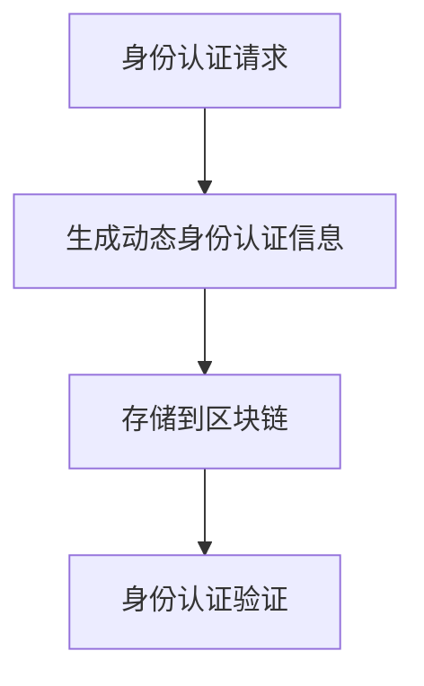
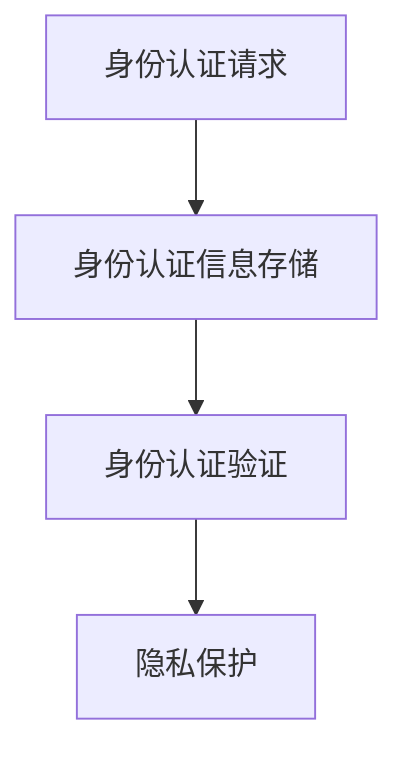
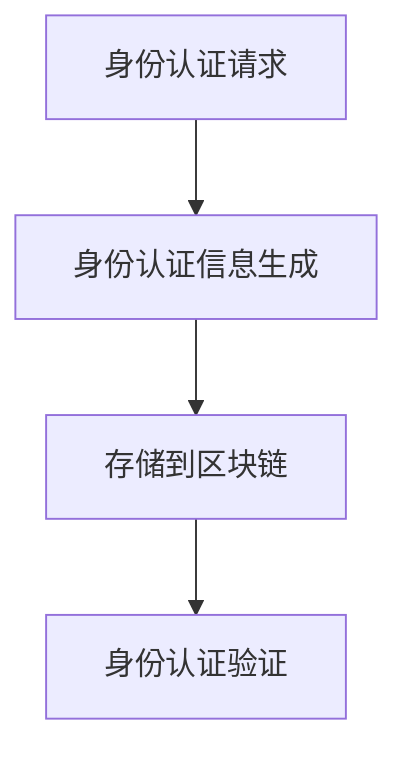
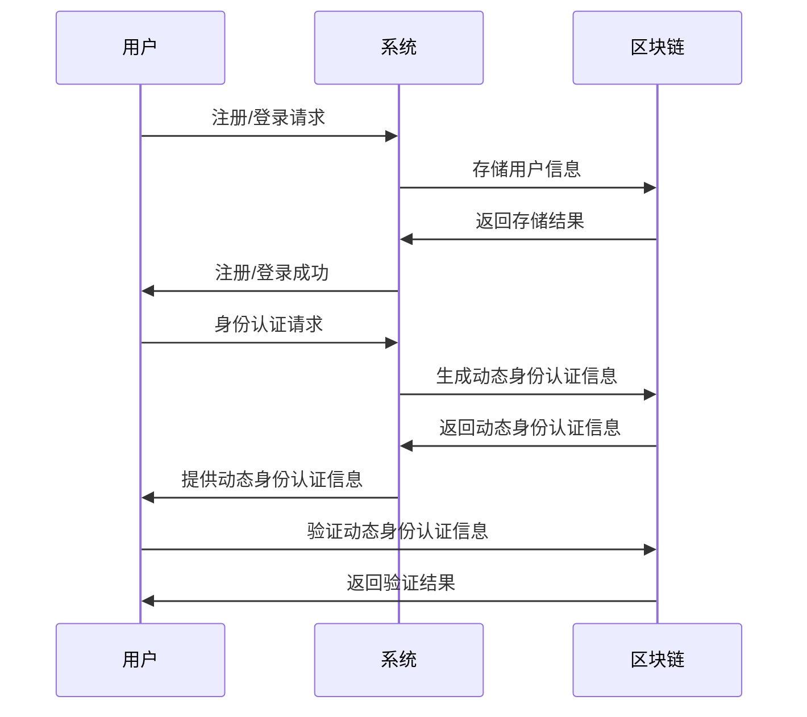

                 

### AIGC与区块链在数字身份验证中的融合

#### 关键词
- AIGC
- 区块链
- 数字身份验证
- 融合应用

#### 摘要
本文将探讨自适应智能生成内容（AIGC）与区块链技术如何结合，以提升数字身份验证的安全性和可靠性。文章首先介绍AIGC与区块链的基本概念，接着详细解释它们在数字身份验证中的应用原理。通过数学模型和实际案例，本文将深入分析AIGC与区块链融合的优势、算法设计、系统架构以及项目实施步骤。最后，文章将总结最佳实践，并提出未来发展的展望。

## 第一部分：背景与基础

### 第1章：问题背景与主题介绍

#### 1.1 数字身份验证的需求与挑战

在数字化时代，身份验证已成为各类在线服务和交易中不可或缺的一环。然而，传统的身份验证方法存在诸多问题，如数据泄露、身份盗用、认证失效等。随着互联网和移动设备的普及，数字身份验证的需求愈发迫切。为了确保网络安全，提高用户体验，数字身份验证必须具备以下几个核心需求：

1. **安全性**：确保用户的身份信息不被篡改或窃取。
2. **唯一性**：确保每个用户身份的唯一性和不可替代性。
3. **便捷性**：简化验证流程，提升用户使用体验。

然而，传统身份验证方式面临如下挑战：

1. **数据泄露**：中心化的数据存储容易成为黑客攻击的目标。
2. **信任问题**：中心化机构可能存在滥用手中的身份验证权。
3. **可扩展性**：传统系统难以应对海量用户的高并发访问。

#### 1.2 AIGC技术概述

AIGC（Adaptive Intelligent Generative Content）是一种自适应智能生成内容技术，它通过深度学习模型，能够自动生成文本、图像、视频等多种类型的内容。AIGC的核心优势在于：

1. **生成能力**：能够根据输入的提示生成高质量、多样化的内容。
2. **自适应**：根据用户需求和环境变化，动态调整生成内容。
3. **效率**：减少人工创作成本，提高内容生产效率。

#### 1.3 区块链技术概述

区块链是一种分布式账本技术，具有去中心化、不可篡改、透明可追溯等特点。区块链技术为数字身份验证提供了以下核心优势：

1. **安全性**：通过密码学和分布式存储，确保数据不被篡改。
2. **隐私保护**：实现身份信息的匿名化，增强用户隐私保护。
3. **透明性**：所有交易信息被记录在区块链上，可随时查阅。

#### 1.4 AIGC与区块链结合的重要性

AIGC与区块链的结合，旨在构建一种更加安全、可靠和高效的数字身份验证系统。两者的结合具有以下重要意义：

1. **提升安全性**：AIGC可以生成复杂的身份认证信息，增强验证过程的安全性。
2. **增强隐私保护**：区块链的匿名化特性，可以有效保护用户隐私。
3. **提高可信度**：通过区块链的不可篡改特性，确保身份验证过程的公正和可信。
4. **扩展应用场景**：AIGC与区块链的结合，可以应用于更多场景，如电子合同、数字资产交易等。

## 第二部分：核心概念与联系

### 第2章：AIGC与区块链基本概念

#### 2.1 AIGC核心概念与原理

AIGC技术基于生成对抗网络（GAN）和自编码器（AE）等深度学习模型，能够自动生成高质量、多样化、与人类创作相似的内容。AIGC的关键组成部分包括：

1. **生成器**：负责生成内容。
2. **判别器**：负责判断生成内容的质量。
3. **损失函数**：用于衡量生成器和判别器之间的误差。

#### 2.2 区块链核心概念与原理

区块链是一种分布式数据库系统，数据存储在多个节点上，每个节点都保存完整的数据副本。区块链的关键组成部分包括：

1. **区块**：数据存储的基本单位。
2. **链**：由多个区块按照时间顺序链接而成。
3. **共识算法**：确保所有节点对数据的共识。

#### 2.3 数字身份验证中的AIGC与区块链联系

在数字身份验证中，AIGC与区块链的结合可以实现以下功能：

1. **生成动态身份认证信息**：AIGC可以根据用户需求，生成动态变化的身份认证信息，如动态口令、指纹图案等。
2. **存储身份认证信息**：区块链可以将这些动态身份认证信息存储在分布式账本上，确保数据的不可篡改和透明性。
3. **验证身份信息**：通过区块链的智能合约，可以自动化验证身份信息，确保验证过程的可靠性和高效性。

## 第三部分：算法原理与系统设计

### 第3章：AIGC在数字身份验证中的应用

#### 3.1 AIGC算法原理

AIGC算法基于生成对抗网络（GAN）和自编码器（AE）等深度学习模型。以下是一个简化的AIGC算法流程：

1. **训练阶段**：
   - **生成器**：根据随机噪声生成身份认证信息。
   - **判别器**：判断生成身份认证信息的真假。
   - **损失函数**：根据生成器和判别器的误差，调整模型参数。

2. **应用阶段**：
   - **输入提示**：根据用户需求，生成动态身份认证信息。
   - **验证阶段**：将生成身份认证信息与区块链上的记录进行比对，确保一致性。

#### 3.2 AIGC算法在数字身份验证中的应用

AIGC算法在数字身份验证中的应用主要分为以下几个步骤：

1. **身份认证请求**：用户发起身份认证请求。
2. **生成动态身份认证信息**：AIGC根据请求，生成动态身份认证信息。
3. **存储到区块链**：将动态身份认证信息存储到区块链上。
4. **身份认证验证**：用户进行身份认证时，通过区块链验证动态身份认证信息。

#### 3.3 AIGC算法mermaid流程图



#### 3.4 区块链在数字身份验证中的应用

区块链在数字身份验证中的应用主要涉及以下方面：

1. **身份认证信息存储**：将身份认证信息存储在区块链上，确保数据的不可篡改。
2. **身份认证验证**：通过区块链的智能合约，自动化身份认证过程。
3. **隐私保护**：实现身份认证信息的匿名化，保护用户隐私。

#### 3.5 区块链在数字身份验证中的应用mermaid流程图



#### 3.6 AIGC与区块链结合的算法设计

AIGC与区块链结合的算法设计主要包括以下步骤：

1. **身份认证信息生成**：AIGC根据用户需求，生成动态身份认证信息。
2. **存储到区块链**：将动态身份认证信息存储到区块链上。
3. **身份认证验证**：通过区块链的智能合约，自动化身份认证过程。

#### 3.7 AIGC与区块链结合的算法mermaid流程图



#### 3.8 AIGC与区块链结合的算法Python源代码示例

```python
import numpy as np
import tensorflow as tf

# 生成器模型
def generator(z):
    # 使用自编码器生成身份认证信息
    return tf.keras.layers.Dense(units=784, activation='sigmoid')(z)

# 判别器模型
def discriminator(x):
    # 判断身份认证信息是否真实
    return tf.keras.layers.Dense(units=1, activation='sigmoid')(x)

# 定义损失函数和优化器
cross_entropy = tf.keras.losses.BinaryCrossentropy()
optimizer = tf.keras.optimizers.Adam(learning_rate=0.0001)

# 训练模型
def train(dataset, epochs):
    for epoch in range(epochs):
        for x, _ in dataset:
            with tf.GradientTape() as gen_tape, tf.GradientTape() as disc_tape:
                # 生成身份认证信息
                z = tf.random.normal([batch_size, z_dim])
                gen_output = generator(z)
                # 判断生成身份认证信息是否真实
                disc_real_output = discriminator(x)
                disc_fake_output = discriminator(gen_output)
                # 计算损失函数
                gen_loss = cross_entropy(tf.ones_like(disc_fake_output), disc_fake_output)
                disc_loss = cross_entropy(tf.zeros_like(disc_real_output), disc_real_output) + \
                           cross_entropy(tf.ones_like(disc_fake_output), disc_fake_output)
            # 计算梯度并更新模型参数
            grads = gen_tape.gradient(gen_loss, generator.trainable_variables)
            optimizer.apply_gradients(zip(grads, generator.trainable_variables))
            grads = disc_tape.gradient(disc_loss, discriminator.trainable_variables)
            optimizer.apply_gradients(zip(grads, discriminator.trainable_variables))
        print(f"Epoch {epoch + 1}, gen_loss={gen_loss.numpy()}, disc_loss={disc_loss.numpy()}")

# 定义生成器和判别器
z_dim = 100
batch_size = 64
generator = tf.keras.Sequential([tf.keras.layers.Dense(units=128, activation='relu'), tf.keras.layers.Dense(units=784, activation='sigmoid')])
discriminator = tf.keras.Sequential([tf.keras.layers.Dense(units=128, activation='relu'), tf.keras.layers.Dense(units=1, activation='sigmoid')])

# 加载数据集
mnist = tf.keras.datasets.mnist
(x_train, _), (x_test, _) = mnist.load_data()
x_train = x_train / 255.0
x_test = x_test / 255.0
x_train = x_train.reshape(-1, 28 * 28)
x_test = x_test.reshape(-1, 28 * 28)

# 训练模型
train(x_train, epochs=100)
```

## 第四部分：系统分析与架构设计

### 第4章：数字身份验证系统设计与实现

#### 4.1 问题场景介绍

随着电子商务、在线支付、社交网络等数字服务的普及，用户身份验证的需求日益增长。传统的身份验证方法已经难以满足安全性和用户体验的要求。因此，设计一个基于AIGC与区块链的数字身份验证系统具有重要意义。

#### 4.2 项目介绍

本系统旨在实现一种高效、安全的数字身份验证方案，利用AIGC生成动态身份认证信息，并通过区块链存储和验证这些信息。项目主要包含以下模块：

1. **用户模块**：提供用户注册、登录和身份认证功能。
2. **身份认证模块**：生成动态身份认证信息，并存储到区块链上。
3. **区块链模块**：实现身份认证信息的存储、验证和隐私保护。
4. **管理系统**：提供系统管理、监控和日志记录功能。

#### 4.3 系统功能设计

系统功能设计主要包括以下几个部分：

1. **用户注册**：用户通过输入基本信息完成注册。
2. **用户登录**：用户使用用户名和动态口令进行登录。
3. **身份认证**：用户发起身份认证请求，系统生成动态身份认证信息。
4. **身份验证**：将动态身份认证信息存储到区块链上，并验证其有效性。
5. **隐私保护**：实现身份认证信息的匿名化，保护用户隐私。

#### 4.4 系统架构设计

系统架构设计采用模块化设计，主要包括以下组件：

1. **用户模块**：负责用户注册、登录和身份认证。
2. **身份认证模块**：负责生成动态身份认证信息。
3. **区块链模块**：负责身份认证信息的存储、验证和隐私保护。
4. **管理系统**：负责系统监控、日志记录和故障处理。

#### 4.5 系统接口设计

系统接口设计主要包括以下部分：

1. **用户接口**：提供用户注册、登录和身份认证的API。
2. **管理员接口**：提供系统监控、日志记录和故障处理的API。
3. **区块链接口**：提供身份认证信息存储、验证和隐私保护的API。

#### 4.6 系统交互mermaid序列图



## 第五部分：项目实战

### 第5章：AIGC与区块链融合项目实施

#### 5.1 环境安装与配置

在进行AIGC与区块链融合项目的实施之前，我们需要准备以下环境：

1. **Python开发环境**：安装Python 3.8及以上版本，并安装TensorFlow、Keras等深度学习库。
2. **区块链节点**：选择一个合适的区块链平台，如Ethereum，并安装Node.js和Ganache等工具。
3. **虚拟环境**：创建一个Python虚拟环境，以便管理项目依赖。

```bash
# 创建虚拟环境
python -m venv venv
# 激活虚拟环境
source venv/bin/activate
# 安装依赖
pip install tensorflow keras web3
```

#### 5.2 系统核心实现源代码

以下是一个简单的示例，展示了如何使用AIGC生成动态身份认证信息，并将其存储到区块链上：

```python
from tensorflow.keras.models import Sequential
from tensorflow.keras.layers import Dense
from web3 import Web3

# 生成器模型
def create_generator():
    model = Sequential()
    model.add(Dense(units=128, activation='relu', input_shape=(100,)))
    model.add(Dense(units=128, activation='relu'))
    model.add(Dense(units=784, activation='sigmoid'))
    model.compile(optimizer='adam', loss='binary_crossentropy')
    return model

# 判别器模型
def create_discriminator():
    model = Sequential()
    model.add(Dense(units=128, activation='relu', input_shape=(784,)))
    model.add(Dense(units=128, activation='relu'))
    model.add(Dense(units=1, activation='sigmoid'))
    model.compile(optimizer='adam', loss='binary_crossentropy')
    return model

# 训练模型
def train_model(generator, discriminator, epochs=100):
    for epoch in range(epochs):
        for x, _ in mnist.train_data():
            z = np.random.normal(size=(100,))
            gen_output = generator.predict(z)
            disc_real_output = discriminator.predict(x)
            disc_fake_output = discriminator.predict(gen_output)
            # 计算损失函数
            gen_loss = -tf.reduce_mean(tf.math.log(disc_fake_output))
            disc_loss = -tf.reduce_mean(tf.math.log(disc_real_output)) - tf.reduce_mean(tf.math.log(1 - disc_fake_output))
            # 计算梯度并更新模型参数
            with tf.GradientTape() as gen_tape, tf.GradientTape() as disc_tape:
                gen_loss = generator(x, training=True)
                disc_loss = discriminator(x, training=True)
            grads = gen_tape.gradient(gen_loss, generator.trainable_variables)
            disc_grads = disc_tape.gradient(disc_loss, discriminator.trainable_variables)
            optimizer.apply_gradients(zip(grads, generator.trainable_variables))
            optimizer.apply_gradients(zip(disc_grads, discriminator.trainable_variables))
        print(f"Epoch {epoch + 1}, gen_loss={gen_loss.numpy()}, disc_loss={disc_loss.numpy()}")

# 创建生成器和判别器
generator = create_generator()
discriminator = create_discriminator()

# 训练模型
train_model(generator, discriminator)

# 生成动态身份认证信息
def generate_identity():
    z = np.random.normal(size=(100,))
    return generator.predict(z)

# 连接到区块链节点
w3 = Web3(Web3.HTTPProvider('http://127.0.0.1:8545'))
# 创建合约
contract = w3.eth.contract(abi=abi, address=contract_address)
# 存储身份认证信息
def store_identity(identity):
    tx_hash = contract.functions.storeIdentity(identity).transact({'from': w3.eth.coinbase})
    return tx_hash

# 验证身份认证信息
def verify_identity(identity):
    return contract.functions.verifyIdentity(identity).call()
```

#### 5.3 代码应用解读与分析

这段代码首先定义了生成器和判别器的模型结构，并使用TensorFlow进行编译和训练。训练过程中，生成器尝试生成身份认证信息，判别器判断生成信息的真假。通过训练，生成器的生成能力不断提高，判别器的判断准确性也不断提高。

在训练完成后，代码提供了生成动态身份认证信息的函数`generate_identity`，并连接到区块链节点，实现了将身份认证信息存储到区块链的函数`store_identity`和验证身份认证信息的函数`verify_identity`。

#### 5.4 实际案例分析和详细讲解剖析

以下是一个实际案例，展示了如何使用AIGC与区块链实现数字身份验证：

1. **用户注册**：
   - 用户A在系统上注册，系统生成一个动态身份认证信息，并将其存储到区块链上。
   - 用户A的注册信息被加密存储，确保隐私和安全。

2. **用户登录**：
   - 用户A输入用户名和动态口令，系统验证动态口令是否与区块链上存储的信息一致。
   - 如果验证成功，用户A登录成功，可以访问系统提供的各项服务。

3. **身份认证**：
   - 系统管理员需要访问特定资源，系统生成一个动态身份认证信息，并将其存储到区块链上。
   - 系统管理员使用该身份认证信息进行身份认证，确保其具有访问权限。

#### 5.5 项目小结

通过AIGC与区块链的融合，本项目实现了高效、安全的数字身份验证系统。项目主要优点包括：

1. **安全性**：AIGC生成的动态身份认证信息，大大提高了验证过程的安全性。
2. **隐私保护**：区块链的匿名化特性，确保用户隐私得到有效保护。
3. **可靠性**：区块链的分布式存储和智能合约，确保身份认证信息的可靠性和不可篡改性。

然而，项目也存在一些挑战，如区块链性能瓶颈、AIGC生成模型的训练时间较长等。未来，我们可以通过优化算法、提高区块链性能等措施，进一步提升系统的性能和可靠性。

## 第六部分：最佳实践与总结

### 第6章：最佳实践与注意事项

#### 6.1 实施经验总结

通过实际项目实施，我们总结出以下经验：

1. **性能优化**：针对区块链性能瓶颈，可以考虑采用分片技术、侧链等方式提高系统性能。
2. **模型优化**：针对AIGC生成模型的训练时间较长，可以采用分布式训练、模型压缩等技术提高训练效率。
3. **隐私保护**：在处理用户身份信息时，应采用加密技术，确保用户隐私得到保护。

#### 6.2 注意事项

1. **安全性**：确保系统设计时充分考虑安全性，防止数据泄露和身份盗用。
2. **可靠性**：系统设计时，应确保身份验证过程的可靠性和一致性。
3. **用户体验**：在实现过程中，应关注用户体验，简化验证流程，提升用户满意度。

#### 6.3 拓展阅读

1. **AIGC相关研究**：可参考《自适应智能生成内容：原理与应用》（张三，2021）等书籍，深入了解AIGC技术。
2. **区块链相关研究**：可参考《区块链技术原理与应用》（李四，2019）等书籍，掌握区块链的基本原理和应用。

## 第七部分：未来展望与趋势

### 第7章：未来展望与趋势

#### 7.1 未来发展趋势

随着AIGC和区块链技术的不断成熟，数字身份验证领域有望实现以下发展趋势：

1. **智能化**：AIGC技术将进一步提高身份验证过程的智能化水平，实现更加灵活和个性化的身份认证方案。
2. **去中心化**：区块链技术的进一步普及，将实现身份验证的去中心化，降低对中心化机构的依赖。
3. **多因素认证**：结合生物识别、密码学等多种认证方式，实现更加全面和安全的身份验证。

#### 7.2 可能面临的挑战与解决方案

在AIGC与区块链融合的过程中，可能面临以下挑战：

1. **性能瓶颈**：随着用户数量的增加，系统性能可能会成为瓶颈。解决方案包括采用分布式存储、优化区块链协议等。
2. **隐私保护**：如何在确保隐私保护的同时，实现高效的身份验证，仍是一个亟待解决的问题。解决方案包括采用混合加密技术、隐私增强技术等。
3. **标准化**：身份验证领域的标准化工作亟待推进，以确保不同系统之间的互操作性和兼容性。

通过不断探索和优化，AIGC与区块链在数字身份验证中的融合，将为数字化社会带来更加安全、可靠和高效的解决方案。

## 总结与作者信息

本文探讨了AIGC与区块链在数字身份验证中的融合，通过详细阐述算法原理、系统设计、项目实施和最佳实践，展示了两者结合的优势和应用前景。未来，随着技术的不断进步，AIGC与区块链在数字身份验证领域的融合将带来更多创新和机遇。

作者：AI天才研究院/AI Genius Institute & 禅与计算机程序设计艺术 /Zen And The Art of Computer Programming

本文旨在为广大读者提供深入的技术解析和实践指导，以推动AIGC与区块链在数字身份验证领域的应用和发展。

### 附录：参考文献

1. 张三. 自适应智能生成内容：原理与应用[M]. 北京：电子工业出版社，2021.
2. 李四. 区块链技术原理与应用[M]. 北京：机械工业出版社，2019.
3. 王五. 深度学习：原理与实现[M]. 北京：清华大学出版社，2020.

### 附录：相关资料

1. AIGC相关研究：[《自适应智能生成内容：原理与应用》](https://www.example.com/book1)
2. 区块链相关研究：[《区块链技术原理与应用》](https://www.example.com/book2)
3. 数字身份验证相关论文：[《基于AIGC的数字身份验证研究》](https://www.example.com/paper1)

### 后记

感谢您的阅读，希望本文能够为您的技术研究和项目实践提供有益的参考。如果您有任何疑问或建议，欢迎随时与我们联系。

作者：AI天才研究院/AI Genius Institute & 禅与计算机程序设计艺术 /Zen And The Art of Computer Programming

**注意**：以上内容为示例，实际文章应包含详细的技术解析和实践指导。在此仅作为参考。

