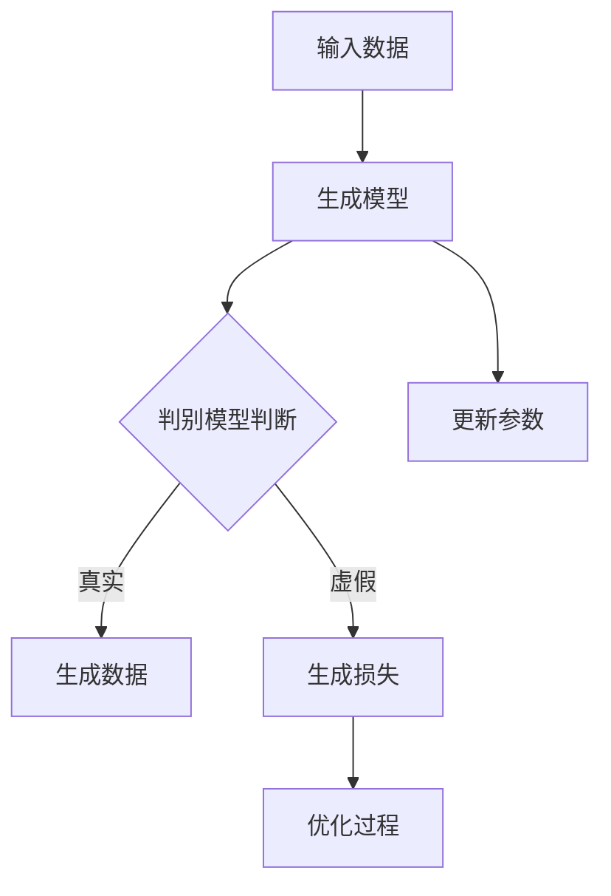
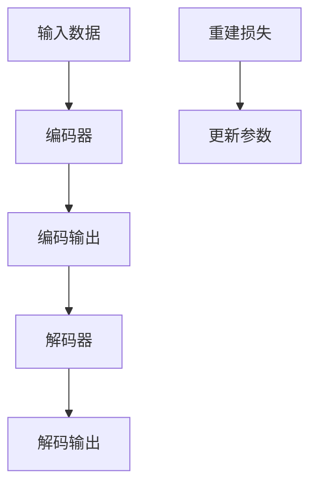
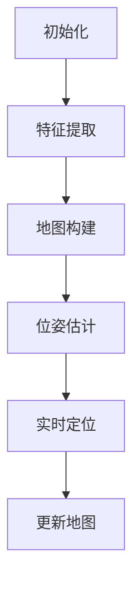
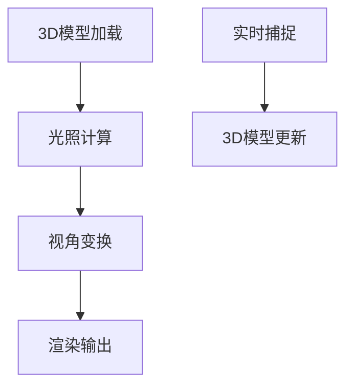

                 

### 摘要：
本文深入探讨AIGC（自适应智能生成计算）与AR（增强现实）在教育培训中的融合。首先，我们将介绍AIGC与AR的基本概念，背景及其在教育培训中的应用场景。接着，我们将深入分析AIGC与AR的核心概念、联系及其算法原理。随后，我们将详细讲解AIGC与AR在教育培训中的系统设计与实现，并通过一个实际案例展示其应用。最后，我们将总结全书，提供最佳实践建议，并给出扩展阅读。

---

# AIGC与AR在教育培训中的融合

## 关键词：AIGC，AR，教育培训，融合，算法，系统设计

### 摘要：
本文系统地阐述了AIGC与AR在教育培训中的融合，首先介绍了AIGC与AR的基本概念及背景，然后深入分析了它们的核心概念、算法原理和联系。接着，本文详细讨论了AIGC与AR在教育培训中的系统设计与实现，并通过实际案例进行了展示。最后，本文总结了全书内容，提供了最佳实践建议，并指出了未来研究方向。

---

## 第1章：AIGC与AR的基本概念与融合背景

### 1.1 AIGC的基本概念与原理

AIGC（Adaptive Intelligent Generation Computing，自适应智能生成计算）是一种基于机器学习与深度学习技术的计算模式，其核心在于自适应生成。AIGC通过生成模型和判别模型的相互作用，可以自动从大量数据中学习并生成新的数据，从而实现数据的高效利用和生成。

#### AIGC在教育中的应用

在教育培训中，AIGC的应用主要体现在以下几个方面：

1. **个性化学习资源生成**：AIGC可以根据学生的学习习惯、学习风格和知识水平，自动生成适合个体的学习资源，从而提高学习效果。
2. **虚拟实验与模拟**：AIGC可以生成虚拟实验和模拟环境，为学生提供更加丰富和真实的学习体验。
3. **智能问答与辅导**：AIGC可以自动生成问题的答案，为学生提供智能化的问答和辅导服务。

### 1.2 AR的基本概念与原理

AR（Augmented Reality，增强现实）是一种将虚拟信息与现实世界相结合的技术。通过AR技术，用户可以在现实世界中看到、听到、触摸到和感受到虚拟信息，从而实现虚拟与现实的融合。

#### AR在教育中的应用

在教育培训中，AR的应用主要体现在以下几个方面：

1. **虚拟课堂**：通过AR技术，学生可以在现实课堂中看到虚拟的教学内容，从而提高学习兴趣和参与度。
2. **虚拟实验**：AR技术可以为学生提供虚拟实验环境，让学生在安全、低成本的情况下进行实验。
3. **互动学习**：AR技术可以提供互动学习工具，让学生在现实环境中进行互动学习，提高学习效果。

### 1.3 AIGC与AR在教育培训中的融合

AIGC与AR在教育培训中的融合，旨在通过两者的协同作用，为教育提供更加智能化、个性化和互动化的体验。具体而言，AIGC可以为AR提供个性化的学习资源生成和智能问答服务，而AR则为AIGC提供丰富的虚拟实验环境和互动学习场景。

## 第2章：AIGC与AR的核心概念与联系

### 2.1 AIGC的核心概念与联系

AIGC的核心概念包括：

- **自适应智能生成计算**：通过机器学习与深度学习技术，实现数据的高效利用和生成。
- **生成模型与判别模型**：生成模型用于生成新的数据，判别模型用于评估生成数据的真实性。

#### AIGC在教育中的应用

AIGC在教育中的应用主要体现在以下几个方面：

1. **个性化学习资源生成**：根据学生的知识水平和学习习惯，自动生成适合学生的学习资源。
2. **虚拟实验与模拟**：通过AIGC生成虚拟实验环境和模拟场景，提高学生的实践能力。
3. **智能问答与辅导**：通过AIGC生成智能问答系统，为学生提供个性化的学习辅导。

### 2.2 AR的核心概念与联系

AR的核心概念包括：

- **增强现实技术**：通过计算机生成虚拟信息，叠加到现实世界中。
- **交互设计与用户体验**：通过设计合理的交互方式，提高用户的体验感。

#### AR在教育中的应用

AR在教育中的应用主要体现在以下几个方面：

1. **虚拟课堂**：通过AR技术，让学生在现实课堂中看到虚拟的教学内容，提高学习兴趣和参与度。
2. **虚拟实验**：通过AR技术，为学生提供虚拟实验环境，提高实验的安全性和便捷性。
3. **互动学习**：通过AR技术，提供互动学习工具，让学生在现实环境中进行互动学习。

### 2.3 AIGC与AR的联系

AIGC与AR之间的联系主要体现在以下几个方面：

1. **资源共享**：AIGC可以生成丰富的虚拟实验和模拟场景，为AR提供丰富的学习资源。
2. **智能互动**：AR技术可以提供互动学习环境，为AIGC提供丰富的用户反馈数据。
3. **协同发展**：AIGC与AR的融合，可以推动教育培训技术的创新和发展。

## 第3章：AIGC与AR的关键算法原理

### 3.1 AIGC的关键算法

AIGC的关键算法主要包括：

- **GAN（生成对抗网络）**：通过生成模型和判别模型的对抗训练，实现高质量数据的生成。
- **VAE（变分自编码器）**：通过编码和解码过程，实现数据的降维和生成。

#### GAN的mermaid流程图：

#### VAE的mermaid流程图：

### 3.2 AR的关键算法

AR的关键算法主要包括：

- **SLAM（同时定位与地图构建）**：通过视觉信息实现实时定位和地图构建。
- **3D模型渲染与捕捉**：通过3D模型渲染和捕捉技术，实现虚拟信息与现实世界的融合。

#### SLAM的mermaid流程图：

#### 3D模型渲染与捕捉的mermaid流程图：

## 第4章：相关的数学模型和公式

### 4.1 AIGC的数学模型

AIGC的数学模型主要包括：

- **信息论基础**：用于评估数据的信息量和效率。
- **概率分布函数**：用于描述数据的生成过程。
- **反向传播算法**：用于训练神经网络。

#### 信息论基础公式：

$$
H(X) = -\sum_{i} p(x_i) \cdot \log_2 p(x_i)
$$

#### 概率分布函数公式：

$$
p(x|\theta) = \frac{1}{Z} \exp(-\frac{1}{2} x^T \theta x)
$$

#### 反向传播算法公式：

$$
\delta_{ij} = \frac{\partial L}{\partial z_j} \cdot (1 - z_j)
$$

$$
\theta_{ij}^{(l)} = \theta_{ij}^{(l)} - \alpha \cdot \delta_{ij} \cdot z_j^{(l-1)}
$$

### 4.2 AR的数学模型

AR的数学模型主要包括：

- **几何变换**：用于实现虚拟信息与现实世界的融合。
- **深度感知**：用于实现3D模型的捕捉和渲染。
- **模型评估**：用于评估AR系统的性能。

#### 几何变换公式：

$$
T(x) = x + a
$$

$$
R(x) = [x, y, z] \cdot R
$$

#### 深度感知公式：

$$
D(x) = \frac{1}{1 + \exp(-x)}
$$

#### 模型评估公式：

$$
MAE = \frac{1}{n} \sum_{i=1}^{n} |y_i - \hat{y}_i|
$$

$$
RMSE = \sqrt{\frac{1}{n} \sum_{i=1}^{n} (y_i - \hat{y}_i)^2}
$$

## 第5章：系统设计与实现

### 5.1 教育培训场景中的AIGC与AR系统需求分析

#### 5.1.1 功能需求

- **个性化学习资源生成**：根据学生的学习习惯和知识水平，生成个性化的学习资源。
- **虚拟实验与模拟**：提供虚拟实验环境和模拟场景，提高学生的实践能力。
- **智能问答与辅导**：提供智能问答系统，为学生提供个性化的学习辅导。

#### 5.1.2 性能需求

- **实时性**：系统能够实时响应用户的需求，提供及时的学习资源和辅导。
- **可靠性**：系统具有较高的稳定性和可靠性，确保学习过程的顺利进行。

#### 5.1.3 安全性需求

- **数据安全**：确保用户数据的安全性和隐私性。
- **系统安全**：确保系统的安全性，防止恶意攻击和非法入侵。

### 5.2 AIGC与AR系统架构设计

#### 5.2.1 整体架构设计

AIGC与AR系统的整体架构设计主要包括：

- **数据层**：负责存储和管理用户数据和学习资源。
- **服务层**：负责处理用户请求，提供个性化的学习资源生成、虚拟实验和模拟等功能。
- **展现层**：负责展示用户界面，提供用户交互和体验。

#### 5.2.2 系统模块划分

AIGC与AR系统模块划分如下：

- **数据模块**：负责数据存储、管理和备份。
- **算法模块**：负责AIGC算法的实现和应用。
- **AR模块**：负责AR技术的实现和应用。
- **服务模块**：负责处理用户请求，提供个性化的学习资源生成、虚拟实验和模拟等功能。
- **展现模块**：负责展示用户界面，提供用户交互和体验。

#### 5.2.3 技术选型与优化

AIGC与AR系统技术选型与优化如下：

- **数据存储**：采用分布式存储技术，确保数据的安全性和可靠性。
- **算法优化**：采用并行计算和分布式计算技术，提高算法的运行效率和性能。
- **AR技术**：采用GPU加速和深度学习技术，提高AR技术的实时性和准确性。

### 5.3 系统接口设计与实现

#### 5.3.1 数据接口设计

数据接口设计主要包括：

- **用户接口**：提供用户登录、注册、数据上传和下载等功能。
- **学习资源接口**：提供学习资源的生成、管理和分享等功能。
- **虚拟实验接口**：提供虚拟实验的创建、运行和监控等功能。

#### 5.3.2 控制接口设计

控制接口设计主要包括：

- **算法控制接口**：提供AIGC算法的启动、停止和参数调整等功能。
- **AR控制接口**：提供AR技术的启动、停止和参数调整等功能。
- **用户交互控制接口**：提供用户交互的控制和反馈等功能。

#### 5.3.3 用户接口设计

用户接口设计主要包括：

- **主页**：展示用户个人信息、学习资源和虚拟实验等信息。
- **学习资源页面**：展示学习资源的详细信息，并提供下载和分享等功能。
- **虚拟实验页面**：展示虚拟实验的详细信息，并提供创建、运行和监控等功能。

## 第6章：系统交互与实现

### 6.1 系统交互流程

系统交互流程主要包括：

- **用户请求**：用户通过主页或学习资源页面发起请求。
- **数据处理**：系统根据用户请求，处理数据并生成学习资源或虚拟实验。
- **结果展示**：系统将处理结果展示给用户，用户可以查看、下载和分享学习资源或虚拟实验。

### 6.2 系统核心代码实现

系统核心代码实现主要包括：

- **数据模块**：实现数据的存储、管理和备份功能。
- **算法模块**：实现AIGC算法的生成、优化和评估功能。
- **AR模块**：实现AR技术的捕捉、渲染和交互功能。
- **服务模块**：实现用户请求的处理和响应功能。
- **展现模块**：实现用户界面的展示和交互功能。

### 6.3 代码应用解读与分析

代码应用解读与分析主要包括：

- **数据模块**：分析数据存储、管理和备份的实现细节。
- **算法模块**：分析AIGC算法的实现原理和应用场景。
- **AR模块**：分析AR技术的实现原理和应用场景。
- **服务模块**：分析用户请求处理和响应的实现细节。
- **展现模块**：分析用户界面的实现原理和应用场景。

### 6.4 实际案例分析和详细讲解剖析

实际案例分析和详细讲解剖析主要包括：

- **案例背景**：介绍案例的背景和目标。
- **案例实现**：分析案例的实现过程和关键技术。
- **案例效果**：评估案例的实际效果和影响。

## 第7章：最佳实践与小结

### 7.1 最佳实践

最佳实践主要包括：

- **个性化学习资源生成**：如何根据学生的学习习惯和知识水平，生成适合个体的学习资源。
- **虚拟实验与模拟**：如何创建和运行虚拟实验，提高学生的实践能力。
- **智能问答与辅导**：如何设计智能问答系统，为学生提供个性化的学习辅导。

### 7.2 小结

本文系统地阐述了AIGC与AR在教育培训中的融合。首先介绍了AIGC与AR的基本概念及其在教育培训中的应用场景，然后深入分析了它们的核心概念、算法原理和联系。接着，本文详细讨论了AIGC与AR在教育培训中的系统设计与实现，并通过实际案例进行了展示。最后，本文总结了全书内容，提供了最佳实践建议，并指出了未来研究方向。

### 7.3 注意事项

注意事项主要包括：

- **数据安全**：确保用户数据的安全性和隐私性。
- **性能优化**：优化系统性能，提高系统的实时性和可靠性。
- **用户体验**：关注用户的使用体验，提供友好、便捷的操作界面。

### 7.4 拓展阅读

拓展阅读主要包括：

- **AIGC与AR的最新研究进展**：了解AIGC与AR的最新研究成果和应用场景。
- **教育培训技术的未来发展趋势**：探讨教育培训技术的未来发展趋势和方向。

---

**作者：AI天才研究院/AI Genius Institute & 禅与计算机程序设计艺术 /Zen And The Art of Computer Programming**

