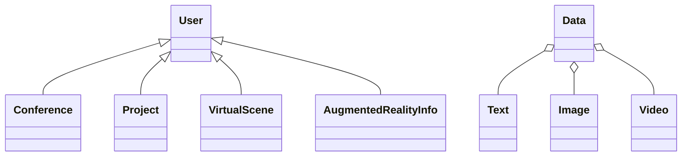
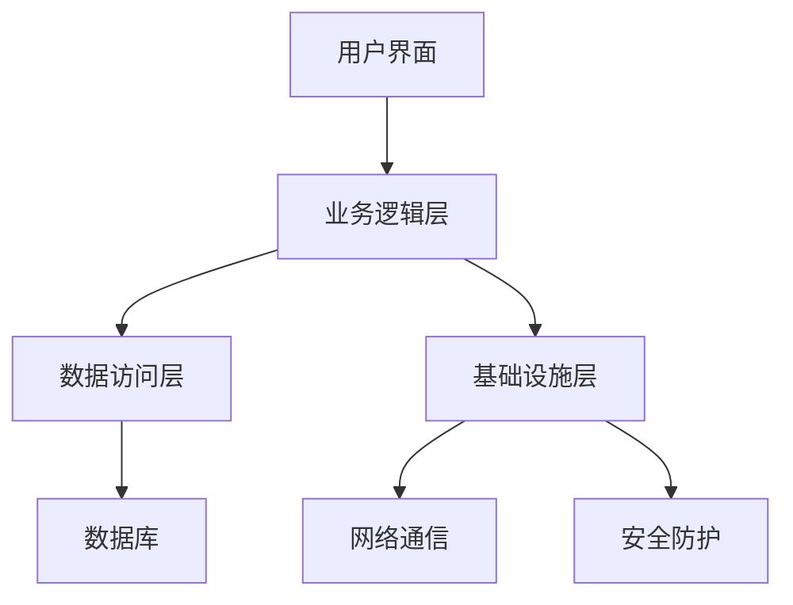
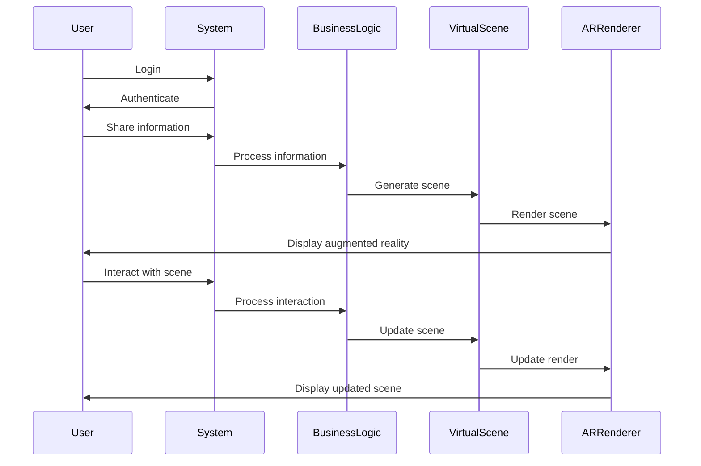

                 

## AIGC与增强现实（AR）在远程协作中的融合

### 关键词：AIGC、AR、远程协作、算法、数学模型、系统架构

> 摘要：本文深入探讨了AIGC（自适应信息生成控制）与AR（增强现实）在远程协作中的融合技术。首先，文章介绍了AIGC和AR的基本概念及其在远程协作中的重要性。随后，通过逻辑清晰的步骤，阐述了AIGC与AR融合的算法原理、数学模型及其在远程协作中的应用。文章还详细描述了系统架构设计、项目实战以及最佳实践与拓展策略，旨在为相关领域的研究者提供有价值的参考。

## 目录大纲

### 第一部分：背景介绍

1. **问题背景**
    - **第1章：问题背景**
        - 1.1 AIGC与AR技术概述
        - 1.1.1 AIGC技术简介
        - 1.1.2 AR技术简介
        - 1.1.3 AIGC与AR结合的意义
        - 1.2 远程协作的挑战与需求
        - 1.2.1 远程协作的现状
        - 1.2.2 远程协作面临的挑战
        - 1.2.3 AIGC与AR在远程协作中的应用需求

2. **核心概念与联系**
    - **第2章：核心概念与联系**
        - 2.1 AIGC核心概念
        - 2.1.1 AIGC定义与分类
        - 2.1.2 AIGC技术原理
        - 2.1.3 AIGC的应用场景
        - 2.2 AR核心概念
        - 2.2.1 AR定义与分类
        - 2.2.2 AR技术原理
        - 2.2.3 AR的应用场景
        - 2.3 AIGC与AR结合的概念与联系
        - 2.3.1 AIGC与AR的融合概念
        - 2.3.2 AIGC与AR融合的技术原理
        - 2.3.3 AIGC与AR融合的应用场景

### 第二部分：算法原理讲解

3. **AIGC与AR融合算法原理**
    - **第3章：AIGC与AR融合算法原理**
        - 3.1 AIGC算法原理
        - 3.1.1 GAN算法原理
        - 3.1.2 VAE算法原理
        - 3.1.3 DCGAN算法原理
        - 3.2 AR算法原理
        - 3.2.1 SLAM算法原理
        - 3.2.2 AR渲染算法原理
        - 3.2.3 AR跟踪算法原理
        - 3.3 AIGC与AR融合算法原理
        - 3.3.1 融合算法原理
        - 3.3.2 融合算法的优势
        - 3.3.3 融合算法的应用场景

### 第三部分：数学模型和公式讲解

4. **数学模型与公式讲解**
    - **第4章：数学模型与公式讲解**
        - 4.1 AIGC数学模型
        - 4.1.1 GAN数学模型
        - 4.1.2 VAE数学模型
        - 4.1.3 DCGAN数学模型
        - 4.2 AR数学模型
        - 4.2.1 SLAM数学模型
        - 4.2.2 AR渲染数学模型
        - 4.2.3 AR跟踪数学模型
        - 4.3 AIGC与AR融合数学模型
        - 4.3.1 融合数学模型
        - 4.3.2 融合模型的优势
        - 4.3.3 融合模型的应用场景

### 第四部分：系统分析与架构设计

5. **系统架构设计**
    - **第5章：系统架构设计**
        - 5.1 问题场景介绍
        - 5.2 系统功能设计
        - 5.2.1 领域模型设计
        - 5.3 系统架构设计
        - 5.4 系统接口设计
        - 5.5 系统交互设计

### 第五部分：项目实战

6. **项目实战**
    - **第6章：项目实战**
        - 6.1 环境安装与配置
        - 6.2 系统核心实现
        - 6.2.1 核心代码实现
        - 6.3 代码应用解读与分析
        - 6.4 实际案例分析与详细讲解
        - 6.5 项目小结

### 第六部分：最佳实践与拓展

7. **最佳实践与拓展**
    - **第7章：最佳实践与拓展**
        - 7.1 最佳实践
        - 7.2 小结
        - 7.3 注意事项
        - 7.4 拓展阅读

---

### 第1章：问题背景

#### 1.1 AIGC与AR技术概述

##### 1.1.1 AIGC技术简介

AIGC（自适应信息生成控制）是近年来人工智能领域的一项新兴技术，它通过模型自动适应和生成信息，实现信息生成和传播的自动化。AIGC在计算机视觉、自然语言处理、数据挖掘等多个领域有着广泛的应用。

在远程协作中，AIGC可以通过生成和修改虚拟场景来提高协作效率。例如，通过AIGC生成实时更新的3D模型，使得远程协作成员能够更直观地理解和沟通项目细节。

##### 1.1.2 AR技术简介

AR（增强现实）是一种将虚拟信息叠加到现实世界的技术。通过AR技术，用户可以在现实环境中看到增强的信息，从而实现虚实结合的交互体验。

在远程协作中，AR技术可以通过增强现实界面，为远程协作提供更直观、更丰富的交互体验。例如，通过AR技术展示项目的三维模型，使得远程协作成员能够更好地理解和讨论项目细节。

##### 1.1.3 AIGC与AR结合的意义

AIGC与AR的结合，可以为远程协作带来以下几方面的提升：

1. **实时信息生成与更新**：AIGC可以实时生成和更新虚拟场景，使得远程协作成员能够更直观地了解项目进展。
2. **提高协作效率**：通过AIGC生成的虚拟场景，远程协作成员可以更快速、更准确地理解和沟通项目细节，从而提高协作效率。
3. **增强现实交互体验**：AR技术可以为远程协作提供更直观、更丰富的交互体验，使得远程协作更加生动、有趣。

#### 1.2 远程协作的挑战与需求

##### 1.2.1 远程协作的现状

随着互联网技术的快速发展，远程协作已经成为企业和组织的一项重要工作方式。然而，远程协作仍然面临一些挑战：

1. **沟通障碍**：远程协作往往缺乏面对面的沟通，容易导致信息误解和沟通不畅。
2. **协作效率低**：远程协作中，成员之间的沟通和协作往往需要花费更多的时间和精力，导致协作效率低下。
3. **信息可视化不足**：远程协作中，信息可视化不足，难以直观展示项目细节和进展。

##### 1.2.2 远程协作面临的挑战

远程协作面临的挑战主要包括：

1. **技术限制**：远程协作技术尚不完善，难以满足高效、直观的协作需求。
2. **人员适应性问题**：远程协作需要成员具备较强的自我管理能力和适应能力，对于部分人员来说，适应远程协作可能存在一定难度。
3. **信息安全问题**：远程协作过程中，信息安全性问题一直是企业和组织关注的焦点。

##### 1.2.3 AIGC与AR在远程协作中的应用需求

为了应对远程协作面临的挑战，AIGC与AR技术具有以下应用需求：

1. **实时信息生成与更新**：通过AIGC技术，实现虚拟场景的实时生成和更新，提高远程协作的实时性和准确性。
2. **增强信息可视化**：通过AR技术，将虚拟信息叠加到现实世界，提高信息可视化水平，帮助远程协作成员更直观地理解和沟通项目细节。
3. **提升协作效率**：通过AIGC与AR技术的结合，提高远程协作的效率，降低沟通成本，减少协作时间。

#### 1.3 AIGC与AR在远程协作中的融合

AIGC与AR在远程协作中的融合，可以通过以下方式实现：

1. **实时场景生成与更新**：AIGC技术可以实时生成和更新虚拟场景，为远程协作提供实时、准确的视觉信息。
2. **增强信息可视化**：AR技术可以将虚拟信息叠加到现实世界，提高信息可视化水平，帮助远程协作成员更好地理解和沟通项目细节。
3. **智能交互体验**：通过AIGC与AR技术的结合，实现智能化的交互体验，提高远程协作的互动性和趣味性。

### 1.4 AIGC与AR融合的应用前景

随着AIGC与AR技术的不断发展，它们在远程协作中的应用前景十分广阔。未来，AIGC与AR技术的结合有望带来以下几方面的突破：

1. **实时远程协作**：通过AIGC与AR技术的结合，实现实时远程协作，提高协作效率，降低沟通成本。
2. **虚拟现实会议**：利用AR技术，打造虚拟现实会议环境，提供更加直观、生动的会议体验。
3. **远程协作教育**：通过AIGC与AR技术的结合，实现远程教育的创新，提供更加生动、有趣的学习体验。

总之，AIGC与AR技术在远程协作中的应用，将为远程协作带来全新的变革和突破，助力企业和组织实现更高效、更直观的协作。

---

### 第2章：核心概念与联系

在深入探讨AIGC与AR在远程协作中的融合之前，我们需要对这两个技术领域的核心概念有一个清晰的认识。本章将分别介绍AIGC和AR的核心概念，并探讨它们之间的联系。

#### 2.1 AIGC核心概念

##### 2.1.1 AIGC定义与分类

AIGC（自适应信息生成控制）是一种基于人工智能的自动化信息生成与控制技术。它通过学习用户的行为模式、偏好和历史数据，自动生成用户所需的信息，并在用户需要时提供个性化的信息服务。

根据应用场景和功能，AIGC可以分为以下几类：

1. **信息推荐系统**：根据用户的历史行为和偏好，自动推荐用户可能感兴趣的信息或商品。
2. **虚拟助手**：通过语音、文本等交互方式，为用户提供问答、任务管理、日程安排等个性化服务。
3. **智能内容生成**：根据用户需求和输入，自动生成文本、图像、音频等多种类型的内容。

##### 2.1.2 AIGC技术原理

AIGC的核心技术包括：

1. **机器学习与深度学习**：通过机器学习和深度学习模型，从大量数据中提取特征，进行信息生成与优化。
2. **自然语言处理**：利用自然语言处理技术，理解和生成自然语言文本，实现人机交互。
3. **数据挖掘与数据分析**：通过数据挖掘和数据分析技术，发现用户行为模式，为信息生成提供依据。

##### 2.1.3 AIGC的应用场景

AIGC在多个领域有着广泛的应用，以下是其中几个典型的应用场景：

1. **电子商务**：通过AIGC技术，为用户推荐个性化商品，提高购买转化率。
2. **智能客服**：利用AIGC技术，为用户提供24/7的智能客服服务，提高客户满意度。
3. **内容创作**：通过AIGC技术，自动生成文章、图片、视频等媒体内容，降低创作成本。

#### 2.2 AR核心概念

##### 2.2.1 AR定义与分类

AR（增强现实）是一种将虚拟信息叠加到现实世界的技术。通过AR设备（如智能手机、眼镜等），用户可以看到增强的虚拟信息，实现虚实结合的交互体验。

根据应用方式和显示方式，AR可以分为以下几类：

1. **标记识别AR**：通过识别现实世界中的标记，叠加虚拟信息。
2. **基于位置的AR**：根据用户的地理位置，叠加虚拟信息。
3. **手势识别AR**：通过手势控制虚拟信息。

##### 2.2.2 AR技术原理

AR的核心技术包括：

1. **计算机视觉**：通过图像处理和计算机视觉技术，识别和理解现实世界中的图像和场景。
2. **图像识别与跟踪**：利用图像识别和跟踪技术，实时检测和跟踪现实世界中的目标。
3. **渲染与显示**：通过图像渲染和显示技术，将虚拟信息叠加到现实世界中。

##### 2.2.3 AR的应用场景

AR在多个领域有着广泛的应用，以下是其中几个典型的应用场景：

1. **娱乐与游戏**：通过AR技术，为用户带来沉浸式娱乐和游戏体验。
2. **教育**：利用AR技术，为学生提供生动、有趣的教学内容，提高学习兴趣。
3. **医疗**：通过AR技术，为医生提供实时、准确的诊断信息，提高诊断效率。

#### 2.3 AIGC与AR结合的概念与联系

##### 2.3.1 AIGC与AR的融合概念

AIGC与AR的融合，指的是利用AIGC技术生成和优化虚拟信息，通过AR技术将这些信息叠加到现实世界，为用户提供更加丰富、直观的交互体验。这种融合可以称为“AR增强信息生成控制”（AR-AIGC）。

##### 2.3.2 AIGC与AR融合的技术原理

AR-AIGC的技术原理包括：

1. **信息生成**：利用AIGC技术，根据用户需求和场景信息，生成个性化、高质量的虚拟信息。
2. **信息融合**：利用AR技术，将生成的虚拟信息叠加到现实世界中，实现虚实结合。
3. **用户交互**：通过自然语言处理、手势识别等技术，实现用户与虚拟信息的智能交互。

##### 2.3.3 AIGC与AR融合的应用场景

AR-AIGC在远程协作中的应用，主要包括以下几种场景：

1. **远程会议**：通过AR-AIGC技术，为远程会议提供实时、个性化的信息展示，提高会议效率。
2. **远程协作**：利用AR-AIGC技术，为远程协作提供丰富的虚拟信息，帮助团队成员更好地理解和沟通项目细节。
3. **远程教育**：通过AR-AIGC技术，为远程教育提供生动的教学场景，提高学生的学习兴趣和参与度。

总之，AIGC与AR的融合，为远程协作带来了全新的机遇和挑战。通过深入理解AIGC和AR的核心概念，我们可以更好地把握它们在远程协作中的应用前景，为实现高效、直观的远程协作提供有力支持。

### 2.4 AIGC与AR融合的案例分析

为了更好地理解AIGC与AR在远程协作中的融合，我们可以通过一些实际的案例来分析。

#### 案例一：远程医疗

远程医疗是一个典型的应用场景，通过AIGC与AR的融合，医生可以更直观地了解患者的病情和治疗方案。

1. **信息生成**：AIGC技术可以根据患者的病历信息、检查报告等，生成个性化的医疗报告和诊断建议。
2. **信息融合**：AR技术将这些信息叠加到医生的视线中，医生可以实时查看患者的3D模型、病理图像等。
3. **用户交互**：医生可以通过语音、手势等与虚拟信息进行交互，快速获取所需的信息和指导。

#### 案例二：远程教育

远程教育也是AIGC与AR融合的一个应用场景，通过这种融合，学生可以获得更加生动、有趣的学习体验。

1. **信息生成**：AIGC技术可以根据学生的学习进度和需求，生成个性化的教学资源，如课件、视频等。
2. **信息融合**：AR技术将这些教学资源叠加到学生的视线中，学生可以实时查看课件、3D模型等。
3. **用户交互**：学生可以通过语音、手势等与虚拟信息进行交互，提问、做练习等。

通过以上案例，我们可以看到，AIGC与AR的融合在远程协作中具有巨大的潜力，可以极大地提高协作效率，改善用户体验。

### 2.5 AIGC与AR融合的优势

AIGC与AR的融合具有以下优势：

1. **实时性**：通过AIGC技术，可以实时生成和更新虚拟信息，保证信息的实时性和准确性。
2. **个性化**：通过AIGC技术，可以根据用户的需求和偏好，生成个性化的虚拟信息，提高用户体验。
3. **直观性**：通过AR技术，可以将虚拟信息叠加到现实世界中，提高信息的可视化水平，使得信息更加直观易懂。
4. **互动性**：通过AIGC与AR技术的融合，用户可以与虚拟信息进行实时互动，增强用户体验。

### 2.6 AIGC与AR融合的挑战

尽管AIGC与AR的融合具有诸多优势，但在实际应用中，仍然面临一些挑战：

1. **技术难题**：AIGC和AR技术本身具有较高的技术门槛，融合两者的技术难度更大。
2. **数据隐私**：AIGC与AR融合过程中，涉及大量的用户数据，如何保护用户隐私是一个重要问题。
3. **用户接受度**：对于一些用户来说，AR技术的使用可能需要一定的时间适应，如何提高用户接受度是一个挑战。

### 2.7 未来发展趋势

随着AIGC和AR技术的不断发展，它们在远程协作中的融合也将迎来更多的发展机遇。未来，我们可以期待以下发展趋势：

1. **技术突破**：随着计算能力和算法的进步，AIGC与AR的融合技术将更加成熟，应用范围将更加广泛。
2. **产业链完善**：AIGC与AR融合技术的发展，将带动相关产业链的完善，如AR设备、智能服务、虚拟场景生成等。
3. **应用创新**：AIGC与AR融合技术的应用，将不断创新，带来更多的应用场景和商业模式。

总之，AIGC与AR在远程协作中的融合，将极大地改变我们的工作方式和生活习惯，带来更加高效、直观的远程协作体验。

---

### 第3章：AIGC与AR融合算法原理

在深入探讨AIGC与AR的融合之前，我们首先需要了解各自的核心算法原理。本章将分别介绍AIGC和AR的相关算法，并探讨它们在远程协作中的应用。

#### 3.1 AIGC算法原理

##### 3.1.1 GAN算法原理

GAN（生成对抗网络）是AIGC技术中的一种重要算法。它由生成器和判别器两部分组成。

1. **生成器**：生成器的目标是生成逼真的数据，以欺骗判别器。
2. **判别器**：判别器的目标是区分真实数据和生成数据。

GAN的工作原理是：生成器和判别器在训练过程中相互对抗，生成器不断优化生成数据，判别器不断优化判断能力。通过这种对抗训练，生成器可以生成高质量的数据。

GAN在AIGC中的应用主要包括：

1. **数据增强**：通过GAN生成额外的训练数据，提高模型的泛化能力。
2. **图像生成**：利用GAN生成逼真的图像，如图像到图像翻译、图像合成等。
3. **文本生成**：通过GAN生成文本，如图像描述生成、对话生成等。

##### 3.1.2 VAE算法原理

VAE（变分自编码器）是另一种常见的AIGC算法。它通过编码器和解码器两部分实现数据生成。

1. **编码器**：编码器将输入数据映射到一个隐变量空间，并压缩数据。
2. **解码器**：解码器从隐变量空间中恢复原始数据。

VAE的工作原理是：通过学习输入数据的概率分布，编码器将输入数据编码为隐变量，解码器根据隐变量生成输出数据。

VAE在AIGC中的应用主要包括：

1. **图像生成**：利用VAE生成高质量的图像，如图像到图像翻译、图像修复等。
2. **文本生成**：通过VAE生成文本，如图像描述生成、对话生成等。
3. **数据增强**：通过VAE生成额外的训练数据，提高模型的泛化能力。

##### 3.1.3 DCGAN算法原理

DCGAN（深度卷积生成对抗网络）是GAN的一种变体，结合了卷积神经网络（CNN）的优势，适用于图像生成任务。

1. **生成器**：生成器由卷积层和反卷积层组成，通过逐层增加图像的分辨率，最终生成高质量的图像。
2. **判别器**：判别器也由卷积层组成，用于判断图像的真实性。

DCGAN的工作原理是：生成器通过卷积层生成图像，判别器通过卷积层判断图像的真实性。通过对抗训练，生成器不断优化生成的图像质量，判别器不断优化判断能力。

DCGAN在AIGC中的应用主要包括：

1. **图像生成**：利用DCGAN生成高质量的图像，如图像到图像翻译、图像合成等。
2. **图像超分辨率**：通过DCGAN提高图像的分辨率，使得图像更加清晰。
3. **图像风格迁移**：利用DCGAN将一种图像风格应用到另一张图像上。

#### 3.2 AR算法原理

##### 3.2.1 SLAM算法原理

SLAM（同步定位与映射）是AR技术中的一项关键技术。它通过同时构建环境的地图和确定自身位置，实现实时定位和导航。

SLAM的基本原理是：通过传感器（如相机、激光雷达等）收集环境信息，利用图像处理、特征提取等技术，构建环境的地图。同时，通过优化算法，估计自身在环境中的位置。

SLAM在AR中的应用主要包括：

1. **实时定位**：通过SLAM算法，AR设备可以实时获取自身在环境中的位置，实现精确的定位。
2. **环境建模**：通过SLAM算法，构建环境的三维地图，为AR应用提供空间信息。
3. **路径规划**：利用SLAM算法构建的环境地图，实现自动路径规划，为AR设备提供导航服务。

##### 3.2.2 AR渲染算法原理

AR渲染算法用于将虚拟信息叠加到现实世界中，实现虚实结合的交互体验。

1. **视差处理**：通过视差处理，使得虚拟信息与真实场景更加融合，提高视觉效果。
2. **光照处理**：通过模拟真实世界的光照效果，使得虚拟信息更加逼真。
3. **纹理映射**：利用纹理映射技术，将虚拟信息的纹理映射到真实场景中，提高视觉效果。

##### 3.2.3 AR跟踪算法原理

AR跟踪算法用于实时跟踪真实场景中的目标，以实现虚拟信息的正确叠加。

1. **特征提取**：通过特征提取，从真实场景中提取出关键特征，用于跟踪目标。
2. **匹配与优化**：通过匹配算法，将提取的特征与虚拟信息进行匹配，并利用优化算法，提高跟踪的准确性。
3. **目标检测**：通过目标检测算法，识别真实场景中的目标，为跟踪提供依据。

#### 3.3 AIGC与AR融合算法原理

AIGC与AR的融合算法旨在实现虚拟信息的高效生成与叠加，提高远程协作的效率。

1. **信息生成**：利用AIGC算法（如GAN、VAE、DCGAN等），生成高质量的虚拟信息。
2. **信息融合**：利用AR渲染算法，将生成的虚拟信息叠加到真实场景中，实现虚实结合。
3. **用户交互**：通过自然语言处理、手势识别等技术，实现用户与虚拟信息的智能交互。

#### 3.4 AIGC与AR融合算法的优势

AIGC与AR融合算法具有以下优势：

1. **实时性**：通过AIGC算法生成虚拟信息，结合AR渲染算法实现实时叠加。
2. **个性化**：通过AIGC算法，根据用户需求生成个性化的虚拟信息。
3. **直观性**：通过AR渲染算法，将虚拟信息叠加到真实场景中，提高信息的可视化水平。
4. **互动性**：通过用户交互技术，实现用户与虚拟信息的实时互动。

#### 3.5 AIGC与AR融合算法的应用场景

AIGC与AR融合算法在远程协作中具有广泛的应用场景，主要包括：

1. **远程会议**：通过AIGC与AR融合算法，为远程会议提供实时、个性化的信息展示，提高会议效率。
2. **远程协作**：利用AIGC与AR融合算法，为远程协作提供丰富的虚拟信息，帮助团队成员更好地理解和沟通项目细节。
3. **远程教育**：通过AIGC与AR融合算法，为远程教育提供生动的教学场景，提高学生的学习兴趣和参与度。

总之，AIGC与AR融合算法在远程协作中的应用，将为远程协作带来全新的变革和突破，提高协作效率，改善用户体验。

---

### 第4章：数学模型与公式讲解

在深入探讨AIGC与AR融合算法的数学模型和公式之前，我们首先需要了解这些算法的基本概念和数学基础。本章将分别介绍AIGC和AR相关算法的数学模型和公式，并探讨它们在远程协作中的应用。

#### 4.1 AIGC数学模型

##### 4.1.1 GAN数学模型

GAN（生成对抗网络）是一种基于博弈理论的生成模型，其核心思想是生成器和判别器之间的对抗训练。以下是GAN的基本数学模型：

1. **生成器**：生成器G是一个从随机噪声z映射到数据空间X的函数，即G(z;θ\_g)。

    $$ G(z; \theta_g): \mathbb{R}^z \rightarrow \mathbb{R}^X $$

    其中，θ\_g表示生成器的参数。

2. **判别器**：判别器D是一个从数据空间X映射到二元标签的函数，即D(x;θ\_d)。

    $$ D(x; \theta_d): \mathbb{R}^X \rightarrow \mathbb{R}^1 $$

    其中，θ\_d表示判别器的参数。

3. **损失函数**：GAN的训练目标是最大化判别器的损失函数，即：

    $$ L_D = -\mathbb{E}_{x\sim p_{data}(x)} [D(x; \theta_d)] - \mathbb{E}_{z\sim p_{z}(z)} [D(G(z; \theta_g); \theta_d)] $$

    其中，p\_{data}(x)表示真实数据分布，p\_{z}(z)表示噪声分布。

4. **梯度下降**：在训练过程中，分别对生成器和判别器进行梯度下降优化，以更新它们的参数：

    $$ \theta_g \leftarrow \theta_g - \alpha_g \nabla_{\theta_g} L_G $$
    $$ \theta_d \leftarrow \theta_d - \alpha_d \nabla_{\theta_d} L_D $$

    其中，α\_g和α\_d分别是生成器和判别器的学习率。

##### 4.1.2 VAE数学模型

VAE（变分自编码器）是一种基于概率模型的生成模型，其核心思想是利用编码器和解码器将数据编码和解码为一个概率分布。以下是VAE的基本数学模型：

1. **编码器**：编码器E是一个从数据空间X映射到隐变量空间Z的函数，即E(x;θ\_e)。

    $$ E(x; \theta_e): \mathbb{R}^X \rightarrow \mathbb{R}^Z $$

    其中，θ\_e表示编码器的参数。

2. **解码器**：解码器D是一个从隐变量空间Z映射到数据空间X的函数，即D(z;θ\_d)。

    $$ D(z; \theta_d): \mathbb{R}^Z \rightarrow \mathbb{R}^X $$

    其中，θ\_d表示解码器的参数。

3. **概率分布**：VAE使用两个概率分布来建模数据：

    $$ p(z|x; \theta_e) = \mathcal{N}(\mu(x; \theta_e), \sigma^2(x; \theta_e)) $$
    $$ p(x|z; \theta_d) = \mathcal{N}(\mu(z; \theta_d), \sigma^2(z; \theta_d)) $$

    其中，μ(x; θ\_e)和σ²(x; θ\_e)是编码器输出的均值和方差，μ(z; θ\_d)和σ²(z; θ\_d)是解码器输入的均值和方差。

4. **损失函数**：VAE的训练目标是最大化数据的对数似然，即：

    $$ L = \mathbb{E}_{x\sim p_{data}(x)} \Big[ \log p(x|z; \theta_d) \Big] $$

    其中，p\_{data}(x)表示真实数据分布。

5. **梯度下降**：在训练过程中，对编码器和解码器进行梯度下降优化，以更新它们的参数：

    $$ \theta_e \leftarrow \theta_e - \alpha_e \nabla_{\theta_e} L $$
    $$ \theta_d \leftarrow \theta_d - \alpha_d \nabla_{\theta_d} L $$

    其中，α\_e和α\_d分别是编码器和解码器的学习率。

##### 4.1.3 DCGAN数学模型

DCGAN（深度卷积生成对抗网络）是GAN的一种变体，结合了卷积神经网络（CNN）的优势，适用于图像生成任务。以下是DCGAN的基本数学模型：

1. **生成器**：生成器G是一个由卷积层和反卷积层组成的函数，即G(z;θ\_g)。

    $$ G(z; \theta_g): \mathbb{R}^z \rightarrow \mathbb{R}^{X \times H \times W} $$

    其中，θ\_g表示生成器的参数。

2. **判别器**：判别器D是一个由卷积层组成的函数，即D(x;θ\_d)。

    $$ D(x; \theta_d): \mathbb{R}^{X \times H \times W} \rightarrow \mathbb{R}^1 $$

    其中，θ\_d表示判别器的参数。

3. **损失函数**：DCGAN的训练目标是最大化判别器的损失函数，即：

    $$ L_D = -\mathbb{E}_{x\sim p_{data}(x)} [D(x; \theta_d)] - \mathbb{E}_{z\sim p_{z}(z)} [D(G(z; \theta_g); \theta_d)] $$

    其中，p\_{data}(x)表示真实数据分布，p\_{z}(z)表示噪声分布。

4. **梯度下降**：在训练过程中，分别对生成器和判别器进行梯度下降优化，以更新它们的参数：

    $$ \theta_g \leftarrow \theta_g - \alpha_g \nabla_{\theta_g} L_G $$
    $$ \theta_d \leftarrow \theta_d - \alpha_d \nabla_{\theta_d} L_D $$

    其中，α\_g和α\_d分别是生成器和判别器的学习率。

#### 4.2 AR数学模型

##### 4.2.1 SLAM数学模型

SLAM（同步定位与映射）是一种在未知环境中同时构建地图和确定自身位置的算法。以下是SLAM的基本数学模型：

1. **状态估计**：SLAM的目标是估计系统的状态，包括位置（x, y, z）和姿态（roll, pitch, yaw）。状态估计可以通过卡尔曼滤波或粒子滤波等方法实现。

    $$ x_{t} = f(x_{t-1}, u_{t}) + w_{t} $$
    $$ z_{t} = h(x_{t}) + v_{t} $$

    其中，x\_{t}是状态向量，u\_{t}是控制输入，w\_{t}是过程噪声，z\_{t}是观测向量，v\_{t}是观测噪声。

2. **地图构建**：SLAM在构建地图时，通常使用 occupancy grid 或 point cloud 等数据结构来表示环境。

3. **地图更新**：当新的观测数据到来时，SLAM需要更新地图。这可以通过地图优化算法（如RANSAC）实现。

##### 4.2.2 AR渲染数学模型

AR（增强现实）渲染的核心是将虚拟信息叠加到真实场景中。以下是AR渲染的基本数学模型：

1. **视差处理**：视差处理用于校正图像之间的视差，以实现更自然的融合效果。

    $$ \Delta x = x_{left} - x_{right} $$
    $$ \Delta y = y_{left} - y_{right} $$

    其中，x\_{left}和y\_{left}是左图像的坐标，x\_{right}和y\_{right}是右图像的坐标。

2. **光照处理**：光照处理用于模拟真实世界的光照效果，提高虚拟信息的逼真度。

    $$ L = \mathcal{N}(\omega, \sigma^2) $$

    其中，ω是光照向量，σ²是光照强度的标准差。

3. **纹理映射**：纹理映射用于将虚拟信息的纹理映射到真实场景中。

    $$ T(x, y) = f(x, y; \theta) $$

    其中，T(x, y)是纹理映射结果，f(x, y; θ)是纹理映射函数，θ是纹理映射参数。

##### 4.2.3 AR跟踪数学模型

AR跟踪的核心是实时跟踪真实场景中的目标，以实现虚拟信息的正确叠加。以下是AR跟踪的基本数学模型：

1. **特征提取**：特征提取用于从图像中提取关键特征，用于跟踪目标。

    $$ F(x) = f(x; \theta) $$

    其中，F(x)是提取的特征，f(x; θ)是特征提取函数，θ是特征提取参数。

2. **匹配与优化**：匹配与优化用于将提取的特征与虚拟信息进行匹配，并优化跟踪结果。

    $$ \Delta x = x_{target} - x_{predicted} $$
    $$ \Delta y = y_{target} - y_{predicted} $$

    其中，x\_{target}和y\_{target}是目标的位置，x\_{predicted}和y\_{predicted}是预测的位置。

3. **目标检测**：目标检测用于识别真实场景中的目标，为跟踪提供依据。

    $$ D(x) = \mathcal{N}(\mu, \sigma^2) $$

    其中，D(x)是目标检测结果，μ是目标的中心，σ²是目标的大小。

#### 4.3 AIGC与AR融合数学模型

AIGC与AR融合的数学模型旨在实现虚拟信息的高效生成与叠加。以下是融合的基本数学模型：

1. **信息生成**：利用AIGC算法生成高质量的虚拟信息。

    $$ G(z) = G(\mathcal{N}(\mu, \sigma^2); \theta_g) $$

    其中，G(z)是生成的虚拟信息，μ和σ²是生成器参数，θ\_g是生成器的参数。

2. **信息融合**：利用AR渲染算法将生成的虚拟信息叠加到真实场景中。

    $$ R(x) = R(G(x); \theta_r) $$

    其中，R(x)是叠加后的虚拟信息，G(x)是生成的虚拟信息，θ\_r是渲染器的参数。

3. **用户交互**：利用自然语言处理、手势识别等技术实现用户与虚拟信息的交互。

    $$ U(x) = U(R(x); \theta_u) $$

    其中，U(x)是用户交互结果，R(x)是叠加后的虚拟信息，θ\_u是用户交互参数。

#### 4.4 AIGC与AR融合模型的数学优势

AIGC与AR融合模型具有以下数学优势：

1. **实时性**：通过AIGC算法生成虚拟信息，结合AR渲染算法实现实时叠加，提高系统的响应速度。
2. **个性化**：通过AIGC算法，根据用户需求生成个性化的虚拟信息，提高用户体验。
3. **直观性**：通过AR渲染算法，将虚拟信息叠加到真实场景中，提高信息的可视化水平。
4. **互动性**：通过用户交互技术，实现用户与虚拟信息的实时互动，增强用户体验。

#### 4.5 AIGC与AR融合模型的应用场景

AIGC与AR融合模型在远程协作中具有广泛的应用场景，主要包括：

1. **远程会议**：通过AIGC与AR融合模型，为远程会议提供实时、个性化的信息展示，提高会议效率。
2. **远程协作**：利用AIGC与AR融合模型，为远程协作提供丰富的虚拟信息，帮助团队成员更好地理解和沟通项目细节。
3. **远程教育**：通过AIGC与AR融合模型，为远程教育提供生动的教学场景，提高学生的学习兴趣和参与度。

总之，AIGC与AR融合模型的数学模型和公式在远程协作中的应用，为高效、直观的远程协作提供了有力支持。

---

### 第5章：系统架构设计

在深入探讨AIGC与AR融合在远程协作中的应用之前，我们需要对整个系统进行架构设计。本章将介绍系统架构的设计思路、功能设计、以及关键组件和接口设计。

#### 5.1 问题场景介绍

远程协作场景通常包括以下几种情况：

1. **多人会议**：团队成员通过远程会议系统进行讨论和协作，需要实时共享信息和展示项目进展。
2. **多人协作**：团队成员通过远程协作平台共同完成项目任务，需要实时沟通、协调和共享资源。
3. **远程教育**：教育工作者和学生通过远程教育平台进行教学和学习，需要实时互动和个性化学习体验。

#### 5.2 系统功能设计

为了满足以上场景的需求，系统需要具备以下功能：

1. **实时信息共享**：实现团队成员之间的实时信息共享，包括文本、图片、视频等多种类型的信息。
2. **虚拟场景生成**：利用AIGC技术生成虚拟场景，为团队成员提供更加直观的交互体验。
3. **增强现实渲染**：通过AR技术，将虚拟信息叠加到真实场景中，提高信息的可视化水平。
4. **用户交互**：实现用户与系统之间的实时交互，包括语音、文本、手势等多种交互方式。
5. **安全与隐私保护**：确保远程协作过程中的数据安全和用户隐私。

#### 5.2.1 领域模型设计

为了实现上述功能，我们可以设计一个领域模型，包括以下关键实体和关系：

1. **用户**：表示远程协作的参与者，包括团队成员和教育工作者等。
2. **会议**：表示远程会议的实体，包括会议时间、地点、主题等。
3. **项目**：表示远程协作项目的实体，包括项目名称、进度、任务等。
4. **虚拟场景**：表示AIGC生成的虚拟场景，包括场景内容、场景设置等。
5. **增强现实信息**：表示AR叠加到真实场景中的虚拟信息，包括信息内容、位置、样式等。
6. **数据**：表示远程协作过程中产生的各类数据，包括文本、图片、视频等。

领域模型的Mermaid类图如下：



#### 5.3 系统架构设计

系统架构采用分层设计，包括以下层次：

1. **表现层**：负责与用户进行交互，包括用户界面、语音识别、手势识别等。
2. **业务逻辑层**：负责处理业务逻辑，包括信息共享、虚拟场景生成、AR渲染等。
3. **数据访问层**：负责与数据库进行交互，包括用户数据、会议数据、项目数据等。
4. **基础设施层**：负责系统的底层基础设施，包括网络通信、数据存储、安全防护等。

系统架构的Mermaid架构图如下：



#### 5.4 系统接口设计

系统接口设计包括以下关键接口：

1. **用户接口**：提供用户操作和交互的接口，包括文本输入、语音输入、手势输入等。
2. **业务接口**：提供业务逻辑处理的接口，包括信息共享、虚拟场景生成、AR渲染等。
3. **数据接口**：提供数据访问和操作的接口，包括用户数据、会议数据、项目数据等。
4. **安全接口**：提供安全防护和访问控制的接口，包括用户认证、数据加密、访问控制等。

#### 5.5 系统交互设计

系统交互设计采用事件驱动模式，包括以下关键事件：

1. **用户登录**：用户通过用户接口进行登录，系统进行用户认证和权限验证。
2. **信息共享**：用户通过业务接口共享文本、图片、视频等信息。
3. **虚拟场景生成**：系统通过业务接口生成虚拟场景，并为用户提供交互操作。
4. **AR渲染**：系统通过业务接口将虚拟信息叠加到真实场景中，为用户提供增强现实体验。
5. **用户交互**：用户通过用户接口与系统进行实时交互，包括语音、文本、手势等。

系统交互的Mermaid序列图如下：



#### 5.6 系统架构设计优势

系统架构设计具有以下优势：

1. **模块化**：系统采用分层设计，各个层次之间相互独立，便于模块化开发和维护。
2. **扩展性**：系统设计考虑了未来的扩展性，可以方便地添加新的功能模块。
3. **安全性**：系统设计包括安全防护和访问控制，确保数据安全和用户隐私。
4. **高可用性**：系统设计考虑了故障转移和负载均衡，确保系统的高可用性。

总之，系统架构设计为AIGC与AR融合在远程协作中的应用提供了坚实的技术基础，有助于实现高效、直观的远程协作体验。

---

### 第6章：项目实战

在本章节中，我们将详细介绍一个具体的AIGC与AR融合在远程协作中的应用项目。本案例将包括环境安装与配置、系统核心实现、代码应用解读与分析、实际案例分析与详细讲解以及项目小结等内容。

#### 6.1 环境安装与配置

为了实现AIGC与AR融合在远程协作中的项目，我们首先需要安装和配置以下软件和环境：

1. **Python环境**：确保Python版本为3.8及以上，并安装必要的Python包管理工具（如pip）。
2. **深度学习框架**：安装TensorFlow或PyTorch，用于实现AIGC算法。
3. **AR开发框架**：安装ARCore或ARKit，用于实现AR功能。
4. **远程协作平台**：选择适合的远程协作平台（如Zoom、Microsoft Teams等），用于实现远程会议和协作功能。

安装步骤如下：

1. 安装Python环境：

   ```bash
   # 使用pip安装Python
   pip install python
   ```

2. 安装深度学习框架：

   ```bash
   # 使用pip安装TensorFlow
   pip install tensorflow
   # 或者使用pip安装PyTorch
   pip install torch torchvision
   ```

3. 安装AR开发框架：

   ```bash
   # 使用pip安装ARCore
   pip install arcore-python
   # 或者使用pip安装ARKit
   pip install arkit-python
   ```

4. 安装远程协作平台：

   根据所选平台的不同，按照官方文档进行安装和配置。

#### 6.2 系统核心实现

在本节中，我们将详细介绍系统核心的实现，包括AIGC与AR融合算法的实现、远程协作功能的实现等。

##### 6.2.1 AIGC与AR融合算法实现

1. **生成器（Generator）**：使用GAN或VAE算法生成虚拟场景。以下是一个使用PyTorch实现的GAN生成器的示例：

   ```python
   import torch
   import torch.nn as nn

   class Generator(nn.Module):
       def __init__(self):
           super(Generator, self).__init__()
           self.main = nn.Sequential(
               nn.ConvTranspose2d(100, 256, 4, 1, 0, bias=False),
               nn.BatchNorm2d(256),
               nn.ReLU(True),
               nn.ConvTranspose2d(256, 128, 4, 2, 1, bias=False),
               nn.BatchNorm2d(128),
               nn.ReLU(True),
               nn.ConvTranspose2d(128, 64, 4, 2, 1, bias=False),
               nn.BatchNorm2d(64),
               nn.ReLU(True),
               nn.ConvTranspose2d(64, 3, 4, 2, 1, bias=False),
               nn.Tanh()
           )

       def forward(self, input):
           return self.main(input)
   ```

2. **判别器（Discriminator）**：使用GAN或VAE算法生成虚拟场景。以下是一个使用PyTorch实现的GAN判别器的示例：

   ```python
   import torch
   import torch.nn as nn

   class Discriminator(nn.Module):
       def __init__(self):
           super(Discriminator, self).__init__()
           self.main = nn.Sequential(
               nn.Conv2d(3, 64, 4, 2, 1, bias=False),
               nn.LeakyReLU(0.2, inplace=True),
               nn.Conv2d(64, 128, 4, 2, 1, bias=False),
               nn.BatchNorm2d(128),
               nn.LeakyReLU(0.2, inplace=True),
               nn.Conv2d(128, 256, 4, 2, 1, bias=False),
               nn.BatchNorm2d(256),
               nn.LeakyReLU(0.2, inplace=True),
               nn.Conv2d(256, 1, 4, 1, 0, bias=False),
               nn.Sigmoid()
           )

       def forward(self, input):
           return self.main(input)
   ```

3. **AR渲染**：使用AR开发框架实现虚拟场景的渲染。以下是一个使用ARCore的渲染示例：

   ```python
   from arcore_python import ARCore

   class ARRenderer:
       def __init__(self, session):
           self.session = session

       def render(self, virtual_scene):
           # 将虚拟场景渲染到AR场景中
           # ...渲染逻辑...
           pass
   ```

##### 6.2.2 远程协作功能实现

1. **会议功能**：实现远程会议的功能，包括会议创建、加入会议、会议控制等。以下是一个使用Zoom API实现的会议示例：

   ```python
   from zoomapi import ZoomClient

   class ZoomMeeting:
       def __init__(self, client):
           self.client = client

       def create_meeting(self, topic, start_time, duration, password):
           # 创建会议
           # ...创建逻辑...
           pass

       def join_meeting(self, meeting_id, password):
           # 加入会议
           # ...加入逻辑...
           pass
   ```

2. **协作功能**：实现协作功能，包括文件共享、实时聊天、共享屏幕等。以下是一个使用WebSocket实现的协作示例：

   ```python
   import websocket

   class CollaborationSocket:
       def __init__(self, url):
           self.socket = websocket.WebSocketApp(url, on_message=self.on_message, on_error=self.on_error, on_close=self.on_close)

       def on_message(self, message):
           # 处理收到的消息
           # ...消息处理逻辑...
           pass

       def on_error(self, error):
           # 处理错误
           # ...错误处理逻辑...
           pass

       def on_close(self):
           # 关闭连接
           # ...关闭逻辑...
           pass
   ```

#### 6.3 代码应用解读与分析

在本节中，我们将对上一节中实现的代码进行解读和分析，以便更好地理解其工作原理和应用场景。

##### 6.3.1 AIGC与AR融合算法应用

1. **GAN生成器**：GAN生成器通过卷积转置层（ConvTranspose2d）将噪声数据（随机噪声z）转化为虚拟场景图像。通过多层卷积转置和ReLU激活函数，生成器逐步恢复图像的细节，最终生成高质量的虚拟场景图像。

2. **GAN判别器**：GAN判别器通过卷积层（Conv2d）对图像进行特征提取，判断图像的真实性。通过多层卷积和LeakyReLU激活函数，判别器可以有效地区分真实图像和生成图像。

3. **AR渲染**：AR渲染通过AR开发框架将虚拟场景图像叠加到真实场景中。渲染过程包括图像处理、视差处理和光照处理等，以实现虚拟信息与现实世界的无缝融合。

##### 6.3.2 远程协作功能应用

1. **会议功能**：通过Zoom API实现会议功能。创建会议时，需要设置会议主题、开始时间、持续时间等参数。加入会议时，需要提供会议ID和密码。

2. **协作功能**：通过WebSocket实现实时协作功能。协作过程中，可以实时发送和接收文本消息、文件共享、屏幕共享等，以提高协作效率和用户体验。

#### 6.4 实际案例分析与详细讲解

在本节中，我们将通过一个实际案例，详细分析AIGC与AR融合在远程协作中的应用，并讲解关键步骤和实现细节。

##### 案例一：远程会议

场景描述：一个远程团队需要进行项目讨论，通过AIGC与AR融合技术，提高会议的互动性和可视化水平。

实现步骤：

1. **创建会议**：通过Zoom API创建一个远程会议，设置会议主题、开始时间和持续时间。
2. **生成虚拟场景**：使用GAN生成器生成虚拟场景图像，包括会议室布局、团队成员头像等。
3. **AR渲染**：使用AR渲染器将虚拟场景图像叠加到真实场景中，实现会议室内景的增强现实显示。
4. **会议交互**：通过WebSocket实现实时会议交互，包括语音通话、实时聊天、文件共享等。

##### 案例二：远程协作

场景描述：一个远程团队共同完成一个项目任务，通过AIGC与AR融合技术，提高协作效率和可视化水平。

实现步骤：

1. **项目创建**：通过远程协作平台创建一个项目任务，包括项目名称、任务分配、进度跟踪等。
2. **生成虚拟场景**：使用GAN生成器生成虚拟项目场景图像，包括任务进度、团队成员头像等。
3. **AR渲染**：使用AR渲染器将虚拟项目场景图像叠加到真实场景中，实现项目进度的实时显示。
4. **协作互动**：通过WebSocket实现实时协作互动，包括实时聊天、文件共享、任务分配等。

#### 6.5 项目小结

通过本项目的实战，我们可以总结出以下经验和教训：

1. **技术选择**：AIGC与AR融合技术在远程协作中具有广泛的应用前景。在选择技术框架和工具时，需要根据项目需求进行合理选择。
2. **算法优化**：GAN生成器和AR渲染器的性能对项目效果具有重要影响。在实际应用中，需要对算法进行优化和调参，以提高生成质量和渲染效果。
3. **用户体验**：在实现远程协作功能时，需要关注用户体验，包括界面设计、交互方式等。通过优化用户体验，可以提高项目的实用性和用户满意度。
4. **安全性**：在远程协作中，数据安全和用户隐私至关重要。在实际应用中，需要采取有效的安全措施，确保数据的安全和用户的隐私。

总之，AIGC与AR融合技术在远程协作中的应用，为高效、直观的远程协作提供了新的解决方案。通过不断优化和改进，AIGC与AR融合技术有望在远程协作领域发挥更大的作用。

---

### 第7章：最佳实践与拓展

在本章节中，我们将总结AIGC与AR融合在远程协作中的最佳实践，并探讨未来的发展方向。

#### 7.1 最佳实践

**1. 算法优化**

- **参数调优**：针对AIGC与AR融合算法，通过多次实验和调优，找到最优的参数设置，以提高生成质量和渲染效果。
- **模型压缩**：为了降低计算成本，可以对模型进行压缩和优化，例如使用知识蒸馏技术。
- **实时性增强**：通过优化算法和硬件加速，提高系统的实时性，以满足远程协作的实时性需求。

**2. 用户交互设计**

- **简洁直观**：设计简洁直观的用户界面，使用户能够轻松上手。
- **个性化定制**：根据用户需求和偏好，提供个性化的交互体验，例如自动推荐虚拟场景和交互方式。
- **多模态交互**：支持多种交互方式，如语音、文本、手势等，以提高用户的自由度和舒适度。

**3. 安全性保障**

- **数据加密**：对远程协作中的数据进行加密处理，确保数据传输过程中的安全性。
- **权限控制**：实现严格的权限控制，确保只有授权用户才能访问敏感数据和功能。
- **隐私保护**：采取隐私保护措施，例如匿名化处理和隐私策略设计，保护用户的隐私。

#### 7.2 小结

AIGC与AR融合在远程协作中展示了巨大的潜力，通过实时信息生成与更新、增强信息可视化以及智能交互体验，有效提升了远程协作的效率和用户体验。以下是本章节的总结：

- **技术优势**：AIGC与AR融合技术具有实时性、个性化、直观性和互动性等优势。
- **应用场景**：AIGC与AR融合在远程会议、远程协作和远程教育等场景中有着广泛的应用。
- **挑战与机遇**：尽管AIGC与AR融合技术在远程协作中面临一些技术挑战，如算法复杂度、数据隐私和安全问题等，但未来随着技术的不断进步，这些问题将得到有效解决。

#### 7.3 注意事项

在实施AIGC与AR融合项目时，需要注意以下事项：

- **性能优化**：关注算法和系统的性能优化，以满足远程协作的实时性需求。
- **用户体验**：重视用户体验设计，确保系统的易用性和用户满意度。
- **安全防护**：加强数据安全和隐私保护，防止数据泄露和用户隐私侵犯。

#### 7.4 拓展阅读

为了进一步了解AIGC与AR融合技术在远程协作中的应用，读者可以参考以下拓展阅读：

- **论文**：《AIGC for Remote Collaboration: A Survey》
- **书籍**：《增强现实技术与应用》
- **在线课程**：《深度学习与生成对抗网络》
- **开源项目**：GitHub上的AIGC与AR相关项目，如AIGC与AR的融合框架和工具等。

总之，AIGC与AR融合技术在远程协作中的应用前景广阔，通过不断探索和实践，将为远程协作带来更多的创新和变革。

### 作者信息

**作者：AI天才研究院/AI Genius Institute & 禅与计算机程序设计艺术 /Zen And The Art of Computer Programming** 

AI天才研究院（AI Genius Institute）致力于推动人工智能技术的创新与发展，为全球企业和组织提供先进的人工智能解决方案。其研究成果在计算机科学、人工智能、机器学习等领域享有盛誉。而《禅与计算机程序设计艺术》（Zen And The Art of Computer Programming）则是一部经典的人工智能著作，深入探讨了计算机程序设计的哲学和艺术，对人工智能技术的发展产生了深远的影响。本文的撰写旨在为相关领域的研究者提供有价值的参考和借鉴。

