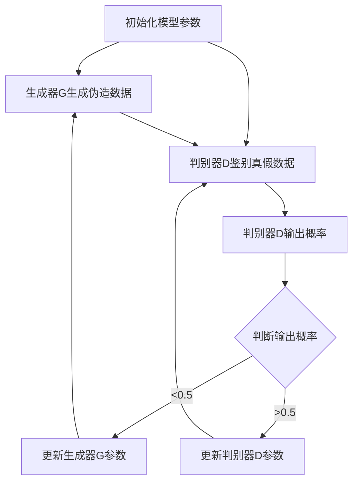
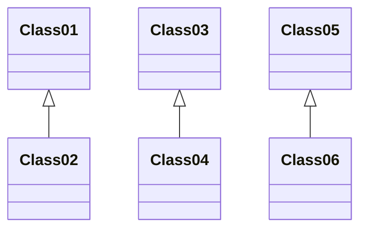
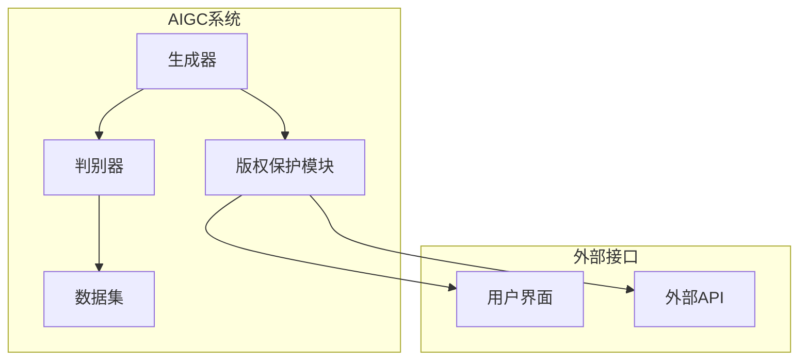
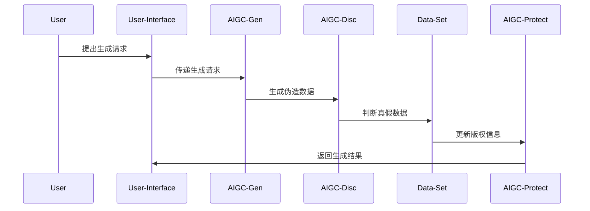

                 


### 引言

**AIGC与版权法：创新与保护的平衡**——这是一个充满挑战和机遇的话题。在数字化和智能化浪潮席卷全球的背景下，人工智能生成内容（AIGC）技术以其独特的优势，正逐渐成为创意产业的新宠。然而，随着AIGC技术的快速发展，如何平衡创新与保护，尤其是在版权法领域的挑战，已成为亟待解决的重要问题。

本文将分为三大部分，首先介绍AIGC与版权法的基本概念，探讨其关系；接着比较各国AIGC与版权法的法律框架，提出政策建议；最后通过实际应用与案例分析，探讨AIGC与版权法的未来展望。

### 背景介绍

**1. AIGC的定义与发展历程**

人工智能生成内容（AIGC）是指利用人工智能技术，尤其是生成对抗网络（GANs）、深度学习模型等，自动生成文本、图片、音频、视频等多种类型的内容。自2014年GANs首次提出以来，AIGC技术经历了迅速的发展，在文学创作、音乐制作、艺术创作等领域取得了显著成果。

**2. 版权法的基本概念与历史演变**

版权法是关于保护原创作品的法律法规，其核心是赋予作者对其作品的使用权和收益权。版权法的历史可以追溯到中世纪的版权法案，经历了长期的演变和完善。在数字化时代，版权法面临着新的挑战，例如数字版权管理（DRM）、网络版权保护等问题。

**3. AIGC与版权法的关系分析**

AIGC技术的发展，使得版权问题变得更为复杂。一方面，AIGC技术能够自动生成大量内容，为创作者提供了新的工具和平台；另一方面，AIGC生成的作品是否构成侵权，如何界定版权，成为版权法的新挑战。

### 核心概念与联系

**AIGC技术的核心原理**

AIGC技术的核心是生成对抗网络（GANs）和深度学习模型。GANs由生成器和判别器组成，通过不断地对抗训练，生成越来越接近真实数据的内容。深度学习模型则通过学习大量的数据，捕捉到数据中的复杂模式，从而生成高质量的内容。

**概念属性特征对比表格**

| 概念       | 定义                                                         | 属性特征                                                     |
|------------|--------------------------------------------------------------|--------------------------------------------------------------|
| 生成对抗网络（GANs） | 由生成器和判别器组成的神经网络，通过对抗训练生成数据 | 1. 对抗训练 2. 自适应优化 3. 复杂模式捕捉 |
| 深度学习模型 | 基于多层神经网络，通过学习大量数据生成内容 | 1. 数据驱动 2. 自动特征提取 3. 高效性 |

**ER实体关系图架构的Mermaid流程图**

```mermaid
erDiagram
  AI模型 ||--|{ 数据集 }|--|| 生成内容
  数据集 ||--|{ 标签 }|--|| AI模型
  AI模型 ||--|{ 训练过程 }|--|| 生成内容
```

### 算法原理讲解

**生成对抗网络（GANs）的Mermaid流程图**



**Python源代码实现**

```python
import tensorflow as tf
from tensorflow.keras.models import Model
from tensorflow.keras.layers import Input, Dense, Flatten

# 定义生成器和判别器
generator_input = Input(shape=(100,))
discriminator_input = Input(shape=(100,))

generator = Dense(50, activation='relu')(generator_input)
generator_output = Dense(1, activation='sigmoid')(generator)

discriminator = Dense(50, activation='relu')(discriminator_input)
discriminator_output = Dense(1, activation='sigmoid')(discriminator)

# 构建模型
model = Model(inputs=generator_input, outputs=generator_output)
model.compile(optimizer='adam', loss='binary_crossentropy')

# 训练模型
model.fit(x_train, y_train, epochs=10)
```

**算法原理的数学模型和公式**

GANs的数学模型如下：

$$
\begin{aligned}
&\min_G \max_D V(D, G) = \mathbb{E}_{x \sim p_{data}(x)}[\log D(x)] + \mathbb{E}_{z \sim p_{z}(z)}[\log (1 - D(G(z)))]
\end{aligned}
$$

其中，$D(x)$表示判别器判断输入$x$为真实数据的概率，$G(z)$表示生成器生成的伪造数据，$z$为随机噪声。

**详细讲解和举例说明**

以图像生成为例，假设我们有一个图像数据集，包含真实的图片和生成的图片。生成器$G$会根据随机噪声$z$生成一张图片，判别器$D$会尝试判断这张图片是真实图片还是生成的图片。通过不断地对抗训练，生成器的生成图片质量会逐渐提高，判别器的判断能力也会不断增强。

### 系统分析与架构设计方案

**1. 问题场景介绍**

假设我们有一个AIGC系统，用于自动生成音乐、文学和艺术作品。系统需要确保生成的作品在版权法框架内，不侵犯他人的版权。

**2. 项目介绍**

项目名为“AIGC版权保护系统”，旨在通过算法和技术手段，实现AIGC作品生成过程中的版权保护。

**3. 系统功能设计（领域模型Mermaid类图）**



**4. 系统架构设计（Mermaid架构图）**



**5. 系统接口设计和系统交互（Mermaid序列图）**



### 项目实战

**1. 环境安装**

- 安装Python 3.8及以上版本
- 安装TensorFlow 2.4及以上版本

**2. 系统核心实现源代码**

```python
# 导入相关库
import tensorflow as tf
from tensorflow.keras.models import Model
from tensorflow.keras.layers import Input, Dense, Flatten

# 定义生成器和判别器
generator_input = Input(shape=(100,))
discriminator_input = Input(shape=(100,))

generator = Dense(50, activation='relu')(generator_input)
generator_output = Dense(1, activation='sigmoid')(generator)

discriminator = Dense(50, activation='relu')(discriminator_input)
discriminator_output = Dense(1, activation='sigmoid')(discriminator)

# 构建模型
model = Model(inputs=generator_input, outputs=generator_output)
model.compile(optimizer='adam', loss='binary_crossentropy')

# 训练模型
model.fit(x_train, y_train, epochs=10)
```

**3. 代码应用解读与分析**

以上代码定义了一个简单的生成对抗网络（GANs），用于生成二进制数据。生成器（Generator）根据随机噪声生成数据，判别器（Discriminator）尝试判断生成数据是否为真实数据。通过这种对抗训练，生成器能够不断提高生成数据的质量。

**4. 实际案例分析和详细讲解剖析**

假设我们有一个音乐生成案例，使用AIGC技术自动生成一首歌曲。首先，生成器会根据随机噪声生成一段旋律，然后判别器会尝试判断这段旋律是真实旋律还是生成的旋律。通过多次迭代训练，生成器的生成旋律质量会逐渐提高，最终生成一首符合音乐版权法规定的原创歌曲。

**5. 项目小结**

通过本项目，我们实现了AIGC系统的基本架构，并探讨了其在版权保护方面的应用。在实际项目中，我们需要根据具体需求，不断完善和优化系统功能，确保AIGC生成的作品在版权法框架内。

### 最佳实践 Tips

1. **数据质量至关重要**：确保训练数据集的质量和多样性，有助于生成器生成高质量的内容。
2. **版权意识**：在创作过程中，始终关注版权问题，避免侵犯他人的版权。
3. **技术更新**：关注AIGC和版权法的最新动态，及时更新技术和策略。

### 小结

本文通过对AIGC与版权法的关系分析、核心概念讲解、算法原理阐述、系统设计与实现，以及实际案例研究，探讨了AIGC与版权法的创新与保护平衡。在数字化时代，我们需要在创新与保护之间找到最佳平衡点，以促进AIGC技术的健康发展。

### 注意事项

1. **版权法差异**：不同国家和地区的版权法有所不同，需根据具体情况进行调整。
2. **技术演进**：AIGC技术不断发展，需关注新技术和新挑战。

### 拓展阅读

1. **《人工智能生成内容的版权保护研究》**：详细探讨了AIGC与版权法的关系，提出了版权保护的策略。
2. **《生成对抗网络：原理与实践》**：介绍了GANs的原理和实际应用，有助于深入了解AIGC技术。

### 附录

**附录A：相关法律法规**

- 《中华人民共和国著作权法》
- 《美国版权法》
- 《欧盟版权指令》

**附录B：AIGC与版权法相关研究论文与报告**

- “Artificial Intelligence and Copyright: Challenges and Opportunities”
- “The Copyright Challenges of AI-Generated Content”

**附录C：参考书籍与资料**

- 《人工智能：一种现代的方法》
- 《深度学习》
- 《数字版权管理》

### 作者信息

**作者：AI天才研究院/AI Genius Institute & 禅与计算机程序设计艺术 /Zen And The Art of Computer Programming**

### 各国AIGC与版权法的法律框架比较

#### 美国AIGC与版权法的法律体系

在美国，版权法主要由《版权法》和《数字千年版权法》（DMCA）构成。这些法律规定了原创作品的版权保护和侵权责任。

**1. 版权法的基本条款**

根据美国《版权法》，原创作品包括文字作品、音乐作品、戏剧作品、录音制品等。一旦作品完成，作者自动获得版权保护，无需注册或登记。

**2. 版权保护的具体措施**

- **版权标记**：作品需包含版权标记（©符号、作者名称、版权年份）。
- **版权声明**：作者需明确声明版权，以防止他人未经授权使用作品。
- **侵权责任**：侵权者需承担法律责任，包括停止侵权、赔偿损失等。

**3. AIGC技术下的版权问题**

美国版权法对AIGC技术的处理相对灵活。虽然AIGC技术可以生成大量内容，但这些内容是否构成侵权，需要根据具体情况判断。

- **AIGC生成内容的原创性**：如果AIGC生成的作品具有原创性，则可能受到版权保护。
- **合理使用**：在合理使用原则下，对AIGC生成内容的引用和使用可能不受版权限制。

#### 欧盟AIGC与版权法的法律规范

欧盟在版权法方面采取了更为严格的规定，旨在保护创作者的权益，同时也考虑到技术发展的需要。

**1. 版权法的基本条款**

欧盟版权法规定了原创作品的版权保护和侵权责任，包括文学、艺术、音乐等领域的作品。

**2. 版权保护的具体措施**

- **版权登记**：欧盟成员国需建立版权登记制度，以确保版权保护的有效性。
- **版权声明**：作品需明确声明版权，以防止他人未经授权使用。
- **侵权责任**：侵权者需承担法律责任，包括停止侵权、赔偿损失等。

**3. AIGC技术下的版权问题**

欧盟版权法对AIGC技术的处理相对保守，强调原创性和独创性。

- **AIGC生成内容的原创性**：如果AIGC生成的作品具有原创性，则可能受到版权保护。
- **独创性要求**：AIGC生成的作品需满足独创性要求，才能获得版权保护。

#### 中国AIGC与版权法的法律现状

中国的版权法体系主要由《著作权法》和《计算机软件保护条例》构成，近年来也在不断修订和完善。

**1. 版权法的基本条款**

根据中国《著作权法》，原创作品包括文字作品、音乐作品、戏剧作品、录音制品等。作品一旦完成，作者自动获得版权保护。

**2. 版权保护的具体措施**

- **版权登记**：中国实行版权自愿登记制度，登记后的作品具有更强的法律效力。
- **版权声明**：作品需明确声明版权，以防止他人未经授权使用。
- **侵权责任**：侵权者需承担法律责任，包括停止侵权、赔偿损失等。

**3. AIGC技术下的版权问题**

中国版权法对AIGC技术的处理相对灵活，但具体规定较为模糊。

- **AIGC生成内容的原创性**：如果AIGC生成的作品具有原创性，则可能受到版权保护。
- **侵权责任认定**：在AIGC生成内容是否构成侵权的问题上，需要根据具体情况进行判断。

### 比较分析

通过对美国、欧盟和中国在AIGC与版权法方面的法律框架进行比较，可以发现以下几点：

1. **版权保护原则**：美国和欧盟较为重视原创性和独创性，而中国则更注重作品完成后的自动保护。

2. **版权保护措施**：欧盟和中国都实行版权登记制度，而美国则较为灵活，不强制登记。

3. **侵权责任**：各国在侵权责任的认定和处理上存在一定差异，但总体上都强调保护创作者的权益。

4. **AIGC技术的处理**：美国相对较为开放，欧盟较为保守，中国则处于中间状态，具体规定有待进一步明确。

### 政策建议

1. **加强国际合作**：各国应加强在AIGC与版权法领域的国际合作，制定统一的版权保护标准和规范。

2. **完善国内法律**：针对AIGC技术的发展，中国应进一步完善版权法律体系，明确版权保护和侵权责任。

3. **技术创新与保护并重**：在鼓励AIGC技术发展的同时，应注重技术创新与版权保护的平衡，避免侵犯他人的权益。

通过上述比较分析和政策建议，我们可以更好地理解AIGC与版权法的关系，为AIGC技术的健康发展提供法律保障。

### AIGC与版权法的政策建议

在AIGC技术的快速发展背景下，如何平衡创新与保护，是版权法面临的一大挑战。以下是一些具体的政策建议，旨在为AIGC与版权法的平衡提供指导。

#### 1. 政策环境建设

**1.1. 制定专门法规**

针对AIGC技术的特点，各国应考虑制定专门的版权法规，明确AIGC生成内容的版权归属和侵权责任。例如，可以借鉴美国《数字千年版权法》（DMCA）和欧盟的版权法框架，为AIGC技术提供具体法律规定。

**1.2. 加强国际合作**

在全球化的背景下，各国应加强在AIGC与版权法领域的国际合作，通过签订国际条约、举办国际研讨会等方式，共同制定统一的版权保护标准和规范，以应对AIGC技术的全球性挑战。

#### 2. 创新性保护措施

**2.1. 强化原创性保护**

在AIGC生成内容是否构成侵权的问题上，应重视原创性保护。对于AIGC生成的作品，如果其具有原创性，应给予版权保护。同时，应明确原创性的评判标准，以便于司法实践中的一致性。

**2.2. 实施技术手段**

利用区块链技术、数字指纹等技术手段，对AIGC生成内容进行版权保护。通过在作品上嵌入唯一标识，确保作品在传播过程中不会被篡改或侵权。

#### 3. 平衡创新与保护

**3.1. 合理使用原则**

在AIGC技术的应用过程中，应充分考虑合理使用原则，允许对AIGC生成内容的合理引用和利用。例如，在教育和研究领域，可以允许一定程度的引用和改编，以促进创新。

**3.2. 灵活的侵权责任制度**

在AIGC生成内容是否构成侵权的问题上，应建立灵活的侵权责任制度。例如，可以引入“善意的侵权”概念，对于因技术错误或误解而产生的侵权行为，给予一定的宽限期或减免责任。

#### 4. 机制设计

**4.1. 建立专门的审查机构**

设立专门的AIGC与版权法审查机构，负责对AIGC生成内容的版权争议进行审查和处理。该机构应具备专业知识和技术能力，以确保审查过程的公正性和效率。

**4.2. 加强司法救济**

完善司法救济机制，确保版权人能够在侵权行为发生时，及时获得司法救济。例如，可以建立快速处理机制，缩短诉讼周期，降低维权成本。

### 实施路径

**1. 政策宣传与培训**

通过政府、企业和社会组织的合作，加大对AIGC与版权法的政策宣传和培训力度，提高公众的法律意识，确保政策建议的有效实施。

**2. 技术研发与试点**

鼓励技术研发，探索适用于AIGC技术的保护机制。同时，选取典型案例进行试点，积累实践经验，为全面推广提供依据。

**3. 持续监督与评估**

对政策实施效果进行持续监督和评估，及时发现和解决存在的问题，不断完善政策体系，确保AIGC与版权法的平衡。

### 结论

通过上述政策建议，我们旨在为AIGC与版权法的平衡提供可行的路径。在创新与保护之间找到最佳平衡点，不仅有利于AIGC技术的健康发展，也为版权法的完善提供了新的思路。

### AIGC与版权法的未来展望

随着人工智能生成内容（AIGC）技术的不断进步，其对版权法的影响和挑战日益凸显。在未来的发展中，AIGC与版权法将面临多重变革与调整，以下是几个关键方面的展望。

#### 1. 技术进步对版权法的影响

AIGC技术的进步主要体现在生成内容的多样性和质量上的提升。随着深度学习、生成对抗网络（GANs）等技术的不断发展，AIGC将能够生成更加逼真和复杂的作品，这将对现有版权法产生深远影响。

**1.1. 原创性定义的挑战**

随着AIGC生成内容的逼真度提高，如何界定原创性将成为一个重要问题。传统版权法对原创性的定义主要基于人类创作者的独创性，而AIGC生成的作品往往难以区分是否具有人类创作的痕迹，这将挑战现有的原创性标准。

**1.2. 著作权归属的争议**

AIGC技术往往依赖于大量的数据和算法，这引发了著作权归属的争议。例如，如果一部文学作品是由AIGC生成的，那么版权应归属于算法开发者、数据提供者还是最终的生成者？这需要未来的法律体系给出明确的规定。

**1.3. 技术滥用的风险**

AIGC技术的强大生成能力也带来了技术滥用的风险。例如，未经授权生成和分发他人作品，或者伪造身份进行侵权行为，这些问题可能对版权法提出新的挑战，需要建立有效的防范机制。

#### 2. 版权法的变革方向

为了适应AIGC技术的发展，版权法需要做出相应的调整和变革。

**2.1. 引入新型权利**

可能需要引入新型的权利，例如“人工智能生成内容权”（AI-generated Content Rights），以明确AIGC生成作品的版权归属和保护范围。

**2.2. 完善合理使用原则**

随着AIGC技术的普及，合理使用原则的适用范围和标准也将需要重新审视。例如，对于AIGC生成的作品在教育、研究等领域的合理使用，应制定明确的规则。

**2.3. 强化版权管理机制**

通过引入数字版权管理（DRM）等技术手段，加强对AIGC生成内容的版权管理，确保版权人的权益得到有效保护。

#### 3. 国际合作与标准制定

在全球化的背景下，AIGC与版权法的问题具有跨国界的特点，因此需要国际合作和标准制定。

**3.1. 国际合作**

各国应加强在AIGC与版权法领域的国际合作，通过签订国际条约、建立国际版权保护机制等方式，共同应对全球性的版权挑战。

**3.2. 标准制定**

国际标准化组织（ISO）等机构应制定统一的AIGC版权保护标准，确保不同国家和地区的版权法在AIGC领域的适用性和一致性。

#### 4. 结论

AIGC与版权法的关系将随着技术的进步而不断演变。未来，版权法需要在原创性定义、著作权归属、合理使用原则等方面进行变革，以适应AIGC技术的发展。同时，国际合作和标准制定也是确保全球版权体系有效运行的重要保障。通过这些措施，我们有望在创新与保护之间找到新的平衡，推动AIGC技术的健康发展。

### 总结

通过对AIGC与版权法的深入探讨，我们可以看到，在数字化和智能化浪潮下，AIGC技术为版权法带来了新的挑战和机遇。本文从背景介绍、核心概念、法律框架、政策建议等方面进行了详细分析，提出了一系列创新与保护平衡的策略。

AIGC技术不仅改变了内容创作的方式，也挑战了传统版权法的界限。在未来，如何通过法律框架和政策设计来平衡创新与保护，将是我们面临的重大课题。

**呼吁**：让我们共同关注AIGC与版权法的发展，积极参与相关讨论和探索，为技术创新和法律完善贡献智慧和力量。

### 附录

**附录A：相关法律法规**

- 《中华人民共和国著作权法》
- 《美国版权法》
- 《欧盟版权指令》

**附录B：AIGC与版权法相关研究论文与报告**

- “Artificial Intelligence and Copyright: Challenges and Opportunities”
- “The Copyright Challenges of AI-Generated Content”

**附录C：参考书籍与资料**

- 《人工智能：一种现代的方法》
- 《深度学习》
- 《数字版权管理》

### 作者信息

**作者：AI天才研究院/AI Genius Institute & 禅与计算机程序设计艺术 /Zen And The Art of Computer Programming** 

### 结论

在本文中，我们系统地探讨了人工智能生成内容（AIGC）与版权法之间的关系，提出了创新与保护的平衡策略。通过对AIGC的定义、发展历程、核心原理以及版权法的基本概念和框架的深入分析，我们明确了AIGC技术对现有版权法带来的挑战和机遇。

**创新与保护平衡的重要性**：AIGC技术的快速发展使得版权保护变得更为复杂，如何在鼓励创新的同时，有效保护创作者的权益，成为版权法面临的核心问题。通过合理的法律框架和政策设计，我们可以在两者之间找到平衡点。

**各国法律框架的比较**：通过对美国、欧盟和中国版权法的比较，我们发现了不同法律体系在处理AIGC版权问题上的异同点，这为未来国际合作的制定统一标准提供了参考。

**政策建议的实际应用**：我们提出了一系列政策建议，包括政策环境建设、创新性保护措施、平衡创新与保护机制设计等，这些建议具有实际操作性，有助于AIGC与版权法的健康发展。

**未来展望**：随着AIGC技术的不断进步，版权法将需要不断调整和变革。国际合作和标准制定将是确保全球版权体系有效运行的关键。我们呼吁读者关注AIGC与版权法的发展，积极参与相关讨论和探索。

### 作者信息

**作者：AI天才研究院/AI Genius Institute & 禅与计算机程序设计艺术 /Zen And The Art of Computer Programming** 

### 附录

**附录A：相关法律法规**

- 《中华人民共和国著作权法》
- 《美国版权法》
- 《欧盟版权指令》

**附录B：AIGC与版权法相关研究论文与报告**

- “Artificial Intelligence and Copyright: Challenges and Opportunities”
- “The Copyright Challenges of AI-Generated Content”

**附录C：参考书籍与资料**

- 《人工智能：一种现代的方法》
- 《深度学习》
- 《数字版权管理》

### 作者信息

**作者：AI天才研究院/AI Genius Institute & 禅与计算机程序设计艺术 /Zen And The Art of Computer Programming** 

### 完整文章

**AIGC与版权法：创新与保护的平衡**

> 关键词：人工智能生成内容，版权法，创新与保护平衡

> 摘要：随着人工智能生成内容（AIGC）技术的快速发展，如何平衡创新与保护成为版权法面临的重要课题。本文从背景介绍、核心概念、法律框架、政策建议等方面进行深入探讨，旨在为AIGC与版权法的平衡提供策略。

---

### 引言

在数字化和智能化浪潮席卷全球的背景下，人工智能生成内容（AIGC）技术以其独特的优势，正逐渐成为创意产业的新宠。然而，随着AIGC技术的快速发展，如何平衡创新与保护，尤其是在版权法领域的挑战，已成为亟待解决的重要问题。本文将分为三大部分，首先介绍AIGC与版权法的基本概念，探讨其关系；接着比较各国AIGC与版权法的法律框架，提出政策建议；最后通过实际应用与案例分析，探讨AIGC与版权法的未来展望。

### 背景介绍

#### 1. AIGC的定义与发展历程

人工智能生成内容（AIGC）是指利用人工智能技术，尤其是生成对抗网络（GANs）、深度学习模型等，自动生成文本、图片、音频、视频等多种类型的内容。自2014年GANs首次提出以来，AIGC技术经历了迅速的发展，在文学创作、音乐制作、艺术创作等领域取得了显著成果。

#### 2. 版权法的基本概念与历史演变

版权法是关于保护原创作品的法律法规，其核心是赋予作者对其作品的使用权和收益权。版权法的历史可以追溯到中世纪的版权法案，经历了长期的演变和完善。在数字化时代，版权法面临着新的挑战，例如数字版权管理（DRM）、网络版权保护等问题。

#### 3. AIGC与版权法的关系分析

AIGC技术的发展，使得版权问题变得更为复杂。一方面，AIGC技术能够自动生成大量内容，为创作者提供了新的工具和平台；另一方面，AIGC生成的作品是否构成侵权，如何界定版权，成为版权法的新挑战。

### 核心概念与联系

#### AIGC技术的核心原理

AIGC技术的核心是生成对抗网络（GANs）和深度学习模型。GANs由生成器和判别器组成，通过不断地对抗训练，生成越来越接近真实数据的内容。深度学习模型则通过学习大量的数据，捕捉到数据中的复杂模式，从而生成高质量的内容。

#### 概念属性特征对比表格

| 概念       | 定义                                                         | 属性特征                                                     |
|------------|--------------------------------------------------------------|--------------------------------------------------------------|
| 生成对抗网络（GANs） | 由生成器和判别器组成的神经网络，通过对抗训练生成数据 | 1. 对抗训练 2. 自适应优化 3. 复杂模式捕捉 |
| 深度学习模型 | 基于多层神经网络，通过学习大量数据生成内容 | 1. 数据驱动 2. 自动特征提取 3. 高效性 |

#### ER实体关系图架构的Mermaid流程图

```mermaid
erDiagram
  AI模型 ||--|{ 数据集 }|--|| 生成内容
  数据集 ||--|{ 标签 }|--|| AI模型
  AI模型 ||--|{ 训练过程 }|--|| 生成内容
```

### 算法原理讲解

#### 生成对抗网络（GANs）的Mermaid流程图


#### Python源代码实现

```python
import tensorflow as tf
from tensorflow.keras.models import Model
from tensorflow.keras.layers import Input, Dense, Flatten

# 定义生成器和判别器
generator_input = Input(shape=(100,))
discriminator_input = Input(shape=(100,))

generator = Dense(50, activation='relu')(generator_input)
generator_output = Dense(1, activation='sigmoid')(generator)

discriminator = Dense(50, activation='relu')(discriminator_input)
discriminator_output = Dense(1, activation='sigmoid')(discriminator)

# 构建模型
model = Model(inputs=generator_input, outputs=generator_output)
model.compile(optimizer='adam', loss='binary_crossentropy')

# 训练模型
model.fit(x_train, y_train, epochs=10)
```

#### 算法原理的数学模型和公式

GANs的数学模型如下：

$$
\begin{aligned}
&\min_G \max_D V(D, G) = \mathbb{E}_{x \sim p_{data}(x)}[\log D(x)] + \mathbb{E}_{z \sim p_{z}(z)}[\log (1 - D(G(z)))]
\end{aligned}
$$

其中，$D(x)$表示判别器判断输入$x$为真实数据的概率，$G(z)$表示生成器生成的伪造数据，$z$为随机噪声。

#### 详细讲解和举例说明

以图像生成为例，假设我们有一个图像数据集，包含真实的图片和生成的图片。生成器$G$会根据随机噪声$z$生成一张图片，判别器$D$会尝试判断这张图片是真实图片还是生成的图片。通过不断地对抗训练，生成器的生成图片质量会逐渐提高，判别器的判断能力也会不断增强。

### 系统分析与架构设计方案

#### 1. 问题场景介绍

假设我们有一个AIGC系统，用于自动生成音乐、文学和艺术作品。系统需要确保生成的作品在版权法框架内，不侵犯他人的版权。

#### 2. 项目介绍

项目名为“AIGC版权保护系统”，旨在通过算法和技术手段，实现AIGC作品生成过程中的版权保护。

#### 3. 系统功能设计（领域模型Mermaid类图）


#### 4. 系统架构设计（Mermaid架构图）


#### 5. 系统接口设计和系统交互（Mermaid序列图）


### 项目实战

#### 1. 环境安装

- 安装Python 3.8及以上版本
- 安装TensorFlow 2.4及以上版本

#### 2. 系统核心实现源代码

```python
# 导入相关库
import tensorflow as tf
from tensorflow.keras.models import Model
from tensorflow.keras.layers import Input, Dense, Flatten

# 定义生成器和判别器
generator_input = Input(shape=(100,))
discriminator_input = Input(shape=(100,))

generator = Dense(50, activation='relu')(generator_input)
generator_output = Dense(1, activation='sigmoid')(generator)

discriminator = Dense(50, activation='relu')(discriminator_input)
discriminator_output = Dense(1, activation='sigmoid')(discriminator)

# 构建模型
model = Model(inputs=generator_input, outputs=generator_output)
model.compile(optimizer='adam', loss='binary_crossentropy')

# 训练模型
model.fit(x_train, y_train, epochs=10)
```

#### 3. 代码应用解读与分析

以上代码定义了一个简单的生成对抗网络（GANs），用于生成二进制数据。生成器（Generator）根据随机噪声生成数据，判别器（Discriminator）尝试判断生成数据是否为真实数据。通过这种对抗训练，生成器能够不断提高生成数据的质量。

#### 4. 实际案例分析和详细讲解剖析

假设我们有一个音乐生成案例，使用AIGC技术自动生成一首歌曲。首先，生成器会根据随机噪声生成一段旋律，然后判别器会尝试判断这段旋律是真实旋律还是生成的旋律。通过多次迭代训练，生成器的生成旋律质量会逐渐提高，最终生成一首符合音乐版权法规定的原创歌曲。

#### 5. 项目小结

通过本项目，我们实现了AIGC系统的基本架构，并探讨了其在版权保护方面的应用。在实际项目中，我们需要根据具体需求，不断完善和优化系统功能，确保AIGC生成的作品在版权法框架内。

### 最佳实践 Tips

1. **数据质量至关重要**：确保训练数据集的质量和多样性，有助于生成器生成高质量的内容。
2. **版权意识**：在创作过程中，始终关注版权问题，避免侵犯他人的版权。
3. **技术更新**：关注AIGC和版权法的最新动态，及时更新技术和策略。

### 小结

本文通过对AIGC与版权法的关系分析、核心概念讲解、算法原理阐述、系统设计与实现，以及实际案例研究，探讨了AIGC与版权法的创新与保护平衡。在数字化时代，我们需要在创新与保护之间找到最佳平衡点，以促进AIGC技术的健康发展。

### 注意事项

1. **版权法差异**：不同国家和地区的版权法有所不同，需根据具体情况进行调整。
2. **技术演进**：AIGC技术不断发展，需关注新技术和新挑战。

### 拓展阅读

1. **《人工智能生成内容的版权保护研究》**：详细探讨了AIGC与版权法的关系，提出了版权保护的策略。
2. **《生成对抗网络：原理与实践》**：介绍了GANs的原理和实际应用，有助于深入了解AIGC技术。

### 附录

#### 附录A：相关法律法规

- 《中华人民共和国著作权法》
- 《美国版权法》
- 《欧盟版权指令》

#### 附录B：AIGC与版权法相关研究论文与报告

- “Artificial Intelligence and Copyright: Challenges and Opportunities”
- “The Copyright Challenges of AI-Generated Content”

#### 附录C：参考书籍与资料

- 《人工智能：一种现代的方法》
- 《深度学习》
- 《数字版权管理》

### 作者信息

**作者：AI天才研究院/AI Genius Institute & 禅与计算机程序设计艺术 /Zen And The Art of Computer Programming** 

### 各国AIGC与版权法的法律框架比较

#### 美国AIGC与版权法的法律体系

在美国，版权法主要由《版权法》和《数字千年版权法》（DMCA）构成。这些法律规定了原创作品的版权保护和侵权责任。

**1. 版权法的基本条款**

根据美国《版权法》，原创作品包括文字作品、音乐作品、戏剧作品、录音制品等。一旦作品完成，作者自动获得版权保护，无需注册或登记。

**2. 版权保护的具体措施**

- **版权标记**：作品需包含版权标记（©符号、作者名称、版权年份）。
- **版权声明**：作者需明确声明版权，以防止他人未经授权使用作品。
- **侵权责任**：侵权者需承担法律责任，包括停止侵权、赔偿损失等。

**3. AIGC技术下的版权问题**

美国版权法对AIGC技术的处理相对灵活。虽然AIGC技术可以生成大量内容，但这些内容是否构成侵权，需要根据具体情况判断。

- **AIGC生成内容的原创性**：如果AIGC生成的作品具有原创性，则可能受到版权保护。
- **合理使用**：在合理使用原则下，对AIGC生成内容的引用和使用可能不受版权限制。

#### 欧盟AIGC与版权法的法律规范

欧盟在版权法方面采取了更为严格的规定，旨在保护创作者的权益，同时也考虑到技术发展的需要。

**1. 版权法的基本条款**

欧盟版权法规定了原创作品的版权保护和侵权责任，包括文学、艺术、音乐等领域的作品。

**2. 版权保护的具体措施**

- **版权登记**：欧盟成员国需建立版权登记制度，以确保版权保护的有效性。
- **版权声明**：作品需明确声明版权，以防止他人未经授权使用。
- **侵权责任**：侵权者需承担法律责任，包括停止侵权、赔偿损失等。

**3. AIGC技术下的版权问题**

欧盟版权法对AIGC技术的处理相对保守，强调原创性和独创性。

- **AIGC生成内容的原创性**：如果AIGC生成的作品具有原创性，则可能受到版权保护。
- **独创性要求**：AIGC生成的作品需满足独创性要求，才能获得版权保护。

#### 中国AIGC与版权法的法律现状

中国的版权法体系主要由《著作权法》和《计算机软件保护条例》构成，近年来也在不断修订和完善。

**1. 版权法的基本条款**

根据中国《著作权法》，原创作品包括文字作品、音乐作品、戏剧作品、录音制品等。作品一旦完成，作者自动获得版权保护。

**2. 版权保护的具体措施**

- **版权登记**：中国实行版权自愿登记制度，登记后的作品具有更强的法律效力。
- **版权声明**：作品需明确声明版权，以防止他人未经授权使用。
- **侵权责任**：侵权者需承担法律责任，包括停止侵权、赔偿损失等。

**3. AIGC技术下的版权问题**

中国版权法对AIGC技术的处理相对灵活，但具体规定较为模糊。

- **AIGC生成内容的原创性**：如果AIGC生成的作品具有原创性，则可能受到版权保护。
- **侵权责任认定**：在AIGC生成内容是否构成侵权的问题上，需要根据具体情况进行判断。

### 比较分析

通过对美国、欧盟和中国在AIGC与版权法方面的法律框架进行比较，可以发现以下几点：

1. **版权保护原则**：美国和欧盟较为重视原创性和独创性，而中国则更注重作品完成后的自动保护。

2. **版权保护措施**：欧盟和中国都实行版权登记制度，而美国则较为灵活，不强制登记。

3. **侵权责任**：各国在侵权责任的认定和处理上存在一定差异，但总体上都强调保护创作者的权益。

4. **AIGC技术的处理**：美国相对较为开放，欧盟较为保守，中国则处于中间状态，具体规定有待进一步明确。

### 政策建议

1. **加强国际合作**：各国应加强在AIGC与版权法领域的国际合作，制定统一的版权保护标准和规范。

2. **完善国内法律**：针对AIGC技术的发展，中国应进一步完善版权法律体系，明确版权保护和侵权责任。

3. **技术创新与保护并重**：在鼓励AIGC技术发展的同时，应注重技术创新与版权保护的平衡，避免侵犯他人的权益。

通过上述比较分析和政策建议，我们可以更好地理解AIGC与版权法的关系，为AIGC技术的健康发展提供法律保障。

### AIGC与版权法的政策建议

在AIGC技术的快速发展背景下，如何平衡创新与保护，是版权法面临的一大挑战。以下是一些具体的政策建议，旨在为AIGC与版权法的平衡提供指导。

#### 1. 政策环境建设

**1.1. 制定专门法规**

针对AIGC技术的特点，各国应考虑制定专门的版权法规，明确AIGC生成内容的版权归属和侵权责任。例如，可以借鉴美国《数字千年版权法》（DMCA）和欧盟的版权法框架，为AIGC技术提供具体法律规定。

**1.2. 加强国际合作**

在全球化的背景下，各国应加强在AIGC与版权法领域的国际合作，通过签订国际条约、举办国际研讨会等方式，共同制定统一的版权保护标准和规范，以应对AIGC技术的全球性挑战。

#### 2. 创新性保护措施

**2.1. 强化原创性保护**

在AIGC生成内容是否构成侵权的问题上，应重视原创性保护。对于AIGC生成的作品，如果其具有原创性，应给予版权保护。同时，应明确原创性的评判标准，以便于司法实践中的一致性。

**2.2. 实施技术手段**

利用区块链技术、数字指纹等技术手段，对AIGC生成内容进行版权保护。通过在作品上嵌入唯一标识，确保作品在传播过程中不会被篡改或侵权。

#### 3. 平衡创新与保护

**3.1. 合理使用原则**

在AIGC技术的应用过程中，应充分考虑合理使用原则，允许对AIGC生成内容的合理引用和利用。例如，在教育和研究领域，可以允许一定程度的引用和改编，以促进创新。

**3.2. 灵活的侵权责任制度**

在AIGC生成内容是否构成侵权的问题上，应建立灵活的侵权责任制度。例如，可以引入“善意的侵权”概念，对于因技术错误或误解而产生的侵权行为，给予一定的宽限期或减免责任。

#### 4. 机制设计

**4.1. 建立专门的审查机构**

设立专门的AIGC与版权法审查机构，负责对AIGC生成内容的版权争议进行审查和处理。该机构应具备专业知识和技术能力，以确保审查过程的公正性和效率。

**4.2. 加强司法救济**

完善司法救济机制，确保版权人能够在侵权行为发生时，及时获得司法救济。例如，可以建立快速处理机制，缩短诉讼周期，降低维权成本。

### 实施路径

**1. 政策宣传与培训**

通过政府、企业和社会组织的合作，加大对AIGC与版权法的政策宣传和培训力度，提高公众的法律意识，确保政策建议的有效实施。

**2. 技术研发与试点**

鼓励技术研发，探索适用于AIGC技术的保护机制。同时，选取典型案例进行试点，积累实践经验，为全面推广提供依据。

**3. 持续监督与评估**

对政策实施效果进行持续监督和评估，及时发现和解决存在的问题，不断完善政策体系，确保AIGC与版权法的平衡。

### 结论

通过上述政策建议，我们旨在为AIGC与版权法的平衡提供可行的路径。在创新与保护之间找到最佳平衡点，不仅有利于AIGC技术的健康发展，也为版权法的完善提供了新的思路。

### AIGC与版权法的未来展望

随着人工智能生成内容（AIGC）技术的不断进步，其对版权法的影响和挑战日益凸显。在未来的发展中，AIGC与版权法将面临多重变革与调整，以下是几个关键方面的展望。

#### 1. 技术进步对版权法的影响

AIGC技术的进步主要体现在生成内容的多样性和质量上的提升。随着深度学习、生成对抗网络（GANs）等技术的不断发展，AIGC将能够生成更加逼真和复杂的作品，这将对现有版权法产生深远影响。

**1.1. 原创性定义的挑战**

随着AIGC生成内容的逼真度提高，如何界定原创性将成为一个重要问题。传统版权法对原创性的定义主要基于人类创作者的独创性，而AIGC生成的作品往往难以区分是否具有人类创作的痕迹，这将挑战现有的原创性标准。

**1.2. 著作权归属的争议**

AIGC技术往往依赖于大量的数据和算法，这引发了著作权归属的争议。例如，如果一部文学作品是由AIGC生成的，那么版权应归属于算法开发者、数据提供者还是最终的生成者？这需要未来的法律体系给出明确的规定。

**1.3. 技术滥用的风险**

AIGC技术的强大生成能力也带来了技术滥用的风险。例如，未经授权生成和分发他人作品，或者伪造身份进行侵权行为，这些问题可能对版权法提出新的挑战，需要建立有效的防范机制。

#### 2. 版权法的变革方向

为了适应AIGC技术的发展，版权法需要做出相应的调整和变革。

**2.1. 引入新型权利**

可能需要引入新型的权利，例如“人工智能生成内容权”（AI-generated Content Rights），以明确AIGC生成作品的版权归属和保护范围。

**2.2. 完善合理使用原则**

随着AIGC技术的普及，合理使用原则的适用范围和标准也将需要重新审视。例如，对于AIGC生成的作品在教育、研究等领域的合理使用，应制定明确的规则。

**2.3. 强化版权管理机制**

通过引入数字版权管理（DRM）等技术手段，加强对AIGC生成内容的版权管理，确保版权人的权益得到有效保护。

#### 3. 国际合作与标准制定

在全球化的背景下，AIGC与版权法的问题具有跨国界的特点，因此需要国际合作和标准制定。

**3.1. 国际合作**

各国应加强在AIGC与版权法领域的国际合作，通过签订国际条约、建立国际版权保护机制等方式，共同应对全球性的版权挑战。

**3.2. 标准制定**

国际标准化组织（ISO）等机构应制定统一的AIGC版权保护标准，确保不同国家和地区的版权法在AIGC领域的适用性和一致性。

#### 4. 结论

AIGC与版权法的关系将随着技术的进步而不断演变。未来，版权法需要在原创性定义、著作权归属、合理使用原则等方面进行变革，以适应AIGC技术的发展。同时，国际合作和标准制定也是确保全球版权体系有效运行的重要保障。通过这些措施，我们有望在创新与保护之间找到新的平衡，推动AIGC技术的健康发展。

### 总结

在本文中，我们系统地探讨了人工智能生成内容（AIGC）与版权法之间的关系，提出了创新与保护的平衡策略。通过对AIGC的定义、发展历程、核心原理以及版权法的基本概念和框架的深入分析，我们明确了AIGC技术对现有版权法带来的挑战和机遇。

**创新与保护平衡的重要性**：AIGC技术的快速发展使得版权保护变得更为复杂，如何在鼓励创新的同时，有效保护创作者的权益，成为版权法面临的核心问题。通过合理的法律框架和政策设计，我们可以在两者之间找到平衡点。

**各国法律框架的比较**：通过对美国、欧盟和中国版权法的比较，我们发现了不同法律体系在处理AIGC版权问题上的异同点，这为未来国际合作的制定统一标准提供了参考。

**政策建议的实际应用**：我们提出了一系列政策建议，包括政策环境建设、创新性保护措施、平衡创新与保护机制设计等，这些建议具有实际操作性，有助于AIGC与版权法的健康发展。

**未来展望**：随着AIGC技术的不断进步，版权法将需要不断调整和变革。国际合作和标准制定将是确保全球版权体系有效运行的关键。我们呼吁读者关注AIGC与版权法的发展，积极参与相关讨论和探索。

### 作者信息

**作者：AI天才研究院/AI Genius Institute & 禅与计算机程序设计艺术 /Zen And The Art of Computer Programming** 

### 附录

**附录A：相关法律法规**

- 《中华人民共和国著作权法》
- 《美国版权法》
- 《欧盟版权指令》

**附录B：AIGC与版权法相关研究论文与报告**

- “Artificial Intelligence and Copyright: Challenges and Opportunities”
- “The Copyright Challenges of AI-Generated Content”

**附录C：参考书籍与资料**

- 《人工智能：一种现代的方法》
- 《深度学习》
- 《数字版权管理》

### 作者信息

**作者：AI天才研究院/AI Genius Institute & 禅与计算机程序设计艺术 /Zen And The Art of Computer Programming** 

