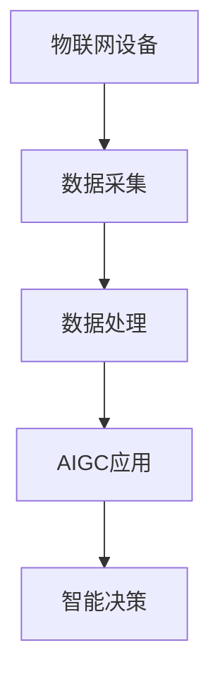

                 

### AIGC与物联网（IoT）的协同创新

#### 关键词：
- AIGC
- 物联网（IoT）
- 数据处理
- 智能家居
- 情感识别
- 自动化生成内容

#### 摘要：
本文深入探讨了AIGC（自动化生成内容）与物联网（IoT）的协同创新，解析了AIGC在物联网数据采集、处理与优化中的应用，以及两者在智能家居等领域的创新融合。文章通过具体案例展示了AIGC与IoT协同带来的技术进步和商业模式变革，展望了未来的发展方向和挑战。

## 第一部分：背景与核心概念

### 第1章：问题背景与核心概念

#### 1.1 问题背景

**物联网（IoT）的普及与挑战**

物联网作为下一代信息技术的重要方向，已经在全球范围内迅速普及。物联网通过连接各种物理设备和传感器，实现了数据的实时采集和传输，从而推动了工业、家庭、交通等多个领域的智能化发展。

**物联网的基本概念与发展历程**

物联网（Internet of Things，简称IoT）是指通过互联网将各种物理设备连接起来，实现信息的实时交互和共享。物联网的发展可以追溯到20世纪80年代，但真正的突破发生在21世纪初，随着无线通信技术和传感器技术的迅速发展，物联网开始进入大规模应用阶段。

**物联网在工业、家庭、交通等领域的应用案例**

在工业领域，物联网技术被广泛应用于智能工厂、智能制造和设备远程监控中，提高了生产效率和质量。在家庭领域，智能家居设备如智能音箱、智能灯光、智能空调等已经渗透到人们的生活中，为用户带来了便捷和舒适。在交通领域，物联网技术被用于智能交通系统、车辆远程监控和自动驾驶中，有效缓解了交通拥堵和提高了交通安全。

**物联网面临的数据规模、安全、标准化等问题**

随着物联网设备的增多和数据量的爆炸式增长，物联网面临着数据规模、数据安全、标准化等方面的问题。如何有效地管理和处理海量数据，确保数据安全和隐私保护，以及实现不同设备、系统和平台之间的互操作性，成为物联网发展的关键挑战。

**AIGC技术简介**

**自动化生成内容（AIGC）的定义与特点**

自动化生成内容（Automated Generation of Content，简称AIGC）是一种利用人工智能技术生成内容的方法。它通过算法模型，如生成对抗网络（GAN）、变分自编码器（VAE）等，能够自动生成文本、图像、音频等多种形式的内容。

AIGC的特点包括：

1. **高效性**：能够快速生成大量内容，提高生产效率。
2. **多样性**：可以根据不同的需求和场景，生成具有丰富多样性的内容。
3. **自适应**：能够根据用户反馈和需求，不断优化和改进生成的内容。

**AIGC在人工智能领域的应用与发展趋势**

AIGC技术在人工智能领域具有广泛的应用前景。在自然语言处理、图像识别、音频合成等方面，AIGC已经取得显著成果。未来，随着算法的进一步优化和硬件性能的提升，AIGC有望在更多领域得到应用，如自动驾驶、医疗诊断、娱乐等。

#### 1.2 核心概念与联系

**AIGC与IoT的融合**

物联网设备产生的海量数据是AIGC的重要输入，而AIGC技术则能够对这些数据进行处理和优化，从而实现物联网的智能化升级。例如，通过AIGC技术，可以自动化生成智能家居的个性化场景，提高用户的生活品质。

**物联网数据在AIGC中的应用**

物联网数据在AIGC中的应用主要体现在数据预处理、数据增强和内容生成等方面。AIGC技术可以通过自动化数据清洗、异常检测和修复，提高数据的质量和一致性。此外，AIGC还可以通过数据生成和扩充策略，为物联网应用提供更多的数据支持。

**AIGC对物联网数据处理与优化的影响**

AIGC技术能够大幅提升物联网数据的处理效率和效果，从而优化物联网系统的性能。例如，在智能交通领域，AIGC可以自动生成交通流量预测模型，优化交通信号控制策略，缓解交通拥堵。在智能家居领域，AIGC可以自动生成用户偏好模型，优化家居设备的运行策略，提高用户体验。

**核心概念对比表格**

| 核心概念 | 定义 | 特点 | 关联性 |
| :------: | :--: | :--: | :----: |
| AIGC     | 自动化生成内容 | 高效、多样、自适应 | 与物联网数据密切相关 |
| IoT      | 物联网 | 连接物理设备、实时数据交互 | 提供AIGC的数据来源 |

**ER实体关系图架构**

#### 1.3 本章小结

本章介绍了AIGC与物联网协同创新的重要背景和核心概念。通过分析物联网的发展挑战和AIGC的技术特点，阐述了AIGC在物联网数据采集、处理与优化中的应用前景。核心概念对比表格和ER实体关系图进一步明确了AIGC与物联网的关联性，为后续章节的深入探讨奠定了基础。

## 第二部分：AIGC技术在物联网中的应用

### 第2章：AIGC在物联网数据采集与处理中的应用

#### 2.1 物联网数据采集的挑战

**数据类型与来源**

物联网数据采集主要涉及以下几类数据：

1. **传感器数据**：来自各种物理传感器，如温度传感器、湿度传感器、加速度传感器等。
2. **设备日志数据**：设备运行过程中的日志记录，如操作系统日志、应用日志等。
3. **用户交互数据**：用户与物联网设备交互过程中产生的数据，如用户行为数据、用户反馈数据等。

**数据采集的挑战**

物联网数据采集面临以下挑战：

1. **数据质量与一致性**：由于物联网设备的多样性和分布性，数据采集过程中容易出现数据缺失、数据不一致等问题。
2. **数据传输效率与安全性**：物联网设备通常处于远程和移动状态，如何高效、安全地传输大量数据成为一大难题。

#### 2.2 AIGC技术在数据处理中的应用

**数据预处理**

数据预处理是物联网数据处理的重要环节，AIGC技术在以下方面发挥作用：

1. **自动化数据清洗**：利用AIGC技术，可以自动化识别和修复数据中的错误和异常，提高数据质量。
2. **异常数据检测**：通过分析历史数据，AIGC技术可以自动检测和标记异常数据，为后续处理提供依据。

**数据增强**

数据增强是提高物联网应用效果的关键技术，AIGC技术在以下方面发挥作用：

1. **数据生成与合成**：利用AIGC技术，可以自动生成模拟数据，补充缺失的数据，增强数据的多样性。
2. **数据扩充策略**：通过AIGC技术，可以自动生成新的数据样本，扩充训练数据集，提高模型性能。

#### 2.3 AIGC在物联网数据处理中的案例

**案例分析一：智能农业**

智能农业利用物联网技术监测农作物生长状况，AIGC技术在以下方面发挥作用：

1. **气象数据分析**：利用AIGC技术，可以对气象数据进行预处理和增强，生成准确的气象预测模型。
2. **农作物生长监测**：通过AIGC技术，可以自动生成农作物生长状况的监测报告，为农业生产提供科学依据。

**案例分析二：智能交通**

智能交通利用物联网技术优化交通管理，AIGC技术在以下方面发挥作用：

1. **交通事故预测**：利用AIGC技术，可以自动生成交通事故预测模型，提前预警可能发生的交通事故。
2. **交通流量优化**：通过AIGC技术，可以自动生成交通流量预测模型，优化交通信号控制和道路规划。

#### 2.4 本章小结

本章介绍了AIGC技术在物联网数据采集与处理中的应用，分析了物联网数据采集的挑战和AIGC技术在数据预处理和数据增强方面的作用。通过两个实际案例，展示了AIGC在智能农业和智能交通领域的应用效果，为AIGC与物联网的协同创新提供了有益的参考。

## 第三部分：物联网与AIGC的协同创新应用场景

### 第3章：智能家居的AIGC应用

#### 3.1 智能家居的AIGC应用概述

**智能家居概述**

智能家居是指通过物联网技术将家庭中的各种设备连接起来，实现智能化的控制和管理。智能家居设备包括智能音箱、智能灯光、智能空调、智能门锁等，用户可以通过智能手机、语音助手等远程控制家庭设备，提高生活品质。

**AIGC在智能家居中的应用**

AIGC技术在智能家居中的应用主要体现在以下几个方面：

1. **自动化场景生成**：利用AIGC技术，可以自动生成个性化智能家居场景，如起床模式、用餐模式等，根据用户需求和习惯自动调整家庭设备的运行状态。
2. **情感识别与交互**：通过AIGC技术，可以实现对用户情感的识别和响应，如通过语音识别和自然语言处理技术，识别用户的情感状态，提供相应的互动和服务。

#### 3.2 案例分析：智能音箱的AIGC应用

**智能音箱功能分析**

智能音箱是智能家居中的重要设备，其功能包括语音识别、自然语言处理、音频播放等。智能音箱可以通过语音指令控制家庭设备、查询天气信息、播放音乐等，为用户提供便捷的服务。

**AIGC技术实现**

1. **文本生成模型**：利用AIGC技术，可以自动生成智能音箱的语音回应，如对用户查询的天气信息进行自然流畅的播报。
2. **对话生成模型**：通过AIGC技术，可以自动生成多轮对话，实现与用户的自然交互。

**智能音箱AIGC应用案例**

1. **智能音箱的语音交互**：用户可以通过语音指令查询天气信息，智能音箱会自动生成语音回应，播报当前天气状况。
2. **智能音箱的情景模式**：用户可以通过语音指令设置家庭设备的情景模式，如睡前模式、观影模式等，智能音箱会自动调整家庭设备的运行状态，为用户提供舒适的生活环境。

#### 3.3 智能家居AIGC应用的挑战与展望

**技术挑战**

1. **数据隐私保护**：智能家居设备收集和传输的数据涉及用户隐私，如何确保数据安全成为一大挑战。
2. **跨设备协同**：智能家居设备通常来自不同的厂商和平台，如何实现设备间的互操作性和协同工作成为一大难题。

**未来展望**

1. **智能家居的AIGC创新方向**：随着AIGC技术的不断发展，未来智能家居的AIGC应用将更加广泛，如实现更智能的语音交互、情景模式生成等。
2. **AIGC在物联网领域的应用前景**：AIGC技术在物联网领域的应用前景广阔，如智能农业、智能交通、智能医疗等，通过AIGC技术，可以进一步提升物联网系统的智能化水平。

### 第4章：智能城市的AIGC应用

#### 4.1 智能城市概述

智能城市是指利用物联网、大数据、人工智能等先进技术，实现城市管理的智能化和高效化。智能城市通过实时采集和分析城市运行数据，优化城市资源分配，提高城市治理水平，提升居民生活质量。

**智能城市的概念与发展**

智能城市的概念起源于20世纪90年代，随着信息技术的迅猛发展，智能城市逐渐成为各国城市发展的重要方向。智能城市的发展经历了以下几个阶段：

1. **信息化阶段**：通过建立城市信息基础设施，实现数据的互联互通。
2. **数字化阶段**：利用大数据技术，对城市运行数据进行分析和处理。
3. **智能化阶段**：通过人工智能技术，实现城市管理的智能化和自动化。

**智能城市的主要功能**

智能城市的主要功能包括：

1. **智慧交通**：通过实时交通数据分析，优化交通信号控制和道路规划，提高交通效率，减少拥堵。
2. **智慧安防**：通过视频监控和数据分析，实现城市安全的实时监控和预警。
3. **智慧环保**：通过环境监测数据，实时监控城市环境质量，采取环保措施，改善环境状况。
4. **智慧能源**：通过智能电网和能源管理系统，实现能源的合理分配和高效利用。

#### 4.2 AIGC技术在智能城市中的应用

**AIGC技术在智慧交通中的应用**

智慧交通是智能城市的重要组成部分，AIGC技术在以下方面发挥作用：

1. **交通流量预测**：利用AIGC技术，可以自动生成交通流量预测模型，提前预测交通拥堵情况，优化交通信号控制和道路规划。
2. **智能调度**：通过AIGC技术，可以自动生成公共交通调度模型，提高公共交通的运行效率，减少乘客等待时间。

**AIGC技术在智慧安防中的应用**

智慧安防通过视频监控和数据分析，实现城市安全的实时监控和预警。AIGC技术在以下方面发挥作用：

1. **异常检测**：利用AIGC技术，可以自动检测和识别视频中的异常行为，如暴力事件、火灾等，及时发出警报。
2. **人脸识别**：通过AIGC技术，可以自动识别和追踪视频中的人脸，实现对特定目标的实时监控。

**AIGC技术在智慧环保中的应用**

智慧环保通过实时监测城市环境质量，采取环保措施，改善环境状况。AIGC技术在以下方面发挥作用：

1. **环境预测**：利用AIGC技术，可以自动生成环境质量预测模型，提前预测环境污染情况，采取相应的环保措施。
2. **智能控制**：通过AIGC技术，可以自动控制环保设备的运行，实现环境治理的智能化。

#### 4.3 AIGC在智能城市中的应用前景

**AIGC技术在智能城市中的应用前景非常广阔。未来，随着AIGC技术的不断发展，智能城市将实现更全面的智能化和自动化管理。以下是AIGC在智能城市中的几个潜在应用方向：**

1. **智慧医疗**：利用AIGC技术，可以实现智能医疗诊断、病情预测和治疗方案推荐，提高医疗服务的质量和效率。
2. **智慧教育**：利用AIGC技术，可以实现个性化教育、智能课程推荐和教学效果评估，提高教育水平和教育公平性。
3. **智慧能源**：利用AIGC技术，可以实现智能电网管理、能源消耗预测和优化控制，提高能源利用效率。
4. **智慧农业**：利用AIGC技术，可以实现智能农业监测、农作物生长预测和农田管理，提高农业生产效率和农产品质量。

### 第5章：AIGC与物联网协同创新的挑战与机遇

#### 5.1 挑战

**技术挑战**

1. **数据隐私保护**：AIGC与物联网协同创新过程中，涉及大量用户隐私数据，如何确保数据安全成为一大挑战。
2. **数据标准化**：物联网设备来自不同厂商和平台，数据格式和接口标准不统一，如何实现数据标准化成为一大难题。
3. **算法优化**：AIGC算法复杂度高，如何优化算法性能，提高处理效率和准确性，成为一项重要任务。

**安全挑战**

1. **设备安全**：物联网设备容易被黑客攻击，如何确保设备安全，防止设备被恶意利用，成为一项紧迫任务。
2. **网络安全**：物联网数据在传输过程中，容易受到网络攻击，如何确保数据传输安全，防止数据泄露和篡改，成为一项重要课题。
3. **数据隐私**：如何保护用户隐私数据，防止隐私泄露，成为一项重要挑战。

**生态挑战**

1. **行业标准**：AIGC与物联网协同创新需要统一行业标准，推动技术发展和市场应用，但当前行业标准尚不完善。
2. **产业链整合**：AIGC与物联网协同创新涉及多个产业链环节，如何实现产业链整合，形成良性发展生态，成为一项重要任务。
3. **跨学科合作**：AIGC与物联网协同创新需要跨学科合作，推动技术融合，但当前跨学科合作机制尚不成熟。

#### 5.2 机遇

**技术进步**

1. **算法优化**：随着AIGC算法的不断发展，物联网数据处理效率将得到大幅提升，为物联网应用提供更强大的支持。
2. **硬件升级**：物联网设备的硬件性能不断提升，为AIGC算法的运行提供了更好的硬件环境，有助于提升物联网应用效果。
3. **数据积累**：随着物联网设备的广泛应用，数据积累将越来越多，为AIGC算法提供了丰富的训练数据，有助于提高算法性能。

**商业模式创新**

1. **智能服务**：AIGC与物联网协同创新将推动智能服务的发展，为用户提供更加个性化、智能化的服务，提升用户体验。
2. **数据变现**：物联网设备产生的海量数据具有很高的商业价值，通过数据分析和挖掘，可以实现数据变现，为企业和政府创造经济价值。
3. **跨界融合**：AIGC与物联网协同创新将推动不同领域的跨界融合，创造新的商业模式和应用场景，拓展市场空间。

### 第6章：结语

#### 6.1 AIGC与物联网协同创新的意义

AIGC与物联网的协同创新具有重要意义，它不仅提升了物联网系统的智能化水平，还为各个领域带来了新的机遇和挑战。通过AIGC技术，物联网系统能够更加高效地处理和分析海量数据，实现智能化的决策和优化，提高系统的性能和用户体验。同时，AIGC与物联网的协同创新也为各领域的创新发展提供了新的思路和方法。

#### 6.2 未来展望

未来，随着AIGC技术的不断发展和物联网的广泛应用，AIGC与物联网的协同创新将取得更大的突破。在智能家居、智能城市、智能农业等领域，AIGC与物联网的融合将实现更加智能化、个性化的应用，为人类创造更美好的生活。同时，AIGC与物联网的协同创新也将带来新的商业模式和应用场景，推动技术进步和产业发展。作者信息：

作者：AI天才研究院/AI Genius Institute & 禅与计算机程序设计艺术 /Zen And The Art of Computer Programming

---

## 最佳实践 Tips

1. **数据隐私保护**：在AIGC与物联网协同创新过程中，要高度重视数据隐私保护，采取加密、匿名化等技术手段，确保用户数据安全。
2. **数据标准化**：推动物联网设备的数据标准化，实现不同设备、系统和平台之间的互操作性，提高数据处理效率。
3. **算法优化**：持续优化AIGC算法，提高算法性能和效率，为物联网应用提供更好的支持。
4. **安全防护**：加强物联网设备的安全防护，防止设备被恶意攻击，确保物联网系统的安全稳定运行。

## 小结

本文全面探讨了AIGC与物联网的协同创新，分析了AIGC在物联网数据采集、处理与优化中的应用，以及两者在智能家居、智能城市等领域的创新融合。通过具体案例，展示了AIGC与物联网协同带来的技术进步和商业模式变革。未来，AIGC与物联网的协同创新将继续发展，为各领域带来更多机遇和挑战。

## 注意事项

1. **技术风险**：在AIGC与物联网协同创新过程中，要注意技术风险，如算法错误、数据泄露等，确保技术安全和稳定性。
2. **市场风险**：关注市场动态，及时调整战略，应对市场竞争和变化。
3. **政策风险**：密切关注政策动态，遵守相关法律法规，确保合规运营。

## 拓展阅读

1. **《自动化生成内容：技术与应用》**：详细介绍了AIGC技术的原理和应用。
2. **《物联网架构与设计》**：探讨了物联网系统设计与架构优化。
3. **《智能城市与大数据》**：分析了智能城市的发展与大数据技术的关系。

