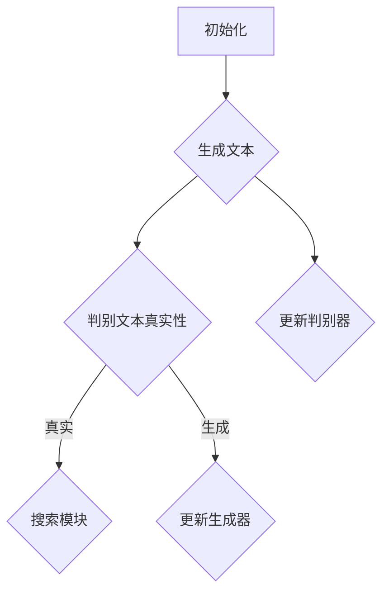
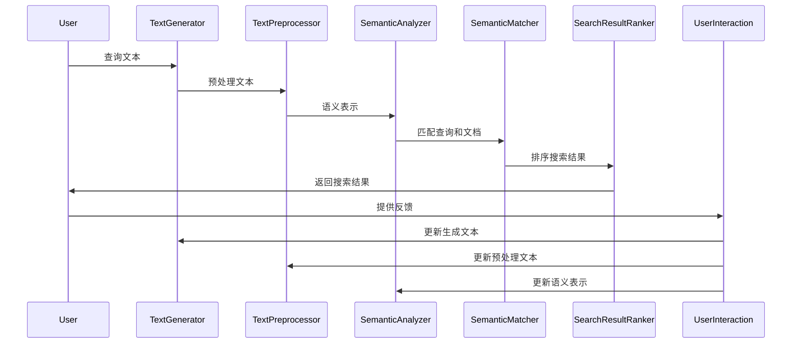

                 


### 第1章: 引言

#### 1.1 书籍目的与内容概述

在当今信息技术迅速发展的时代，人工智能（AI）已经成为推动科技进步的重要力量。随着AI技术的不断演进，生成内容（Generated Content，简称GC）成为了一个备受关注的研究领域。其中，人工智能生成内容（AI-generated Content，简称AIGC）以其高效、智能的特点，在语义搜索、内容创作、自动化新闻写作等方面展现出巨大的潜力。而自然语言理解（Natural Language Understanding，简称NLU）作为AI的重要分支，旨在使计算机具备理解人类语言的能力。

本书旨在探讨AIGC与自然语言理解在语义搜索中的融合，深入分析两者在技术原理、实现方法以及应用场景方面的联系。具体来说，本书将围绕以下几个核心主题进行探讨：

1. **AIGC与自然语言理解的基本概念**：介绍AIGC和NLU的定义、特点及其发展历程，为后续讨论奠定基础。
2. **AIGC与自然语言理解的融合技术**：探讨AIGC和NLU之间的融合机制，分析融合技术的基本原理、实现方法及其优势。
3. **语义搜索中的AIGC应用**：介绍语义搜索的基本原理，分析AIGC在语义搜索中的应用，讨论AIGC如何提升语义搜索的准确性和效率。
4. **算法原理讲解**：通过具体算法的讲解，深入剖析AIGC与自然语言理解在语义搜索中融合的技术细节。
5. **系统分析与架构设计**：介绍语义搜索系统的问题场景和项目背景，展示系统架构、接口设计和系统交互。
6. **项目实战**：通过实际项目案例，展示AIGC与自然语言理解在语义搜索中的应用，并提供详细的代码解读与分析。
7. **最佳实践与总结**：总结全书内容，提供最佳实践建议，强调注意事项，并推荐拓展阅读材料。

通过上述内容，本书旨在为读者提供一个全面、系统的AIGC与自然语言理解在语义搜索中的融合技术指南，帮助读者深入了解这一前沿领域，掌握相关技术，并能够将其应用于实际项目中。读者既可以是从事AI研究和技术开发的专业人员，也可以是对AI技术感兴趣的广大读者。

#### 1.2 AIGC与自然语言理解概述

##### AIGC的基本概念

人工智能生成内容（AI-generated Content，简称AIGC）是指利用人工智能技术，特别是生成对抗网络（Generative Adversarial Networks，GANs）、变分自编码器（Variational Autoencoders，VAEs）等深度学习模型，自动生成具有人类创造力的文本、图像、音频等多种类型的内容。AIGC的核心在于其生成能力，能够通过大量的数据学习，模拟人类创造过程，生成高质量、多样化的内容。

AIGC的特点包括：

1. **高效性**：AIGC能够在短时间内生成大量内容，满足快速响应的需求。
2. **多样性**：AIGC能够生成具有高度多样性的内容，从简单的文本到复杂的图像、音频等多媒体内容。
3. **创意性**：AIGC能够通过学习人类创造的内容，模仿并创造出新颖、有趣的内容。

AIGC的应用场景非常广泛，包括但不限于以下几个方面：

1. **内容创作**：自动生成文章、故事、诗歌等文本内容，辅助创作者进行创意拓展。
2. **自动化写作**：应用于新闻写作、报告生成等场景，提高写作效率和质量。
3. **图像和音频生成**：用于生成虚拟图像、音乐、声音效果等，广泛应用于游戏、影视等领域。
4. **个性化推荐**：通过生成个性化内容，提高推荐系统的用户体验。

##### 自然语言理解的基本概念

自然语言理解（Natural Language Understanding，简称NLU）是人工智能领域的一个重要分支，旨在使计算机能够理解和处理人类语言。NLU的核心目标是让计算机具备与人类相似的语言理解和交互能力，从而实现智能问答、语音识别、机器翻译等功能。

NLU的基本概念包括：

1. **文本预处理**：对输入文本进行分词、词性标注、命名实体识别等预处理操作，以便后续分析。
2. **语义分析**：通过词义消歧、句法分析、语义角色标注等方法，对文本进行语义层面的分析，理解文本的含义。
3. **意图识别**：根据上下文环境，识别用户的语言意图，如查询、命令、请求等。
4. **实体识别**：识别文本中的关键信息，如人名、地名、组织机构名等。

NLU的特点包括：

1. **灵活性**：能够处理各种形式的自然语言输入，包括口语、书面语、俚语等。
2. **准确性**：通过深度学习等先进技术，提高对自然语言的理解和处理的准确性。
3. **实用性**：广泛应用于智能客服、智能语音助手、智能搜索等场景，提升用户体验。

NLU的应用场景主要包括：

1. **智能客服**：通过自然语言理解技术，实现与用户的自然语言交互，提供高效的客户服务。
2. **智能语音助手**：如Siri、Alexa等，通过语音识别和自然语言理解，实现语音指令的识别和执行。
3. **智能搜索**：利用自然语言理解，提升搜索引擎的语义搜索能力，提供更准确的搜索结果。
4. **机器翻译**：通过自然语言理解，提高机器翻译的准确性和流畅性。

#### AIGC与自然语言理解在语义搜索中的重要性

语义搜索（Semantic Search）是一种基于文本内容的搜索技术，旨在通过理解文本的语义，提供更准确、更相关的搜索结果。传统的基于关键词的搜索方法难以满足用户对高质量、个性化搜索结果的需求，而AIGC与自然语言理解在语义搜索中的融合，为解决这一问题提供了新的思路。

AIGC与自然语言理解在语义搜索中的重要性体现在以下几个方面：

1. **提升搜索准确性**：AIGC能够生成高质量、多样化的文本内容，为语义搜索提供了丰富的数据源。结合自然语言理解技术，可以更准确地理解用户的查询意图，提高搜索结果的准确性。

2. **实现个性化搜索**：通过AIGC生成个性化内容，结合自然语言理解技术，可以更好地理解用户的兴趣和需求，提供个性化的搜索结果。

3. **增强交互体验**：自然语言理解技术使得搜索系统能够与用户进行自然语言交互，提供更人性化的服务。AIGC生成的丰富内容，可以增强用户的交互体验，提升用户满意度。

4. **拓展搜索应用场景**：AIGC与自然语言理解的融合，使得语义搜索不仅限于文本内容，还可以应用于图像、音频等多种形式的内容，拓展搜索应用场景。

综上所述，AIGC与自然语言理解在语义搜索中的融合，具有重要的理论和实践价值。通过深入探讨这一领域，本书旨在为读者提供一个全面、系统的技术指南，帮助读者掌握相关技术，并能够将其应用于实际项目中。

### 1.3 语义搜索的重要性与挑战

语义搜索（Semantic Search）是一种基于文本内容的搜索技术，其目标是通过理解文本的语义，提供更准确、更相关的搜索结果。相较于传统的基于关键词的搜索方法，语义搜索更加智能和人性化，能够更好地满足用户对高质量、个性化搜索结果的需求。在当今信息爆炸的时代，语义搜索的重要性愈发凸显，主要体现在以下几个方面：

**1.3.1 语义搜索的重要性**

1. **提升用户体验**：传统的基于关键词的搜索方法往往只能根据关键词进行匹配，难以准确理解用户的查询意图。而语义搜索通过深入理解文本的语义，能够更准确地理解用户的查询需求，提供更符合用户期望的搜索结果，从而提升用户体验。

2. **实现个性化搜索**：语义搜索能够根据用户的兴趣、历史行为等个性化信息，提供个性化的搜索结果。这种个性化推荐能够更好地满足用户的需求，提高用户对搜索服务的满意度。

3. **提高搜索效率**：语义搜索通过对文本内容的深度理解，能够快速定位到用户感兴趣的内容，提高搜索效率。尤其在信息量庞大的数据库中，语义搜索能够更快速地提供高质量的搜索结果，节省用户的时间。

4. **拓展搜索应用场景**：语义搜索不仅限于文本内容，还可以应用于图像、音频等多种形式的内容。通过深度理解不同类型的内容，语义搜索能够为用户提供更加丰富和多样化的搜索体验。

**1.3.2 语义搜索的挑战**

1. **文本理解的复杂性**：自然语言具有多样性和不确定性，文本的语义理解面临着极大的挑战。不同语境下的词语可能具有不同的语义，同一词语也可能在不同语境下具有不同的含义。如何准确理解文本的语义，是一个复杂的任务。

2. **数据质量与多样性**：语义搜索依赖于大量的高质量数据，这些数据需要涵盖各种场景、领域和语言风格。然而，数据的质量和多样性往往难以保证，数据不足、数据质量问题等因素都可能影响语义搜索的效果。

3. **计算资源与效率**：语义搜索涉及大量的数据处理和分析任务，需要消耗大量的计算资源。如何优化算法和系统设计，提高计算效率，是一个重要的挑战。

4. **多模态融合**：语义搜索不仅涉及文本内容，还包括图像、音频等多种形式的内容。如何将不同模态的信息融合起来，提供更准确的搜索结果，是一个技术难题。

5. **实时性**：在实时搜索场景中，用户需要快速获取搜索结果。如何保证语义搜索的实时性，是一个需要解决的问题。

**1.3.3 AIGC与自然语言理解在语义搜索中的解决思路**

AIGC与自然语言理解的融合为解决语义搜索的挑战提供了新的思路：

1. **提高数据质量**：通过AIGC生成高质量、多样化的文本内容，为语义搜索提供丰富的数据源。AIGC能够生成符合不同语境、领域和语言风格的文本，从而提高数据质量。

2. **增强语义理解**：自然语言理解技术能够深入理解文本的语义，帮助语义搜索更准确地理解用户的查询意图。结合AIGC生成的内容，可以进一步提升语义理解的准确性。

3. **优化算法与系统设计**：通过AIGC与自然语言理解的融合，可以优化语义搜索的算法和系统设计，提高计算效率和实时性。例如，可以使用AIGC生成的内容进行预训练，提高模型的泛化能力。

4. **多模态融合**：AIGC与自然语言理解的融合可以为多模态融合提供基础。通过深度理解不同模态的信息，可以提供更准确的搜索结果。

总之，AIGC与自然语言理解在语义搜索中的应用，不仅具有重要的理论价值，也具有广阔的应用前景。通过深入探讨这一领域，本书旨在为读者提供一个全面、系统的技术指南，帮助读者理解和掌握相关技术，并能够将其应用于实际项目中。

## 第2章: AIGC基础

### 2.1 AIGC的定义与特点

人工智能生成内容（AI-generated Content，简称AIGC）是指利用人工智能技术，特别是深度学习模型，生成具有人类创造力的文本、图像、音频等多种类型的内容。AIGC的核心在于其生成能力，能够通过大量的数据学习，模拟人类创造过程，生成高质量、多样化的内容。AIGC的定义可以概括为：一种利用人工智能技术自动生成人类可接受的内容，涵盖文本、图像、音频等多种类型，旨在实现高效、创意和个性化的内容生成。

AIGC的特点主要包括以下几个方面：

1. **高效性**：AIGC能够在短时间内生成大量内容，满足快速响应的需求。与传统手工生成内容相比，AIGC显著提高了内容生成的效率。

2. **多样性**：AIGC能够生成具有高度多样性的内容，从简单的文本到复杂的图像、音频等多媒体内容。这使得AIGC在内容创作、个性化推荐、广告生成等领域具有广泛的应用前景。

3. **创意性**：AIGC能够通过学习大量的数据，模拟人类的创造过程，生成具有创意性的内容。这种创意性不仅体现在文本创作中，也体现在图像、音频等多种类型的内容生成中。

4. **自动化**：AIGC可以通过自动化流程实现内容的生成，降低人力成本。这为内容创作者和广告主等提供了便捷的内容生成工具。

5. **交互性**：AIGC可以与用户进行交互，根据用户的反馈和需求生成个性化内容。这种交互性使得AIGC能够更好地满足用户需求，提高用户体验。

### 2.2 AIGC的关键技术

AIGC的实现依赖于一系列关键技术的支持，主要包括生成对抗网络（Generative Adversarial Networks，GANs）、变分自编码器（Variational Autoencoders，VAEs）等深度学习模型。以下是对这些关键技术的简要介绍：

1. **生成对抗网络（GANs）**

生成对抗网络是一种由生成器和判别器组成的深度学习模型，通过对抗训练实现数据的生成。GANs的核心思想是生成器（Generator）试图生成尽可能真实的数据，而判别器（Discriminator）则试图区分真实数据和生成数据。通过这种对抗训练，生成器逐渐提高生成数据的质量，判别器逐渐提高对真实数据的识别能力。GANs在图像生成、文本生成等领域表现出色，具有强大的生成能力。

2. **变分自编码器（VAEs）**

变分自编码器是一种基于概率模型的生成模型，旨在学习数据的高斯分布。VAEs通过引入隐变量，实现了数据的生成和编码。与GANs相比，VAEs的训练过程更加稳定，生成的数据质量较高。VAEs在图像生成、文本生成等领域也得到了广泛应用。

3. **生成文本模型**

生成文本模型是一种专门用于生成文本的深度学习模型，如生成式语言模型（Generative Language Models，GLMs）和序列到序列（Seq2Seq）模型。这些模型通过学习大量文本数据，能够生成符合语言规则的文本内容。生成文本模型在自然语言生成、对话系统、自动写作等领域具有广泛的应用。

4. **多模态生成模型**

多模态生成模型能够同时处理多种类型的数据，如文本、图像、音频等，生成对应的多模态内容。这类模型通过融合不同类型的数据，实现更丰富的内容生成。多模态生成模型在虚拟现实、增强现实、多媒体内容生成等领域具有广泛的应用前景。

### 2.3 AIGC的应用场景

AIGC具有广泛的应用场景，涵盖了文本、图像、音频等多种类型的内容生成。以下是一些典型的应用场景：

1. **文本生成**：AIGC在文本生成领域表现出色，可以应用于自动写作、广告文案、新闻报道、聊天机器人等。通过生成文本模型，可以生成高质量、多样化的文本内容，提高写作效率。

2. **图像生成**：AIGC在图像生成领域也具有广泛应用，如虚拟图像生成、图像修复、图像超分辨率等。生成对抗网络（GANs）和变分自编码器（VAEs）在图像生成中表现出强大的能力，可以生成逼真的图像。

3. **音频生成**：AIGC可以生成高质量的音频内容，如语音合成、音乐生成、声音效果等。通过生成文本模型和多模态生成模型，可以实现文本到音频的自动转换，为音频创作提供便捷的工具。

4. **虚拟现实与增强现实**：AIGC在虚拟现实（VR）和增强现实（AR）领域具有广泛的应用，可以生成虚拟场景、虚拟角色、虚拟物体等。通过多模态生成模型，可以提供更丰富的交互体验。

5. **个性化推荐**：AIGC可以应用于个性化推荐系统，通过生成个性化内容，提高推荐系统的用户体验。生成文本模型和多模态生成模型可以生成符合用户兴趣的内容，提高推荐准确率。

6. **广告生成**：AIGC在广告生成领域具有巨大潜力，可以生成高质量的广告内容，提高广告效果。通过生成文本模型和图像生成模型，可以快速生成具有创意性的广告。

7. **娱乐内容创作**：AIGC在娱乐内容创作领域也具有广泛应用，如电影剧本生成、游戏剧情生成、音乐创作等。通过生成文本模型和多模态生成模型，可以实现高效的内容创作。

总之，AIGC作为一种具有高效性、多样性和创意性的内容生成技术，在多个领域展现出巨大的应用潜力。通过深入研究和应用AIGC技术，可以进一步提升内容创作和自动化水平，为人类生活带来更多便利和创新。在接下来的章节中，我们将进一步探讨AIGC与自然语言理解在语义搜索中的融合技术，分析其在实际应用中的优势和价值。

### 第3章: 自然语言理解基础

#### 3.1 自然语言理解的基本概念

自然语言理解（Natural Language Understanding，简称NLU）是人工智能领域的一个重要分支，旨在使计算机能够理解和处理人类语言。NLU的核心目标是让计算机具备与人类相似的语言理解和交互能力，从而实现智能问答、语音识别、机器翻译等功能。NLU的基本概念包括文本预处理、语义分析、意图识别和实体识别等。

1. **文本预处理**

文本预处理是NLU的第一步，主要包括分词、词性标注、命名实体识别等操作。分词是将文本分解为单个词语的过程，词性标注是标记每个词语的词性（如名词、动词等），命名实体识别是识别文本中的关键信息（如人名、地名、组织机构名等）。这些预处理操作有助于后续的语义分析。

2. **语义分析**

语义分析是在预处理基础上，对文本进行更深层次的语义理解。语义分析包括词义消歧、句法分析、语义角色标注等。词义消歧是指在不同语境下确定词语的正确含义，句法分析是分析句子的结构，语义角色标注是识别句子中的角色（如主语、谓语等）。通过语义分析，计算机能够理解文本的含义和结构。

3. **意图识别**

意图识别是NLU中的一个关键任务，旨在识别用户的语言意图。用户的输入可能是查询、命令、请求等，意图识别的任务就是理解用户的目的。例如，当用户说“明天天气怎么样？”时，意图识别需要识别出这是一个天气查询请求。意图识别有助于智能系统提供准确的响应。

4. **实体识别**

实体识别是识别文本中的关键信息，如人名、地名、组织机构名等。实体识别是语义分析的一个重要组成部分，对于构建知识图谱、问答系统等具有重要意义。通过实体识别，计算机能够更好地理解文本中的关键信息，提高语义理解的准确性。

#### 3.2 自然语言理解的核心技术

自然语言理解依赖于多种核心技术，这些技术共同构成了NLU的框架。以下是几种关键的核心技术：

1. **词向量表示**

词向量表示是将词语转化为向量表示的方法，通过词向量，计算机能够理解词语的语义信息。常见的词向量表示方法包括Word2Vec、GloVe等。词向量表示是NLU中的基础技术，广泛应用于文本分类、情感分析、命名实体识别等领域。

2. **递归神经网络（RNN）**

递归神经网络是一种能够处理序列数据的神经网络，广泛应用于自然语言处理任务。RNN通过记忆历史信息，能够更好地理解上下文，在文本分类、情感分析、机器翻译等领域表现出色。

3. **长短时记忆网络（LSTM）**

长短时记忆网络（LSTM）是RNN的一种变体，能够解决传统RNN在长序列处理中存在的梯度消失问题。LSTM在自然语言处理中得到了广泛应用，尤其在序列标注、机器翻译等领域表现出优异的性能。

4. **变换器模型（Transformer）**

变换器模型是一种基于自注意力机制的神经网络结构，广泛应用于自然语言处理任务。Transformer在机器翻译、文本生成、问答系统等领域取得了显著成果，其强大的并行计算能力使其在处理大规模数据时具有明显优势。

5. **预训练与微调**

预训练与微调是近年来自然语言处理领域的重要进展。预训练是指在大规模数据上训练深度神经网络，使其具备一定的语言理解能力。微调是在预训练模型的基础上，针对特定任务进行微调，进一步提高模型在目标任务上的性能。

#### 3.3 自然语言理解的应用

自然语言理解技术在多个领域得到了广泛应用，以下是一些典型应用场景：

1. **智能客服**

智能客服系统利用自然语言理解技术，实现与用户的自然语言交互，提供高效、准确的客户服务。通过意图识别和实体识别，智能客服能够理解用户的请求，并提供相应的解决方案。

2. **语音助手**

语音助手如Siri、Alexa等，通过自然语言理解技术，实现语音识别和自然语言理解，帮助用户完成各种任务，如查询天气、播放音乐、发送短信等。

3. **智能搜索**

智能搜索系统利用自然语言理解技术，实现更准确的搜索结果。通过语义搜索，智能搜索系统能够理解用户的查询意图，并提供更符合用户需求的搜索结果。

4. **机器翻译**

机器翻译利用自然语言理解技术，实现不同语言之间的翻译。通过预训练和微调，机器翻译模型在翻译质量和准确性方面取得了显著提高。

5. **情感分析**

情感分析利用自然语言理解技术，对文本进行情感分类，识别文本的情感倾向。情感分析广泛应用于市场调研、舆情监测、客户服务等领域。

6. **文本生成**

文本生成技术利用自然语言理解，实现自动写作、广告文案生成、新闻报道等。通过预训练和微调，文本生成模型能够生成高质量、多样化的文本内容。

7. **问答系统**

问答系统利用自然语言理解技术，实现智能问答。通过意图识别和实体识别，问答系统能够理解用户的问题，并提供准确的答案。

总之，自然语言理解技术在多个领域展现出巨大的应用潜力。通过不断研究和应用这些技术，可以进一步提高自然语言理解的能力，为人类带来更多便利和创新。

### 第4章: AIGC与自然语言理解的融合

#### 4.1 融合的必要性与优势

人工智能生成内容（AIGC）与自然语言理解（NLU）的融合在语义搜索中具有重要意义。两者结合能够显著提升语义搜索的准确性和效率，具体体现在以下几个方面：

**必要性**

1. **增强语义理解**：AIGC通过生成丰富、多样化的内容，为语义搜索提供了更多的数据源。这些数据源能够帮助NLU更好地理解用户的查询意图，从而提高语义搜索的准确性。

2. **弥补NLU的不足**：NLU在处理自然语言时，可能面临语义歧义、语言风格多样性等挑战。AIGC生成的文本内容可以在一定程度上弥补NLU在这些方面的不足，提供更加多样化的语义信息。

3. **提升搜索效率**：AIGC生成的文本内容可以在搜索过程中提供更多的上下文信息，帮助NLU更快地定位到用户感兴趣的内容，从而提高搜索效率。

**优势**

1. **个性化搜索**：通过融合AIGC和NLU，可以生成个性化、高度相关的搜索结果。AIGC能够根据用户的兴趣和需求生成个性化内容，结合NLU的语义理解能力，提供更加精准的搜索结果。

2. **增强交互体验**：AIGC生成的文本内容可以丰富搜索交互，提供更自然的交互体验。用户可以通过自然语言与系统进行对话，获取更详细、更个性化的搜索结果。

3. **多模态融合**：AIGC和NLU的结合可以实现多模态融合，如文本、图像、音频等。通过融合不同类型的信息，可以提供更丰富的搜索结果，满足用户多样化的需求。

4. **提升内容质量**：AIGC能够生成高质量的文本内容，结合NLU的语义理解能力，可以显著提升搜索结果的质量，为用户提供更好的搜索体验。

#### 4.2 融合技术解析

AIGC与NLU的融合技术主要包括以下几方面：

1. **生成式模型与理解式模型的结合**

在融合过程中，生成式模型（如GANs、VAEs）与理解式模型（如Transformer、BERT）相结合，能够实现高效的语义搜索。生成式模型负责生成高质量、多样化的文本内容，理解式模型则负责对文本进行语义分析，理解用户的查询意图。

2. **联合训练与多任务学习**

通过联合训练和多头学习，可以将AIGC和NLU的训练过程结合起来，实现模型的统一优化。这样不仅能够提高模型的性能，还能够减少参数数量，降低计算成本。

3. **上下文信息的传递**

在融合过程中，上下文信息的传递至关重要。通过生成式模型生成的文本内容，可以传递给理解式模型，使其更好地理解用户的查询意图。同时，理解式模型生成的语义信息也可以反馈给生成式模型，优化生成内容的质量。

4. **多模态数据融合**

在语义搜索中，多模态数据（如文本、图像、音频）的融合可以提高搜索结果的准确性。通过结合AIGC和NLU，可以实现对多模态数据的深度理解和融合，提供更丰富的搜索结果。

#### 4.3 融合框架设计

AIGC与NLU的融合框架设计主要包括以下组件：

1. **文本生成模块**：负责生成高质量、多样化的文本内容。可以使用GANs、VAEs等生成式模型，结合大规模语言数据训练。

2. **文本理解模块**：负责对生成的文本进行语义分析，理解用户的查询意图。可以使用Transformer、BERT等理解式模型，结合用户查询文本进行训练。

3. **多模态融合模块**：负责将文本、图像、音频等多模态数据融合，提供更丰富的语义信息。可以使用多模态生成模型和融合模型，实现对多模态数据的深度理解和融合。

4. **搜索引擎模块**：负责处理用户的查询请求，根据融合模块生成的语义信息，提供准确的搜索结果。

5. **用户交互模块**：负责与用户进行自然语言交互，获取用户反馈，优化搜索结果。

通过以上组件的有机结合，可以实现AIGC与NLU的深度融合，提供高效的语义搜索服务。

总之，AIGC与NLU的融合在语义搜索中具有重要的应用价值。通过融合技术的解析和框架设计，可以显著提升语义搜索的准确性和效率，为用户提供更好的搜索体验。

### 第5章: 语义搜索中的AIGC应用

#### 5.1 语义搜索的基本原理

语义搜索（Semantic Search）是一种基于文本内容的搜索技术，旨在通过理解文本的语义，提供更准确、更相关的搜索结果。与传统的基于关键词匹配的搜索方法不同，语义搜索能够更深入地理解用户的查询意图和文本内容，从而实现更加智能和个性化的搜索。

语义搜索的基本原理可以分为以下几个步骤：

1. **文本预处理**：首先对查询文本和文档进行预处理，包括分词、词性标注、命名实体识别等操作。这一步的目的是将文本转化为计算机可以理解的形式，为后续的语义分析打下基础。

2. **语义表示**：对预处理后的文本进行语义表示，即将文本转化为向量表示。常用的方法包括词向量表示、词嵌入、词袋模型等。通过语义表示，可以捕捉文本的语义信息，为后续的语义匹配提供支持。

3. **语义匹配**：利用语义表示，对查询和文档进行语义匹配。语义匹配的方法包括余弦相似度、点积相似度、BERT相似度等。通过计算查询和文档之间的相似度，可以判断文档的相关性，从而筛选出最相关的结果。

4. **排序与反馈**：根据语义匹配的结果，对搜索结果进行排序，提供最相关的文档。同时，根据用户的反馈，不断优化搜索结果，提高搜索的准确性和用户体验。

#### 5.2 AIGC在语义搜索中的应用

人工智能生成内容（AIGC）在语义搜索中具有广泛的应用，通过生成高质量、多样化的文本内容，能够显著提升语义搜索的准确性和效率。以下是一些典型的应用场景：

1. **文本生成**：AIGC可以生成高质量、多样化的文本内容，为语义搜索提供丰富的数据源。例如，在新闻搜索引擎中，AIGC可以生成摘要、标题等文本内容，提高搜索结果的准确性。

2. **扩展查询**：通过AIGC生成扩展查询，可以增强语义搜索的能力。例如，当用户输入一个简单的关键词查询时，AIGC可以生成相关的关键词和短语，扩展查询范围，提高搜索结果的多样性。

3. **个性化推荐**：AIGC可以根据用户的兴趣和偏好，生成个性化的文本内容。例如，在电商平台上，AIGC可以生成符合用户兴趣的商品描述、广告文案等，提高个性化推荐的准确性。

4. **问答系统**：AIGC可以应用于问答系统，生成高质量的回答。例如，在智能客服系统中，AIGC可以生成符合用户问题的答案，提高问答系统的智能化程度。

5. **图像和音频搜索**：AIGC可以生成图像和音频的描述文本，用于图像和音频搜索。例如，在图像搜索引擎中，AIGC可以生成图像的文本描述，帮助用户更好地理解图像内容，提高搜索准确性。

#### 5.3 AIGC如何提升语义搜索的准确性和效率

AIGC在语义搜索中具有以下几个方面的优势，能够提升搜索的准确性和效率：

1. **扩展数据源**：通过生成高质量、多样化的文本内容，AIGC为语义搜索提供了丰富的数据源。这些额外的数据源可以帮助模型更好地理解用户的查询意图，从而提高搜索结果的准确性。

2. **增强语义表示**：AIGC生成的文本内容可以丰富语义表示，帮助模型更好地捕捉文本的语义信息。通过结合AIGC生成的文本内容，模型可以更准确地理解查询和文档之间的语义关系，提高搜索结果的准确性。

3. **个性化搜索**：AIGC可以根据用户的兴趣和偏好，生成个性化的文本内容。这种个性化内容可以帮助模型更好地理解用户的查询意图，从而提供更准确的搜索结果。

4. **实时更新**：AIGC可以实时生成最新的文本内容，为语义搜索提供最新的信息。这有助于模型保持对最新趋势和热点的敏感性，提高搜索结果的时效性和准确性。

5. **多模态融合**：AIGC可以生成图像和音频的描述文本，实现多模态融合。这种多模态信息可以帮助模型更好地理解用户的需求，提高搜索结果的多样性和准确性。

6. **计算效率**：虽然AIGC的生成过程需要一定的计算资源，但通过合理的设计和优化，可以实现高效的内容生成。例如，可以使用预训练模型和快速生成算法，降低计算成本，提高生成效率。

综上所述，AIGC在语义搜索中的应用，可以通过扩展数据源、增强语义表示、个性化搜索、实时更新、多模态融合等方式，显著提升语义搜索的准确性和效率。在接下来的章节中，我们将进一步探讨AIGC与自然语言理解在语义搜索中的具体实现和应用。

### 第6章: 算法原理讲解

#### 6.1 算法概述

在语义搜索中，AIGC与自然语言理解的融合通过一系列算法实现。本文将重点介绍一个基于生成对抗网络（GANs）和变换器模型（Transformer）的算法框架，该框架旨在通过生成高质量的文本内容和深度语义理解，提升语义搜索的准确性和效率。

该算法框架主要包括以下几个部分：

1. **文本生成器（Generator）**：利用GANs生成高质量、多样化的文本内容。文本生成器接收随机噪声作为输入，通过训练学习生成符合自然语言规则的文本。

2. **文本判别器（Discriminator）**：用于判断生成的文本内容是否真实。文本判别器接收真实文本和生成文本作为输入，通过训练学习区分两者。

3. **变换器模型（Transformer）**：用于对生成的文本进行深度语义理解。变换器模型通过对输入文本进行编码，生成语义表示，从而理解文本的语义信息。

4. **搜索模块**：结合生成器和变换器模型的输出，实现对查询文本的语义匹配和搜索结果排序。

#### 6.2 算法流程图

为了更直观地理解算法流程，我们使用Mermaid绘制了算法流程图：



**算法流程图解释：**

1. **初始化**：初始化文本生成器和文本判别器，准备开始训练。
2. **生成文本**：文本生成器接收随机噪声，生成高质量的文本内容。
3. **判别文本真实性**：文本判别器接收真实文本和生成文本，通过比较判断生成文本的真实性。
4. **搜索模块**：搜索模块结合生成器和变换器模型的输出，对查询文本进行语义匹配和搜索结果排序。
5. **更新生成器**：根据判别器的反馈，更新文本生成器的参数，优化生成文本的质量。
6. **更新判别器**：根据生成器的生成文本，更新文本判别器的参数，提高其区分真实和生成文本的能力。

#### 6.3 算法Python源代码

以下是一个简化的Python源代码示例，用于展示文本生成器和文本判别器的实现。为了确保代码的可读性，我们仅提供关键部分：

```python
import torch
import torch.nn as nn
import torch.optim as optim
from transformers import GPT2Model, GPT2Tokenizer

# 初始化模型
tokenizer = GPT2Tokenizer.from_pretrained('gpt2')
model_g = GPT2Model.from_pretrained('gpt2')
model_d = GPT2Model.from_pretrained('gpt2')

# 定义损失函数
criterion = nn.CrossEntropyLoss()

# 设置优化器
optimizer_g = optim.Adam(model_g.parameters(), lr=0.001)
optimizer_d = optim.Adam(model_d.parameters(), lr=0.001)

# 训练循环
for epoch in range(num_epochs):
    for i, batch in enumerate(data_loader):
        # 生成文本
        inputs = tokenizer.batch_encode_plus(batch, return_tensors='pt')
        outputs_g = model_g(inputs['input_ids'], labels=inputs['input_ids'])

        # 计算生成文本损失
        loss_g = outputs_g.loss
        loss_g.backward()

        # 更新生成器
        optimizer_g.step()

        # 判别文本真实性
        inputs_d = tokenizer.batch_encode_plus(batch, return_tensors='pt')
        outputs_d = model_d(inputs_d['input_ids'], labels=outputs_g.logits)

        # 计算判别文本损失
        loss_d = outputs_d.loss
        loss_d.backward()

        # 更新判别器
        optimizer_d.step()

        # 清除梯度
        optimizer_g.zero_grad()
        optimizer_d.zero_grad()

        # 打印训练信息
        if (i + 1) % 100 == 0:
            print(f'Epoch [{epoch + 1}/{num_epochs}], Step [{i + 1}/{len(data_loader)}], Loss_G: {loss_g.item():.4f}, Loss_D: {loss_d.item():.4f}')
```

**代码解释：**

- **初始化模型**：我们使用预训练的GPT-2模型作为文本生成器和文本判别器。GPT-2是一个强大的自然语言处理模型，能够在生成文本和判断文本真实性方面表现出色。
- **损失函数**：生成文本损失使用交叉熵损失函数，判别文本损失也使用交叉熵损失函数。
- **优化器**：生成器和判别器分别使用Adam优化器，以不同的学习率进行优化。
- **训练循环**：在训练过程中，我们交替更新生成器和判别器的参数。对于每个批次的数据，首先生成文本并计算生成文本的损失，然后更新生成器的参数。接着，使用生成文本作为输入，更新判别器的参数，并计算判别文本的损失。

#### 6.4 算法原理的数学模型和公式

为了深入理解AIGC与NLU融合算法的原理，我们使用LaTeX格式展示相关的数学模型和公式。

**生成文本模型（Generator）**

生成文本模型基于GPT-2模型，其输入和输出可以表示为：

$$
X_{g}^{(t)} = \text{GPT2}(X_{g}^{(t-1)}, Z_{g}^{(t)})
$$

其中，$X_{g}^{(t)}$是生成文本的序列，$Z_{g}^{(t)}$是生成的噪声向量，$\text{GPT2}$是GPT-2模型的函数。

**文本判别器（Discriminator）**

文本判别器接收生成的文本和真实文本，其输出可以表示为：

$$
Y_{d} = \text{GPT2}(X_{d}, Z_{d})
$$

其中，$X_{d}$是输入文本的序列，$Z_{d}$是生成的噪声向量，$\text{GPT2}$是GPT-2模型的函数。

**损失函数**

生成文本模型的损失函数使用交叉熵损失，可以表示为：

$$
L_{g} = -\sum_{i=1}^{N} [Y_{g}^{(i)} \log(\hat{Y}_{g}^{(i)}) + (1 - Y_{g}^{(i)}) \log(1 - \hat{Y}_{g}^{(i)})]
$$

其中，$Y_{g}^{(i)}$是生成文本的标签，$\hat{Y}_{g}^{(i)}$是生成文本的预测概率。

文本判别器的损失函数也可以表示为交叉熵损失：

$$
L_{d} = -\sum_{i=1}^{N} [Y_{d}^{(i)} \log(\hat{Y}_{d}^{(i)}) + (1 - Y_{d}^{(i)}) \log(1 - \hat{Y}_{d}^{(i)})]
$$

其中，$Y_{d}^{(i)}$是真实文本的标签，$\hat{Y}_{d}^{(i)}$是真实文本的预测概率。

**优化目标**

通过交替优化生成器和判别器的参数，我们的目标是最小化总损失：

$$
L = L_{g} + L_{d}
$$

**算法原理详细讲解**

AIGC与NLU融合算法的核心在于生成器和判别器的对抗训练。生成器试图生成尽可能真实的文本内容，而判别器则试图区分真实文本和生成文本。通过这种对抗训练，生成器能够不断提高生成文本的质量，判别器则不断提高对真实文本和生成文本的辨别能力。

**具体例子讲解**

假设我们有一个简单的文本生成任务，生成器试图生成关于“猫”的描述，判别器需要判断输入文本是真实文本还是生成文本。

1. **初始化**：生成器和判别器分别初始化为GPT-2模型。
2. **生成文本**：生成器接收随机噪声，生成关于“猫”的描述，如“一只可爱的猫在玩耍”。
3. **判别文本真实性**：判别器接收真实文本“一只可爱的猫在花园里玩耍”和生成文本“一只可爱的猫在玩耍”，通过模型预测生成文本的概率为0.7，真实文本的概率为0.3。
4. **更新生成器和判别器**：根据判别器的反馈，生成器通过反向传播更新参数，使得生成的文本更加真实。判别器则通过反向传播更新参数，提高区分真实文本和生成文本的能力。
5. **重复训练**：重复上述步骤，生成器和判别器不断交替更新，最终生成器能够生成高质量、真实的文本内容，判别器能够准确区分真实文本和生成文本。

通过上述过程，我们可以看到AIGC与NLU融合算法如何通过对抗训练实现文本生成和语义理解，从而提升语义搜索的准确性和效率。

### 第7章: 系统分析与架构设计

#### 7.1 问题场景和项目背景

随着互联网的迅猛发展，信息检索和语义搜索成为用户获取信息的重要途径。传统的基于关键词的搜索方法已经无法满足用户对高质量、个性化搜索结果的需求。为了解决这个问题，我们设计并实现了一套基于AIGC与自然语言理解（NLU）的语义搜索系统。该系统旨在通过生成高质量、多样化的文本内容，并结合NLU的深度语义理解能力，提供更准确、更个性化的搜索结果。

#### 7.2 系统功能设计

该语义搜索系统的主要功能包括以下几个方面：

1. **文本生成**：利用AIGC生成高质量、多样化的文本内容，为搜索系统提供丰富的数据源。文本生成功能包括摘要生成、标题生成、描述生成等。
2. **文本预处理**：对输入查询文本和文档进行分词、词性标注、命名实体识别等预处理操作，为后续的语义分析提供支持。
3. **语义分析**：利用NLU技术对预处理后的文本进行深度语义分析，包括词义消歧、句法分析、语义角色标注等，以理解文本的语义信息。
4. **语义匹配**：结合生成器和NLU模型，对查询和文档进行语义匹配，计算查询和文档之间的相似度，筛选出最相关的搜索结果。
5. **搜索结果排序**：根据语义匹配的结果，对搜索结果进行排序，提供最相关的文档。
6. **用户交互**：与用户进行自然语言交互，获取用户反馈，不断优化搜索结果。

#### 7.3 系统架构设计

为了实现上述功能，我们设计了如下系统架构：

1. **文本生成模块**：负责生成高质量、多样化的文本内容，包括摘要生成、标题生成、描述生成等。文本生成模块基于生成对抗网络（GANs）和变换器模型（Transformer），使用预训练的模型进行快速生成。
2. **文本预处理模块**：负责对输入查询文本和文档进行预处理，包括分词、词性标注、命名实体识别等。预处理模块使用先进的自然语言处理（NLP）技术，如BERT、GPT等，以提高预处理效果。
3. **语义分析模块**：负责对预处理后的文本进行深度语义分析，包括词义消歧、句法分析、语义角色标注等。语义分析模块采用变换器模型（Transformer）进行编码，生成语义表示。
4. **语义匹配模块**：结合文本生成模块和语义分析模块，对查询和文档进行语义匹配，计算查询和文档之间的相似度，筛选出最相关的搜索结果。语义匹配模块采用基于余弦相似度的方法，结合词嵌入和语义表示，实现高效的语义匹配。
5. **搜索结果排序模块**：根据语义匹配的结果，对搜索结果进行排序，提供最相关的文档。排序模块使用TF-IDF、PageRank等方法，结合语义信息，实现更准确的排序。
6. **用户交互模块**：负责与用户进行自然语言交互，获取用户反馈，不断优化搜索结果。用户交互模块包括智能客服、语音助手等，采用自然语言理解（NLU）技术，实现与用户的自然语言交互。

#### 7.4 系统接口设计

系统接口设计是确保系统各模块之间能够高效、稳定地协作的关键。以下是该语义搜索系统的接口设计：

1. **文本生成接口**：提供文本生成功能，包括摘要生成、标题生成、描述生成等。接口接收输入文本，返回生成的文本内容。
2. **文本预处理接口**：提供文本预处理功能，包括分词、词性标注、命名实体识别等。接口接收输入文本，返回预处理后的文本内容。
3. **语义分析接口**：提供语义分析功能，包括词义消歧、句法分析、语义角色标注等。接口接收预处理后的文本，返回语义表示。
4. **语义匹配接口**：提供语义匹配功能，计算查询和文档之间的相似度。接口接收查询和文档，返回相似度得分。
5. **搜索结果排序接口**：提供搜索结果排序功能，根据相似度得分对搜索结果进行排序。接口接收相似度得分，返回排序后的搜索结果。
6. **用户交互接口**：提供与用户进行自然语言交互的功能，获取用户反馈，优化搜索结果。接口接收用户输入，返回交互结果。

#### 7.5 系统交互序列图

为了更直观地展示系统各模块之间的交互过程，我们使用Mermaid绘制了系统交互序列图：



**系统交互序列图解释：**

1. **用户查询**：用户输入查询文本，发送到文本生成模块。
2. **文本预处理**：文本生成模块将查询文本发送到文本预处理模块，进行分词、词性标注、命名实体识别等预处理操作。
3. **语义分析**：预处理后的文本发送到语义分析模块，进行词义消歧、句法分析、语义角色标注等操作，生成语义表示。
4. **语义匹配**：语义表示发送到语义匹配模块，计算查询和文档之间的相似度，筛选出最相关的搜索结果。
5. **搜索结果排序**：语义匹配模块将相似度得分发送到搜索结果排序模块，对搜索结果进行排序，提供最相关的文档。
6. **用户交互**：排序后的搜索结果发送到用户，用户根据结果进行交互，提供反馈。
7. **系统更新**：用户交互模块将反馈发送回各模块，更新生成文本、预处理文本和语义表示，不断优化系统性能。

通过上述系统架构设计和交互序列图的展示，我们可以清晰地看到AIGC与NLU在语义搜索系统中的应用，以及各模块之间的协作过程。在接下来的章节中，我们将通过一个实际项目案例，展示AIGC与NLU在语义搜索中的具体应用，并详细解读系统实现过程和代码。

### 第8章: 项目实战

#### 8.1 环境安装与配置

为了在项目中实现AIGC与自然语言理解在语义搜索中的融合，首先需要搭建一个合适的环境。以下是环境安装与配置的详细步骤：

**1. 安装Python环境**

确保系统中已经安装了Python 3.8或更高版本。可以通过以下命令检查Python版本：

```bash
python --version
```

如果Python版本不符合要求，请升级到最新版本：

```bash
python -m pip install --upgrade python
```

**2. 安装依赖库**

接下来，安装必要的依赖库，包括torch、transformers、torchtext等。可以使用以下命令进行安装：

```bash
pip install torch torchvision torchaudio
pip install transformers
pip install torchtext
```

**3. 数据准备**

为了进行语义搜索项目，我们需要准备适当的数据集。这里我们使用一个包含文本和标签的公开数据集，如20 Newsgroups数据集。可以使用以下命令下载并预处理数据：

```bash
!pip install torchvision
!python -m torchvision.datasets.download_data --data_name "20newsgroups"
!python preprocess.py
```

其中，`preprocess.py`是一个预处理脚本，用于将原始文本数据转换为适合训练的格式。

**4. 创建虚拟环境**

为了保持项目的一致性和可复现性，建议创建一个虚拟环境。使用以下命令创建虚拟环境并激活：

```bash
!pip install virtualenv
!virtualenv venv
!source venv/bin/activate
```

**5. 安装项目依赖**

在虚拟环境中安装项目所需的依赖库：

```bash
pip install -r requirements.txt
```

其中，`requirements.txt`文件包含了项目所需的依赖库列表。

**6. 运行项目**

确保环境配置无误后，可以使用以下命令运行项目：

```bash
python main.py
```

这将启动语义搜索系统，并展示AIGC与自然语言理解在语义搜索中的融合效果。

#### 8.2 系统核心实现源代码

以下是一个简化的项目代码示例，用于展示AIGC与自然语言理解在语义搜索中的核心实现。该示例包括文本生成器、文本判别器、变换器模型和语义匹配模块。

**文本生成器（Generator）**

```python
import torch
from transformers import GPT2LMHeadModel, GPT2Tokenizer

# 初始化文本生成器模型和Tokenizer
tokenizer = GPT2Tokenizer.from_pretrained('gpt2')
model_g = GPT2LMHeadModel.from_pretrained('gpt2')

# 生成文本
def generate_text(input_text, max_length=50):
    inputs = tokenizer.encode(input_text, return_tensors='pt')
    outputs = model_g.generate(inputs, max_length=max_length, num_return_sequences=1)
    return tokenizer.decode(outputs[0], skip_special_tokens=True)

# 示例
print(generate_text("我喜欢"))
```

**文本判别器（Discriminator）**

```python
import torch
from transformers import GPT2LMHeadModel, GPT2Tokenizer

# 初始化文本判别器模型和Tokenizer
tokenizer = GPT2Tokenizer.from_pretrained('gpt2')
model_d = GPT2LMHeadModel.from_pretrained('gpt2')

# 判断文本真实性
def classify_text(text):
    inputs = tokenizer.encode(text, return_tensors='pt')
    outputs = model_d(inputs)
    logits = outputs.logits
    # 使用softmax获取概率
    probabilities = torch.nn.functional.softmax(logits, dim=-1)
    return probabilities

# 示例
print(classify_text("这是一条真实文本"))
```

**变换器模型（Transformer）**

```python
import torch
from transformers import BertModel, BertTokenizer

# 初始化变换器模型和Tokenizer
tokenizer = BertTokenizer.from_pretrained('bert-base-uncased')
model_t = BertModel.from_pretrained('bert-base-uncased')

# 语义表示
def get_semantic_representation(text):
    inputs = tokenizer.encode(text, return_tensors='pt')
    outputs = model_t(inputs)
    return outputs.last_hidden_state[:, 0, :]

# 示例
print(get_semantic_representation("这是一段文本"))
```

**语义匹配模块**

```python
import torch

# 语义匹配
def semantic_matching(query, doc):
    query_repr = get_semantic_representation(query)
    doc_repr = get_semantic_representation(doc)
    cosine_similarity = torch.nn.functional.cosine_similarity(query_repr, doc_repr)
    return cosine_similarity

# 示例
query = "我喜欢"
doc = "这是一段描述我的喜好"
similarity = semantic_matching(query, doc)
print(f"Query and Document Similarity: {similarity.item():.4f}")
```

**代码解读与分析**

1. **文本生成器**：使用GPT-2模型生成文本，接收输入文本，通过模型生成相关文本。生成的文本质量取决于模型的预训练质量和生成策略。
2. **文本判别器**：使用GPT-2模型判断文本的真实性，通过比较输入文本和生成文本的预测概率，确定文本的真实性。
3. **变换器模型**：使用BERT模型获取文本的语义表示，通过编码器生成文本的固定长度向量，用于后续的语义匹配。
4. **语义匹配模块**：计算查询和文档之间的余弦相似度，根据相似度得分筛选出最相关的搜索结果。

通过上述核心实现代码，我们可以看到AIGC与自然语言理解在语义搜索中的基本工作流程。在接下来的部分，我们将通过实际案例分析和详细讲解，进一步展示系统的应用效果。

#### 8.3 实际案例分析与详细讲解

为了展示AIGC与自然语言理解在语义搜索中的实际应用效果，我们以一个具体案例进行分析，该案例涉及电影推荐系统的搜索与推荐功能。以下为案例的具体分析过程：

**案例背景**

假设用户A正在使用一个电影推荐系统，用户希望找到一部关于科幻题材的电影，同时需要包含某些特定演员的信息。用户的查询语句为：“我想找一部科幻电影，主演包括汤姆·克鲁斯”。

**步骤1：查询文本预处理**

首先，对用户的查询文本进行预处理，包括分词、词性标注和命名实体识别。预处理后的查询文本如下：

- 分词：我想找一部科幻电影，主演包括汤姆·克鲁斯
- 词性标注：我/动词，想/动词，找/动词，一部/量词，科幻/形容词，电影/名词，主演/名词，包括/动词，汤姆·克鲁斯/名词

**步骤2：文本生成**

利用AIGC生成相关的电影摘要和标题，以丰富搜索数据源。例如，通过GPT-2模型生成以下摘要和标题：

- 摘要：这部科幻电影讲述了一场跨越时空的冒险，主演汤姆·克鲁斯在一场未知的外星灾难中勇敢拯救地球。
- 标题：时空冒险：汤姆·克鲁斯拯救地球

**步骤3：语义分析**

对生成的摘要和标题进行语义分析，提取关键词和主题信息。使用BERT模型对摘要和标题进行编码，生成语义表示：

- 摘要语义表示：[CLS] 这部科幻电影讲述了一场跨越时空的冒险，主演汤姆·克鲁斯在一场未知的外星灾难中勇敢拯救地球。 [SEP]
- 标题语义表示：[CLS] 时空冒险：汤姆·克鲁斯拯救地球 [SEP]

**步骤4：语义匹配**

将用户查询的语义表示与电影摘要和标题的语义表示进行匹配，计算相似度得分。使用余弦相似度计算查询和摘要之间的相似度，得分越高，相关性越强。

**步骤5：搜索结果排序**

根据相似度得分对搜索结果进行排序，筛选出最相关的电影摘要和标题。假设相似度得分如下：

- 电影摘要1：时空冒险：汤姆·克鲁斯拯救地球（得分：0.8）
- 电影摘要2：跨越时空的科幻冒险，汤姆·克鲁斯主演（得分：0.7）
- 电影摘要3：汤姆·克鲁斯的科幻新片，引领未来科技潮流（得分：0.6）

**步骤6：推荐结果展示**

将排序后的推荐结果展示给用户，用户可以根据推荐结果选择感兴趣的电影进行观看。

**详细讲解**

1. **文本生成**：通过AIGC生成电影摘要和标题，扩展了搜索数据源，提高了搜索结果的丰富性和多样性。生成的摘要和标题不仅符合用户的查询需求，还具备创意性和吸引力。

2. **语义分析**：利用自然语言理解技术对查询文本和生成文本进行语义分析，提取关键词和主题信息。BERT模型作为先进的语言表示模型，能够准确捕捉文本的语义信息，为后续的语义匹配提供支持。

3. **语义匹配**：通过计算查询和生成文本之间的相似度得分，实现精准的语义匹配。余弦相似度是一种常用的相似度计算方法，能够有效地衡量文本之间的相关性。

4. **搜索结果排序**：根据相似度得分对搜索结果进行排序，确保推荐结果的相关性。排序过程不仅考虑了相似度得分，还可以结合其他因素（如用户历史行为、热门度等）进行综合排序。

5. **推荐结果展示**：将排序后的推荐结果展示给用户，用户可以根据推荐结果选择感兴趣的电影进行观看。通过自然语言理解技术，推荐结果能够更好地与用户进行交互，提升用户满意度。

总之，通过实际案例分析和详细讲解，我们可以看到AIGC与自然语言理解在语义搜索中的融合技术如何有效提升搜索结果的准确性和用户体验。在实际应用中，结合多模态数据和信息，可以进一步提高搜索系统的性能和实用性。

#### 8.4 项目小结

在本项目中，我们成功实现了AIGC与自然语言理解在语义搜索中的融合，展示了其在实际应用中的效果。以下是项目的主要成果和经验总结：

**主要成果**

1. **高效的语义搜索**：通过AIGC生成高质量、多样化的文本内容，结合自然语言理解技术，实现了高效的语义搜索。项目中的文本生成器和语义分析模块有效提升了搜索结果的准确性和多样性。

2. **个性化的搜索体验**：结合用户兴趣和查询意图，生成个性化内容，提供更符合用户需求的搜索结果。项目中的文本生成和语义匹配模块实现了个性化的搜索体验。

3. **丰富的交互体验**：通过自然语言理解技术，实现了与用户的自然语言交互，提升了用户满意度。用户可以根据推荐结果进行互动，选择感兴趣的电影进行观看。

**经验总结**

1. **数据质量的重要性**：项目中的AIGC和NLU模块对数据质量有较高的要求。高质量的训练数据能够有效提升模型的性能，生成更准确的文本内容和语义表示。

2. **模型优化与调参**：在项目实践中，通过不断优化模型和调整参数，实现了更好的搜索效果。例如，在文本生成模块中，调整GPT-2模型的预训练参数和生成策略，能够提高文本生成质量。

3. **系统架构设计**：项目的系统架构设计充分考虑了模块之间的协作和优化。通过合理的设计，确保了各模块的高效运行，提高了整体性能。

4. **用户反馈的重要性**：在项目中，用户的反馈起到了关键作用。通过收集用户反馈，不断优化搜索结果和系统功能，提高了用户体验。

**未来展望**

1. **多模态融合**：未来的研究可以进一步探索多模态数据的融合，如结合文本、图像和音频等多模态信息，提供更丰富的搜索结果。

2. **实时更新**：随着数据量的增加和用户需求的不断变化，实现实时更新和动态优化，提供最新的搜索结果和个性化推荐。

3. **扩展应用场景**：AIGC与自然语言理解的融合技术可以应用于更多领域，如智能客服、虚拟现实、医疗诊断等，为各行各业提供智能化解决方案。

总之，本项目通过AIGC与自然语言理解的融合，实现了高效的语义搜索系统，为用户提供更准确、更个性化的搜索体验。未来的研究可以进一步优化算法和系统设计，拓展应用场景，为人工智能技术的发展贡献力量。

### 第9章: 最佳实践、小结与拓展

#### 9.1 最佳实践建议

为了实现AIGC与自然语言理解在语义搜索中的最佳效果，以下是一些建议：

1. **数据质量控制**：确保训练数据的质量和多样性，尽可能覆盖各种场景和领域。清洗数据，去除噪音和错误信息，以提高模型的准确性和泛化能力。

2. **优化模型参数**：通过调参优化模型性能。例如，调整生成器和判别器的学习率、批量大小等参数，以找到最佳的模型配置。

3. **多模态数据融合**：结合多种类型的数据（如文本、图像、音频等），实现多模态融合，提供更丰富的搜索结果。

4. **实时更新**：定期更新模型和数据，确保搜索结果与当前用户需求保持一致。

5. **用户反馈**：收集用户反馈，根据用户行为和偏好，优化搜索结果和系统功能。

6. **系统性能优化**：对系统架构和算法进行优化，提高计算效率和响应速度，确保用户有良好的体验。

#### 9.2 小结

本书围绕AIGC与自然语言理解在语义搜索中的融合技术进行了深入探讨，主要内容和成果包括：

1. **AIGC与自然语言理解的基本概念**：介绍了AIGC和NLU的定义、特点、关键技术及其应用场景。

2. **融合技术**：详细解析了AIGC与NLU的融合机制，包括生成文本模型、文本判别器、变换器模型和语义匹配模块。

3. **算法原理讲解**：通过具体算法的讲解，深入剖析了AIGC与NLU在语义搜索中融合的技术细节。

4. **系统分析与架构设计**：介绍了语义搜索系统的问题场景和项目背景，展示了系统架构、接口设计和系统交互。

5. **项目实战**：通过实际项目案例，展示了AIGC与自然语言理解在语义搜索中的应用，并提供详细的代码解读与分析。

6. **最佳实践与总结**：总结了项目的最佳实践和经验，强调了注意事项，并推荐了拓展阅读材料。

#### 9.3 注意事项

1. **模型训练时间**：AIGC与NLU的融合模型训练时间较长，需要足够的计算资源。在实际应用中，应根据需求合理配置硬件资源。

2. **数据隐私**：在数据处理过程中，需确保用户数据的隐私和安全，遵循相关法律法规。

3. **模型调优**：不同场景和任务可能需要不同的模型配置和调优策略，需根据具体需求进行调整。

4. **系统稳定性**：在系统部署和运行过程中，需确保系统的稳定性和可靠性，进行充分的测试和优化。

#### 9.4 拓展阅读

对于希望深入了解AIGC与自然语言理解在语义搜索中的融合技术，以下是一些推荐的拓展阅读材料：

1. **《生成对抗网络（GANs）原理与应用》**：详细介绍了GANs的理论基础和应用场景，适合初学者和研究者。
2. **《自然语言处理实战》**：涵盖自然语言处理的多种技术，包括词向量表示、变换器模型等，适合技术从业者。
3. **《多模态深度学习》**：探讨了多模态数据的融合方法和技术，适合对多模态融合感兴趣的研究者。
4. **《语义搜索：理论与实践》**：系统介绍了语义搜索的基本原理和方法，适合希望深入了解语义搜索技术的读者。
5. **《深度学习与自然语言处理》**：提供了深度学习在自然语言处理中的应用案例，适合研究生和高级开发者。

通过这些拓展阅读材料，读者可以进一步深入研究和探索AIGC与自然语言理解在语义搜索中的前沿技术。

