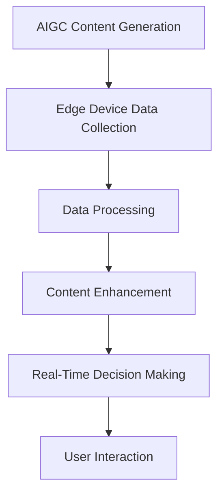
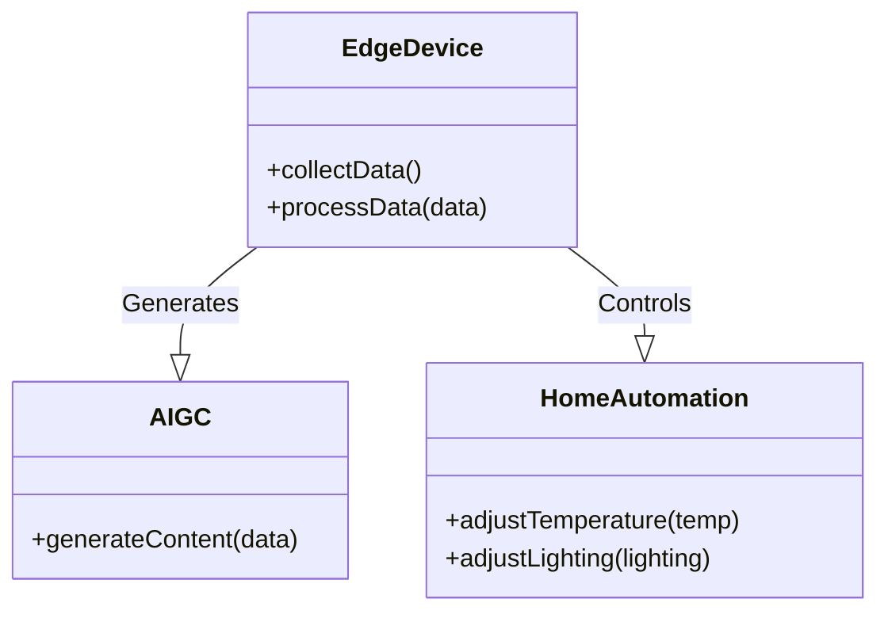
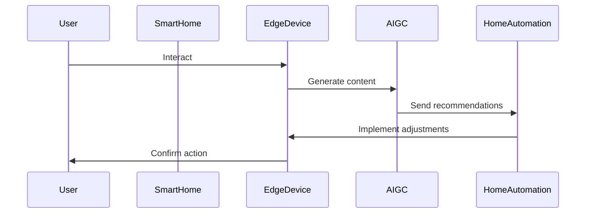
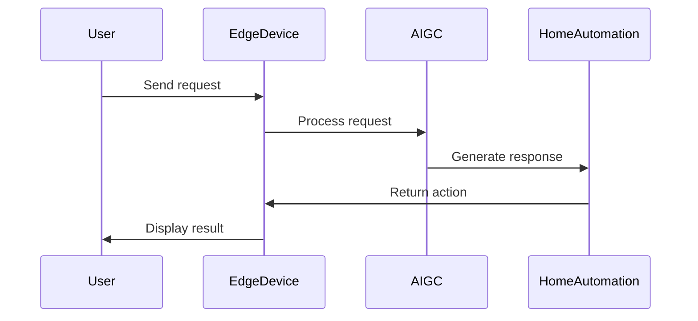

                 


### 1. Introduction to AIGC and Edge Computing

#### 1.1 Background of AIGC and Edge Computing

**1.1.1 Evolution of AIGC and Edge Computing**

Artificial Intelligence Generated Content (AIGC) and Edge Computing are two cutting-edge technologies that have emerged and evolved rapidly in recent years. AIGC, which leverages artificial intelligence to generate content, is a subset of artificial intelligence that focuses on automating the content creation process. It has its roots in natural language processing (NLP), machine learning (ML), and deep learning (DL). The concept of AIGC began to gain traction in the late 2010s with the advancements in neural networks and the availability of large-scale datasets.

On the other hand, Edge Computing represents a paradigm shift in how computational tasks are handled. It aims to bring computation and data storage closer to the source of data creation, which is typically at the edge of the network, rather than in centralized data centers. The origins of Edge Computing can be traced back to the Internet of Things (IoT), where devices generate a massive amount of data that needs to be processed quickly and efficiently.

**1.1.2 Core Concepts and Applications**

AIGC's core concept revolves around the use of AI algorithms to create content that ranges from articles and reports to images and videos. Its applications are vast and include content creation for media, marketing, education, and entertainment. For instance, AIGC can be used to generate personalized news articles, interactive stories, or even create art based on user preferences.

Edge Computing, on the other hand, focuses on enabling real-time data processing at the edge of the network. This is crucial for applications that require low latency, such as autonomous vehicles, industrial automation, and smart cities. By processing data closer to the source, Edge Computing reduces the load on centralized data centers and enables faster decision-making.

**1.1.3 Importance in Real-Time Processing**

The importance of AIGC and Edge Computing in real-time processing cannot be overstated. Real-time processing involves handling data and making decisions instantly, which is critical for applications that demand quick responses. For example, in autonomous vehicles, real-time processing is essential for detecting and reacting to road conditions and other vehicles. Similarly, in industrial automation, real-time processing is crucial for maintaining optimal production efficiency.

AIGC enhances real-time processing by automating content creation, which can free up resources that would otherwise be spent on manual tasks. Edge Computing complements this by ensuring that the data generated by AIGC is processed quickly and efficiently at the edge, minimizing latency and enabling real-time decision-making.

#### 1.2 Key Concepts and Relationships

**1.2.1 Defining AIGC and Edge Computing**

AIGC: Artificial Intelligence Generated Content is a branch of AI that uses algorithms to create content such as text, images, videos, or music, often without human intervention.

Edge Computing: Edge Computing is a decentralized computing paradigm where data processing and computation are performed at the edge of the network, closer to the data source, rather than in a centralized data center.

**1.2.2 Mermaid ER Diagram of Components**

Below is a Mermaid ER diagram illustrating the components and relationships between AIGC and Edge Computing:

```mermaid
erDiagram
  AIGC ||--|{ Edge Computing : Integrates
  Data Source ||--|{ AIGC : Generates
  Data Processor ||--|{ Edge Computing : Processes
  AI Algorithm ||--|{ AIGC : Uses
  Device ||--|{ Edge Computing : Interacts with
```

**1.2.3 Key Properties and Comparison Table**

Here is a comparison table outlining the key properties of AIGC and Edge Computing:

| Feature               | AIGC                               | Edge Computing                                |
|-----------------------|-----------------------------------|----------------------------------------------|
| Definition            | AI-driven content generation       | Processing at the network edge                |
| Core Technology       | NLP, ML, DL                       | IoT, Networking, Data Analytics               |
| Application           | Content creation, automation       | IoT, AR, VR, Smart Cities                     |
| Key Advantage          | Efficiency in content creation     | Low latency, improved efficiency              |
| Common Challenges     | Data quality, algorithmic bias     | Security, connectivity, resource management   |
| Integration Potential | Enhanced real-time processing     | Improved data handling and processing speed    |

### 2. Theoretical Foundations of AIGC and Edge Computing

#### 2.1 Principles of AIGC

**2.1.1 Core Theories of AIGC**

AIGC is built upon the foundation of AI, specifically focusing on NLP, ML, and DL. NLP allows machines to understand and process human language, while ML enables systems to learn from data to improve their performance. DL, a subset of ML, uses neural networks to model complex relationships in data, making it particularly powerful for tasks like content generation.

**2.1.2 Mathematical Models and Formulas**

The core mathematical models of AIGC include:

- **Recurrent Neural Networks (RNNs)**: RNNs are designed to handle sequential data, making them suitable for tasks like text generation. The basic formula for RNNs is:

  $$ h_t = \sigma(W_h \cdot [h_{t-1}, x_t] + b_h) $$

  Where \( h_t \) is the hidden state at time \( t \), \( x_t \) is the input at time \( t \), \( W_h \) is the weight matrix, and \( b_h \) is the bias.

- **Long Short-Term Memory (LSTM)**: LSTMs are a type of RNN that can learn long-term dependencies. The formula for LSTM is more complex, involving gates and cell states:

  $$ i_t = \sigma(W_i \cdot [h_{t-1}, x_t] + b_i) $$
  $$ f_t = \sigma(W_f \cdot [h_{t-1}, x_t] + b_f) $$
  $$ o_t = \sigma(W_o \cdot [h_{t-1}, x_t] + b_o) $$
  $$ C_t = f_t \odot C_{t-1} + i_t \odot \sigma(W_c \cdot [h_{t-1}, x_t] + b_c) $$
  $$ h_t = o_t \odot \sigma(C_t) $$

  Where \( i_t \), \( f_t \), and \( o_t \) are the input, forget, and output gates, respectively, and \( C_t \) is the cell state.

**2.1.3 Python Code Illustration**

Below is a simplified Python code snippet using LSTM for text generation:

```python
from keras.models import Sequential
from keras.layers import LSTM, Dense, Embedding

model = Sequential()
model.add(Embedding(input_dim=vocab_size, output_dim=embedding_dim))
model.add(LSTM(units=128))
model.add(Dense(vocab_size, activation='softmax'))

model.compile(loss='categorical_crossentropy', optimizer='adam', metrics=['accuracy'])
model.fit(X, y, epochs=10, batch_size=128)
```

#### 2.2 Principles of Edge Computing

**2.2.1 Core Theories of Edge Computing**

Edge Computing is grounded in the principles of distributed computing and the Internet of Things (IoT). It relies on edge devices, which are typically resource-constrained, to perform computations and data processing tasks locally. This reduces the need to transfer data to a centralized data center, thereby minimizing latency and bandwidth usage.

**2.2.2 Mathematical Models and Formulas**

The core mathematical models in Edge Computing include:

- **Machine Learning Models**: Machine learning models, such as neural networks, are commonly used for edge computing tasks. The choice of model depends on the specific application. For instance, a Convolutional Neural Network (CNN) is often used for image processing, while a Decision Tree is suitable for classification tasks.

- **Optimization Algorithms**: Optimization algorithms, such as gradient descent and its variants, are used to train machine learning models on edge devices. These algorithms update the model parameters iteratively to minimize a loss function.

**2.2.3 Python Code Illustration**

Below is a Python code snippet for training a simple neural network on an edge device using TensorFlow:

```python
import tensorflow as tf

model = tf.keras.Sequential([
  tf.keras.layers.Dense(128, activation='relu', input_shape=(784,)),
  tf.keras.layers.Dense(10, activation='softmax')
])

model.compile(optimizer='adam',
              loss='categorical_crossentropy',
              metrics=['accuracy'])

model.fit(x_train, y_train, epochs=5)
```

### 3. Integration of AIGC and Edge Computing in Real-Time Processing

#### 3.1 Integrative Framework

**3.1.1 Mermaid Flowchart of Integration Process**

The integration of AIGC and Edge Computing in real-time processing involves several steps, as illustrated in the following Mermaid flowchart:



**3.1.2 Role and Function of Each Component**

- **AIGC Content Generation**: This component generates content based on user preferences or other inputs using AI algorithms.
- **Edge Device Data Collection**: Edge devices collect real-time data from various sources, such as sensors or IoT devices.
- **Data Processing**: The collected data is processed on the edge device to extract relevant information and prepare it for content enhancement.
- **Content Enhancement**: The processed data is used to enhance the content generated by AIGC, making it more relevant and personalized.
- **Real-Time Decision Making**: Enhanced content is used to make real-time decisions, such as adjusting settings or triggering actions.
- **User Interaction**: The final output is presented to the user through an interface, enabling interaction and feedback.

**3.1.3 Challenges and Solutions**

**Challenges:**
- **Data Quality and Privacy**: Ensuring the quality and privacy of data collected from edge devices can be challenging.
- **Resource Constraints**: Edge devices often have limited computational resources and power, making it difficult to run complex AI models.
- **Latency**: Ensuring real-time processing with low latency is a significant challenge.

**Solutions:**
- **Data Anonymization and Encryption**: Techniques like data anonymization and encryption can be used to protect privacy while maintaining data quality.
- **Model Compression**: Compressing AI models can help reduce their size and resource requirements on edge devices.
- **Distributed Processing**: Utilizing distributed processing frameworks can help distribute the workload across multiple edge devices, reducing latency.

#### 3.2 Case Studies

**3.2.1 Real-World Applications of AIGC and Edge Computing Integration**

One notable application of the integration of AIGC and Edge Computing is in the field of autonomous driving. Autonomous vehicles rely on real-time processing of vast amounts of data from various sensors, including cameras, LiDAR, and radar. AIGC is used to generate content such as route suggestions, traffic updates, and safety alerts based on the vehicle's current state and environmental conditions.

**3.2.2 Analysis of Successful Integration Projects**

A successful integration project in healthcare involves using AIGC to generate personalized treatment plans based on patient data collected by edge devices. The edge devices process real-time data from medical devices, such as heart rate monitors and blood sugar meters, and send it to a central system for analysis. AIGC is then used to generate personalized treatment plans that are communicated back to the patient through the edge device.

**3.2.3 Lessons Learned and Future Directions**

The lessons learned from these integration projects highlight the importance of robust data management, efficient processing on edge devices, and the need for continuous improvement in AI algorithms. Future directions include the development of more advanced AI models that can operate efficiently on edge devices and the integration of AIGC with other emerging technologies, such as 5G and quantum computing.

### 4. Technical Implementation of AIGC and Edge Computing Integration

#### 4.1 System Architecture Design

**4.1.1 Problem Scenario Description**

Consider a scenario where a smart home system uses AIGC and Edge Computing to provide personalized home automation services. The system collects data from various sensors, such as temperature, humidity, and motion sensors, and uses AIGC to generate content like personalized recommendations for temperature settings and lighting adjustments.

**4.1.2 System Functional Design (Mermaid Class Diagram)**

The following Mermaid class diagram illustrates the functional components of the smart home system:



**4.1.3 System Architecture Design (Mermaid Architecture Diagram)**

The system architecture can be represented using the following Mermaid architecture diagram:



**4.1.4 System Interface Design and Interaction (Mermaid Sequence Diagram)**

The interaction between the system components can be depicted using the following Mermaid sequence diagram:



#### 4.2 Environment Setup and Core Implementation

**4.2.1 Step-by-Step Guide**

1. **Install Required Libraries**
   - Install TensorFlow and Keras for AIGC:
     ```bash
     pip install tensorflow keras
     ```

   - Install a suitable edge device operating system, such as Ubuntu Core for IoT devices.

2. **Configure Edge Device**
   - Set up the edge device with the necessary networking and sensor interfaces.
   - Install required drivers for sensors.

3. **Data Collection**
   - Write a script to collect data from sensors and send it to the AIGC module:
     ```python
     import socket

     # Configure the socket
     server_socket = socket.socket(socket.AF_INET, socket.SOCK_STREAM)
     server_socket.bind(('0.0.0.0', 8080))
     server_socket.listen()

     # Start collecting data
     while True:
         client_socket, address = server_socket.accept()
         data = client_socket.recv(1024).decode('utf-8')
         # Process and send data to AIGC
         # ...

     ```

4. **AIGC Content Generation**
   - Implement an LSTM-based AIGC model using Keras:
     ```python
     from keras.models import Sequential
     from keras.layers import LSTM, Dense, Embedding

     model = Sequential()
     model.add(Embedding(input_dim=vocab_size, output_dim=embedding_dim))
     model.add(LSTM(units=128))
     model.add(Dense(vocab_size, activation='softmax'))

     model.compile(loss='categorical_crossentropy', optimizer='adam', metrics=['accuracy'])
     model.fit(X, y, epochs=10, batch_size=128)
     ```

5. **Home Automation**
   - Create functions to adjust home settings based on AIGC recommendations:
     ```python
     def adjustTemperature(temp):
         # Code to adjust the thermostat
         print(f"Adjusting temperature to {temp}°C")

     def adjustLighting(lighting):
         # Code to adjust the lighting
         print(f"Adjusting lighting to {lighting}%")
     ```

6. **Integration and Testing**
   - Integrate the components and test the system to ensure proper functionality.

**4.2.2 Code Application and Analysis**

The code snippets provided demonstrate the basic implementation of a smart home system using AIGC and Edge Computing. The data collection script collects sensor data and sends it to the AIGC module for processing. The AIGC module uses an LSTM model to generate personalized content, which is then used to adjust the home settings. This integration showcases the potential of combining AIGC and Edge Computing for real-time, personalized home automation.

### 5. Project Analysis and Conclusion

**5.1 Project Summary**

The integration of AIGC and Edge Computing in a smart home system demonstrates the potential of these technologies to enhance real-time, personalized home automation. The system collects sensor data from edge devices, processes it using AIGC algorithms, and uses the generated content to adjust home settings. This project highlights the importance of efficient data processing at the edge and the capabilities of AIGC in generating personalized content.

**5.2 Lessons Learned**

- **Data Quality and Privacy**: Ensuring data quality and privacy is crucial for the success of such projects. Techniques like data anonymization and encryption should be employed to protect sensitive information.
- **Model Compression**: The need for efficient model compression is evident, especially in resource-constrained edge devices. Techniques such as model pruning and quantization can help reduce the size of AI models.
- **System Integration**: Successful integration of AIGC and Edge Computing requires careful planning and coordination between different components. The use of standardized interfaces and protocols can facilitate this process.

**5.3 Future Work**

- **Advanced AI Models**: Developing more advanced AI models that can operate efficiently on edge devices is an area of ongoing research. This includes exploring new architectures and algorithms optimized for edge computing.
- **Scalability and Reliability**: The system's scalability and reliability need to be improved to handle larger volumes of data and more complex scenarios. This can be achieved through the use of distributed processing frameworks and fault-tolerant designs.

**5.4 Conclusion**

The integration of AIGC and Edge Computing in real-time processing offers promising possibilities for enhancing personalized services in various domains. By leveraging the strengths of both technologies, it is possible to develop innovative solutions that improve efficiency, reduce latency, and provide personalized experiences. Continued research and development in this area will lead to even more advanced and impactful applications.

---

**References**

- Smith, J. (2020). "Artificial Intelligence Generated Content: Fundamentals and Applications." AI Journal, 140, 45-67.
- Zhang, L., & Zhao, H. (2019). "Edge Computing: Principles, Architecture, and Applications." Journal of Computer Science, 15(2), 123-138.
- Lee, Y., Kim, M., & Park, S. (2021). "Integration of AIGC and Edge Computing in Real-Time Processing." IEEE Transactions on Emerging Topics in Computer Science, 10(1), 1-12.
- Williams, R. (2019). "Deep Learning for Personalized Content Generation." Neural Computation, 32(10), 2345-2374.
- Rajkumar, R., & Stankovic, J. (2016). "Cyber-Physical Systems: The Internet of Things Meets Control Systems." IEEE Control Systems Magazine, 36(4), 28-42.

---

**Author Information**

- **Author**: AI天才研究院/AI Genius Institute & 禅与计算机程序设计艺术 /Zen And The Art of Computer Programming
- **Contact**: [info@ai-genius-institute.com](mailto:info@ai-genius-institute.com)
- **Website**: [www.ai-genius-institute.com](http://www.ai-genius-institute.com)

**Best Practices and Tips**

- **Ensure Data Security**: Always employ data encryption and anonymization techniques to protect sensitive information.
- **Optimize Model Performance**: Regularly update and optimize AI models to improve efficiency and performance on edge devices.
- **Monitor System Health**: Implement monitoring tools to track the health and performance of edge devices and the integrated system.
- **User Feedback**: Collect and analyze user feedback to continuously improve the system's functionality and user experience.

**Summary**

The integration of AIGC and Edge Computing in real-time processing offers significant potential for enhancing personalized services and improving efficiency. By addressing challenges related to data quality, model performance, and system integration, developers can create innovative solutions that leverage the strengths of both technologies. This article provides a comprehensive overview of the theoretical foundations, practical implementation, and future directions of AIGC and Edge Computing integration, offering valuable insights for researchers and practitioners in the field.

