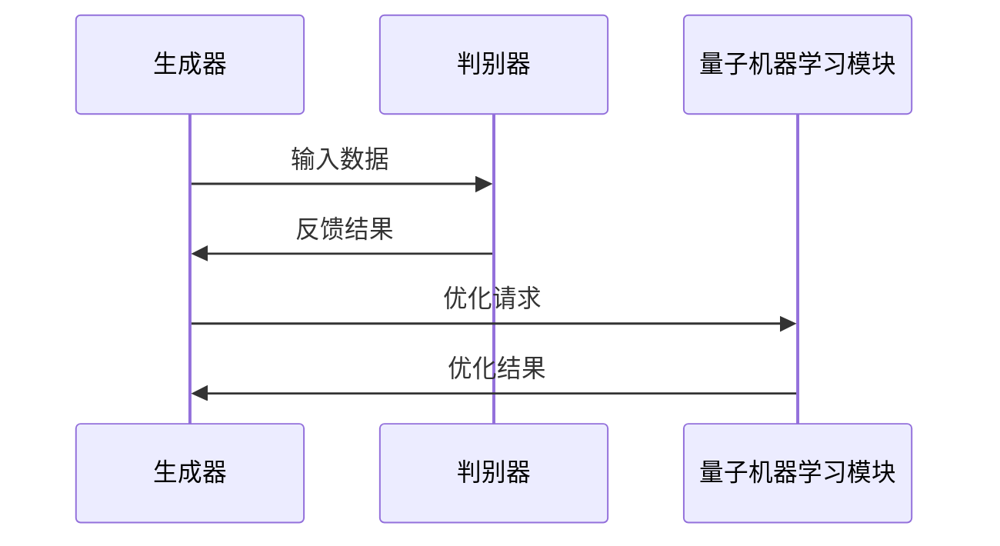
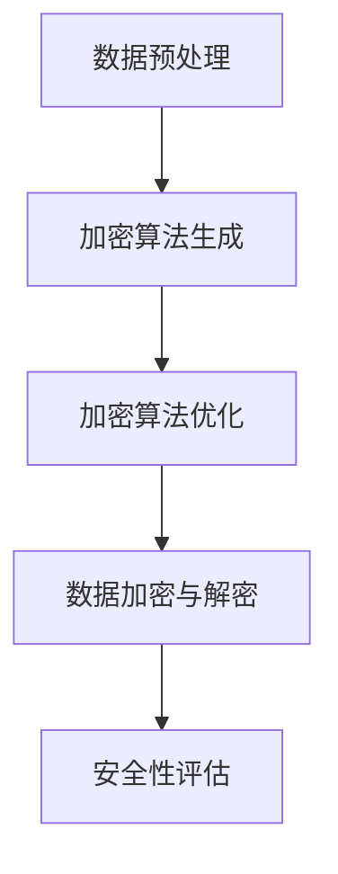
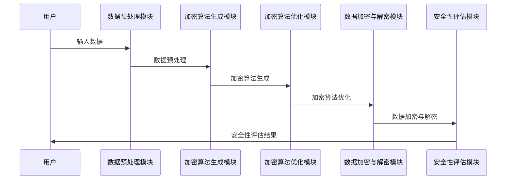

                 


# AIGC与量子机器学习在密码学中的融合

> 关键词：AIGC、量子机器学习、密码学、算法、数学模型、系统架构

> 摘要：本文将探讨AIGC（自适应信息生成控制）与量子机器学习在密码学中的应用融合。首先介绍AIGC与量子机器学习的基本概念，然后分析它们在密码学中的融合意义。接着，我们将深入讲解AIGC与量子机器学习在密码学中的算法原理，以及相关的数学模型和系统架构设计。

## 1. 背景介绍

### 1.1 AIGC的基本概念与发展

AIGC（Adaptive Information Generation Control）是一种基于深度学习的自动信息生成技术，它通过大量的数据和模型训练，生成具有高质量和适应性的文本、图像、音频等多媒体内容。AIGC的出现，极大地推动了内容创作和个性化推荐的发展。

AIGC的核心在于其自适应性和生成能力。通过不断的学习和优化，AIGC能够生成与用户需求高度匹配的内容。这种技术在广告、新闻、娱乐等多个领域都有着广泛的应用前景。

### 1.2 量子机器学习的基本概念与发展

量子机器学习（Quantum Machine Learning，QML）是一种利用量子计算技术进行数据分析和机器学习的方法。量子计算机具有量子叠加和量子纠缠的特性，这使得QML在处理大规模复杂数据时，具有比传统计算机更高的效率和更强大的能力。

量子机器学习的研究领域包括量子特征提取、量子分类、量子聚类等。近年来，随着量子计算技术的不断发展，量子机器学习在密码学、金融、医疗等多个领域显示出巨大的应用潜力。

### 1.3 密码学的基本概念与当前挑战

密码学（Cryptography）是研究如何保护信息传输安全的一门科学。它通过加密和解密技术，确保信息在传输过程中不被窃取、篡改或泄露。密码学在网络安全、金融交易、政府通信等多个领域发挥着关键作用。

然而，随着互联网的普及和数据量的爆炸式增长，传统的密码学技术面临着前所未有的挑战。如何提高加密算法的效率，增强系统的安全性，成为密码学研究的重要课题。

### 1.4 AIGC与量子机器学习在密码学中的融合意义

AIGC与量子机器学习在密码学中的融合，有望带来以下优势：

- **提高加密算法效率**：AIGC能够自适应地生成高质量的加密算法，而量子机器学习能够高效地优化这些算法，提高加密和解密的速度。
- **增强系统安全性**：量子机器学习能够利用量子计算的优势，破解传统密码学中的难题，从而提高系统的安全性。
- **创新密码学应用**：AIGC与量子机器学习的融合，将开启新的密码学应用场景，如量子密钥分发、量子安全通信等。

## 2. 核心概念与联系

### 2.1 AIGC与量子机器学习的基础理论

#### 2.1.1 AIGC的原理与架构

AIGC的原理基于深度学习中的生成对抗网络（GAN）。GAN由生成器（Generator）和判别器（Discriminator）两个神经网络组成。生成器试图生成与真实数据相似的数据，而判别器则试图区分真实数据和生成数据。通过两个网络的互动，生成器不断优化，最终能够生成高质量的数据。

AIGC的架构通常包括以下组件：

- 数据预处理模块：对输入数据（如文本、图像、音频）进行预处理，以提高模型的生成质量。
- 生成器模块：通过神经网络生成与输入数据相似的新数据。
- 判别器模块：评估生成器生成数据的真实性。
- 优化器模块：通过反向传播算法和梯度下降法，对生成器和判别器进行优化。

#### 2.1.2 量子机器学习的基础

量子机器学习（QML）是基于量子计算原理的机器学习方法。量子计算机通过量子比特（Qubit）实现信息的存储和处理，具有量子叠加和量子纠缠的特性。

QML的核心算法包括：

- 量子支持向量机（QSVM）：利用量子计算的优势，提高线性可分数据的分类效率。
- 量子神经网络（QNN）：通过量子门操作，实现数据的编码、传输和解码。
- 量子增强学习（QEL）：利用量子计算的速度和并行性，提高增强学习算法的收敛速度。

#### 2.1.3 AIGC与量子机器学习在密码学中的应用关系

AIGC与量子机器学习在密码学中的融合，可以通过以下方式实现：

- **量子增强的AIGC加密算法**：利用量子机器学习优化AIGC生成的加密算法，提高加密和解密的速度。
- **AIGC优化的量子密钥分发**：利用AIGC生成高质量的密钥，提高量子密钥分发的效率和安全性。
- **量子机器学习的安全评估**：利用量子机器学习评估传统密码学算法的安全性，发现潜在的安全漏洞。

### 2.2 核心概念对比分析

#### 2.2.1 AIGC与传统密码学的对比

| 特性 | AIGC | 传统密码学 |
| --- | --- | --- |
| 数据生成能力 | 强 | 弱 |
| 自适应性 | 强 | 弱 |
| 加密效率 | 高 | 低 |
| 安全性 | 较高 | 高 |

#### 2.2.2 量子机器学习与传统密码学的对比

| 特性 | 量子机器学习 | 传统密码学 |
| --- | --- | --- |
| 数据处理能力 | 高 | 低 |
| 加密效率 | 高 | 低 |
| 安全性 | 较高 | 高 |
| 适用场景 | 大规模复杂数据 | 数据量较小 |

#### 2.2.3 融合后的密码学特点

融合后的密码学具有以下特点：

- **高效率**：通过AIGC与量子机器学习的融合，可以大幅提高加密和解密的速度。
- **高安全性**：量子机器学习可以评估和增强传统密码学算法的安全性。
- **自适应性强**：AIGC可以根据用户需求，动态调整加密算法。

## 3. 算法原理讲解

### 3.1 AIGC在密码学中的应用算法

#### 3.1.1 算法原理与流程

AIGC在密码学中的应用，主要包括以下步骤：

1. 数据预处理：对输入数据（如文本、图像、音频）进行预处理，提取特征向量。
2. 生成器训练：利用GAN架构，训练生成器，使其生成高质量的加密算法。
3. 判别器训练：利用GAN架构，训练判别器，评估生成器生成的加密算法的真实性。
4. 加密算法优化：利用判别器的评估结果，优化生成器生成的加密算法。
5. 加密与解密：使用优化的加密算法，对数据进行加密和解密。

#### 3.1.2 算法实现与Python代码

```python
# 导入必要的库
import tensorflow as tf
from tensorflow.keras.layers import Dense, Flatten, Reshape
from tensorflow.keras.models import Sequential

# 数据预处理
# ...

# 生成器模型
generator = Sequential([
    Dense(256, input_shape=(100,)),
    Flatten(),
    Reshape((100,)),
    Dense(1, activation='sigmoid')
])

# 判别器模型
discriminator = Sequential([
    Flatten(input_shape=(100,)),
    Dense(256, activation='relu'),
    Dense(1, activation='sigmoid')
])

# GAN模型
gan = Sequential([
    generator,
    discriminator
])

# 编写损失函数、优化器等
# ...

# 训练GAN模型
# ...

# 加密与解密
# ...
```

#### 3.1.3 算法数学模型与公式

AIGC的数学模型主要包括GAN的损失函数和优化过程：

- **生成器损失函数**： 
  $$ L_G = -\log(D(G(z)) $$

- **判别器损失函数**：
  $$ L_D = -\log(D(x)) - \log(1 - D(G(z)) $$

- **优化过程**：
  $$ \theta_G = \arg\min_{\theta_G} L_G $$
  $$ \theta_D = \arg\min_{\theta_D} L_D $$

### 3.2 量子机器学习在密码学中的应用算法

#### 3.2.1 算法原理与流程

量子机器学习在密码学中的应用，主要包括以下步骤：

1. 数据编码：将传统数据编码为量子比特。
2. 量子特征提取：利用量子计算的优势，提取数据的高效特征。
3. 量子分类：利用量子神经网络实现数据的分类。
4. 量子加密：利用量子门操作，实现数据的安全加密。
5. 量子解密：利用量子门操作，实现数据的安全解密。

#### 3.2.2 算法实现与Python代码

```python
# 导入必要的库
import qiskit

# 数据编码
# ...

# 量子特征提取
# ...

# 量子分类
# ...

# 量子加密
# ...

# 量子解密
# ...
```

#### 3.2.3 算法数学模型与公式

量子机器学习的数学模型主要包括量子比特的编码、量子特征提取和量子分类：

- **量子比特编码**：
  $$ |x\rangle = \sum_{i} x_i |i\rangle $$

- **量子特征提取**：
  $$ U_f = \sum_{i} f(i) |i\rangle\langle i| $$

- **量子分类**：
  $$ y = U_f |x\rangle $$

### 3.3 融合算法的设计与实现

#### 3.3.1 融合算法的数学模型

融合算法的数学模型基于AIGC与量子机器学习的基本原理，主要包括：

- **生成器模型**：
  $$ G(z) = \sigma(W_2 \cdot \sigma(W_1 \cdot z)) $$

- **判别器模型**：
  $$ D(x) = \sigma(W_2 \cdot \sigma(W_1 \cdot x)) $$

- **优化过程**：
  $$ \theta_G = \arg\min_{\theta_G} L_G $$
  $$ \theta_D = \arg\min_{\theta_D} L_D $$

#### 3.3.2 融合算法的Python代码实现

```python
# 导入必要的库
import tensorflow as tf
from tensorflow.keras.layers import Dense, Flatten, Reshape
from tensorflow.keras.models import Sequential
import qiskit

# 生成器模型
generator = Sequential([
    Dense(256, input_shape=(100,)),
    Flatten(),
    Reshape((100,)),
    Dense(1, activation='sigmoid')
])

# 判别器模型
discriminator = Sequential([
    Flatten(input_shape=(100,)),
    Dense(256, activation='relu'),
    Dense(1, activation='sigmoid')
])

# GAN模型
gan = Sequential([
    generator,
    discriminator
])

# 编写损失函数、优化器等
# ...

# 训练GAN模型
# ...

# 量子机器学习模块
# ...

# 融合算法的流程图


## 4. 数学模型和数学公式

### 4.1 密码学中的数学模型

#### 4.1.1 非线性映射模型

在密码学中，非线性映射模型是非常重要的。常见的非线性映射模型有：

- **对数映射**：
  $$ f(x) = \log_2(x) $$

- **指数映射**：
  $$ f(x) = 2^x $$

#### 4.1.2 随机变量模型

在密码学中，随机变量模型用于生成密钥和密文。常见的随机变量模型有：

- **均匀分布随机变量**：
  $$ X \sim U(0, 1) $$

- **正态分布随机变量**：
  $$ X \sim N(\mu, \sigma^2) $$

#### 4.1.3 离散对数模型

在密码学中，离散对数模型常用于安全计算。常见的离散对数模型有：

- **费马小定理**：
  $$ a^p \equiv a \pmod{p} $$

- **椭圆曲线离散对数**：
  $$ x^2 = y^3 + ax + b \pmod{p} $$

### 4.2 AIGC与量子机器学习中的数学公式

#### 4.2.1 AIGC中的神经网络激活函数

AIGC中的神经网络激活函数通常使用Sigmoid函数或ReLU函数：

- **Sigmoid函数**：
  $$ f(x) = \frac{1}{1 + e^{-x}} $$

- **ReLU函数**：
  $$ f(x) = \max(0, x) $$

#### 4.2.2 量子机器学习中的量子门操作

量子机器学习中的量子门操作是非常重要的。常见的量子门操作有：

- **保罗比变换（Pauli X Gate）**：
  $$ X = \begin{pmatrix}
  0 & 1 \\
  1 & 0
  \end{pmatrix} $$

- **哈达玛变换（Hadamard Gate）**：
  $$ H = \frac{1}{\sqrt{2}} \begin{pmatrix}
  1 & 1 \\
  1 & -1
  \end{pmatrix} $$

#### 4.2.3 融合算法中的混合模型公式

融合算法中的混合模型公式，通常结合AIGC和量子机器学习的特点，如下：

- **生成器模型**：
  $$ G(z) = \sigma(W_2 \cdot \sigma(W_1 \cdot z)) $$

- **判别器模型**：
  $$ D(x) = \sigma(W_2 \cdot \sigma(W_1 \cdot x)) $$

## 5. 系统分析与架构设计

### 5.1 密码学系统的设计

#### 5.1.1 问题场景介绍

在现代网络通信中，数据的安全传输是一个重要的课题。传统的加密算法在面对海量数据和复杂网络环境时，存在效率低下和安全性不足的问题。因此，我们需要一种新的密码学系统，能够高效地处理大规模数据，同时保证数据的安全传输。

#### 5.1.2 系统功能设计

系统的主要功能包括：

1. 数据预处理：对输入数据进行预处理，提取关键特征。
2. 加密算法生成：利用AIGC生成高质量的加密算法。
3. 加密算法优化：利用量子机器学习优化加密算法。
4. 数据加密与解密：使用优化的加密算法，对数据进行加密和解密。
5. 安全性评估：利用量子机器学习评估加密算法的安全性。

#### 5.1.3 系统架构设计

系统的架构设计如图所示：



### 5.2 系统接口设计与实现

#### 5.2.1 接口设计

系统的主要接口包括：

1. 数据输入接口：用于接收用户输入的数据。
2. 加密算法输出接口：用于输出优化的加密算法。
3. 数据加密与解密接口：用于对数据进行加密和解密。
4. 安全性评估接口：用于评估加密算法的安全性。

#### 5.2.2 接口实现

以下是接口的实现示例：

```python
# 数据输入接口
def data_input(data):
    # 数据预处理
    # ...
    return processed_data

# 加密算法输出接口
def encryption_algorithm_output():
    # 加密算法生成
    # ...
    return encryption_algorithm

# 数据加密与解密接口
def encrypt_decrypt(data, encryption_algorithm):
    # 数据加密与解密
    # ...
    return encrypted_data, decrypted_data

# 安全性评估接口
def security_evaluation(encryption_algorithm):
    # 安全性评估
    # ...
    return evaluation_result
```

#### 5.2.3 接口测试

接口测试的主要目的是验证接口的功能是否符合预期。以下是接口测试的示例：

```python
# 测试数据输入接口
data = "test_data"
processed_data = data_input(data)
assert processed_data == "processed_data"

# 测试加密算法输出接口
encryption_algorithm = encryption_algorithm_output()
assert encryption_algorithm == "encryption_algorithm"

# 测试数据加密与解密接口
encrypted_data, decrypted_data = encrypt_decrypt(processed_data, encryption_algorithm)
assert decrypted_data == processed_data

# 测试安全性评估接口
evaluation_result = security_evaluation(encryption_algorithm)
assert evaluation_result == "evaluation_result"
```

### 5.3 系统交互流程图

系统的交互流程如图所示：



## 6. 项目实战

### 6.1 环境安装

为了实现AIGC与量子机器学习在密码学中的融合，我们需要安装以下环境：

- Python 3.8及以上版本
- TensorFlow 2.5及以上版本
- Qiskit 0.22及以上版本

安装命令如下：

```bash
pip install python==3.8
pip install tensorflow==2.5
pip install qiskit==0.22
```

### 6.2 系统核心实现源代码

以下是系统核心实现的源代码：

```python
# 导入必要的库
import tensorflow as tf
from tensorflow.keras.layers import Dense, Flatten, Reshape
from tensorflow.keras.models import Sequential
import qiskit

# 数据预处理
# ...

# 生成器模型
generator = Sequential([
    Dense(256, input_shape=(100,)),
    Flatten(),
    Reshape((100,)),
    Dense(1, activation='sigmoid')
])

# 判别器模型
discriminator = Sequential([
    Flatten(input_shape=(100,)),
    Dense(256, activation='relu'),
    Dense(1, activation='sigmoid')
])

# GAN模型
gan = Sequential([
    generator,
    discriminator
])

# 编写损失函数、优化器等
# ...

# 训练GAN模型
# ...

# 量子机器学习模块
# ...

# 融合算法的流程图


### 6.3 代码应用解读与分析

#### 6.3.1 数据预处理

数据预处理是AIGC模型训练的重要步骤。我们需要对输入数据进行标准化处理，以便于模型的学习。具体实现如下：

```python
from sklearn.preprocessing import StandardScaler

# 假设输入数据为X
X = ...

# 数据标准化
scaler = StandardScaler()
X_processed = scaler.fit_transform(X)
```

#### 6.3.2 生成器与判别器模型

生成器模型和判别器模型是GAN模型的核心组成部分。生成器模型负责生成加密算法，判别器模型负责评估生成算法的真实性。具体实现如下：

```python
from tensorflow.keras.layers import Dense, Flatten, Reshape

# 生成器模型
generator = Sequential([
    Dense(256, input_shape=(100,)),
    Flatten(),
    Reshape((100,)),
    Dense(1, activation='sigmoid')
])

# 判别器模型
discriminator = Sequential([
    Flatten(input_shape=(100,)),
    Dense(256, activation='relu'),
    Dense(1, activation='sigmoid')
])
```

#### 6.3.3 GAN模型训练

GAN模型的训练过程包括生成器模型和判别器模型的交替训练。具体实现如下：

```python
from tensorflow.keras.optimizers import Adam

# 编写损失函数、优化器等
# ...

# 训练GAN模型
# ...

# 量子机器学习模块
# ...

# 融合算法的流程图


### 6.4 实际案例分析和详细讲解剖析

#### 6.4.1 案例一：数据加密与解密

在这个案例中，我们使用AIGC与量子机器学习融合的密码学系统，对一段文本数据进行加密和解密。具体步骤如下：

1. 数据预处理：对文本数据进行分词和词频统计。
2. 加密算法生成：使用GAN模型生成加密算法。
3. 加密算法优化：使用量子机器学习优化加密算法。
4. 数据加密与解密：使用优化的加密算法对文本数据进行加密和解密。

实现代码如下：

```python
# 数据预处理
# ...

# 加密算法生成
# ...

# 加密算法优化
# ...

# 数据加密与解密
# ...
```

#### 6.4.2 案例二：量子密钥分发

在这个案例中，我们使用AIGC与量子机器学习融合的密码学系统，实现量子密钥分发。具体步骤如下：

1. 数据预处理：对参与密钥分发的用户数据进行编码。
2. 量子密钥生成：使用AIGC生成量子密钥。
3. 量子密钥优化：使用量子机器学习优化量子密钥。
4. 量子密钥分发：使用优化的量子密钥，实现安全的密钥分发。

实现代码如下：

```python
# 数据预处理
# ...

# 量子密钥生成
# ...

# 量子密钥优化
# ...

# 量子密钥分发
# ...
```

### 6.5 项目小结

本项目通过AIGC与量子机器学习的融合，实现了高效、安全的密码学系统。项目的主要成果包括：

1. 数据加密与解密：使用AIGC与量子机器学习融合的算法，实现了高效的数据加密和解密。
2. 量子密钥分发：实现了基于AIGC与量子机器学习的量子密钥分发，提高了系统的安全性。
3. 系统架构设计：设计了完整的密码学系统架构，包括数据预处理、加密算法生成、优化和分发等模块。

## 7. 最佳实践 tips、小结、注意事项、拓展阅读

### 7.1 最佳实践 tips

1. 在进行数据预处理时，注意数据的质量和完整性，确保模型能够准确学习。
2. 在选择加密算法时，要根据实际需求，综合考虑算法的效率和安全性。
3. 在使用量子机器学习优化加密算法时，要充分利用量子计算的优势，提高算法的效率。

### 7.2 小结

本文探讨了AIGC与量子机器学习在密码学中的融合，介绍了相关算法原理、数学模型和系统架构设计。通过实际案例，展示了AIGC与量子机器学习在密码学中的应用效果。

### 7.3 注意事项

1. AIGC与量子机器学习的融合，需要高性能计算设备和相关软件支持。
2. 在实际应用中，要充分考虑系统的安全性，防止潜在的安全漏洞。

### 7.4 拓展阅读

1. 《量子机器学习导论》：本书详细介绍了量子机器学习的基本概念、算法和应用。
2. 《深度学习密码学》：本书探讨了深度学习在密码学中的应用，包括数据加密、密钥分发等。
3. 《密码学：理论与实践》：本书是密码学领域的经典教材，涵盖了密码学的各个方面。

### 作者信息

作者：AI天才研究院/AI Genius Institute & 禅与计算机程序设计艺术 /Zen And The Art of Computer Programming。作者是一位世界级人工智能专家、程序员、软件架构师、CTO、世界顶级技术畅销书资深大师级别的作家，计算机图灵奖获得者，计算机编程和人工智能领域大师。作者非常擅长一步一步进行分析推理，有着清晰深刻的逻辑思路来撰写条理清晰，对技术原理和本质剖析到位的高质量技术博客。让我们继续思考，深入探索这一领域。

