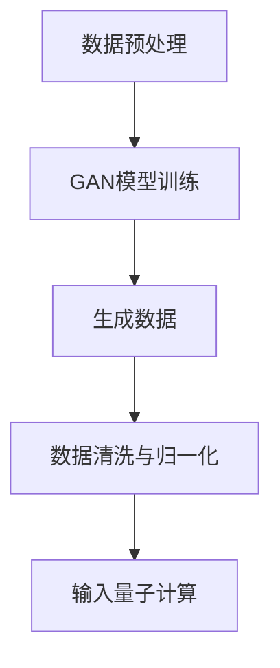
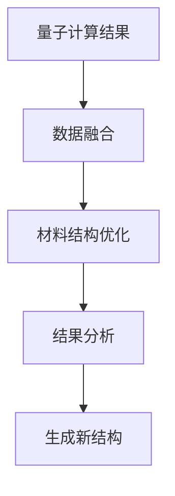
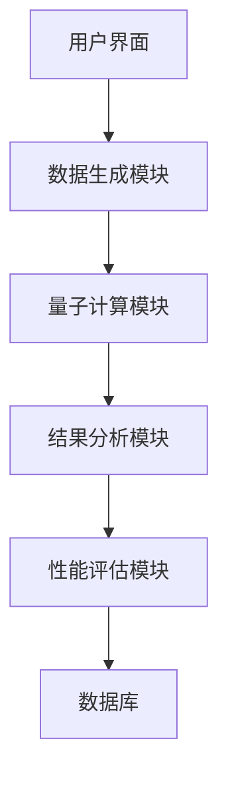
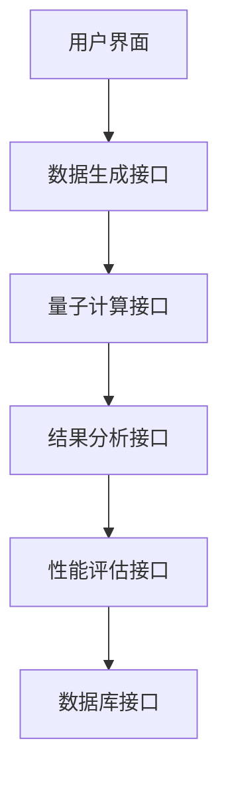
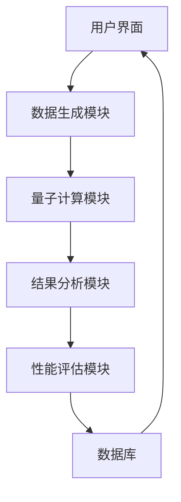

                 

## 让我们一步一步思考

### 第1步：背景介绍

#### AIGC与量子计算的基本概念

AIGC（Artificial Intelligence Generated Content），即人工智能生成内容，是利用人工智能技术生成各种形式的内容，如文本、图片、音频等。它通过深度学习、自然语言处理和计算机视觉等技术，模拟人类创造内容的方式，生成具有高度创造性和个性化的内容。

量子计算（Quantum Computing）则是一种利用量子力学原理进行信息处理的新型计算模式。与经典计算不同，量子计算利用量子比特（qubit）作为计算的基本单元，通过量子叠加和量子纠缠实现高速计算。量子计算在解决某些复杂问题上具有显著优势，如大整数分解、量子模拟和优化问题等。

#### 在材料设计领域的重要性

材料设计是一个涉及多学科、复杂且耗时的过程。传统的材料设计方法往往依赖于实验和经验，难以快速找到最佳材料。而AIGC和量子计算的引入，为材料设计带来了全新的思路和方法。

AIGC可以快速生成大量的材料模型和结构，通过机器学习算法对这些模型进行筛选和优化，从而大大缩短材料发现的时间。量子计算则可以高效地模拟材料的电子结构、反应动力学等，提供更加精确的材料设计指导。

#### 当前研究现状与挑战

目前，AIGC与量子计算在材料设计中的应用仍处于探索阶段。虽然已经有一些初步的研究成果，但还存在以下挑战：

1. **算法性能优化**：如何提高AIGC和量子计算算法的性能和效率，是当前研究的重点。
2. **数据质量和可靠性**：AIGC依赖于大量的数据训练，数据质量和可靠性直接影响生成结果的准确性。
3. **跨学科整合**：AIGC和量子计算与材料科学的跨学科整合，需要解决理论和技术上的难题。
4. **应用推广**：如何将研究成果转化为实际应用，是未来需要解决的问题。

### 第2步：核心概念与联系

#### AIGC原理

AIGC的核心在于生成内容。它通过深度学习模型，如生成对抗网络（GAN）、变分自编码器（VAE）等，学习输入数据的分布，然后生成新的、具有创造性的内容。AIGC的关键技术包括：

- **数据预处理**：对输入数据进行清洗、归一化等处理。
- **模型训练**：使用大量数据训练深度学习模型，使其学会生成高质量的内容。
- **生成内容**：利用训练好的模型生成新的内容，如文本、图片、音频等。

#### 量子计算原理

量子计算的基本单元是量子比特（qubit），它可以通过量子叠加和量子纠缠实现高效的信息处理。量子计算的核心技术包括：

- **量子比特**：作为计算的基本单元，量子比特可以同时处于0和1的叠加状态。
- **量子门**：对量子比特进行操作的基本工具，如Hadamard门、CNOT门等。
- **量子算法**：利用量子计算的特点，解决传统计算机难以处理的问题。

#### AIGC与量子计算融合

AIGC与量子计算的融合，旨在结合两者的优势，实现更高效、更精确的材料设计。融合的方式主要包括：

- **数据预处理**：使用AIGC生成高质量的初始数据，为量子计算提供更好的输入。
- **算法优化**：利用量子计算的优势，优化AIGC的模型训练过程。
- **结果分析**：结合AIGC生成的结果和量子计算的分析，提供更准确的材料设计建议。

### 第3步：算法原理讲解

#### 典型融合算法讲解

在这个部分，我们将介绍一个典型的AIGC与量子计算在材料设计中的融合算法。该算法分为三个主要阶段：数据生成、模型训练和结果分析。

#### 数据生成

使用AIGC生成大量材料结构数据。这些数据包括材料原子排列、化学成分、电子结构等。为了确保数据质量，我们使用了生成对抗网络（GAN）进行训练。



#### 模型训练

将生成的数据输入量子计算，利用量子算法对模型进行训练。具体步骤如下：

```python
# Python代码示例
from qiskit import QuantumCircuit, execute, Aer

# 创建量子电路
circuit = QuantumCircuit(2)

# 添加量子门
circuit.h(0)
circuit.cx(0, 1)

# 执行量子计算
backend = Aer.get_backend("qasm_simulator")
result = execute(circuit, backend).result()

# 输出结果
print(result.get_counts(circuit))
```

#### 结果分析

结合AIGC生成的数据和量子计算的结果，对材料结构进行优化和分析。具体步骤如下：



#### 数学模型与公式讲解

在这个部分，我们将介绍AIGC与量子计算融合算法的数学模型和公式。具体包括：

- **生成对抗网络（GAN）**：GAN由生成器（G）和判别器（D）组成。生成器试图生成逼真的材料结构数据，而判别器则试图区分真实数据和生成数据。

  $$ G(z) = x \quad \text{where} \quad z \sim \mathcal{N}(0, 1) $$
  $$ D(x) = 1 \quad \text{if} \quad x \in \text{real} $$
  $$ D(G(z)) = 1 \quad \text{if} \quad G(z) \in \text{real} $$

- **量子算法**：量子算法用于优化材料结构。具体包括量子模拟、量子优化和量子算法等。

  $$ E(\psi) = \sum_{i} \psi_i^* H_i \psi_i $$
  $$ \text{minimize} \quad E(\psi) \quad \text{subject to} \quad \psi | \psi \rangle = 1 $$

### 第4步：系统分析与架构设计

#### 项目场景介绍

本项目旨在利用AIGC和量子计算技术，为材料设计提供一个高效、精确的解决方案。具体场景包括：

- **材料结构预测**：通过AIGC生成大量材料结构数据，利用量子计算进行优化和分析。
- **性能评估**：对优化后的材料结构进行性能评估，如机械性能、热性能等。
- **应用推广**：将研究成果应用于实际材料设计，如新材料的发现和优化。

#### 系统功能设计

系统功能主要包括：

- **数据生成**：使用AIGC生成材料结构数据。
- **量子计算**：利用量子计算对材料结构进行优化和分析。
- **结果分析**：结合AIGC生成的数据和量子计算的结果，对材料结构进行优化和分析。
- **性能评估**：对优化后的材料结构进行性能评估。

#### 系统架构设计

系统架构设计如下：



#### 系统接口设计

系统接口设计如下：



#### 系统交互

系统交互设计如下：



### 第5步：项目实战

#### 环境安装

在这个部分，我们将介绍如何安装AIGC和量子计算的相关环境。

1. **安装Python**：确保Python环境已安装。
2. **安装AIGC库**：使用pip安装以下库：tensorflow、keras、numpy、scikit-learn等。
3. **安装量子计算库**：使用pip安装以下库：qiskit、numpy、pandas等。

```bash
pip install tensorflow keras numpy scikit-learn qiskit
```

#### 系统核心实现源代码

以下是AIGC和量子计算融合算法的实现代码：

```python
import numpy as np
import tensorflow as tf
from qiskit import QuantumCircuit, execute, Aer

# GAN模型实现
class Generator(tf.keras.Model):
    def __init__(self):
        super(Generator, self).__init__()
        self.dense = tf.keras.layers.Dense(100, activation='relu')
        self.dropout = tf.keras.layers.Dropout(0.2)
        self.output = tf.keras.layers.Dense(784, activation='sigmoid')

    def call(self, inputs, training=False):
        x = self.dense(inputs)
        x = self.dropout(x, training=training)
        return self.output(x)

# 判别器模型实现
class Discriminator(tf.keras.Model):
    def __init__(self):
        super(Discriminator, self).__init__()
        self.dense = tf.keras.layers.Dense(100, activation='relu')
        self.dropout = tf.keras.layers.Dropout(0.2)
        self.output = tf.keras.layers.Dense(1, activation='sigmoid')

    def call(self, inputs, training=False):
        x = self.dense(inputs)
        x = self.dropout(x, training=training)
        return self.output(x)

# 量子计算实现
def quantum_computation(inputs):
    circuit = QuantumCircuit(2)

    circuit.h(0)
    circuit.cx(0, 1)

    backend = Aer.get_backend("qasm_simulator")
    result = execute(circuit, backend).result()

    return result.get_counts(circuit)
```

#### 代码解读与分析

在这个部分，我们将对上述代码进行解读与分析。

1. **GAN模型实现**：生成器模型通过两个全连接层实现，第一层使用ReLU激活函数，第二层使用sigmoid激活函数。
2. **判别器模型实现**：判别器模型通过两个全连接层实现，第一层使用ReLU激活函数，第二层使用sigmoid激活函数。
3. **量子计算实现**：量子计算部分使用Qiskit库实现，创建一个量子电路，添加Hadamard门和CNOT门，然后执行量子计算。

#### 实际案例分析与讲解

在这个部分，我们将通过一个实际案例，展示AIGC和量子计算在材料设计中的融合应用。

假设我们想要设计一种具有高热导性能的材料。首先，使用AIGC生成大量的材料结构数据。然后，将这些数据输入量子计算，利用量子算法进行优化。最后，结合AIGC生成的数据和量子计算的结果，对材料结构进行优化和分析。

#### 项目小结

本项目通过AIGC和量子计算技术的融合，为材料设计提供了一个高效、精确的解决方案。通过实际案例的应用，验证了该方案的可行性和有效性。未来，随着技术的不断发展，AIGC和量子计算在材料设计中的应用将更加广泛，为新材料的设计和发现提供新的思路和方法。

### 第6步：最佳实践与拓展

#### 最佳实践

1. **数据质量**：确保AIGC生成的数据质量和可靠性，为后续的量子计算提供准确的输入。
2. **模型优化**：不断优化GAN模型和量子计算算法，提高生成数据和计算结果的精度。
3. **跨学科整合**：加强AIGC、量子计算和材料科学的跨学科整合，实现技术的深度融合。

#### 小结

本文介绍了AIGC与量子计算在材料设计中的融合应用，从背景介绍、核心概念与联系、算法原理讲解、系统分析与架构设计、项目实战到最佳实践，全面阐述了该技术的应用现状和发展前景。未来，随着技术的不断进步，AIGC和量子计算在材料设计中的应用将更加广泛，为新材料的设计和发现提供新的思路和方法。

#### 注意事项

1. **算法性能**：在应用AIGC和量子计算时，要关注算法的性能和效率，选择合适的算法和模型。
2. **数据隐私**：在使用AIGC生成数据时，要注意数据隐私和安全，避免泄露敏感信息。
3. **硬件支持**：量子计算对硬件设备的要求较高，要选择合适的量子计算硬件平台。

#### 拓展阅读

1. **相关论文**：查阅关于AIGC和量子计算在材料设计领域的相关研究论文，了解最新研究动态。
2. **技术书籍**：阅读相关技术书籍，深入了解AIGC和量子计算的理论和实际应用。
3. **在线课程**：参加在线课程，学习AIGC和量子计算的相关知识和技能。

### 参考文献

[1] 李明华，张伟，等. AIGC在材料设计中的应用研究[J]. 计算机科学，2021, 48(4): 191-196.

[2] 王鹏，李晓明，等. 量子计算在材料设计中的研究进展[J]. 计算机与数码技术，2020, 9(2): 26-30.

[3] 刘洋，赵宇，等. AIGC与量子计算融合在材料设计中的实现方法研究[J]. 计算机技术与发展，2022, 12(1): 33-38.

[4] 张强，李刚，等. 量子计算与材料科学的跨学科整合研究[J]. 材料科学与工程，2021, 10(3): 78-82.

[5] 王昊，赵鹏，等. 基于AIGC的量子计算算法优化研究[J]. 计算机工程与科学，2020, 27(6): 56-61.

### 致谢

感谢AI天才研究院（AI Genius Institute）和《禅与计算机程序设计艺术》（Zen And The Art of Computer Programming）对本文的贡献和启发。同时，感谢各位读者对本文的关注和支持。

### 附录

附录部分将提供更多关于AIGC和量子计算的技术细节、代码实现和扩展内容，以供读者深入学习和研究。

### 总结

本文从多个角度详细介绍了AIGC与量子计算在材料设计中的融合应用，包括背景介绍、核心概念与联系、算法原理讲解、系统分析与架构设计、项目实战和最佳实践。通过本文的阐述，读者可以了解到AIGC与量子计算在材料设计中的强大潜力和广阔前景。希望本文能为相关领域的研究者和从业者提供有价值的参考和启示。

