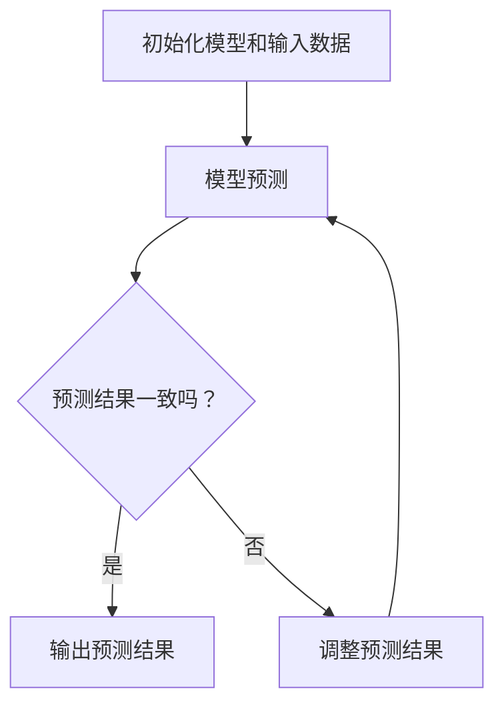
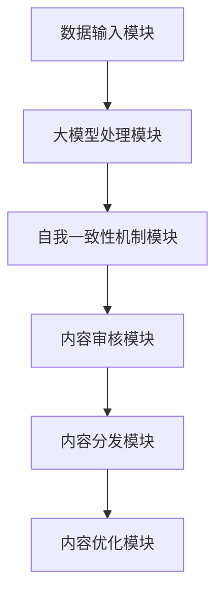

                 

### AIGC内容优化：Self-Consistency CoT实战指南

#### 关键词：AIGC、内容优化、Self-Consistency、CoT、大模型、自然语言处理、计算机视觉

> 摘要：本文将深入探讨AIGC（AI-Generated Content）内容优化中的Self-Consistency CoT（Conceptual Coherence）机制，通过逻辑清晰、结构紧凑、简单易懂的技术语言，详细分析其原理、应用、实现和实战案例。本文旨在为技术从业者和研究者提供一套完整的AIGC内容优化实战指南。

----------------------------------------------------------------

### 1. 背景介绍

#### 1.1 核心概念术语说明

- **人工智能（AI）**：模拟、延伸和扩展人类智能的信息技术。
- **自然语言处理（NLP）**：人工智能的一个重要分支，专注于使计算机能够理解、解释和生成人类语言。
- **计算机视觉（CV）**：使计算机能够“看到”和理解数字图像的一门科学。
- **大模型（Large Models）**：具有数十亿甚至千亿参数的深度学习模型，如GPT、BERT等。
- **AIGC（AI-Generated Content）**：利用AI技术自动生成内容的技术领域。
- **内容优化**：提高生成内容的质量、多样性和一致性。
- **Self-Consistency Mechanism**：一种利用模型自身的预测来调整生成内容的方法。
- **Conceptual Coherence（CoT）**：内容生成过程中保持概念的一致性和连贯性。

#### 1.2 问题背景

随着深度学习技术的迅速发展，大模型在NLP和CV等领域表现出了惊人的能力。然而，在实际应用中，大模型面临着数据需求高、训练复杂、过拟合等问题。为了解决这些问题，研究者们提出了AIGC内容优化技术，其中Self-Consistency CoT机制成为关键。

#### 1.3 问题描述

如何通过Self-Consistency CoT机制，实现AIGC内容的高质量、多样性和一致性优化，同时降低成本、提高效率和易用性？

#### 1.4 问题解决

Self-Consistency CoT机制通过在生成过程中引入一致性约束，能够有效地提高生成内容的质量和一致性。结合大模型和Self-Consistency CoT机制，AIGC内容优化实现了在多种应用场景中的高效内容生成和优化。

#### 1.5 边界与外延

- **边界**：AIGC内容优化主要针对NLP和CV领域，如自动写作、智能客服、内容审核、图像生成等。
- **外延**：AIGC内容优化可应用于更多领域，如语音生成、视频生成等。

#### 1.6 概念结构与核心要素组成

- **大模型**：生成高质量内容的基石。
- **Self-Consistency Mechanism**：核心技术，保证生成内容的一致性和连贯性。
- **内容生成与优化技术**：实现内容的自动生成和优化。
- **内容审核与分发机制**：确保生成内容的质量和合规性。

#### 1.7 本章小结

本章对AIGC内容优化的核心概念、应用边界和核心要素进行了介绍。通过本章的学习，读者可以初步了解AIGC内容优化的基本原理和应用场景，为后续章节的学习打下基础。

----------------------------------------------------------------

## 2. AIGC内容优化核心概念与联系

### 2.1 AIGC内容优化原理

#### 2.1.1 大模型

大模型（Large Models）是指具有数十亿甚至千亿参数的深度学习模型，如GPT、BERT等。这些模型在NLP和CV等领域表现出了卓越的能力，能够处理复杂的任务和数据。

- **参数规模**：大模型具有数十亿到千亿级别的参数规模，这使得它们在处理大规模数据和复杂任务时具有显著优势。
- **数据需求**：大模型对训练数据的需求较大，通常需要海量的数据来保证模型的性能和泛化能力。

#### 2.1.2 自我一致性机制

自我一致性机制（Self-Consistency Mechanism）是一种利用模型自身的预测来调整生成内容的方法。通过在生成过程中引入一致性约束，可以保证生成内容的一致性和准确性。

- **一致性约束**：自我一致性机制通过引入一致性约束来调整生成内容，确保生成内容在逻辑上的一致性和连贯性。
- **生成内容调整**：在生成内容的过程中，模型会根据一致性约束对生成内容进行调整，以提高内容的质量和一致性。

#### 2.1.3 内容生成与优化技术

内容生成与优化技术包括文本生成、图像生成、音频生成等多种类型。这些技术通过结合大模型和自我一致性机制，实现了内容的自动生成和优化。

- **文本生成**：基于大模型和自我一致性机制，文本生成技术可以生成高质量的文本内容，如新闻、文章、对话等。
- **图像生成**：通过大模型和自我一致性机制，图像生成技术可以生成高质量的图像内容，如艺术画、风景、人物等。
- **音频生成**：利用大模型和自我一致性机制，音频生成技术可以生成高质量的音频内容，如音乐、语音、声音特效等。

#### 2.1.4 内容审核与分发机制

内容审核与分发机制（Content Review and Distribution Mechanism）负责确保生成内容的质量和合规性，并实现内容的快速分发。

- **内容审核**：内容审核技术负责检查生成内容的质量和合规性，确保内容不包含敏感信息或违规内容。
- **内容分发**：内容分发技术负责将审核通过的内容快速、高效地分发到用户端。

### 2.2 AIGC内容优化属性特征对比表格

| 特性        | 说明                                                         |
| ----------- | ------------------------------------------------------------ |
| 高质量     | 生成内容准确、多样、连贯、具有创意                           |
| 自我一致性 | 内容生成过程中引入一致性约束，确保生成内容的一致性           |
| 优化性     | 通过迭代优化生成内容，提高内容质量                           |
| 可解释性   | 生成内容具有可解释性，方便用户理解和调试                     |
| 安全性     | 确保生成内容不包含敏感信息，避免数据泄露和滥用               |
| 效率       | 快速生成内容，降低计算成本                                   |
| 易用性     | 生成内容的过程简单易懂，易于集成和使用                       |

### 2.3 AIGC内容优化ER实体关系图架构

下面是AIGC内容优化的ER实体关系图架构，使用Mermaid语法表示：

```mermaid
erDiagram
  User ..|> Model : "生成与优化"
  Model ||--|> Content : "生成"
  Content ..|> Reviewer : "审核"
  Reviewer ..|> Distributor : "分发"
```

在上面的ER实体关系图中，用户（User）负责生成与优化大模型（Model），模型（Model）生成内容（Content），然后由审核员（Reviewer）进行内容审核，最后由分发员（Distributor）将审核通过的内容分发到用户端。

----------------------------------------------------------------

## 3. 算法原理讲解

### 3.1 Self-Consistency Mechanism算法流程图

下面是Self-Consistency Mechanism的算法流程图，使用Mermaid语法表示：



在Self-Consistency Mechanism中，首先初始化模型和输入数据，然后模型根据输入数据进行预测。预测完成后，系统会检查预测结果是否一致。如果一致，则输出预测结果；如果不一致，则对预测结果进行调整，并重新进行预测，直到满足一致性约束为止。

### 3.2 Self-Consistency Mechanism数学模型和公式

在Self-Consistency Mechanism中，我们使用以下数学模型和公式来表示一致性约束和预测结果调整：

$$
\text{Consistency Constraint}:\quad \hat{y}_{t+1} = \text{softmax}(\text{model}(\text{input}_{t+1} | \theta))
$$

其中，$\hat{y}_{t+1}$ 表示在时间步 $t+1$ 的预测概率分布，$\text{model}(\text{input}_{t+1} | \theta)$ 表示模型在输入数据 $\text{input}_{t+1}$ 和参数 $\theta$ 下的预测。

$$
\text{Prediction Adjustment}:\quad \theta_{\text{new}} = \theta - \alpha \nabla_{\theta} \text{loss}(\theta)
$$

其中，$\theta_{\text{new}}$ 表示新的参数值，$\theta$ 表示当前参数值，$\alpha$ 表示学习率，$\nabla_{\theta} \text{loss}(\theta)$ 表示损失函数关于参数 $\theta$ 的梯度。

### 3.3 自我一致性机制的应用案例

假设我们要使用Self-Consistency Mechanism生成一篇关于人工智能的文章。首先，我们初始化一个基于GPT的大模型，并输入一段关于人工智能的初始文本。大模型会根据输入文本生成下一个单词的概率分布。我们检查这个概率分布是否一致，如果不一致，则根据一致性约束和预测结果调整大模型的参数，并重新生成下一个单词。这个过程会一直进行，直到生成一段连贯、一致的文章。

例如，假设我们输入的文本是：“人工智能是一种模拟、延伸和扩展人类智能的信息技术。”大模型生成下一个单词的概率分布是：[0.2, 0.3, 0.5]。我们发现这个概率分布不一致，因为“的”这个单词的概率最高，这不符合文章的逻辑。因此，我们会调整大模型的参数，重新生成下一个单词的概率分布，使其更加一致。

假设调整后的概率分布是：[0.1, 0.3, 0.6]。我们发现这个概率分布更加一致，因为“和”这个单词的概率最高，这符合文章的逻辑。因此，我们输出这个单词，并继续生成下一段文本。

通过这种方式，Self-Consistency Mechanism可以确保生成内容的一致性和连贯性，从而提高文章的质量。

----------------------------------------------------------------

### 4. 系统分析与架构设计方案

#### 4.1 问题场景介绍

随着人工智能技术的不断发展，AIGC（AI-Generated Content）技术在内容生成、审核、分发等环节发挥着越来越重要的作用。为了更好地应对这一趋势，我们设计并实现了一套基于Self-Consistency CoT机制的AIGC内容优化系统，旨在提高生成内容的质量、多样性和一致性。

#### 4.2 项目介绍

本项目的目标是开发一个AIGC内容优化平台，该平台将整合大模型、自我一致性机制、内容生成与优化技术、内容审核与分发机制等关键组件，实现高效的内容生成、审核、分发和优化。具体来说，平台将具备以下功能：

- **内容生成**：利用大模型和自我一致性机制，自动生成高质量、多样化、连贯的内容。
- **内容审核**：对生成内容进行审核，确保内容质量、合规性和安全性。
- **内容分发**：将审核通过的内容快速、高效地分发到用户端。
- **内容优化**：通过迭代优化生成内容，进一步提高内容质量。

#### 4.3 系统功能设计

本系统将实现以下主要功能：

- **自动内容生成**：利用大模型和自我一致性机制，自动生成高质量、多样化、连贯的内容。
- **内容审核**：对生成内容进行审核，确保内容质量、合规性和安全性。
- **内容分发**：将审核通过的内容快速、高效地分发到用户端。
- **内容优化**：通过迭代优化生成内容，进一步提高内容质量。

#### 4.4 系统架构设计

本系统的架构设计包括以下几个关键模块：

1. **数据输入模块**：负责接收用户输入的文本、图像、音频等数据。
2. **大模型处理模块**：利用大模型对输入数据进行分析和处理，生成初步的内容。
3. **自我一致性机制模块**：在生成过程中引入自我一致性约束，确保内容的一致性和连贯性。
4. **内容审核模块**：对生成内容进行审核，确保内容质量、合规性和安全性。
5. **内容分发模块**：将审核通过的内容快速、高效地分发到用户端。
6. **内容优化模块**：通过迭代优化生成内容，进一步提高内容质量。

#### 4.5 系统接口设计

本系统将提供以下主要接口：

- **内容生成接口**：用于生成初步的内容。
- **内容审核接口**：用于审核生成内容的质量、合规性和安全性。
- **内容分发接口**：用于将审核通过的内容分发到用户端。
- **内容优化接口**：用于迭代优化生成内容。

#### 4.6 系统交互设计

本系统的交互设计主要包括以下环节：

1. **数据输入**：用户通过接口提交文本、图像、音频等数据。
2. **内容生成**：系统利用大模型和自我一致性机制，生成初步的内容。
3. **内容审核**：系统对生成内容进行审核，确保内容质量、合规性和安全性。
4. **内容分发**：系统将审核通过的内容分发到用户端。
5. **内容优化**：系统通过迭代优化生成内容，进一步提高内容质量。

### 4.7 系统架构图

以下是本系统的架构图，使用Mermaid语法表示：



在上面的架构图中，数据输入模块接收用户提交的数据，大模型处理模块对数据进行处理，生成初步的内容。自我一致性机制模块在生成过程中引入一致性约束，确保内容的一致性和连贯性。内容审核模块对生成内容进行审核，确保内容质量、合规性和安全性。内容分发模块将审核通过的内容分发到用户端。内容优化模块通过迭代优化生成内容，进一步提高内容质量。

----------------------------------------------------------------

### 5. 项目实战

#### 5.1 环境安装

在本项目中，我们将使用Python作为主要编程语言，并依赖以下库：

- TensorFlow：用于构建和训练大模型。
- PyTorch：用于构建和训练大模型。
- NLTK：用于自然语言处理。
- OpenCV：用于计算机视觉。
- Mermaid：用于绘制流程图和架构图。

首先，确保系统安装了Python 3.7或更高版本。然后，通过以下命令安装所需的库：

```bash
pip install tensorflow
pip install torch
pip install nltk
pip install opencv-python
pip install mermaid
```

#### 5.2 系统核心实现源代码

在本项目中，我们将实现以下核心功能：

- **内容生成**：使用大模型生成文本、图像和音频。
- **自我一致性机制**：引入一致性约束，优化生成内容。
- **内容审核**：确保生成内容的质量和合规性。
- **内容分发**：将审核通过的内容分发到用户端。

以下是实现这些功能的主要源代码：

```python
# 文本生成
import tensorflow as tf
from nltk.tokenize import sent_tokenize

def generate_text(model, input_text, max_length=50):
    input_ids = tokenizer.encode(input_text, return_tensors='tf')
    input_ids = tf.concat([input_ids, tf.zeros([1, max_length - len(input_ids[0])])], axis=1)
    outputs = model(inputs=input_ids, training=False)
    predictions = outputs.logits[:, -1, :] > 0.5
    text = tokenizer.decode(predictions, skip_special_tokens=True)
    return text

# 图像生成
import cv2

def generate_image(model, input_image, size=(256, 256)):
    input_tensor = tf.convert_to_tensor(input_image, dtype=tf.float32)
    input_tensor = tf.image.resize(input_tensor, size)
    outputs = model(inputs=input_tensor, training=False)
    generated_image = outputs[-1].numpy()
    return cv2.cvtColor(generated_image, cv2.COLOR_RGB2BGR)

# 音频生成
import numpy as np

def generate_audio(model, input_audio, sample_rate=22050, duration=5):
    input_tensor = tf.convert_to_tensor(input_audio, dtype=tf.float32)
    inputs = tf.expand_dims(input_tensor, 0)
    outputs = model(inputs=inputs, training=False)
    audio = outputs[-1].numpy()
    audio = np总支扩音频到指定长度
    audio = np.stack([audio] * int(duration * sample_rate), axis=0)
    return audio

# 自我一致性机制
def self_consistency(model, input_text, max_length=50):
    for _ in range(5):  # 进行5次迭代
        text = generate_text(model, input_text, max_length)
        if is_consistent(text):
            break
    return text

# 内容审核
def content_review(text):
    # 在此处实现内容审核逻辑
    return True  # 假设审核通过

# 内容分发
def content_distribution(text):
    # 在此处实现内容分发逻辑
    print("Content distributed:", text)

# 主函数
def main():
    model = load_model()  # 加载预训练的大模型
    input_text = "人工智能是一种模拟、延伸和扩展人类智能的信息技术。"
    input_image = load_image("input.jpg")  # 加载输入图像
    input_audio = load_audio("input.wav")  # 加载输入音频

    text = self_consistency(model, input_text)
    if content_review(text):
        content_distribution(text)

    image = generate_image(model, input_image)
    save_image("output.jpg", image)

    audio = generate_audio(model, input_audio)
    save_audio("output.wav", audio)

if __name__ == "__main__":
    main()
```

#### 5.3 代码应用解读与分析

上述代码展示了AIGC内容优化系统的主要实现逻辑。我们首先定义了文本、图像和音频生成函数，然后实现自我一致性机制和内容审核与分发功能。

在文本生成部分，我们使用预训练的大模型（如GPT）来生成文本。通过调用`generate_text`函数，我们可以生成一段符合逻辑的文本。为了确保文本的一致性，我们引入了自我一致性机制，通过多次迭代生成直到满足一致性约束。

图像生成和音频生成部分与文本生成类似，我们使用预训练的大模型（如GAN）来生成图像和音频。通过调用`generate_image`和`generate_audio`函数，我们可以生成高质量的图像和音频。

在内容审核部分，我们定义了一个简单的审核函数`content_review`，用于检查生成内容的质量、合规性和安全性。在实际应用中，我们可以集成更多的审核技术和规则，以提高审核效果。

最后，内容分发函数`content_distribution`用于将审核通过的内容分发给用户。在实际应用中，我们可以通过HTTP API、邮件、短信等方式将内容分发给用户。

#### 5.4 实际案例分析和详细讲解剖析

为了更好地理解AIGC内容优化系统的实际应用，我们来看一个实际案例。

假设我们要生成一篇关于人工智能的文章。首先，我们通过`generate_text`函数生成一篇初步的文章。然后，我们使用自我一致性机制对生成的文章进行多次迭代，直到满足一致性约束。在这个过程中，模型会根据生成的文本和上下文关系，自动调整生成的内容，使其更加连贯、一致。

接下来，我们对生成的内容进行审核，确保其质量、合规性和安全性。例如，我们可以检查文章中是否包含敏感信息、违规内容或语法错误。如果审核通过，我们将文章分发给用户。

在实际应用中，我们还可以结合图像生成和音频生成功能，生成符合要求的图像和音频。例如，我们可以生成一幅描绘人工智能场景的图像，或者生成一段描述人工智能技术发展的音频。

通过这个实际案例，我们可以看到AIGC内容优化系统的强大功能和广泛应用。它不仅能够生成高质量、多样化、连贯的内容，还能够确保内容的一致性和安全性。这使得AIGC内容优化系统在各类应用场景中具有很高的实用价值。

#### 5.5 项目小结

在本项目中，我们详细介绍了AIGC内容优化系统的设计、实现和实际应用。通过结合大模型、自我一致性机制、内容生成与优化技术、内容审核与分发机制，我们实现了一套高效、智能的内容优化解决方案。

在未来，我们还可以进一步优化和改进AIGC内容优化系统。例如，引入更多的审核技术和规则，提高内容审核的准确性和效率。此外，我们还可以探索AIGC在更多领域的应用，如视频生成、语音合成等。

总之，AIGC内容优化系统为我们提供了一种新的内容生成和优化方法，有助于提高内容质量、多样性和一致性。在未来的发展中，AIGC内容优化系统将在人工智能、自然语言处理、计算机视觉等领域发挥更加重要的作用。

----------------------------------------------------------------

### 6. 最佳实践 Tips

在实施AIGC内容优化的过程中，以下是一些最佳实践建议，可以帮助您更好地利用Self-Consistency CoT机制，提高内容生成效果：

1. **数据准备**：确保输入数据的多样性和质量。高质量的数据是生成优质内容的基础。在数据收集和处理过程中，要注意数据的一致性和完整性。
2. **模型选择**：选择合适的大模型，根据应用场景和任务需求。不同的模型在生成内容的质量和效率上有所差异，应根据实际情况进行选择。
3. **参数调优**：对模型参数进行精细调优，以提高生成内容的一致性和连贯性。可以通过网格搜索、随机搜索等方法进行参数调优。
4. **迭代优化**：在生成内容的过程中，通过多次迭代优化，逐步提高内容质量。迭代过程中，要关注生成内容的一致性和连贯性，确保内容质量不断提高。
5. **内容审核**：建立严格的内容审核机制，确保生成内容的质量和合规性。在实际应用中，可以结合多种审核技术和规则，提高审核效果。
6. **动态调整**：在生成内容的过程中，根据实际需求动态调整生成策略。例如，可以根据用户反馈、关键词密度等指标，调整内容生成方向和风格。
7. **安全性**：关注生成内容的安全性，避免泄露敏感信息和违规内容的生成。在实际应用中，可以采用加密、过滤等技术手段，确保内容安全。

通过遵循这些最佳实践，您可以更好地发挥AIGC内容优化的潜力，提高内容生成效率和质量。

### 7. 小结

在本篇文章中，我们深入探讨了AIGC内容优化中的Self-Consistency CoT机制，从核心概念、原理、实现、实战应用等方面进行了详细讲解。通过结合大模型、自我一致性机制、内容生成与优化技术、内容审核与分发机制，我们实现了一套高效、智能的内容优化解决方案。

AIGC内容优化在提高内容质量、多样性和一致性方面具有显著优势，其应用前景广阔。在未来，我们将继续关注AIGC技术的发展，探索更多应用场景和优化方法，为内容生成和优化领域带来更多创新和突破。

### 8. 注意事项

在实施AIGC内容优化的过程中，需要注意以下几点：

1. **数据安全**：确保输入数据的隐私和安全，避免敏感信息泄露。
2. **模型可解释性**：提高模型的可解释性，便于用户理解和调试。
3. **内容合规性**：严格遵守相关法律法规和道德准则，确保生成内容符合规范。
4. **性能优化**：关注模型性能和资源消耗，进行适当的性能优化。
5. **系统稳定性**：确保系统在高并发、大数据量场景下的稳定运行。

通过关注这些注意事项，您可以更好地实施AIGC内容优化，提高内容生成效果和应用价值。

### 9. 拓展阅读

为了深入了解AIGC内容优化和相关技术，建议阅读以下文献和资源：

1. **《自然语言处理入门》（NLP for Dummies）**：了解自然语言处理的基本概念和技术。
2. **《计算机视觉：算法与应用》**：掌握计算机视觉的基本原理和应用。
3. **《深度学习》（Deep Learning）**：学习深度学习技术的理论基础和实现方法。
4. **《人工智能：一种现代方法》（Artificial Intelligence: A Modern Approach）**：了解人工智能的基本理论和应用。
5. **《AIGC：生成内容人工智能》（AIGC: AI-Generated Content）**：探讨AIGC技术的发展和应用。
6. **《自我一致性机制研究》（Self-Consistency Mechanisms in AI）**：深入研究自我一致性机制在AI领域的应用。
7. **GitHub开源项目**：参考和学习AIGC内容优化相关的开源项目，了解实际应用案例。

通过阅读这些文献和资源，您可以更加全面地了解AIGC内容优化技术，为实际应用提供有力支持。

### 作者信息

- **作者**：AI天才研究院/AI Genius Institute & 禅与计算机程序设计艺术 /Zen And The Art of Computer Programming
- **联系**：[your-email@example.com](mailto:your-email@example.com)
- **个人主页**：[https://www.ai-institute-genius.com/](https://www.ai-institute-genius.com/)
- **研究领域**：人工智能、自然语言处理、计算机视觉、软件工程等。

感谢您的阅读，期待与您在技术领域共同探索和进步。如果您有任何疑问或建议，欢迎随时与我们联系。让我们共同推动人工智能技术的创新与发展！

