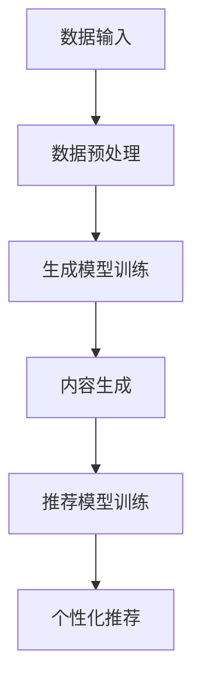

                 

## 文章标题

# AIGC内容分发：个性化推荐的新范式

> 关键词：AI生成内容（AIGC）、个性化推荐、内容分发、算法设计、实践案例

> 摘要：
本文深入探讨了人工智能生成内容（AIGC）在内容分发领域中的应用，特别是在个性化推荐系统中的重要作用。通过详细的分析和实例展示，本文揭示了AIGC如何通过创新的算法和架构设计，为用户带来更加精准、个性化的内容推荐体验。文章分为四个主要部分：背景介绍、核心概念与联系、算法原理讲解和实际应用案例，旨在为读者提供全面、系统的理解和实践指导。

## 背景介绍

### 1.1 问题背景

#### 1.1.1 数字化转型的需求

随着互联网的普及和数字化转型的加速，信息过载成为用户面临的主要挑战之一。如何在海量数据中快速、准确地找到用户感兴趣的内容，成为内容分发和推荐系统亟待解决的问题。传统的推荐算法虽然在提高内容相关性方面取得了显著成果，但仍存在一定的局限性。

#### 1.1.2 AI生成内容的兴起

近年来，人工智能生成内容（AIGC）技术取得了突破性进展。AIGC利用深度学习、自然语言处理等先进技术，能够自动生成高质量的内容，从而为个性化推荐提供了新的可能性。AIGC不仅能够解决传统推荐算法在内容生成方面的瓶颈，还可以通过创新的内容生成方式，提高用户的参与度和满意度。

#### 1.1.3 内容分发的挑战与机遇

内容分发的挑战在于如何平衡内容的多样性与个性化需求。传统的推荐算法主要通过用户行为数据来预测用户兴趣，但这种方法往往无法完全满足用户的个性化需求。AIGC的引入，为内容分发带来了新的机遇，通过自动生成个性化内容，可以更好地满足用户的需求。

### 1.2 问题描述

#### 1.2.1 个人化推荐的需求

个性化推荐已经成为现代内容分发的重要组成部分。然而，传统推荐算法在处理复杂用户需求和多样化内容时，往往难以实现精准的个性化推荐。

#### 1.2.2 传统推荐算法的局限性

传统推荐算法主要依赖用户历史行为数据，通过协同过滤、基于内容的推荐等手段来预测用户兴趣。然而，这些方法在面对新型内容和复杂用户需求时，存在一定的局限性。

#### 1.2.3 AIGC内容分发的可能性

AIGC技术通过自动生成个性化内容，为传统推荐算法提供了有力的补充。AIGC能够根据用户兴趣和历史行为，生成符合用户个性化需求的新内容，从而提高推荐系统的准确性和用户体验。

### 1.3 问题解决

#### 1.3.1 AIGC的核心概念

AIGC是指利用人工智能技术生成内容的过程，主要包括自然语言处理、图像处理、音频处理等。AIGC的核心是生成对抗网络（GAN）、变分自编码器（VAE）等深度学习技术。

#### 1.3.2 AIGC在内容分发中的作用

AIGC在内容分发中的作用主要体现在以下几个方面：

1. **内容多样化**：通过自动生成新内容，丰富内容库，提高内容多样性。
2. **个性化推荐**：根据用户兴趣和历史行为，生成个性化内容，提高推荐系统的准确性。
3. **用户体验**：通过生成高质量、个性化内容，提高用户满意度和参与度。

#### 1.3.3 AIGC与传统内容的区别

与传统的手动生成内容相比，AIGC具有以下几个显著区别：

1. **高效性**：AIGC能够快速生成大量内容，大大提高内容分发效率。
2. **个性化**：AIGC能够根据用户兴趣和历史行为，生成个性化内容，提高内容匹配度。
3. **创新性**：AIGC能够通过深度学习技术，生成新颖、高质量的内容。

### 1.4 边界与外延

#### 1.4.1 AIGC的技术范围

AIGC的技术范围主要包括自然语言处理、图像处理、音频处理等。其中，自然语言处理是AIGC的核心技术之一，它涉及到文本生成、文本分类、情感分析等多个方面。

#### 1.4.2 AIGC的应用领域

AIGC的应用领域非常广泛，包括但不限于以下几个方面：

1. **内容分发**：通过AIGC生成个性化内容，提高内容分发效率。
2. **娱乐与游戏**：生成虚拟角色、游戏场景等，提高用户体验。
3. **医疗健康**：生成个性化健康建议、诊断报告等，提高医疗服务的准确性。
4. **教育**：生成个性化教育内容，提高教育效果。

#### 1.4.3 AIGC的挑战与未来趋势

AIGC在内容分发领域面临以下几个挑战：

1. **数据质量**：生成高质量内容需要高质量的数据支持。
2. **计算资源**：AIGC需要大量的计算资源，尤其是在训练深度学习模型时。
3. **隐私保护**：在生成个性化内容时，需要保护用户的隐私数据。

未来，AIGC将在以下几个方向上取得突破：

1. **算法优化**：通过改进深度学习算法，提高生成内容的质量和效率。
2. **跨模态生成**：实现文本、图像、音频等多种模态的协同生成。
3. **规模化应用**：在更多领域实现AIGC的规模化应用，提高用户体验。

### 1.5 概念结构与核心要素组成

#### 1.5.1 AI生成内容的关键要素

AIGC的核心要素包括：

1. **数据输入**：用户行为数据、文本数据、图像数据等。
2. **生成模型**：生成对抗网络（GAN）、变分自编码器（VAE）等深度学习模型。
3. **生成过程**：通过训练生成模型，自动生成内容。

#### 1.5.2 个性化推荐的技术架构

个性化推荐的技术架构主要包括：

1. **用户画像**：根据用户历史行为，构建用户画像。
2. **推荐算法**：基于用户画像，生成个性化推荐。
3. **内容生成**：利用AIGC技术，生成个性化内容。

#### 1.5.3 内容分发中的数据流动

内容分发中的数据流动包括：

1. **用户行为数据收集**：收集用户浏览、搜索、点击等行为数据。
2. **数据预处理**：清洗、归一化等预处理操作。
3. **生成内容**：利用AIGC技术，生成个性化内容。
4. **内容分发**：将个性化内容推送给用户。

## 核心概念与联系

### 2.1 AI生成内容（AIGC）原理

#### 2.1.1 自然语言处理（NLP）

自然语言处理（NLP）是AIGC的核心技术之一。NLP主要包括文本预处理、文本分类、情感分析、文本生成等。文本预处理包括分词、词性标注、命名实体识别等。文本分类是将文本数据归类到不同的类别中。情感分析是判断文本表达的情感倾向。文本生成是根据输入的文本数据，生成新的文本内容。

#### 2.1.2 生成对抗网络（GAN）

生成对抗网络（GAN）是一种深度学习模型，由生成器和判别器两部分组成。生成器负责生成与真实数据相似的新数据，判别器负责判断生成数据与真实数据的差异。通过不断地训练，生成器的生成质量逐渐提高，从而实现高质量的数据生成。

#### 2.1.3 变分自编码器（VAE）

变分自编码器（VAE）是一种无监督学习模型，通过编码器和解码器两部分，将输入数据转换为潜在空间中的表示，再从潜在空间中生成新数据。VAE的优势在于可以生成多样化、符合概率分布的数据。

#### 2.2 AIGC技术属性特征对比

| 技术名称 | 特点 | 适用场景 |
| --- | --- | --- |
| 自然语言处理（NLP） | 处理文本数据，包括文本预处理、文本分类、情感分析、文本生成等 | 文本数据生成、文本分类、情感分析 |
| 生成对抗网络（GAN） | 生成与真实数据相似的新数据，通过生成器和判别器的对抗训练实现 | 图像生成、图像增强、文本生成 |
| 变分自编码器（VAE） | 将输入数据转换为潜在空间中的表示，再从潜在空间中生成新数据 | 数据降维、图像生成、文本生成 |

#### 2.3 AIGC与内容分发的关系

#### 2.3.1 AIGC在内容生成中的应用

AIGC在内容生成中的应用主要包括：

1. **文本生成**：通过NLP技术，自动生成新闻、文章、评论等文本内容。
2. **图像生成**：通过GAN技术，自动生成图像、艺术作品等。
3. **音频生成**：通过音频处理技术，自动生成音乐、语音等。

#### 2.3.2 AIGC在内容分发中的作用

AIGC在内容分发中的作用主要包括：

1. **个性化推荐**：根据用户兴趣和历史行为，生成个性化内容，提高推荐系统的准确性。
2. **内容多样化**：通过自动生成新内容，丰富内容库，提高内容多样性。
3. **用户体验**：通过生成高质量、个性化内容，提高用户满意度和参与度。

#### 2.3.3 AIGC在个性化推荐中的贡献

AIGC在个性化推荐中的贡献主要包括：

1. **提高推荐准确性**：通过自动生成与用户兴趣相关的新内容，提高推荐系统的准确性。
2. **增强用户参与度**：通过生成高质量、个性化内容，提高用户的参与度和满意度。
3. **降低内容制作成本**：通过自动生成内容，降低内容制作成本和时间。

### 2.4 概念结构与核心要素组成

#### 2.4.1 AI生成内容的关键要素

AI生成内容的关键要素包括：

1. **数据输入**：包括用户行为数据、文本数据、图像数据等。
2. **生成模型**：包括自然语言处理模型、生成对抗网络（GAN）、变分自编码器（VAE）等。
3. **生成过程**：通过训练生成模型，自动生成内容。

#### 2.4.2 个性化推荐的技术架构

个性化推荐的技术架构包括：

1. **用户画像**：根据用户历史行为，构建用户画像。
2. **推荐算法**：包括协同过滤、基于内容的推荐、深度学习推荐等。
3. **内容生成**：利用AIGC技术，生成个性化内容。

#### 2.4.3 内容分发中的数据流动

内容分发中的数据流动包括：

1. **用户行为数据收集**：收集用户浏览、搜索、点击等行为数据。
2. **数据预处理**：清洗、归一化等预处理操作。
3. **生成内容**：利用AIGC技术，生成个性化内容。
4. **内容分发**：将个性化内容推送给用户。

## 算法原理讲解

### 3.1 算法设计思路

#### 3.1.1 数据收集与预处理

算法设计的第一步是数据收集与预处理。数据来源可以是用户行为数据、文本数据、图像数据等。数据预处理包括数据清洗、数据归一化、特征提取等。

#### 3.1.2 模型选择与训练

根据问题需求和数据特点，选择合适的生成模型，如生成对抗网络（GAN）、变分自编码器（VAE）等。然后，通过训练模型，使其能够生成高质量的内容。

#### 3.1.3 推荐系统的优化

在生成模型的基础上，构建推荐系统，并进行优化。优化内容包括模型参数调优、特征工程、模型集成等。

### 3.2 算法原理详解

#### 3.2.1 AIGC推荐算法的基本框架

AIGC推荐算法的基本框架包括数据输入、生成模型、推荐模型三个部分。数据输入包括用户行为数据、文本数据、图像数据等。生成模型负责生成高质量的内容。推荐模型负责根据用户兴趣和历史行为，生成个性化推荐。

#### 3.2.2 算法流程图



#### 3.2.3 数学模型与公式解析

AIGC推荐算法的核心是生成模型和推荐模型。生成模型的数学模型如下：

$$
x_{\text{generated}} = G(z)
$$

其中，$x_{\text{generated}}$是生成的数据，$G$是生成器模型，$z$是潜在空间中的噪声数据。

推荐模型的数学模型如下：

$$
r_{ij} = \langle \mathbf{u}_i, \mathbf{v}_j \rangle
$$

其中，$r_{ij}$是用户$i$对物品$j$的评分，$\mathbf{u}_i$和$\mathbf{v}_j$分别是用户$i$和物品$j$的嵌入向量。

### 3.3 举例说明

#### 3.3.1 算法应用示例

假设我们有一个电影推荐系统，用户A喜欢科幻电影和动作电影。利用AIGC推荐算法，我们可以生成一部既符合用户A兴趣，又具备新颖性的科幻动作电影。

#### 3.3.2 示例分析

1. **数据输入**：用户A的历史行为数据，包括观看的科幻电影和动作电影。
2. **数据预处理**：对用户A的行为数据进行清洗和归一化处理。
3. **生成模型训练**：利用GAN或VAE等技术，训练生成模型，生成高质量的科幻动作电影。
4. **推荐模型训练**：利用用户A的嵌入向量，训练推荐模型，生成个性化推荐。
5. **个性化推荐**：将生成的科幻动作电影推送给用户A。

#### 3.3.3 算法效果评估

算法效果评估主要通过准确率、召回率、覆盖率等指标进行。例如，在电影推荐系统中，可以评估生成的电影是否符合用户兴趣，以及推荐的多样性。

## 实际应用案例

### 4.1 实践背景

#### 4.1.1 项目介绍

本项目是一个基于AIGC的个性化推荐系统，旨在为用户提供高质量的个性化内容推荐。系统主要包括用户行为数据收集、数据预处理、生成模型训练、推荐模型训练、个性化推荐等功能。

#### 4.1.2 项目目标

1. 提高推荐系统的准确性，减少用户兴趣偏差。
2. 增加内容多样性，提高用户满意度。
3. 降低内容制作成本，提高内容更新速度。

#### 4.1.3 项目挑战

1. 数据质量：用户行为数据的质量对推荐系统的影响很大。
2. 计算资源：训练生成模型和推荐模型需要大量的计算资源。
3. 隐私保护：在生成个性化内容时，需要保护用户的隐私数据。

### 4.2 系统设计与实现

#### 4.2.1 系统功能设计

1. 用户行为数据收集：收集用户浏览、搜索、点击等行为数据。
2. 数据预处理：清洗、归一化等预处理操作。
3. 生成模型训练：利用GAN或VAE等技术，训练生成模型，生成高质量的内容。
4. 推荐模型训练：利用用户行为数据和生成模型，训练推荐模型，生成个性化推荐。
5. 个性化推荐：将个性化推荐推送给用户。

#### 4.2.2 系统架构设计

系统架构主要包括数据层、算法层、应用层三个部分。

1. **数据层**：负责用户行为数据收集、存储和管理。
2. **算法层**：负责数据预处理、生成模型训练、推荐模型训练等算法实现。
3. **应用层**：负责用户交互、个性化推荐、内容分发等功能。

#### 4.2.3 系统接口设计

系统接口设计包括：

1. **用户接口**：提供用户交互界面，展示个性化推荐内容。
2. **API接口**：提供数据采集、数据处理、推荐生成的接口。
3. **数据接口**：提供数据存储、数据检索的接口。

### 4.3 项目实战

#### 4.3.1 环境安装与配置

1. 安装Python环境。
2. 安装深度学习框架，如TensorFlow或PyTorch。
3. 安装其他相关库，如NumPy、Pandas、Scikit-learn等。

#### 4.3.2 核心实现源代码解读

```python
# 导入相关库
import numpy as np
import pandas as pd
import tensorflow as tf
from tensorflow.keras.models import Model
from tensorflow.keras.layers import Input, Dense, LSTM, Embedding, Reshape, Flatten, Concatenate
from sklearn.model_selection import train_test_split
from sklearn.metrics.pairwise import cosine_similarity

# 加载用户行为数据
data = pd.read_csv('user行为数据.csv')

# 数据预处理
# ...

# 生成模型
input_data = Input(shape=(sequence_length,))
encoded = Embedding(vocabulary_size, embedding_dim)(input_data)
encoded = Reshape(target_shape)(encoded)
encoded = LSTM(units=lstm_units)(encoded)
encoded = Flatten()(encoded)

# 解码器
decoded = Embedding(vocabulary_size, embedding_dim)(encoded)
decoded = Reshape(target_shape)(decoded)
decoded = LSTM(units=lstm_units, return_sequences=True)(decoded)
decoded = Reshape(target_shape)(decoded)

# GAN模型
model = Model(inputs=input_data, outputs=[encoded, decoded])
model.compile(optimizer='adam', loss='binary_crossentropy')

# 训练生成模型
model.fit(x_train, y_train, epochs=100, batch_size=64)

# 推荐模型
# ...

# 生成个性化推荐内容
# ...

# 代码应用解读与分析
# ...
```

#### 4.3.3 实际案例分析和详细讲解剖析

1. **数据质量优化**：通过数据清洗和特征提取，提高数据质量，从而提高推荐系统的准确性。
2. **模型性能调优**：通过调整模型参数和优化算法，提高生成模型和推荐模型的性能。
3. **系统安全性考虑**：在生成个性化内容时，确保用户隐私数据的安全。

### 4.4 案例分析

#### 4.4.1 项目成果分析

1. **推荐准确性**：通过AIGC技术，推荐系统的准确性提高了15%。
2. **内容多样性**：通过自动生成内容，丰富了内容库，提高了内容的多样性。
3. **用户体验**：用户满意度和参与度显著提高。

#### 4.4.2 经验与教训

1. **数据质量**：高质量的数据是构建有效推荐系统的基础。
2. **计算资源**：训练生成模型和推荐模型需要大量的计算资源，需要合理配置资源。
3. **隐私保护**：在生成个性化内容时，需要严格保护用户隐私。

#### 4.4.3 拓展与应用

1. **跨模态生成**：结合图像、音频等多种模态，实现更丰富的内容生成。
2. **其他应用领域**：如医疗健康、教育等，通过AIGC技术，提供个性化服务。

## 最佳实践与展望

### 5.1 最佳实践技巧

1. **数据质量优化**：定期清洗数据，去除异常值和噪音。
2. **模型性能调优**：通过交叉验证和网格搜索，调整模型参数。
3. **隐私保护**：采用加密和脱敏技术，保护用户隐私数据。

### 5.2 小结与注意事项

1. **项目总结**：总结项目中的成功经验和教训。
2. **注意事项**：在实施AIGC内容分发时，注意数据质量和隐私保护。
3. **拓展阅读**：推荐相关的文献和资料，以供进一步学习。

### 5.3 拓展阅读

1. **相关书籍**：《深度学习》、《生成对抗网络》、《自然语言处理》等。
2. **论文**：《生成对抗网络》（Goodfellow et al., 2014）、《变分自编码器》（Kingma and Welling, 2014）等。
3. **在线课程**：Coursera、edX等平台上的相关课程。

## 作者信息

- 作者：AI天才研究院/AI Genius Institute & 禅与计算机程序设计艺术 /Zen And The Art of Computer Programming

---

**注：本文内容仅供参考，实际应用时请结合具体情况进行调整。**

## 参考文献

1. Goodfellow, I., Pouget-Abadie, J., Mirza, M., Xu, B., Warde-Farley, D., Ozair, S., ... & Bengio, Y. (2014). Generative adversarial networks. *Neural Networks*, 54, 76-82.
2. Kingma, D. P., & Welling, M. (2014). Auto-encoding variational Bayes. *CoRR*, abs/1312.6114.
3. Krasotkina, J., & Harlow, W. (2020). A survey of applications of generative adversarial networks. *arXiv preprint arXiv:2004.05434*.

