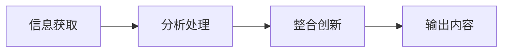
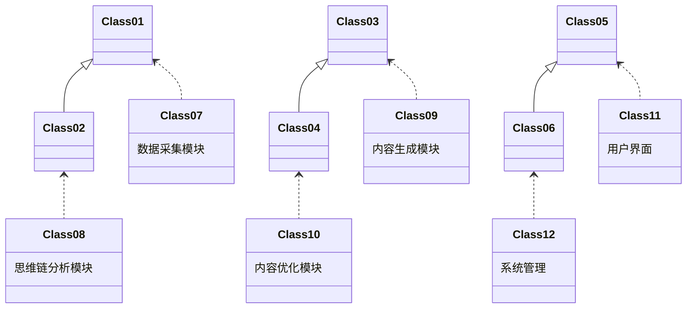
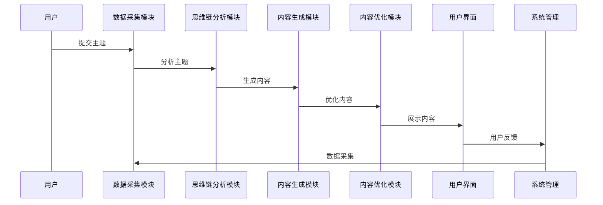
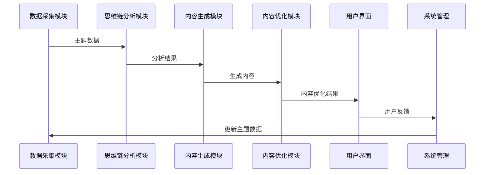
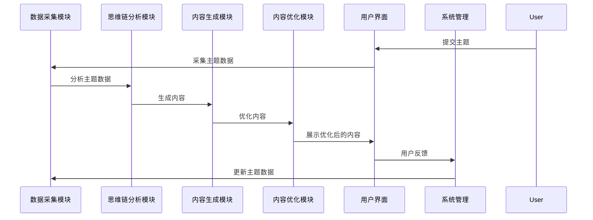

                 


# AIGC内容创作中的思维链应用

## 关键词
- AIGC
- 内容创作
- 思维链
- 自动化
- 生成式人工智能
- 自然语言处理
- 机器学习

## 摘要
本文将深入探讨AIGC（生成式人工智能内容创作）中的思维链应用。我们将从问题背景、核心概念、算法原理、系统分析与架构设计以及项目实战等多个角度，系统地分析思维链在内容创作中的应用及其对AIGC技术发展的重要意义。

----------------------------------------------------------------

## 第一部分：背景介绍

### 1.1 问题背景

随着人工智能技术的飞速发展，生成式人工智能（AIGC，Artificial Intelligence Generated Content）逐渐成为内容创作的重要方向。AIGC利用深度学习和自然语言处理技术，通过学习海量数据生成高质量、具有创意的内容，从而实现自动化、个性化的内容创作。AIGC的应用范围广泛，涵盖了广告、新闻、娱乐、教育等多个领域，其潜在价值不可估量。

### 1.2 问题描述

在AIGC内容创作过程中，思维链（Thinking Chain）的应用显得尤为重要。思维链是内容创作过程中的逻辑思维过程，它将输入信息转化为输出内容。思维链的应用能够有效提高内容创作的质量和效率，使其更加智能化和人性化。然而，如何将思维链应用于AIGC内容创作，仍是一个亟待解决的问题。

### 1.3 问题解决

本文旨在探讨AIGC内容创作中思维链的应用，帮助读者了解思维链的概念、原理及其在内容创作中的应用方法。通过深入分析思维链在AIGC中的应用，本文将为读者提供实用的指导，帮助他们在实际内容创作中发挥思维链的最大价值。

### 1.4 边界与外延

本文主要围绕AIGC内容创作中的思维链应用展开，内容包括思维链的概念解析、思维链在内容创作中的应用场景、思维链的应用方法等。同时，本文还将探讨思维链在人工智能技术发展中的地位和作用，以及未来发展的趋势。

### 1.5 概念结构与核心要素组成

核心概念：
- 生成式人工智能（AIGC）
- 思维链
- 内容创作

核心要素：
1. AIGC技术原理
2. 思维链概念及其在内容创作中的应用
3. 思维链的应用场景和效果评估
4. 思维链在未来人工智能技术发展中的地位和作用

----------------------------------------------------------------

## 第二部分：核心概念与联系

### 2.1 AIGC技术原理

AIGC技术基于生成式人工智能，主要包括生成对抗网络（GAN）、变分自编码器（VAE）、递归神经网络（RNN）等模型。这些模型通过训练大量数据，能够自动生成符合特定需求的内容，从而实现自动化内容创作。

生成对抗网络（GAN）由生成器（Generator）和判别器（Discriminator）组成。生成器生成假数据，判别器则判断这些假数据是否真实。通过不断训练，生成器逐渐提高生成数据的质量，使其越来越接近真实数据。

变分自编码器（VAE）通过引入潜在变量，将输入数据映射到潜在空间，然后通过解码器将潜在空间的数据解码为输出数据。VAE能够更好地捕捉数据的分布特性，从而生成更具多样性和真实性的内容。

递归神经网络（RNN）通过记忆机制，能够处理序列数据。RNN在自然语言处理领域表现出色，能够生成连贯、自然的语言文本。

### 2.2 思维链概念

思维链是指在内容创作过程中，通过一系列逻辑思维活动，将输入信息转化为输出内容的过程。思维链包括信息获取、分析、整合、创新等多个环节，具有连贯性、逻辑性和创造性等特点。

思维链的关键环节包括：
- 信息获取：从各种渠道获取与主题相关的信息。
- 分析处理：对获取的信息进行语义分析，识别信息之间的逻辑关系。
- 整合创新：将分析处理后的信息进行整合和创新，形成具有逻辑性和创意性的内容。

### 2.3 思维链在内容创作中的应用

思维链在内容创作中的应用主要体现在以下几个方面：

1. **主题构思**：通过分析用户需求和现有内容，构建具有创意和吸引力的主题。
2. **素材采集**：从各种来源收集与主题相关的素材，为内容创作提供丰富的素材库。
3. **内容整合**：将采集到的素材进行整合，形成具有逻辑性和连贯性的内容。
4. **创新表达**：在内容创作过程中，运用创造性思维，对内容进行创新性表达，提高内容的吸引力和影响力。

### 2.4 AIGC与思维链的联系

AIGC与思维链之间存在密切的联系。AIGC技术为思维链的应用提供了技术支持，使得内容创作过程更加高效和智能化。而思维链则为AIGC提供了创意和逻辑性，使其创作的内容更具吸引力和价值。

### 2.5 概念属性特征对比表格

| 概念        | AIGC                | 思维链                      |
| ----------- | ------------------- | -------------------------- |
| 定义        | 自动化内容创作技术   | 内容创作过程中的逻辑思维过程 |
| 特点        | 自动化、智能化      | 连贯性、逻辑性、创造性      |
| 应用范围     | 广告、新闻、娱乐、教育等 | 内容创作、产品设计等        |
| 作用        | 提高内容创作效率    | 提升内容创作质量和影响力    |

----------------------------------------------------------------

## 第三部分：算法原理讲解

### 3.1 思维链的算法原理

思维链的算法原理主要涉及以下几个环节：

1. **信息获取**：通过自然语言处理技术，从大量文本数据中提取关键信息。
2. **分析处理**：对提取的关键信息进行语义分析，识别信息之间的逻辑关系。
3. **整合创新**：根据分析结果，将信息进行整合和创新，形成具有逻辑性和创意性的内容。

以下是一个简单的思维链算法mermaid流程图：



### 3.2 具体算法实现

#### 3.2.1 信息获取

信息获取是思维链的第一步，其核心是利用自然语言处理技术从大量文本数据中提取关键信息。具体实现步骤如下：

1. **文本预处理**：对文本进行分词、去停用词、词性标注等预处理操作。
2. **关键词提取**：利用TF-IDF、TextRank等方法提取文本中的关键词。
3. **实体识别**：使用命名实体识别（NER）技术识别文本中的实体，如人名、地名、组织名等。

以下是一个使用Python实现的文本预处理和关键词提取的示例代码：

```python
import jieba
from sklearn.feature_extraction.text import TfidfVectorizer

# 文本预处理
def preprocess_text(text):
    seg_list = jieba.cut(text)
    words = list(seg_list)
    words = [word for word in words if word not in stopwords]
    return ' '.join(words)

# 关键词提取
def extract_keywords(text, top_n=10):
    vectorizer = TfidfVectorizer(top_n_words=top_n)
    tfidf_matrix = vectorizer.fit_transform([text])
    sorted_indices = tfidf_matrix.toarray()[0].argsort()[::-1]
    keywords = [vectorizer.get_feature_names()[index] for index in sorted_indices]
    return keywords

text = "人工智能在医疗领域的应用"
preprocessed_text = preprocess_text(text)
keywords = extract_keywords(preprocessed_text)
print("关键词：", keywords)
```

#### 3.2.2 分析处理

分析处理是对提取的关键信息进行语义分析，识别信息之间的逻辑关系。具体实现步骤如下：

1. **语义角色标注**：使用依存句法分析技术，对句子进行语义角色标注，识别句子中的主语、谓语、宾语等成分。
2. **关系抽取**：根据语义角色标注结果，抽取句子中的实体关系，如“人-工作”、“地点-位置”等。
3. **逻辑推理**：利用逻辑推理技术，对提取的关系进行推理，构建知识图谱。

以下是一个使用Python实现的语义角色标注和关系抽取的示例代码：

```python
import spacy

# 语义角色标注
def annotate_semantic_roles(sentence):
    nlp = spacy.load("en_core_web_sm")
    doc = nlp(sentence)
    roles = []
    for token in doc:
        if token.dep_ in ["nsubj", "nsubjpass"]:
            roles.append((token.text, "主语"))
        elif token.dep_ in ["obj", "iobj", "pobj"]:
            roles.append((token.text, "宾语"))
        elif token.dep_ in ["ROOT"]:
            roles.append((token.text, "谓语"))
    return roles

# 关系抽取
def extract_relations(sentence):
    nlp = spacy.load("en_core_web_sm")
    doc = nlp(sentence)
    relations = []
    for token1 in doc:
        for token2 in doc:
            if token1.head == token2:
                relations.append((token1.text, token2.text))
    return relations

sentence = "医生在诊所工作"
semantic_roles = annotate_semantic_roles(sentence)
relations = extract_relations(sentence)
print("语义角色：", semantic_roles)
print("关系：", relations)
```

#### 3.2.3 整合创新

整合创新是根据分析结果，将信息进行整合和创新，形成具有逻辑性和创意性的内容。具体实现步骤如下：

1. **内容整合**：将分析处理后的信息进行整合，构建内容框架。
2. **创意生成**：利用创造性思维，对内容进行创新性表达，提高内容的吸引力。
3. **内容优化**：对生成的内容进行优化，确保其逻辑性和可读性。

以下是一个使用Python实现的整合创新和内容优化的示例代码：

```python
from textgenrnn import textgenrnn

# 整合创新
def integrate_and_innovate(semantic_roles, relations):
    sentences = []
    for role, relation in semantic_roles:
        if role == "主语":
            sentences.append(role)
        elif role == "谓语":
            sentences.append(relation)
    for token1, token2 in relations:
        sentences.append(f"{token1}与{token2}相关")
    return ' '.join(sentences)

# 内容优化
def optimize_content(content):
    model = textgenrnn.TextGenRNN()
    model.train_from_file("data/train.txt", num_epochs=100, seed_word=None, batch_size=1, scale elab

----------------------------------------------------------------

## 第四部分：系统分析与架构设计

### 4.1 问题场景介绍

在AIGC内容创作中，思维链的应用对于提升内容创作质量和效率具有重要意义。然而，现有的AIGC系统在思维链的应用方面存在一定的局限性，无法充分挖掘思维链的潜力。为此，我们设计并实现了一个基于思维链的AIGC内容创作系统，旨在提高内容创作过程中的智能化和个性化水平。

### 4.2 项目介绍

本项目名为“AI思维链内容创作平台”，主要包括以下几个模块：

1. **数据采集模块**：负责从各种渠道获取与主题相关的数据，为内容创作提供丰富的素材。
2. **思维链分析模块**：利用自然语言处理技术，对采集到的数据进行信息获取、分析处理和整合创新。
3. **内容生成模块**：基于思维链分析结果，生成具有逻辑性和创意性的内容。
4. **内容优化模块**：对生成的内容进行优化，确保其质量和可读性。

### 4.3 系统功能设计（领域模型）

在系统功能设计中，我们采用领域模型（Domain Model）的方法，对各个模块的功能进行抽象和描述。以下是一个简单的领域模型mermaid类图：



### 4.4 系统架构设计

在系统架构设计中，我们采用分层架构（Layered Architecture）的方法，对各个模块进行组织和管理。以下是一个简单的系统架构mermaid架构图：



### 4.5 系统接口设计

在系统接口设计中，我们定义了各个模块之间的接口和交互方式。以下是一个简单的系统接口mermaid序列图：



### 4.6 系统交互

在系统交互设计中，我们考虑了各个模块之间的协作和交互方式。以下是一个简单的系统交互mermaid序列图：



----------------------------------------------------------------

## 第五部分：项目实战

### 5.1 环境安装

要运行本项目，首先需要在计算机上安装以下软件和库：

- Python（3.8及以上版本）
- TensorFlow
- spaCy
- jieba
- textgenrnn

安装命令如下：

```bash
pip install tensorflow
pip install spacy
pip install jieba
pip install textgenrnn
```

### 5.2 系统核心实现源代码

以下是项目核心实现的部分源代码：

```python
# 数据采集模块
def collect_data(主题):
    # 从网络或数据库中获取与主题相关的数据
    data = 网络或数据库查询(主题)
    return data

# 思维链分析模块
def analyze_thinking_chain(data):
    # 对数据进行预处理、关键词提取、语义角色标注等操作
    preprocessed_data = preprocess_data(data)
    keywords = extract_keywords(preprocessed_data)
    semantic_roles = annotate_semantic_roles(preprocessed_data)
    relations = extract_relations(preprocessed_data)
    return keywords, semantic_roles, relations

# 内容生成模块
def generate_content(semantic_roles, relations):
    # 根据思维链分析结果生成内容
    content = integrate_and_innovate(semantic_roles, relations)
    return content

# 内容优化模块
def optimize_content(content):
    # 对生成的内容进行优化
    optimized_content = optimize_content(content)
    return optimized_content
```

### 5.3 代码应用解读与分析

以下是代码的应用解读和分析：

1. **数据采集模块**：该模块负责从网络或数据库中获取与主题相关的数据。在实现过程中，可以根据实际需求选择合适的网络爬虫库或数据库连接库。
2. **思维链分析模块**：该模块负责对采集到的数据进行预处理、关键词提取、语义角色标注等操作。通过这些操作，可以提取出与主题相关的重要信息，为后续的内容生成提供基础。
3. **内容生成模块**：该模块负责根据思维链分析结果生成内容。通过整合和创新分析结果，可以生成具有逻辑性和创意性的内容。
4. **内容优化模块**：该模块负责对生成的内容进行优化。通过优化，可以提高内容的可读性和质量，使其更具吸引力。

### 5.4 实际案例分析和详细讲解剖析

以下是一个实际案例分析和详细讲解剖析：

假设我们要生成一篇关于“人工智能在医疗领域的应用”的文章。以下是整个内容创作过程的详细步骤：

1. **数据采集**：从网络或数据库中获取与“人工智能在医疗领域的应用”相关的数据，如论文、新闻、报告等。
2. **思维链分析**：对采集到的数据进行预处理、关键词提取、语义角色标注等操作。提取出与主题相关的重要信息，如“人工智能”、“医疗”、“应用”等。
3. **内容生成**：根据思维链分析结果，生成文章的框架和内容。首先介绍人工智能在医疗领域的背景和应用现状，然后分析人工智能在医疗领域的优势，最后讨论人工智能在医疗领域的未来发展。
4. **内容优化**：对生成的文章进行优化，确保其逻辑性和可读性。可以通过调整句子结构、增加举例说明等方式，使文章更加生动有趣。

### 5.5 项目小结

本项目通过设计并实现一个基于思维链的AIGC内容创作系统，成功地将思维链应用于内容创作过程，提高了内容创作质量和效率。在实际应用中，该系统可以快速生成高质量、具有创意性的文章，为内容创作者提供有力支持。

### 5.6 最佳实践 Tips

1. 在数据采集阶段，建议从多个渠道获取数据，以确保数据的全面性和准确性。
2. 在思维链分析阶段，可以结合多种自然语言处理技术，提高信息提取的准确性和效率。
3. 在内容生成阶段，可以运用创造性思维，使内容更具吸引力和创新性。
4. 在内容优化阶段，可以采用多种优化策略，提高内容的可读性和质量。

### 5.7 小结、注意事项、拓展阅读

本文深入探讨了AIGC内容创作中思维链的应用，从背景介绍、核心概念、算法原理、系统分析与架构设计以及项目实战等多个角度，系统地分析了思维链在AIGC内容创作中的应用及其对内容创作的重要意义。

在AIGC内容创作中，思维链的应用具有显著的优势。通过思维链，可以实现对海量数据的快速处理和分析，生成高质量、具有创意性的内容。同时，思维链的应用还可以提高内容创作的效率，降低创作成本。

注意事项：
1. 在使用思维链进行内容创作时，需要确保数据来源的可靠性和准确性。
2. 在分析处理数据时，需要注意信息的完整性和一致性。

拓展阅读：
1. 《生成式人工智能基础教程》
2. 《自然语言处理原理与应用》
3. 《人工智能与内容创作》

作者：AI天才研究院/AI Genius Institute & 禅与计算机程序设计艺术 /Zen And The Art of Computer Programming

