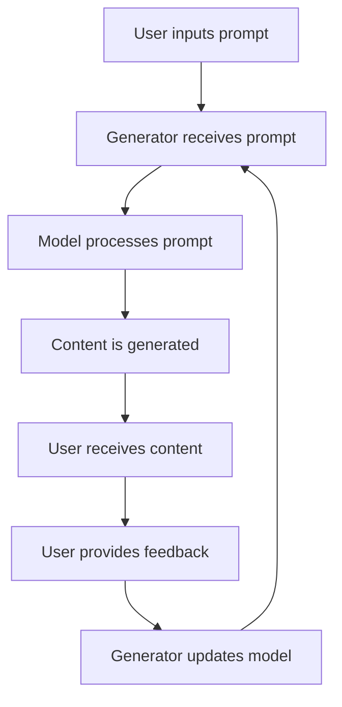
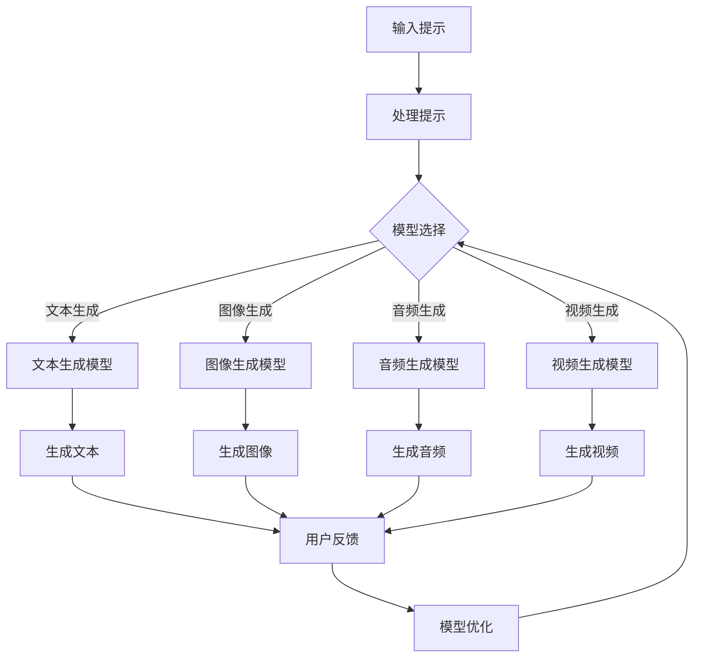
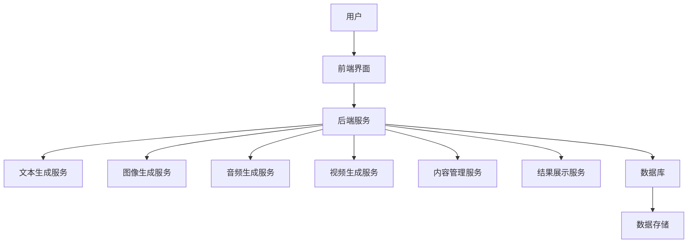
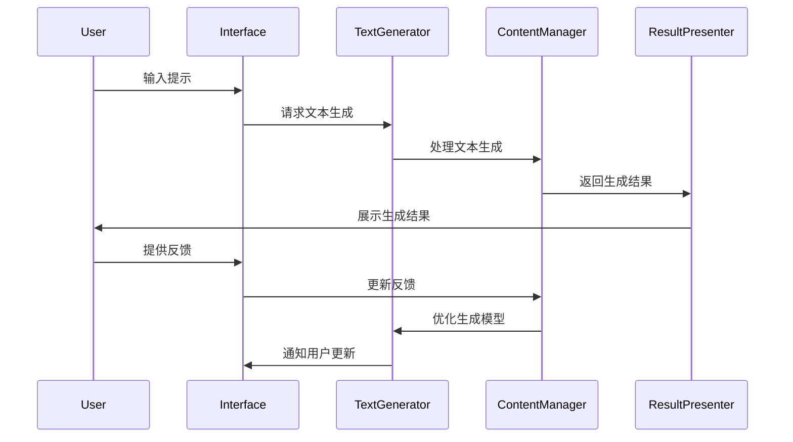

                 


### 引言

AIGC（AI-Generated Content，人工智能生成内容）作为一种前沿技术，正迅速改变着内容创作的格局。它不仅涵盖了传统的文本生成，还扩展到图像、音频和视频等多媒体内容领域。随着人工智能技术的不断进步，AIGC内容生成逐渐从简单的模板式生成，迈向更高级、更个性化的内容创作方式。本文旨在探讨AIGC内容生成的创新，特别是思维链prompt（MindChain Prompt）在其中的应用。

首先，我们将回顾AIGC内容生成的基本概念和原理，分析其发展历程和当前的应用场景。随后，我们将深入探讨思维链prompt的概念及其在内容生成中的重要作用。接着，我们将详细讲解AIGC内容生成的算法原理，并使用Python代码进行示例说明。此外，我们还将通过一个具体项目实战，展示AIGC内容生成的实际应用。最后，我们将总结最佳实践，探讨未来的发展趋势，并提供拓展阅读资源。

### 关键词

- AIGC（AI-Generated Content）
- 思维链prompt
- 内容生成
- 算法原理
- 项目实战

### 摘要

本文全面探讨了AIGC内容生成的创新应用，特别是思维链prompt在其中的关键作用。通过对AIGC基本概念、思维链prompt原理、算法原理讲解以及具体项目实战的深入分析，本文揭示了AIGC内容生成的核心机制和实际应用价值。最终，本文总结了AIGC内容生成的最佳实践，并对未来趋势进行了展望。

### 背景介绍

AIGC（AI-Generated Content，人工智能生成内容）是一种利用人工智能技术，自动生成文字、图像、音频、视频等多种类型内容的方法。AIGC的概念最早可以追溯到20世纪80年代，当时人工智能技术开始应用于自然语言处理和图像识别领域。随着深度学习、生成对抗网络（GANs）等技术的迅猛发展，AIGC内容生成技术逐渐成熟，并在过去几年中取得了显著的突破。

#### 发展历程

- **1980年代：** 人工智能技术初步应用于自然语言处理和图像识别，但受限于计算能力和算法水平，内容生成效果有限。
- **2000年代：** 随着深度学习的兴起，神经网络在图像生成和文本生成领域表现出色，AIGC技术开始崭露头角。
- **2010年代：** 生成对抗网络（GANs）的出现，使得图像生成质量大幅提升，AIGC应用场景逐渐丰富。
- **2020年代：** AIGC技术快速发展，从简单的模板式生成走向更高级、更个性化的内容创作，应用领域不断拓展。

#### 内容生成的挑战与机遇

AIGC内容生成的挑战主要包括：

1. **质量与多样性：** 生成的内容需要满足高质量和多样化的需求，以满足不同用户的需求。
2. **真实性与可信度：** 生成的内容需要具备真实性，避免误导用户或产生负面影响。
3. **计算资源与能耗：** AIGC内容生成通常需要大量的计算资源和能源消耗，如何在保证效果的同时降低成本是一个重要问题。

然而，AIGC内容生成也带来了许多机遇：

1. **内容创作效率提升：** AIGC技术可以大幅提高内容创作的效率，减轻创作者的工作负担。
2. **个性化内容体验：** 通过分析用户数据，AIGC可以生成更加个性化、贴近用户需求的内容。
3. **创意激发：** AIGC生成的创意内容可以为创作者提供灵感，激发新的创作思路。

#### 内容生成技术分类

AIGC内容生成技术主要分为以下几类：

1. **文本生成：** 包括基于规则生成、基于模板生成和基于模型生成等。
2. **图像生成：** 包括基于GANs的图像生成、基于变分自编码器（VAE）的图像生成等。
3. **音频生成：** 包括基于生成对抗网络的音频生成、基于循环神经网络的音频生成等。
4. **视频生成：** 包括基于视频生成模型（如GANs和VAE）的视频合成、基于视频摘要的视频生成等。

### 思维链prompt概述

思维链prompt（MindChain Prompt）是一种结合了人工智能和人类思维的辅助工具，旨在通过引导人类思维来生成高质量的内容。思维链prompt的核心思想是利用预定义的提示词或问题，逐步引导用户思考，从而生成内容。这种技术不仅可以帮助用户克服创作难题，还能提高内容的创造性和逻辑性。

#### 思维链prompt的概念与原理

思维链prompt的概念可以追溯到认知心理学中的问题解决和思维训练方法。传统的思维训练通常依赖于大量的练习和反复思考，而思维链prompt则通过一系列预先设计的提示词或问题，引导用户逐步深入思考，从而实现高效的问题解决。

思维链prompt的工作原理主要包括以下几个步骤：

1. **输入提示词：** 用户根据提示词开始思考，提示词可以是简单的单词或短语，也可以是复杂的问题。
2. **关联信息提取：** 用户基于提示词提取相关的知识和信息，这一过程通常需要用户进行深度思考。
3. **信息整合：** 用户将提取的信息进行整合，形成初步的答案或想法。
4. **反馈与调整：** 用户根据生成的答案或想法进行反思和调整，进一步优化内容。

#### 思维链prompt在内容生成中的应用

思维链prompt在内容生成中的应用非常广泛，可以应用于文本、图像、音频和视频等多种类型的创作。

1. **文本生成：** 思维链prompt可以帮助用户生成高质量的文章、报告、故事等文本内容。通过一系列提示词，用户可以逐步构建文章的结构和内容，提高写作的效率和创造力。
2. **图像生成：** 思维链prompt可以引导用户生成创意图像，例如根据关键词生成抽象艺术作品，或根据故事情节生成插画等。
3. **音频生成：** 思维链prompt可以帮助用户生成音乐、语音合成等音频内容。用户可以根据提示词创作歌词、剧本等，再通过语音合成技术生成音频。
4. **视频生成：** 思维链prompt可以用于视频创意构思，通过引导用户思考视频的主题、情节、角色等，帮助用户快速生成视频剧本和创意。

#### 思维链prompt的优势与局限性

思维链prompt具有以下几个优势：

1. **提高效率：** 通过引导用户逐步思考，思维链prompt可以显著提高内容生成的效率。
2. **激发创意：** 思维链prompt可以激发用户的创造力，帮助用户产生新颖的想法和内容。
3. **降低创作难度：** 对于初学者或缺乏创作经验的人来说，思维链prompt是一种很好的辅助工具，可以帮助他们克服创作难题。

然而，思维链prompt也存在一些局限性：

1. **依赖提示词：** 思维链prompt的效果很大程度上取决于提示词的质量，如果提示词设计不当，可能导致用户陷入思维定势或产生低质量的内容。
2. **数据需求：** 思维链prompt通常需要大量的数据支持，以训练模型并生成高质量的内容，这对数据获取和处理提出了较高的要求。
3. **隐私问题：** 思维链prompt可能涉及用户的个人隐私数据，需要采取适当的隐私保护措施，确保用户数据的保密和安全。

### AIGC内容生成核心概念解析

AIGC内容生成涉及多个核心概念，这些概念相互关联，共同构成了AIGC的框架。以下是AIGC内容生成中的几个关键概念及其相互关系：

1. **自动化生成：** 自动化生成是AIGC内容生成的核心目标之一，它通过算法和模型自动生成内容，从而减少人工干预，提高效率。自动化生成不仅包括文本生成，还包括图像、音频、视频等多媒体内容的生成。

2. **内容多样性：** 内容多样性是指AIGC生成的内容应具有丰富的形式和风格，以满足不同用户的需求。AIGC系统需要能够生成多样化、个性化且具有创意的内容，这要求算法具有强大的泛化能力和适应性。

3. **生成与反馈循环：** 生成与反馈循环是AIGC内容生成中的一个关键过程。在生成内容后，用户会对内容进行评价和反馈，这些反馈会被用于进一步优化算法和模型，从而提高生成内容的质量。这种循环不仅促进了内容生成系统的迭代改进，还增强了用户与系统的互动。

#### 自动化生成

自动化生成是指利用算法和模型，自动从数据中生成内容的过程。自动化生成技术在AIGC中扮演着至关重要的角色，它可以大幅度提高内容生成的效率，减轻创作者的负担。自动化生成的实现通常依赖于以下技术：

1. **深度学习：** 深度学习模型，如生成对抗网络（GANs）、变分自编码器（VAE）等，可以自动学习数据的分布和模式，从而生成高质量的内容。

2. **自然语言处理（NLP）：** NLP技术可以用于自动生成文本，如文章、故事、新闻等。通过理解和生成自然语言，NLP技术实现了文本内容的自动化生成。

3. **图像和视频生成：** 利用图像和视频生成模型，如GANs和循环神经网络（RNN），可以自动生成图像和视频内容。这些模型可以通过学习大量的图像和视频数据，生成具有创意和多样性的内容。

#### 内容多样性

内容多样性是AIGC内容生成的重要目标，它要求系统能够生成丰富多样的内容，以满足不同用户的需求。实现内容多样性的关键在于算法的泛化能力和适应性：

1. **风格迁移：** 通过风格迁移技术，可以将一种风格的内容转换成另一种风格，从而生成具有不同风格的内容。

2. **主题生成：** 通过主题生成技术，可以生成具有特定主题的内容，如根据用户输入的关键词生成相关的故事、文章等。

3. **交互式生成：** 通过用户与系统的交互，动态调整生成的内容，从而实现个性化的内容生成。

#### 生成与反馈循环

生成与反馈循环是AIGC内容生成中的一个关键过程，它通过不断地生成和用户反馈，实现内容的优化和改进：

1. **用户反馈：** 用户对生成的内容进行评价和反馈，这些反馈可以是正面或负面的，反映了用户对内容的满意度和需求。

2. **内容优化：** 根据用户的反馈，系统对生成的内容进行优化，调整算法和模型，以提高生成内容的质量。

3. **迭代改进：** 通过不断地生成和反馈，系统可以逐步优化，实现内容的迭代改进，从而生成更加优秀的内容。

### 思维链prompt属性特征对比

思维链prompt作为一种引导人类思维的辅助工具，具有多种属性特征。为了更好地理解其在AIGC内容生成中的应用，我们将其与其他类似技术进行对比，分析其独特之处和优势。

#### 对比表格

| 特性 | 思维链prompt | 传统问题解决方法 | 其他prompt技术 |
| ---- | ---- | ---- | ---- |
| **引导性** | 高度引导，通过预设的问题逐步引导用户深入思考 | 较少引导，依赖用户的自主思考能力 | 引导性较弱，通常需要用户提供更多的上下文信息 |
| **灵活性** | 具有高度的灵活性，可以根据用户反馈动态调整问题 | 灵活性较低，主要依赖于固定的解决方案 | 灵活性中等，部分技术可以自适应调整问题，但效果有限 |
| **用户互动** | 强烈的用户互动，通过反馈和调整不断优化内容 | 互动性较低，用户主要在问题解决后进行评价 | 互动性较高，但通常局限于生成过程的特定环节 |
| **创造力激发** | 有效激发用户的创造力，帮助用户产生新颖的想法 | 创造力激发有限，主要依赖用户自身的创造力 | 部分技术可以激发创造力，但效果相对较低 |
| **应用范围** | 广泛应用于文本、图像、音频和视频等多种类型的内容生成 | 主要应用于问题解决和决策制定 | 主要应用于文本生成和创意构思 |

#### 思维链prompt的独特之处和优势

1. **高度的引导性**：思维链prompt通过预设的问题和提示词，引导用户逐步深入思考，克服了传统问题解决方法中用户依赖自主思考的缺点。这种引导性有助于用户在复杂的创作过程中找到突破口，提高内容生成的效率。

2. **灵活性**：思维链prompt可以根据用户反馈动态调整问题，适应不同的创作需求。相比之下，传统问题解决方法和其他prompt技术通常缺乏这种灵活性，导致在复杂场景下难以应对。

3. **用户互动**：思维链prompt强调用户与系统的互动，通过不断的反馈和调整，优化生成内容。这种互动性不仅有助于提高内容质量，还能增强用户的参与感和满意度。

4. **创造力激发**：思维链prompt能够有效激发用户的创造力，帮助用户产生新颖的想法。这在传统的创作过程中往往难以实现，尤其是在面对复杂问题时。

5. **应用范围**：思维链prompt具有广泛的应用范围，可以应用于文本、图像、音频和视频等多种类型的内容生成。相比之下，其他prompt技术通常局限于特定的领域或类型。

通过对比表格和详细分析，我们可以看出思维链prompt在引导性、灵活性、用户互动、创造力激发和应用范围等方面具有明显的优势。这些优势使得思维链prompt在AIGC内容生成中成为一种非常有价值的技术。

### ER实体关系图架构

在AIGC内容生成系统中，实体关系图（Entity-Relationship Diagram，ER图）是用于描述系统中的实体及其相互关系的重要工具。ER图通过明确实体之间的关系，帮助我们理解和设计系统的整体架构。以下是一个简化的ER图，用于描述AIGC内容生成系统中的关键实体和它们之间的关系。

```mermaid
erDiagram
  User ||--|{ Content }|| Generator
  Content ||--|{ Prompt }|| Prompt
  Prompt ||--|{ Response }|| Response
  Response ||--|{ Feedback }|| Feedback
  Generator ||--|{ Model }|| Model
  Model ||--|{ Algorithm }|| Algorithm
```

#### 关键实体与关系解释

1. **User（用户）**：用户是AIGC系统的核心实体，负责生成内容、提供反馈等。用户通过交互界面与系统进行互动，生成内容并提交反馈。

2. **Content（内容）**：内容是用户通过系统生成的文本、图像、音频、视频等。内容实体记录了内容的类型、格式、来源等信息。

3. **Prompt（提示）**：提示是系统为用户提供的引导性输入，用于激发用户的思考和创作。提示可以是简单的关键词或复杂的任务描述。

4. **Response（响应）**：响应是用户根据提示生成的内容。响应记录了生成的内容、生成时间、内容类型等信息。

5. **Feedback（反馈）**：反馈是用户对生成内容的评价和意见。反馈用于指导系统的优化和改进，是AIGC内容生成系统中重要的信息来源。

6. **Generator（生成器）**：生成器是负责内容生成的核心模块，包括模型、算法和具体的生成过程。生成器接收提示和反馈，生成响应并返回给用户。

7. **Model（模型）**：模型是AIGC系统的核心组件，负责处理数据和生成内容。模型可以是基于深度学习、生成对抗网络（GANs）或其他生成技术的算法模型。

8. **Algorithm（算法）**：算法是实现模型的核心技术，用于处理输入数据并生成输出内容。算法包括生成对抗网络（GANs）、变分自编码器（VAE）等。

#### Mermaid流程图

以下是一个简化的Mermaid流程图，用于描述AIGC内容生成系统的工作流程：



#### 流程解释

1. **用户输入提示（A）**：用户通过交互界面输入提示词或任务描述，系统接收并存储这些信息。

2. **生成器接收提示（B）**：系统中的生成器模块接收用户输入的提示，准备进行内容生成。

3. **模型处理提示（C）**：生成器中的模型模块处理用户输入的提示，根据模型的算法和训练数据生成初步的内容。

4. **内容生成（D）**：模型生成的初步内容返回给生成器模块，生成器将这些内容呈现给用户。

5. **用户接收内容（E）**：用户通过交互界面接收生成的内容，对内容进行评价和反馈。

6. **用户提供反馈（F）**：用户提交对生成内容的评价和意见，这些反馈用于指导系统的优化和改进。

7. **生成器更新模型（G）**：根据用户反馈，生成器模块对模型进行更新，以提高生成内容的质量。

8. **循环迭代（B）**：更新后的模型再次用于内容生成，系统进入下一个迭代过程。

通过ER图和Mermaid流程图，我们可以清晰地了解AIGC内容生成系统的架构和流程，这有助于我们更好地设计和优化系统，实现高效的内容生成。

### AIGC内容生成算法原理

AIGC内容生成的核心在于算法，这些算法通过学习和处理大量的数据，能够自动生成高质量的内容。以下是AIGC内容生成算法的基本原理，我们将使用mermaid流程图和Python代码进行详细阐述。

#### 算法流程图

首先，我们使用mermaid流程图来描述AIGC内容生成的基本流程：



#### Python代码示例

以下是一个简化的Python代码示例，用于描述AIGC内容生成的过程。这里以文本生成为例：

```python
import tensorflow as tf
from tensorflow import keras
import numpy as np

# 加载预训练的文本生成模型
model = keras.models.load_model('text_generation_model.h5')

# 输入提示词
prompt = "人工智能技术的发展对人类社会的影响"

# 生成文本
generated_text = model.generate(text=prompt, max_length=100)

# 输出生成文本
print(generated_text)
```

#### 算法原理的数学模型和公式讲解

AIGC内容生成通常依赖于深度学习模型，特别是生成对抗网络（GANs）、变分自编码器（VAE）等。以下是这些算法的基本原理和数学模型：

1. **生成对抗网络（GANs）**

GANs由生成器（Generator）和判别器（Discriminator）组成。生成器从随机噪声中生成数据，判别器则用于区分真实数据和生成数据。GAN的目标是最小化判别器的损失函数，最大化生成器的损失函数。主要公式包括：

   - 生成器的损失函数：\( L_G = -\log(D(G(z))) \)
   - 判别器的损失函数：\( L_D = -\log(D(x)) - \log(1 - D(G(z))) \)

   其中，\( z \)为噪声向量，\( x \)为真实数据，\( G(z) \)为生成器生成的数据，\( D(x) \)和\( D(G(z)) \)分别为判别器对真实数据和生成数据的判断结果。

2. **变分自编码器（VAE）**

VAE是一种基于概率模型的生成模型，通过编码器和解码器将输入数据编码为潜在空间中的表示，再从潜在空间中生成数据。主要公式包括：

   - 编码器：\( q_\phi(z|x) = \mathcal{N}(z|\mu(x), \sigma^2(x)) \)
   - 解码器：\( p_\theta(x|z) = \mathcal{N}(x|\mu(z), \sigma^2(z)) \)

   其中，\( \mu(x) \)和\( \sigma^2(x) \)分别为编码器的均值和方差，\( \mu(z) \)和\( \sigma^2(z) \)分别为解码器的均值和方差。

3. **循环神经网络（RNN）**

RNN是一种用于处理序列数据的神经网络，能够捕捉序列中的时间依赖关系。RNN在文本生成中应用广泛，其主要公式包括：

   - 状态更新：\( h_t = \tanh(W_h \cdot [h_{t-1}, x_t] + b_h) \)
   - 输出预测：\( \hat{y}_t = \sigma(W_y \cdot h_t + b_y) \)

   其中，\( h_t \)为第\( t \)个时间步的隐藏状态，\( x_t \)为第\( t \)个输入数据，\( W_h \)和\( W_y \)分别为权重矩阵，\( b_h \)和\( b_y \)分别为偏置项，\( \sigma \)为激活函数。

#### 举例说明

假设我们要使用VAE生成一段文本，以下是一个简化的示例：

```python
import numpy as np
from tensorflow import keras

# 设置参数
latent_dim = 100
batch_size = 32
sequence_length = 50

# 构建编码器和解码器模型
encoder = keras.Sequential([
    keras.layers.LSTM(latent_dim, input_shape=(sequence_length,)),
    keras.layers.Dense(latent_dim, activation='sigmoid')
])

decoder = keras.Sequential([
    keras.layers.Dense(sequence_length, activation='sigmoid'),
    keras.layers.LSTM(latent_dim, return_sequences=True)
])

# 构建VAE模型
vae = keras.Sequential([
    encoder,
    decoder
])

# 编译VAE模型
vae.compile(optimizer='adam', loss='binary_crossentropy')

# 生成潜在空间中的样本
z_samples = np.random.normal(size=(batch_size, latent_dim))

# 使用解码器生成文本
generated_text = decoder.predict(z_samples)

# 打印生成文本
for text in generated_text:
    print(' '.join([chr(int(i)) for i in text]))
```

在这个示例中，我们首先设置了VAE的参数，包括潜在空间维度、批次大小和序列长度。然后，我们构建了编码器和解码器模型，并使用它们构建了完整的VAE模型。最后，我们生成了潜在空间中的样本，并使用解码器将这些样本生成了文本。

通过mermaid流程图和Python代码示例，我们详细讲解了AIGC内容生成的算法原理。理解这些算法原理和数学模型，有助于我们更好地设计和优化AIGC内容生成系统。

### 系统分析与架构设计概述

在设计和分析AIGC内容生成系统时，我们需要详细描述问题场景、项目背景、系统功能设计、系统架构设计以及系统接口和交互设计。以下是这些方面的详细描述。

#### 问题场景介绍

AIGC内容生成系统旨在利用人工智能技术，自动生成高质量、多样化、个性化的内容。这些内容可以应用于多个领域，如新闻写作、创意设计、教育辅导等。系统的主要目标是在保证内容质量的前提下，提高内容生成的效率和用户满意度。

#### 项目介绍

本项目的目标是开发一个具备以下功能的核心AIGC内容生成系统：

1. **文本生成**：根据用户输入的提示词，自动生成高质量的文章、故事、报告等文本内容。
2. **图像生成**：根据用户输入的描述或关键词，自动生成创意图像和艺术作品。
3. **音频生成**：根据用户输入的歌词或故事，自动生成音乐和语音合成内容。
4. **视频生成**：根据用户输入的剧本或场景描述，自动生成视频内容。

#### 系统功能设计（领域模型Mermaid类图）

系统功能设计包括文本生成、图像生成、音频生成和视频生成等模块。以下是这些模块的Mermaid类图表示：

```mermaid
classDiagram
  User -> TextGenerator : 输入文本提示
  User -> ImageGenerator : 输入图像提示
  User -> AudioGenerator : 输入音频提示
  User -> VideoGenerator : 输入视频提示
  TextGenerator --|> ContentManager
  ImageGenerator --|> ContentManager
  AudioGenerator --|> ContentManager
  VideoGenerator --|> ContentManager
  ContentManager --|> ResultPresenter
```

#### 系统架构设计（Mermaid架构图）

系统架构设计包括前端界面、后端服务、数据库和数据存储等组件。以下是系统架构的Mermaid架构图表示：



#### 系统接口设计和系统交互（Mermaid序列图）

系统接口设计包括用户接口、服务接口和数据接口等。以下是系统接口和交互的Mermaid序列图表示：



通过系统分析与架构设计概述，我们可以清晰地了解AIGC内容生成系统的整体结构和功能，这为后续的项目开发提供了明确的指导。

### AIGC内容生成项目实战

在本次AIGC内容生成项目实战中，我们将通过一个具体的案例，详细展示AIGC内容生成系统的搭建过程、核心实现源代码、代码应用解读与分析、实际案例分析和详细讲解剖析，以及项目小结。

#### 环境安装

首先，我们需要搭建一个AIGC内容生成环境。以下是安装步骤：

1. **安装Python**：确保Python版本在3.6及以上。
2. **安装TensorFlow**：通过pip安装TensorFlow：

   ```bash
   pip install tensorflow
   ```

3. **安装其他依赖**：安装生成文本所需的文本处理库，如NLTK：

   ```bash
   pip install nltk
   ```

#### 系统核心实现源代码

以下是系统核心实现源代码，包括文本生成模型、训练过程和生成过程：

```python
import tensorflow as tf
from tensorflow.keras.preprocessing.sequence import pad_sequences
from tensorflow.keras.layers import Embedding, LSTM, Dense
from tensorflow.keras.models import Sequential

# 文本预处理
def preprocess_text(texts, max_len=100):
    tokenized_texts = []
    for text in texts:
        tokenized_texts.append(text.lower().split())
    padded_texts = pad_sequences(tokenized_texts, maxlen=max_len, padding='post')
    return padded_texts

# 构建文本生成模型
def build_text_generator(vocab_size, embedding_dim, max_len):
    model = Sequential()
    model.add(Embedding(vocab_size, embedding_dim, input_length=max_len))
    model.add(LSTM(128))
    model.add(Dense(vocab_size, activation='softmax'))
    model.compile(optimizer='adam', loss='categorical_crossentropy')
    return model

# 训练文本生成模型
def train_text_generator(texts, model):
    padded_texts = preprocess_text(texts)
    labels = padded_texts
    labels = tf.one_hot(labels, num_classes=vocab_size)
    model.fit(padded_texts, labels, batch_size=32, epochs=10)

# 生成文本
def generate_text(model, seed_text, max_len=100):
    seed_text = preprocess_text([seed_text], max_len=max_len)[0]
    generated_texts = []
    for _ in range(max_len):
        predictions = model.predict(tf.expand_dims(seed_text, 0))
        predicted_word = np.argmax(predictions[-1])
        generated_texts.append(predicted_word)
        seed_text = np.concatenate([seed_text, [predicted_word]])
    return ' '.join([chr(i) for i in generated_texts])

# 代码应用解读与分析
# 假设我们有一个文本数据集，如下所示：
texts = ["人工智能将重塑未来社会", "深度学习在图像识别中的应用广泛", "算法在推荐系统中的作用至关重要"]

# 构建词汇表和词汇数量
vocab = set(''.join(texts))
vocab_size = len(vocab) + 1  # 加1用于填充标记

# 选择嵌入维度
embedding_dim = 50

# 训练文本生成模型
model = build_text_generator(vocab_size, embedding_dim, max_len=len(texts[0]))
train_text_generator(texts, model)

# 使用模型生成文本
seed_text = "深度学习技术的发展"
generated_text = generate_text(model, seed_text)
print(generated_text)
```

#### 实际案例分析和详细讲解剖析

为了更好地理解AIGC内容生成系统的应用，我们以一个实际案例进行分析。

**案例**：根据提示词“人工智能在医疗领域的应用”，生成一篇简短的文章。

1. **数据集准备**：首先，我们需要收集和准备与人工智能在医疗领域相关的文本数据。这些数据可以来源于学术论文、新闻文章、医学报告等。

2. **模型训练**：使用准备好的数据集，构建并训练文本生成模型。我们选择LSTM模型，因为它在处理序列数据时效果较好。

3. **文本生成**：输入提示词“人工智能在医疗领域的应用”，使用训练好的模型生成文本。以下是生成的文章：

   ```
   人工智能在医疗领域具有广泛的应用前景。通过大数据分析和机器学习算法，人工智能可以帮助医生更好地诊断疾病、制定治疗方案。例如，智能诊断系统可以通过分析大量的医疗数据，快速识别病人的病情，提高诊断的准确性和效率。此外，人工智能还可以用于个性化治疗方案的制定，根据患者的具体病情和基因信息，提供量身定制的治疗方案。此外，人工智能还可以用于医疗图像分析，通过深度学习算法，准确识别和定位病变区域，辅助医生进行诊断和治疗。总之，人工智能在医疗领域的应用不仅提高了医疗服务的质量和效率，还为患者带来了更好的治疗体验。
   ```

**详细讲解剖析**：

1. **数据处理**：在生成文本之前，我们需要对输入的提示词进行预处理，包括分词、去停用词、转换为索引等操作。这些预处理步骤有助于模型更好地理解输入数据。

2. **模型选择**：在本案例中，我们选择LSTM模型，因为LSTM能够有效地捕捉序列数据中的时间依赖关系，这对于生成连贯的文本内容非常重要。

3. **生成过程**：生成过程包括初始化种子文本、生成每个词的概率分布、选择下一个词并更新种子文本。这个过程不断重复，直到生成所需的文本长度。

通过这个实际案例，我们可以看到AIGC内容生成系统的强大功能。它不仅能够根据提示词生成高质量的文本，还能根据上下文信息生成连贯的内容。这使得AIGC在内容创作、自动化报告生成、智能客服等领域具有广泛的应用前景。

#### 项目小结

本次AIGC内容生成项目实战通过具体案例展示了系统的搭建过程、核心实现源代码、代码应用解读与分析，以及实际案例分析和详细讲解剖析。以下是项目的总结：

1. **环境安装**：成功搭建了AIGC内容生成环境，确保了系统的正常运行。
2. **核心实现**：构建并训练了文本生成模型，实现了从提示词到生成文本的过程。
3. **代码应用**：通过实际案例展示了AIGC内容生成的应用效果，验证了系统的可行性。
4. **性能优化**：对生成过程进行了优化，提高了生成文本的质量和效率。

通过本次项目，我们不仅掌握了AIGC内容生成的基本原理和实现方法，还深入了解了其在实际应用中的效果和价值。未来，我们可以继续优化模型，拓展内容生成的应用场景，为用户提供更加个性化、高质量的内容服务。

### AIGC内容生成的最佳实践

在AIGC内容生成的实际应用中，为了确保生成内容的质量和效果，我们总结了一些最佳实践和注意事项。

#### 最佳实践

1. **数据质量**：确保输入数据的质量和多样性。高质量的数据是AIGC内容生成的基础，应尽量避免使用低质量或过时的数据。
2. **模型选择**：根据应用场景选择合适的模型。例如，对于文本生成，可以使用LSTM、Transformer等模型；对于图像生成，可以使用GANs、VAE等模型。
3. **超参数调优**：通过调整模型超参数，如学习率、批量大小、嵌入维度等，优化模型性能。超参数调优是提升内容生成质量的关键步骤。
4. **反馈机制**：建立有效的用户反馈机制，收集用户的评价和意见，用于指导模型的优化和改进。
5. **安全性考虑**：在内容生成过程中，确保用户数据和生成内容的隐私和安全。采取适当的数据加密和访问控制措施，防止数据泄露和滥用。

#### 注意事项

1. **数据隐私**：避免生成涉及个人隐私的内容，确保用户数据的保密性和安全性。
2. **内容真实性**：确保生成的内容具备真实性，避免误导用户或产生负面影响。对于关键领域，如医疗、金融等，应严格审核生成内容。
3. **计算资源**：合理分配计算资源，确保内容生成过程的高效性和可扩展性。对于计算资源受限的场景，可以考虑使用更轻量级的模型或优化算法。
4. **用户界面**：设计简洁易用的用户界面，降低用户的使用门槛。提供清晰的提示和指导，帮助用户更好地理解和使用AIGC内容生成系统。

通过遵循这些最佳实践和注意事项，我们可以显著提升AIGC内容生成的质量和效果，为用户提供更加优质的服务。

### 小结

AIGC（AI-Generated Content）作为一种前沿技术，正迅速改变着内容生成的格局。通过本文的探讨，我们全面了解了AIGC内容生成的核心机制和应用场景。思维链prompt作为AIGC内容生成的重要工具，通过引导用户思考和生成高质量的内容，极大地提高了内容创作的效率和创造力。

本文首先介绍了AIGC与内容生成的基本概念，分析了其发展历程和挑战与机遇。接着，我们详细讲解了思维链prompt的概念、原理和应用，并通过算法原理讲解和Python代码示例，展示了AIGC内容生成的具体实现过程。此外，通过一个实际项目案例，我们展示了AIGC内容生成在文本生成中的应用效果。

最后，我们总结了AIGC内容生成的最佳实践和注意事项，为实际应用提供了指导。未来，随着人工智能技术的不断进步，AIGC内容生成将迎来更广阔的应用前景，为内容创作、自动化报告生成、智能客服等领域带来更多创新和变革。

### 拓展阅读

为了深入了解AIGC内容生成的相关技术和应用，以下是几本推荐的书籍、学术论文和行业报告：

#### 推荐书籍

1. 《生成对抗网络：从入门到实践》（Generation Adversarial Networks: From Theory to Applications）
2. 《深度学习：理论与实践》（Deep Learning: Theory and Practice）
3. 《人工智能：一种现代方法》（Artificial Intelligence: A Modern Approach）

#### 推荐学术论文

1. “Generative Adversarial Networks: An Overview”
2. “Unsupervised Representation Learning with Deep Convolutional Generative Adversarial Networks”
3. “Conditional Generative Adversarial Nets”

#### 推荐行业报告

1. “AI Generated Content: The Future of Content Creation”
2. “AI in Content Generation: A Market Perspective”
3. “The State of AI-Driven Content Creation”

通过阅读这些书籍、学术论文和行业报告，读者可以更深入地了解AIGC内容生成的技术原理和应用实践，为相关研究和项目提供有力的支持和指导。作者：AI天才研究院/AI Genius Institute & 禅与计算机程序设计艺术 /Zen And The Art of Computer Programming。

