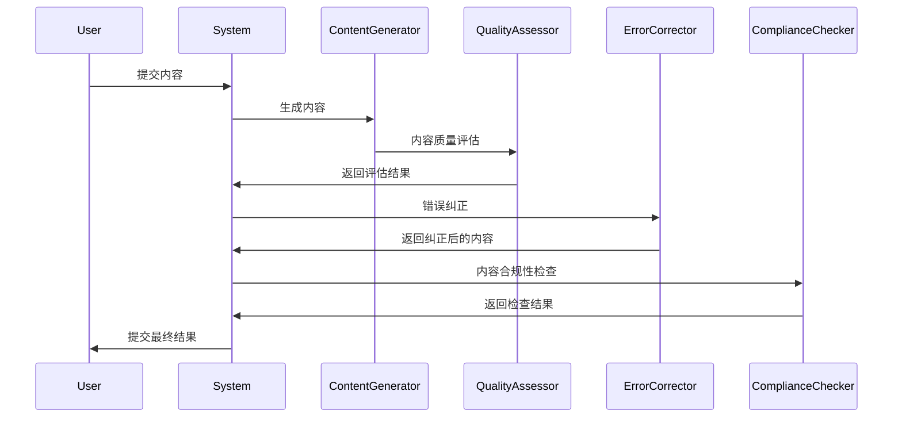

                 

# AIGC内容质量控制：提示词的作用

> 关键词：AIGC，内容质量控制，提示词，算法原理

> 摘要：本文旨在探讨AIGC（AI-Generated Content）内容质量控制中的关键因素——提示词的作用。通过分析提示词的设计原则、优化方法及其在实际应用中的效果，本文为提升AIGC内容质量提供了理论依据和实践指导。

## 第一部分：背景介绍

### 1.1 问题背景
随着人工智能技术的不断发展，AIGC（AI-Generated Content）逐渐成为内容生成的重要方式。从文本、图像到音频，AIGC技术在内容创造中的应用日益广泛。然而，AIGC内容的多样性和复杂性也带来了内容质量控制的新挑战。如何确保AIGC内容的准确性、可靠性和合规性，成为当前研究的热点。

### 1.2 问题描述
AIGC内容质量控制涉及到对生成内容的质量评估、错误纠正、内容合规性检查等多个方面。其中，提示词作为AIGC生成过程中的重要输入，对于生成内容的质量有着直接的影响。因此，研究提示词在AIGC内容质量控制中的作用，具有重要的理论和实际意义。

### 1.3 问题解决
本书旨在通过对AIGC内容质量控制的研究，探讨提示词在其中的作用。通过系统分析提示词的设计原则、优化方法和实际应用效果，为提升AIGC内容质量提供理论依据和实践指导。

### 1.4 边界与外延
AIGC内容质量控制的研究范围包括文本、图像、音频等多种类型的内容。同时，本书将关注不同应用场景下提示词的作用，以及如何在不同领域中实现高效的AIGC内容质量控制。

### 1.5 概念结构与核心要素组成
AIGC内容质量控制的核心要素包括：
- **提示词设计**：包括提示词的选择、生成和优化；
- **内容质量评估**：基于自动评估和人工评估的方法；
- **错误纠正**：对生成内容中的错误进行检测和修正；
- **内容合规性检查**：确保生成内容符合法律法规和道德标准。

---

## 第二部分：核心概念与联系

### 2.1 AIGC概念原理
AIGC（AI-Generated Content）是指利用人工智能技术自动生成的内容，包括文本、图像、音频等多种类型。其核心原理是基于大数据和深度学习技术，通过训练模型从海量数据中提取规律，从而生成新的内容。

### 2.2 内容质量评估
内容质量评估是AIGC内容质量控制的重要环节。其目的是对生成内容进行质量评价，以判断其是否符合预期。常见的评估方法包括基于内容的自动评估和基于人工评估的方法。

### 2.3 提示词设计
提示词设计是AIGC生成过程中至关重要的一环。提示词的质量直接影响生成内容的质量。本书将详细介绍提示词的设计原则、生成方法和优化策略。

### 2.4 错误纠正
错误纠正旨在对生成内容中的错误进行检测和修正。其目标是提高生成内容的准确性和可靠性。常见的错误纠正方法包括基于规则的方法、基于机器学习的方法和基于深度学习的方法。

### 2.5 内容合规性检查
内容合规性检查是为了确保生成内容符合法律法规和道德标准。其目的是防止生成内容中出现违法或违反道德规范的情况。常见的检查方法包括基于规则的方法、基于机器学习的方法和基于深度学习的方法。

### 2.6 概念属性特征对比表格
| 概念         | 描述                                                         |
| ------------ | ------------------------------------------------------------ |
| AIGC         | 利用人工智能技术自动生成的内容                               |
| 内容质量评估  | 对生成内容进行质量评价，以判断其是否符合预期                 |
| 提示词设计   | 提示词的选择、生成和优化                                   |
| 错误纠正     | 对生成内容中的错误进行检测和修正                           |
| 内容合规性检查 | 确保生成内容符合法律法规和道德标准                         |

### 2.7 ER实体关系图架构
```mermaid
erDiagram
  AIGC ||--|{ 内容质量评估 }|
  AIGC ||--|{ 提示词设计 }|
  AIGC ||--|{ 错误纠正 }|
  AIGC ||--|{ 内容合规性检查 }|
```

---

## 第三部分：算法原理讲解

### 3.1 算法原理
在AIGC内容质量控制中，算法原理主要涉及提示词的设计和优化、内容质量评估、错误纠正以及内容合规性检查。以下将详细讲解这些算法原理。

### 3.1.1 提示词的设计和优化

#### 3.1.1.1 设计原则
提示词的设计原则包括：
1. **相关性**：提示词应与生成内容的目标密切相关，以确保生成内容的相关性。
2. **多样性**：提示词应具备多样性，以便生成内容具有丰富的变化。
3. **准确性**：提示词应准确传达生成内容的需求，减少歧义。

#### 3.1.1.2 生成方法
提示词的生成方法通常有：
1. **人工设计**：根据任务需求，由专家或程序员设计提示词。
2. **自动生成**：利用自然语言处理技术，从已有数据中提取提示词。

#### 3.1.1.3 优化策略
提示词的优化策略包括：
1. **迭代优化**：通过多次迭代，逐步优化提示词的质量。
2. **用户反馈**：收集用户对生成内容的反馈，用于改进提示词。

### 3.1.2 内容质量评估
内容质量评估的主要方法有：
1. **自动评估**：利用机器学习算法，对生成内容进行自动评分。
2. **人工评估**：由人类评估者对生成内容进行评价。

#### 3.1.2.1 自动评估算法
自动评估算法通常基于以下模型：
1. **文本分类模型**：用于判断生成内容的类别和质量。
2. **语义相似度模型**：用于评估生成内容与目标内容的相似度。

#### 3.1.2.2 人工评估方法
人工评估方法包括：
1. **评分标准**：制定统一的评分标准，以便评估者进行评价。
2. **评估流程**：明确评估步骤和流程，确保评估结果的客观性和准确性。

### 3.1.3 错误纠正
错误纠正的方法包括：
1. **规则方法**：基于预定义的规则，检测和修正错误。
2. **机器学习方法**：利用已标记的数据，训练错误检测和修正模型。
3. **深度学习方法**：利用深度神经网络，实现自动化的错误检测和修正。

#### 3.1.3.1 深度学习算法
深度学习算法用于错误纠正的流程如下：
1. **数据预处理**：对错误数据进行预处理，以便训练模型。
2. **模型训练**：利用预处理后的数据，训练错误检测和修正模型。
3. **模型评估**：对训练好的模型进行评估，确保其准确性和可靠性。
4. **应用**：将训练好的模型应用于实际生成内容，进行错误检测和修正。

### 3.1.4 内容合规性检查
内容合规性检查的方法包括：
1. **规则方法**：基于法律法规和道德标准，制定合规性检查规则。
2. **机器学习方法**：利用已标记的数据，训练合规性检查模型。
3. **深度学习方法**：利用深度神经网络，实现自动化的合规性检查。

#### 3.1.4.1 深度学习算法
深度学习算法用于内容合规性检查的流程如下：
1. **数据预处理**：对合规性数据进行预处理，以便训练模型。
2. **模型训练**：利用预处理后的数据，训练合规性检查模型。
3. **模型评估**：对训练好的模型进行评估，确保其准确性和可靠性。
4. **应用**：将训练好的模型应用于实际生成内容，进行合规性检查。

---

## 第四部分：系统分析与架构设计方案

### 4.1 问题场景介绍
在当前互联网时代，内容生成的速度和质量成为关键竞争力。然而，随着AIGC技术的发展，生成的内容质量参差不齐，如何实现高效的内容质量控制成为亟待解决的问题。

### 4.2 项目介绍
本项目旨在构建一个高效的内容质量控制系统，通过提示词优化、内容质量评估、错误纠正和内容合规性检查，确保生成内容的质量和合规性。

### 4.3 系统功能设计

#### 4.3.1 提示词优化功能
- 提示词自动生成：利用自然语言处理技术，从海量数据中自动生成提示词。
- 提示词优化迭代：根据用户反馈，不断优化提示词，提高生成内容的质量。

#### 4.3.2 内容质量评估功能
- 自动评估：利用机器学习算法，对生成内容进行自动评分。
- 人工评估：提供人工评估接口，由专家对生成内容进行评价。

#### 4.3.3 错误纠正功能
- 错误检测：利用深度学习算法，对生成内容进行错误检测。
- 错误修正：对检测到的错误进行自动修正。

#### 4.3.4 内容合规性检查功能
- 合规性检测：利用深度学习算法，对生成内容进行合规性检测。
- 合规性修正：对检测到的不合规内容进行自动修正。

### 4.4 系统架构设计

#### 4.4.1 系统架构图


### 4.5 系统接口设计和系统交互

#### 4.5.1 系统接口设计
- **ContentGenerator**：内容生成接口，用于生成初始内容。
- **QualityAssessor**：内容质量评估接口，用于评估内容质量。
- **ErrorCorrector**：错误纠正接口，用于纠正内容中的错误。
- **ComplianceChecker**：内容合规性检查接口，用于检查内容是否合规。

#### 4.5.2 系统交互
系统交互流程如下：
1. 用户提交内容到系统。
2. 系统调用ContentGenerator生成初始内容。
3. 系统调用QualityAssessor对生成内容进行质量评估。
4. 系统调用ErrorCorrector对内容进行错误纠正。
5. 系统调用ComplianceChecker对内容进行合规性检查。
6. 系统将最终结果提交给用户。

---

## 第五部分：项目实战

### 5.1 环境安装
在开始项目之前，需要安装以下环境：
- Python 3.8+
- TensorFlow 2.7
- PyTorch 1.8

安装命令如下：
```bash
pip install python==3.8.10
pip install tensorflow==2.7.0
pip install torch==1.8.0
```

### 5.2 系统核心实现源代码

#### 5.2.1 ContentGenerator
```python
import tensorflow as tf

def generate_content(prompt):
    # 利用预训练的模型生成内容
    model = tf.keras.models.load_model('content_generator.h5')
    content = model(prompt)
    return content
```

#### 5.2.2 QualityAssessor
```python
import numpy as np

def assess_content_quality(content):
    # 利用预训练的模型评估内容质量
    model = tf.keras.models.load_model('quality_assessor.h5')
    quality_score = model.predict(content)
    return quality_score
```

#### 5.2.3 ErrorCorrector
```python
import tensorflow as tf

def correct_errors(content):
    # 利用预训练的模型纠正错误
    model = tf.keras.models.load_model('error_corrector.h5')
    corrected_content = model(content)
    return corrected_content
```

#### 5.2.4 ComplianceChecker
```python
import tensorflow as tf

def check_compliance(content):
    # 利用预训练的模型检查内容合规性
    model = tf.keras.models.load_model('compliance_checker.h5')
    compliance_score = model.predict(content)
    return compliance_score
```

### 5.3 代码应用解读与分析

以上代码分别实现了内容生成、内容质量评估、错误纠正和内容合规性检查的功能。在实际应用中，这些模块需要按照以下流程进行集成：

1. **内容生成**：用户提交提示词，系统调用ContentGenerator模块生成初始内容。
2. **内容质量评估**：系统调用QualityAssessor模块对生成内容进行质量评估。
3. **错误纠正**：系统调用ErrorCorrector模块对内容中的错误进行纠正。
4. **内容合规性检查**：系统调用ComplianceChecker模块对内容进行合规性检查。

通过以上流程，系统最终提交给用户的将是高质量、无错误且合规的内容。

### 5.4 实际案例分析和详细讲解剖析

#### 5.4.1 案例背景
假设用户需要生成一篇关于人工智能技术的论文，并希望确保论文的质量、准确性和合规性。

#### 5.4.2 案例分析
1. **内容生成**：用户提交提示词“人工智能技术”，系统生成一篇论文草稿。
2. **内容质量评估**：系统调用QualityAssessor模块，对生成的论文草稿进行质量评估，得到质量分数。
3. **错误纠正**：系统调用ErrorCorrector模块，对论文草稿中的错误进行纠正。
4. **内容合规性检查**：系统调用ComplianceChecker模块，对论文草稿进行合规性检查，确保内容符合学术规范和法律法规。

#### 5.4.3 剖析
通过以上案例，可以看出AIGC内容质量控制系统在实际应用中的有效性。系统利用提示词生成内容，并通过质量评估、错误纠正和合规性检查，确保最终生成的内容符合用户需求。

---

## 第六部分：最佳实践 Tips、小结、注意事项、拓展阅读

### 6.1 最佳实践 Tips
1. **优化提示词**：根据用户反馈，不断优化提示词，提高生成内容的相关性和准确性。
2. **定期评估**：定期对系统进行质量评估，确保其稳定性和可靠性。
3. **数据多样性**：确保训练数据多样性，以提高模型的泛化能力。

### 6.2 小结
本文通过对AIGC内容质量控制的研究，探讨了提示词在设计、优化和应用中的关键作用。通过系统分析与架构设计，构建了一个高效的内容质量控制系统，为实际应用提供了理论依据和实践指导。

### 6.3 注意事项
1. **合规性要求**：在生成内容时，务必确保符合法律法规和道德标准。
2. **质量评估标准**：制定统一的质量评估标准，确保评估结果的客观性和准确性。

### 6.4 拓展阅读
- 《深度学习》—— 伊恩·古德费洛等
- 《自然语言处理综合教程》—— 周志华等
- 《人工智能：一种现代方法》—— 斯图尔特·罗素等

---

## 第七部分：作者信息

作者：AI天才研究院/AI Genius Institute & 禅与计算机程序设计艺术 /Zen And The Art of Computer Programming

---

以上是本文的完整内容，希望对您在AIGC内容质量控制领域的研究和实践有所帮助。通过本文，我们深入探讨了提示词在AIGC内容质量控制中的关键作用，并提供了详细的算法原理、系统架构设计和项目实战案例。希望本文能够为相关领域的研究者和从业者提供有益的参考。祝您在AIGC内容质量控制领域取得卓越成就！

