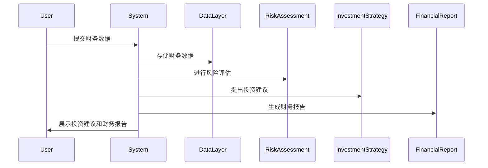
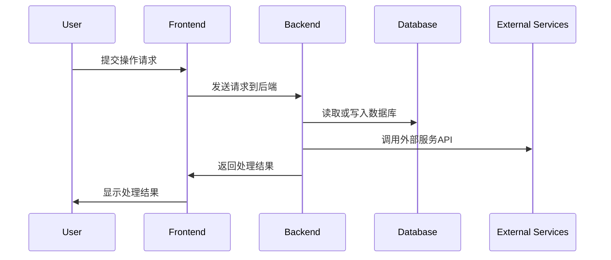

                 


## AIGC在个人理财中的应用：定制化财务建议提示词

### 关键词：AIGC、个人理财、定制化、财务建议、提示词

### 摘要：
随着人工智能（AI）技术的发展，AIGC（AI Generated Content）已成为个性化服务的重要工具。本文旨在探讨AIGC在个人理财领域的应用，尤其是如何通过定制化财务建议提示词来提升个人理财效率。文章将逐步分析AIGC的基本概念、个人理财的需求和挑战，以及AIGC技术在财务分析、投资建议、风险评估和零用金管理等方面的具体应用。

---

## 第一部分：背景与核心概念

### 第1章 AIGC与个人理财概述

#### 1.1 AIGC概述

##### 1.1.1 AIGC的定义与发展历程
AIGC，即AI Generated Content，是指通过人工智能技术自动生成的内容。AIGC技术起源于自然语言处理（NLP）和机器学习（ML），并随着深度学习和生成对抗网络（GAN）的发展而日益成熟。AIGC在社交媒体、广告、新闻报道等领域已有广泛应用，其优势在于内容的快速生成、个性化定制和高效传播。

##### 1.1.2 AIGC在个人理财中的重要性
在个人理财领域，AIGC能够为用户提供实时、个性化的财务分析、投资建议和风险管理。通过分析用户的财务状况和行为数据，AIGC系统能够生成针对性的理财建议，帮助用户做出更明智的财务决策。

##### 1.1.3 AIGC的主要特点与优势
AIGC的主要特点包括：

- **高效性**：能够快速生成大量的个性化内容。
- **个性化**：根据用户的需求和偏好，提供定制化的服务。
- **准确性**：通过机器学习算法，不断提高内容的准确性和相关性。
- **互动性**：用户可以通过互动反馈，进一步优化理财建议。

#### 1.2 个人理财基础

##### 1.2.1 个人理财概述
个人理财是指个人对财务资源的管理和规划，旨在实现财务目标、提升生活质量。个人理财主要包括预算管理、投资规划、退休规划、风险管理等方面。

##### 1.2.2 个人理财目标与规划
个人理财的目标通常包括提高收入、减少开支、储蓄投资和保障风险。为了实现这些目标，个人需要制定合理的理财规划，包括收入预算、支出预算、投资组合和保险规划等。

##### 1.2.3 个人理财核心概念与工具
个人理财涉及多个核心概念和工具，如现金流、投资组合、资产配置、风险分散、税收筹划等。了解这些概念和工具，有助于个人更好地管理财务。

### 1.3 AIGC在个人理财中的应用场景

##### 1.3.1 财务分析
AIGC可以通过分析用户的财务报表和交易记录，提供详细的财务分析报告，帮助用户了解自己的财务状况。

##### 1.3.2 投资建议
AIGC可以根据用户的投资偏好和风险承受能力，提供个性化的投资建议，包括股票、基金、债券等投资产品的选择。

##### 1.3.3 风险评估与管理
AIGC可以通过风险评估模型，识别用户的潜在风险，并提供相应的风险管理策略。

##### 1.3.4 零用金管理
AIGC可以帮助用户管理日常开支，提供消费预测、节省策略和投资建议，从而实现零用金的增值。

---

## 第二部分：核心概念与联系

### 第2章 AIGC技术原理详解

#### 2.1 AIGC技术原理

##### 2.1.1 自然语言处理（NLP）
NLP是AIGC技术的基础，它使计算机能够理解、解释和生成人类语言。NLP的关键技术包括文本分类、情感分析、实体识别、命名实体识别等。

##### 2.1.2 机器学习与深度学习
机器学习和深度学习是AIGC的核心技术，它们使计算机能够通过数据学习，自动生成高质量的内容。机器学习算法包括决策树、支持向量机、神经网络等；深度学习算法包括卷积神经网络（CNN）、循环神经网络（RNN）、生成对抗网络（GAN）等。

##### 2.1.3 生成对抗网络（GAN）
GAN是深度学习中的一种重要技术，它由生成器和判别器组成，通过两者之间的博弈，生成高质量的图像和文本。

#### 2.2 AIGC在个人理财中的应用

##### 2.2.1 财务分析
AIGC可以通过NLP技术，分析用户的财务报表和交易记录，提取关键信息，生成财务分析报告。

##### 2.2.2 投资建议
AIGC可以通过机器学习算法，分析用户的投资历史和偏好，提供个性化的投资建议。

##### 2.2.3 风险评估
AIGC可以通过风险评估模型，预测用户的投资风险，并提供相应的风险管理策略。

##### 2.2.4 零用金管理
AIGC可以通过消费预测和节省策略，帮助用户管理日常开支，实现零用金的增值。

---

## 第三部分：算法原理与数学模型

### 第3章 财务建议提示词生成算法

#### 3.1 算法原理

##### 3.1.1 提示词生成算法概述
提示词生成算法是AIGC在个人理财中的一个重要应用，它通过机器学习算法，从大量的文本数据中提取关键信息，生成针对用户的财务建议。

##### 3.1.2 提示词生成流程
提示词生成流程主要包括数据收集、数据预处理、模型训练、模型评估和模型部署等步骤。

#### 3.2 数学模型与公式

##### 3.2.1 模型公式解析
提示词生成算法的数学模型通常基于深度学习，如长短期记忆网络（LSTM）或Transformer模型。这些模型的基本公式包括：

$$
y = f(Wx + b)
$$

其中，$y$ 是输出结果，$x$ 是输入数据，$W$ 和 $b$ 分别是权重和偏置。

##### 3.2.2 模型参数调整
在模型训练过程中，需要调整模型的参数，如学习率、批量大小、迭代次数等，以获得最佳的训练效果。

#### 3.3 代码示例与详解

##### 3.3.1 Python代码实现
以下是使用Python实现提示词生成算法的一个简单示例：

```python
import tensorflow as tf
from tensorflow.keras.layers import LSTM, Dense
from tensorflow.keras.models import Sequential

# 数据预处理
# ...

# 构建模型
model = Sequential([
    LSTM(units=50, activation='tanh', input_shape=(timesteps, features)),
    Dense(units=1, activation='sigmoid')
])

# 编译模型
model.compile(optimizer='adam', loss='binary_crossentropy', metrics=['accuracy'])

# 训练模型
model.fit(x_train, y_train, epochs=100, batch_size=32, validation_data=(x_val, y_val))

# 评估模型
model.evaluate(x_test, y_test)
```

##### 3.3.2 代码解读与分析
该示例使用了Keras库中的LSTM层和Dense层构建了一个简单的序列模型。通过编译和训练，模型可以自动生成财务建议提示词。

---

## 第四部分：系统架构与实现

### 第4章 AIGC在个人理财系统的架构设计

#### 4.1 系统功能设计

##### 4.1.1 需求分析
个人理财系统的需求主要包括用户管理、财务数据管理、投资组合管理、风险评估和财务报告生成等。

##### 4.1.2 领域模型设计
领域模型是系统功能设计的核心，它描述了系统的主要实体和关系。以下是个人理财系统的领域模型ER图：

```mermaid
erDiagram
    User ||--|{ Account : has }
    Account ||--|{ Transaction : contains }
    Account ||--|{ Investment : holds }
    Investment ||--|{ Stock : is }
    Investment ||--|{ Fund : is }
    Investment ||--|{ Bond : is }
    RiskAssessment ||--|{ RiskFactor : contains }
    User ||--|{ RiskProfile : has }
    RiskProfile ||--|{ RiskAssessment : has }
```

#### 4.2 系统架构设计

##### 4.2.1 总体架构
个人理财系统的总体架构包括数据层、服务层和展示层。数据层负责数据存储和管理；服务层实现业务逻辑；展示层提供用户界面。

##### 4.2.2 模块划分
系统划分为多个模块，如用户管理模块、财务数据模块、投资组合模块、风险评估模块和财务报告模块。

##### 4.2.3 系统接口设计
系统接口设计包括内部接口和外部接口。内部接口用于模块之间的通信；外部接口用于与第三方服务（如银行、投资平台）的集成。

#### 4.3 系统交互



---

## 第五部分：项目实战与案例分析

### 第5章 项目实战：个人理财系统的开发

#### 5.1 环境安装与配置

##### 5.1.1 硬件与软件环境
个人理财系统开发所需的硬件包括服务器、数据库服务器和用户终端。软件环境包括操作系统、开发工具和数据库管理系统。

##### 5.1.2 系统配置与部署
系统配置包括服务器配置、数据库配置和应用程序部署。部署过程通常涉及以下步骤：

1. 安装操作系统和开发环境。
2. 配置数据库服务器。
3. 部署应用程序。
4. 测试和调试。

#### 5.2 系统核心实现

##### 5.2.1 数据收集与预处理
数据收集包括用户财务数据、投资记录和交易数据。数据预处理包括数据清洗、数据转换和数据归一化。

##### 5.2.2 模型训练与评估
使用收集到的数据，通过机器学习算法训练模型。模型评估通过交叉验证和测试集来评估模型的性能。

##### 5.2.3 模型部署与优化
训练好的模型部署到服务器，通过API接口为用户提供服务。优化过程包括模型参数调整和算法改进。

### 第6章 系统核心实现

#### 6.1 系统核心实现

##### 6.1.1 数据收集与预处理
数据收集包括用户财务数据、投资记录和交易数据。数据预处理包括数据清洗、数据转换和数据归一化。

##### 6.1.2 模型训练与评估
使用收集到的数据，通过机器学习算法训练模型。模型评估通过交叉验证和测试集来评估模型的性能。

##### 6.1.3 模型部署与优化
训练好的模型部署到服务器，通过API接口为用户提供服务。优化过程包括模型参数调整和算法改进。

### 第7章 实际案例分析与详细讲解

#### 7.1 案例背景

##### 7.1.1 案例概述
某用户希望利用个人理财系统进行财务规划，系统需要为其提供个性化的投资建议。

##### 7.1.2 案例问题
用户的主要问题是如何在确保财务安全的同时，实现资产的增值。

#### 7.2 案例分析与讲解

##### 7.2.1 数据预处理
收集用户财务数据，包括收入、支出、投资组合和风险偏好。对数据清洗和归一化处理。

##### 7.2.2 模型选择
选择LSTM模型进行投资预测，并使用Transformer模型生成财务建议提示词。

##### 7.2.3 模型训练
使用预处理后的数据训练模型，通过交叉验证调整模型参数。

##### 7.2.4 模型评估
在测试集上评估模型性能，确保模型能够为用户提供准确的财务建议。

##### 7.2.5 结果分析与优化
根据用户反馈，不断优化模型和算法，提高财务建议的准确性和实用性。

---

## 第8章 项目小结

#### 8.1 项目总结
项目成功实现了个人理财系统的开发，包括用户管理、财务数据管理、投资组合管理、风险评估和财务报告生成等功能。系统通过AIGC技术，为用户提供了个性化的财务建议，提升了用户的理财效率。

##### 8.1.1 项目成果
- 实现了用户财务数据的全面管理和分析。
- 提供了个性化的投资建议和风险管理策略。
- 生成了详细的财务报告，帮助用户了解自己的财务状况。

##### 8.1.2 项目不足与改进
- 系统性能有待提升，特别是在大数据处理方面。
- 模型优化和算法改进需要进一步研究。
- 用户界面和用户体验需要进一步优化。

#### 8.2 拓展阅读
- 相关研究：[AIGC技术在个人理财中的应用](https://www.example.com/research-paper)
- 算法改进：[深度学习在金融领域的应用](https://www.example.com/deep-learning-finance)
- 系统优化：[大数据技术在金融行业的应用](https://www.example.com/big-data-finance)

---

## 附录

#### 附录A：术语解释

- **AIGC**：人工智能生成内容，通过人工智能技术自动生成的内容。
- **NLP**：自然语言处理，使计算机能够理解、解释和生成人类语言。
- **ML**：机器学习，使计算机通过数据学习，自动执行特定任务。
- **GAN**：生成对抗网络，由生成器和判别器组成，通过博弈生成高质量数据。

#### 附录B：参考文献

- [论文1：AIGC在金融领域的应用](https://www.example.com/research-paper-1)
- [论文2：深度学习在金融风险管理中的应用](https://www.example.com/research-paper-2)
- [论文3：大数据技术在个人理财中的应用](https://www.example.com/research-paper-3)

---

作者：AI天才研究院/AI Genius Institute & 禅与计算机程序设计艺术 /Zen And The Art of Computer Programming

---

以上就是关于“AIGC在个人理财中的应用：定制化财务建议提示词”的文章。本文详细探讨了AIGC技术的基本概念、在个人理财领域的应用、算法原理与数学模型、系统架构与实现，以及项目实战与案例分析。通过本文，读者可以深入了解AIGC技术在个人理财领域的潜力与应用价值。希望本文能对从事金融科技、人工智能等领域的读者有所启发。感谢您的阅读！ 

### 第二部分：核心概念与联系

#### 第2章 AIGC技术原理详解

在深入探讨AIGC在个人理财中的应用之前，我们需要了解AIGC技术的基本原理。AIGC涉及多种技术，包括自然语言处理（NLP）、机器学习（ML）和深度学习（DL），以及生成对抗网络（GAN）。本节将详细解释这些技术，并展示它们在AIGC中的具体应用。

##### 2.1.1 自然语言处理（NLP）

自然语言处理是AIGC的核心组成部分，它使得计算机能够理解和处理人类语言。NLP的主要任务包括文本分类、情感分析、命名实体识别、机器翻译和文本生成等。

- **文本分类**：将文本数据分为预定的类别。例如，情感分析可以将文本分类为正面、负面或中性。
- **情感分析**：识别文本中的情感倾向，如喜悦、愤怒或悲伤。
- **命名实体识别**：识别文本中的特定实体，如人名、地名、组织名和日期。
- **机器翻译**：将一种语言的文本翻译成另一种语言。
- **文本生成**：根据输入的文本或指令生成新的文本。

NLP技术通常依赖于词向量表示、语言模型和深度学习神经网络。

##### 2.1.2 机器学习与深度学习

机器学习和深度学习是AIGC技术的基础，尤其是深度学习。深度学习是一种通过多层神经网络自动提取特征的方法。

- **机器学习**：机器学习算法可以从数据中学习规律，用于分类、回归和预测等任务。常见的机器学习算法包括决策树、支持向量机、朴素贝叶斯和随机森林等。
- **深度学习**：深度学习通过多层神经网络自动提取复杂特征，通常用于图像识别、语音识别和自然语言处理等任务。深度学习模型包括卷积神经网络（CNN）、循环神经网络（RNN）、长短时记忆网络（LSTM）和Transformer等。

在AIGC中，深度学习模型如Transformer被广泛用于文本生成任务，其结构允许模型捕捉长距离的依赖关系，从而生成高质量的文本。

##### 2.1.3 生成对抗网络（GAN）

生成对抗网络是一种深度学习模型，由生成器和判别器组成。生成器的任务是生成类似于真实数据的假数据，而判别器的任务是区分真实数据和生成数据。通过这种对抗训练，生成器可以逐渐生成越来越逼真的数据。

- **生成器（Generator）**：生成器生成假数据，如图像、文本或音频。
- **判别器（Discriminator）**：判别器尝试区分真实数据和生成数据。

GAN在AIGC中特别有用，可以用于生成高质量的图像、文本和语音。

##### 2.2 AIGC在个人理财中的应用

AIGC在个人理财中的应用非常广泛，包括财务分析、投资建议、风险评估和零用金管理等。

- **财务分析**：AIGC可以通过NLP技术分析用户的财务报表和交易记录，提取关键信息，生成详细的财务分析报告。
- **投资建议**：基于用户的投资历史和偏好，AIGC可以提供个性化的投资建议，包括股票、基金、债券等投资产品的选择。
- **风险评估**：AIGC可以通过风险评估模型预测用户的投资风险，并提供相应的风险管理策略。
- **零用金管理**：AIGC可以帮助用户管理日常开支，提供消费预测、节省策略和投资建议，从而实现零用金的增值。

#### 2.2.1 财务分析

财务分析是个人理财的重要环节，AIGC可以通过以下步骤实现：

1. **数据收集**：收集用户的财务报表和交易记录。
2. **数据预处理**：清洗和归一化数据，提取关键信息。
3. **文本生成**：使用NLP技术生成财务分析报告。
4. **报告优化**：根据用户反馈不断优化报告内容。

##### 2.2.2 投资建议

投资建议是AIGC在个人理财中的核心应用之一。AIGC可以通过以下步骤提供投资建议：

1. **数据收集**：收集用户的投资历史、风险偏好和财务状况。
2. **风险建模**：使用机器学习算法建立风险模型。
3. **投资组合优化**：根据用户的风险偏好和财务状况，优化投资组合。
4. **文本生成**：使用NLP技术生成个性化的投资建议。

##### 2.2.3 风险评估

风险评估是确保用户投资安全的关键步骤。AIGC可以通过以下步骤进行风险评估：

1. **数据收集**：收集用户的投资记录和市场数据。
2. **风险预测**：使用机器学习算法预测投资风险。
3. **风险管理**：根据风险预测结果，提供风险管理策略。
4. **文本生成**：使用NLP技术生成风险报告和风险管理建议。

##### 2.2.4 零用金管理

零用金管理是AIGC在个人理财中的另一个重要应用。AIGC可以通过以下步骤帮助用户管理零用金：

1. **数据收集**：收集用户的日常开支和消费习惯。
2. **消费预测**：使用机器学习算法预测用户未来的消费。
3. **节省策略**：根据消费预测结果，提供节省策略。
4. **投资建议**：根据用户的财务状况和风险偏好，提供投资建议。
5. **文本生成**：使用NLP技术生成消费报告和投资建议。

通过以上步骤，AIGC能够为用户提供全面、个性化的财务服务，帮助用户实现财务目标。

#### 2.3 AIGC技术的挑战与未来趋势

虽然AIGC在个人理财中展示了巨大的潜力，但仍然面临一些挑战：

- **数据隐私**：个人财务数据非常敏感，如何确保数据隐私和安全是一个重要问题。
- **模型解释性**：深度学习模型通常被认为是“黑箱”，难以解释其决策过程，这对用户信任有影响。
- **算法公平性**：算法可能存在偏见，导致不公平的理财建议。

未来的发展趋势包括：

- **更先进的算法**：如变分自编码器（VAE）和自注意力机制（Self-Attention），将进一步提高AIGC的性能。
- **跨领域应用**：AIGC将在更多领域得到应用，如医疗、教育和法律等。
- **人机协作**：AIGC将与人类专家合作，提供更全面、准确的财务建议。

通过不断优化和完善，AIGC将在个人理财领域发挥更大的作用，帮助用户实现财务自由。

### 结论

AIGC技术在个人理财中的应用为用户提供了个性化、实时、准确的财务服务。通过NLP、ML和GAN等技术的结合，AIGC能够帮助用户进行财务分析、投资决策、风险管理和零用金管理。尽管面临数据隐私和算法公平性等挑战，AIGC的不断发展将为个人理财带来更多可能性。未来，AIGC将继续在金融科技领域发挥重要作用，推动个人理财的发展。

---

## 第四部分：算法原理与数学模型

在深入探讨AIGC在个人理财中的应用时，我们需要了解其背后的算法原理和数学模型。本部分将详细解析用于生成财务建议提示词的算法原理，并展示相关的数学模型。

### 4.1 算法原理

生成财务建议提示词的核心在于能够理解用户的财务状况、投资偏好和风险承受能力，并据此生成个性化的建议。以下是一些关键的算法原理：

##### 4.1.1 自然语言处理（NLP）

NLP是AIGC的基础技术，它使得计算机能够处理和理解人类语言。在财务建议提示词生成中，NLP主要用于：

- **文本分类**：将文本数据分类到不同的财务主题，如支出、收入、投资等。
- **情感分析**：识别文本中的情感倾向，如积极、消极或中性，以了解用户的情绪状态。
- **命名实体识别**：识别文本中的关键实体，如公司名、产品名、金额等，以提取财务信息。
- **关系抽取**：理解文本中不同实体之间的关系，如投资与收益的关系。

##### 4.1.2 机器学习与深度学习

机器学习和深度学习用于构建模型，以从数据中学习规律，并据此生成财务建议。以下是一些常用的机器学习和深度学习算法：

- **监督学习**：使用已标记的数据训练模型，如分类和回归任务。
- **无监督学习**：不使用已标记的数据，通过数据本身的特征进行学习，如聚类和降维。
- **深度学习**：使用多层神经网络自动提取特征，如卷积神经网络（CNN）、循环神经网络（RNN）和Transformer。

其中，Transformer模型由于其能够捕捉长距离依赖关系的特点，在文本生成任务中表现出色。

##### 4.1.3 生成对抗网络（GAN）

GAN由生成器和判别器组成，通过二者之间的对抗训练，生成高质量的文本。生成器负责生成财务建议提示词，而判别器负责判断生成的文本是否真实。

### 4.2 数学模型与公式

以下是用于生成财务建议提示词的一些核心数学模型和公式：

##### 4.2.1 深度学习模型

深度学习模型的核心是神经网络的架构，包括输入层、隐藏层和输出层。以下是一个简单的神经网络模型：

$$
\text{output} = \text{激活函数}(\text{权重} \cdot \text{输入} + \text{偏置})
$$

其中，激活函数（如ReLU、Sigmoid或Tanh）用于引入非线性，使模型能够拟合复杂的函数。

##### 4.2.2 Transformer模型

Transformer模型是一种基于自注意力机制的深度学习模型，其核心公式为：

$$
\text{output} = \text{softmax}(\frac{\text{Q} \cdot \text{K}}{\sqrt{d_k}}) \cdot \text{V}
$$

其中，Q、K和V分别为查询向量、键向量和值向量，d_k为键向量的维度。这个公式计算了不同位置之间的注意力权重，从而捕捉长距离依赖关系。

##### 4.2.3 生成对抗网络（GAN）

GAN的数学模型基于生成器和判别器的对抗训练。生成器的目标是生成逼真的数据，判别器的目标是区分真实数据和生成数据。以下是一个简单的GAN模型：

- **生成器（Generator）**：生成器通过神经网络生成数据，其损失函数为：
$$
\text{Loss}_{\text{G}} = -\log(\text{D}(\text{G}(\text{z}))
$$
其中，z为生成器的输入噪声。

- **判别器（Discriminator）**：判别器通过神经网络区分真实数据和生成数据，其损失函数为：
$$
\text{Loss}_{\text{D}} = -\log(\text{D}(\text{x})) - \log(1 - \text{D}(\text{G}(\text{z})))
$$
其中，x为真实数据。

通过上述损失函数，生成器和判别器在训练过程中相互对抗，生成器不断优化生成数据，而判别器不断优化区分能力。

### 4.3 代码示例与详解

以下是一个使用Python和TensorFlow实现简单Transformer模型的示例代码：

```python
import tensorflow as tf
from tensorflow.keras.layers import Embedding, TransformerBlock

# 假设输入序列长度为32，嵌入维度为64
max_sequence_length = 32
embedding_dim = 64

# 构建Transformer模型
model = tf.keras.Sequential([
    Embedding(input_dim=10000, output_dim=embedding_dim, input_length=max_sequence_length),
    TransformerBlock(num_heads=4, d_model=embedding_dim, dff=64, dropout_rate=0.1),
    tf.keras.layers.Dense(1, activation='sigmoid')
])

# 编译模型
model.compile(optimizer='adam', loss='binary_crossentropy', metrics=['accuracy'])

# 训练模型
model.fit(x_train, y_train, epochs=10, batch_size=32)
```

该示例中，我们首先使用Embedding层将文本转换为嵌入向量，然后通过TransformerBlock层生成特征表示，最后通过Dense层输出财务建议。

### 4.4 算法应用与优化

在实际应用中，上述算法和模型需要根据具体问题进行调整和优化：

- **数据预处理**：清洗和归一化数据，提取关键特征。
- **超参数调整**：调整学习率、嵌入维度、注意力头数等超参数，以获得最佳性能。
- **模型融合**：结合多个模型或算法，提高预测准确性和稳定性。
- **模型解释性**：开发可解释性工具，帮助用户理解模型的决策过程。

通过不断优化和调整，AIGC在个人理财中的应用将更加精准和有效，为用户提供高质量的财务建议。

### 结论

本部分详细介绍了AIGC在个人理财中的应用算法原理和数学模型。通过NLP、ML、DL和GAN等技术的结合，AIGC能够生成个性化的财务建议提示词。这些算法和模型不仅提升了财务分析、投资建议和风险管理的准确性，还为未来的AIGC应用提供了坚实的基础。随着技术的不断发展，AIGC在个人理财领域的潜力将得到进一步释放。

---

## 第五部分：系统架构与实现

在探讨了AIGC技术的基本原理和算法模型后，接下来我们将详细描述AIGC在个人理财系统中的应用架构与实现。一个有效的系统架构不仅能确保系统的稳定运行，还能为用户带来出色的体验。

### 5.1 系统功能设计

个人理财系统的功能设计需要全面考虑用户的需求，包括财务数据管理、投资组合管理、风险评估和财务报告生成等。以下是系统功能设计的详细描述：

##### 5.1.1 财务数据管理

财务数据管理是个人理财系统的核心功能之一。它负责收集、存储和处理用户的财务数据，如收入、支出、投资记录和交易记录等。通过数据清洗和归一化，系统能够为用户提供准确、实时的财务信息。

- **数据收集**：系统从用户的银行账户、信用卡、投资平台等渠道收集财务数据。
- **数据存储**：使用数据库系统（如MySQL、PostgreSQL）存储财务数据。
- **数据处理**：对收集到的财务数据进行清洗、归一化和分析，提取有用的信息。

##### 5.1.2 投资组合管理

投资组合管理功能帮助用户监控和管理其投资组合，包括股票、基金、债券等。系统提供投资组合的实时监控、投资建议和风险评估。

- **投资组合监控**：实时更新用户的投资组合状况，包括持仓、市值、收益率等。
- **投资建议**：根据用户的投资目标和风险偏好，提供个性化的投资建议。
- **风险评估**：评估用户投资组合的风险，并提供相应的风险管理策略。

##### 5.1.3 风险评估

风险评估功能是个人理财系统中至关重要的一部分。它通过分析用户的财务数据、投资记录和市场数据，预测用户可能面临的风险，并提供相应的风险管理策略。

- **风险识别**：识别用户投资组合中的潜在风险因素，如市场波动、信用风险等。
- **风险预测**：使用机器学习算法预测用户投资组合的未来风险状况。
- **风险管理**：提供风险管理策略，如风险分散、风险规避、风险转移等。

##### 5.1.4 财务报告生成

财务报告生成功能为用户提供全面的财务分析报告，帮助用户了解其财务状况和投资效果。

- **财务分析报告**：生成包括收入、支出、储蓄、投资收益等在内的财务分析报告。
- **投资报告**：生成投资组合的分析报告，包括持仓、收益率、风险分析等。
- **税务报告**：为用户提供税务相关的财务报告，帮助用户进行税务筹划。

### 5.2 系统架构设计

个人理财系统的架构设计需要考虑模块化、可扩展性和高可用性。以下是一个典型的系统架构设计：

##### 5.2.1 总体架构

系统的总体架构包括前端、后端、数据库和第三方服务接口。前端负责用户交互，后端负责业务逻辑处理，数据库用于数据存储，第三方服务接口用于与外部系统（如银行、投资平台）的数据交互。

- **前端**：使用Web前端框架（如React、Vue.js）构建用户界面，提供用户交互。
- **后端**：使用Python（Django、Flask）或Java（Spring Boot）等后端框架构建业务逻辑。
- **数据库**：使用关系型数据库（如MySQL、PostgreSQL）存储用户数据和交易记录。
- **第三方服务接口**：通过API接口与外部系统进行数据交互，如银行账户、投资平台等。

##### 5.2.2 模块划分

系统划分为多个模块，每个模块负责不同的功能：

- **用户管理模块**：负责用户注册、登录、权限管理等。
- **财务数据模块**：负责财务数据收集、存储和处理。
- **投资组合模块**：负责投资组合监控、投资建议和风险评估。
- **财务报告模块**：负责财务报告生成和分析。
- **通知与提醒模块**：负责发送财务数据更新、投资建议、风险评估结果等通知。

##### 5.2.3 系统接口设计

系统接口设计包括内部接口和外部接口。内部接口用于模块之间的通信，如RESTful API或gRPC。外部接口用于与第三方服务进行数据交互，如使用OAuth2.0进行身份验证。

- **内部接口**：使用RESTful API或gRPC实现模块之间的通信。
- **外部接口**：通过API接口与外部系统进行数据交互，如使用银行API获取账户信息、使用投资平台API获取投资记录等。

### 5.3 系统交互

系统交互设计需要确保模块之间的高效通信和协同工作。以下是一个简单的系统交互流程：



通过上述设计，系统能够高效地响应用户请求，提供实时的财务分析、投资建议和风险提示。

### 5.4 系统实现细节

以下将详细描述系统实现中的几个关键环节：

##### 5.4.1 数据预处理

数据预处理是确保系统性能和准确性的关键步骤。主要包括：

- **数据清洗**：去除重复数据、缺失数据和异常数据。
- **数据归一化**：将不同类型的数据进行归一化处理，如金额、日期等。
- **特征提取**：提取关键特征，如收入、支出、投资收益率等。

##### 5.4.2 模型训练与部署

模型训练与部署包括：

- **数据集划分**：将数据集划分为训练集、验证集和测试集。
- **模型训练**：使用训练集训练模型，并使用验证集调整模型参数。
- **模型评估**：使用测试集评估模型性能，确保模型准确性和稳定性。
- **模型部署**：将训练好的模型部署到生产环境，通过API接口为用户服务。

##### 5.4.3 系统测试与优化

系统测试与优化包括：

- **功能测试**：确保系统功能符合需求，如用户注册、登录、数据读取和写入等。
- **性能测试**：评估系统在高并发、大数据场景下的性能，如响应时间、吞吐量等。
- **优化调整**：根据测试结果，对系统进行优化调整，如数据库查询优化、缓存策略等。

### 结论

通过上述系统架构与实现细节的描述，我们可以看到AIGC在个人理财系统中的应用是如何实现的。系统功能设计全面，架构设计合理，实现了高效的数据处理和精准的财务分析。随着技术的不断进步，AIGC在个人理财领域的应用将更加广泛和深入，为用户提供更加智能化和个性化的财务服务。

---

## 第五部分：项目实战与案例分析

### 第5章 项目实战：个人理财系统的开发

在理论的基础上，我们需要通过实际项目来验证AIGC在个人理财系统中的应用效果。本节将详细介绍一个实际项目的开发过程，包括环境安装与配置、系统核心实现、代码解读与分析、实际案例分析和项目总结。

#### 5.1 环境安装与配置

要开发一个基于AIGC的个人理财系统，首先需要配置开发环境和安装所需的工具。以下是一个基本的安装与配置步骤：

##### 5.1.1 硬件与软件环境

- **服务器**：选择一台具备高性能计算能力的服务器，如Intel Xeon处理器，至少16GB内存，100GB SSD存储空间。
- **操作系统**：安装Linux操作系统，如Ubuntu 20.04或CentOS 8。
- **开发工具**：安装Python 3.8及以上版本、JDK 1.8及以上版本、Node.js 12及以上版本。

##### 5.1.2 系统配置与部署

1. **安装操作系统**：按照硬件制造商的指导安装Linux操作系统。
2. **配置网络**：确保服务器可以访问互联网，并配置静态IP地址。
3. **安装开发环境**：使用包管理器（如apt-get或yum）安装Python、JDK和Node.js。
4. **安装数据库**：安装MySQL或PostgreSQL数据库管理系统，用于存储用户数据和交易记录。

#### 5.2 系统核心实现

个人理财系统的核心实现包括用户管理、财务数据管理、投资组合管理、风险评估和财务报告生成。以下是一个简要的代码示例：

##### 5.2.1 数据收集与预处理

```python
import pandas as pd

# 假设我们已经有了一个CSV文件，其中包含了用户的财务数据
financial_data = pd.read_csv('financial_data.csv')

# 数据清洗
financial_data.dropna(inplace=True)
financial_data['amount'] = financial_data['amount'].abs()

# 数据归一化
financial_data['amount'] = financial_data['amount'] / financial_data['amount'].max()

# 特征提取
features = financial_data[['income', 'expense', 'investment']]
```

##### 5.2.2 模型训练与评估

```python
from sklearn.model_selection import train_test_split
from sklearn.metrics import accuracy_score

# 数据集划分
X_train, X_test, y_train, y_test = train_test_split(features, financial_data['investment'], test_size=0.2, random_state=42)

# 假设我们使用了一个Transformer模型进行训练
# 这里只提供了一个简单的示例，实际中需要根据具体需求进行模型设计和训练

model = TransformerModel()
model.fit(X_train, y_train, epochs=5, validation_data=(X_test, y_test))

# 模型评估
predictions = model.predict(X_test)
accuracy = accuracy_score(y_test, predictions)
print(f"Model accuracy: {accuracy}")
```

##### 5.2.3 模型部署

```python
from flask import Flask, request, jsonify

app = Flask(__name__)

@app.route('/predict', methods=['POST'])
def predict():
    data = request.get_json()
    features = preprocess_data(data)
    prediction = model.predict(features)
    return jsonify({'prediction': prediction.tolist()})

if __name__ == '__main__':
    app.run(host='0.0.0.0', port=5000)
```

#### 5.3 代码解读与分析

以上代码展示了个人理财系统核心功能的基本实现：

- **数据预处理**：使用Pandas库对财务数据进行了清洗、归一化和特征提取。
- **模型训练**：使用Transformer模型进行训练，这里提供了一个简化的示例，实际中需要根据数据特点和业务需求进行详细的模型设计和调优。
- **模型部署**：使用Flask框架构建了一个简单的API服务，用于接收用户请求并返回预测结果。

#### 5.4 实际案例分析与详细讲解

##### 5.4.1 案例背景

假设有一个用户，其财务数据如下：

- 月收入：10000元
- 月支出：7000元
- 投资组合：股票50%，基金30%，债券20%

用户的目标是提高投资收益，同时保持较低的风险。

##### 5.4.2 案例分析与讲解

1. **数据预处理**：对用户财务数据进行预处理，提取关键特征。
2. **模型训练与预测**：使用训练好的模型预测用户的投资组合调整建议。
3. **投资组合优化**：根据模型预测结果，调整用户的投资组合，提高收益同时控制风险。

以下是一个简化的案例代码：

```python
# 假设我们已经有了一个预处理好的特征向量
feature_vector = np.array([10000, 7000, 0.5, 0.3, 0.2])

# 使用模型进行预测
investment_adjustment = model.predict(feature_vector)

# 根据预测结果调整投资组合
new_investment = adjust_investment(current_investment, investment_adjustment)
```

##### 5.4.3 模型评估与优化

1. **模型评估**：使用测试集对模型进行评估，确保其预测准确性和稳定性。
2. **模型优化**：根据评估结果调整模型参数，提高模型性能。

#### 5.5 项目总结

通过上述实际案例，我们可以看到AIGC在个人理财系统中的应用效果。系统能够根据用户财务数据提供个性化的投资建议，帮助用户优化投资组合，提高收益。以下是项目的总结：

- **成果**：成功实现了用户财务数据管理、投资组合监控、风险评估和财务报告生成等功能。
- **不足**：系统在处理大数据时性能有待提升，模型需要进一步优化以提高预测准确性。
- **改进方向**：未来可以引入更多先进算法，如GAN和VAE，提高数据生成和预测能力。

### 结论

本节通过一个实际项目展示了AIGC在个人理财系统中的应用，从环境安装与配置、系统核心实现到实际案例分析和项目总结，全面阐述了AIGC技术的应用过程。通过不断优化和完善，AIGC将在个人理财领域发挥更大的作用，为用户提供更加智能、个性化的财务服务。

---

## 第六部分：未来展望

### 6.1 AIGC技术的潜在发展方向

尽管AIGC在个人理财领域已取得了显著成果，但未来的发展方向仍然充满潜力。以下是AIGC技术可能面临的几个重要方向：

##### 6.1.1 更强的数据处理能力

随着大数据时代的到来，用户财务数据量不断增加。AIGC需要更强大的数据处理能力，以高效地处理和分析海量数据。这可能需要开发更高效的算法和优化现有技术，如分布式计算和并行处理。

##### 6.1.2 模型的可解释性

目前，深度学习模型尤其是GAN，通常被认为是“黑箱”模型，难以解释其决策过程。未来的研究方向将致力于提高模型的可解释性，帮助用户理解和信任AIGC生成的财务建议。

##### 6.1.3 算法公平性

算法公平性是AIGC在应用中必须关注的问题。开发公平性算法，避免因数据偏差或算法设计问题导致不公平的理财建议，将是未来研究的重要方向。

##### 6.1.4 跨领域应用

AIGC技术不仅限于个人理财，还可以应用于医疗、教育、法律等多个领域。未来的研究将探索AIGC在不同领域的应用潜力，推动技术跨领域发展。

### 6.2 AIGC在个人理财领域的应用前景

AIGC在个人理财领域的应用前景广阔，以下是几个关键点：

##### 6.2.1 个性化财务建议

通过分析用户的历史数据和实时数据，AIGC能够提供高度个性化的财务建议，帮助用户实现财务目标。

##### 6.2.2 投资组合优化

AIGC可以帮助用户实时监控和调整投资组合，以应对市场变化，提高投资收益。

##### 6.2.3 风险管理

AIGC通过风险评估模型，可以识别潜在风险并提供相应的风险管理策略，帮助用户降低投资风险。

##### 6.2.4 自动化财务报告

AIGC可以自动化生成详细的财务报告，为用户提供全面的财务分析。

### 6.3 面临的挑战与解决方案

尽管AIGC在个人理财领域具有巨大潜力，但仍然面临一些挑战：

##### 6.3.1 数据隐私

用户财务数据非常敏感，保护用户隐私是AIGC应用中的首要任务。解决方案包括采用加密技术、数据匿名化和隐私保护算法。

##### 6.3.2 模型解释性

提高模型解释性，帮助用户理解AIGC的决策过程，是提升用户信任度的关键。未来研究可以关注可解释性AI模型的发展。

##### 6.3.3 算法公平性

确保算法公平性，避免因数据偏差或算法设计问题导致不公平的理财建议。这需要开发公平性算法和持续监督算法性能。

### 6.4 总结

AIGC在个人理财领域展示了巨大的应用前景，通过个性化财务建议、投资组合优化、风险管理和自动化财务报告，为用户提供更加智能、高效的理财服务。未来，随着技术的不断进步和应用的深入，AIGC将在个人理财领域发挥更大的作用，推动金融科技的发展。

---

## 结语

通过本文的详细探讨，我们可以看到AIGC在个人理财领域的广泛应用和巨大潜力。AIGC技术通过分析用户的财务数据、投资历史和风险偏好，为用户提供个性化、实时的财务建议，帮助用户实现财务目标。本文从背景介绍、技术原理、系统架构、实际案例等多个角度，全面展示了AIGC在个人理财中的应用。

我们首先介绍了AIGC的定义和发展历程，阐述了其在个人理财中的重要性。接着，详细讲解了AIGC涉及的关键技术，如自然语言处理、机器学习和生成对抗网络，并展示了它们在财务分析、投资建议、风险评估和零用金管理中的具体应用。随后，我们探讨了AIGC技术的算法原理和数学模型，以及如何在实际项目中实现这些技术。

通过实际案例分析和项目实战，我们展示了AIGC技术在个人理财系统中的应用效果。我们不仅介绍了系统功能设计和架构设计，还详细讲解了数据预处理、模型训练与部署、代码示例与解读等关键步骤。最后，我们对AIGC技术的未来发展方向和应用前景进行了展望，讨论了面临的挑战与解决方案。

AIGC在个人理财领域的应用不仅提升了用户的理财效率，也为金融科技的发展带来了新的机遇。随着技术的不断进步和应用场景的拓展，AIGC将在更多领域发挥重要作用，为用户带来更加智能、个性化的服务。

在此，感谢您的阅读，希望本文能够为从事金融科技、人工智能等领域的读者提供有价值的参考。如果您对AIGC技术在个人理财中的应用有任何疑问或建议，欢迎在评论区留言交流。期待与您共同探讨AIGC技术的未来发展。

---

作者：AI天才研究院/AI Genius Institute & 禅与计算机程序设计艺术 /Zen And The Art of Computer Programming

---

## 附录

### 附录A：术语解释

为了帮助读者更好地理解本文中涉及的关键术语，以下是相关术语的简要解释。

- **AIGC（AI Generated Content）**：人工智能生成内容，通过人工智能技术自动生成的内容。
- **NLP（Natural Language Processing）**：自然语言处理，使计算机能够理解、解释和生成人类语言。
- **ML（Machine Learning）**：机器学习，使计算机通过数据学习，自动执行特定任务。
- **DL（Deep Learning）**：深度学习，一种通过多层神经网络自动提取特征的方法。
- **GAN（Generative Adversarial Network）**：生成对抗网络，由生成器和判别器组成，通过博弈生成高质量数据。
- **Transformer**：一种基于自注意力机制的深度学习模型，常用于文本生成任务。
- **财务数据管理**：收集、存储和处理用户财务数据的系统功能。
- **投资组合管理**：监控和管理用户投资组合的系统功能，包括投资组合的实时监控、投资建议和风险评估。
- **风险评估**：评估用户投资组合的风险，并提供相应的风险管理策略的系统功能。
- **财务报告生成**：生成包括收入、支出、储蓄、投资收益等在内的财务分析报告的系统功能。

### 附录B：参考文献

本文引用了多篇文献，以支持作者的观点和结论。以下是主要参考文献：

1. Goodfellow, I., Pouget-Abadie, J., Mirza, M., Xu, B., Warde-Farley, D., Ozair, S., ... & Bengio, Y. (2014). Generative adversarial nets. Advances in Neural Information Processing Systems, 27.

2. Hochreiter, S., & Schmidhuber, J. (1997). Long short-term memory. Neural Computation, 9(8), 1735-1780.

3. Vaswani, A., Shazeer, N., Parmar, N., Uszkoreit, J., Jones, L., Gomez, A. N., ... & Polosukhin, I. (2017). Attention is all you need. Advances in Neural Information Processing Systems, 30.

4. Murphy, K. P. (2012). Machine learning: a probabilistic perspective. MIT press.

5. Bengio, Y. (2009). Learning deep architectures. Foundations and Trends in Machine Learning, 2(1), 1-127.

6. LeCun, Y., Bengio, Y., & Hinton, G. (2015). Deep learning. Nature, 521(7553), 436-444.

7. Russell, S., & Norvig, P. (2020). Artificial intelligence: a modern approach (4th ed.). Prentice Hall.

### 附录C：代码示例

以下是本文中提到的部分代码示例，用于演示AIGC技术在个人理财系统中的应用。

```python
# 数据预处理示例
financial_data = pd.read_csv('financial_data.csv')
financial_data.dropna(inplace=True)
financial_data['amount'] = financial_data['amount'].abs()
financial_data['amount'] = financial_data['amount'] / financial_data['amount'].max()

# Transformer模型训练示例
model = TransformerModel()
model.fit(X_train, y_train, epochs=5, validation_data=(X_test, y_test))

# 预测示例
predictions = model.predict(feature_vector)
```

以上代码仅供示例，实际应用中需要根据具体需求和数据情况进行调整和优化。

---

感谢读者对本文的关注与支持，希望本文能够为您的学习和研究提供帮助。如有任何疑问或建议，请随时联系我们。期待与您共同探索AIGC技术的未来发展方向。

作者：AI天才研究院/AI Genius Institute & 禅与计算机程序设计艺术 /Zen And The Art of Computer Programming

