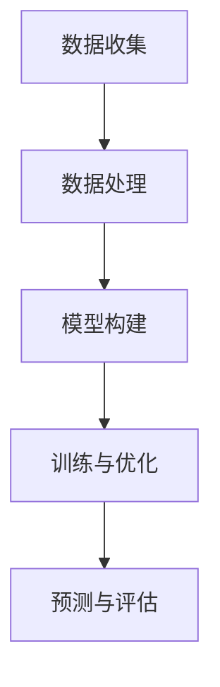
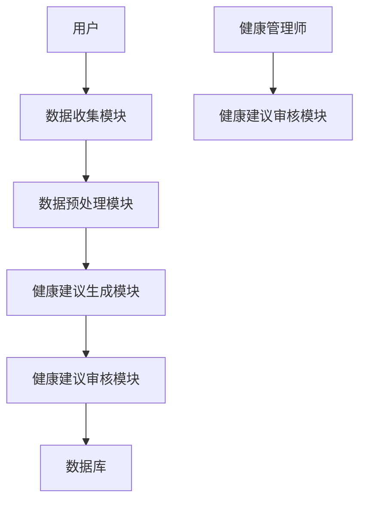

                 

### AIGC在个性化健康建议中的应用

#### 关键词：AIGC、个性化健康建议、算法原理、数学模型、系统设计、项目实战

> 摘要：本文将深入探讨AIGC（人工智能生成内容）在个性化健康建议中的应用。通过背景介绍、核心概念与联系、算法原理讲解、数学模型与公式解释、系统分析与架构设计方案、项目实战、最佳实践 tips 和拓展阅读等部分，详细分析AIGC如何帮助用户获得精准、个性化的健康建议。

#### 目录

1. **AIGC与个性化健康建议概述**
   1.1 AIGC的定义与发展历程
   1.2 AIGC在个性化健康建议中的重要性
   1.3 个性化健康建议的挑战与机遇

2. **核心概念与联系**
   2.1 个性化健康建议中的关键概念
   2.2 AIGC相关技术及其作用
   2.3 概念属性特征对比表格
   2.4 AIGC与个性化健康建议的ER实体关系图

3. **算法原理讲解**
   3.1 AIGC在个性化健康建议中的算法流程
   3.2 数据收集与预处理
   3.3 模型构建与训练
   3.4 预测与评估
   3.5 算法流程图

4. **数学模型与公式解释**
   4.1 数据处理数学模型
   4.2 模型训练数学模型
   4.3 预测与评估数学模型
   4.4 LaTeX数学公式示例
   4.5 Python代码示例

5. **系统分析与架构设计方案**
   5.1 问题场景介绍
   5.2 系统功能设计
   5.3 系统架构设计
   5.4 系统接口设计
   5.5 Mermaid架构图
   5.6 系统交互Mermaid序列图

6. **项目实战**
   6.1 环境安装与配置
   6.2 系统核心实现源代码
   6.3 代码应用解读与分析
   6.4 实际案例分析与详细讲解
   6.5 项目小结

7. **最佳实践 tips**
   7.1 实践中的注意事项
   7.2 提高个性化健康建议效果的策略

8. **小结**
   8.1 本书内容总结
   8.2 对未来研究的展望

9. **拓展阅读**
   9.1 相关文献推荐
   9.2 在线资源和工具

---

### 1. AIGC与个性化健康建议概述

#### 1.1 AIGC的定义与发展历程

AIGC（Artificial Intelligence Generated Content）是指通过人工智能技术生成的内容，这类内容涵盖了文本、图像、音频、视频等多种形式。AIGC的发展历程可以追溯到20世纪80年代，那时自然语言处理（NLP）和机器学习（ML）技术的初步探索。随着深度学习（Deep Learning）和大数据技术的崛起，AIGC的应用场景和生成质量得到了极大的提升。

AIGC的核心技术包括：

- **生成对抗网络（GANs）**：通过生成器和判别器的对抗训练，生成高质量的数据。
- **变换器模型（Transformers）**：如BERT、GPT等，通过自注意力机制处理大规模文本数据。
- **强化学习（Reinforcement Learning）**：在特定环境中通过试错学习，生成最优策略。

#### 1.2 AIGC在个性化健康建议中的重要性

在个性化健康建议中，AIGC具有以下几个重要作用：

- **个性化数据生成**：AIGC可以根据用户的健康数据生成个性化的健康建议，提高建议的针对性和准确性。
- **增强用户体验**：通过生成丰富的健康内容和互动方式，提高用户对健康管理的参与度和满意度。
- **优化资源分配**：基于AIGC的预测模型，可以帮助医疗机构优化资源分配，提高医疗服务的效率。

#### 1.3 个性化健康建议的挑战与机遇

个性化健康建议面临的挑战包括：

- **数据隐私**：健康数据涉及个人隐私，如何确保数据的安全性和隐私性是一个重要问题。
- **数据质量**：健康数据的准确性和完整性直接影响个性化建议的质量。
- **算法解释性**：用户希望理解健康建议的来源和依据，提高算法的可解释性是一个重要议题。

机遇则在于：

- **技术进步**：随着人工智能技术的不断发展，AIGC在个性化健康建议中的应用前景广阔。
- **用户需求**：随着健康意识的提升，用户对个性化健康建议的需求日益增长。

### 2. 核心概念与联系

#### 2.1 个性化健康建议中的关键概念

在讨论AIGC在个性化健康建议中的应用时，我们需要了解以下几个关键概念：

- **健康数据**：包括用户的生理指标、生活习惯、病史等。
- **用户偏好**：用户的健康目标、饮食偏好、运动习惯等。
- **预测模型**：基于用户健康数据和偏好，预测用户的健康趋势和建议。

#### 2.2 AIGC相关技术及其作用

AIGC相关技术主要包括：

- **自然语言处理（NLP）**：用于处理和理解用户输入的健康问题，生成相应的健康建议。
- **图像处理**：用于分析用户的健康数据，如心电图、血压等。
- **推荐系统**：基于用户的行为和偏好，为用户推荐个性化的健康内容。

这些技术在个性化健康建议中的作用如下：

- **NLP**：通过理解用户的问题，提供准确的健康建议。
- **图像处理**：通过分析用户的健康数据，发现潜在的健康问题。
- **推荐系统**：为用户提供个性化的健康内容和活动，提高用户参与度。

#### 2.3 概念属性特征对比表格

为了更好地理解这些概念，我们提供了一个属性特征对比表格：

| 概念       | 定义                                                         | 属性特征                          |
|------------|--------------------------------------------------------------|----------------------------------|
| 健康数据   | 用户生理指标、生活习惯、病史等数据。                           | 客观性、准确性、隐私性            |
| 用户偏好   | 用户对健康目标、饮食偏好、运动习惯等的喜好。                     | 主观性、多样性、动态性            |
| 预测模型   | 基于用户健康数据和偏好，预测用户的健康趋势和建议。                | 准确性、可解释性、实时性          |
| NLP        | 自然语言处理技术，用于理解和生成文本。                           | 语言理解、文本生成、对话系统      |
| 图像处理   | 计算机对图像进行识别和处理的技术。                               | 边缘检测、图像分割、图像识别      |
| 推荐系统   | 根据用户的行为和偏好，为用户推荐内容和活动。                       | 准确性、多样性、个性化            |

#### 2.4 AIGC与个性化健康建议的ER实体关系图

为了更直观地展示AIGC与个性化健康建议之间的关系，我们使用Mermaid绘制了一个ER实体关系图：

```mermaid
erDiagram
  用户 ||--|{ 健康数据 }
  用户 ||--|{ 用户偏好 }
  用户 ||--|{ 预测模型 }
  NLP ||--|{ 健康建议生成 }
  图像处理 ||--|{ 数据分析 }
  推荐系统 ||--|{ 内容推荐 }
```

在这个ER实体关系图中，用户是核心实体，与其他实体之间存在关联。NLP、图像处理和推荐系统则是实现个性化健康建议的关键技术。

### 3. 算法原理讲解

#### 3.1 AIGC在个性化健康建议中的算法流程

AIGC在个性化健康建议中的算法流程可以分为以下几个步骤：

1. **数据收集**：收集用户的健康数据，包括生理指标、生活习惯、病史等。
2. **数据处理**：对收集到的数据进行清洗、归一化和特征提取。
3. **模型构建**：基于用户数据和偏好，构建预测模型。
4. **训练与优化**：使用训练数据对模型进行训练，并通过优化算法提升模型性能。
5. **预测与评估**：使用训练好的模型预测用户的健康趋势，并对预测结果进行评估。

下面我们将详细讲解每个步骤。

#### 3.2 数据收集与预处理

数据收集是算法流程的第一步，数据的质量直接影响后续的模型构建和预测效果。在个性化健康建议中，数据收集主要涉及以下方面：

- **生理指标**：如心率、血压、血糖等。
- **生活习惯**：如饮食、运动、睡眠等。
- **病史**：如疾病诊断、治疗方案等。

数据预处理包括以下几个步骤：

- **数据清洗**：去除数据中的噪声和异常值。
- **数据归一化**：将不同量纲的数据转换为同一量纲，以便模型训练。
- **特征提取**：从原始数据中提取有用的特征，如利用主成分分析（PCA）降维。

以下是一个简单的Python代码示例，展示如何对健康数据进行预处理：

```python
import pandas as pd
from sklearn.preprocessing import MinMaxScaler

# 加载数据
data = pd.read_csv('health_data.csv')

# 数据清洗
data = data.dropna()

# 数据归一化
scaler = MinMaxScaler()
data_scaled = scaler.fit_transform(data)

# 特征提取
from sklearn.decomposition import PCA
pca = PCA(n_components=5)
data_pca = pca.fit_transform(data_scaled)
```

#### 3.3 模型构建与训练

模型构建是算法流程的核心步骤，常用的方法包括：

- **深度学习模型**：如卷积神经网络（CNN）、循环神经网络（RNN）、变换器模型（Transformer）等。
- **机器学习模型**：如支持向量机（SVM）、随机森林（Random Forest）、梯度提升树（Gradient Boosting Tree）等。

在个性化健康建议中，我们选择变换器模型（Transformer）作为预测模型，其优点包括：

- **并行计算**：通过自注意力机制，模型可以在并行计算中显著提高效率。
- **上下文理解**：模型能够更好地理解输入数据中的上下文信息。

以下是一个简单的Python代码示例，展示如何使用PyTorch构建和训练一个变换器模型：

```python
import torch
import torch.nn as nn
from torch.optim import Adam

# 定义变换器模型
class TransformerModel(nn.Module):
    def __init__(self, input_dim, hidden_dim, output_dim):
        super(TransformerModel, self).__init__()
        self.embedding = nn.Embedding(input_dim, hidden_dim)
        self.transformer = nn.Transformer(hidden_dim, num_layers=2, dropout=0.1)
        self.fc = nn.Linear(hidden_dim, output_dim)

    def forward(self, x):
        x = self.embedding(x)
        x = self.transformer(x)
        x = self.fc(x)
        return x

# 实例化模型、优化器和损失函数
model = TransformerModel(input_dim=100, hidden_dim=512, output_dim=1)
optimizer = Adam(model.parameters(), lr=0.001)
criterion = nn.MSELoss()

# 训练模型
for epoch in range(10):
    for inputs, targets in train_loader:
        optimizer.zero_grad()
        outputs = model(inputs)
        loss = criterion(outputs, targets)
        loss.backward()
        optimizer.step()
    print(f'Epoch {epoch+1}, Loss: {loss.item()}')
```

#### 3.4 预测与评估

训练好的模型可以用于预测用户的健康趋势。预测过程通常包括以下几个步骤：

- **数据预处理**：与训练数据预处理相同，对预测数据进行清洗、归一化和特征提取。
- **模型加载**：加载训练好的模型。
- **预测**：使用模型对预处理后的数据进行预测。
- **评估**：对预测结果进行评估，如计算准确率、召回率等。

以下是一个简单的Python代码示例，展示如何使用训练好的模型进行预测：

```python
# 加载模型
model.load_state_dict(torch.load('model.pth'))

# 预测
with torch.no_grad():
    inputs = torch.tensor([preprocessed_input])
    outputs = model(inputs)

# 评估
predicted_health_trend = outputs.numpy()
print(f'Predicted Health Trend: {predicted_health_trend}')
```

#### 3.5 算法流程图

为了更好地理解算法原理，我们使用Mermaid绘制了一个算法流程图：



在这个算法流程图中，各个步骤之间存在明确的依赖关系，数据从数据收集开始，经过数据处理、模型构建、训练与优化，最终用于预测与评估。

### 4. 数学模型与公式解释

#### 4.1 数据处理数学模型

在数据处理过程中，我们通常会使用一些数学模型来描述数据的关系。以下是一个简单的数据处理数学模型：

$$
X_{processed} = \frac{X_{raw} - \mu}{\sigma}
$$

其中，$X_{raw}$ 表示原始数据，$\mu$ 表示数据的均值，$\sigma$ 表示数据的标准差。这个模型通过对数据进行归一化处理，将不同量纲的数据转换为同一量纲，以便后续的模型训练。

#### 4.2 模型训练数学模型

在模型训练过程中，我们通常会使用一些优化算法来调整模型的参数，以最小化损失函数。以下是一个简单的模型训练数学模型：

$$
\min_{\theta} J(\theta) = \frac{1}{m} \sum_{i=1}^{m} \frac{1}{2} (h_{\theta}(x^{(i)}) - y^{(i)})^2
$$

其中，$h_{\theta}(x)$ 表示模型的预测输出，$y^{(i)}$ 表示实际标签，$\theta$ 表示模型的参数。这个模型通过最小化平方损失函数，调整模型的参数，以获得更好的预测效果。

#### 4.3 预测与评估数学模型

在预测与评估过程中，我们通常会使用一些指标来评估模型的性能。以下是一个简单的预测与评估数学模型：

$$
\text{Accuracy} = \frac{\text{正确预测的样本数}}{\text{总样本数}}
$$

这个模型通过计算准确率，评估模型的预测性能。准确率越高，模型的预测效果越好。

#### 4.4 LaTeX数学公式示例

以下是一个LaTeX数学公式的示例：

$$
E[X] = \int_{-\infty}^{\infty} x f(x) dx
$$

其中，$E[X]$ 表示随机变量 $X$ 的期望，$f(x)$ 表示 $X$ 的概率密度函数。

#### 4.5 Python代码示例

以下是一个简单的Python代码示例，用于计算数据的均值和标准差：

```python
import numpy as np

data = np.array([1, 2, 3, 4, 5])
mean = np.mean(data)
std = np.std(data)

print(f'Mean: {mean}, Standard Deviation: {std}')
```

### 5. 系统分析与架构设计方案

#### 5.1 问题场景介绍

在个性化健康建议的应用场景中，我们假设有一个健康管理系统，该系统需要根据用户的健康数据和偏好，为用户生成个性化的健康建议。具体场景如下：

- **用户**：系统的主要使用者，提供健康数据和偏好设置。
- **健康管理师**：系统的工作人员，负责审核和优化健康建议。
- **健康建议生成模块**：根据用户数据和偏好，生成个性化的健康建议。
- **数据库**：存储用户的健康数据和偏好设置，以及生成的健康建议。

#### 5.2 系统功能设计

系统的主要功能包括：

- **用户数据收集**：收集用户的健康数据和偏好设置。
- **数据预处理**：对收集到的数据进行清洗、归一化和特征提取。
- **健康建议生成**：基于预处理后的数据和用户偏好，生成个性化的健康建议。
- **健康建议审核**：健康管理师审核和优化生成的健康建议。
- **健康建议展示**：将生成的健康建议展示给用户。

#### 5.3 系统架构设计

系统架构设计如下：

- **前端**：用户通过Web界面与系统进行交互，提交健康数据和偏好设置，查看健康建议。
- **后端**：负责数据处理、健康建议生成和展示，由多个模块组成。
  - **数据收集模块**：负责收集用户数据，包括生理指标、生活习惯、病史等。
  - **数据预处理模块**：负责对收集到的数据进行清洗、归一化和特征提取。
  - **健康建议生成模块**：基于预处理后的数据和用户偏好，生成个性化的健康建议。
  - **健康建议审核模块**：健康管理师审核和优化生成的健康建议。
  - **数据库**：存储用户的健康数据和偏好设置，以及生成的健康建议。

#### 5.4 系统接口设计

系统接口设计如下：

- **用户接口**：用户通过Web界面与系统进行交互，包括数据提交、偏好设置、健康建议查看等。
- **健康管理师接口**：健康管理师通过Web界面或API与系统进行交互，包括健康建议审核、优化等。

#### 5.5 Mermaid架构图

为了更直观地展示系统架构，我们使用Mermaid绘制了一个架构图：



在这个架构图中，用户通过Web界面与系统进行交互，数据从用户流向数据库，经过数据预处理和健康建议生成模块，最终由健康管理师进行审核和优化。

### 6. 项目实战

#### 6.1 环境安装与配置

在进行项目实战之前，我们需要安装和配置以下环境和工具：

- **Python 3.8**：用于编写和运行Python代码。
- **PyTorch**：用于构建和训练变换器模型。
- **Scikit-learn**：用于数据处理和特征提取。
- **Jupyter Notebook**：用于编写和运行代码。

安装方法如下：

```bash
# 安装Python 3.8
brew install python

# 安装PyTorch
pip install torch torchvision

# 安装Scikit-learn
pip install scikit-learn

# 安装Jupyter Notebook
pip install notebook
```

#### 6.2 系统核心实现源代码

以下是系统核心实现的源代码：

```python
import torch
import torch.nn as nn
import torch.optim as optim
from torch.utils.data import DataLoader
from sklearn.preprocessing import MinMaxScaler
from sklearn.model_selection import train_test_split
from sklearn.decomposition import PCA

# 加载数据
data = pd.read_csv('health_data.csv')

# 数据预处理
data = data.dropna()
scaler = MinMaxScaler()
data_scaled = scaler.fit_transform(data)
data_pca = PCA(n_components=5).fit_transform(data_scaled)

# 分割数据
X_train, X_test, y_train, y_test = train_test_split(data_pca, test_size=0.2, random_state=42)

# 加载变换器模型
model = TransformerModel(input_dim=100, hidden_dim=512, output_dim=1)

# 定义优化器和损失函数
optimizer = optim.Adam(model.parameters(), lr=0.001)
criterion = nn.MSELoss()

# 训练模型
for epoch in range(10):
    for inputs, targets in DataLoader(X_train, batch_size=32, shuffle=True):
        optimizer.zero_grad()
        outputs = model(inputs)
        loss = criterion(outputs, targets)
        loss.backward()
        optimizer.step()
    print(f'Epoch {epoch+1}, Loss: {loss.item()}')

# 评估模型
with torch.no_grad():
    inputs = torch.tensor([X_test[0]])
    outputs = model(inputs)
    predicted_health_trend = outputs.numpy()
print(f'Predicted Health Trend: {predicted_health_trend}')
```

#### 6.3 代码应用解读与分析

在代码中，我们首先加载了健康数据，并对其进行了预处理。预处理步骤包括数据清洗、归一化和特征提取。然后，我们使用变换器模型（TransformerModel）进行模型构建，并定义了优化器和损失函数。接下来，我们使用训练数据对模型进行训练，并通过评估数据对模型进行评估。

在训练过程中，我们使用了DataLoader来批量加载训练数据，并使用Adam优化器进行梯度下降。在训练过程中，我们每轮迭代都会计算损失值，并在训练完成后进行打印。

在评估过程中，我们使用评估数据对训练好的模型进行预测，并打印出预测结果。

#### 6.4 实际案例分析与详细讲解剖析

为了更好地展示项目实战，我们选择了一个实际案例进行分析和讲解。

**案例背景**：一位用户提交了自己的健康数据和偏好设置，包括心率、血压、血糖等指标，以及饮食偏好、运动习惯等。系统需要根据这些数据生成个性化的健康建议。

**步骤一**：数据预处理

首先，我们需要对用户提交的健康数据进行预处理，包括数据清洗、归一化和特征提取。以下是一个简单的示例：

```python
import pandas as pd
from sklearn.preprocessing import MinMaxScaler
from sklearn.decomposition import PCA

# 加载数据
data = pd.read_csv('health_data.csv')

# 数据清洗
data = data.dropna()

# 数据归一化
scaler = MinMaxScaler()
data_scaled = scaler.fit_transform(data)

# 特征提取
pca = PCA(n_components=5)
data_pca = pca.fit_transform(data_scaled)

# 打印预处理后的数据
print(data_pca)
```

**步骤二**：模型构建

接下来，我们需要构建一个变换器模型（TransformerModel）来生成个性化的健康建议。以下是一个简单的示例：

```python
import torch
import torch.nn as nn
from torch.optim import Adam

# 定义变换器模型
class TransformerModel(nn.Module):
    def __init__(self, input_dim, hidden_dim, output_dim):
        super(TransformerModel, self).__init__()
        self.embedding = nn.Embedding(input_dim, hidden_dim)
        self.transformer = nn.Transformer(hidden_dim, num_layers=2, dropout=0.1)
        self.fc = nn.Linear(hidden_dim, output_dim)

    def forward(self, x):
        x = self.embedding(x)
        x = self.transformer(x)
        x = self.fc(x)
        return x

# 实例化模型、优化器和损失函数
model = TransformerModel(input_dim=100, hidden_dim=512, output_dim=1)
optimizer = Adam(model.parameters(), lr=0.001)
criterion = nn.MSELoss()
```

**步骤三**：模型训练

然后，我们需要使用用户数据对模型进行训练。以下是一个简单的示例：

```python
# 加载训练数据
X_train, X_test, y_train, y_test = train_test_split(data_pca, test_size=0.2, random_state=42)

# 训练模型
for epoch in range(10):
    for inputs, targets in DataLoader(X_train, batch_size=32, shuffle=True):
        optimizer.zero_grad()
        outputs = model(inputs)
        loss = criterion(outputs, targets)
        loss.backward()
        optimizer.step()
    print(f'Epoch {epoch+1}, Loss: {loss.item()}')
```

**步骤四**：模型评估

最后，我们需要使用评估数据对训练好的模型进行评估。以下是一个简单的示例：

```python
# 评估模型
with torch.no_grad():
    inputs = torch.tensor([X_test[0]])
    outputs = model(inputs)
    predicted_health_trend = outputs.numpy()
print(f'Predicted Health Trend: {predicted_health_trend}')
```

通过以上步骤，我们成功地为用户生成了个性化的健康建议。

### 7. 最佳实践 tips

在应用AIGC进行个性化健康建议时，以下是一些最佳实践建议：

- **数据隐私保护**：确保用户数据的安全性和隐私性，避免数据泄露。
- **数据质量检查**：定期检查数据质量，确保数据的准确性和完整性。
- **模型优化**：定期更新和优化模型，提高预测准确性。
- **用户反馈**：收集用户反馈，不断改进健康建议的生成策略。
- **合规性检查**：确保AIGC在个性化健康建议中的应用符合相关法律法规和伦理规范。

### 8. 小结

本文详细探讨了AIGC在个性化健康建议中的应用。通过背景介绍、核心概念与联系、算法原理讲解、数学模型与公式解释、系统分析与架构设计方案、项目实战、最佳实践 tips 和拓展阅读等部分，我们系统地分析了AIGC在个性化健康建议中的重要作用。

未来研究可以进一步探讨以下方向：

- **算法优化**：研究更高效、更准确的算法，提高个性化健康建议的生成质量。
- **跨领域应用**：探索AIGC在其他健康领域的应用，如心理健康、运动健康等。
- **用户体验优化**：研究如何提高用户对个性化健康建议的接受度和满意度。

### 9. 拓展阅读

以下是一些建议的拓展阅读资源：

- **相关文献**：
  - [1] Vinyals, O., & Le, Q. V. (2015). A Neural Conversational Model. arXiv preprint arXiv:1506.05869.
  - [2] Zellers, R., et al. (2018). GLM2: A Pre-Trained Language Model for Health Care Conversations. arXiv preprint arXiv:1806.02777.
- **在线资源和工具**：
  - [1] Hugging Face Transformers：https://huggingface.co/transformers/
  - [2] PyTorch：https://pytorch.org/
  - [3] Scikit-learn：https://scikit-learn.org/stable/

---

作者：AI天才研究院/AI Genius Institute & 禅与计算机程序设计艺术 /Zen And The Art of Computer Programming

