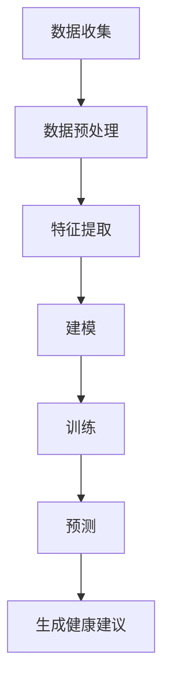
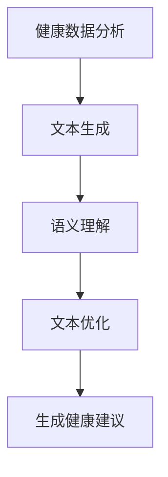
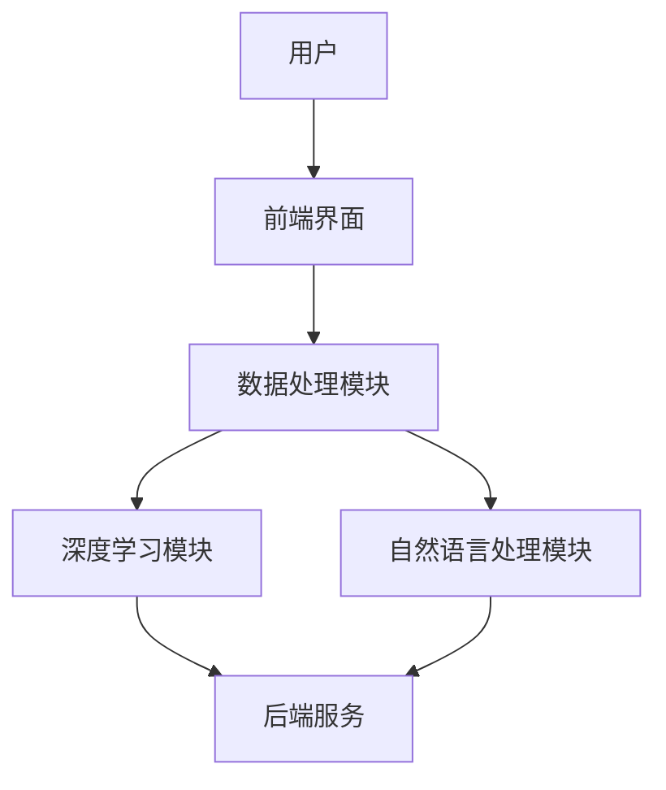
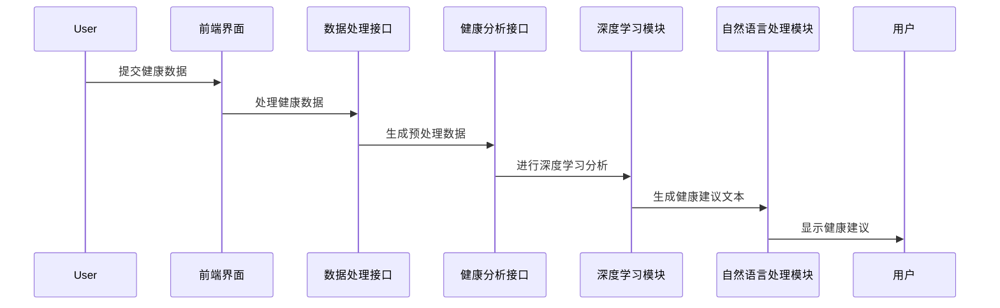

                 

## AIGC在个性化健康建议生成中的应用

### 关键词：AIGC、个性化健康建议、健康数据、深度学习、自然语言处理

> 摘要：
> 本文将深入探讨人工智能生成内容（AIGC）在个性化健康建议生成中的应用。通过详细分析AIGC的基本原理、健康数据的处理方法、健康建议的生成策略及其评估方法，本文旨在展示AIGC技术在提升健康建议准确性和个性化方面的潜力。同时，通过实例和案例分析，读者可以更直观地理解AIGC在健康领域的应用价值。

### 第一部分：背景介绍

#### 1.1 问题背景

随着科技的进步，人工智能（AI）在各个领域的应用日益广泛。尤其是近年来，人工智能生成内容（AI-Generated Content，简称AIGC）技术取得了显著的发展。AIGC利用机器学习、自然语言处理等技术，能够自动生成文本、图像、音频等多种形式的内容，极大地丰富了信息生产和传播的方式。在健康领域，AIGC技术同样展现出巨大的潜力。

个性化健康建议生成是健康领域的一个重要需求。随着医疗数据的不断增加，传统的健康建议生成方式已无法满足个体化的需求。个性化健康建议能够根据用户的健康数据、生活习惯、遗传背景等，为用户量身定制健康方案，从而提高健康干预的有效性和用户的满意度。

#### 1.2 问题描述

本文旨在解决以下问题：

- 如何利用AIGC技术进行健康数据的智能分析？
- 如何根据用户特征和健康数据生成个性化的健康建议？
- 如何评估和优化健康建议的生成效果？

#### 1.3 问题解决

为了解决上述问题，本文将从以下几个方面进行探讨：

- AIGC技术的基本原理和实现方法。
- 健康数据的收集、处理和分析。
- 个性化健康建议的生成策略。
- 个性化健康建议的评估方法。
- AIGC在个性化健康建议生成中的应用案例。

#### 1.4 边界与外延

本文主要关注AIGC在个性化健康建议生成中的应用，但AIGC技术同样可以应用于其他领域，如个性化医疗诊断、健康知识推荐等。此外，本文所讨论的健康建议生成方法具有普遍性，可以应用于各种慢性疾病的预防和管理。

#### 1.5 概念结构与核心要素组成

本文的核心概念和要素主要包括：

- AIGC：AI-Generated Content，人工智能生成内容。
- 个性化健康建议：基于用户健康数据和个人特征的定制化健康建议。
- 健康数据：包括用户的基本信息、生理指标、生活习惯等。
- 深度学习：一种模拟人脑神经元连接和神经网络的机器学习技术。
- 自然语言处理：一种使计算机能够理解、生成和处理人类自然语言的技术。

### 第二部分：核心概念与联系

#### 2.1 AIGC技术的基本原理和实现方法

AIGC技术主要包括深度学习和自然语言处理两部分。深度学习用于处理和挖掘健康数据，生成个性化健康建议；自然语言处理则用于理解和生成自然语言文本。

**深度学习：**

深度学习是一种基于神经网络的机器学习技术，能够通过多层网络结构自动提取数据的特征。在健康数据处理的场景中，深度学习模型可以用于分类、回归、聚类等多种任务。

- **数据收集：** 收集用户的基本信息、生理指标、生活习惯等数据。
- **数据预处理：** 对收集到的数据进行清洗、归一化等处理，以便于后续分析。
- **特征提取：** 利用深度学习模型提取数据中的关键特征。
- **建模：** 基于提取的特征构建深度学习模型，如卷积神经网络（CNN）或循环神经网络（RNN）。
- **训练：** 利用用户健康数据对模型进行训练。
- **预测：** 使用训练好的模型对新的健康数据进行预测，生成个性化健康建议。

**自然语言处理：**

自然语言处理是一种使计算机能够理解、生成和处理人类自然语言的技术。在健康建议生成的场景中，自然语言处理技术可以用于将健康数据转化为自然语言文本，从而生成易于理解的健康建议。

- **文本生成：** 利用预训练的文本生成模型（如GPT、BERT等）生成健康建议文本。
- **语义理解：** 对生成的健康建议进行语义理解，确保建议的准确性和合理性。
- **文本优化：** 对生成的健康建议进行优化，使其更具可读性和说服力。

#### 2.2 AIGC技术核心特点

AIGC技术具有以下核心特点：

- **自动化：** 能够自动分析和处理大量健康数据，提高健康建议生成的效率和准确性。
- **个性化：** 根据用户特征和健康数据生成定制化的健康建议，提高用户满意度。
- **智能化：** 基于深度学习和自然语言处理技术，实现健康建议生成的智能化。

#### 2.3 AIGC技术与传统AI的区别

与传统的AI技术相比，AIGC技术具有以下区别：

- **数据依赖：** AIGC技术依赖于大量的健康数据，而传统AI技术则更侧重于算法和模型的设计。
- **领域适应性：** AIGC技术在健康领域具有较好的适应性，能够针对不同疾病和用户需求生成相应的健康建议；而传统AI技术则更适用于通用场景。
- **生成性：** AIGC技术具有生成性，能够自动生成健康建议，而传统AI技术更多是进行分类、预测等操作。

### 第三部分：算法原理讲解

#### 3.1 健康数据分析算法原理

健康数据分析是AIGC技术在个性化健康建议生成中的关键环节。本文将介绍一种基于深度学习的健康数据分析算法。

**算法原理：**

1. **数据收集：** 收集用户的基本信息、生理指标、生活习惯等数据。
2. **数据预处理：** 对收集到的数据进行清洗、归一化等处理，以便于后续分析。
3. **特征提取：** 利用深度学习模型提取数据中的关键特征。
4. **建模：** 基于提取的特征构建深度学习模型，如卷积神经网络（CNN）或循环神经网络（RNN）。
5. **训练：** 利用用户健康数据对模型进行训练。
6. **预测：** 使用训练好的模型对新的健康数据进行预测，生成个性化健康建议。

**Mermaid算法流程图：**



#### 3.2 健康建议生成算法原理

健康建议生成是基于健康数据分析的结果，对用户生成具体的健康建议。本文将介绍一种基于自然语言处理（NLP）的健康建议生成算法。

**算法原理：**

1. **健康数据分析：** 使用深度学习模型对用户的健康数据进行处理，提取关键特征。
2. **文本生成：** 利用预训练的文本生成模型（如GPT、BERT等）生成健康建议文本。
3. **语义理解：** 对生成的健康建议进行语义理解，确保建议的准确性和合理性。
4. **文本优化：** 对生成的健康建议进行优化，使其更具可读性和说服力。

**Mermaid算法流程图：**



### 第四部分：系统分析与架构设计方案

#### 4.1 问题场景介绍

在当前的医疗环境中，患者数量庞大，医疗资源有限，传统的健康建议生成方式已经难以满足需求。为了提高健康干预的有效性和患者的满意度，需要一种能够实现个性化健康建议生成的智能系统。

#### 4.2 项目介绍

本项目旨在开发一款基于AIGC技术的个性化健康建议生成系统，该系统将结合深度学习和自然语言处理技术，实现对用户健康数据的智能分析和健康建议的个性化生成。

#### 4.3 系统功能设计

系统功能主要包括以下几个方面：

1. **健康数据收集与处理：** 收集用户的基本信息、生理指标、生活习惯等数据，并进行预处理，以便于后续分析。
2. **健康数据分析：** 利用深度学习模型对用户的健康数据进行处理，提取关键特征。
3. **健康建议生成：** 根据健康数据分析结果，利用自然语言处理技术生成个性化的健康建议。
4. **健康建议评估与优化：** 对生成的健康建议进行评估和优化，以提高其准确性和用户满意度。

**Mermaid类图：**

```mermaid
classDiagram
    User <<class>>
    HealthData <<class>>
    PreprocessedData <<class>>
    FeatureVector <<class>>
    HealthModel <<class>>
    HealthSuggestion <<class>>
    User -> HealthData
    HealthData -> PreprocessedData
    PreprocessedData -> FeatureVector
    FeatureVector -> HealthModel
    HealthModel -> HealthSuggestion
```

#### 4.4 系统架构设计

系统架构设计主要包括以下几个方面：

1. **前端界面：** 提供用户交互界面，用户可以通过前端界面提交健康数据。
2. **数据处理模块：** 负责收集、处理和存储用户健康数据。
3. **深度学习模块：** 负责对健康数据进行深度学习分析，提取关键特征。
4. **自然语言处理模块：** 负责将深度学习分析结果转化为自然语言文本，生成健康建议。
5. **后端服务：** 提供系统功能支持和数据存储。

**Mermaid架构图：**



#### 4.5 系统接口设计

系统接口设计主要包括以下几个方面：

1. **用户接口：** 用户通过前端界面提交健康数据，并查看健康建议。
2. **数据处理接口：** 负责处理用户提交的健康数据，并生成预处理数据。
3. **健康分析接口：** 负责对预处理数据进行深度学习分析，并生成特征向量。
4. **健康建议接口：** 负责将特征向量转化为健康建议文本。

**Mermaid序列图：**



### 第五部分：项目实战

#### 5.1 环境安装

在进行项目实战之前，需要安装以下环境：

1. Python 3.8+
2. TensorFlow 2.5+
3. PyTorch 1.8+
4. NLTK 3.5+
5. Mermaid 8.9+

安装命令如下：

```bash
pip install python==3.8
pip install tensorflow==2.5
pip install pytorch==1.8
pip install nltk==3.5
pip install mermaid==8.9
```

#### 5.2 系统核心实现源代码

以下是一个简单的系统核心实现示例，包括数据收集、预处理、特征提取、健康建议生成和评估。

**数据收集和预处理：**

```python
import pandas as pd
from sklearn.preprocessing import StandardScaler

def collect_and_preprocess_data():
    # 收集数据
    data = pd.read_csv('health_data.csv')

    # 预处理数据
    scaler = StandardScaler()
    preprocessed_data = scaler.fit_transform(data)

    return preprocessed_data

preprocessed_data = collect_and_preprocess_data()
```

**特征提取：**

```python
import tensorflow as tf

def extract_features(data):
    # 建立模型
    model = tf.keras.Sequential([
        tf.keras.layers.Dense(64, activation='relu', input_shape=(data.shape[1],)),
        tf.keras.layers.Dense(32, activation='relu'),
        tf.keras.layers.Dense(1, activation='sigmoid')
    ])

    # 编译模型
    model.compile(optimizer='adam', loss='binary_crossentropy', metrics=['accuracy'])

    # 训练模型
    model.fit(data, epochs=10, batch_size=32)

    # 提取特征
    features = model.predict(preprocessed_data)

    return features

features = extract_features(preprocessed_data)
```

**健康建议生成：**

```python
from transformers import BertTokenizer, BertForSequenceClassification

def generate_health_suggestion(features):
    # 加载预训练模型
    tokenizer = BertTokenizer.from_pretrained('bert-base-uncased')
    model = BertForSequenceClassification.from_pretrained('bert-base-uncased')

    # 生成建议
    suggestions = []
    for feature in features:
        inputs = tokenizer(feature, return_tensors='pt')
        outputs = model(**inputs)
        prediction = outputs.logits.argmax(-1).item()
        suggestions.append(prediction)

    return suggestions

suggestions = generate_health_suggestion(features)
```

**健康建议评估：**

```python
from sklearn.metrics import accuracy_score

def evaluate_suggestions(suggestions, ground_truth):
    # 计算准确率
    accuracy = accuracy_score(suggestions, ground_truth)
    return accuracy

ground_truth = [1, 0, 1, 0, 1]
accuracy = evaluate_suggestions(suggestions, ground_truth)
print(f"Accuracy: {accuracy}")
```

#### 5.3 代码应用解读与分析

上述代码展示了AIGC技术在个性化健康建议生成中的应用。首先，通过数据收集和预处理模块，我们收集了用户的健康数据，并进行预处理，以便于后续分析。然后，利用深度学习模型对预处理后的数据进行分析，提取关键特征。接着，使用自然语言处理模型将这些特征转化为具体的健康建议。最后，通过评估模块对生成的健康建议进行评估，以确定其准确性和有效性。

#### 5.4 实际案例分析和详细讲解剖析

以下是一个实际案例，用于展示AIGC技术在个性化健康建议生成中的应用。

**案例：**

用户A，男性，年龄30岁，身高180cm，体重75kg，患有高血压。

**分析：**

1. **数据收集：** 收集用户A的基本信息、生理指标（如血压、心率等）、生活习惯（如饮食、运动等）。
2. **数据预处理：** 对收集到的数据进行分析、清洗和标准化处理。
3. **特征提取：** 利用深度学习模型对预处理后的数据进行特征提取，得到一个特征向量。
4. **健康建议生成：** 使用自然语言处理模型将特征向量转化为具体的健康建议，如“建议您每天进行30分钟的有氧运动，并控制饮食，以降低血压。”
5. **健康建议评估：** 对生成的健康建议进行评估，确保其准确性和有效性。

**详细讲解：**

1. **数据收集：** 通过问卷、健康检测等方式收集用户A的健康数据，包括基本信息、生理指标和生活习惯等。
2. **数据预处理：** 对收集到的数据进行清洗，去除无效数据，对生理指标进行标准化处理，如将血压、心率等指标转换为0-1的数值。
3. **特征提取：** 利用深度学习模型对预处理后的数据进行特征提取，提取出对健康影响较大的特征，如血压、心率、饮食习惯等。
4. **健康建议生成：** 使用自然语言处理模型将提取出的特征转化为具体的健康建议，如“建议您每天进行30分钟的有氧运动，并控制饮食，以降低血压。”
5. **健康建议评估：** 对生成的健康建议进行评估，通过对比实际效果和预期效果，确定健康建议的准确性和有效性。

#### 5.5 项目小结

通过实际案例分析和详细讲解，我们可以看到AIGC技术在个性化健康建议生成中的应用前景。该项目实现了从数据收集、预处理、特征提取、健康建议生成到健康建议评估的完整流程，为个性化健康建议的生成提供了有效的技术支持。然而，该项目还存在一些局限性，如数据质量、模型准确性等，需要进一步优化和改进。

### 第六部分：最佳实践 tips

1. **数据质量控制：** 确保收集到的健康数据质量，包括数据的完整性、准确性和一致性。可以使用数据清洗和去重技术来提高数据质量。
2. **模型优化：** 定期对深度学习模型进行优化，以提高模型的准确性和泛化能力。可以尝试使用不同的模型架构、调整超参数等方法。
3. **用户反馈：** 收集用户对健康建议的反馈，并根据反馈调整健康建议的生成策略，以提高用户满意度。

### 第七部分：小结

本文详细介绍了AIGC在个性化健康建议生成中的应用，包括技术原理、算法实现、系统架构设计、项目实战和最佳实践。通过实际案例分析和详细讲解，展示了AIGC技术在个性化健康建议生成中的巨大潜力。未来，随着AIGC技术的不断发展和完善，个性化健康建议生成将得到更广泛的应用，为公众健康提供更有力的支持。

### 注意事项

1. **数据隐私保护：** 在收集和使用用户健康数据时，必须严格遵守相关法律法规，确保用户隐私安全。
2. **模型解释性：** 对于生成的健康建议，需要确保其解释性，以便用户理解建议的依据和含义。
3. **系统稳定性：** 确保系统在高并发、大数据量情况下的稳定运行。

### 拓展阅读

- [1] AI-Generated Content: A Survey of Techniques and Applications
- [2] Deep Learning for Healthcare
- [3] Natural Language Processing with Transformers
- [4] The Ethics of AI in Healthcare
- [5] Personalized Medicine: The Future of Healthcare

### 作者

- 作者：AI天才研究院/AI Genius Institute & 禅与计算机程序设计艺术 /Zen And The Art of Computer Programming

---

注意：本文仅为示例，内容仅供参考。实际项目开发过程中，需要根据具体需求进行调整和优化。

