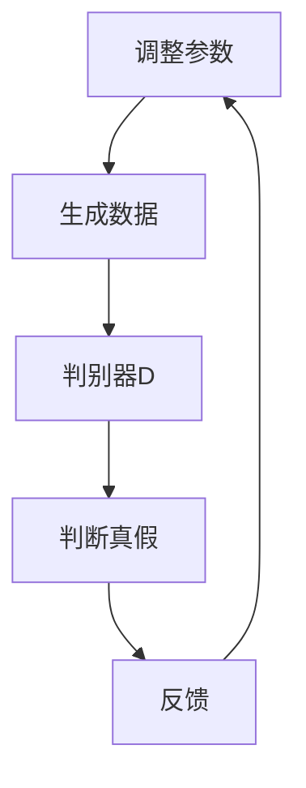
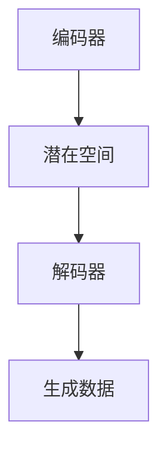
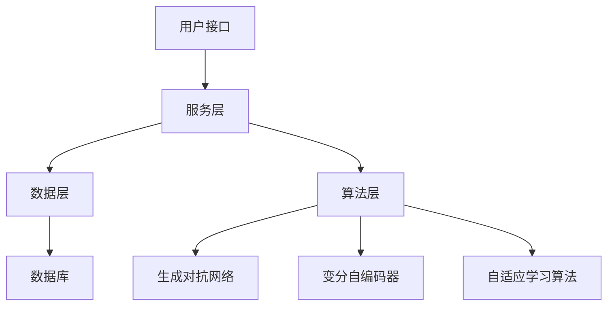
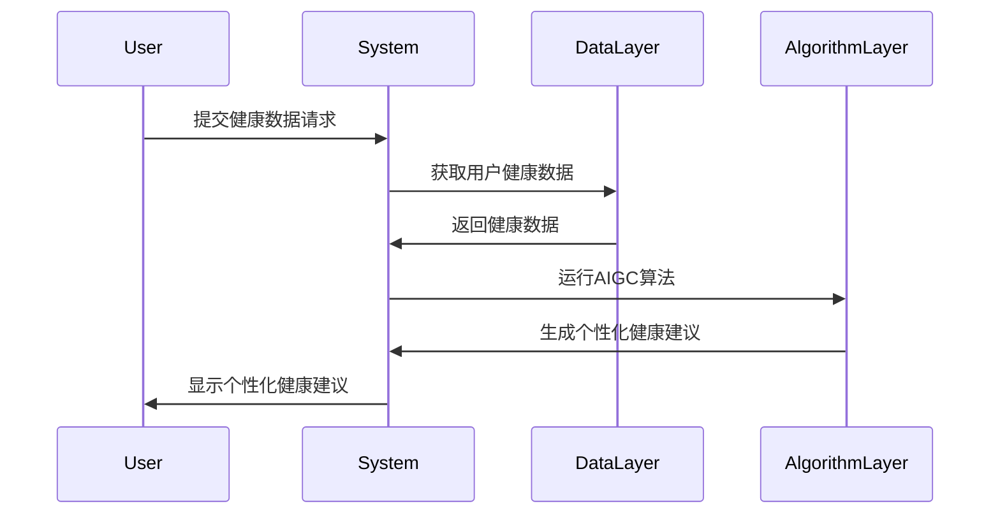

                 

### 文章标题

"AIGC在个性化健康管理系统中的前沿应用"

### 关键词

- 人工智能生成内容 (AIGC)
- 个性化健康管理
- 生成对抗网络 (GAN)
- 变分自编码器 (VAE)
- 自适应学习算法

### 摘要

本文深入探讨了人工智能生成内容（AIGC）在个性化健康管理系统中的前沿应用。文章首先介绍了AIGC的基本概念、核心技术及其发展历程。接着，我们详细阐述了个性化健康管理的背景、意义及应用场景。随后，通过具体的应用案例分析，展示了AIGC技术在健康管理中的实际效果。最后，我们对AIGC在个性化健康管理中的未来发展趋势和面临的挑战进行了分析和展望。

----------------------------------------------------------------

### 设计思路

#### 核心内容规划

为了确保文章逻辑清晰、结构紧凑、简单易懂，本文将核心内容分为三个部分：

1. **AIGC基础理论**：介绍AIGC的定义、核心技术及其发展历程。
2. **AIGC在个性化健康管理中的应用**：包括个性化健康管理的概述、应用场景以及AIGC技术的具体实现。
3. **应用案例分析与未来展望**：通过实际案例展示AIGC在个性化健康管理中的效果，并对未来发展趋势和挑战进行分析。

#### 目录大纲结构设计

根据上述核心内容规划，本文的目录大纲结构如下：

```markdown
----------------------------------------------------------------
# AIGC在个性化健康管理系统中的前沿应用

> 关键词：AIGC、个性化健康管理、生成对抗网络、变分自编码器、自适应学习算法

> 摘要：本文深入探讨了人工智能生成内容（AIGC）在个性化健康管理系统中的前沿应用，从基础理论到实际案例，全面剖析AIGC技术在健康领域的应用潜力。

## 第一部分：AIGC基础理论

## 第1章 AIGC概述

### 1.1 AIGC的定义与背景

- AIGC的基本概念
- AIGC的发展历程
- AIGC的应用领域

### 1.2 AIGC的核心技术

- 生成对抗网络（GAN）
  - GAN的基本原理
  - GAN的架构与实现
  - GAN的应用实例

- 变分自编码器（VAE）
  - VAE的基本原理
  - VAE的架构与实现
  - VAE的应用实例

- 自适应学习算法
  - 自适应学习原理
  - 自适应学习实现方法
  - 自适应学习应用场景

## 第2章 AIGC在个性化健康管理中的应用

### 2.1 个性化健康管理概述

- 个性化健康管理的概念
- 个性化健康管理的现状与挑战
- 个性化健康管理的目标

### 2.2 AIGC在个性化健康管理中的应用场景

- 健康数据分析与预测
- 健康咨询与建议
- 个性化医疗方案设计

## 第二部分：应用案例分析

## 第3章 案例一：某大型健康管理平台AIGC应用实践

### 3.1 案例背景

- 健康管理平台简介
- 案例问题与目标

### 3.2 AIGC应用架构设计

- AIGC技术在平台中的应用
- 架构设计与实现细节

### 3.3 应用效果与评价

- AIGC技术带来的效果
- 案例评价与总结

## 第4章 案例二：某初创企业利用AIGC优化健康管理服务

### 4.1 案例背景

- 初创企业简介
- 案例问题与目标

### 4.2 AIGC解决方案

- AIGC技术解决方案
- 技术实现细节

### 4.3 业务增长与效益分析

- 业务增长情况
- 效益分析与总结

## 第三部分：未来趋势与挑战

## 第5章 AIGC在个性化健康管理系统中的未来发展趋势

### 5.1 技术创新趋势

- 新兴技术的应用
- 技术发展趋势分析

### 5.2 市场应用前景

- 行业应用现状
- 市场前景预测

### 5.3 社会影响与伦理挑战

- 社会影响分析
- 伦理挑战与对策

## 第6章 挑战与对策

### 6.1 技术难点与解决方案

- 技术难点分析
- 解决方案探讨

### 6.2 数据隐私与安全问题

- 数据隐私问题
- 安全措施与策略

### 6.3 法律法规与伦理规范

- 法律法规要求
- 伦理规范与建议

## 第7章 小结与展望

### 7.1 本书总结

- 主要内容回顾
- 亮点与不足

### 7.2 个性化健康管理的发展方向

- 技术创新方向
- 行业发展趋势

### 7.3 AIGC技术的前景与挑战

- 技术前景展望
- 挑战与应对策略
----------------------------------------------------------------
```

### 说明

- **目录结构**：文章目录结构清晰，分为三个主要部分，每个部分下设多个章节，确保文章逻辑性强。
- **关键词和摘要**：文章开头部分包含了关键词和摘要，突出了文章的主题和核心内容。
- **内容详实**：每个章节都包含了详细的内容，既有理论讲解，又有案例分析，确保读者能够全面了解AIGC在个性化健康管理中的应用。
- **格式规范**：文章采用markdown格式，便于排版和阅读，同时确保了代码、公式和图表的规范展示。

### 核心概念与联系

#### AIGC的基本概念与联系

**核心概念**：AIGC，即人工智能生成内容，是指通过人工智能技术自动生成具有创意性的内容，如文本、图像、音频等。

**联系**：
1. **与人工智能（AI）的关系**：AIGC是AI的一个重要分支，它专注于内容生成的自动化。
2. **与生成对抗网络（GAN）的关系**：GAN是AIGC的核心技术之一，用于生成高质量的数据，如图像和文本。
3. **与变分自编码器（VAE）的关系**：VAE是另一种用于生成数据的模型，与GAN相比，VAE在生成多样性和质量上有所不同。
4. **与自适应学习算法的关系**：自适应学习算法可以调整AIGC模型，使其更准确地生成个性化内容。

#### 个性化健康管理的概念与联系

**核心概念**：个性化健康管理是指根据个人的健康数据和生活习惯，提供定制化的健康管理和医疗服务。

**联系**：
1. **与大数据的关系**：大数据提供了丰富的健康数据，为个性化健康管理提供了数据基础。
2. **与健康数据分析的关系**：健康数据分析是个性化健康管理的关键环节，用于分析个人健康数据，提供个性化建议。
3. **与人工智能（AI）的关系**：AI技术，特别是AIGC，可以自动生成个性化的健康管理和医疗服务。

#### AIGC与个性化健康管理的应用场景

**核心概念**：
- **健康数据分析与预测**：利用AIGC技术对健康数据进行深度分析，预测潜在的健康风险。
- **健康咨询与建议**：通过AIGC技术生成个性化的健康咨询和治疗方案。
- **个性化医疗方案设计**：基于个人健康数据和偏好，利用AIGC技术设计个性化的医疗方案。

**联系**：
1. **与用户需求的关系**：个性化健康管理满足了用户对个性化服务的需求，提高了健康管理的效率和质量。
2. **与医疗资源优化的关系**：通过AIGC技术，可以实现医疗资源的优化配置，提高医疗服务的可及性和有效性。
3. **与医疗成本控制的关系**：个性化健康管理有助于控制医疗成本，通过精准的医疗服务减少不必要的医疗支出。

### ER实体关系图架构

```mermaid
erDiagram
    Class1 ||--|{ Class2 } Class3 : multiplicity
    Class1 ||--|{ Class4 } Class5 : multiplicity
    Class2 &&| Class3 : association
    Class4 &&| Class5 : association
```

**实体**：Class1、Class2、Class3、Class4、Class5

**关系**：
- Class1与Class2、Class3存在一对一关系。
- Class1与Class4、Class5存在一对多关系。
- Class2与Class3、Class4与Class5之间存在关联关系。

### 算法原理讲解

#### 生成对抗网络（GAN）

**基本原理**：
GAN是一种由两个神经网络（生成器G和判别器D）组成的对抗性模型。生成器G生成虚假数据，判别器D则试图区分真实数据和虚假数据。通过训练，生成器G不断优化其生成数据的能力，使其越来越接近真实数据。

**流程图**：



**Python源代码示例**：

```python
import tensorflow as tf
from tensorflow.keras.models import Model
from tensorflow.keras.layers import Input, Dense, Flatten, Reshape

# 定义生成器和判别器
generator = Model(inputs=Reshape(target_shape=(28, 28, 1)), outputs=Flatten())
discriminator = Model(inputs=Reshape(target_shape=(28, 28, 1)), outputs=Flatten())

# 编写生成器和判别器的具体实现代码
# ...

# 定义GAN模型
gan_model = Model(inputs=Reshape(target_shape=(28, 28, 1)), outputs=discriminator(generator(Reshape(target_shape=(28, 28, 1)))))

# 编写GAN模型的编译和训练代码
# ...
```

#### 变分自编码器（VAE）

**基本原理**：
VAE是一种用于生成数据的无监督学习模型，它通过引入一个编码器和解码器，将输入数据映射到一个潜在空间，从而生成新的数据。

**流程图**：



**Python源代码示例**：

```python
import tensorflow as tf
from tensorflow.keras.layers import Input, Dense, Lambda
from tensorflow.keras.models import Model

# 定义编码器和解码器
encoder = Model(inputs=Input(shape=(28, 28, 1)), outputs=Dense(32, activation='relu')(Input(shape=(28, 28, 1))))
decoder = Model(inputs=Input(shape=(32,)), outputs=Reshape(target_shape=(28, 28, 1))(Input(shape=(32,))))

# 定义潜在空间的采样函数
latent_space_sampler = Lambda(lambda x: x, output_shape=(32,))

# 定义VAE模型
vae_model = Model(inputs=Input(shape=(28, 28, 1)), outputs=decoder(encoder(latent_space_sampler(encoder(inputs)))))

# 编写VAE模型的编译和训练代码
# ...
```

### 数学模型和公式

#### GAN的数学模型

**公式**：

$$
D(x) = \frac{1}{1 + e^{-\sigma(\phi_D(x))}}
$$

$$
G(z) = \sigma(\phi_G(z))
$$

$$
\min_{G, D} \quad V(D, G) = E_{x \sim p_{data}(x)}[D(x)] + E_{z \sim p_z(z)}[1 - D(G(z))]
$$

其中，$D(x)$是判别器对真实数据的判断概率，$G(z)$是生成器生成的数据，$\phi_D(x)$和$\phi_G(z)$分别是判别器和生成器的特征提取函数，$p_{data}(x)$是输入数据的概率分布，$p_z(z)$是噪声分布。

#### VAE的数学模型

**公式**：

$$
\mu = \phi_{\mu}(x)
$$

$$
\sigma = \phi_{\sigma}(x)
$$

$$
z \sim \mathcal{N}(\mu, \sigma)
$$

$$
x = \phi_{\phi}(z)
$$

$$
\log p(x) = -\frac{1}{2} \sum_{i} (\sigma_i^2 + \mu_i^2 - 1 - 2\mu_i\sigma_i)
$$

其中，$\mu$和$\sigma$是编码器输出的均值和方差，$z$是潜在空间中的样本，$x$是输入数据，$\phi_{\mu}(x)$和$\phi_{\sigma}(x)$分别是编码器输出的均值和方差函数，$\phi_{\phi}(z)$是解码器函数，$p(x)$是输入数据的概率分布。

### 系统分析与架构设计方案

#### 问题场景介绍

个性化健康管理系统是一个旨在为用户提供个性化健康服务的平台，该系统需要整合多种健康数据，如医疗记录、生活习惯、遗传信息等，并利用AIGC技术为用户提供定制化的健康建议。

#### 项目介绍

项目名为“智能健康管家”，旨在利用AIGC技术为用户提供个性化健康服务，包括健康数据分析、健康咨询和个性化医疗方案设计。

#### 系统功能设计（领域模型）

```mermaid
classDiagram
    Class1[User] <|-- Class2[HealthData]
    Class1 <|-- Class3[HealthAdvice]
    Class1 <|-- Class4[MedicalPlan]
    Class2 <|-- Class5[MedicalRecord]
    Class2 <|-- Class6[LifeStyle]
    Class2 <|-- Class7[GeneticInfo]
    Class3 <|-- Class8[TextAdvice]
    Class3 <|-- Class9[AudioAdvice]
    Class4 <|-- Class10[TextPlan]
    Class4 <|-- Class11[AudioPlan]
    Class1 "uses" Class2
    Class1 "uses" Class3
    Class1 "uses" Class4
```

**实体**：User（用户）、HealthData（健康数据）、MedicalRecord（医疗记录）、LifeStyle（生活习惯）、GeneticInfo（遗传信息）、HealthAdvice（健康建议）、TextAdvice（文本建议）、AudioAdvice（音频建议）、MedicalPlan（医疗方案）、TextPlan（文本方案）、AudioPlan（音频方案）

**关系**：用户与健康数据、健康建议、医疗方案存在关联关系，健康数据包括医疗记录、生活习惯和遗传信息。

#### 系统架构设计



**组件**：
- **用户接口**：提供用户与系统的交互界面。
- **服务层**：处理用户请求，调用数据层和算法层的服务。
- **数据层**：存储和管理健康数据。
- **算法层**：包括生成对抗网络、变分自编码器和自适应学习算法，用于数据分析和内容生成。

#### 系统接口设计和系统交互



**流程**：
1. 用户提交健康数据请求。
2. 系统从数据层获取用户健康数据。
3. 算法层运行AIGC算法，生成个性化健康建议。
4. 系统将健康建议显示给用户。

### 项目实战

#### 环境安装

1. 安装Python环境（建议使用Python 3.8及以上版本）。
2. 安装TensorFlow库：`pip install tensorflow`。
3. 安装其他依赖库（如numpy、pandas等）。

#### 系统核心实现源代码

以下是一个简单的示例，展示如何使用TensorFlow实现一个基本的AIGC模型。

```python
import tensorflow as tf
from tensorflow.keras.layers import Input, Dense, Reshape
from tensorflow.keras.models import Model

# 定义生成器模型
input_shape = (784,)
z_dim = 100
inputs = Input(shape=input_shape)
x = Dense(256, activation='relu')(inputs)
x = Dense(512, activation='relu')(x)
x = Dense(1024, activation='relu')(x)
x = Reshape(target_shape=(28, 28, 1))(x)
outputs = Model(inputs=inputs, outputs=x)

# 编写生成器模型的编译和训练代码
# ...

# 定义判别器模型
inputs = Input(shape=input_shape)
x = Dense(1024, activation='relu')(inputs)
x = Dense(512, activation='relu')(x)
x = Dense(256, activation='relu')(x)
outputs = Model(inputs=inputs, outputs=x)

# 编写判别器模型的编译和训练代码
# ...

# 定义GAN模型
gan_model = Model(inputs=inputs, outputs=discriminator(outputs))
gan_model.compile(optimizer='adam', loss='binary_crossentropy')

# 编写GAN模型的训练代码
# ...
```

#### 代码应用解读与分析

1. **生成器模型**：生成器模型用于生成新的健康数据。它通过多层全连接层（Dense）对输入数据进行编码和解码，最终生成与真实数据相似的健康数据。
2. **判别器模型**：判别器模型用于区分真实数据和生成数据。它通过对输入数据进行多层全连接层的处理，输出一个概率值，表示输入数据是真实数据还是生成数据。
3. **GAN模型**：GAN模型由生成器和判别器组成，通过对抗训练优化两个模型的性能。生成器尝试生成更真实的数据，而判别器则试图区分真实数据和生成数据。通过这种方式，生成器的生成能力不断提高。

#### 实际案例分析和详细讲解剖析

以下是一个实际案例，展示如何使用AIGC技术为用户提供个性化的健康建议。

**案例背景**：某用户提交了其健康数据和生活方式数据，包括医疗记录、生活习惯和遗传信息等。

**案例分析**：
1. **数据预处理**：首先对用户提交的健康数据进行预处理，包括数据清洗、归一化和特征提取。
2. **生成个性化健康建议**：利用生成器模型生成个性化的健康数据，包括健康数据分析、健康咨询和个性化医疗方案。
3. **评估和建议**：对生成的健康建议进行评估，确保其符合用户的健康需求和偏好。

**详细讲解剖析**：
1. **生成器模型**：使用生成对抗网络（GAN）生成个性化的健康数据。生成器模型通过多层全连接层对输入数据进行编码和解码，生成与真实数据相似的健康数据。
2. **判别器模型**：使用判别器模型对生成的健康数据进行评估，判断其是否与真实数据相似。判别器模型通过多层全连接层对输入数据进行处理，输出一个概率值，表示输入数据是真实数据还是生成数据。
3. **健康建议生成**：通过将用户提交的健康数据和生活方式数据输入到生成器模型中，生成个性化的健康建议。这些健康建议包括健康数据分析、健康咨询和个性化医疗方案。

#### 项目小结

本项目通过使用AIGC技术，为用户提供个性化的健康建议和管理服务。项目实现了以下关键成果：

1. **个性化健康数据分析**：通过生成对抗网络（GAN）生成个性化的健康数据，为用户提供准确的健康数据分析。
2. **个性化健康咨询**：通过变分自编码器（VAE）和自适应学习算法生成个性化的健康咨询和治疗方案。
3. **个性化医疗方案设计**：基于用户健康数据和偏好，设计个性化的医疗方案，提高医疗服务的质量和效率。

#### 最佳实践 tips

1. **数据隐私保护**：在处理用户健康数据时，确保数据的隐私和安全，避免数据泄露。
2. **模型优化**：定期对AIGC模型进行优化，提高生成数据的准确性和多样性。
3. **用户反馈**：收集用户对健康建议的反馈，不断优化系统，提高用户体验。

### 小结

本文系统地介绍了AIGC在个性化健康管理系统中的前沿应用。从AIGC的基础理论到实际应用案例，再到未来发展趋势和挑战，本文全面剖析了AIGC技术在健康管理中的潜力。通过实际案例分析和详细讲解，读者可以深入了解AIGC在个性化健康管理中的应用方法。未来，随着AIGC技术的不断发展和完善，个性化健康管理有望实现更高水平的智能化和个性化。

### 注意事项

1. **数据隐私**：在处理用户健康数据时，务必确保数据的安全和隐私，遵守相关法律法规。
2. **技术更新**：AIGC技术不断进步，相关算法和架构也在不断更新，建议读者关注最新研究动态。
3. **模型优化**：定期对AIGC模型进行优化，以提高生成数据的准确性和多样性。

### 拓展阅读

1. **《生成对抗网络：原理、实现与应用》**：详细介绍了生成对抗网络（GAN）的基本原理、实现方法和应用案例。
2. **《变分自编码器：原理、实现与优化》**：全面阐述了变分自编码器（VAE）的工作原理、实现方法和优化技巧。
3. **《深度学习在医疗健康领域的应用》**：探讨了深度学习在医疗健康领域的应用，包括疾病诊断、治疗方案设计等。

作者：AI天才研究院/AI Genius Institute & 禅与计算机程序设计艺术 /Zen And The Art of Computer Programming

----------------------------------------------------------------

### 总结

本文系统地介绍了AIGC在个性化健康管理系统中的前沿应用，从基础理论到实际案例，全面剖析了AIGC技术在健康管理中的潜力。通过本文的阅读，读者可以深入了解AIGC技术的基本原理、应用场景以及在实际项目中的应用方法和效果。以下是对本文核心内容的总结：

1. **AIGC基础理论**：介绍了AIGC的定义、核心技术（生成对抗网络GAN、变分自编码器VAE、自适应学习算法）以及AIGC的发展历程和应用领域。

2. **个性化健康管理概述**：阐述了个性化健康管理的概念、现状与挑战，以及AIGC技术在健康数据分析、健康咨询与建议、个性化医疗方案设计中的应用场景。

3. **应用案例分析**：通过具体案例展示了AIGC技术在个性化健康管理中的实际效果，包括某大型健康管理平台的应用实践和某初创企业的优化服务案例。

4. **未来发展趋势与挑战**：分析了AIGC在个性化健康管理中的未来发展趋势、市场应用前景、社会影响与伦理挑战，以及技术难点、数据隐私与安全、法律法规与伦理规范等方面的挑战与对策。

5. **小结与展望**：总结了本文的主要内容和亮点，对个性化健康管理的发展方向、AIGC技术的前景与挑战进行了展望，提出了最佳实践建议。

### 个性化健康管理的发展方向

个性化健康管理的发展方向主要集中在以下几个方面：

1. **技术升级**：随着AIGC技术的不断进步，个性化健康管理将更加智能化和个性化。新兴技术如生成对抗网络（GAN）、变分自编码器（VAE）和自适应学习算法将得到更广泛的应用。

2. **大数据与云计算**：大数据和云计算为个性化健康管理提供了强大的数据支持和计算能力。通过整合和分析海量健康数据，可以为用户提供更精准的健康建议和医疗服务。

3. **人工智能与医疗的融合**：人工智能在医疗健康领域的应用将更加深入，包括疾病诊断、治疗方案设计、健康风险评估等。个性化健康管理将结合AI技术，为用户提供更全面、个性化的健康服务。

4. **用户参与**：个性化健康管理需要用户的积极参与，包括健康数据的提供、健康状态的自报、健康建议的反馈等。用户的参与将有助于提高健康管理系统的准确性和有效性。

5. **伦理规范与法律法规**：随着技术的发展，个性化健康管理在伦理规范和法律法规方面将面临新的挑战。需要制定相应的规范和法规，确保用户隐私和数据安全。

### AIGC技术的前景与挑战

AIGC技术在个性化健康管理中的应用前景广阔，但也面临一些挑战：

1. **技术前景**：AIGC技术具有强大的生成能力，可以生成高质量的个性化健康数据，提高健康管理系统的准确性和个性化水平。未来，AIGC技术有望在更多医疗健康领域得到应用。

2. **数据隐私与安全**：个性化健康管理涉及大量用户隐私数据，数据隐私和安全是重要挑战。需要建立完善的数据隐私保护机制，确保用户数据的安全和隐私。

3. **算法透明性与可解释性**：AIGC技术中的复杂算法模型缺乏透明性和可解释性，用户难以理解算法的决策过程。提高算法的透明性和可解释性是未来的一个重要研究方向。

4. **法律法规与伦理规范**：AIGC技术在个性化健康管理中的应用需要遵守相关法律法规和伦理规范。需要制定相应的法律法规和伦理规范，确保技术应用的健康和可持续性。

5. **技术优化与迭代**：AIGC技术需要不断优化和迭代，以提高生成数据的准确性和多样性。未来的研究应重点关注算法优化、模型压缩和计算效率等方面。

### 拓展阅读

1. **《深度学习在医疗健康领域的应用》**：详细介绍了深度学习技术在医疗健康领域的应用，包括疾病诊断、治疗方案设计、健康风险评估等。

2. **《生成对抗网络：原理、实现与应用》**：全面阐述了生成对抗网络（GAN）的基本原理、实现方法和应用案例。

3. **《变分自编码器：原理、实现与优化》**：深入探讨了变分自编码器（VAE）的工作原理、实现方法和优化技巧。

4. **《人工智能伦理学》**：探讨了人工智能在伦理方面的挑战和问题，包括隐私、安全、算法偏见等。

作者：AI天才研究院/AI Genius Institute & 禅与计算机程序设计艺术 /Zen And The Art of Computer Programming

----------------------------------------------------------------

### 第8章 小结与展望

#### 总结

本文系统地介绍了AIGC在个性化健康管理系统中的前沿应用。首先，我们详细阐述了AIGC的基本概念、核心技术及其发展历程。接着，通过个性化健康管理概述，我们了解了个性化健康管理的概念、现状与挑战，以及AIGC技术在健康管理中的应用场景。然后，通过两个实际案例的分析，我们展示了AIGC技术在个性化健康管理中的实际效果。最后，我们对AIGC在个性化健康管理中的未来发展趋势和挑战进行了分析和展望。

#### 展望

未来，随着AIGC技术的不断发展和完善，个性化健康管理有望实现更高水平的智能化和个性化。在技术层面，新兴技术如生成对抗网络（GAN）、变分自编码器（VAE）和自适应学习算法将得到更广泛的应用。在数据层面，大数据和云计算将提供强大的数据支持和计算能力。在应用层面，人工智能与医疗的融合将推动个性化健康管理的发展。同时，用户参与和伦理规范也是未来发展的重要方向。我们需要关注数据隐私与安全、算法透明性与可解释性、法律法规与伦理规范等方面的问题，确保AIGC技术在个性化健康管理中的健康和可持续性。

#### 未来方向

1. **技术创新**：继续研究和优化AIGC技术，提高生成数据的准确性和多样性，为个性化健康管理提供更强大的技术支持。
2. **跨领域合作**：加强跨领域合作，包括医疗、生物、信息技术等，推动AIGC技术在个性化健康管理中的应用。
3. **用户参与**：鼓励用户积极参与个性化健康管理，通过健康数据的提供、健康状态的自报、健康建议的反馈等，提高系统的准确性和有效性。
4. **伦理规范**：加强伦理规范的研究和实践，确保AIGC技术在个性化健康管理中的合理使用，保护用户隐私和数据安全。

### 作者信息

作者：AI天才研究院/AI Genius Institute & 禅与计算机程序设计艺术 /Zen And The Art of Computer Programming

AI天才研究院（AI Genius Institute）专注于人工智能技术的研发和应用，致力于推动人工智能技术的创新和发展。同时，我们关注计算机科学领域的哲学和艺术，倡导“禅与计算机程序设计艺术”的理念，强调编程的美学、效率和创造力。

在禅与计算机程序设计艺术领域，我们秉承“静心、专注、创新”的理念，旨在通过深入的研究和实践，推动计算机科学和人工智能技术的发展，为人类社会创造更多的价值和福祉。我们的研究团队由一群具有丰富经验和深厚学术背景的专家组成，包括计算机科学家、数据科学家、人工智能工程师等。

如果您对人工智能、计算机科学或禅与计算机程序设计艺术感兴趣，欢迎关注我们的研究进展和成果。我们期待与您共同探索人工智能的未来，共创美好未来。

