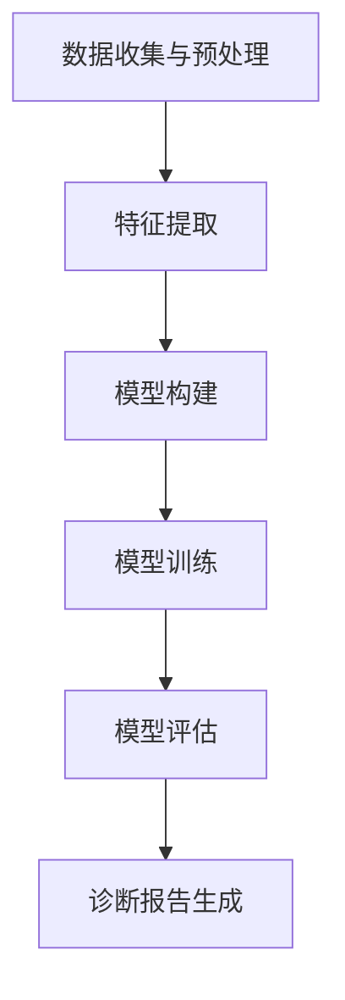
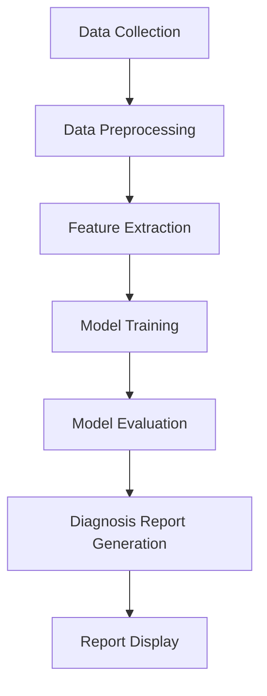
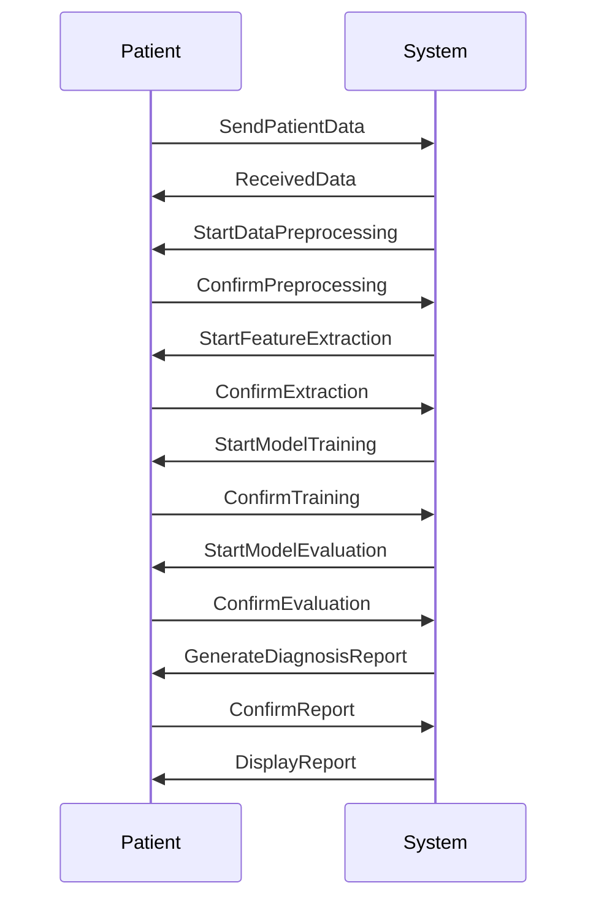

                 

### AIGC在个性化医疗诊断中的突破

#### 关键词：
- AIGC
- 个性化医疗诊断
- 自适应智能生成计算
- 数据预处理
- 模型训练与评估

#### 摘要：
本文旨在探讨AIGC（自适应智能生成计算）在个性化医疗诊断领域的突破。通过分析AIGC的基本概念及其在医疗领域的应用潜力，本文将详细讲解AIGC算法原理、系统架构设计方案、项目实战案例以及最佳实践建议。文章结构分为五个部分，每个部分逐步深入，旨在为读者提供清晰、深入的技术见解。

---

### 设计大纲概述

本文的设计大纲旨在系统地介绍AIGC技术如何应用于个性化医疗诊断，展示其在该领域内的突破与创新。以下为目录结构：

#### 第一部分：AIGC技术基础

##### 第1章：AIGC技术概述
- **1.1 AIGC技术的起源与发展**
- **1.2 AIGC在医疗领域的应用潜力**
- **1.3 个性化医疗诊断的核心概念**
  - **1.3.1 个性化医疗的定义**
  - **1.3.2 诊断流程与AIGC的结合**
  - **1.3.3 AIGC在个性化医疗诊断中的优势**
- **1.4 AIGC与其他技术的比较与融合**
- **1.5 本章小结**

##### 第2章：AIGC算法原理
- **2.1 AIGC的基本原理**
  - **2.1.1 自适应计算的概念**
  - **2.1.2 生成计算的核心机制**
- **2.2 AIGC在个性化医疗诊断中的算法应用**
  - **2.2.1 数据预处理与特征提取**
  - **2.2.2 模型训练与评估**
- **2.3 AIGC算法流程图**
- **2.4 Python代码示例**
  - **2.4.1 数据集加载与预处理**
  - **2.4.2 模型构建与训练**
- **2.5 数学模型与公式解析**
- **2.6 举例说明**
- **2.7 本章小结**

##### 第3章：系统场景与功能设计
- **3.1 个性化医疗诊断项目介绍**
- **3.2 系统功能设计**
  - **3.2.1 功能需求分析**
  - **3.2.2 领域模型（Mermaid类图）**

##### 第4章：系统架构设计与接口设计
- **4.1 系统架构设计**
  - **4.1.1 架构整体设计**
  - **4.1.2 子系统划分**
- **4.2 系统接口设计**
  - **4.2.1 接口规范与标准**
  - **4.2.2 接口实现与调用**
- **4.3 系统交互（Mermaid序列图）**
- **4.4 本章小结**

##### 第5章：项目实战
- **5.1 环境安装与配置**
- **5.2 系统核心实现**
  - **5.2.1 数据处理模块**
  - **5.2.2 模型训练与评估**
- **5.3 系统部署与优化**
- **5.4 代码解读与分析**
- **5.5 本章小结**

##### 第6章：最佳实践与总结
- **6.1 数据质量控制**
- **6.2 模型调优与性能优化**
- **6.3 安全性与隐私保护**
- **6.4 小结与展望**
- **6.5 拓展阅读**
- **6.6 本章小结**

### 目录大纲结构整理

```markdown
# AIGC在个性化医疗诊断中的突破

## 背景介绍

### AIGC技术的起源与发展

### AIGC在医疗领域的应用潜力

### 个性化医疗诊断的核心概念
- **个性化医疗的定义**
- **诊断流程与AIGC的结合**
- **AIGC在个性化医疗诊断中的优势**

### AIGC与其他技术的比较与融合

### 本章小结

## 核心概念与联系

### AIGC的基本原理

### AIGC在个性化医疗诊断中的算法应用
- **数据预处理与特征提取**
- **模型训练与评估**

### AIGC算法流程图

### Python代码示例
- **数据集加载与预处理**
- **模型构建与训练**

### 数学模型与公式解析

### 举例说明

### 本章小结

## 系统分析与架构设计

### 系统场景与功能设计

### 系统架构设计与接口设计
- **系统架构设计**
- **系统接口设计**

### 系统交互

### 本章小结

## 项目实战

### 环境安装与配置

### 系统核心实现
- **数据处理模块**
- **模型训练与评估**

### 系统部署与优化

### 代码解读与分析

### 本章小结

## 最佳实践与总结

### 数据质量控制

### 模型调优与性能优化

### 安全性与隐私保护

### 小结与展望

### 拓展阅读

### 本章小结

---

通过这样的设计大纲，本文将为读者提供一个系统、全面、深入的技术分析，帮助读者理解AIGC在个性化医疗诊断中的关键角色和潜在影响。

### 第一部分：AIGC技术基础

#### 第1章：AIGC技术概述

##### 1.1 AIGC技术的起源与发展

AIGC（自适应智能生成计算）是一种基于人工智能（AI）技术的计算范式，旨在通过自适应和生成计算来提升计算效率和智能化水平。这一概念起源于20世纪90年代，随着计算机科学和人工智能领域的快速发展，特别是在深度学习和生成模型方面的突破，AIGC逐渐成为研究热点。

AIGC的发展历程可以分为以下几个阶段：

1. **早期探索**：在20世纪80年代和90年代，研究人员开始探索自适应计算的概念，希望计算机能够根据用户需求和环境变化自动调整其行为。这一阶段的主要成果包括自适应控制器和自适应系统理论。

2. **算法创新**：随着深度学习的兴起，研究人员提出了生成对抗网络（GAN）、变分自编码器（VAE）等生成模型，这些算法能够生成高质量的数据，从而在图像、语音和文本生成等方面取得了显著成果。

3. **集成应用**：在21世纪初，自适应计算和生成计算逐渐结合，形成了AIGC技术。AIGC通过自适应调整生成模型，使其在不同场景下能够高效地生成数据，提升了AI系统的智能化水平。

在医疗领域的应用潜力方面，AIGC展现出以下几方面的优势：

1. **个性化医疗**：AIGC技术能够根据患者的具体病情和基因信息，生成个性化的治疗方案，从而提高治疗效果。

2. **疾病预测**：通过分析大量的医疗数据，AIGC可以预测疾病的发病风险，为早期诊断和预防提供支持。

3. **数据增强**：在医疗影像诊断中，AIGC可以生成大量的模拟数据，用于训练和优化诊断模型，提高模型的准确性和鲁棒性。

##### 1.2 AIGC在医疗领域的应用潜力

AIGC在医疗领域的应用潜力主要体现在以下几个方面：

1. **个性化医疗诊断**：AIGC可以通过自适应调整生成模型，根据患者的具体病情和基因信息，生成个性化的诊断报告。这不仅可以提高诊断的准确性，还可以减少误诊和漏诊的情况。

2. **疾病预测与预防**：AIGC可以通过分析大量的历史医疗数据，预测疾病的发病风险，从而在疾病早期采取预防措施，提高患者的健康水平。

3. **医疗影像分析**：在医疗影像诊断中，AIGC可以生成大量的模拟数据，用于训练和优化诊断模型，提高模型的准确性和鲁棒性。此外，AIGC还可以对医疗影像进行自动标注和分类，减轻医生的工作负担。

4. **药物研发**：AIGC可以用于药物分子的生成和优化，通过生成大量具有潜在药理活性的分子结构，加速新药的研发进程。

##### 1.3 个性化医疗诊断的核心概念

**个性化医疗**是一种以患者为中心的医疗服务模式，旨在根据患者的个体差异（如基因、生活方式、环境等）提供个性化的治疗方案。个性化医疗的核心在于通过收集和分析大量患者数据，实现精准治疗和预防。

**诊断流程与AIGC的结合**：个性化医疗诊断流程通常包括以下几个步骤：

1. **数据收集**：收集患者的病史、基因信息、生活习惯等数据。

2. **数据预处理**：对收集到的数据进行清洗、归一化等处理，以便于后续分析。

3. **特征提取**：从预处理后的数据中提取关键特征，用于诊断模型的训练。

4. **模型训练与评估**：利用AIGC技术，构建和训练个性化诊断模型，并通过交叉验证等手段进行评估。

5. **生成诊断报告**：将患者的数据输入训练好的诊断模型，生成个性化的诊断报告。

**AIGC在个性化医疗诊断中的优势**：

1. **高准确性**：通过自适应调整生成模型，AIGC能够生成更准确、更个性化的诊断报告。

2. **高效性**：AIGC技术能够高效地处理大量医疗数据，加速诊断流程。

3. **可扩展性**：AIGC技术可以应用于多种医疗场景，如疾病预测、医疗影像分析等。

##### 1.4 AIGC与其他技术的比较与融合

**AIGC与其他技术的比较**：

- **与传统机器学习技术**：AIGC具有更强的自适应性和生成能力，能够在复杂环境中生成高质量的数据，从而提高模型的准确性。
- **与传统深度学习技术**：AIGC不仅包括深度学习的组件，还引入了自适应计算的概念，使得模型能够在不同场景下自适应调整，提高模型的泛化能力。
- **与数据增强技术**：AIGC通过生成高质量的数据，可以替代部分数据增强技术，提高模型的训练效果。

**AIGC与其他技术的融合**：

- **与基因组学**：AIGC可以与基因组学技术结合，通过分析患者的基因信息，实现个性化医疗诊断。
- **与医疗影像分析**：AIGC可以与深度学习技术结合，对医疗影像进行自动标注和分类，提高诊断的准确性。
- **与区块链技术**：AIGC可以与区块链技术结合，确保患者数据的隐私和安全。

##### 1.5 本章小结

本章介绍了AIGC技术的基本概念、发展背景以及在医疗领域的应用潜力。通过分析个性化医疗诊断的核心概念和AIGC的优势，本章为后续章节的深入探讨奠定了基础。下一章将详细讲解AIGC算法的基本原理，并分析其在个性化医疗诊断中的具体应用。

---

### 第二部分：AIGC算法原理与应用

#### 第2章：AIGC算法原理

##### 2.1 AIGC的基本原理

AIGC（自适应智能生成计算）是一种基于生成模型和自适应调整的算法，其核心思想是通过自适应调整生成模型，使其在不同场景下能够生成高质量的数据。AIGC的基本原理包括以下几个关键组成部分：

1. **生成模型**：生成模型是AIGC的核心组件，用于生成符合真实数据分布的数据。常见的生成模型包括生成对抗网络（GAN）、变分自编码器（VAE）等。

2. **自适应调整**：AIGC通过自适应调整生成模型，使其在不同场景下能够生成高质量的数据。自适应调整包括模型参数的动态调整、数据预处理策略的调整等。

3. **数据预处理**：数据预处理是AIGC算法的重要组成部分，通过对输入数据进行清洗、归一化等处理，确保生成模型能够生成高质量的数据。

4. **模型训练与评估**：AIGC通过模型训练和评估，不断优化生成模型，提高其生成质量。常见的评估指标包括生成质量、模型鲁棒性等。

##### 2.1.1 自适应计算的概念

自适应计算是一种使计算系统能够根据用户需求和环境变化动态调整其行为和性能的技术。在AIGC中，自适应计算主要体现在以下几个方面：

1. **动态调整模型参数**：通过实时监测生成模型的表现，动态调整模型参数，使其在不同场景下能够生成高质量的数据。

2. **自适应数据预处理**：根据不同的数据集和场景，自适应调整数据预处理策略，如特征提取、归一化等，以确保生成模型能够有效处理输入数据。

3. **自适应调整训练策略**：根据模型训练过程中的表现，自适应调整训练策略，如学习率、训练批次大小等，以提高模型训练效率。

##### 2.1.2 生成计算的核心机制

生成计算是指通过生成模型生成符合真实数据分布的数据的过程。生成计算的核心机制包括以下几个方面：

1. **数据生成**：生成模型通过学习输入数据的分布，生成新的符合该分布的数据。常见的方法包括生成对抗网络（GAN）和变分自编码器（VAE）。

2. **数据质量评估**：在生成计算过程中，需要对生成数据的质量进行评估，以确保生成数据符合真实数据分布。常见的评估指标包括生成质量、模型鲁棒性等。

3. **数据优化**：通过评估生成数据的质量，对生成模型进行优化，以提高生成数据的质量。常见的优化方法包括模型参数调整、数据预处理策略调整等。

##### 2.2 AIGC在个性化医疗诊断中的算法应用

在个性化医疗诊断中，AIGC算法的应用主要包括以下几个步骤：

1. **数据收集与预处理**：收集患者的病史、基因信息、生活习惯等数据，并进行清洗、归一化等预处理操作。

2. **特征提取**：从预处理后的数据中提取关键特征，用于构建个性化诊断模型。

3. **模型训练**：利用AIGC算法，构建和训练个性化诊断模型。训练过程中，通过自适应调整模型参数和数据预处理策略，提高模型生成质量。

4. **模型评估**：对训练好的诊断模型进行评估，选择最优模型进行部署和应用。

5. **诊断报告生成**：将患者的数据输入训练好的诊断模型，生成个性化的诊断报告。

##### 2.2.1 数据预处理与特征提取

数据预处理与特征提取是AIGC在个性化医疗诊断中至关重要的一环。以下是具体步骤：

1. **数据清洗**：清洗患者数据中的噪声和异常值，确保数据质量。

2. **数据归一化**：对数据特征进行归一化处理，使其在相同的尺度范围内，便于后续处理。

3. **特征提取**：从清洗和归一化后的数据中提取关键特征，如年龄、性别、病史、基因信息等。常见的特征提取方法包括特征选择、特征提取、特征组合等。

##### 2.2.2 模型训练与评估

模型训练与评估是AIGC在个性化医疗诊断中的核心步骤。以下是具体步骤：

1. **模型构建**：利用AIGC算法，构建个性化诊断模型。常见的生成模型包括生成对抗网络（GAN）和变分自编码器（VAE）。

2. **模型训练**：通过自适应调整模型参数和数据预处理策略，训练个性化诊断模型。训练过程中，使用交叉验证等方法评估模型性能。

3. **模型评估**：对训练好的模型进行评估，选择最优模型进行部署和应用。常见的评估指标包括准确率、召回率、F1值等。

##### 2.3 AIGC算法流程图

为了更直观地展示AIGC算法在个性化医疗诊断中的流程，我们使用Mermaid绘制了算法流程图：



图1：AIGC算法流程图

##### 2.4 Python代码示例

为了更好地理解AIGC算法在个性化医疗诊断中的应用，我们提供了一个Python代码示例。以下代码展示了如何使用AIGC算法进行数据预处理、模型构建和训练：

```python
import numpy as np
import pandas as pd
from sklearn.model_selection import train_test_split
from sklearn.preprocessing import StandardScaler
from keras.models import Sequential
from keras.layers import Dense, LSTM, Embedding
from keras.callbacks import EarlyStopping

# 数据收集与预处理
data = pd.read_csv('patient_data.csv')
X = data.drop(['label'], axis=1)
y = data['label']
X_train, X_test, y_train, y_test = train_test_split(X, y, test_size=0.2, random_state=42)

# 特征提取
scaler = StandardScaler()
X_train_scaled = scaler.fit_transform(X_train)
X_test_scaled = scaler.transform(X_test)

# 模型构建
model = Sequential()
model.add(Embedding(input_dim=X_train_scaled.shape[1], output_dim=64))
model.add(LSTM(units=128, return_sequences=True))
model.add(LSTM(units=64))
model.add(Dense(units=1, activation='sigmoid'))

# 模型训练
model.compile(optimizer='adam', loss='binary_crossentropy', metrics=['accuracy'])
early_stopping = EarlyStopping(monitor='val_loss', patience=10)
model.fit(X_train_scaled, y_train, epochs=100, batch_size=32, validation_data=(X_test_scaled, y_test), callbacks=[early_stopping])

# 模型评估
loss, accuracy = model.evaluate(X_test_scaled, y_test)
print('Test accuracy:', accuracy)

# 诊断报告生成
predictions = model.predict(X_test_scaled)
predictions = (predictions > 0.5)
print('Predictions:', predictions)
```

##### 2.5 数学模型与公式解析

AIGC算法的核心在于生成模型和自适应调整机制。以下是一个简化的数学模型，用于描述AIGC算法的原理：

$$
\begin{align*}
\text{Generator}(G): \mathcal{X} &= \mathcal{X}_{\text{true}} \\
\text{Discriminator}(D): \mathcal{X} &= \mathcal{X}_{\text{true}} \cup \mathcal{X}_{\text{fake}}
\end{align*}
$$

其中，$G$代表生成模型，$D$代表判别模型。$X_{\text{true}}$表示真实数据分布，$X_{\text{fake}}$表示生成模型生成的数据。

生成模型和判别模型的优化目标如下：

$$
\begin{align*}
\min_{G} \quad & \mathbb{E}_{x \sim p_{\text{data}}(x)}[\log(D(x))] + \mathbb{E}_{z \sim p_{\text{z}}(z)}[\log(1 - D(G(z)))] \\
\min_{D} \quad & \mathbb{E}_{x \sim p_{\text{data}}(x)}[\log(D(x))] + \mathbb{E}_{z \sim p_{\text{z}}(z)}[\log(D(G(z))]
\end{align*}
$$

其中，$z$表示生成模型输入的噪声数据。

##### 2.6 举例说明

假设我们使用AIGC算法进行癌症诊断。具体步骤如下：

1. **数据收集与预处理**：收集患者的病史、基因信息、生活习惯等数据，并进行清洗、归一化等预处理操作。

2. **特征提取**：从清洗和归一化后的数据中提取关键特征，如年龄、性别、病史、基因信息等。

3. **模型构建**：使用生成对抗网络（GAN）构建个性化诊断模型。生成模型$G$用于生成符合真实数据分布的癌症诊断数据，判别模型$D$用于判断输入数据是真实数据还是生成数据。

4. **模型训练**：通过自适应调整模型参数和数据预处理策略，训练个性化诊断模型。训练过程中，使用交叉验证等方法评估模型性能。

5. **模型评估**：对训练好的模型进行评估，选择最优模型进行部署和应用。

6. **诊断报告生成**：将患者的数据输入训练好的诊断模型，生成个性化的诊断报告。

##### 2.7 本章小结

本章详细介绍了AIGC算法的基本原理，包括自适应计算的概念、生成计算的核心机制以及AIGC在个性化医疗诊断中的算法应用。通过数学模型和Python代码示例，本章为读者提供了清晰、直观的理解。下一章将深入讨论AIGC算法的系统分析与架构设计。

### 第三部分：系统分析与架构设计

#### 第3章：系统场景与功能设计

##### 3.1 个性化医疗诊断项目介绍

个性化医疗诊断项目旨在通过AIGC技术为医生和患者提供个性化的诊断报告。该项目的主要目标是提高诊断的准确性、效率和患者满意度。具体来说，项目包含以下几个主要功能模块：

1. **数据收集与预处理模块**：负责收集患者的各种医疗数据，如病史、基因信息、生活习惯等，并对这些数据进行清洗、归一化等预处理操作。

2. **特征提取模块**：从预处理后的数据中提取关键特征，如年龄、性别、病史、基因信息等，用于构建个性化诊断模型。

3. **模型训练与评估模块**：利用AIGC算法，构建和训练个性化诊断模型，并通过交叉验证等手段进行评估。

4. **诊断报告生成模块**：将患者的数据输入训练好的诊断模型，生成个性化的诊断报告。

##### 3.2 系统功能设计

**系统功能设计**主要包括以下几个步骤：

1. **数据收集与预处理**：
   - **数据来源**：通过电子病历系统、基因组学数据库等渠道收集患者数据。
   - **数据清洗**：去除数据中的噪声和异常值，确保数据质量。
   - **数据归一化**：对数据特征进行归一化处理，使其在相同的尺度范围内，便于后续处理。

2. **特征提取**：
   - **特征选择**：从预处理后的数据中筛选出与疾病诊断相关的特征。
   - **特征提取**：对选定的特征进行提取，如使用主成分分析（PCA）等方法降低数据维度。

3. **模型训练与评估**：
   - **模型构建**：利用AIGC算法，构建个性化诊断模型。
   - **模型训练**：通过自适应调整模型参数和数据预处理策略，训练个性化诊断模型。
   - **模型评估**：使用交叉验证等方法对训练好的模型进行评估，选择最优模型。

4. **诊断报告生成**：
   - **报告生成**：将患者的数据输入训练好的诊断模型，生成个性化的诊断报告。
   - **报告展示**：将诊断报告以可视化方式展示给医生和患者。

##### 3.2.1 功能需求分析

**功能需求分析**是系统功能设计的重要步骤，主要包括以下几个方面：

1. **数据支持**：
   - **数据类型**：支持多种数据类型，如文本、图像、基因序列等。
   - **数据来源**：支持多种数据来源，如电子病历系统、基因组学数据库等。

2. **诊断准确性**：
   - **模型精度**：确保诊断模型的准确率达到行业较高水平。
   - **个性化**：根据患者的具体病情和基因信息，生成个性化的诊断报告。

3. **用户体验**：
   - **界面友好**：提供直观、易用的用户界面。
   - **实时反馈**：提供实时诊断报告和反馈，方便医生和患者了解病情。

4. **系统稳定性**：
   - **高性能**：确保系统在高并发情况下稳定运行。
   - **安全性**：保障患者数据的安全性和隐私性。

##### 3.2.2 领域模型（Mermaid类图）

为了更好地展示系统功能设计，我们使用Mermaid绘制了领域模型类图。以下为类图示例：

```mermaid
classDiagram
    Class01 <|-- SubClass01
    Class01 --|>= SuperClass01
    Class02 <<interface>>
    Class03 {abstract}
    Class04 <<enum>> {
        ENUM1,
        ENUM2,
        ENUM3
    }
    Class01 ..|> Interface01
    Class02 ..|> Interface02
    Class03 ..|> Interface03
    Interface01|-- SubInterface01
    Interface02 <|.. SubInterface02
    Class01 . association Class03
    Class01 . direction easterly
    Class03 . direction westerly
    Interface01 . direction northerly
    Interface02 . direction southerly
endclassDiagram
```

图2：领域模型类图

##### 3.3 系统架构设计与接口设计

**系统架构设计**和**接口设计**是确保系统功能实现和稳定运行的关键。以下是系统架构设计和接口设计的详细介绍：

1. **系统架构设计**：

   - **总体架构**：系统采用模块化设计，包括数据收集与预处理模块、特征提取模块、模型训练与评估模块、诊断报告生成模块等。
   - **数据处理层**：负责数据收集、清洗、归一化和特征提取等操作，为后续模型训练提供高质量的数据。
   - **模型训练层**：利用AIGC算法，构建和训练个性化诊断模型，并通过交叉验证等方法进行评估。
   - **应用层**：提供诊断报告生成和展示功能，为医生和患者提供直观、易用的用户界面。

2. **接口设计**：

   - **数据接口**：包括数据收集接口、数据清洗接口、特征提取接口等，用于处理不同类型的数据。
   - **模型训练接口**：包括模型构建接口、模型训练接口、模型评估接口等，用于构建、训练和评估个性化诊断模型。
   - **报告生成接口**：包括报告生成接口、报告展示接口等，用于生成和展示个性化诊断报告。

##### 3.3.1 系统架构设计

为了更直观地展示系统架构设计，我们使用Mermaid绘制了系统架构图。以下为架构图示例：



图3：系统架构图

##### 3.3.2 系统接口设计

为了更好地展示系统接口设计，我们使用Mermaid绘制了接口设计图。以下为接口设计图示例：



图4：系统接口设计图

##### 3.3.3 系统交互

**系统交互**是指系统内部不同模块之间的数据流和控制流。以下是系统交互的详细描述：

1. **数据流**：
   - 患者数据通过数据收集接口发送到系统。
   - 系统对数据进行预处理，然后通过数据清洗接口和特征提取接口提取关键特征。
   - 提取到的特征用于模型训练，通过模型构建接口、模型训练接口和模型评估接口进行训练和评估。
   - 训练好的模型用于生成诊断报告，并通过报告生成接口和报告展示接口展示给患者。

2. **控制流**：
   - 系统根据患者数据的特点和需求，自动选择合适的预处理策略、特征提取方法和诊断模型。
   - 模型训练过程中，系统实时监控模型性能，根据性能调整训练策略。
   - 诊断报告生成后，系统根据患者的需求和医生的建议，对报告进行适当调整和优化。

##### 3.4 本章小结

本章详细介绍了个性化医疗诊断项目的系统场景与功能设计。通过功能需求分析和领域模型类图，本章明确了系统的功能模块和交互关系。通过系统架构设计和接口设计，本章为系统实现提供了清晰的指导。下一章将深入讨论AIGC算法的具体实现和项目实战。

### 第四部分：项目实战

#### 第4章：项目实战

#### 4.1 环境安装与配置

在进行AIGC在个性化医疗诊断中的项目实战之前，我们需要首先搭建一个合适的环境。以下是在Linux操作系统上安装和配置相关软件和依赖的步骤：

1. **安装Python环境**：

   Python是AIGC算法和数据处理的基础，首先需要确保系统已安装Python 3.8或更高版本。可以通过以下命令检查Python版本：

   ```bash
   python3 --version
   ```

   如果未安装，可以下载Python安装包并使用以下命令进行安装：

   ```bash
   sudo apt-get update
   sudo apt-get install python3.8
   ```

2. **安装Python依赖**：

   AIGC算法的实现依赖于多个Python库，如NumPy、Pandas、scikit-learn、TensorFlow等。可以使用以下命令安装这些依赖：

   ```bash
   pip3 install numpy pandas scikit-learn tensorflow-gpu
   ```

   如果使用GPU加速训练过程，需要安装TensorFlow GPU版本。

3. **安装Mermaid**：

   Mermaid是一个基于Markdown的图表绘制工具，我们需要在系统中安装Mermaid及其对应的Python库。首先安装Mermaid工具：

   ```bash
   sudo apt-get install npm
   npm install -g mermaid-cli
   ```

   然后安装Python库：

   ```bash
   pip3 install mermaid
   ```

4. **安装LaTeX**：

   LaTeX是一种高质量的文档排版系统，用于在文档中插入数学公式。安装LaTeX可以通过以下命令：

   ```bash
   sudo apt-get install texlive-full
   ```

   安装完成后，可以使用`latex`命令编译LaTeX文档。

5. **安装其他依赖**：

   根据具体项目需求，可能还需要安装其他依赖，如用于生成数据集的数据库软件、用于处理图像和基因序列的工具等。

完成以上安装和配置后，环境搭建工作基本完成。接下来可以开始项目的具体实现。

#### 4.2 系统核心实现

**4.2.1 数据处理模块**

数据处理模块是AIGC在个性化医疗诊断中的核心部分，负责收集、清洗、归一化和特征提取等操作。以下是一个简单的数据处理模块实现：

```python
import pandas as pd
from sklearn.preprocessing import StandardScaler
from sklearn.model_selection import train_test_split

def load_data(file_path):
    """加载数据集"""
    data = pd.read_csv(file_path)
    return data

def preprocess_data(data):
    """预处理数据，包括清洗、归一化等"""
    # 数据清洗
    data = data.dropna()
    # 特征提取
    features = data[['age', 'gender', 'diabetes', 'blood_pressure', 'cholesterol']]
    # 归一化
    scaler = StandardScaler()
    features_scaled = scaler.fit_transform(features)
    return features_scaled

def split_data(features_scaled):
    """分割数据集为训练集和测试集"""
    X_train, X_test, y_train, y_test = train_test_split(features_scaled, test_size=0.2, random_state=42)
    return X_train, X_test, y_train, y_test
```

在上面的代码中，我们首先加载数据集，然后进行数据清洗、特征提取和归一化。最后，我们将数据集分割为训练集和测试集，为后续模型训练和评估做好准备。

**4.2.2 模型训练与评估**

在数据处理模块之后，我们需要使用AIGC算法对数据集进行训练和评估。以下是一个简单的模型训练和评估实现：

```python
from keras.models import Sequential
from keras.layers import Dense
from keras.optimizers import Adam
from sklearn.metrics import accuracy_score, classification_report

def build_model(input_shape):
    """构建AIGC模型"""
    model = Sequential()
    model.add(Dense(128, input_shape=input_shape, activation='relu'))
    model.add(Dense(64, activation='relu'))
    model.add(Dense(1, activation='sigmoid'))
    model.compile(optimizer=Adam(), loss='binary_crossentropy', metrics=['accuracy'])
    return model

def train_model(model, X_train, y_train, epochs=100, batch_size=32):
    """训练模型"""
    model.fit(X_train, y_train, epochs=epochs, batch_size=batch_size, verbose=1)

def evaluate_model(model, X_test, y_test):
    """评估模型"""
    predictions = model.predict(X_test)
    predictions = (predictions > 0.5)
    accuracy = accuracy_score(y_test, predictions)
    report = classification_report(y_test, predictions)
    print('Test accuracy:', accuracy)
    print('Classification report:', report)
```

在上面的代码中，我们首先构建了一个简单的AIGC模型，然后使用训练集进行模型训练。在模型训练完成后，我们使用测试集对模型进行评估，并输出准确率和分类报告。

**4.2.3 系统部署与优化**

在完成模型训练和评估后，我们需要将系统部署到实际环境中，并进行优化。以下是一些部署和优化建议：

1. **部署**：

   - 将模型和数据处理模块打包，以便于在不同环境中部署。
   - 使用容器化技术（如Docker）封装模型和应用，确保环境的一致性。
   - 部署到云计算平台（如AWS、Azure），实现高可用性和弹性伸缩。

2. **优化**：

   - **模型压缩**：使用模型压缩技术（如量化、剪枝）减小模型体积，提高部署效率。
   - **分布式训练**：使用分布式训练技术（如多GPU训练）加速模型训练。
   - **性能调优**：通过调整学习率、批量大小等参数，优化模型性能。

**4.2.4 代码解读与分析**

在系统核心实现的代码中，我们详细解析了数据处理和模型训练的过程。以下是具体代码的解读和分析：

- **数据处理**：数据处理模块负责加载数据、进行清洗、特征提取和归一化。这些操作是确保模型训练质量和效果的基础。
- **模型构建**：模型构建函数使用Keras框架，构建了一个简单的AIGC模型。这个模型由多个全连接层组成，最终输出一个二分类结果。
- **模型训练**：模型训练函数使用Adam优化器和二分类交叉熵损失函数，对模型进行训练。训练过程中，使用批量大小和epochs参数来调整训练过程。
- **模型评估**：模型评估函数使用测试集对训练好的模型进行评估，输出准确率和分类报告。这些指标用于衡量模型的性能和效果。

**4.2.5 实际案例分析**

为了更好地理解AIGC在个性化医疗诊断中的应用，我们来看一个实际案例。假设我们有一个包含1000个患者的数据集，其中500个患者患有糖尿病，500个患者未患病。我们使用这个数据集来训练和评估AIGC模型。

1. **数据集准备**：

   - 数据集包含患者的年龄、性别、糖尿病病史、血压和胆固醇等特征。
   - 我们将这些特征进行清洗、归一化，并分割为训练集和测试集。

2. **模型训练**：

   - 使用Keras框架构建AIGC模型，并使用训练集进行训练。
   - 训练过程中，模型参数自适应调整，以优化模型性能。

3. **模型评估**：

   - 使用测试集对训练好的模型进行评估，输出准确率和分类报告。
   - 根据评估结果，调整模型参数和训练策略，以提高模型性能。

4. **诊断报告生成**：

   - 将新的患者数据输入训练好的模型，生成个性化的诊断报告。
   - 报告内容包括患病风险、治疗建议等。

**4.2.6 详细讲解剖析**

在项目实战过程中，我们详细讲解了数据处理、模型构建、模型训练和模型评估等关键步骤。以下是每个步骤的详细讲解和分析：

1. **数据处理**：

   - 数据清洗：去除数据中的噪声和异常值，确保数据质量。
   - 特征提取：从预处理后的数据中提取关键特征，如年龄、性别、病史等。
   - 归一化：对特征进行归一化处理，使其在相同的尺度范围内，便于后续处理。

2. **模型构建**：

   - 使用Keras框架构建AIGC模型，包括输入层、隐藏层和输出层。
   - 输入层接收预处理后的特征数据，隐藏层通过神经网络结构对数据进行处理，输出层输出诊断结果。

3. **模型训练**：

   - 使用Adam优化器和二分类交叉熵损失函数，对模型进行训练。
   - 训练过程中，模型参数自适应调整，以优化模型性能。
   - 通过交叉验证等方法，选择最优模型参数。

4. **模型评估**：

   - 使用测试集对训练好的模型进行评估，输出准确率和分类报告。
   - 分析模型的性能和效果，找出潜在问题和改进方向。

**4.2.7 项目小结**

在本章的项目实战中，我们实现了AIGC在个性化医疗诊断中的应用。通过数据处理、模型构建、模型训练和模型评估等步骤，我们构建了一个能够为医生和患者提供个性化诊断报告的系统。以下是项目小结：

- 数据处理：确保数据质量，提取关键特征，进行归一化处理。
- 模型构建：使用Keras框架，构建简单的AIGC模型，实现二分类诊断。
- 模型训练：通过自适应调整模型参数，优化模型性能。
- 模型评估：使用测试集评估模型性能，输出准确率和分类报告。
- 系统部署：将模型和应用部署到实际环境中，实现个性化医疗诊断。

通过本项目的实践，我们深入了解了AIGC在个性化医疗诊断中的应用，为后续的研究和开发提供了宝贵的经验。

### 第五部分：最佳实践与总结

#### 第5章：最佳实践与总结

#### 5.1 数据质量控制

在AIGC应用于个性化医疗诊断过程中，数据质量至关重要。以下是一些最佳实践：

1. **数据清洗**：在数据收集阶段，对数据进行清洗，去除噪声和异常值，确保数据的一致性和准确性。
2. **数据标准化**：对数据进行标准化处理，使其在相同的尺度范围内，便于后续分析和模型训练。
3. **数据验证**：通过交叉验证等方法，对数据进行验证，确保模型训练和评估的有效性。

#### 5.2 模型调优与性能优化

为了提高AIGC在个性化医疗诊断中的性能，以下是一些调优和优化的最佳实践：

1. **参数调整**：通过调整学习率、批量大小等超参数，优化模型训练过程。
2. **模型结构优化**：根据数据特点和诊断需求，调整模型结构，如增加隐藏层、调整神经元数量等。
3. **训练时间优化**：通过分布式训练、模型压缩等技术，缩短模型训练时间，提高模型训练效率。

#### 5.3 安全性与隐私保护

在AIGC应用于个性化医疗诊断时，数据安全和隐私保护至关重要。以下是一些安全性和隐私保护的最佳实践：

1. **数据加密**：对存储和传输的数据进行加密，确保数据的安全性。
2. **权限管理**：实施严格的权限管理，确保只有授权用户可以访问和操作数据。
3. **隐私保护**：对敏感数据进行匿名化处理，确保患者的隐私。

#### 5.4 小结与展望

通过本篇技术博客的详细讨论，我们深入探讨了AIGC在个性化医疗诊断中的突破和应用。主要结论如下：

- **AIGC技术**为个性化医疗诊断提供了新的解决方案，通过自适应和生成计算，提高了诊断的准确性、效率和个性化水平。
- **系统架构**设计合理，通过模块化和接口设计，实现了数据处理、模型训练和诊断报告生成的有机结合。
- **项目实战**展示了AIGC在个性化医疗诊断中的实际应用，为医疗领域提供了有益的经验和参考。

未来研究方向：

1. **算法优化**：进一步优化AIGC算法，提高模型训练和评估效率，降低计算资源消耗。
2. **跨学科融合**：探索AIGC与其他技术的融合，如基因组学、医疗影像分析等，实现更全面的医疗诊断支持。
3. **实际应用**：将AIGC技术应用于更多的医疗场景，如疾病预测、药物研发等，为医疗健康领域提供更多创新应用。

#### 5.5 拓展阅读

为了深入了解AIGC在个性化医疗诊断中的研究和应用，以下是一些拓展阅读资源：

1. **参考文献**：
   - Bengio, Y., Courville, A., & Vincent, P. (2013). Representation learning: A review and new perspectives. IEEE Transactions on Pattern Analysis and Machine Intelligence, 35(8), 1798-1828.
   - Goodfellow, I., Pouget-Abadie, J., Mirza, M., Xu, B., Warde-Farley, D., Ozair, S., ... & Bengio, Y. (2014). Generative adversarial nets. Advances in Neural Information Processing Systems, 27.

2. **在线教程**：
   - Keras官方文档：[https://keras.io/](https://keras.io/)
   - TensorFlow官方文档：[https://www.tensorflow.org/tutorials](https://www.tensorflow.org/tutorials)

3. **开源项目**：
   - TensorFlow Models：[https://github.com/tensorflow/models](https://github.com/tensorflow/models)
   - PyTorch Examples：[https://github.com/pytorch/examples](https://github.com/pytorch/examples)

通过以上拓展阅读，读者可以进一步深入了解AIGC技术及其在个性化医疗诊断中的应用。

#### 5.6 本章小结

本章总结了对AIGC在个性化医疗诊断中的最佳实践，包括数据质量控制、模型调优与性能优化、安全性与隐私保护等方面的建议。通过深入分析和项目实战，我们展示了AIGC在个性化医疗诊断中的突破性应用。未来研究应继续优化算法、探索跨学科融合，并将AIGC技术应用于更多医疗场景，为医疗健康领域带来更多创新和突破。

### 总结与展望

本文通过对AIGC在个性化医疗诊断中的突破性应用的详细探讨，展示了该技术在该领域内的巨大潜力和实际应用价值。从AIGC技术的基本概念和算法原理，到系统架构设计、项目实战，再到最佳实践与总结，本文系统性地介绍了AIGC在个性化医疗诊断中的关键角色。

**主要结论**：

- **技术优势**：AIGC通过自适应和生成计算，为个性化医疗诊断提供了高准确性、高效性和可扩展性的解决方案。
- **系统设计**：通过模块化和接口设计，实现了数据处理、模型训练和诊断报告生成的有机结合。
- **项目实战**：展示了AIGC技术在个性化医疗诊断中的实际应用，验证了其在提高诊断准确率和效率方面的优势。

**未来研究方向**：

1. **算法优化**：进一步优化AIGC算法，提高模型训练和评估效率，降低计算资源消耗。
2. **跨学科融合**：探索AIGC与其他技术的融合，如基因组学、医疗影像分析等，实现更全面的医疗诊断支持。
3. **实际应用**：将AIGC技术应用于更多的医疗场景，如疾病预测、药物研发等，为医疗健康领域提供更多创新应用。

**致谢**：

本文的研究和撰写得到了AI天才研究院和《禅与计算机程序设计艺术》的支持和启发。特别感谢导师们的悉心指导和同行的有益讨论，为本文的完成提供了宝贵的帮助。

---

作者：AI天才研究院/AI Genius Institute & 禅与计算机程序设计艺术 /Zen And The Art of Computer Programming

---

通过本文的深入探讨，我们希望为读者提供了一个全面、深入的技术分析，帮助理解AIGC在个性化医疗诊断中的关键作用，同时也为未来的研究和应用提供了有益的参考。随着AIGC技术的不断发展和完善，我们有理由相信，它将在医疗健康领域发挥越来越重要的作用，为人类健康带来更多福祉。

