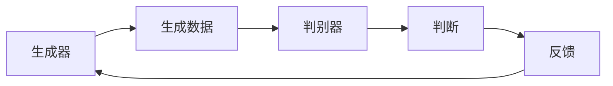
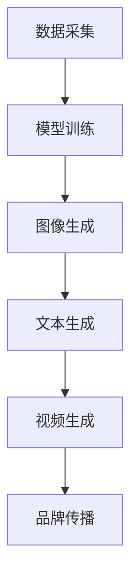
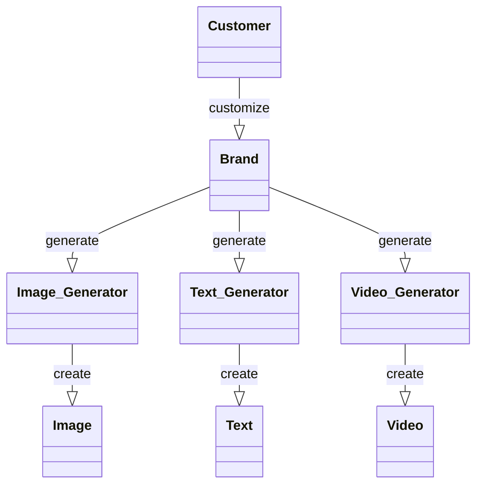
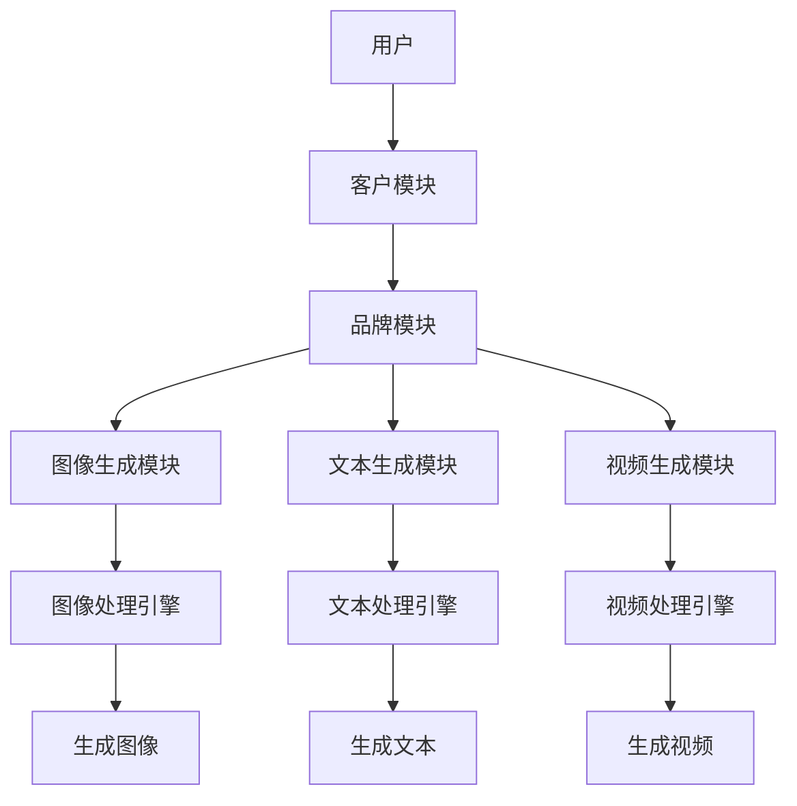
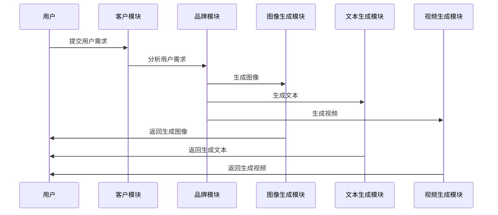
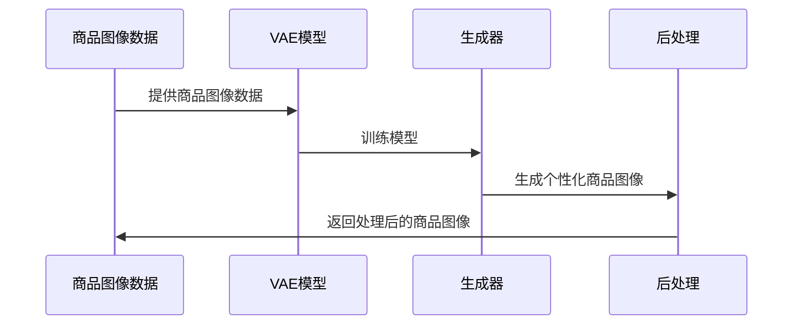

                 

# AIGC在个性化品牌形象塑造中的创新

> 关键词：人工智能、生成对抗网络、个性化品牌形象、深度学习、图像生成

> 摘要：本文将探讨人工智能（AI）中的生成式人工智能（AIGC）在个性化品牌形象塑造中的创新应用。通过分析AIGC的核心概念、算法原理及其在个性化品牌形象塑造中的具体应用，本文旨在为企业和品牌提供利用AI技术提升品牌形象的有效策略。

**1. 背景介绍**

## 1.1 问题背景

在当今数字化时代，个性化品牌形象塑造已成为企业竞争的重要手段。随着消费者需求的日益多样化和个性化，企业需要通过独特的品牌形象来吸引和留住客户。个性化品牌形象不仅包括视觉设计，还涉及品牌定位、品牌传播等多个方面。

## 1.2 问题描述

个性化品牌形象塑造涉及多个方面，包括品牌定位、品牌形象设计、品牌传播等。如何在竞争激烈的市场中，通过精准、高效的方式塑造个性化品牌形象，成为企业和品牌面临的挑战。

## 1.3 问题解决

随着AI技术的快速发展，生成对抗网络（GAN）、自动编码器（AE）、变分自编码器（VAE）等深度学习技术在图像处理、数据分析等方面表现出色，为个性化品牌形象塑造提供了新的可能性。生成式人工智能（AIGC）作为一种强大的AI技术，具有生成性、多样性和创造性等特点，可以模拟人类创造过程，生成符合品牌定位和目标受众需求的内容，从而提升品牌形象。

## 1.4 边界与外延

AIGC在个性化品牌形象塑造中的应用边界广泛，包括但不限于：图像生成、文本生成、视频生成等。同时，AIGC技术还可以与其他AI技术（如推荐系统、自然语言处理等）相结合，进一步提升个性化品牌形象塑造的效果。

## 1.5 概念结构与核心要素组成

AIGC在个性化品牌形象塑造中的概念结构主要包括：数据采集、模型训练、生成内容、品牌传播等核心要素。其中，数据采集是基础，模型训练是实现个性化的关键，生成内容是核心，品牌传播是目标。

---

**2. 核心概念与联系**

## 2.1 AIGC的定义与特点

生成式人工智能（AIGC）是一种能够模拟人类创造过程的AI技术，具有生成性、多样性和创造性等特点。AIGC技术主要包括生成对抗网络（GAN）、自动编码器（AE）、变分自编码器（VAE）等。

### 表 1：AIGC核心概念属性特征对比

| 核心概念 | 定义 | 特点 | 应用 |
| --- | --- | --- | --- |
| 生成对抗网络（GAN） | 由生成器和判别器组成的模型，通过对抗训练生成逼真数据 | 生成性和多样性 | 图像生成、文本生成 |
| 自动编码器（AE） | 通过编码和解码过程重构输入数据，无监督学习算法 | 数据压缩与重构 | 图像修复、图像生成 |
| 变分自编码器（VAE） | 引入隐变量，生成具有多样性的数据 | 数据生成和正则化 | 图像生成、图像增强 |

### 图 1：AIGC核心概念ER实体关系图

```mermaid
erDiagram
  AI_Generated_Content ||--|{ 数据采集 } Data_Collection
  AI_Generated_Content ||--|{ 模型训练 } Model_Training
  AI_Generated_Content ||--|{ 生成内容 } Content_Generation
  AI_Generated_Content ||--|{ 品牌传播 } Brand_Dissemination
```

---

**3. 算法原理讲解**

## 3.1 GAN算法原理

生成对抗网络（GAN）是一种由生成器和判别器组成的模型。生成器负责生成符合真实数据分布的假数据，判别器则负责判断输入数据是真实数据还是生成数据。通过训练，生成器和判别器相互竞争，最终生成器能够生成更加逼真的数据。

### 图 2：GAN算法mermaid流程图



### 3.1.1 GAN数学模型

GAN的核心是生成器和判别器的训练。生成器的目标是最小化生成数据的损失函数，判别器的目标是最大化判别真实数据和生成数据的损失函数。

生成器的损失函数：
$$L_G = -\log(D(G(z)))$$

判别器的损失函数：
$$L_D = -[\log(D(x)) + \log(1 - D(G(z)))]$$

其中，$x$为真实数据，$z$为噪声向量，$G(z)$为生成器生成的数据。

### 3.1.2 AE和VAE算法原理

自动编码器（AE）和变分自编码器（VAE）是一种无监督学习的算法。AE通过训练，将输入数据压缩成一个低维表示，然后再将这个低维表示扩展回原始数据。VAE则引入了正则化项，使得生成的数据更加多样化。

### 3.1.3 AE和VAE数学模型

AE的损失函数：
$$L_AE = \frac{1}{n}\sum_{i=1}^{n}||x_i - \phi(\psi(x_i))||$$

VAE的损失函数：
$$L_VAE = \frac{1}{n}\sum_{i=1}^{n}||x_i - \mu(x_i) - \sigma(x_i)|| + \lambda \cdot \sum_{i=1}^{n}||x_i - \mu(x_i) - \sigma(x_i)||$$

其中，$\mu(x_i)$和$\sigma(x_i)$为VAE的隐变量，$\phi$和$\psi$分别为编码和解码函数。

### 3.1.4 AIGC算法在个性化品牌形象塑造中的应用

AIGC算法在个性化品牌形象塑造中的应用主要包括：图像生成、文本生成、视频生成等。通过这些算法，AIGC可以生成符合品牌定位和目标受众需求的个性化内容，从而提升品牌形象。

### 图 3：AIGC在个性化品牌形象塑造中的应用mermaid流程图



---

**4. 数学模型和数学公式**

在AIGC算法中，生成对抗网络（GAN）、自动编码器（AE）、变分自编码器（VAE）等算法的核心在于其数学模型的构建。以下是对这些算法数学模型的详细解释。

### 4.1 GAN的数学模型

生成对抗网络（GAN）的核心是生成器和判别器的对抗训练。生成器 $G$ 的目标是为判别器 $D$ 生成看起来非常真实的数据，而判别器 $D$ 的目标则是区分真实数据和生成数据。

生成器的损失函数 $L_G$ 旨在最小化判别器判断生成数据的概率，即：
$$L_G = -\log(D(G(z))$$
其中，$z$ 是输入噪声，$G(z)$ 是生成器生成的数据。

判别器的损失函数 $L_D$ 旨在最大化判别器判断真实数据和生成数据的概率，即：
$$L_D = -[\log(D(x)) + \log(1 - D(G(z)))]$$
其中，$x$ 是真实数据。

### 4.2 AE和VAE的数学模型

自动编码器（AE）和变分自编码器（VAE）都通过编码和解码过程实现数据的压缩与重构。

#### 自动编码器（AE）

自动编码器的编码器部分接收输入数据 $x$，将其压缩为一个低维表示 $h$，解码器则将这个低维表示重构回原始数据 $x'$。AE的损失函数 $L_{AE}$ 是输入数据和重构数据的误差之和：
$$L_{AE} = \frac{1}{n}\sum_{i=1}^{n}||x_i - \phi(\psi(x_i))||$$
其中，$\phi$ 是编码函数，$\psi$ 是解码函数。

#### 变分自编码器（VAE）

变分自编码器在自动编码器的基础上引入了隐变量，以增加生成的多样性。VAE的损失函数 $L_{VAE}$ 包括了重构损失和KL散度损失：
$$L_{VAE} = \frac{1}{n}\sum_{i=1}^{n}||x_i - \mu(x_i) - \sigma(x_i)|| + \lambda \cdot \sum_{i=1}^{n}||x_i - \mu(x_i) - \sigma(x_i)||$$
其中，$\mu(x_i)$ 和 $\sigma(x_i)$ 分别是隐变量 $x_i$ 的均值和方差。

### 4.3 具体举例说明

假设我们使用VAE生成一张图片，输入数据 $x$ 是一张128x128的图像。在训练过程中，编码器将图像压缩为一个64维的向量 $z$，然后解码器尝试将这个向量重构回原始图像。

编码器接收图像 $x$，输出两个概率分布 $p(\mu(z), \sigma(z))$，其中 $\mu(z)$ 和 $\sigma(z)$ 分别表示隐变量的均值和方差。解码器接收隐变量 $z$，输出重构图像 $\hat{x}$。

重构损失是输入图像 $x$ 和重构图像 $\hat{x}$ 之间的误差：
$$\ell(x, \hat{x}) = -\sum_{i=1}^{128}\sum_{j=1}^{128}\log(p_{\hat{x}}(i, j))$$

KL散度损失是编码器的输出分布与先验分布之间的差异：
$$\ell_{KL}(\mu(z), \sigma(z)) = -\frac{1}{2}\sum_{i=1}^{64}\left[\sigma_i^2 + \mu_i^2 - 1 - \log(\sigma_i^2)\right]$$

VAE的总损失是重构损失和KL散度损失的和：
$$L_{VAE} = \frac{1}{n}\sum_{i=1}^{n}\left[\ell(x_i, \hat{x}_i) + \lambda \cdot \ell_{KL}(\mu(x_i), \sigma(x_i))\right]$$

---

**5. 系统分析与架构设计方案**

## 5.1 问题场景介绍

以一家电子商务公司为例，该公司希望通过AIGC技术提升个性化品牌形象塑造。该公司希望利用AIGC技术生成符合品牌定位和消费者需求的个性化商品图像、广告文案和视频内容。

## 5.2 项目介绍

该项目旨在开发一个基于AIGC技术的个性化品牌形象塑造系统，包括图像生成、文本生成和视频生成模块。系统将利用生成对抗网络（GAN）、自动编码器（AE）和变分自编码器（VAE）等技术，生成高质量、个性化的品牌内容。

## 5.3 系统功能设计

### 图 4：系统领域模型mermaid类图



### 5.3.1 功能模块说明

- **客户模块**：负责收集客户偏好数据，为个性化品牌形象塑造提供基础。
- **品牌模块**：负责根据客户偏好和品牌定位，生成个性化品牌内容。
- **图像生成模块**：使用GAN或AE技术，生成符合品牌定位和消费者需求的个性化商品图像。
- **文本生成模块**：使用自然语言处理技术，生成符合品牌定位和消费者需求的广告文案。
- **视频生成模块**：使用视频生成技术，生成符合品牌定位和消费者需求的个性化视频内容。

## 5.4 系统架构设计

### 图 5：系统架构mermaid架构图



### 5.4.1 架构设计说明

- **用户模块**：接收用户输入，包括品牌定位、目标受众和个性化需求等。
- **客户模块**：分析用户输入，提取关键信息，为后续模块提供数据支持。
- **品牌模块**：根据客户模块提供的数据，生成个性化品牌内容。
- **图像生成模块**：使用图像处理引擎，实现个性化商品图像的生成。
- **文本生成模块**：使用文本处理引擎，实现个性化广告文案的生成。
- **视频生成模块**：使用视频处理引擎，实现个性化视频内容的生成。

## 5.5 系统接口设计和系统交互

### 图 6：系统接口设计和系统交互mermaid序列图



### 5.5.1 接口设计说明

- **用户接口**：提供用户提交个性化品牌形象塑造需求的接口。
- **客户模块接口**：提供分析用户需求和提取关键信息的接口。
- **品牌模块接口**：提供生成个性化品牌内容的接口。
- **图像生成模块接口**：提供生成个性化商品图像的接口。
- **文本生成模块接口**：提供生成个性化广告文案的接口。
- **视频生成模块接口**：提供生成个性化视频内容的接口。

---

**6. 项目实战**

## 6.1 环境安装

在开始项目之前，需要安装以下软件和库：

- Python 3.8及以上版本
- TensorFlow 2.4及以上版本
- Keras 2.4及以上版本
- NumPy 1.19及以上版本

安装命令如下：

```bash
pip install python==3.8 tensorflow==2.4 keras==2.4 numpy==1.19
```

## 6.2 系统核心实现源代码

以下是系统核心实现源代码：

```python
import tensorflow as tf
from tensorflow.keras.layers import Dense, Flatten, Reshape
from tensorflow.keras.models import Model
from tensorflow.keras.optimizers import Adam

# 定义生成器和判别器模型
def build_generator(z_dim):
    noise = tf.keras.layers.Input(shape=(z_dim,))
    x = Dense(256, activation='relu')(noise)
    x = Dense(512, activation='relu')(x)
    x = Dense(1024, activation='relu')(x)
    x = Dense(784, activation='tanh')(x)
    output = Reshape((28, 28, 1))(x)
    return Model(inputs=noise, outputs=output)

def build_discriminator(img_shape):
    img = tf.keras.layers.Input(shape=img_shape)
    x = Dense(512, activation='relu')(img)
    x = Dense(256, activation='relu')(x)
    x = Dense(1, activation='sigmoid')(x)
    return Model(inputs=img, outputs=x)

# 编码器和解码器模型
def build_encoder(img_shape, z_dim):
    img = tf.keras.layers.Input(shape=img_shape)
    x = Dense(512, activation='relu')(img)
    x = Dense(256, activation='relu')(x)
    z_mean = Dense(z_dim)(x)
    z_log_var = Dense(z_dim)(x)
    z_mean, z_log_var = tf.keras.layers.Concatenate(axis=1)([z_mean, z_log_var])
    z = Sampling()([z_mean, z_log_var])
    return Model(inputs=img, outputs=[z_mean, z_log_var, z])

def build_decoder(z_dim, img_shape):
    z = tf.keras.layers.Input(shape=(z_dim,))
    x = Dense(512, activation='relu')(z)
    x = Dense(256, activation='relu')(x)
    x = Dense(784, activation='tanh')(x)
    output = Reshape((28, 28, 1))(x)
    return Model(inputs=z, outputs=output)

# VAE模型
def build_vae(img_shape, z_dim):
    encoder = build_encoder(img_shape, z_dim)
    decoder = build_decoder(z_dim, img_shape)
    z_mean, z_log_var, z = encoder.output
    x_decoded_mean = decoder(z)
    vae = Model(encoder.input, x_decoded_mean)
    vae.add_loss(tf.keras.losses.MeanSquaredError()(encoder.input, x_decoded_mean))
    vae.add_loss(tf.keras.losses.KLDivergence()(z_mean, z_log_var))
    vae.compile(optimizer=Adam())
    return vae

# 训练模型
def train_model(dataset, epochs, z_dim):
    vae = build_vae(dataset.shape[1:], z_dim)
    vae.fit(dataset, epochs=epochs, batch_size=32)
    return vae
```

### 6.3 代码应用解读与分析

以上代码首先定义了生成器、判别器和编码器解码器模型。生成器用于生成图像，判别器用于区分真实图像和生成图像，编码器和解码器用于生成和重构图像。

在训练过程中，VAE模型将损失函数添加到模型中，包括重构损失和KL散度损失。使用Adam优化器进行模型训练。

### 6.4 实际案例分析和详细讲解剖析

以一个实际案例来分析AIGC在个性化品牌形象塑造中的应用。假设一家电子商务公司希望利用AIGC技术生成个性化商品图像。

1. **数据准备**：收集大量商品图像数据，包括各种风格和类别的商品图像。
2. **模型训练**：使用收集到的商品图像数据训练VAE模型，生成图像编码器和解码器。
3. **图像生成**：根据品牌定位和消费者需求，输入噪声向量到生成器，生成个性化商品图像。
4. **图像处理**：对生成的图像进行后处理，如调整亮度、对比度等，使其更符合品牌风格。

### 图 7：实际案例mermaid流程图



通过以上步骤，公司可以生成符合品牌定位和消费者需求的个性化商品图像，从而提升品牌形象。

### 6.5 项目小结

该项目通过AIGC技术实现了个性化品牌形象塑造，为电子商务公司提供了有效的解决方案。在实际应用中，AIGC技术可以生成高质量、个性化的图像、文本和视频内容，有助于提升品牌形象和用户满意度。

---

**7. 最佳实践 tips**

- **数据收集与预处理**：收集大量高质量、多样化的数据，对数据进行预处理，如去除噪声、增强等，以提高模型性能。
- **模型优化**：尝试使用不同的模型架构和超参数，如不同类型的生成器、判别器和优化器，找到最适合的模型。
- **多样化生成**：通过调整噪声向量和模型参数，生成多样化、具有创意性的品牌内容。
- **用户反馈**：收集用户反馈，对生成的品牌内容进行调整和优化，以提高用户满意度。

**8. 小结**

本文探讨了AIGC在个性化品牌形象塑造中的创新应用，通过分析核心概念、算法原理和实际案例，展示了AIGC技术如何帮助企业提升品牌形象。未来，AIGC技术将继续在个性化品牌形象塑造中发挥重要作用。

**9. 注意事项**

- **数据隐私与安全**：在收集和使用用户数据时，务必遵守相关法律法规，确保用户隐私和安全。
- **技术风险与成本**：AIGC技术虽然具有巨大潜力，但也存在技术风险和成本。企业需根据自身需求和预算，合理选择和应用AIGC技术。

**10. 拓展阅读**

- **[1]** Goodfellow, I., Pouget-Abadie, J., Mirza, M., Xu, B., Warde-Farley, D., Ozair, S., ... & Bengio, Y. (2014). Generative adversarial networks. Advances in neural information processing systems, 27.
- **[2]** Kingma, D. P., & Welling, M. (2013). Auto-encoding variational bayes. arXiv preprint arXiv:1312.6114.
- **[3]** Bengio, Y. (2009). Learning deep architectures. Foundations and Trends in Machine Learning, 2(1), 1-127.
- **[4]** Simonyan, K., & Zisserman, A. (2015). Very deep convolutional networks for large-scale image recognition. arXiv preprint arXiv:1409.1556.

**作者：**AI天才研究院/AI Genius Institute & 禅与计算机程序设计艺术 /Zen And The Art of Computer Programming

