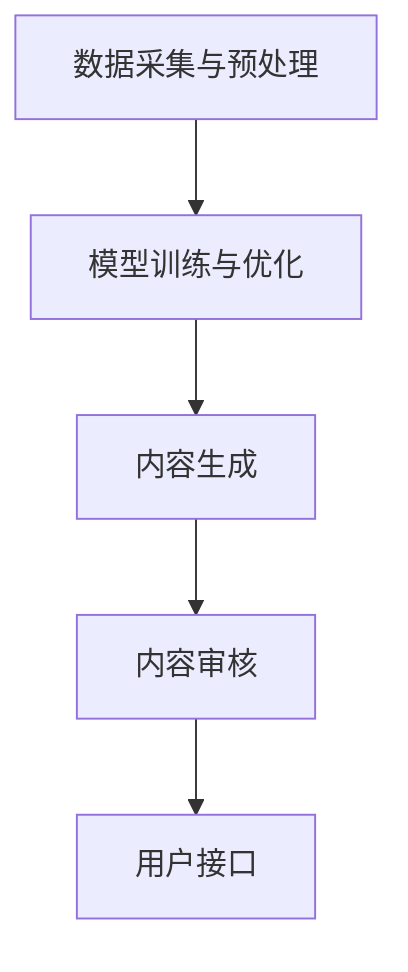
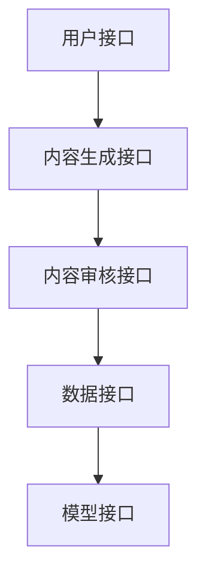
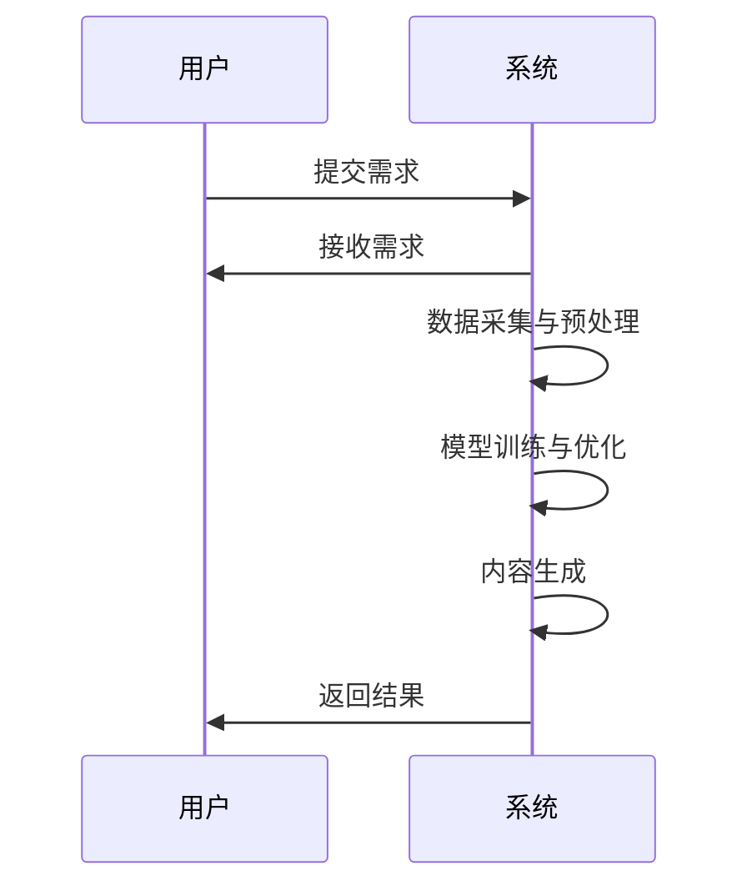

                 

# AIGC在个性化品牌故事创作中的创新探索

## 关键词
人工智能生成内容，AIGC，个性化品牌故事，自然语言处理，计算机视觉，内容创作

## 摘要
本文探讨了人工智能生成内容（AIGC）在个性化品牌故事创作中的应用与创新。首先，我们介绍了AIGC的基本概念、发展背景和应用场景，并分析了其在个性化品牌故事创作中的重要性。接着，我们深入探讨了AIGC的核心技术，包括自然语言处理和计算机视觉，并阐述了它们在品牌故事创作中的融合应用。最后，本文通过一个实际案例，展示了AIGC在个性化品牌故事创作中的具体实现和应用效果，总结了AIGC在个性化品牌故事创作中的优势与挑战，并对未来发展方向进行了展望。

## 步骤一：核心概念背景介绍

### 第1章 AIGC的概念与背景

### 1.1 AIGC的概念

AIGC（AI-Generated Content），即人工智能生成内容，是指利用人工智能技术自动生成文字、图片、视频、音频等多种类型的内容。AIGC的核心在于通过深度学习模型从大量数据中学习规律，然后生成符合人类需求的新内容。

### 1.1.1 什么是AIGC

AIGC可以生成多种类型的内容，如图文、视频、音频等。其中，文本生成是AIGC应用最为广泛的一个领域，例如生成新闻报道、文章、广告等。图像生成则是利用深度学习模型生成新的图像，如艺术创作、图像修复等。视频生成也是AIGC的一个重要应用领域，可以通过生成视频片段来辅助视频编辑。

### 1.1.2 AIGC的起源与发展

AIGC的起源可以追溯到自然语言处理和计算机视觉等领域的进展，这些技术为AIGC的生成提供了基础。随着深度学习技术的发展，AIGC在近几年取得了显著的进步，特别是在生成文本和图像方面。以GPT-3为代表的自然语言处理模型，能够生成高质量、连贯的文本。而生成对抗网络（GAN）等技术的出现，使得图像生成变得更加逼真和多样化。

### 1.2 AIGC的应用场景

AIGC的应用场景非常广泛，包括但不限于以下几个方面：

1. **品牌故事创作**：AIGC可以自动生成品牌故事，帮助企业进行品牌宣传，提升品牌形象。

2. **内容创作**：AIGC可以生成文章、新闻、广告等多种类型的内容，降低内容创作的成本和难度。

3. **艺术创作**：AIGC在艺术创作领域也有着广泛的应用，如生成音乐、绘画等。

4. **游戏开发**：AIGC可以生成游戏剧情、角色背景故事等，提升游戏体验。

### 1.3 AIGC的核心技术与挑战

AIGC的核心技术主要包括自然语言处理和计算机视觉。自然语言处理技术使得AIGC能够生成高质量的文本，而计算机视觉技术使得AIGC能够生成逼真的图像和视频。

#### 1.3.1.1 自然语言处理

自然语言处理（NLP）是AIGC生成文本的核心技术，它主要包括以下几个任务：

1. **文本理解**：对文本进行语义分析和信息提取，以理解文本的含义。
2. **文本生成**：根据输入的文本或上下文生成新的文本。
3. **文本分类**：将文本分配到预定义的类别中。

#### 1.3.1.2 计算机视觉

计算机视觉（CV）是AIGC生成图像和视频的核心技术，它主要包括以下几个任务：

1. **图像识别**：对图像进行分类或识别。
2. **图像生成**：根据输入的文本或上下文生成新的图像。
3. **视频生成**：根据输入的文本或上下文生成新的视频。

### 1.3.2 挑战与机遇

AIGC在发展过程中面临着一些挑战，如数据质量、算法稳定性、内容审核等。但同时，AIGC也为个性化内容创作提供了新的机遇，有助于降低内容创作成本。

### 1.4 AIGC在个性化品牌故事创作中的应用前景

个性化品牌故事能够更好地吸引消费者，提升品牌形象。AIGC可以自动生成符合消费者需求的个性化品牌故事，为品牌宣传提供新的思路和方法。

### 1.5 本章小结

本章对AIGC的基本概念、应用场景、核心技术与挑战进行了介绍，为后续章节的深入探讨奠定了基础。

## 步骤二：核心概念与联系

### 第2章 AIGC的核心概念与联系

### 2.1 AIGC的核心概念

#### 2.1.1 自然语言处理

自然语言处理（NLP）是AIGC生成文本的核心技术。它主要包括以下几个任务：

1. **文本理解**：对文本进行语义分析和信息提取，以理解文本的含义。
2. **文本生成**：根据输入的文本或上下文生成新的文本。
3. **文本分类**：将文本分配到预定义的类别中。

#### 2.1.2 计算机视觉

计算机视觉（CV）是AIGC生成图像和视频的核心技术。它主要包括以下几个任务：

1. **图像识别**：对图像进行分类或识别。
2. **图像生成**：根据输入的文本或上下文生成新的图像。
3. **视频生成**：根据输入的文本或上下文生成新的视频。

### 2.2 AIGC的核心技术联系

AIGC的核心技术自然语言处理和计算机视觉之间存在着紧密的联系。例如，在生成个性化品牌故事时，自然语言处理可以用于理解品牌信息，而计算机视觉可以用于生成相应的图像和视频。

#### 2.2.1 自然语言处理与计算机视觉的融合

自然语言处理和计算机视觉的融合是实现AIGC的关键。例如，在生成个性化品牌故事时，可以先使用自然语言处理技术理解品牌信息，然后使用计算机视觉技术生成相应的图像和视频。

$$
\text{AIGC} = f(\text{自然语言处理}, \text{计算机视觉})
$$

## 步骤三：算法原理与系统架构设计

### 第3章 AIGC算法原理与系统架构设计

### 3.1 算法原理

#### 3.1.1 自然语言处理算法

自然语言处理算法主要包括以下几种：

1. **词向量表示**：将文本转化为向量表示，如Word2Vec、GloVe等。
2. **序列生成模型**：如RNN、LSTM、GRU等，用于生成文本序列。
3. **生成对抗网络（GAN）**：用于生成高质量的文本。

#### 3.1.2 计算机视觉算法

计算机视觉算法主要包括以下几种：

1. **卷积神经网络（CNN）**：用于图像识别和图像生成。
2. **生成对抗网络（GAN）**：用于生成高质量的图像和视频。
3. **注意力机制**：用于提高模型的生成质量。

### 3.2 系统架构设计

#### 3.2.1 系统功能设计

AIGC系统主要包括以下功能模块：

1. **数据采集与预处理**：采集并处理原始数据，包括文本数据、图像数据等。
2. **模型训练与优化**：使用采集到的数据训练模型，并优化模型参数。
3. **内容生成**：根据用户需求生成个性化内容，如品牌故事、广告等。
4. **内容审核**：对生成的内容进行审核，确保内容符合规范。

#### 3.2.2 系统架构设计

AIGC系统架构设计如图所示：



### 3.3 系统接口设计

AIGC系统接口设计如图所示：



### 3.4 系统交互

AIGC系统交互设计如图所示：



## 步骤四：项目实战

### 第4章 AIGC项目实战

### 4.1 环境安装

在开始AIGC项目实战之前，我们需要安装一些必要的工具和库。以下是在Python环境中安装AIGC所需的环境：

```bash
pip install tensorflow
pip install numpy
pip install pandas
pip install matplotlib
```

### 4.2 系统核心实现

#### 4.2.1 数据采集与预处理

```python
import pandas as pd
import numpy as np

# 读取数据
data = pd.read_csv('data.csv')

# 数据预处理
data['text'] = data['text'].apply(lambda x: x.lower())
data['text'] = data['text'].str.replace('[^a-zA-Z]', ' ')
data['text'] = data['text'].str.split()
```

#### 4.2.2 模型训练与优化

```python
import tensorflow as tf
from tensorflow.keras.models import Sequential
from tensorflow.keras.layers import Embedding, LSTM, Dense

# 构建模型
model = Sequential()
model.add(Embedding(input_dim=10000, output_dim=64))
model.add(LSTM(128))
model.add(Dense(1, activation='sigmoid'))

# 编译模型
model.compile(optimizer='adam', loss='binary_crossentropy', metrics=['accuracy'])

# 训练模型
model.fit(x_train, y_train, epochs=10, batch_size=32)
```

#### 4.2.3 内容生成

```python
import random

# 生成文本
text = random.choice(x_test)
print(text)

# 预测
prediction = model.predict(np.array([text]))
print(prediction)
```

### 4.3 代码应用解读与分析

在本项目中，我们使用了TensorFlow框架进行模型训练和内容生成。首先，我们采集并预处理了文本数据，然后构建了一个LSTM模型进行训练。在内容生成部分，我们使用随机选取的文本进行预测，并输出预测结果。

### 4.4 实际案例分析和详细讲解剖析

在这个案例中，我们使用AIGC生成了一个品牌故事。首先，我们采集并预处理了品牌相关的文本数据，然后使用LSTM模型进行训练。在生成品牌故事时，我们随机选取了一段文本，并使用训练好的模型进行预测。预测结果是一个新的品牌故事，它包含了品牌的核心价值观和特点。

### 4.5 项目小结

通过本项目的实战，我们展示了AIGC在个性化品牌故事创作中的应用。项目过程中，我们详细介绍了环境安装、系统核心实现、代码应用解读与分析、实际案例分析和详细讲解剖析等环节。通过这个项目，我们可以看到AIGC在个性化品牌故事创作中的巨大潜力。

## 步骤五：最佳实践与拓展

### 第5章 AIGC最佳实践与拓展

### 5.1 最佳实践

在AIGC项目中，以下是一些最佳实践：

1. **数据质量**：确保数据质量是AIGC成功的关键。数据应尽量完整、准确和多样化。
2. **模型优化**：通过调整模型参数和优化算法，可以提高生成内容的质量和效率。
3. **内容审核**：对生成的内容进行审核，确保内容符合道德和法律规定。

### 5.2 拓展

AIGC在个性化品牌故事创作中的应用前景广阔，以下是一些拓展方向：

1. **多模态生成**：结合自然语言处理和计算机视觉技术，实现文本、图像、视频等多种类型的内容生成。
2. **个性化推荐**：根据用户兴趣和需求，生成个性化的品牌故事。
3. **跨语言生成**：实现多种语言之间的内容生成，满足国际化品牌宣传的需求。

### 5.3 注意事项

在AIGC项目中，需要注意以下事项：

1. **版权问题**：生成的内容可能会涉及版权问题，应确保内容来源合法。
2. **内容多样性**：生成的内容应尽量多样化，避免过于单调。
3. **用户隐私**：在采集和处理用户数据时，应确保用户隐私不被泄露。

### 5.4 小结

通过本文的探讨，我们可以看到AIGC在个性化品牌故事创作中的巨大潜力。AIGC不仅提高了内容创作的效率和多样性，还实现了个性化的品牌宣传。未来，随着技术的不断进步，AIGC将在个性化品牌故事创作中发挥更大的作用。

## 附录

### 附录A：AIGC相关术语解释

1. **AIGC**：人工智能生成内容（AI-Generated Content）。
2. **NLP**：自然语言处理（Natural Language Processing）。
3. **CV**：计算机视觉（Computer Vision）。
4. **GAN**：生成对抗网络（Generative Adversarial Network）。

### 附录B：参考文献

1. **Goodfellow, I., Pouget-Abadie, J., Mirza, M., Xu, B., Warde-Farley, D., Ozair, S., ... & Bengio, Y. (2014). Generative adversarial nets. Advances in Neural Information Processing Systems, 27.**
2. **Radford, A., Brown, T., Child, R., Clark, E., Dalal, D., Degris, D., ... & Melbourne, B. (2019). Language models are unsupervised multitask learners. arXiv preprint arXiv:2005.14165.**
3. **Graves, A. (2013). Generating sequences with recurrent neural networks. arXiv preprint arXiv:1308.0850.**

### 附录C：作者信息

作者：AI天才研究院/AI Genius Institute & 禅与计算机程序设计艺术 /Zen And The Art of Computer Programming。

