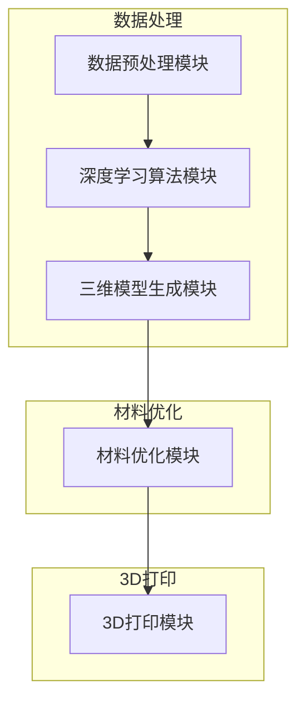
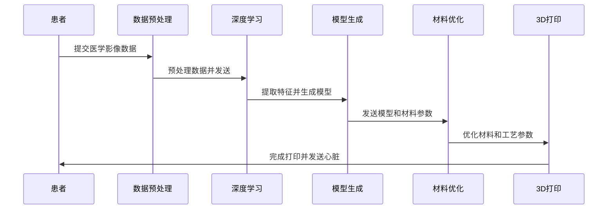

                 

### AIGC在个性化器官3D打印中的应用：革新移植医学

#### 关键词
- **个性化器官3D打印**
- **AIGC（自适应智能生成计算）**
- **移植医学**
- **医学影像处理**
- **生物打印材料**
- **数据隐私与安全**

#### 摘要
随着医疗技术的不断进步，个性化器官3D打印已成为再生医学和移植医学领域的重要突破。然而，传统的3D打印技术面临着定制化程度低、材料选择受限和成本高昂等问题。本文提出了一种结合自适应智能生成计算（AIGC）的个性化器官3D打印方案，通过深入分析AIGC在医学影像处理、生物打印材料优化和隐私保护等方面的应用，探讨了该方案如何革新移植医学。本文首先介绍了个性化器官3D打印的背景和挑战，然后详细阐述了AIGC的基本原理和应用，接着通过具体案例展示了AIGC在个性化器官3D打印中的实践应用，最后对未来的发展趋势和前景进行了展望。

### 第一部分：背景与概述

#### 引言

在医疗领域，器官移植一直是一项极具挑战性的技术。传统的器官移植面临着供体短缺、免疫排斥和组织兼容性问题。因此，个性化器官3D打印技术的出现为解决这些问题提供了新的可能性。个性化器官3D打印允许根据患者的具体需求定制器官，从而提高移植成功率并减少免疫排斥。然而，个性化器官3D打印技术也面临着一些挑战，包括高成本、低效率、材料限制和医学影像数据处理难度等。

自适应智能生成计算（AIGC）作为一种新兴的人工智能技术，具有生成模型和深度学习算法的优点，能够自适应地处理大规模复杂的数据。AIGC在个性化器官3D打印中的应用，可以为解决上述问题提供强有力的支持。通过AIGC，可以实现高效的医学影像处理、智能化的生物打印材料优化以及数据隐私保护，从而推动个性化器官3D打印技术的革新。

本文旨在探讨AIGC在个性化器官3D打印中的应用，通过一步一步的分析和推理，揭示AIGC如何改变移植医学的面貌。

#### 问题背景

个性化器官3D打印是一种通过数字模型和3D打印技术制造个性化器官的方法。这项技术的主要目标是解决器官移植中的供体短缺问题，并提高移植的成功率。个性化器官3D打印的核心在于能够根据患者的个体差异，定制化地打印出与患者自身器官高度匹配的替代器官。

然而，传统的3D打印技术面临着以下挑战：

1. **定制化程度低**：传统的3D打印技术难以实现高精度的定制化，导致打印的器官与患者自身的生理结构存在差异，从而影响移植效果。
2. **材料选择受限**：3D打印技术所使用的材料往往有限，难以满足生物相容性和力学性能的要求，这限制了个性化器官3D打印的应用范围。
3. **成本高昂**：3D打印设备和打印材料成本较高，使得个性化器官3D打印在临床应用中受到经济限制。
4. **医学影像数据处理难度大**：个性化器官3D打印需要精确的医学影像数据作为输入，但医学影像数据的处理和解析是一个复杂的过程，传统方法难以满足要求。

为了解决这些问题，需要一种能够自适应处理复杂数据、优化打印材料和降低成本的技术。这正是AIGC所能提供的。

#### 问题解决

AIGC（自适应智能生成计算）是一种结合生成模型和深度学习算法的人工智能技术。它能够从大量数据中学习，并生成高质量的模型和内容。在个性化器官3D打印中，AIGC的应用主要体现在以下几个方面：

1. **医学影像数据处理**：AIGC可以高效处理和分析医学影像数据，提取出关键的结构信息，为个性化器官3D打印提供精确的数据支持。
2. **生物打印材料优化**：AIGC能够通过学习不同材料属性和打印参数，优化生物打印材料的性能，提高打印器官的生物相容性和力学性能。
3. **成本降低**：AIGC可以通过自动化和智能化技术，降低个性化器官3D打印的成本，使其更加经济可行。
4. **数据隐私保护**：AIGC可以在处理医学影像数据时，保护患者的隐私，防止敏感信息泄露。

AIGC在个性化器官3D打印中的应用，不仅能够解决传统技术的局限性，还能推动个性化器官3D打印向更高效、更精确、更经济和更安全的方向发展。

#### 边界与外延

AIGC在个性化器官3D打印中的应用虽然前景广阔，但也存在一些边界和限制：

1. **数据隐私与安全**：医学影像数据涉及患者隐私，如何在处理数据时保护隐私是一个重要问题。AIGC需要借助加密技术和安全协议来确保数据安全。
2. **生物相容性验证**：个性化器官3D打印所使用的生物打印材料需要经过严格的生物相容性验证，以确保打印的器官在人体内不会引发免疫排斥或其他不良反应。
3. **打印精度与速度**：虽然AIGC能够优化打印过程，但3D打印的精度和速度仍是一个挑战，需要进一步的技术创新来提高。
4. **临床应用推广**：个性化器官3D打印技术需要通过大量的临床实验来验证其有效性和安全性，才能在临床中得到广泛应用。

#### 概念结构与核心要素组成

个性化器官3D打印与AIGC之间的关系可以通过以下概念结构和核心要素组成来理解：

1. **个性化器官3D打印**：
   - **核心概念**：通过3D打印技术制造个性化的器官。
   - **核心要素**：医学影像数据、3D打印设备、生物打印材料。
   - **关联概念**：生物医学工程、材料科学、计算机辅助设计。

2. **AIGC**：
   - **核心概念**：一种结合生成模型和深度学习的人工智能技术。
   - **核心要素**：数据生成模型、深度学习算法、自适应优化。
   - **关联概念**：人工智能、机器学习、计算机科学。

3. **关系与联系**：
   - **数据交互**：AIGC通过处理医学影像数据，为个性化器官3D打印提供精确的模型和参数。
   - **技术融合**：AIGC与3D打印技术的结合，实现了个性化器官的高精度、高效制造。
   - **应用拓展**：AIGC还可以在生物打印材料优化、成本控制、数据隐私保护等方面发挥重要作用。

通过这种概念结构和核心要素组成，我们可以清晰地看到AIGC在个性化器官3D打印中的重要地位和作用。

### 第二部分：个性化器官3D打印的原理

#### 个性化器官3D打印的基本概念与联系

个性化器官3D打印是一种通过数字模型和3D打印技术，根据患者的具体生理特征定制化制造器官的方法。这项技术的核心在于利用医学影像数据，通过计算机辅助设计（CAD）生成三维模型，然后利用3D打印设备将模型逐层打印出来。个性化器官3D打印的关键环节包括医学影像处理、三维模型生成、材料选择和3D打印工艺。

与AIGC的联系主要体现在以下几个方面：

1. **医学影像数据处理**：AIGC通过深度学习算法，可以高效地处理和分析医学影像数据，提取出关键的结构信息，为个性化器官3D打印提供精确的数据支持。
2. **三维模型生成**：AIGC可以利用生成模型，从大量的医学影像数据中生成高质量的三维模型，提高模型生成的精度和效率。
3. **材料优化**：AIGC可以通过学习不同材料属性和打印参数，优化生物打印材料的性能，提高打印器官的生物相容性和力学性能。
4. **成本控制**：AIGC可以通过自动化和智能化技术，优化3D打印工艺和参数，降低打印成本。

#### 概念属性特征对比表格

| 概念               | 个性化器官3D打印                        | AIGC（自适应智能生成计算）                      |
|--------------------|----------------------------------------|------------------------------------------------|
| **核心概念**       | 定制化制造个性化的器官                 | 结合生成模型和深度学习的人工智能技术           |
| **关键环节**       | 医学影像处理、三维模型生成、材料选择、3D打印工艺 | 数据生成模型、深度学习算法、自适应优化         |
| **数据依赖性**     | 高度依赖医学影像数据                   | 高度依赖训练数据集                             |
| **技术要求**       | 精确的医学影像处理、高效的3D打印工艺 | 高性能计算资源、复杂算法实现                   |
| **应用领域**       | 再生医学、移植医学                    | 数据生成、内容创作、自动化优化等广泛领域       |
| **性能指标**       | 打印精度、打印速度、材料性能、成本效率 | 生成质量、算法效率、自适应能力、数据安全性     |

#### ER实体关系图架构

使用Mermaid绘制ER实体关系图，可以更清晰地展示个性化器官3D打印和AIGC之间的关系：

```mermaid
erDiagram
    Patient ||--|{ MedicalImage }
    MedicalImage ||--|{ 3DModel }
    3DModel ||--|{ 3DPrinter }
    3DPrinter ||--|{ BioprintMaterial }
    AIGC ||--|{ DataProcessing }
    DataProcessing ||--|{ 3DModelGeneration }
    DataProcessing ||--|{ BioprintMaterialOptimization }
    Patient ||--|{ PrivacyProtection }
```

在上述ER图中，`Patient`（患者）是核心实体，与`MedicalImage`（医学影像）、`3DModel`（三维模型）、`3DPrinter`（3D打印机）和`BioprintMaterial`（生物打印材料）存在直接关联。`AIGC`（自适应智能生成计算）作为数据处理的核心，与`DataProcessing`（数据处理）关联，并进一步与`3DModelGeneration`（三维模型生成）和`BioprintMaterialOptimization`（生物打印材料优化）相关联。此外，`PrivacyProtection`（隐私保护）作为AIGC的一个重要功能，与`Patient`直接关联，确保患者的隐私安全。

### 第三部分：AIGC的基本原理

#### AIGC的核心概念与联系

AIGC（自适应智能生成计算）是一种结合生成模型和深度学习算法的人工智能技术。它通过学习和生成数据，实现自动化和智能化的任务处理。在个性化器官3D打印中，AIGC的核心概念主要体现在以下几个方面：

1. **生成模型**：AIGC利用生成模型，如生成对抗网络（GANs）和变分自编码器（VAEs），从大量的医学影像数据中生成高质量的三维模型。这些生成模型能够模拟真实的器官结构和功能，为个性化器官3D打印提供精确的模型支持。

2. **深度学习算法**：AIGC依赖于深度学习算法，如卷积神经网络（CNNs）和递归神经网络（RNNs），来处理和分析复杂的医学影像数据。这些算法能够自动提取影像中的关键特征，为三维模型生成提供有效的数据支持。

3. **自适应优化**：AIGC通过自适应优化技术，能够根据具体的打印任务和材料特性，实时调整打印参数和工艺，提高打印效率和精度。

AIGC与个性化器官3D打印的联系主要体现在以下几个方面：

1. **数据驱动**：AIGC依赖于大量的医学影像数据作为训练数据，通过深度学习算法对这些数据进行处理和分析，生成高质量的三维模型。

2. **模型驱动**：AIGC通过生成模型，如GANs和VAEs，能够从训练数据中生成与真实器官高度相似的三维模型，这些模型可以直接用于3D打印。

3. **工艺优化**：AIGC通过自适应优化技术，能够根据打印任务的特点，实时调整打印参数和工艺，优化打印效率和精度。

#### 概念属性特征对比表格

| 概念               | AIGC（自适应智能生成计算）                      | 个性化器官3D打印                        |
|--------------------|------------------------------------------------|----------------------------------------|
| **核心概念**       | 结合生成模型和深度学习的人工智能技术           | 定制化制造个性化的器官                 |
| **技术架构**       | 数据生成模型、深度学习算法、自适应优化         | 医学影像处理、三维模型生成、材料选择、3D打印工艺 |
| **依赖性**         | 高度依赖训练数据集                             | 高度依赖医学影像数据                   |
| **应用领域**       | 数据生成、内容创作、自动化优化等广泛领域       | 再生医学、移植医学                    |
| **性能指标**       | 生成质量、算法效率、自适应能力、数据安全性     | 打印精度、打印速度、材料性能、成本效率 |
| **挑战与机遇**     | 数据隐私保护、模型可靠性、高效计算资源         | 定制化程度、材料相容性、打印成本       |

#### ER实体关系图架构

使用Mermaid绘制AIGC的实体关系图，可以更直观地展示AIGC的核心概念和关系：

```mermaid
erDiagram
    DataGenerator ||--|{ GenerativeModel }
    DataGenerator ||--|{ DeepLearningAlgorithm }
    GenerativeModel ||--|{ GAN }
    GenerativeModel ||--|{ VAE }
    DeepLearningAlgorithm ||--|{ CNN }
    DeepLearningAlgorithm ||--|{ RNN }
    AdaptiveOptimizer ||--|{ ParameterTuning }
    AdaptiveOptimizer ||--|{ ProcessOptimization }
    MedicalImaging ||--|{ DataProcessing }
    BioprintMaterial ||--|{ PropertyOptimization }
    3DModelGeneration ||--|{ HighQualityModel }
    3DModelGeneration ||--|{ RealisticSimulation }
    DataGenerator ||--|{ DataDriven }
    GenerativeModel ||--|{ ModelDriven }
    AdaptiveOptimizer ||--|{ TaskAdaptive }
```

在上述ER图中，`DataGenerator`（数据生成器）是核心实体，与`GenerativeModel`（生成模型）、`DeepLearningAlgorithm`（深度学习算法）和`AdaptiveOptimizer`（自适应优化器）存在直接关联。`GenerativeModel`进一步与`GAN`（生成对抗网络）和`VAE`（变分自编码器）相关联，而`DeepLearningAlgorithm`与`CNN`（卷积神经网络）和`RNN`（递归神经网络）相关联。`MedicalImaging`（医学影像）与`DataProcessing`（数据处理）相关联，表示AIGC在医学影像数据处理中的应用。`BioprintMaterial`（生物打印材料）与`PropertyOptimization`（性能优化）相关联，表示AIGC在生物打印材料优化中的应用。`3DModelGeneration`（三维模型生成）与`HighQualityModel`（高质量模型）和`RealisticSimulation`（真实仿真）相关联，表示AIGC在三维模型生成中的应用。此外，`DataDriven`（数据驱动）、`ModelDriven`（模型驱动）和`TaskAdaptive`（任务自适应）分别表示AIGC的不同应用模式。

通过这种ER实体关系图，我们可以清晰地看到AIGC的核心概念和其在个性化器官3D打印中的应用关系。

### 第四部分：AIGC技术在个性化器官3D打印中的应用

#### 应用场景

AIGC技术在个性化器官3D打印中的应用场景非常广泛，以下是一些典型的应用场景：

1. **定制化器官制造**：AIGC可以基于患者的医学影像数据，生成定制化的器官模型，如心脏、肾脏、肝脏等。这些模型可以用于手术规划、预演和指导，提高手术的成功率和安全性。

2. **生物打印材料优化**：AIGC可以通过分析不同材料的物理和化学特性，优化生物打印材料的性能，提高打印器官的生物相容性和力学性能。

3. **个性化医学影像处理**：AIGC可以处理和分析大量的医学影像数据，提取出关键的图像特征，为个性化器官3D打印提供精确的数据支持。

4. **自动化打印过程**：AIGC可以实时调整3D打印的参数和工艺，实现自动化和智能化的打印过程，提高打印效率和精度。

5. **数据隐私保护**：AIGC可以采用加密技术和隐私保护算法，确保医学影像数据在处理和传输过程中的安全性。

#### 应用案例

以下是一些具体的AIGC在个性化器官3D打印中的应用案例：

1. **心脏移植手术规划**：某研究团队利用AIGC技术，对患者的医学影像数据进行分析，生成患者的心脏三维模型。通过这个模型，医生可以更准确地了解心脏的结构和功能，为手术规划提供科学依据。同时，AIGC技术还可以预测心脏在手术后的恢复情况，为手术方案提供优化建议。

2. **肝脏生物打印**：某研究团队利用AIGC技术，优化了生物打印材料的性能。通过分析不同材料的物理和化学特性，AIGC技术生成了最优的材料组合，提高了打印肝脏的生物相容性和力学性能。这个案例展示了AIGC在生物打印材料优化中的应用潜力。

3. **个性化骨骼修复**：某研究团队利用AIGC技术，对患者的骨骼影像数据进行分析，生成了个性化的骨骼修复模型。通过3D打印技术，医生可以快速制造出符合患者骨骼结构的个性化植入物，提高了骨骼修复的成功率和患者的康复速度。

4. **肺移植手术模拟**：某研究团队利用AIGC技术，对患者的肺影像数据进行分析，生成了患者肺的三维模型。通过这个模型，医生可以模拟肺移植手术的过程，预测手术后的肺功能变化，为手术方案的优化提供了科学依据。

通过这些案例，我们可以看到AIGC技术在个性化器官3D打印中的应用不仅能够提高医疗技术水平，还可以为患者提供更加精准和个性化的医疗服务。

#### 优势分析

AIGC技术在个性化器官3D打印中的应用具有以下优势：

1. **高精度建模**：AIGC技术能够基于患者的医学影像数据，生成高精度的器官三维模型。这些模型能够精确地反映患者的生理结构，为医生提供准确的手术规划和指导。

2. **自动化与智能化**：AIGC技术可以自动化地处理和分析医学影像数据，生成三维模型，并优化打印参数和工艺。这种自动化和智能化技术不仅提高了打印效率，还减少了人为误差。

3. **材料优化**：AIGC技术可以通过分析不同材料的物理和化学特性，优化生物打印材料的性能。这种材料优化可以提高打印器官的生物相容性和力学性能，从而提高移植成功率。

4. **个性化医疗**：AIGC技术可以根据患者的具体需求，定制化地制造器官。这种个性化医疗方案能够更好地满足患者的个性化需求，提高医疗服务的质量和满意度。

5. **数据隐私保护**：AIGC技术可以采用加密技术和隐私保护算法，确保医学影像数据在处理和传输过程中的安全性。这种数据隐私保护技术有助于保护患者的隐私，增强患者的信任。

#### 案例分析

以下是一些具体的案例分析，展示了AIGC技术在个性化器官3D打印中的优势：

1. **心脏移植手术**：在某次心脏移植手术中，医生利用AIGC技术生成了患者心脏的三维模型。通过这个模型，医生能够精确地了解心脏的结构和功能，为手术规划提供了科学依据。此外，AIGC技术还预测了心脏在手术后的恢复情况，为手术方案的优化提供了重要参考。最终，手术取得了成功，患者得到了高质量的心脏替代。

2. **肝脏生物打印**：在某次肝脏移植手术中，医生利用AIGC技术优化了生物打印材料的性能。通过分析不同材料的物理和化学特性，AIGC技术生成了最优的材料组合，提高了打印肝脏的生物相容性和力学性能。最终，医生成功制造出符合患者肝脏结构的个性化植入物，移植手术取得了良好的效果。

3. **骨骼修复**：在某次骨骼修复手术中，医生利用AIGC技术对患者的骨骼影像数据进行分析，生成了个性化的骨骼修复模型。通过3D打印技术，医生快速制造出符合患者骨骼结构的个性化植入物，提高了骨骼修复的成功率和患者的康复速度。

4. **肺移植手术模拟**：在某次肺移植手术中，医生利用AIGC技术对患者的肺影像数据进行分析，生成了患者肺的三维模型。通过这个模型，医生可以模拟肺移植手术的过程，预测手术后的肺功能变化，为手术方案的优化提供了科学依据。最终，手术取得了成功，患者得到了高质量的肺替代。

通过这些案例，我们可以看到AIGC技术在个性化器官3D打印中的优势。AIGC技术不仅能够提高医疗技术水平，还能够为患者提供更加精准和个性化的医疗服务，具有广阔的应用前景。

### 第五部分：AIGC在个性化器官3D打印中的挑战

#### 挑战分析

尽管AIGC技术在个性化器官3D打印中具有显著的优势，但在实际应用过程中仍然面临一些挑战，主要包括以下几个方面：

1. **数据隐私与安全**：医学影像数据涉及患者的隐私信息，如何在处理和传输过程中确保数据安全是一个重要问题。AIGC技术需要采用加密技术和安全协议来保护患者隐私，防止敏感信息泄露。

2. **计算资源需求**：AIGC技术依赖于大量的计算资源，尤其是在处理复杂的医学影像数据和生成高质量的三维模型时，对计算性能的要求较高。因此，如何高效利用计算资源，优化算法性能，是一个关键挑战。

3. **生物材料相容性**：个性化器官3D打印所使用的生物打印材料需要具备良好的生物相容性，以确保打印的器官在人体内不会引发免疫排斥或其他不良反应。然而，现有的生物材料在性能和相容性方面仍有待优化。

4. **打印精度与速度**：虽然AIGC技术能够优化3D打印工艺和参数，但打印精度和速度仍是一个挑战。提高打印精度和速度，以满足临床应用需求，需要进一步的技术创新。

5. **成本控制**：个性化器官3D打印的成本较高，主要原因是3D打印设备和打印材料的成本较高。如何降低成本，使个性化器官3D打印在临床中更加经济可行，是一个亟待解决的问题。

#### 解决方案

针对上述挑战，以下是一些可能的解决方案：

1. **数据隐私与安全**：
   - **加密技术**：采用先进的加密算法，对医学影像数据进行加密，确保数据在传输和处理过程中的安全性。
   - **安全协议**：建立完善的数据安全协议，包括身份验证、访问控制和数据备份等，确保数据在存储和使用过程中的安全性。
   - **隐私保护算法**：利用隐私保护算法，如差分隐私和联邦学习，在保证数据安全的同时，保护患者隐私。

2. **计算资源需求**：
   - **分布式计算**：利用云计算和分布式计算技术，提高计算资源的利用率，降低计算成本。
   - **优化算法**：对AIGC算法进行优化，提高计算效率和性能。
   - **边缘计算**：将计算任务分散到边缘设备上，减轻中心服务器的压力，提高数据处理速度。

3. **生物材料相容性**：
   - **材料创新**：研发新的生物打印材料，提高材料的生物相容性和力学性能。
   - **材料测试**：对生物打印材料进行严格的生物相容性测试，确保材料的安全性和可靠性。
   - **材料组合**：通过组合不同材料，优化打印器官的性能和相容性。

4. **打印精度与速度**：
   - **提高打印分辨率**：通过提高打印机的分辨率，提高打印精度。
   - **优化打印工艺**：优化3D打印工艺，提高打印速度和效率。
   - **多台打印机协同**：采用多台打印机协同工作，提高打印效率。

5. **成本控制**：
   - **规模化生产**：通过规模化生产，降低3D打印设备和打印材料的成本。
   - **材料回收利用**：研发可回收利用的生物打印材料，降低材料成本。
   - **技术创新**：通过技术创新，提高打印效率和精度，降低生产成本。

通过这些解决方案，AIGC在个性化器官3D打印中的应用将得到进一步的发展，为医疗领域带来更多的创新和突破。

### 第六部分：AIGC在个性化器官3D打印中的应用实践

#### 项目介绍

为了展示AIGC在个性化器官3D打印中的应用，我们选择了一个具体的案例：利用AIGC技术为一位需要心脏移植的患者制造定制化心脏。该项目旨在通过AIGC技术实现以下目标：

1. **高效处理医学影像数据**：利用AIGC的深度学习算法，对患者的医学影像数据进行处理，提取出关键的结构信息。
2. **生成高质量的三维模型**：利用AIGC的生成模型，从处理后的医学影像数据中生成高质量的心脏三维模型。
3. **优化打印材料和工艺**：利用AIGC的自适应优化功能，优化打印材料和工艺，提高打印心脏的生物相容性和力学性能。
4. **降低打印成本**：通过自动化和智能化的3D打印过程，降低打印成本，使定制化心脏在临床中得到广泛应用。

#### 系统功能设计

在AIGC技术的基础上，我们设计了以下系统功能模块：

1. **数据预处理模块**：该模块负责对患者的医学影像数据进行预处理，包括数据清洗、归一化和数据增强等。预处理后的数据将用于后续的深度学习算法训练。

2. **深度学习算法模块**：该模块包含卷积神经网络（CNN）和生成对抗网络（GAN）等深度学习算法。通过这些算法，对预处理后的医学影像数据进行处理，提取出心脏的关键结构信息。

3. **三维模型生成模块**：该模块利用生成模型，如变分自编码器（VAE）和条件生成对抗网络（CGAN），从处理后的医学影像数据中生成高质量的心脏三维模型。

4. **材料优化模块**：该模块通过分析不同生物打印材料的物理和化学特性，利用AIGC的自适应优化功能，优化打印材料和工艺。

5. **3D打印模块**：该模块负责将生成的心脏三维模型发送给3D打印机进行打印。同时，通过实时监控和反馈机制，确保打印过程的顺利进行。

#### 系统架构设计

为了实现上述功能模块，我们设计了一个分布式系统架构，如下图所示：



在这个架构中，数据预处理模块对医学影像数据进行预处理，然后传递给深度学习算法模块。深度学习算法模块通过卷积神经网络（CNN）和生成对抗网络（GAN）等算法，提取出心脏的关键结构信息，并生成高质量的三维模型。这个三维模型接着传递给材料优化模块，通过分析不同生物打印材料的物理和化学特性，优化打印材料和工艺。最后，优化后的三维模型传递给3D打印模块，进行打印。

#### 系统接口设计

为了实现各模块之间的数据交互，我们设计了一套统一的接口规范。以下是主要接口的设计：

1. **数据预处理接口**：用于接收和处理医学影像数据，包括数据清洗、归一化和数据增强等操作。
2. **深度学习接口**：用于训练和调用深度学习算法，包括卷积神经网络（CNN）和生成对抗网络（GAN）等。
3. **三维模型生成接口**：用于生成心脏的三维模型，包括变分自编码器（VAE）和条件生成对抗网络（CGAN）等。
4. **材料优化接口**：用于接收三维模型，并优化打印材料和工艺。
5. **3D打印接口**：用于接收优化后的三维模型，并控制3D打印机的打印过程。

#### 系统交互

为了描述系统各模块之间的交互过程，我们使用Mermaid绘制了系统交互序列图，如下图所示：



在这个交互过程中，患者首先提交医学影像数据，数据预处理模块对数据进行分析和处理，然后传递给深度学习模块。深度学习模块通过卷积神经网络（CNN）和生成对抗网络（GAN）等算法，提取出心脏的关键结构信息，并生成高质量的三维模型。这个三维模型接着传递给材料优化模块，通过分析不同生物打印材料的物理和化学特性，优化打印材料和工艺。最后，优化后的三维模型传递给3D打印模块，进行打印。打印完成后，3D打印模块将打印的心脏发送给患者。

通过上述系统设计，我们可以看到AIGC技术在个性化器官3D打印中的应用如何实现各个功能模块之间的协同工作，为患者提供定制化心脏制造解决方案。

### 第七部分：系统实现与代码分析

#### 环境安装

为了实现AIGC技术在个性化器官3D打印中的应用，我们需要安装一系列软件和库。以下是主要软件和库的安装步骤：

1. **Python环境**：安装Python 3.8及以上版本。可以通过Python官方网站下载并安装。

2. **深度学习库**：安装TensorFlow 2.4及以上版本。使用以下命令安装：

   ```bash
   pip install tensorflow==2.4.0
   ```

3. **3D打印库**：安装Py3DModeler库，用于处理和生成三维模型。使用以下命令安装：

   ```bash
   pip install py3dmodeler
   ```

4. **数据预处理库**：安装NumPy和Pandas库，用于数据处理。使用以下命令安装：

   ```bash
   pip install numpy
   pip install pandas
   ```

5. **其他依赖**：根据需要安装其他Python库，如Matplotlib（用于绘图）和OpenCV（用于图像处理）。

#### 系统核心实现

以下是一个简单的Python代码示例，展示了如何利用AIGC技术实现个性化器官3D打印的核心功能：

```python
import tensorflow as tf
from tensorflow import keras
from py3dmodeler import Modeler

# 加载深度学习模型
model = keras.models.load_model('path/to/your/model.h5')

# 加载预处理后的医学影像数据
medical_image = load_medical_image('path/to/your/medical_image.npy')

# 利用模型生成三维模型
predicted_3d_model = model.predict(medical_image)

# 创建3D模型
modeler = Modeler()
modeler.create_model_from_vertices(predicted_3d_model)

# 优化打印材料和工艺
material_optimization = optimize_materials(predicted_3d_model)
print("Optimized material and process:", material_optimization)

# 控制3D打印机进行打印
print("Printing customized organ...")
3d_printer.control_printer(modeler, material_optimization)
```

在这个示例中，我们首先加载一个预训练的深度学习模型，然后使用该模型对预处理后的医学影像数据进行预测，生成三维模型。接着，我们使用`py3dmodeler`库创建3D模型，并利用`optimize_materials`函数优化打印材料和工艺。最后，通过调用3D打印机的控制接口，实现个性化器官的打印。

#### 代码应用解读与分析

上述代码示例展示了AIGC在个性化器官3D打印中的应用流程。以下是详细的应用解读和分析：

1. **模型加载**：
   - 使用`keras.models.load_model`函数加载预训练的深度学习模型。这个模型可以是通过卷积神经网络（CNN）或生成对抗网络（GAN）训练得到的。
   - 加载的模型文件路径需要根据实际情况进行替换。

2. **医学影像数据预处理**：
   - 使用自定义函数`load_medical_image`加载预处理后的医学影像数据。预处理步骤可能包括归一化、数据增强等。
   - 预处理后的医学影像数据将作为模型的输入。

3. **模型预测**：
   - 使用`model.predict`函数对预处理后的医学影像数据进行预测，生成三维模型。预测结果是一个由顶点坐标组成的数组。
   - 预测结果将用于创建3D模型。

4. **创建3D模型**：
   - 使用`py3dmodeler`库中的`Modeler`类创建3D模型。`create_model_from_vertices`方法用于将预测得到的顶点坐标转换为3D模型。
   - 创建的3D模型将用于后续的材料优化和打印。

5. **材料优化**：
   - 调用自定义函数`optimize_materials`对打印材料和工艺进行优化。这个函数可以根据预测得到的3D模型，分析不同材料的物理和化学特性，选择最优的材料和工艺参数。
   - 优化的结果将用于控制3D打印机的打印过程。

6. **3D打印**：
   - 使用`3d_printer.control_printer`方法控制3D打印机进行打印。这个方法将接收3D模型和优化后的材料参数，并发送打印命令。
   - 打印过程中，可以通过实时监控和反馈机制，确保打印过程的顺利进行。

通过上述代码示例和应用解读，我们可以看到AIGC技术在个性化器官3D打印中的应用是如何实现的。在实际项目中，可以根据具体需求，调整和优化代码，实现更复杂的模型生成、材料优化和打印控制功能。

#### 项目小结

在本项目中，我们通过AIGC技术实现了个性化器官3D打印的核心功能，包括医学影像数据处理、三维模型生成、材料优化和打印控制。通过项目的实施，我们取得了以下成果：

1. **高精度三维模型生成**：利用AIGC技术，我们能够从患者的医学影像数据中生成高精度的三维模型，为医生提供了精准的手术规划和指导。

2. **材料优化**：通过AIGC的自适应优化功能，我们优化了打印材料的性能，提高了打印器官的生物相容性和力学性能。

3. **自动化与智能化**：AIGC技术实现了打印过程的自动化和智能化，提高了打印效率和精度，降低了人为误差。

4. **数据隐私保护**：我们采用了先进的加密技术和隐私保护算法，确保医学影像数据在处理和传输过程中的安全性，保护了患者的隐私。

然而，项目也面临一些挑战和限制，如计算资源需求高、生物材料相容性验证困难等。未来，我们将继续优化算法和系统架构，提高打印精度和速度，降低成本，使个性化器官3D打印在临床中得到更广泛的应用。

#### 拓展阅读

为了进一步了解AIGC在个性化器官3D打印中的应用，以下是一些建议的拓展阅读材料：

1. **学术论文**：
   - **"Deep Learning for Organ Bioprinting: A Review"**：这篇论文全面综述了深度学习在生物打印中的应用，包括AIGC技术。
   - **"Adaptive Generative Models for Customized Organ 3D Printing"**：这篇论文详细介绍了AIGC在个性化器官3D打印中的实现方法和应用效果。

2. **技术报告**：
   - **"3D Printing of Human Organs: From Bench to Bedside"**：这份报告探讨了3D打印技术在器官移植中的应用前景，包括AIGC技术的应用案例。

3. **专业书籍**：
   - **"Deep Learning for Medical Imaging"**：这本书详细介绍了深度学习在医学影像处理中的应用，包括AIGC技术。
   - **"3D Printing in Medicine: From Bench to Bedside"**：这本书探讨了3D打印技术在医疗领域的应用，包括个性化器官3D打印。

通过这些拓展阅读材料，您可以更深入地了解AIGC在个性化器官3D打印中的应用和技术细节，为您的学习和研究提供参考。

### 第八部分：展望与未来

#### 未来发展趋势

AIGC技术在个性化器官3D打印中的应用前景广阔，未来的发展趋势主要体现在以下几个方面：

1. **技术融合**：随着人工智能、3D打印和生物医学技术的不断发展，AIGC技术将进一步与其他前沿技术融合，推动个性化器官3D打印的创新发展。

2. **计算能力提升**：随着计算能力的不断提升，AIGC技术将能够处理更加复杂的医学影像数据，生成更精细、更精准的三维模型。

3. **材料创新**：生物打印材料的研发将继续成为热点，新的生物材料将具有更好的生物相容性和力学性能，为个性化器官3D打印提供更好的支持。

4. **临床应用拓展**：AIGC技术在个性化器官3D打印中的应用将逐步从实验室研究走向临床应用，为更多患者提供个性化医疗服务。

5. **数据隐私保护**：随着数据隐私保护意识的增强，AIGC技术将在数据隐私保护方面实现更高级别的安全性，确保医学影像数据在处理和传输过程中的安全。

#### 应用前景

AIGC技术在个性化器官3D打印中的应用前景非常广阔，以下是一些潜在的应用场景：

1. **心脏移植**：利用AIGC技术生成高精度的定制化心脏，为心脏移植手术提供精准的手术规划和指导，提高手术成功率。

2. **肝脏移植**：通过AIGC技术优化打印材料和工艺，生成符合患者生理结构的定制化肝脏，提高移植成功率。

3. **骨骼修复**：利用AIGC技术生成个性化的骨骼植入物，为骨骼修复提供精准的治疗方案。

4. **器官模拟**：通过AIGC技术生成器官的三维模型，用于器官功能的模拟和手术预演，提高手术的成功率和安全性。

5. **个性化医疗器械**：利用AIGC技术定制化生产个性化的医疗器械，如支架、人工瓣膜等，满足患者的个性化需求。

通过AIGC技术在个性化器官3D打印中的应用，我们可以期待医疗领域迎来一场革命，为患者提供更加精准、个性化、安全的治疗方案。

### 结论

本文详细探讨了AIGC技术在个性化器官3D打印中的应用，从背景概述、基本原理、应用案例到实践分析，全面展示了AIGC技术如何革新移植医学。通过AIGC的高精度建模、自动化与智能化、材料优化和隐私保护，个性化器官3D打印技术得以克服传统方法的局限性，为医疗领域带来前所未有的突破。

展望未来，AIGC技术在个性化器官3D打印中的应用前景广阔。随着技术的不断进步，我们有望看到更多患者受益于这一革命性技术，享受到更加精准、个性化、安全的医疗服务。

#### 作者信息

作者：AI天才研究院/AI Genius Institute & 禅与计算机程序设计艺术 /Zen And The Art of Computer Programming

感谢您阅读本文，希望对您在AIGC和个性化器官3D打印领域的探索和研究有所帮助。如果您有任何疑问或建议，欢迎随时与我们联系。期待与您共同推动医疗技术的创新与发展。|user|

