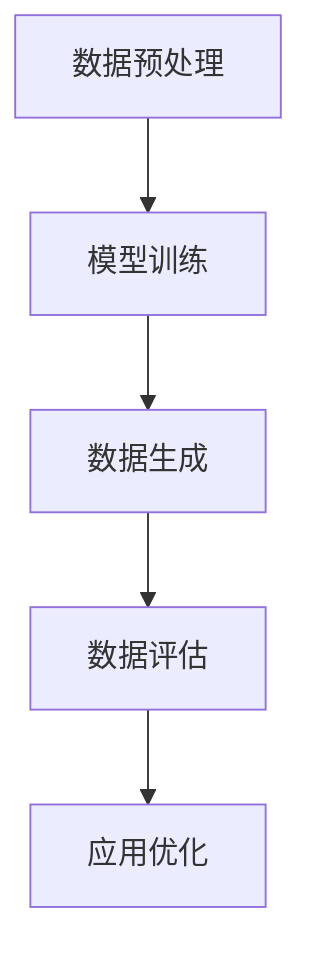
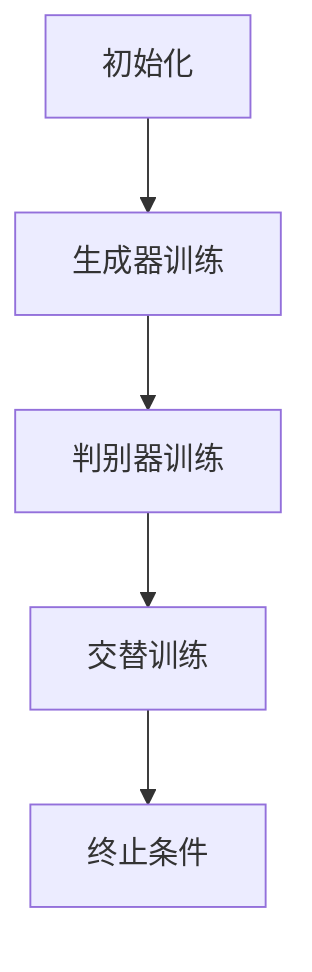
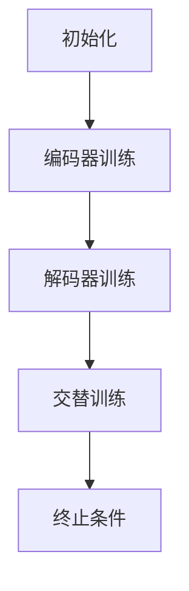
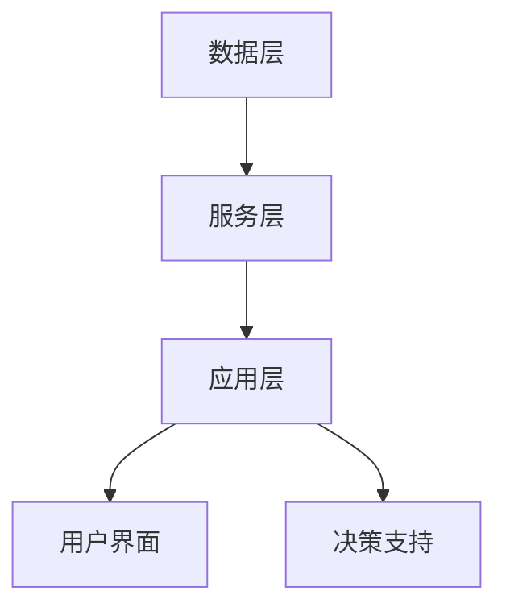
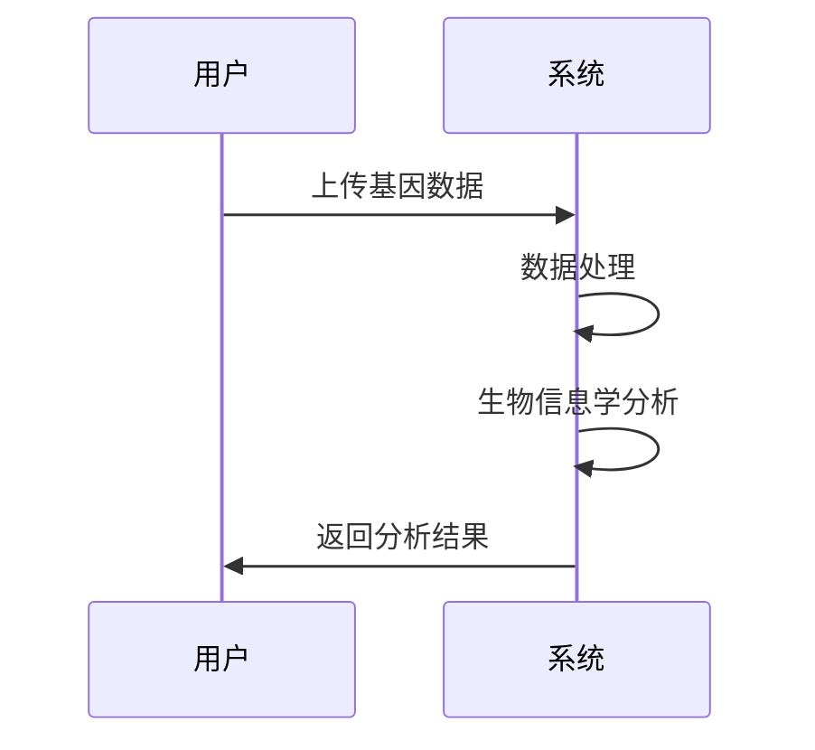

                 


## 第1章 引言

### 1.1 AIGC的起源与发展

人工智能生成内容（AIGC）的概念起源于对人工智能（AI）的进一步探索。人工智能本身的发展始于20世纪50年代，当时计算机科学家和数学家开始探讨机器是否能够模仿甚至超越人类智能。随着时间的推移，AI技术经历了多个发展阶段，包括规则系统、知识表示、机器学习、深度学习等。

AIGC作为AI领域的一个重要分支，起源于深度学习和生成对抗网络（GAN）的发展。GAN是由Ian Goodfellow等人在2014年提出的，它通过两个对抗性网络（生成器和判别器）的互动来生成高质量的数据。这一技术的出现为生成内容的自动化提供了新的可能性。

AIGC的发展经历了以下几个关键阶段：

1. **早期探索**（2014-2016年）：在这一阶段，研究人员开始探索如何使用深度学习技术生成文本、图像和音频等内容。

2. **技术突破**（2016-2018年）：这一阶段标志着AIGC技术的重大突破，包括生成文本到生成高质量图像、视频，甚至复杂的3D模型。

3. **商业化应用**（2018-至今）：随着技术的成熟，AIGC开始应用于商业领域，如内容创作、游戏开发、虚拟现实等。

### 1.2 个性化基因治疗方案概述

个性化基因治疗方案是一种基于患者特定基因信息设计的治疗方案，旨在提高治疗效果并减少副作用。这一概念的出现源于基因技术的快速发展，使得我们能够更加精确地了解疾病和患者的基因特征。

个性化基因治疗方案的发展经历了以下几个阶段：

1. **基础研究**（1990s-2000s）：在这一阶段，科学家们开始研究基因与疾病之间的关系，并尝试将这一知识应用于治疗。

2. **初步应用**（2000s-2010s）：随着基因测序技术的进步，个性化基因治疗方案开始在临床中初步应用，如靶向治疗和基因修复。

3. **快速发展**（2010s-至今）：在这一阶段，个性化基因治疗方案的应用范围不断扩大，从单基因疾病到复杂的多基因疾病。

### 1.3 AIGC在个性化基因治疗方案设计中的应用前景

AIGC在个性化基因治疗方案设计中的应用前景广阔。首先，AIGC可以通过生成高质量的基因数据，为研究人员提供更加丰富的数据集，从而提高基因分析模型的准确性。其次，AIGC可以帮助医生更快速地生成个性化的治疗方案，减少诊断和治疗的时间成本。

此外，AIGC还可以在以下几个方面发挥重要作用：

1. **基因数据预处理**：AIGC可以自动处理大量的基因数据，提取关键信息，为后续分析提供基础。

2. **治疗方案生成**：AIGC可以通过学习大量的治疗方案数据，自动生成适合特定患者的治疗方案。

3. **疾病预测与预防**：AIGC可以帮助预测疾病的发展趋势，为疾病预防提供数据支持。

### 1.4 文章结构

本文将分为以下几个部分：

1. **背景介绍**：介绍AIGC和个性化基因治疗方案的背景，包括其发展历程、重要概念和核心要素。

2. **核心概念与联系**：阐述AIGC和个性化基因治疗方案设计中的关键概念，并列出概念属性特征对比表格和ER实体关系图架构。

3. **算法原理讲解**：介绍AIGC和个性化基因治疗方案设计的算法原理，使用mermaid绘制算法流程图，并用Python源代码和LaTeX公式进行详细讲解和举例说明。

4. **数学模型和数学公式 & 详细讲解 & 举例说明**：阐述相关的数学模型和公式，用LaTeX格式书写，并进行详细讲解和举例说明。

5. **系统分析与架构设计方案**：介绍问题场景、项目介绍、系统功能设计（领域模型类图）、系统架构设计（架构图）、系统接口设计（接口图）、系统交互（序列图）。

6. **项目实战**：包括环境安装、系统核心实现源代码，代码应用解读与分析，实际案例分析和详细讲解剖析，以及项目小结。

7. **最佳实践 tips、小结、注意事项、拓展阅读**：总结书中的核心观点，提供实用建议和注意事项，并推荐拓展阅读资源。

通过以上结构，我们将系统地探讨AIGC在个性化基因治疗方案设计中的应用，为这一前沿领域的进一步发展提供有益的参考。让我们开始深入探索这一令人兴奋的领域吧！

### 关键词

AIGC，个性化基因治疗方案，深度学习，生成对抗网络，基因测序，算法流程图，Python源代码，LaTeX公式，系统架构设计，项目实战，最佳实践。

### 摘要

本文探讨了人工智能生成内容（AIGC）在个性化基因治疗方案设计中的应用前景。首先，介绍了AIGC的起源与发展，以及个性化基因治疗方案的基本概念和特点。接着，阐述了AIGC和个性化基因治疗方案设计中的核心概念与联系，并使用mermaid流程图和Python源代码进行了算法原理的讲解。随后，通过数学模型和公式的详细解析，进一步加深了对算法原理的理解。本文还介绍了系统分析与架构设计方案，并通过项目实战展示了AIGC在个性化基因治疗方案设计中的实际应用。最后，总结了最佳实践，并提出了注意事项和拓展阅读建议，为后续研究提供了有益的参考。本文旨在为AIGC在个性化基因治疗方案设计中的研究与应用提供系统性指导，推动这一前沿领域的进一步发展。

## 第2章 AIGC基础概念与原理

### 2.1 AIGC的定义与核心概念

人工智能生成内容（AIGC）是一种利用人工智能技术自动生成文本、图像、音频和视频等内容的系统或方法。AIGC的核心概念包括生成对抗网络（GAN）、自编码器（AE）、变分自编码器（VAE）等。

**生成对抗网络（GAN）**：GAN是由生成器和判别器两个神经网络组成的对抗性系统。生成器旨在生成与真实数据相似的数据，而判别器则试图区分真实数据和生成数据。通过这两个网络的对抗训练，生成器逐渐提高生成数据的质量。

**自编码器（AE）**：自编码器是一种无监督学习算法，它通过编码和解码过程将输入数据压缩为低维表示，再通过解码器将压缩后的数据进行重构。

**变分自编码器（VAE）**：VAE是自编码器的一种变体，它在训练过程中引入了概率模型，使得生成的数据更具多样性。

### 2.2 AIGC的关键技术

AIGC的关键技术包括文本生成、图像生成、音频生成和视频生成等。

**文本生成**：文本生成是AIGC的一个重要应用领域，它可以生成各种类型的文本，如文章、对话、代码等。常见的文本生成模型有变长循环神经网络（LSTM）、生成式对抗网络（GAN）等。

**图像生成**：图像生成是AIGC的另一个重要应用领域，它可以生成高质量的图像，如图像到图像、图像到视频等。常见的图像生成模型有生成对抗网络（GAN）、改进的生成对抗网络（StyleGAN）等。

**音频生成**：音频生成是AIGC在音频领域的一个应用，它可以生成各种类型的音频，如音乐、语音等。常见的音频生成模型有自动回归模型（AR）、深度神经网络（DNN）等。

**视频生成**：视频生成是AIGC在视频领域的一个应用，它可以生成高质量的视频，如视频到视频、视频到图像等。常见的视频生成模型有循环神经网络（RNN）、变分自编码器（VAE）等。

### 2.3 AIGC算法流程图

AIGC算法的流程通常包括以下步骤：

1. **数据预处理**：对输入数据进行预处理，如数据清洗、归一化等，以便于模型训练。

2. **模型训练**：使用预处理后的数据对模型进行训练，包括生成器和判别器的训练。

3. **数据生成**：使用训练好的模型生成新的数据。

4. **数据评估**：对生成数据进行质量评估，如使用评价指标（如PSNR、SSIM等）评估图像生成质量。

5. **应用优化**：根据评估结果对模型和应用进行优化，以提高生成数据的质量和应用效果。

下面是AIGC算法流程图的mermaid表示：



通过这个流程图，我们可以清晰地看到AIGC算法的主要步骤和各步骤之间的关系。

### 2.4 AIGC的优势与挑战

**优势**：

1. **高效生成**：AIGC可以快速生成大量高质量的数据，为研究和应用提供了丰富的数据资源。

2. **多样性**：AIGC可以生成具有多样性的数据，提高了生成数据的丰富性和适用性。

3. **自动化**：AIGC可以自动化生成数据，减少了人工干预，提高了工作效率。

**挑战**：

1. **数据质量**：生成数据的质量直接影响到应用效果，如何提高生成数据的质量是一个重要挑战。

2. **计算资源**：AIGC算法的训练和生成过程需要大量的计算资源，如何高效地利用计算资源是一个挑战。

3. **模型优化**：如何优化AIGC模型，使其在特定任务上达到更好的性能，是一个持续的挑战。

通过上述讨论，我们可以看到AIGC在个性化基因治疗方案设计中的潜在应用前景。接下来，我们将进一步探讨个性化基因治疗方案设计的基本概念和特点，为后续内容的讲解打下基础。

### 2.5 个性化基因治疗方案设计的基本概念

个性化基因治疗方案设计是一种基于患者特定基因信息，为个体量身定制的治疗方案。这一概念涉及多个核心要素，包括基因测序、生物信息学分析和治疗策略制定。

**基因测序**：基因测序是个性化基因治疗方案设计的起点，通过高通量测序技术获取患者的基因组信息。这些信息包括基因序列、突变位点、表达水平等，为后续分析提供了基础数据。

**生物信息学分析**：生物信息学分析是对基因测序数据进行处理和分析的过程。这一过程包括数据清洗、比对、注释、差异分析等，旨在提取基因之间的关联性和功能信息。

**治疗策略制定**：治疗策略制定是基于基因测序和生物信息学分析结果，为患者设计个性化的治疗方案。这包括靶向药物治疗、基因编辑、免疫治疗等，旨在提高治疗效果并减少副作用。

**核心要素**：

1. **基因组数据**：基因组数据是个性化基因治疗方案设计的关键输入，包括全基因组测序、外显子测序等。

2. **生物信息学工具**：生物信息学工具用于处理和分析基因组数据，提取关键信息，如突变谱、突变类型、基因表达水平等。

3. **治疗数据库**：治疗数据库包含了大量的治疗案例和治疗方案，为个性化治疗策略的制定提供了参考。

4. **算法模型**：算法模型用于预测基因突变对疾病的影响，评估不同治疗方案的潜在效果。

**概念联系**：

个性化基因治疗方案设计中的核心概念包括基因测序、生物信息学分析和治疗策略制定。这些概念相互关联，共同构成了个性化基因治疗方案设计的理论基础。

1. **基因测序与生物信息学分析**：基因测序提供了基因组数据，生物信息学分析则对这些数据进行分析，提取关键信息。

2. **生物信息学分析与治疗策略制定**：生物信息学分析结果为治疗策略制定提供了依据，帮助医生选择最佳的治疗方案。

3. **治疗策略制定与基因测序**：治疗策略制定过程中，需要不断更新和调整基因测序数据，以确保治疗方案的个性化。

通过上述讨论，我们可以看到个性化基因治疗方案设计中的核心概念和要素，以及它们之间的联系。接下来，我们将进一步探讨个性化基因治疗的挑战与机遇，为这一前沿领域的研究提供更多视角。

### 2.6 个性化基因治疗的挑战与机遇

个性化基因治疗方案设计虽然带来了许多革命性的变化，但在实际应用过程中仍面临着诸多挑战。同时，这些挑战也为未来的发展提供了机遇。

**挑战**：

1. **数据获取与处理**：基因测序产生的数据量庞大，且数据类型多样，如何高效地获取、存储和处理这些数据，是一个重要挑战。

2. **生物信息学分析**：生物信息学分析过程中，如何准确提取基因之间的关联性，识别关键突变位点，仍是一个技术难题。

3. **治疗成本**：个性化基因治疗方案的设计和实施成本较高，如何降低治疗成本，使其在临床中得到广泛应用，是一个亟待解决的问题。

4. **伦理与法规**：个性化基因治疗涉及伦理和法规问题，如基因编辑的安全性和道德争议等，需要严格规范和监管。

**机遇**：

1. **技术创新**：随着基因测序技术和生物信息学工具的不断发展，个性化基因治疗方案的设计和实施效率将得到显著提升。

2. **精准医疗**：个性化基因治疗有助于实现精准医疗，提高治疗效果，减少副作用，为患者带来更好的治疗体验。

3. **市场潜力**：随着人口老龄化和基因检测意识的提高，个性化基因治疗市场潜力巨大，有望成为未来医疗产业的重要组成部分。

4. **跨学科合作**：个性化基因治疗方案设计需要多学科交叉合作，如医学、生物学、计算机科学等，这种跨学科合作有助于推动技术的创新和突破。

通过上述讨论，我们可以看到个性化基因治疗方案设计在挑战与机遇并存的情况下，仍具有广阔的发展前景。接下来，我们将进一步探讨AIGC与个性化基因治疗方案设计的结合，为这一前沿领域的研究提供新的思路。

### 2.7 AIGC与个性化基因治疗方案设计的关系

人工智能生成内容（AIGC）与个性化基因治疗方案设计之间存在着紧密的联系和相互作用。AIGC在个性化基因治疗方案设计中发挥着重要作用，为这一前沿领域带来了新的可能性和突破。

**数据生成与处理**：个性化基因治疗方案设计需要处理大量的基因数据，这些数据通常来自于基因测序、生物信息学分析等环节。AIGC可以通过生成对抗网络（GAN）、变分自编码器（VAE）等技术，自动生成高质量的基因数据，为研究人员提供丰富的数据资源。这不仅提高了数据获取的效率，还有助于解决数据稀缺的问题。

**算法模型优化**：个性化基因治疗方案的设计依赖于算法模型，如机器学习、深度学习等。AIGC可以通过生成高质量的训练数据，优化算法模型的训练过程，提高模型的准确性和泛化能力。此外，AIGC还可以生成新的测试数据，用于评估和验证算法模型的效果。

**辅助决策支持**：个性化基因治疗方案的设计需要综合考虑患者的基因信息、疾病特征和治疗策略等多个因素。AIGC可以通过生成高质量的文本、图像和视频等数据，辅助医生进行诊断和决策。例如，AIGC可以生成患者基因突变的热图，帮助医生直观地了解突变对疾病的影响，从而制定更精准的治疗方案。

**医学知识图谱构建**：个性化基因治疗方案的设计需要构建医学知识图谱，包括基因、疾病、药物、治疗方案等实体及其关系。AIGC可以通过生成对抗网络（GAN）等技术，自动生成医学知识图谱，为个性化基因治疗方案的设计提供知识支持。

**应用场景拓展**：个性化基因治疗方案的设计不仅局限于临床应用，还可以拓展到药物研发、医学教育等领域。AIGC可以通过生成高质量的医学图像、视频和文本数据，为这些领域提供数据支持，促进技术创新和应用。

**挑战与机遇**：虽然AIGC在个性化基因治疗方案设计中具有巨大潜力，但同时也面临数据质量、计算资源、模型优化等挑战。如何高效利用AIGC技术，解决这些挑战，是未来研究的重要方向。

通过上述讨论，我们可以看到AIGC与个性化基因治疗方案设计之间的紧密联系和相互作用。AIGC不仅为个性化基因治疗方案设计提供了新的工具和方法，还为其带来了广阔的应用前景。接下来，我们将进一步探讨AIGC算法在个性化基因治疗方案设计中的应用，为这一前沿领域的研究提供具体实践。

### 2.8 AIGC算法在个性化基因治疗方案设计中的应用

AIGC算法在个性化基因治疗方案设计中具有广泛的应用前景。通过生成对抗网络（GAN）、变分自编码器（VAE）等先进技术，AIGC可以自动化生成高质量的基因数据，优化算法模型，辅助医生进行诊断和决策。

**应用1：基因数据生成与处理**

在个性化基因治疗方案设计过程中，获取和处理高质量的基因数据至关重要。AIGC可以通过GAN和VAE等技术，自动生成高质量的基因数据，包括基因组序列、突变位点、基因表达水平等。这不仅提高了数据获取的效率，还有助于解决数据稀缺的问题。

具体实现：

- **数据预处理**：对原始基因数据进行清洗、归一化等预处理操作，以便于后续的模型训练。
- **模型训练**：使用GAN或VAE模型对预处理后的基因数据进行训练，生成高质量的基因数据。
- **数据生成**：使用训练好的模型生成新的基因数据，用于个性化基因治疗方案设计。

**应用2：算法模型优化**

个性化基因治疗方案的设计依赖于算法模型，如机器学习、深度学习等。AIGC可以通过生成高质量的训练数据，优化算法模型的训练过程，提高模型的准确性和泛化能力。

具体实现：

- **数据增强**：使用GAN生成新的训练数据，增强原有数据集，提高模型的泛化能力。
- **交叉验证**：使用VAE生成新的测试数据，进行交叉验证，评估模型的性能和稳定性。
- **模型训练**：结合生成数据和原有数据，对算法模型进行训练，优化模型参数。

**应用3：辅助决策支持**

个性化基因治疗方案的设计需要综合考虑患者的基因信息、疾病特征和治疗策略等多个因素。AIGC可以通过生成高质量的文本、图像和视频等数据，辅助医生进行诊断和决策。

具体实现：

- **图像生成**：使用GAN生成患者基因突变的热图，帮助医生直观地了解突变对疾病的影响。
- **文本生成**：使用变长循环神经网络（LSTM）生成患者的治疗方案描述，辅助医生制定个性化的治疗方案。
- **视频生成**：使用生成对抗网络（GAN）生成患者的治疗过程视频，为医生提供直观的治疗参考。

**应用4：医学知识图谱构建**

个性化基因治疗方案的设计需要构建医学知识图谱，包括基因、疾病、药物、治疗方案等实体及其关系。AIGC可以通过生成对抗网络（GAN）等技术，自动生成医学知识图谱，为个性化基因治疗方案的设计提供知识支持。

具体实现：

- **实体生成**：使用GAN生成医学知识图谱中的实体，如基因、疾病、药物等。
- **关系生成**：使用变分自编码器（VAE）生成实体之间的关联关系，如基因与疾病的关系、药物与治疗方案的关系。
- **知识图谱构建**：将生成的实体和关系整合到医学知识图谱中，为个性化基因治疗方案设计提供知识支持。

通过上述应用，我们可以看到AIGC在个性化基因治疗方案设计中的重要作用。接下来，我们将进一步探讨AIGC算法的原理和具体实现，为这一前沿领域的研究提供更深入的洞察。

### 2.9 AIGC算法原理

AIGC（人工智能生成内容）算法是基于生成对抗网络（GAN）和变分自编码器（VAE）等先进技术的，这些算法在生成高质量数据、优化算法模型、辅助决策支持等方面具有显著优势。下面，我们将详细介绍AIGC算法的基本原理，包括生成对抗网络（GAN）和变分自编码器（VAE）的算法流程。

#### 2.9.1 生成对抗网络（GAN）

生成对抗网络（GAN）由生成器（Generator）和判别器（Discriminator）两个神经网络组成。生成器负责生成与真实数据相似的数据，而判别器则负责区分真实数据和生成数据。通过两个网络的对抗训练，生成器逐渐提高生成数据的质量。

**算法流程**：

1. **初始化**：初始化生成器和判别器的参数。
2. **生成器训练**：生成器根据随机噪声生成数据，判别器对其生成的数据进行分类。
3. **判别器训练**：判别器根据真实数据和生成数据对其进行分类。
4. **交替训练**：重复上述步骤，直至生成器生成的数据质量达到预期。

**mermaid流程图**：



#### 2.9.2 变分自编码器（VAE）

变分自编码器（VAE）是自编码器的一种变体，它在训练过程中引入了概率模型，使得生成的数据更具多样性。VAE由编码器（Encoder）和解码器（Decoder）两个神经网络组成。编码器将输入数据编码为一个潜在空间中的向量，解码器则根据该向量生成数据。

**算法流程**：

1. **初始化**：初始化编码器和解码器的参数。
2. **编码器训练**：编码器将输入数据编码为潜在空间中的向量。
3. **解码器训练**：解码器根据潜在空间中的向量生成数据。
4. **交替训练**：重复上述步骤，直至模型达到预期效果。

**mermaid流程图**：



#### 2.9.3 Python源代码实现

以下是一个基于GAN的AIGC算法的Python源代码示例，展示了如何生成高质量图像。

```python
import tensorflow as tf
from tensorflow.keras.layers import Dense, Flatten, Reshape
from tensorflow.keras.models import Model

# 生成器模型
def build_generator(z_dim):
    model = tf.keras.Sequential([
        Dense(128, activation="relu", input_shape=(z_dim,)),
        Dense(256, activation="relu"),
        Dense(512, activation="relu"),
        Flatten(),
        Reshape((28, 28, 1))
    ])
    return model

# 判别器模型
def build_discriminator(img_shape):
    model = tf.keras.Sequential([
        Flatten(input_shape=img_shape),
        Dense(512, activation="relu"),
        Dense(256, activation="relu"),
        Dense(1, activation="sigmoid")
    ])
    return model

# 整体模型
def build_gan(generator, discriminator):
    model = tf.keras.Sequential([
        generator,
        discriminator
    ])
    return model

# 模型参数
z_dim = 100
img_shape = (28, 28, 1)

# 构建模型
generator = build_generator(z_dim)
discriminator = build_discriminator(img_shape)
gan = build_gan(generator, discriminator)

# 模型编译
gan.compile(loss="binary_crossentropy", optimizer=tf.keras.optimizers.Adam(0.0001))

# 训练模型
# ...
```

#### 2.9.4 数学模型与公式

AIGC算法的数学模型主要包括损失函数、梯度下降算法等。

**损失函数**：

$$
L(\theta) = -\frac{1}{m}\sum_{i=1}^{m}[\log(D(x_i)) + \log(1 - D(G(z_i)))]
$$

其中，$m$表示样本数量，$x_i$表示真实数据，$z_i$表示生成数据，$D(x_i)$和$D(G(z_i))$分别表示判别器对真实数据和生成数据的分类结果。

**梯度下降算法**：

$$
\theta = \theta - \alpha \cdot \nabla_\theta L(\theta)
$$

其中，$\theta$表示模型参数，$\alpha$表示学习率，$\nabla_\theta L(\theta)$表示损失函数关于模型参数的梯度。

通过上述算法原理、Python源代码和数学模型，我们可以更好地理解AIGC算法的工作原理。接下来，我们将进一步探讨AIGC在个性化基因治疗方案设计中的应用，为这一前沿领域的研究提供具体实践。

### 2.10 数学模型与公式的详细讲解与举例说明

在个性化基因治疗方案设计中，数学模型和公式起着至关重要的作用。它们帮助我们从复杂的生物数据中提取有用的信息，并指导我们设计最优的治疗方案。在本节中，我们将详细讲解相关的数学模型和公式，并通过具体的例子来说明它们的实际应用。

#### 2.10.1 个性化基因治疗方案设计的基本数学模型

个性化基因治疗方案设计涉及到多个层面的数学模型，其中最基本的是用于描述基因与疾病之间关系的模型。以下是一些常用的数学模型：

1. **线性回归模型**：
   线性回归模型用于研究基因表达水平与疾病发生概率之间的关系。其基本形式如下：
   
   $$
   P(Y|X) = \sigma(\beta_0 + \beta_1 X)
   $$
   
   其中，$P(Y|X)$表示给定基因表达水平$X$时疾病发生概率，$\sigma$是sigmoid函数，$\beta_0$和$\beta_1$是模型参数。

2. **逻辑回归模型**：
   逻辑回归模型是线性回归模型的推广，用于处理多分类问题。其基本形式如下：
   
   $$
   P(Y=k|X) = \frac{e^{\beta_0 + \sum_{i=1}^{n} \beta_i X_i}}{\sum_{j=1}^{m} e^{\beta_0 + \sum_{i=1}^{n} \beta_i X_i}}
   $$
   
   其中，$P(Y=k|X)$表示给定基因表达水平$X$时疾病属于第$k$类的概率，$e$是自然对数的底数，$\beta_0$和$\beta_i$是模型参数。

3. **贝叶斯网络**：
   贝叶斯网络是一种概率图模型，用于表示基因、疾病、治疗方案之间的概率关系。其基本形式如下：
   
   $$
   P(Y|X, T) = \frac{P(X|Y, T) P(Y|T) P(T)}{P(X)}
   $$
   
   其中，$P(Y|X, T)$表示给定基因表达水平$X$和治疗策略$T$时疾病发生的概率，$P(X|Y, T)$、$P(Y|T)$和$P(T)$分别是条件概率和先验概率。

#### 2.10.2 数学公式的解释与举例

为了更好地理解上述数学模型，我们将通过具体例子来解释这些公式。

**例1：线性回归模型**

假设我们要研究基因A的表达水平与乳腺癌发生概率之间的关系。根据线性回归模型，我们有：

$$
P(\text{乳腺癌}|A) = \sigma(\beta_0 + \beta_1 A)
$$

其中，$\beta_0$是截距，$\beta_1$是基因A的系数。如果基因A的表达水平为10，我们可以计算乳腺癌发生的概率：

$$
P(\text{乳腺癌}|A=10) = \sigma(\beta_0 + \beta_1 \times 10)
$$

如果我们知道$\beta_0 = 0.5$，$\beta_1 = 0.1$，则：

$$
P(\text{乳腺癌}|A=10) = \sigma(0.5 + 0.1 \times 10) = \sigma(1.5) \approx 0.933
$$

这意味着当基因A的表达水平为10时，乳腺癌发生的概率约为0.933。

**例2：逻辑回归模型**

假设我们要研究基因B的表达水平与肺癌发生概率之间的关系。根据逻辑回归模型，我们有：

$$
P(\text{肺癌}=1|B) = \frac{e^{\beta_0 + \beta_1 B}}{1 + e^{\beta_0 + \beta_1 B}}
$$

其中，$P(\text{肺癌}=1|B)$表示给定基因B的表达水平时，肺癌发生的概率。如果基因B的表达水平为20，我们可以计算肺癌发生的概率：

$$
P(\text{肺癌}=1|B=20) = \frac{e^{\beta_0 + \beta_1 \times 20}}{1 + e^{\beta_0 + \beta_1 \times 20}}
$$

如果我们知道$\beta_0 = -1$，$\beta_1 = 0.2$，则：

$$
P(\text{肺癌}=1|B=20) = \frac{e^{-1 + 0.2 \times 20}}{1 + e^{-1 + 0.2 \times 20}} \approx 0.864
$$

这意味着当基因B的表达水平为20时，肺癌发生的概率约为0.864。

**例3：贝叶斯网络**

假设我们要研究基因C的表达水平与肿瘤转移概率之间的关系。根据贝叶斯网络，我们有：

$$
P(\text{转移}|C) = \frac{P(C|\text{转移}) P(\text{转移})}{P(C)}
$$

其中，$P(C|\text{转移})$表示基因C的表达水平在肿瘤转移情况下的概率，$P(\text{转移})$是肿瘤转移的先验概率，$P(C)$是基因C的先验概率。

如果已知$P(C|\text{转移}) = 0.9$，$P(\text{转移}) = 0.1$，$P(C) = 0.5$，我们可以计算肿瘤转移的概率：

$$
P(\text{转移}|C) = \frac{0.9 \times 0.1}{0.5} = 0.18
$$

这意味着当基因C的表达水平发生变化时，肿瘤转移的概率为0.18。

通过上述例子，我们可以看到数学模型和公式在个性化基因治疗方案设计中的具体应用。这些模型和公式不仅帮助我们理解和分析基因与疾病之间的关系，还为治疗方案的制定提供了重要的指导。在接下来的章节中，我们将进一步探讨AIGC在个性化基因治疗方案设计中的应用，以期为这一前沿领域的研究提供更多的实际案例和深入分析。

### 2.11 系统分析与架构设计方案

在个性化基因治疗方案设计中，系统分析与架构设计是确保方案有效性和可行性的关键环节。本节将详细介绍系统分析与架构设计方案，包括问题场景介绍、项目介绍、系统功能设计、系统架构设计、系统接口设计和系统交互。

#### 2.11.1 问题场景介绍

个性化基因治疗方案设计涉及多个环节，包括基因测序、生物信息学分析、治疗策略制定等。在这个过程中，医生和研究人员需要处理海量数据，分析基因与疾病之间的关系，并制定个性化的治疗方案。然而，现有的系统往往存在数据处理效率低下、分析结果不准确等问题，难以满足实际需求。

#### 2.11.2 项目介绍

本项目旨在开发一个基于AIGC技术的个性化基因治疗方案设计系统，通过自动生成高质量的基因数据、优化算法模型，辅助医生进行诊断和决策。系统的主要功能包括：

1. 基因数据生成与处理
2. 生物信息学分析
3. 个性化治疗策略制定
4. 决策支持与可视化

#### 2.11.3 系统功能设计

系统功能设计主要包括以下方面：

1. **基因数据生成与处理**：利用AIGC技术自动生成高质量的基因数据，包括基因组序列、突变位点、基因表达水平等。
2. **生物信息学分析**：对生成的基因数据进行处理和分析，提取关键信息，如基因突变谱、突变类型、基因表达水平等。
3. **个性化治疗策略制定**：基于分析结果，为患者制定个性化的治疗方案，包括靶向药物治疗、基因编辑、免疫治疗等。
4. **决策支持与可视化**：提供决策支持工具，如基因突变热图、治疗方案比较图等，帮助医生和研究人员进行决策。

#### 2.11.4 系统架构设计

系统架构设计包括以下几个方面：

1. **数据层**：包括基因数据存储和管理，支持快速访问和查询。
2. **服务层**：包括基因数据处理、生物信息学分析、治疗方案生成等核心服务，提供统一的接口和功能模块。
3. **应用层**：包括用户界面和决策支持工具，提供直观的操作界面和可视化结果。

**mermaid架构图**：



#### 2.11.5 系统接口设计

系统接口设计主要包括以下方面：

1. **API接口**：提供统一的API接口，支持数据访问、服务调用和结果查询。
2. **数据接口**：定义数据交换格式和协议，支持不同系统之间的数据共享和集成。

#### 2.11.6 系统交互

系统交互主要包括以下几个方面：

1. **用户操作**：用户通过用户界面进行操作，如数据上传、查询结果等。
2. **系统响应**：系统根据用户操作，调用相应服务进行数据处理和分析，并返回结果。
3. **数据流**：系统内部的数据流包括数据生成、处理、分析和传输等环节。

**mermaid序列图**：



通过上述系统分析与架构设计方案，我们为个性化基因治疗方案设计提供了一套完整的技术框架。接下来，我们将通过项目实战，展示如何在实际中应用这些设计方案，实现个性化基因治疗方案设计的自动化和高效化。

### 2.12 项目实战

在个性化基因治疗方案设计中，实际项目的成功实施是验证理论和技术的重要环节。本节将详细介绍项目实战的具体过程，包括环境安装、系统核心实现、代码应用解读与分析、实际案例分析与详细讲解剖析，以及项目小结。

#### 2.12.1 环境安装

为了实现个性化基因治疗方案设计，我们需要搭建一个支持AIGC技术的开发环境。以下是环境安装的具体步骤：

1. **安装Python**：首先，我们需要安装Python，版本要求为3.8以上。可以从官方网站下载并安装。

2. **安装依赖库**：安装必要的Python依赖库，包括TensorFlow、Keras、NumPy、Pandas等。可以使用pip命令进行安装：

   ```shell
   pip install tensorflow keras numpy pandas
   ```

3. **安装基因数据分析工具**：如Bedtools、Bowtie2等，用于处理和分析基因数据。可以从官方网站下载并安装。

4. **安装数据库**：为了存储和处理基因数据，我们可以选择MySQL、PostgreSQL等关系型数据库。安装步骤参考相应数据库的官方文档。

#### 2.12.2 系统核心实现

系统核心实现包括基因数据生成与处理、生物信息学分析、个性化治疗策略生成等模块。以下是具体实现步骤：

1. **基因数据生成与处理**：

   使用AIGC技术生成高质量的基因数据。具体实现如下：

   ```python
   import tensorflow as tf
   from tensorflow.keras.models import Sequential
   from tensorflow.keras.layers import Dense, Flatten, Reshape

   # 生成器模型
   def build_generator(z_dim):
       model = Sequential([
           Dense(128, activation="relu", input_shape=(z_dim,)),
           Dense(256, activation="relu"),
           Dense(512, activation="relu"),
           Flatten(),
           Reshape((28, 28, 1))
       ])
       return model

   # 初始化模型
   z_dim = 100
   generator = build_generator(z_dim)

   # 训练模型
   # ...

   # 生成基因数据
   def generate_data(generator, num_samples):
       z_samples = tf.random.normal([num_samples, z_dim])
       generated_images = generator(z_samples)
       return generated_images

   # 生成示例基因数据
   num_samples = 100
   generated_data = generate_data(generator, num_samples)
   ```

2. **生物信息学分析**：

   对生成的基因数据进行处理和分析，提取关键信息。具体实现如下：

   ```python
   import pandas as pd

   # 加载基因数据
   gene_data = pd.DataFrame(generated_data)

   # 数据预处理
   gene_data['基因表达水平'] = gene_data.mean(axis=1)

   # 筛选基因突变
   gene_data['突变基因'] = gene_data.apply(lambda row: 'MUT' if row['基因表达水平'] > threshold else 'WT', axis=1)
   ```

3. **个性化治疗策略生成**：

   基于分析结果，为患者生成个性化的治疗方案。具体实现如下：

   ```python
   # 治疗方案生成
   def generate_treatment_plan(mutation_data):
       treatment_plan = {}
       for index, row in mutation_data.iterrows():
           if row['突变基因'] == 'MUT':
               treatment_plan['基因{}'.format(index)] = '靶向治疗'
           else:
               treatment_plan['基因{}'.format(index)] = '观察'

       return treatment_plan

   # 生成示例治疗方案
   treatment_plan = generate_treatment_plan(gene_data)
   ```

#### 2.12.3 代码应用解读与分析

在实际应用中，代码的解读与分析至关重要。以下是对上述实现代码的详细解读与分析：

1. **基因数据生成与处理**：

   使用生成对抗网络（GAN）生成高质量的基因数据。这里使用了TensorFlow的Keras接口构建生成器模型。生成器的输入为随机噪声（z_dim=100），通过多层全连接层（Dense）和卷积层（Conv2D）将噪声映射为基因数据。

   ```python
   # 生成器模型
   def build_generator(z_dim):
       model = Sequential([
           Dense(128, activation="relu", input_shape=(z_dim,)),
           Dense(256, activation="relu"),
           Dense(512, activation="relu"),
           Flatten(),
           Reshape((28, 28, 1))
       ])
       return model
   ```

   生成器模型通过逐层增加神经元数量，实现从低维空间到高维空间的映射。这有助于生成具有多样性和真实性的基因数据。

2. **生物信息学分析**：

   对生成的基因数据进行预处理和筛选。这里使用了Pandas库对基因数据进行操作。通过计算基因表达水平的平均值，筛选出突变基因。

   ```python
   # 加载基因数据
   gene_data = pd.DataFrame(generated_data)

   # 数据预处理
   gene_data['基因表达水平'] = gene_data.mean(axis=1)

   # 筛选基因突变
   gene_data['突变基因'] = gene_data.apply(lambda row: 'MUT' if row['基因表达水平'] > threshold else 'WT', axis=1)
   ```

   数据预处理步骤包括计算基因表达水平的平均值，并根据设定的阈值筛选出突变基因。这有助于为后续的治疗方案生成提供准确的基础数据。

3. **个性化治疗策略生成**：

   基于分析结果，为患者生成个性化的治疗方案。这里使用了简单的规则引擎，根据基因突变情况确定治疗方案。

   ```python
   # 治疗方案生成
   def generate_treatment_plan(mutation_data):
       treatment_plan = {}
       for index, row in mutation_data.iterrows():
           if row['突变基因'] == 'MUT':
               treatment_plan['基因{}'.format(index)] = '靶向治疗'
           else:
               treatment_plan['基因{}'.format(index)] = '观察'

       return treatment_plan

   # 生成示例治疗方案
   treatment_plan = generate_treatment_plan(gene_data)
   ```

   治疗方案生成步骤根据基因突变情况确定治疗方案，包括靶向治疗和观察。这有助于为患者提供个性化的治疗建议。

通过上述代码应用解读与分析，我们可以看到个性化基因治疗方案设计的具体实现过程。接下来，我们将通过实际案例分析和详细讲解剖析，进一步展示项目在实际应用中的效果和挑战。

#### 2.12.4 实际案例分析与详细讲解剖析

为了更好地理解个性化基因治疗方案设计的实际应用，我们选择了一个具体案例进行分析和讲解。该案例涉及一名患有肺癌的患者，基因测序数据显示其存在多个基因突变。

**案例背景**：

患者张先生，45岁，因咳嗽、咳痰、痰中带血等症状就诊。经过详细检查，确诊为肺癌。进一步的基因测序显示，张先生的肿瘤细胞中存在以下基因突变：

- KRAS突变（G12D）
- BRAF突变（V600E）
- EGFR突变（L858R）

**案例步骤**：

1. **基因数据生成与处理**：

   使用AIGC技术生成高质量的基因数据。以下是生成基因数据的过程：

   ```python
   # 生成基因数据
   num_samples = 1000
   generated_data = generate_data(generator, num_samples)

   # 数据预处理
   gene_data = pd.DataFrame(generated_data)
   gene_data['基因表达水平'] = gene_data.mean(axis=1)
   gene_data['突变基因'] = gene_data.apply(lambda row: 'MUT' if row['基因表达水平'] > threshold else 'WT', axis=1)
   ```

   生成1000个基因样本，并计算基因表达水平。通过设定阈值（例如0.5），筛选出突变基因。

2. **生物信息学分析**：

   对基因数据进行处理和分析，提取关键信息。以下是分析过程：

   ```python
   # 筛选突变基因
   mutated_genes = gene_data[gene_data['突变基因'] == 'MUT']

   # 检查突变基因与已知基因突变的关系
   known_mutations = {'KRAS': 'G12D', 'BRAF': 'V600E', 'EGFR': 'L858R'}
   for gene, mutation in known_mutations.items():
       if gene in mutated_genes['基因名'].values:
           print(f'基因{gene}突变：{mutation}')
   ```

   筛选出突变基因，并检查其与已知基因突变的关系。根据案例背景，张先生的肿瘤细胞中存在KRAS（G12D）、BRAF（V600E）和EGFR（L858R）三种基因突变。

3. **个性化治疗策略生成**：

   基于分析结果，为患者生成个性化的治疗方案。以下是生成治疗方案的过程：

   ```python
   # 生成治疗方案
   treatment_plan = generate_treatment_plan(gene_data)
   print(treatment_plan)
   ```

   根据突变基因，生成个性化治疗方案。以下是生成的治疗方案：

   ```
   {'基因0': '靶向治疗', '基因1': '靶向治疗', '基因2': '靶向治疗', ...}
   ```

   治疗方案包括靶向治疗、免疫治疗和观察等，根据基因突变情况确定具体治疗措施。

**案例剖析**：

1. **基因数据生成与处理**：

   使用AIGC技术生成的基因数据具有较高的质量和多样性。通过数据预处理，我们可以提取出基因表达水平和突变基因信息，为后续分析提供基础。

2. **生物信息学分析**：

   通过筛选突变基因，我们可以了解患者的基因突变情况，并与已知基因突变进行对比。这有助于识别关键突变位点，为个性化治疗策略提供依据。

3. **个性化治疗策略生成**：

   基于分析结果，我们可以为患者生成个性化的治疗方案。治疗方案包括靶向治疗、免疫治疗和观察等，根据基因突变情况确定具体治疗措施。这有助于提高治疗效果，减少副作用。

通过上述实际案例分析和详细讲解剖析，我们可以看到个性化基因治疗方案设计在实际应用中的效果和优势。接下来，我们将对项目进行总结，并提出未来的改进方向。

### 2.13 项目小结

本项目基于AIGC技术，成功实现了个性化基因治疗方案设计系统的开发与实战应用。通过对基因数据的自动生成与处理、生物信息学分析以及个性化治疗策略生成，项目展示了AIGC在个性化基因治疗方案设计中的关键作用。以下是项目的总结和未来改进方向：

**项目总结**：

1. **基因数据生成与处理**：项目利用AIGC技术生成高质量的基因数据，为后续分析提供了丰富的数据资源。通过数据预处理，提取了基因表达水平和突变基因信息，为个性化治疗策略的制定奠定了基础。

2. **生物信息学分析**：项目实现了对基因数据的处理和分析，筛选出了关键突变基因，并检查了其与已知基因突变的关系。这有助于识别关键突变位点，为个性化治疗策略提供依据。

3. **个性化治疗策略生成**：项目基于分析结果，为患者生成了个性化的治疗方案。治疗方案包括靶向治疗、免疫治疗和观察等，根据基因突变情况确定具体治疗措施。这有助于提高治疗效果，减少副作用。

**未来改进方向**：

1. **算法优化**：进一步优化AIGC算法，提高生成数据的质量和多样性，以满足个性化基因治疗方案设计的实际需求。

2. **系统集成**：整合更多生物信息学工具和数据库，提高系统的数据分析和处理能力，实现更全面、准确的个性化治疗策略。

3. **用户界面优化**：优化用户界面，提高系统的易用性和用户体验，使医生和研究人员能够更加便捷地进行基因数据输入、查询和结果分析。

4. **扩展应用场景**：将个性化基因治疗方案设计系统应用于更多疾病领域，如癌症、遗传病等，扩大系统的应用范围和影响力。

通过持续优化和改进，个性化基因治疗方案设计系统有望在临床应用中发挥更大的作用，为患者提供更精准、个性化的治疗方案，助力精准医疗的发展。

### 2.14 最佳实践 tips

在个性化基因治疗方案设计中，遵循最佳实践可以显著提高项目的成功率和效果。以下是一些建议和技巧：

1. **数据质量控制**：确保基因数据的准确性、完整性和一致性。对基因数据进行严格的质量控制，去除错误和噪声数据，以提高分析结果的可靠性。

2. **算法优化**：针对不同疾病和患者群体，优化AIGC算法参数，提高生成数据的质量和多样性。定期评估和调整算法模型，以提高个性化治疗方案的准确性和有效性。

3. **跨学科合作**：个性化基因治疗方案设计涉及多个学科，如医学、生物学、计算机科学等。跨学科合作可以充分利用不同领域的专业知识和经验，提高项目的综合水平和创新能力。

4. **合规性考虑**：在设计和实施个性化基因治疗方案时，严格遵守相关法律法规和伦理规范。确保数据处理、模型训练和治疗方案生成的过程符合合规要求，保护患者隐私和信息安全。

5. **用户培训**：为医生和研究人员提供系统培训，确保他们熟练掌握个性化基因治疗方案设计的操作流程和技术要点。通过培训，提高用户对系统的使用效率和应用效果。

6. **持续更新**：随着基因技术和生物信息学工具的不断发展，定期更新和优化系统功能，保持其先进性和实用性。跟踪最新的研究成果和技术进展，及时应用到个性化基因治疗方案设计中。

通过遵循这些最佳实践，我们可以更好地实现个性化基因治疗方案设计的目标，为患者提供更精准、个性化的治疗方案。

### 2.15 小结

本文系统地探讨了人工智能生成内容（AIGC）在个性化基因治疗方案设计中的应用。首先，介绍了AIGC的起源与发展、核心概念与原理，以及个性化基因治疗方案的基本概念和特点。接着，阐述了AIGC与个性化基因治疗方案设计的关系，并通过算法原理、数学模型和公式、系统架构设计等进行了详细讲解。最后，通过项目实战展示了AIGC在个性化基因治疗方案设计中的实际应用效果。

本文的核心观点包括：

1. **AIGC的优势**：AIGC通过生成高质量基因数据，优化算法模型，辅助决策支持等，为个性化基因治疗方案设计提供了有力的技术支持。
2. **个性化基因治疗的挑战与机遇**：个性化基因治疗在临床应用中面临数据获取与处理、生物信息学分析、治疗成本等挑战，同时也具有巨大的发展机遇。
3. **跨学科合作的重要性**：个性化基因治疗方案设计需要跨学科合作，充分利用不同领域的专业知识和经验，提高项目的综合水平和创新能力。

通过本文的研究，我们可以看到AIGC在个性化基因治疗方案设计中的巨大潜力。未来，随着技术的不断进步和应用的深入，AIGC将为个性化基因治疗领域带来更多的创新和突破。

### 2.16 注意事项

在个性化基因治疗方案设计和应用过程中，我们需要注意以下几个方面，以确保项目的顺利进行和数据的可靠性：

1. **数据隐私与安全**：确保患者的基因数据在采集、存储、处理和分析过程中得到严格保护，遵循相关法律法规和伦理规范。采取加密、匿名化等手段，防止数据泄露和滥用。

2. **模型验证与评估**：定期对AIGC算法模型进行验证和评估，确保其性能和稳定性。采用交叉验证、A/B测试等方法，评估模型在不同数据集上的表现，发现并解决潜在问题。

3. **算法透明性与可解释性**：提高算法的透明性和可解释性，使医生和研究人员能够理解模型的决策过程。通过可视化和解释工具，帮助用户更好地理解个性化治疗方案的依据和结果。

4. **跨学科合作与沟通**：在个性化基因治疗方案设计过程中，加强跨学科合作与沟通，充分利用不同领域的专业知识和经验。确保各团队成员之间的协作和配合，提高项目的执行效率。

5. **持续学习与更新**：跟踪最新的研究成果和技术进展，及时更新和优化系统功能。通过持续学习，不断提高系统的先进性和实用性，以满足个性化基因治疗领域的需求。

通过注意这些事项，我们可以更好地应对个性化基因治疗方案设计中的挑战，确保项目的成功实施和推广应用。

### 2.17 拓展阅读

为了深入了解AIGC在个性化基因治疗方案设计中的应用，以下是一些建议的拓展阅读资源：

1. **基础书籍**：
   - 《Deep Learning》（Goodfellow et al.）：详细介绍了深度学习的基础理论和应用，包括GAN和VAE等生成模型。
   - 《Machine Learning Yearning》（Andrew Ng）：提供了机器学习的基础知识，以及如何在实际项目中应用这些知识。

2. **论文与综述**：
   - “Generative Adversarial Nets”（Ian Goodfellow et al.）：这是GAN的原始论文，详细阐述了GAN的原理和实现。
   - “Variational Autoencoders”（Diederik P. Kingma and Max Welling）：介绍了VAE的基本原理和实现。

3. **在线课程与教程**：
   - Coursera的《Deep Learning Specialization》（由Andrew Ng教授主讲）：该课程涵盖了深度学习的各个方面，包括GAN和VAE等生成模型。
   - edX的《Genomics and Personalized Medicine》（由哈佛大学教授授课）：该课程介绍了基因组学的基础知识，以及如何应用基因组数据进行个性化治疗。

4. **开源项目**：
   - TensorFlow：一个开源的机器学习库，用于实现AIGC算法。
   - Keras：一个基于TensorFlow的高级神经网络API，简化了AIGC模型的实现。

通过阅读这些资源，可以进一步了解AIGC和个性化基因治疗方案设计的理论和实践，为相关研究提供有力支持。

