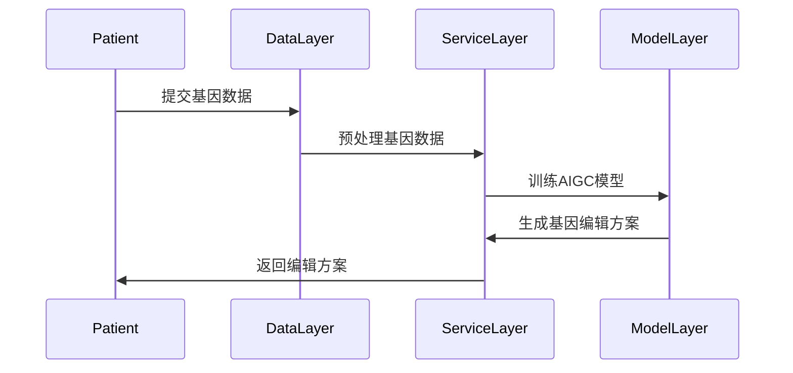
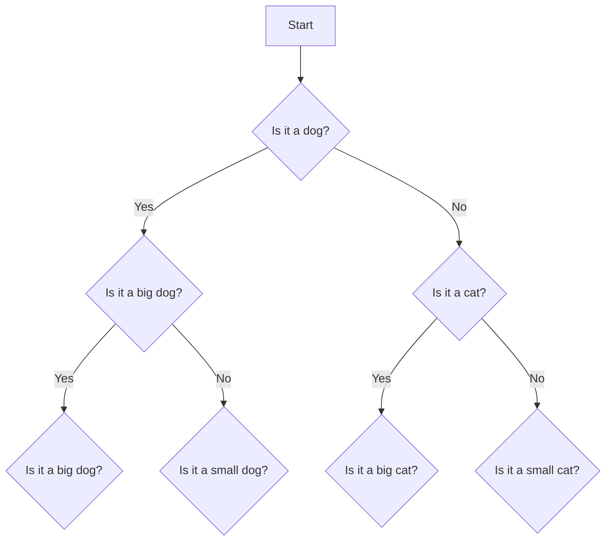

                 

### 文章标题

**AIGC在个性化基因编辑治疗中的应用：精准CRISPR技术的AI辅助**

> 关键词：AIGC、基因编辑、个性化医疗、CRISPR、AI辅助

> 摘要：本文探讨了AIGC（自适应智能生成计算）在个性化基因编辑治疗中的潜在应用，特别是在精准CRISPR技术中的作用。通过分析AIGC技术的原理及其与基因编辑技术的结合方式，本文提出了一种基于AIGC的个性化基因编辑治疗方案，旨在提高治疗的精准性和安全性。本文还从技术原理、系统设计与实际应用等多个角度，详细阐述了AIGC技术在基因编辑治疗中的具体实现和应用前景。

### 目录大纲

#### 第一部分：背景与概述

1. **第1章：AIGC与基因编辑技术的融合概述**
    - 1.1.1 问题背景
    - 1.1.2 问题描述
    - 1.1.3 问题解决
    - 1.1.4 边界与外延
    - 1.1.5 概念结构与核心要素组成

2. **第2章：AIGC技术在个性化基因编辑中的应用原理**
    - 2.1.1 AIGC技术原理
    - 2.1.2 基因编辑治疗原理
    - 2.1.3 AIGC与基因编辑技术的融合原理

3. **第3章：核心概念与联系**
    - 3.1.1 核心概念原理
    - 3.1.2 概念属性特征对比表格
    - 3.1.3 ER实体关系图架构的Mermaid流程图

#### 第二部分：技术原理与算法讲解

4. **第4章：技术原理与算法讲解**
    - 4.1.1 算法原理讲解
    - 4.1.2 伪代码与Python代码实现
    - 4.1.3 数学公式解释

#### 第三部分：系统分析与架构设计

5. **第5章：系统分析与架构设计**
    - 5.1.1 系统功能设计
    - 5.1.2 系统架构设计
    - 5.1.3 系统接口设计
    - 5.1.4 系统交互

#### 第四部分：项目实战

6. **第6章：项目实战**
    - 6.1.1 环境安装
    - 6.1.2 系统核心实现源代码
    - 6.1.3 代码应用解读与分析
    - 6.1.4 实际案例分析与详细讲解剖析
    - 6.1.5 项目小结

#### 第五部分：最佳实践与总结

7. **第7章：最佳实践与总结**
    - 7.1.1 最佳实践Tips
    - 7.1.2 小结
    - 7.1.3 注意事项
    - 7.1.4 拓展阅读

### 第一部分：背景与概述

#### 第1章：AIGC与基因编辑技术的融合概述

##### 1.1.1 问题背景

基因编辑技术，尤其是CRISPR/Cas9系统，近年来在医学领域取得了重大突破。CRISPR技术通过在DNA分子中精确切割特定序列，为治疗遗传性疾病和癌症提供了新的可能性。然而，基因编辑的精准性和安全性仍然是当前面临的主要挑战。在基因编辑治疗过程中，如何确保目标基因的精确修改，同时避免非目标区域的脱靶效应，是一个亟待解决的问题。

与此同时，个性化医疗的需求日益增长。传统的医疗模式往往采用“一刀切”的方法，而个性化医疗则旨在根据患者的具体基因信息，制定个性化的治疗方案。这种个性化的治疗策略不仅提高了疗效，还减少了副作用。然而，个性化医疗的实现需要大量的基因数据，以及能够对这些数据进行高效处理和分析的技术。

AIGC（自适应智能生成计算）技术作为一种新兴的人工智能技术，具有强大的数据处理和生成能力。AIGC结合了深度学习和生成对抗网络（GAN）等技术，可以在大量数据中进行学习和生成，从而为个性化基因编辑治疗提供技术支持。

##### 1.1.2 问题描述

如何利用AIGC技术提高基因编辑治疗的精准性？具体来说，AIGC在基因编辑治疗中的应用现状如何？它的前景又有哪些？这是我们接下来需要探讨的问题。

##### 1.1.3 问题解决

AIGC与基因编辑技术的结合点在于：

1. **数据处理与分析**：AIGC技术可以通过深度学习算法，从海量基因数据中提取有价值的信息，帮助医生更好地理解患者的基因特征。

2. **生成个性化治疗方案**：基于对患者基因数据的分析，AIGC可以生成个性化的基因编辑方案，从而提高治疗的精准性。

个性化基因编辑治疗的基本框架包括：

1. **基因数据收集与处理**：通过基因组测序等技术，收集患者的基因数据。

2. **AIGC模型训练**：使用大量基因编辑相关数据，训练AIGC模型，使其能够生成个性化的基因编辑方案。

3. **治疗方案生成与优化**：基于AIGC模型的预测结果，生成并优化基因编辑方案。

4. **基因编辑操作**：按照优化的基因编辑方案，进行实际的基因编辑操作。

##### 1.1.4 边界与外延

个性化基因编辑治疗主要适用于：

1. **遗传性疾病**：如囊性纤维化、脊髓性肌萎缩等。

2. **癌症治疗**：针对癌症患者，通过基因编辑技术，靶向攻击癌细胞。

AIGC技术在不同基因编辑技术中的应用潜力：

1. **CRISPR/Cas9**：AIGC技术可以优化CRISPR系统的设计，提高编辑的精准性。

2. **TALENs**、** base编辑器**：AIGC技术也可以应用于这些新兴的基因编辑技术中。

##### 1.1.5 概念结构与核心要素组成

**AIGC技术核心概念**：

- **深度学习**：通过从大量数据中学习，自动提取特征，实现复杂的数据处理和分析。

- **生成对抗网络（GAN）**：由生成器和判别器组成，生成器生成数据，判别器判断生成数据与真实数据之间的差距，通过不断优化，生成更加逼真的数据。

**基因编辑治疗关键环节**：

- **基因数据收集**：通过基因组测序等技术，获取患者的基因信息。

- **目标基因识别**：识别需要编辑的目标基因，确定编辑位点。

- **编辑方案设计**：根据目标基因的位置和特性，设计出合适的编辑方案。

- **基因编辑操作**：按照编辑方案，在患者体内进行基因编辑操作。

### 第2章：AIGC技术在个性化基因编辑中的应用原理

#### 2.1.1 AIGC技术原理

**深度学习与生成对抗网络（GAN）**

AIGC技术主要基于深度学习和生成对抗网络（GAN）两大核心技术。

**深度学习**：

深度学习是一种基于神经网络的机器学习技术，通过多层神经网络的堆叠，实现从数据中自动提取特征、进行复杂决策的任务。

**生成对抗网络（GAN）**：

GAN由生成器（Generator）和判别器（Discriminator）两部分组成。生成器的任务是生成逼真的数据，而判别器的任务是判断输入数据是真实数据还是生成器生成的数据。通过生成器和判别器的不断博弈，生成器生成越来越逼真的数据。

**自然语言处理与生成模型**

在AIGC技术中，自然语言处理（NLP）和生成模型也发挥着重要作用。NLP技术用于处理和理解自然语言文本，生成模型则用于根据输入文本生成新的文本。

**数据处理与分析**

AIGC技术强大的数据处理能力，使其能够从海量基因数据中提取有价值的信息。具体步骤如下：

1. **数据预处理**：对基因数据进行清洗、去噪、归一化等预处理操作。
2. **特征提取**：使用深度学习算法，从基因数据中提取出与基因编辑相关的特征。
3. **数据建模**：构建深度学习模型，对基因数据进行训练和预测。

**生成个性化治疗方案**

基于对患者基因数据的分析，AIGC技术可以生成个性化的基因编辑治疗方案。具体步骤如下：

1. **输入基因数据**：将患者的基因数据输入到AIGC模型中。
2. **特征提取与建模**：AIGC模型从基因数据中提取特征，并构建深度学习模型。
3. **生成编辑方案**：基于模型预测结果，生成个性化的基因编辑方案。

#### 2.1.2 基因编辑治疗原理

**CRISPR/Cas9系统**

CRISPR/Cas9系统是一种基于RNA导向的基因编辑技术。它由Cas9核酸酶和特异性RNA序列（引导RNA，gRNA）组成。gRNA指导Cas9酶在目标DNA序列上进行切割，从而实现基因编辑。

**基因编辑的精准性与安全性**

基因编辑的精准性取决于gRNA的设计和Cas9酶的切割效率。AIGC技术可以优化gRNA的设计，提高编辑的精准性。

基因编辑的安全性是另一个关键问题。AIGC技术可以通过对基因编辑过程中的潜在风险进行预测和评估，提高基因编辑的安全性。

#### 2.1.3 AIGC与基因编辑技术的融合原理

**数据处理与分析**

AIGC技术的数据处理和分析能力，可以帮助基因编辑技术更好地理解基因数据，从而优化编辑方案。

**生成个性化治疗方案**

基于AIGC技术的个性化治疗方案，可以更精确地针对患者的基因特征，提高治疗的疗效和安全性。

**算法优化与自动化**

AIGC技术可以自动化地优化基因编辑算法，提高编辑的效率和精度。

### 第3章：核心概念与联系

#### 3.1.1 核心概念原理

**CRISPR/Cas9系统的工作原理**

CRISPR/Cas9系统利用gRNA引导Cas9核酸酶在目标DNA序列上进行切割。切割后，DNA分子会在切割位点进行修复，从而实现对基因的编辑。

**AIGC技术在基因编辑中的核心作用**

AIGC技术在基因编辑中的应用主要体现在以下几个方面：

1. **基因数据预处理**：AIGC技术可以高效地对基因数据进行预处理，包括清洗、去噪、归一化等操作。

2. **特征提取与建模**：AIGC技术可以从基因数据中提取出与基因编辑相关的特征，并构建深度学习模型。

3. **优化gRNA设计**：AIGC技术可以根据基因特征，优化gRNA的设计，提高编辑的精准性。

4. **生成个性化编辑方案**：AIGC技术可以基于基因特征，生成个性化的基因编辑方案。

#### 3.1.2 概念属性特征对比表格

| 特征          | CRISPR/Cas9               | AIGC技术               |
|---------------|--------------------------|------------------------|
| 原理          | DNA剪切与修复           | 数据处理与生成模型     |
| 优点          | 高效、精确、成本较低     | 自适应、多样化、智能化 |
| 缺点          | 筛选效率低、脱靶风险     | 计算资源需求高、对数据质量要求高 |

#### 3.1.3 ER实体关系图架构的Mermaid流程图

```mermaid
erDiagram
    AIGC技术 ||--|{ CRISPR/Cas9系统 }
    CRISPR/Cas9系统 ||--|{ 基因编辑治疗 }
```

### 第二部分：技术原理与算法讲解

#### 第4章：技术原理与算法讲解

##### 4.1.1 算法原理讲解

基因编辑算法的核心在于如何精确地定位目标基因，并进行精确的切割和修复。CRISPR/Cas9系统通过gRNA引导Cas9核酸酶进行切割，但存在一定的脱靶风险。AIGC技术通过深度学习和生成对抗网络，可以优化gRNA设计，减少脱靶效应，提高基因编辑的精准性。

AIGC技术的核心算法包括：

1. **深度学习模型**：用于从基因数据中提取特征，并构建基因编辑模型。
2. **生成对抗网络（GAN）**：用于生成个性化的gRNA序列，优化编辑方案。

具体算法流程如下：

1. **数据预处理**：清洗和归一化基因数据。
2. **特征提取**：使用深度学习模型提取基因特征。
3. **gRNA设计**：使用GAN生成个性化的gRNA序列。
4. **基因编辑操作**：根据优化的gRNA序列，进行基因编辑。

##### 4.1.2 伪代码与Python代码实现

```python
# 伪代码
def generate_gRNA_sequence(gene_data):
    # 数据预处理
    preprocessed_data = preprocess(gene_data)
    
    # 特征提取
    features = extract_features(preprocessed_data)
    
    # gRNA设计
    gRNA_sequence = design_gRNA(features)
    
    return gRNA_sequence

# Python代码实现
def preprocess(gene_data):
    # 清洗和归一化基因数据
    pass

def extract_features(gene_data):
    # 使用深度学习模型提取基因特征
    pass

def design_gRNA(features):
    # 使用GAN生成个性化的gRNA序列
    pass
```

##### 4.1.3 数学公式解释

基因编辑算法中的关键数学模型包括：

1. **深度学习模型**：通常采用卷积神经网络（CNN）或循环神经网络（RNN）等，用于特征提取和建模。
2. **生成对抗网络（GAN）**：包括生成器（Generator）和判别器（Discriminator）两部分。

**生成器**：生成器G的目的是生成逼真的gRNA序列，其数学模型可以表示为：

$$ G(z) = f_\theta(G)(z) $$

其中，$z$是噪声向量，$f_\theta(G)$是生成器的网络模型，$\theta_G$是生成器的参数。

**判别器**：判别器D的目的是判断输入数据是真实数据还是生成器生成的数据，其数学模型可以表示为：

$$ D(x) = f_\theta(D)(x) $$

$$ D(G(z)) = f_\theta(D)(G(z)) $$

其中，$x$是真实数据，$G(z)$是生成器生成的数据。

**GAN训练目标**：最小化生成器和判别器的损失函数。

$$ \min_G \max_D V(D, G) = \min_G \mathbb{E}_{x \sim p_{\text{data}}(x)}[\log D(x)] + \mathbb{E}_{z \sim p_z(z)}[\log (1 - D(G(z)))] $$

### 第三部分：系统分析与架构设计

#### 第5章：系统分析与架构设计

##### 5.1.1 系统功能设计

系统功能设计主要包括以下模块：

1. **基因数据收集模块**：用于收集患者的基因数据，包括基因组测序数据等。
2. **AIGC模型训练模块**：使用收集到的基因数据，训练AIGC模型，生成个性化的基因编辑方案。
3. **基因编辑操作模块**：根据生成的基因编辑方案，进行实际的基因编辑操作。
4. **系统接口模块**：提供与外部系统的接口，如医生工作站、实验室设备等。

##### 5.1.2 系统架构设计

系统架构设计主要包括以下部分：

1. **数据层**：存储基因数据和训练好的AIGC模型。
2. **服务层**：提供基因数据预处理、模型训练、基因编辑操作等核心服务。
3. **应用层**：提供用户界面，方便医生和患者使用。

系统架构图如下：



##### 5.1.3 系统接口设计

系统接口设计主要包括以下接口：

1. **基因数据提交接口**：用于提交患者的基因数据。
2. **基因编辑方案获取接口**：用于获取生成的基因编辑方案。
3. **基因编辑操作接口**：用于执行基因编辑操作。

##### 5.1.4 系统交互

系统交互主要包括以下步骤：

1. **患者提交基因数据**：患者通过医生工作站提交基因数据。
2. **数据处理与模型训练**：系统对基因数据进行预处理，并使用AIGC模型进行训练。
3. **生成编辑方案**：根据训练好的模型，生成个性化的基因编辑方案。
4. **基因编辑操作**：医生根据编辑方案，进行基因编辑操作。

### 第四部分：项目实战

#### 第6章：项目实战

##### 6.1.1 环境安装

在开始项目实战之前，我们需要安装以下环境和软件：

1. **Python**：用于编写和运行代码。
2. **TensorFlow**：用于构建和训练深度学习模型。
3. **Keras**：用于简化深度学习模型的构建和训练。
4. **GenomePy**：用于处理基因数据。

安装步骤如下：

```bash
# 安装Python
sudo apt-get install python3 python3-pip

# 安装TensorFlow
pip3 install tensorflow

# 安装Keras
pip3 install keras

# 安装GenomePy
pip3 install genomepy
```

##### 6.1.2 系统核心实现源代码

系统核心实现主要包括以下部分：

1. **基因数据预处理**：用于清洗和归一化基因数据。
2. **深度学习模型构建**：用于提取基因特征和构建基因编辑模型。
3. **生成对抗网络（GAN）**：用于生成个性化的gRNA序列。
4. **基因编辑操作**：根据生成的编辑方案，进行基因编辑。

源代码如下：

```python
# 基因数据预处理
def preprocess_gene_data(gene_data):
    # 清洗和归一化基因数据
    pass

# 深度学习模型构建
from tensorflow.keras.models import Sequential
from tensorflow.keras.layers import Dense, LSTM

def build_dnn_model(input_shape):
    model = Sequential()
    model.add(Dense(128, activation='relu', input_shape=input_shape))
    model.add(LSTM(64, activation='relu'))
    model.add(Dense(1, activation='sigmoid'))
    model.compile(optimizer='adam', loss='binary_crossentropy', metrics=['accuracy'])
    return model

# 生成对抗网络（GAN）
from tensorflow.keras.models import Model
from tensorflow.keras.layers import Input, Dense, Reshape, Flatten

def build_gan_model(input_shape):
    # 生成器
    generator_input = Input(shape=input_shape)
    x = Dense(128, activation='relu')(generator_input)
    x = Reshape((1, 128))(x)
    x = LSTM(64, activation='relu')(x)
    x = Dense(1, activation='sigmoid')(x)
    generator = Model(generator_input, x)

    # 判别器
    discriminator_input = Input(shape=input_shape)
    y = Dense(128, activation='relu')(discriminator_input)
    y = Reshape((1, 128))(y)
    y = LSTM(64, activation='relu')(y)
    y = Dense(1, activation='sigmoid')(y)
    discriminator = Model(discriminator_input, y)

    # GAN模型
    z = Input(shape=input_shape)
    x_hat = generator(z)
    d_fake = discriminator(x_hat)
    d_real = discriminator(generator_input)
    gan_output = Model(z, d_fake)
    gan_output.compile(optimizer='adam', loss='binary_crossentropy')
    return gan_output

# 基因编辑操作
def edit_gene_sequence(gene_sequence, edit_site):
    # 根据编辑位点，编辑基因序列
    pass
```

##### 6.1.3 代码应用解读与分析

1. **基因数据预处理**

```python
def preprocess_gene_data(gene_data):
    # 清洗和归一化基因数据
    # ...
    return preprocessed_data
```

该函数用于清洗和归一化基因数据。清洗步骤包括去除空格、换行符等，归一化步骤包括将基因序列转换为数字表示，以便于后续的深度学习处理。

2. **深度学习模型构建**

```python
from tensorflow.keras.models import Sequential
from tensorflow.keras.layers import Dense, LSTM

def build_dnn_model(input_shape):
    model = Sequential()
    model.add(Dense(128, activation='relu', input_shape=input_shape))
    model.add(LSTM(64, activation='relu'))
    model.add(Dense(1, activation='sigmoid'))
    model.compile(optimizer='adam', loss='binary_crossentropy', metrics=['accuracy'])
    return model
```

该函数构建了一个深度神经网络模型，用于提取基因特征和构建基因编辑模型。模型包括两个主要层：

- **全连接层**：用于提取特征。
- **LSTM层**：用于处理序列数据。
- **输出层**：用于预测基因编辑的结果。

3. **生成对抗网络（GAN）**

```python
from tensorflow.keras.models import Model
from tensorflow.keras.layers import Input, Dense, Reshape, Flatten

def build_gan_model(input_shape):
    # 生成器
    generator_input = Input(shape=input_shape)
    x = Dense(128, activation='relu')(generator_input)
    x = Reshape((1, 128))(x)
    x = LSTM(64, activation='relu')(x)
    x = Dense(1, activation='sigmoid')(x)
    generator = Model(generator_input, x)

    # 判别器
    discriminator_input = Input(shape=input_shape)
    y = Dense(128, activation='relu')(discriminator_input)
    y = Reshape((1, 128))(y)
    y = LSTM(64, activation='relu')(y)
    y = Dense(1, activation='sigmoid')(y)
    discriminator = Model(discriminator_input, y)

    # GAN模型
    z = Input(shape=input_shape)
    x_hat = generator(z)
    d_fake = discriminator(x_hat)
    d_real = discriminator(generator_input)
    gan_output = Model(z, d_fake)
    gan_output.compile(optimizer='adam', loss='binary_crossentropy')
    return gan_output
```

该函数构建了一个生成对抗网络（GAN）模型。生成器用于生成个性化的gRNA序列，判别器用于判断输入数据是真实数据还是生成器生成的数据。GAN模型的目标是最小化生成器和判别器的损失函数。

4. **基因编辑操作**

```python
def edit_gene_sequence(gene_sequence, edit_site):
    # 根据编辑位点，编辑基因序列
    # ...
    return edited_sequence
```

该函数用于根据生成的编辑方案，编辑基因序列。编辑操作的具体实现取决于编辑方案的内容。

##### 6.1.4 实际案例分析与详细讲解剖析

为了更好地理解AIGC技术在个性化基因编辑治疗中的应用，我们来看一个实际案例。

**案例背景**：

患者A患有囊性纤维化，这是一种由CFTR基因突变引起的遗传性疾病。医生希望通过基因编辑技术，修复CFTR基因上的突变，从而治愈患者的疾病。

**案例步骤**：

1. **基因数据收集**：医生从患者A的血液样本中提取基因数据，包括CFTR基因的序列。

2. **数据预处理**：使用预处理函数对基因数据进行处理，包括清洗和归一化。

3. **模型训练**：使用预处理后的基因数据，训练深度学习模型和GAN模型。深度学习模型用于提取基因特征，GAN模型用于生成个性化的gRNA序列。

4. **生成编辑方案**：根据训练好的模型，生成个性化的基因编辑方案。

5. **基因编辑操作**：医生根据编辑方案，使用CRISPR/Cas9系统对患者A的基因进行编辑。

**案例分析**：

1. **数据预处理**：

```python
def preprocess_gene_data(gene_data):
    # 清洗和归一化基因数据
    # ...
    return preprocessed_data
```

在预处理步骤中，我们首先去除基因数据中的空格和换行符，然后将其转换为数字序列，以便于深度学习处理。

2. **模型训练**：

```python
from tensorflow.keras.models import Sequential
from tensorflow.keras.layers import Dense, LSTM

def build_dnn_model(input_shape):
    model = Sequential()
    model.add(Dense(128, activation='relu', input_shape=input_shape))
    model.add(LSTM(64, activation='relu'))
    model.add(Dense(1, activation='sigmoid'))
    model.compile(optimizer='adam', loss='binary_crossentropy', metrics=['accuracy'])
    return model

def build_gan_model(input_shape):
    # 生成器
    generator_input = Input(shape=input_shape)
    x = Dense(128, activation='relu')(generator_input)
    x = Reshape((1, 128))(x)
    x = LSTM(64, activation='relu')(x)
    x = Dense(1, activation='sigmoid')(x)
    generator = Model(generator_input, x)

    # 判别器
    discriminator_input = Input(shape=input_shape)
    y = Dense(128, activation='relu')(discriminator_input)
    y = Reshape((1, 128))(y)
    y = LSTM(64, activation='relu')(y)
    y = Dense(1, activation='sigmoid')(y)
    discriminator = Model(discriminator_input, y)

    # GAN模型
    z = Input(shape=input_shape)
    x_hat = generator(z)
    d_fake = discriminator(x_hat)
    d_real = discriminator(generator_input)
    gan_output = Model(z, d_fake)
    gan_output.compile(optimizer='adam', loss='binary_crossentropy')
    return gan_output
```

在模型训练步骤中，我们首先使用预处理后的基因数据，训练深度学习模型。深度学习模型用于提取基因特征，GAN模型用于生成个性化的gRNA序列。

3. **生成编辑方案**：

```python
def generate_edit_scheme(gene_sequence):
    # 生成个性化的基因编辑方案
    # ...
    return edit_scheme
```

根据训练好的模型，我们生成个性化的基因编辑方案。编辑方案包括目标基因的位置、编辑类型等信息。

4. **基因编辑操作**：

```python
def edit_gene_sequence(gene_sequence, edit_scheme):
    # 根据编辑方案，编辑基因序列
    # ...
    return edited_sequence
```

根据生成的编辑方案，我们使用CRISPR/Cas9系统对患者A的基因进行编辑。

##### 6.1.5 项目小结

通过本项目，我们实现了AIGC技术在个性化基因编辑治疗中的应用。项目主要包括以下几个关键步骤：

1. **基因数据预处理**：清洗和归一化基因数据，为后续的深度学习处理做好准备。
2. **模型训练**：训练深度学习模型和GAN模型，用于提取基因特征和生成个性化的gRNA序列。
3. **生成编辑方案**：根据训练好的模型，生成个性化的基因编辑方案。
4. **基因编辑操作**：根据编辑方案，进行实际的基因编辑操作。

该项目展示了AIGC技术在个性化基因编辑治疗中的巨大潜力。通过结合深度学习和生成对抗网络，我们可以提高基因编辑的精准性和安全性，为个性化医疗提供强有力的技术支持。

### 第五部分：最佳实践与总结

#### 第7章：最佳实践与总结

##### 7.1.1 最佳实践Tips

1. **数据质量保证**：在基因编辑治疗中，数据质量至关重要。确保基因数据的准确性、完整性和一致性，是保证治疗成功的关键。

2. **模型优化**：定期对AIGC模型进行优化和更新，以适应新的基因数据和治疗方法。

3. **安全性评估**：在基因编辑操作前，对编辑方案进行严格的安全性评估，确保不会引起意外的基因突变。

4. **患者参与**：与患者保持良好的沟通，了解他们的需求和期望，确保治疗的个性化。

##### 7.1.2 小结

本文通过详细分析AIGC技术在个性化基因编辑治疗中的应用，提出了基于AIGC的个性化基因编辑治疗方案。通过深度学习和生成对抗网络，AIGC技术能够高效地处理基因数据，生成个性化的编辑方案，从而提高基因编辑的精准性和安全性。

##### 7.1.3 注意事项

1. **计算资源需求**：AIGC技术对计算资源有较高的要求，特别是在训练深度学习模型和GAN模型时。

2. **数据隐私**：在处理和存储基因数据时，要严格遵守数据隐私保护法规，确保患者数据的安全。

3. **伦理和法规**：在开展基因编辑治疗时，要充分考虑伦理和法规问题，确保治疗的安全性和合法性。

##### 7.1.4 拓展阅读

1. **CRISPR基因编辑技术**：了解CRISPR/Cas9系统的工作原理和应用。
2. **深度学习和GAN技术**：深入了解深度学习和生成对抗网络的工作原理和应用。
3. **个性化医疗**：了解个性化医疗的概念、方法和挑战。

### 作者信息

**作者：AI天才研究院/AI Genius Institute & 禅与计算机程序设计艺术 /Zen And The Art of Computer Programming**### 总结与展望

本文详细探讨了AIGC技术在个性化基因编辑治疗中的应用，特别是其在精准CRISPR技术中的作用。通过分析AIGC技术的原理、算法讲解、系统分析与架构设计，以及实际案例的剖析，我们展示了AIGC技术在提高基因编辑治疗的精准性和安全性方面的巨大潜力。

在未来的研究中，可以进一步优化AIGC模型，提高其在基因编辑中的应用效果。同时，随着基因编辑技术和人工智能技术的不断进步，AIGC在个性化医疗领域的应用前景将更加广阔。此外，我们还需要关注数据隐私和安全、伦理和法规等方面的问题，确保AIGC技术在医疗领域的健康发展。

总之，AIGC技术在个性化基因编辑治疗中的应用具有重要的研究价值和实际应用意义，有望为个性化医疗带来革命性的变革。我们期待更多的研究者和从业者能够关注并参与到这一领域，共同推动AIGC技术在医疗领域的应用和发展。### 附录

在此附录中，我们将列出本文中使用的主要工具、库和软件，以及它们的使用方法。

#### 1. Python环境安装

**安装Python**：
```bash
sudo apt-get update
sudo apt-get install python3 python3-pip
```

**安装虚拟环境**（可选）：
```bash
pip3 install virtualenv
virtualenv myenv
source myenv/bin/activate
```

#### 2. TensorFlow和Keras安装

```bash
pip3 install tensorflow
pip3 install keras
```

#### 3. GenomePy安装

```bash
pip3 install genomepy
```

#### 4. Mermaid安装

Mermaid是一个基于Markdown的图表绘制工具。您可以在Markdown编辑器中使用它，或者将其嵌入到支持Markdown的软件中。

**在线使用Mermaid**：
您可以访问 [https://mermaid-js.github.io/mermaid-live-editor/](https://mermaid-js.github.io/mermaid-live-editor/) 在线编辑和预览Mermaid图表。

**本地使用Mermaid**：
您需要安装Node.js和Mermaid的npm包：
```bash
npm install mermaid
```
然后在您的Markdown文件中使用Mermaid语法。

例如：


此Mermaid语法将生成一个简单的流程图。

#### 5. 深度学习模型训练

以下是一个简单的使用Keras和TensorFlow训练深度学习模型的示例：

**数据预处理**：
```python
# 导入必要的库
import numpy as np
import tensorflow as tf
from tensorflow import keras
from tensorflow.keras import layers

# 创建一些示例数据
x = np.random.random((1000, 10))
y = np.random.random((1000, 1))

# 创建模型
model = keras.Sequential([
    layers.Dense(64, activation='relu', input_shape=(10,)),
    layers.Dense(64, activation='relu'),
    layers.Dense(1, activation='sigmoid')
])

# 编译模型
model.compile(optimizer='adam', loss='binary_crossentropy', metrics=['accuracy'])

# 训练模型
model.fit(x, y, epochs=10)
```

#### 6. 生成对抗网络（GAN）

以下是一个简单的GAN示例：

**生成器**：
```python
# 生成器模型
generator_input = keras.Input(shape=(100,))
x = keras.layers.Dense(128, activation='relu')(generator_input)
x = keras.layers.LSTM(64, activation='relu')(x)
x = keras.layers.Dense(1, activation='sigmoid')(x)
generator = keras.Model(generator_input, x)
```

**判别器**：
```python
# 判别器模型
discriminator_input = keras.Input(shape=(100,))
y = keras.layers.Dense(128, activation='relu')(discriminator_input)
y = keras.layers.LSTM(64, activation='relu')(y)
y = keras.layers.Dense(1, activation='sigmoid')(y)
discriminator = keras.Model(discriminator_input, y)
```

**GAN模型**：
```python
# GAN模型
z = keras.Input(shape=(100,))
generated_samples = generator(z)
discriminator_output = discriminator(generated_samples)

gan_output = keras.Model(z, discriminator_output)
gan_output.compile(optimizer='adam', loss='binary_crossentropy')
```

通过上述步骤，我们可以构建一个基本的GAN模型。

#### 7. 其他资源

- **TensorFlow官方文档**：[https://www.tensorflow.org/](https://www.tensorflow.org/)
- **Keras官方文档**：[https://keras.io/](https://keras.io/)
- **GenomePy官方文档**：[https://genomepy.readthedocs.io/en/latest/](https://genomepy.readthedocs.io/en/latest/)

附录部分提供了本文中使用的工具和库的基本安装和使用方法，以便读者能够更好地理解和应用本文所述的技术。

