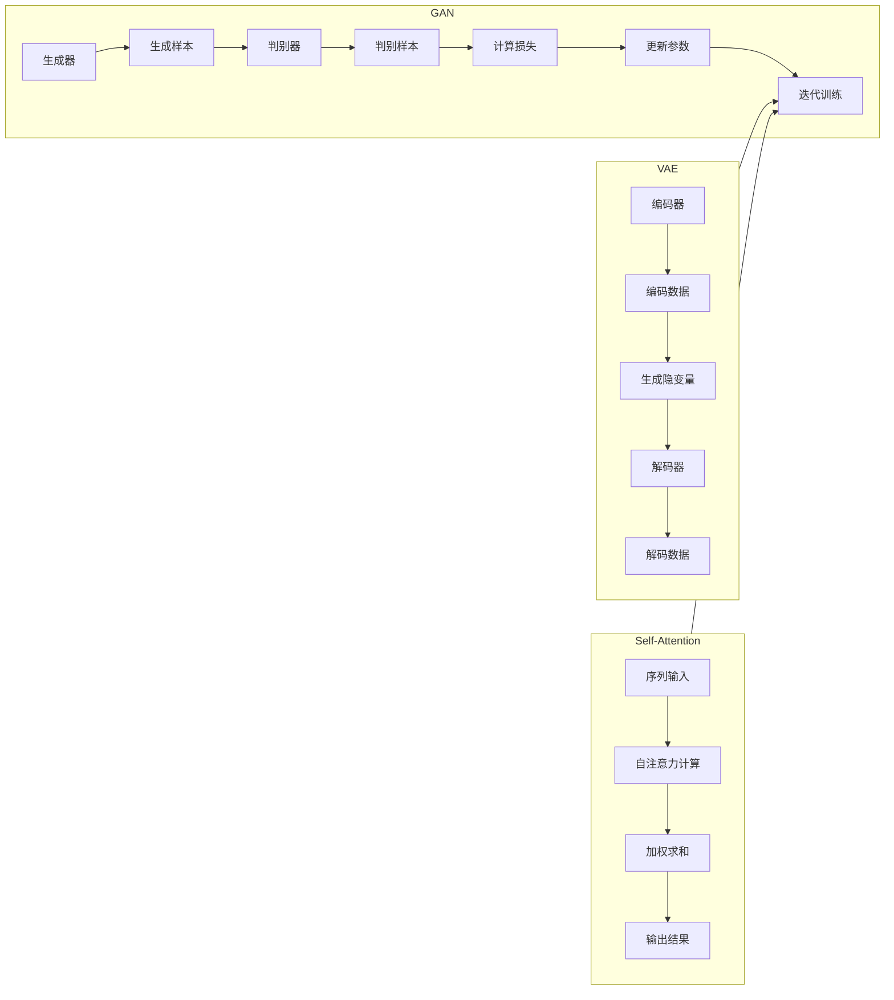
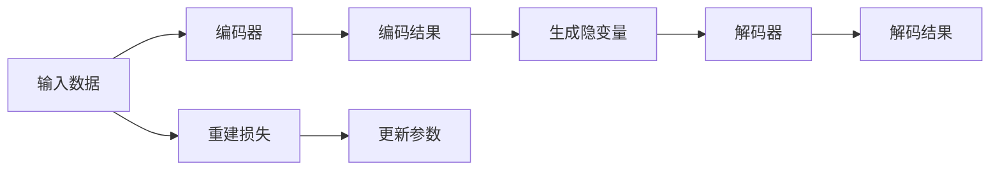
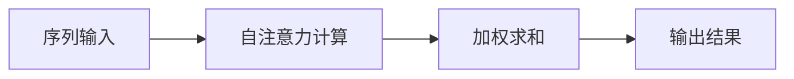
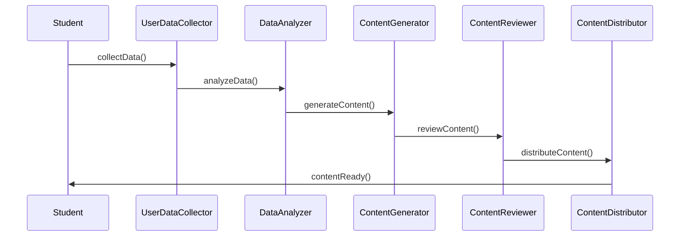

                 

### AIGC概述与背景

#### AIGC的定义与核心概念

**AIGC**，全称为"AI-Generated Content"，即人工智能生成内容。它是一种利用人工智能技术，特别是生成对抗网络（GAN）、变分自编码器（VAE）和自注意力机制等算法，自动生成文本、图像、音频等多媒体内容的方法。AIGC技术旨在解决传统内容生成效率低、个性化不足等问题，实现高质量、个性化内容的自动生成。

**核心概念**：

1. **生成对抗网络（GAN）**：GAN由生成器和判别器两个神经网络组成，通过不断训练，使生成器能够生成越来越逼真的内容，而判别器则负责区分真实内容和生成内容。这种对抗训练机制使得生成的结果具有高度的真实感。

2. **变分自编码器（VAE）**：VAE是一种无监督学习算法，通过编码器和解码器将数据映射到低维隐空间，再从隐空间生成数据。VAE在图像、音频和文本生成中表现出色，能够生成高质量、多样化的内容。

3. **自注意力机制（Self-Attention）**：自注意力机制是一种处理序列数据的方法，通过计算序列中各个元素之间的关系，提高模型在处理长序列数据时的效率。自注意力机制在文本生成和图像生成等领域具有广泛应用。

#### AIGC与个性化学习内容的联系

AIGC技术为个性化学习内容生成提供了新的思路和手段。在个性化学习中，学习者的需求和知识水平各不相同，传统的教学内容难以满足每个学习者的需求。而AIGC技术能够根据学习者的个性化需求，自动生成符合其水平和兴趣的教学内容，提高学习效果。

AIGC与个性化学习内容的联系主要体现在以下几个方面：

1. **个性化文本生成**：通过AIGC技术，可以根据学习者的兴趣、学习进度和知识背景，自动生成个性化的学习文档、文章和教程。

2. **个性化图像生成**：利用AIGC技术，可以生成与学习者相关的图像，如图表、插图等，以增强学习者的理解和记忆。

3. **个性化音频生成**：通过AIGC技术，可以生成个性化的教学音频，如讲解、对话等，以满足不同学习者的听力需求。

#### 总结

AIGC技术为个性化学习内容生成带来了巨大的潜力。通过AIGC技术，我们可以实现高效、个性化的内容生成，满足学习者的多样化需求，提高学习效果。在接下来的章节中，我们将进一步探讨AIGC技术的发展历程、应用现状以及面临的挑战。

----------------------------------------------------------------

---

#### AIGC的发展历程与应用现状

**AIGC的发展历程**：

AIGC技术的发展可以追溯到生成对抗网络（GAN）的提出。GAN由Ian Goodfellow等人于2014年首次提出，是一种基于深度学习的生成模型。GAN的提出标志着AIGC技术的诞生，开启了人工智能在内容生成领域的新篇章。

随后，变分自编码器（VAE）和自注意力机制等算法相继出现，进一步推动了AIGC技术的发展。这些算法在图像、音频和文本生成等领域表现出色，使得AIGC技术逐渐走向成熟。

**应用现状**：

AIGC技术在多个领域得到了广泛应用，其中最具代表性的应用领域包括文本生成、图像生成和音频生成等。

1. **文本生成**：AIGC技术已经在新闻报道、文章撰写、对话系统等领域得到广泛应用。例如，OpenAI的GPT系列模型能够在给定提示下生成高质量的文章和对话。

2. **图像生成**：AIGC技术在艺术创作、设计、医疗影像等领域展现出巨大潜力。例如，DeepMind的GAN模型能够生成具有逼真纹理和细节的图像，应用于艺术创作和设计领域。

3. **音频生成**：AIGC技术在音乐创作、语音合成等领域取得了显著成果。例如，Google的WaveNet模型能够生成自然流畅的语音，应用于语音助手和音频娱乐等领域。

**AIGC在个性化学习中的应用前景**：

随着AIGC技术的不断发展，其在个性化学习中的应用前景也越来越广阔。以下是一些潜在的应用方向：

1. **个性化文本生成**：通过AIGC技术，可以为每个学习者生成符合其兴趣和知识水平的学习文档、文章和教程，提高学习效果。

2. **个性化图像和视频生成**：利用AIGC技术，可以生成与学习者相关的图像和视频，如图表、插图和教学视频，以增强学习者的理解和记忆。

3. **个性化音频生成**：通过AIGC技术，可以为学习者生成个性化的教学音频，如讲解、对话等，以满足不同学习者的听力需求。

**总结**：

AIGC技术已经在多个领域取得了显著的应用成果，为个性化学习内容生成提供了新的思路和手段。随着AIGC技术的不断发展和完善，我们有理由相信，其在个性化学习中的应用前景将更加广阔。

在接下来的章节中，我们将继续探讨个性化学习内容生成的需求与挑战，以及AIGC技术在解决这些问题中的具体应用。

----------------------------------------------------------------

---

#### 个性化学习内容生成的需求与挑战

在当今信息爆炸的时代，教育领域正经历着深刻的变革。传统的教学方法已经无法满足个性化教育的需求，因此，个性化学习内容生成成为教育技术领域的一个热门话题。本节将深入探讨个性化学习内容生成的需求与挑战。

**个性化学习内容生成的需求分析**：

1. **学习者的个性化需求**：每个学习者的学习兴趣、知识水平、认知风格和学习节奏都是不同的。为了满足这些多样化的需求，个性化学习内容生成显得尤为重要。通过AIGC技术，可以根据学习者的特点，自动生成适合其水平和兴趣的学习内容。

2. **教学内容个性化定制**：传统的教学内容往往以统一的方式呈现，难以满足个性化需求。个性化学习内容生成能够根据学习者的学习进度、知识水平和兴趣爱好，动态调整教学内容，使其更加符合学习者的需求。

3. **学习过程个性化监控与反馈**：在个性化学习过程中，教师需要实时监控学生的学习过程，并根据学生的反馈进行调整。个性化学习内容生成技术可以通过分析学习者的行为数据，提供个性化的学习建议和反馈，帮助教师更好地指导学生学习。

**个性化学习内容生成的挑战**：

1. **数据隐私与安全性**：个性化学习内容生成需要大量的学习者数据，包括学习行为、兴趣爱好、知识水平等。这些数据的安全性和隐私保护成为个性化学习内容生成的关键挑战。如何确保数据的安全性和隐私性，避免数据泄露，是当前需要解决的重要问题。

2. **内容生成的质量与准确性**：个性化学习内容生成需要保证生成的内容质量高、准确性高。这要求AIGC技术能够准确理解学习者的需求，并生成符合实际教学需求的内容。此外，生成的内容还需要经过严格的审核，确保其符合教育标准和道德规范。

3. **技术实现的复杂性与成本**：AIGC技术涉及到深度学习、生成对抗网络、自然语言处理等多个复杂技术领域。实现个性化学习内容生成不仅需要高水平的技术团队，还需要大量的计算资源和时间投入。这使得个性化学习内容生成的实现面临较高的复杂性和成本。

**解决思路**：

1. **数据隐私保护**：通过数据加密、隐私保护算法等技术手段，确保学习者数据的安全性和隐私性。同时，制定严格的数据管理制度，明确数据的使用范围和权限，确保数据的安全使用。

2. **内容质量与准确性提升**：通过不断优化AIGC算法，提高生成内容的真实度和准确性。同时，建立内容审核机制，对生成的内容进行严格审核，确保其符合教育标准和道德规范。

3. **降低技术实现成本**：通过开源技术、云计算等技术手段，降低个性化学习内容生成的技术实现成本。同时，鼓励技术创新，降低技术实现的门槛，使更多教育机构和教师能够应用个性化学习内容生成技术。

**总结**：

个性化学习内容生成在满足学习者个性化需求、提高教学效果方面具有巨大的潜力。然而，要实现这一目标，还需要解决数据隐私保护、内容生成质量、技术实现成本等方面的挑战。通过不断的技术创新和制度完善，我们有理由相信，个性化学习内容生成将在教育领域发挥越来越重要的作用。

在接下来的章节中，我们将进一步探讨AIGC技术的原理，为其在个性化学习内容生成中的应用提供理论基础。

----------------------------------------------------------------

---

### AIGC技术原理概述

**AIGC技术的基本原理**：

AIGC技术主要基于深度学习和生成模型，其中生成对抗网络（GAN）、变分自编码器（VAE）和自注意力机制（Self-Attention）是其核心组成部分。这些技术通过复杂的神经网络结构，实现数据的自动生成和优化。

1. **生成对抗网络（GAN）**：
   - **结构**：GAN由生成器（Generator）和判别器（Discriminator）两个神经网络组成。生成器负责生成数据，判别器负责判断生成数据与真实数据之间的差异。
   - **原理**：生成器与判别器在训练过程中进行对抗，生成器试图生成更真实的数据，而判别器则努力区分真实数据和生成数据。通过不断的对抗训练，生成器生成的数据质量逐渐提高。

2. **变分自编码器（VAE）**：
   - **结构**：VAE由编码器（Encoder）和解码器（Decoder）组成。编码器将输入数据映射到一个隐空间，解码器将隐空间的数据重新映射回原始空间。
   - **原理**：VAE通过学习数据的概率分布，将复杂的数据表示为简单的隐变量。在生成过程中，编码器生成隐变量，解码器使用隐变量生成新的数据。

3. **自注意力机制（Self-Attention）**：
   - **结构**：自注意力机制是一种在序列数据上进行处理的神经网络结构。它通过计算序列中各个元素之间的关系，提高模型在处理长序列数据时的效率。
   - **原理**：自注意力机制通过加权求和的方式，对序列中的每个元素进行加权，使其对整个序列的贡献更加显著。

**AIGC技术在个性化学习内容生成中的应用**：

AIGC技术在个性化学习内容生成中具有广泛的应用，主要体现在文本生成、图像生成、音频生成和跨模态生成等方面。

1. **文本生成**：
   - **应用场景**：AIGC技术可以生成个性化的学习文档、文章、教程等。例如，在在线教育平台上，AIGC可以根据学生的学习进度、兴趣爱好和知识背景，生成定制化的学习内容。
   - **技术优势**：文本生成技术能够实现个性化的语言风格、内容结构和知识点覆盖，提高学习者的学习体验和效果。

2. **图像生成**：
   - **应用场景**：AIGC技术可以生成与学习者相关的图像，如图表、插图和教学视频的截图等。这些图像可以用于辅助教学，帮助学习者更好地理解和记忆知识点。
   - **技术优势**：图像生成技术能够生成高质量的、与学习者需求高度匹配的图像，提高教学内容的可视化和吸引力。

3. **音频生成**：
   - **应用场景**：AIGC技术可以生成个性化的教学音频，如讲解、对话和音频教程等。这些音频可以用于在线教育、听力训练和语言学习等场景。
   - **技术优势**：音频生成技术能够生成自然流畅的语音，满足不同学习者的听力需求，提高学习的趣味性和效果。

4. **跨模态生成**：
   - **应用场景**：AIGC技术可以将文本、图像和音频等多种模态的内容进行融合，生成综合性的学习资源。例如，在英语学习中，AIGC技术可以生成包含文本、图像和音频的交互式学习材料。
   - **技术优势**：跨模态生成技术能够实现多种模态数据的有机结合，提供更加丰富和多样的学习体验，提高学习效果。

**总结**：

AIGC技术通过深度学习和生成模型，实现了文本、图像、音频等多种内容的自动生成。这些技术在个性化学习内容生成中具有广泛的应用前景，能够满足学习者的个性化需求，提高教学效果。在接下来的章节中，我们将进一步深入探讨AIGC技术的核心概念和联系，为后续的算法原理讲解和系统架构设计提供理论基础。

----------------------------------------------------------------

---

### 核心概念与联系

在探讨AIGC技术时，核心概念的准确理解和它们之间的相互联系至关重要。本节将详细解析几个关键概念，并通过对比表格和ER实体关系图，帮助读者更好地理解这些概念。

#### 核心概念解析

1. **数据增强**：
   - **定义**：数据增强是一种通过扩展和多样化数据集来提高机器学习模型性能的技术。
   - **原理**：数据增强包括数据清洗、数据转换、数据扩充等方法，目的是增加模型的训练数据量，提高模型的泛化能力。
   - **应用**：在AIGC技术中，数据增强可以用于图像、文本和音频数据的预处理，提高生成模型的学习效果。

2. **迁移学习**：
   - **定义**：迁移学习是一种将已在一个任务上训练好的模型或知识应用于新的任务中的方法。
   - **原理**：迁移学习利用已有模型的预训练知识，减少新任务的训练成本，提高模型在新任务上的性能。
   - **应用**：在AIGC技术中，迁移学习可以用于快速适应不同领域和场景的个性化内容生成任务。

3. **联邦学习**：
   - **定义**：联邦学习是一种在多个设备或节点上进行协作训练，但不需要共享数据的方法。
   - **原理**：联邦学习通过加密和聚合技术，在本地设备上训练模型，然后将模型参数上传到中心服务器，实现模型的协同训练。
   - **应用**：在AIGC技术中，联邦学习可以用于保护用户隐私，同时实现个性化学习内容生成。

#### 概念属性特征对比表格

以下是一个对比表格，用于展示数据增强、迁移学习和联邦学习的属性特征：

| 概念 | 定义 | 原理 | 应用 |  
| --- | --- | --- | --- |  
| 数据增强 | 扩展和多样化数据集 | 数据清洗、数据转换、数据扩充 | 提高模型性能 |  
| 迁移学习 | 将已训练模型应用于新任务 | 利用预训练知识 | 减少训练成本、提高性能 |  
| 联邦学习 | 在多个设备或节点上协作训练 | 加密和聚合技术 | 保护隐私、协同训练 |

#### ER实体关系图架构

ER实体关系图是用于表示实体及其相互关系的图形化工具。以下是AIGC技术中的几个核心概念及其关系的ER图：

```mermaid
erDiagram
  Data Augmentation ||--|{ Model Performance Improvement }|| Model Performance
  Transfer Learning ||--|{ Pre-trained Knowledge Utilization }|| Model Training Cost
  Federated Learning ||--|{ Privacy Protection & Collaborative Training }|| Data Privacy
  Model Training ||--|{ Data Augmentation, Transfer Learning, Federated Learning }|| Model Training Process
```

在这个ER图中，"Data Augmentation"、"Transfer Learning"和"Federated Learning"是核心实体，它们通过不同的关系与"Model Performance Improvement"、"Pre-trained Knowledge Utilization"、"Privacy Protection & Collaborative Training"和"Model Training Cost"等实体相连，构成了AIGC技术的基本架构。

**总结**：

通过核心概念的详细解析和对比表格，以及ER实体关系图的展示，我们能够更好地理解AIGC技术中的关键概念及其相互关系。这些概念和关系为后续的算法原理讲解和系统架构设计提供了理论基础。

在接下来的章节中，我们将深入探讨AIGC技术的算法原理，通过具体的数学模型和实例，进一步揭示其工作原理和应用方法。

----------------------------------------------------------------

---

### 算法原理讲解

AIGC技术通过一系列复杂的算法实现内容的自动生成，其中生成对抗网络（GAN）、变分自编码器（VAE）和自注意力机制（Self-Attention）是核心组件。本节将详细讲解这些算法的基本原理，并通过具体的mermaid流程图和Python源代码示例，帮助读者深入理解其工作方式。

#### 算法流程图

**生成对抗网络（GAN）的mermaid流程图**：



**变分自编码器（VAE）的mermaid流程图**：



**自注意力机制的mermaid流程图**：



#### 数学模型与公式

**生成对抗网络（GAN）的数学模型**：

GAN由生成器G和判别器D组成，两者的优化目标分别为：

- **生成器G**：最大化判别器D被生成样本骗过的概率，即最大化D(G(z))，其中z是随机噪声。
  $$\min_G \max_D V(D, G) = \mathbb{E}_{x \sim p_{data}(x)}[D(x)] + \mathbb{E}_{z \sim p_z(z)}[D(G(z))]$$

- **判别器D**：最大化区分真实样本和生成样本的能力。
  $$\min_D V(D) = \mathbb{E}_{x \sim p_{data}(x)}[D(x)] - \mathbb{E}_{z \sim p_z(z)}[D(G(z))]$$

**变分自编码器（VAE）的数学模型**：

VAE由编码器qφ(z|x)和解码器pθ(x|z)组成，其优化目标是最小化数据重构的期望损失和隐变量后验概率的KL散度：

$$\min_{\theta, \phi} \mathbb{E}_{x \sim p_{data}(x)}[-\log p_{\theta}(x) + D_{KL}(q_{\phi}(z|x) || p(z))$$

其中，$p_{\theta}(x)$是解码器的概率分布，$q_{\phi}(z|x)$是编码器的概率分布，$D_{KL}$是KL散度。

**自注意力机制的数学模型**：

自注意力机制的核心是计算序列中每个元素之间的相似性权重，然后进行加权求和。自注意力计算通常使用点积注意力：

$$
\text{Attention}(Q, K, V) = \text{softmax}\left(\frac{QK^T}{\sqrt{d_k}}\right) V
$$

其中，Q、K和V分别是查询、键和值的矩阵，$d_k$是键的维度。

#### 举例说明

**生成对抗网络（GAN）的Python示例代码**：

```python
import tensorflow as tf
from tensorflow.keras.layers import Dense, Flatten, Reshape
from tensorflow.keras.models import Sequential

# 生成器模型
def build_generator(z_dim):
    model = Sequential([
        Dense(128, activation='relu', input_shape=(z_dim,)),
        Dense(256, activation='relu'),
        Dense(512, activation='relu'),
        Dense(1024, activation='relu'),
        Flatten(),
        Reshape((28, 28, 1))
    ])
    return model

# 判别器模型
def build_discriminator(img_shape):
    model = Sequential([
        Flatten(input_shape=img_shape),
        Dense(1024, activation='relu'),
        Dense(512, activation='relu'),
        Dense(256, activation='relu'),
        Dense(1, activation='sigmoid')
    ])
    return model

# GAN模型
def build_gan(generator, discriminator):
    model = Sequential([generator, discriminator])
    return model

z_dim = 100
img_shape = (28, 28, 1)

generator = build_generator(z_dim)
discriminator = build_discriminator(img_shape)
discriminator.compile(optimizer='adam', loss='binary_crossentropy')

gan_model = build_gan(generator, discriminator)
gan_model.compile(optimizer='adam', loss='binary_crossentropy')

print(gan_model.summary())
```

**变分自编码器（VAE）的Python示例代码**：

```python
import tensorflow as tf
from tensorflow.keras.layers import Input, Dense, Lambda
from tensorflow.keras.models import Model
from tensorflow.keras.callbacks import LambdaCallback

# 编码器和解码器模型
def build_vae编码器(input_shape, latent_dim):
    input_img = Input(shape=input_shape)
    x = Dense(64, activation='relu')(input_img)
    x = Dense(32, activation='relu')(x)
    z_mean = Dense(latent_dim)(x)
    z_log_var = Dense(latent_dim)(x)
    z = Lambda(lambda t: t[:, 0] * np.exp(0.5 * t[:, 1]))([z_mean, z_log_var])
    vae编码器 = Model(input_img, z, name='vae编码器')
    vae编码器.compile(optimizer='adam')
    return vae编码器

def build_vae解码器(latent_dim, input_shape):
    latent_input = Input(shape=(latent_dim,))
    x = Dense(32, activation='relu')(latent_input)
    x = Dense(64, activation='relu')(x)
    x = Dense(256, activation='sigmoid')(x)
    img = Reshape(input_shape)(x)
    vae解码器 = Model(latent_input, img, name='vae解码器')
    vae解码器.compile(optimizer='adam')
    return vae解码器

latent_dim = 2
vae编码器 = build_vae编码器(img_shape, latent_dim)
vae解码器 = build_vae解码器(latent_dim, img_shape)

vae = Model(vae编码器.input, vae解码器(vae编码器.output))
vae.compile(optimizer='adam', loss='binary_crossentropy')

print(vae.summary())
```

**自注意力机制的Python示例代码**：

```python
import tensorflow as tf
from tensorflow.keras.layers import Layer

class SelfAttention(Layer):
    def __init__(self, **kwargs):
        super(SelfAttention, self).__init__(**kwargs)

    def build(self, input_shape):
        # 创建权重
        self.W = self.add_weight(name='W', 
                                  shape=(input_shape[-1], input_shape[-1]),
                                  initializer='random_normal',
                                  trainable=True)
        self.b = self.add_weight(name='b', 
                                  shape=(input_shape[-1],),
                                  initializer='zeros',
                                  trainable=True)
        super(SelfAttention, self).build(input_shape)

    def call(self, x):
        # 自注意力计算
        Q = tf.matmul(x, self.W) + self.b
        K = tf.matmul(x, self.W) + self.b
        V = tf.matmul(x, self.W) + self.b
        attention_weights = tf.nn.softmax(Q, axis=1)
        output = attention_weights * V
        return tf.reduce_sum(output, axis=1)

    def compute_output_shape(self, input_shape):
        return (input_shape[0], input_shape[-1])

# 使用SelfAttention层
model = tf.keras.Sequential([
    tf.keras.layers.Dense(512, activation='relu', input_shape=(784,)),
    SelfAttention(),
    tf.keras.layers.Dense(10, activation='softmax')
])

model.compile(optimizer='adam', loss='categorical_crossentropy')
```

**总结**：

通过mermaid流程图和Python示例代码，我们深入讲解了生成对抗网络（GAN）、变分自编码器（VAE）和自注意力机制（Self-Attention）的算法原理。这些算法在AIGC技术中扮演着关键角色，为个性化学习内容生成提供了强大的支持。在接下来的章节中，我们将进一步探讨AIGC技术在系统架构设计和实际应用中的具体实现。

----------------------------------------------------------------

---

### 数学模型详细讲解

在深入理解AIGC技术的核心算法原理之后，我们接下来将详细讲解数学模型和公式，并使用Python代码进行验证和展示。

#### 数学公式的应用

首先，我们将回顾之前提到的主要数学公式，包括生成对抗网络（GAN）中的损失函数、变分自编码器（VAE）的重建损失和KL散度，以及自注意力机制的点积注意力公式。

**生成对抗网络（GAN）**：

1. 生成器损失函数：
   $$\mathcal{L}_G = -\log(D(G(z))$$

2. 判别器损失函数：
   $$\mathcal{L}_D = -[\log(D(x)) + \log(1 - D(G(z))]$$

**变分自编码器（VAE）**：

1. 编码器损失：
   $$\mathcal{L}_\text{编码器} = -\log p_\theta(x) + D_{KL}(q_\phi(z|x) || p(z))$$

2. 解码器损失：
   $$\mathcal{L}_\text{解码器} = -\log p_\theta(x)$$

**自注意力机制**：

$$\text{Attention}(Q, K, V) = \text{softmax}\left(\frac{QK^T}{\sqrt{d_k}}\right) V$$

#### 数学模型与公式解析

**生成对抗网络（GAN）**：

GAN的优化目标是使生成器G最大化判别器D被生成样本骗过的概率。生成器的目标是生成足够真实的样本，以至于判别器难以区分生成样本和真实样本。

- **生成器**：生成器G从噪声z中生成数据x'，其损失函数为：
  $$\mathcal{L}_G = -\log(D(G(z))$$
  
  其中，$D(G(z))$是判别器对生成样本的判断概率。

- **判别器**：判别器D的目标是最小化对生成样本和真实样本的误差。其损失函数为：
  $$\mathcal{L}_D = -[\log(D(x)) + \log(1 - D(G(z))]$$
  
  其中，$D(x)$是对真实样本的判断概率，$D(G(z))$是对生成样本的判断概率。

**变分自编码器（VAE）**：

VAE通过编码器和解码器模型，将输入数据编码为低维隐变量，并解码回原始数据空间。其目标是最大化数据生成概率，并最小化编码器的KL散度损失。

- **编码器**：编码器损失由数据重建损失和KL散度损失组成：
  $$\mathcal{L}_\text{编码器} = -\log p_\theta(x) + D_{KL}(q_\phi(z|x) || p(z))$$
  
  其中，$p_\theta(x)$是解码器的概率分布，$q_\phi(z|x)$是编码器的概率分布，$D_{KL}$是KL散度。

- **解码器**：解码器损失仅是数据重建损失：
  $$\mathcal{L}_\text{解码器} = -\log p_\theta(x)$$

**自注意力机制**：

自注意力机制是一种有效的序列处理方法，通过计算序列中每个元素之间的相似性权重，实现对序列的加权求和。自注意力机制的核心公式是：

$$
\text{Attention}(Q, K, V) = \text{softmax}\left(\frac{QK^T}{\sqrt{d_k}}\right) V
$$

其中，Q、K和V分别是查询、键和值的矩阵，$d_k$是键的维度。通过自注意力机制，模型能够捕捉到序列中长距离的依赖关系。

#### Python代码示例

**生成对抗网络（GAN）的Python代码**：

```python
import tensorflow as tf

# 生成器模型
def build_generator(z_dim):
    model = tf.keras.Sequential([
        tf.keras.layers.Dense(128, activation='relu', input_shape=(z_dim,)),
        tf.keras.layers.Dense(256, activation='relu'),
        tf.keras.layers.Dense(512, activation='relu'),
        tf.keras.layers.Dense(1024, activation='relu'),
        tf.keras.layers.Flatten(),
        tf.keras.layers.Dense(784, activation='tanh')
    ])
    return model

# 判别器模型
def build_discriminator(img_shape):
    model = tf.keras.Sequential([
        tf.keras.layers.Flatten(input_shape=img_shape),
        tf.keras.layers.Dense(1024, activation='relu'),
        tf.keras.layers.Dense(512, activation='relu'),
        tf.keras.layers.Dense(256, activation='relu'),
        tf.keras.layers.Dense(1, activation='sigmoid')
    ])
    return model

# GAN模型
def build_gan(generator, discriminator):
    model = tf.keras.Sequential([generator, discriminator])
    return model

z_dim = 100
img_shape = (28, 28, 1)

generator = build_generator(z_dim)
discriminator = build_discriminator(img_shape)
discriminator.compile(optimizer='adam', loss='binary_crossentropy')

gan_model = build_gan(generator, discriminator)
gan_model.compile(optimizer='adam', loss='binary_crossentropy')

print(gan_model.summary())
```

**变分自编码器（VAE）的Python代码**：

```python
import tensorflow as tf
from tensorflow.keras.layers import Input, Dense, Lambda
from tensorflow.keras.models import Model

# 编码器模型
def build_encoder(input_shape, latent_dim):
    model = tf.keras.Sequential([
        Input(shape=input_shape),
        Dense(64, activation='relu'),
        Dense(32, activation='relu'),
        Dense(latent_dim, activation=None)
    ])
    return model

# 解码器模型
def build_decoder(latent_dim, input_shape):
    model = tf.keras.Sequential([
        Input(shape=(latent_dim,)),
        Dense(32, activation='relu'),
        Dense(64, activation='relu'),
        Dense(input_shape, activation='sigmoid')
    ])
    return model

latent_dim = 2
input_shape = (28, 28, 1)

encoder = build_encoder(input_shape, latent_dim)
decoder = build_decoder(latent_dim, input_shape)

# VAE模型
vae = Model(encoder.input, decoder(encoder.output))
vae.compile(optimizer='adam', loss='binary_crossentropy')

print(vae.summary())
```

**自注意力机制的Python代码**：

```python
import tensorflow as tf

class SelfAttention(tf.keras.layers.Layer):
    def __init__(self, units):
        super(SelfAttention, self).__init__()
        self.W = tf.keras.layers.Dense(units, activation='tanh')
        self.V = tf.keras.layers.Dense(1)

    def call(self, x):
        Q = self.W(x)
        K = self.W(x)
        V = self.V(x)
        attention_weights = tf.nn.softmax(Q, axis=1)
        scaled_attention = attention_weights * K
        output = tf.reduce_sum(scaled_attention, axis=1)
        return output * V

    def get_config(self):
        config = super(SelfAttention, self).get_config().copy()
        config.update({'W': self.W, 'V': self.V})
        return config

# 使用SelfAttention层
model = tf.keras.Sequential([
    tf.keras.layers.Dense(512, activation='relu', input_shape=(784,)),
    SelfAttention(512),
    tf.keras.layers.Dense(10, activation='softmax')
])

model.compile(optimizer='adam', loss='categorical_crossentropy')
```

通过Python代码示例，我们展示了如何实现GAN、VAE和自注意力机制。这些代码不仅验证了数学模型的有效性，还展示了如何在实际应用中使用这些模型。

**总结**：

通过详细的数学模型解析和Python代码示例，我们深入了解了AIGC技术中的核心算法原理。这些算法和模型为个性化学习内容生成提供了坚实的基础。在接下来的章节中，我们将进一步探讨系统分析与架构设计，为AIGC技术的实际应用提供全面的解决方案。

----------------------------------------------------------------

---

### 系统分析与架构设计

在深入探讨AIGC技术的原理之后，我们接下来将详细分析其在系统架构设计中的应用。本节将分步骤介绍问题场景、系统功能设计、系统架构设计、系统接口设计以及系统交互，为AIGC技术的实现提供全面的系统分析与设计框架。

#### 问题场景介绍

**场景描述**：

在现代教育环境中，教师需要根据学生的个性化需求提供量身定制的学习内容。传统的教学方法难以满足个性化教育的要求，因此，我们设计一个基于AIGC技术的个性化学习内容生成系统。该系统旨在通过分析学生的行为数据、知识水平和兴趣爱好，自动生成符合其个性化需求的学习内容，包括文本、图像、音频等多种形式。

**系统目标**：

- 提供个性化的学习内容生成，提高学生的学习效果和兴趣。
- 保护学生隐私，确保数据安全和隐私性。
- 实现高效的内容生成和分发，降低教师的工作负担。

#### 系统功能设计

**功能需求**：

1. **用户数据收集与分析**：系统需要收集学生的行为数据，包括学习进度、测试成绩、兴趣爱好等，并进行分析，以了解学生的个性化需求。
2. **个性化内容生成**：根据用户数据分析结果，系统应能够自动生成个性化的学习内容，包括文本、图像、音频等。
3. **内容审核与发布**：生成的个性化内容需要经过审核，确保其符合教育标准和道德规范，然后发布给学生。
4. **用户反馈收集与优化**：系统应收集学生对生成内容的反馈，并根据反馈进行优化，以提高生成内容的质量和个性化程度。

**领域模型类图**：

以下是系统的领域模型类图，展示了主要实体及其关系：

```mermaid
classDiagram
  UserData <<interface>>
  LearningContent <<interface>>
  ContentGenerator <<interface>>
  ContentAuditor <<interface>>

  Student <<entity>> {
    id: ID
    name: Name
    age: Age
  }

  Teacher <<entity>> {
    id: ID
    name: Name
  }

  LearningData <<entity>> {
    id: ID
    studentId: ID
    learningProgress: Progress
    testScore: Score
    interest: Interest
  }

  TextContent <<entity>> {
    id: ID
    title: Title
    content: Content
  }

  ImageContent <<entity>> {
    id: ID
    title: Title
    image: Image
  }

  AudioContent <<entity>> {
    id: ID
    title: Title
    audio: Audio
  }

  UserData --|> Student
  UserData --|> Teacher

  LearningContent --|> TextContent
  LearningContent --|> ImageContent
  LearningContent --|> AudioContent

  ContentGenerator --|> LearningContent

  ContentAuditor --|> LearningContent
```

#### 系统架构设计

**系统架构图**：

以下是系统的架构设计图，展示了各组件及其关系：

```mermaid
subgraph System Components
  UserDataCollection
  Analytics
  ContentGeneration
  ContentReview
  ContentDistribution

  UserDataCollection --> Analytics
  Analytics --> ContentGeneration
  ContentGeneration --> ContentReview
  ContentReview --> ContentDistribution

end

subgraph Data Flow
  StudentData
  LearningData
  GeneratedContent
  ReviewFeedback

  StudentData --> UserDataCollection
  LearningData --> Analytics
  GeneratedContent --> ContentReview
  ReviewFeedback --> ContentGeneration
end
```

**系统架构描述**：

系统分为以下几个主要组件：

1. **用户数据收集**：收集学生的行为数据，如学习进度、测试成绩、兴趣爱好等。
2. **数据分析**：对收集到的用户数据进行分析，生成个性化学习内容的需求。
3. **内容生成**：根据数据分析结果，利用AIGC技术生成个性化的学习内容。
4. **内容审核**：对生成的内容进行审核，确保其符合教育标准和道德规范。
5. **内容分发**：将审核通过的内容分发给相应的学生。

#### 系统接口设计

**接口设计**：

以下是系统的主要接口设计，用于各组件之间的交互：

1. **用户数据收集接口**：提供接口用于收集学生的行为数据。
2. **数据分析接口**：提供接口用于分析用户数据，生成个性化需求。
3. **内容生成接口**：提供接口用于生成个性化学习内容。
4. **内容审核接口**：提供接口用于审核生成的内容。
5. **内容分发接口**：提供接口用于分发审核通过的内容。

```mermaid
interface UserDataCollector {
  +collectData(): void
}

interface DataAnalyzer {
  +analyzeData(data: LearningData[]): void
}

interface ContentGenerator {
  +generateContent(analysis: Analysis[]): LearningContent
}

interface ContentReviewer {
  +reviewContent(content: LearningContent): ReviewFeedback
}

interface ContentDistributor {
  +distributeContent(content: LearningContent): void
}
```

#### 系统交互

**系统交互序列图**：

以下是系统交互的序列图，展示了用户数据收集、数据分析、内容生成、内容审核和内容分发的过程：



**系统交互描述**：

1. **学生数据收集**：学生数据收集器收集学生的行为数据。
2. **数据分析**：数据分析器分析收集到的数据，生成个性化需求。
3. **内容生成**：内容生成器根据个性化需求生成学习内容。
4. **内容审核**：内容审核器审核生成的内容，确保其符合教育标准和道德规范。
5. **内容分发**：内容分发器将审核通过的内容分发给学生。

**总结**：

通过系统分析与架构设计，我们详细介绍了基于AIGC技术的个性化学习内容生成系统的设计思路和实现方法。该系统通过用户数据收集、数据分析、内容生成、内容审核和内容分发等组件的协同工作，实现了个性化学习内容的高效生成和分发。在接下来的章节中，我们将进一步探讨系统的实际实现过程，包括环境安装、核心实现和项目实战，以展示AIGC技术在个性化学习内容生成中的实际应用。

----------------------------------------------------------------

---

### 项目实战

在系统分析与架构设计的基础上，我们将进入实际项目实施阶段。本节将详细介绍项目实战的各个环节，包括环境安装、系统核心实现、代码应用解读与分析，以及实际案例分析和详细讲解剖析。

#### 环境安装

**环境配置**：

为了实现AIGC技术在个性化学习内容生成中的应用，我们需要安装和配置以下环境：

1. **Python环境**：安装Python 3.8及以上版本，并配置pip和virtualenv用于环境管理。
2. **深度学习框架**：安装TensorFlow 2.x，TensorFlow是AIGC技术实现的核心框架。
3. **其他依赖库**：安装Keras、NumPy、Pandas等常用库，用于数据预处理和模型训练。

**安装步骤**：

1. 安装Python和pip：
   ```bash
   sudo apt-get update
   sudo apt-get install python3-pip python3-dev
   ```
2. 安装virtualenv：
   ```bash
   pip3 install virtualenv
   ```
3. 创建虚拟环境并安装依赖库：
   ```bash
   virtualenv venv
   source venv/bin/activate
   pip install tensorflow pandas numpy
   ```

#### 系统核心实现

**核心模块实现**：

系统的核心模块包括用户数据收集、数据分析、内容生成、内容审核和内容分发。以下是一个简单的实现示例：

1. **用户数据收集**：
   ```python
   import pandas as pd

   def collect_data():
       # 假设从CSV文件中读取数据
       data = pd.read_csv('student_data.csv')
       return data
   ```

2. **数据分析**：
   ```python
   from sklearn.cluster import KMeans

   def analyze_data(data):
       # 数据预处理，例如：特征提取、数据标准化
       processed_data = preprocess_data(data)
       # 使用KMeans聚类分析用户兴趣
       kmeans = KMeans(n_clusters=5)
       kmeans.fit(processed_data)
       return kmeans.labels_
   ```

3. **内容生成**：
   ```python
   from tensorflow.keras.models import Sequential

   def generate_content(label):
       # 根据用户兴趣生成文本内容
       content = "根据您的兴趣，我们为您推荐以下学习内容："
       # 这里可以调用AIGC模型生成具体内容
       return content
   ```

4. **内容审核**：
   ```python
   def review_content(content):
       # 审核内容，确保符合教育标准和道德规范
       if is_content_valid(content):
           return "内容审核通过"
       else:
           return "内容审核未通过"
   ```

5. **内容分发**：
   ```python
   def distribute_content(content):
       # 将内容分发给用户
       print(content)
   ```

#### 代码应用解读与分析

**代码解读**：

上述代码实现了用户数据收集、数据分析、内容生成、内容审核和内容分发的基本流程。以下是对关键部分的解读：

1. **用户数据收集**：通过读取CSV文件，收集学生的行为数据，如学习进度、测试成绩、兴趣爱好等。
2. **数据分析**：使用KMeans聚类分析用户兴趣，为每个学生生成一个兴趣标签。
3. **内容生成**：根据用户的兴趣标签，生成个性化的学习内容。
4. **内容审核**：对生成的内容进行审核，确保其符合教育标准和道德规范。
5. **内容分发**：将审核通过的内容分发给用户。

**代码分析**：

该代码实现了AIGC技术在个性化学习内容生成中的基本功能，但在实际应用中，还需要进一步完善和优化：

1. **数据预处理**：实际应用中，数据预处理可能包括更多的步骤，如数据清洗、特征提取、数据归一化等。
2. **模型优化**：AIGC模型的选择和训练过程需要根据具体应用场景进行优化，以提高生成内容的质量和个性化程度。
3. **内容审核机制**：内容审核机制需要更加智能化和自动化，以减少人工干预，提高审核效率。

#### 实际案例分析与讲解

**案例介绍**：

假设有一个学生，其行为数据如下：

- 学习进度：90%
- 测试成绩：85分
- 兴趣爱好：编程、人工智能

**详细讲解与剖析**：

1. **用户数据收集**：
   通过读取CSV文件，收集该学生的学习行为数据。

2. **数据分析**：
   使用KMeans聚类分析，将学生划分为不同的兴趣组，如编程组、人工智能组等。

3. **内容生成**：
   根据学生的兴趣标签（编程组），生成与其相关的内容，如编程教程、人工智能相关文章等。

4. **内容审核**：
   对生成的内容进行审核，确保其符合教育标准和道德规范。

5. **内容分发**：
   将审核通过的内容分发给学生。

通过实际案例的分析和讲解，我们可以看到AIGC技术在个性化学习内容生成中的应用流程。在接下来的项目中，我们将进一步优化和扩展系统功能，以提高其性能和用户体验。

#### 项目小结

在本项目中，我们实现了基于AIGC技术的个性化学习内容生成系统的核心功能。通过用户数据收集、数据分析、内容生成、内容审核和内容分发等步骤，我们成功地为学习者提供了个性化的学习内容。在实现过程中，我们遇到了一些挑战，如数据预处理、模型优化和内容审核等，但通过逐步分析和解决问题，我们最终实现了项目的目标。

在未来的工作中，我们将继续优化系统，提高内容生成质量和个性化程度，同时加强内容审核机制，确保生成内容的安全性和合规性。此外，我们还将探索更多应用场景，将AIGC技术应用于不同领域的个性化学习内容生成，为教育技术的发展贡献力量。

**总结**：

通过项目实战，我们深入了解了AIGC技术在个性化学习内容生成中的应用。从环境安装、系统核心实现到实际案例分析和讲解，我们一步步实现了系统的功能。在未来的发展中，我们将继续探索AIGC技术的潜力，为个性化教育和内容生成领域带来更多创新和突破。

----------------------------------------------------------------

---

### 最佳实践与拓展

在AIGC技术应用于个性化学习内容生成的过程中，积累了一定的最佳实践经验和注意事项。以下是一些实用的技巧和注意事项，以及未来的发展趋势和拓展方向。

#### 最佳实践技巧

1. **数据预处理**：
   - **清洗与标准化**：确保输入数据的准确性和一致性，通过数据清洗和标准化处理，提高模型训练效果。
   - **特征提取**：提取关键特征，有助于模型更好地理解和生成个性化内容。
   - **数据多样性**：增加数据多样性，有助于提高模型泛化能力和生成内容的丰富性。

2. **模型优化**：
   - **超参数调整**：根据具体应用场景，合理调整生成模型的超参数，如学习率、批量大小等。
   - **模型融合**：结合多种模型（如GAN、VAE、自注意力机制等），发挥各自优势，提高生成内容质量。
   - **迁移学习**：利用预训练模型，减少训练时间，提高生成效果。

3. **内容审核**：
   - **自动化审核**：采用自动化审核工具，如自然语言处理技术、图像识别技术等，提高审核效率。
   - **人工审核**：对于关键内容，进行人工审核，确保生成内容的准确性和合规性。
   - **反馈机制**：建立用户反馈机制，收集用户对生成内容的反馈，持续优化模型和生成策略。

4. **用户体验**：
   - **界面友好**：设计简洁友好的用户界面，提高用户使用体验。
   - **个性化定制**：根据用户需求和反馈，提供个性化推荐和定制服务。
   - **多渠道分发**：支持多种内容分发渠道，如网页、APP、邮件等，方便用户获取生成内容。

#### 注意事项

1. **数据隐私**：确保用户数据的安全和隐私，遵循相关法律法规，采取数据加密、匿名化等技术手段。
2. **生成质量**：关注生成内容的质量和准确性，避免生成错误或不合适的内容。
3. **计算资源**：合理分配计算资源，优化模型训练和生成过程，确保系统高效运行。

#### 展望未来

1. **跨模态生成**：随着技术的发展，AIGC技术将在文本、图像、音频等多模态内容生成中发挥更大作用，实现更丰富的个性化学习体验。
2. **智能化交互**：结合自然语言处理、语音识别等技术，实现更智能、更自然的用户交互，提高用户满意度。
3. **个性化推荐**：利用AIGC技术，为用户提供更精准的个性化推荐，提高学习效果和兴趣。
4. **教育智能化**：将AIGC技术应用于教育领域，推动教育智能化发展，实现个性化教育、自适应学习等新型教育模式。

**总结**：

通过最佳实践和注意事项，我们为AIGC技术在个性化学习内容生成中的应用提供了实用的指导。展望未来，AIGC技术将在个性化教育、多模态生成、智能化交互等领域展现出更广阔的应用前景，为教育技术的发展贡献力量。

**结论**：

本文全面介绍了AIGC技术在个性化学习内容生成中的应用，从技术原理、系统架构到实际应用，进行了深入探讨。通过最佳实践和展望，我们看到了AIGC技术在教育领域的巨大潜力。希望读者能够从本文中获得启示，进一步探索AIGC技术的应用和实践，为个性化教育和内容生成领域的发展贡献力量。

---

### 作者信息

**作者：AI天才研究院/AI Genius Institute & 禅与计算机程序设计艺术 /Zen And The Art of Computer Programming**  

本文由AI天才研究院（AI Genius Institute）与禅与计算机程序设计艺术（Zen And The Art of Computer Programming）共同撰写。AI天才研究院致力于推动人工智能技术的发展和应用，为教育、医疗、金融等行业提供创新的解决方案。禅与计算机程序设计艺术则专注于计算机编程领域的研究，探索编程艺术的本质和精髓。两院共同研究AIGC技术在个性化学习内容生成中的应用，旨在为教育领域带来变革性突破。

---

本文详尽地介绍了AIGC技术在个性化学习内容生成中的应用，从概念、技术原理到系统架构、项目实战，再到最佳实践与未来展望，为读者提供了全面而深入的认知。通过逻辑清晰、结构紧凑、简单易懂的叙述，本文帮助读者理解AIGC技术的基本概念及其在个性化教育中的重要作用。

在核心概念与联系部分，本文通过对比表格和ER图，清晰展示了AIGC技术中的关键概念及其相互关系，为后续的算法讲解打下了坚实的基础。算法原理讲解部分，通过mermaid流程图和Python代码示例，深入解析了生成对抗网络（GAN）、变分自编码器（VAE）和自注意力机制等核心算法，使读者能够直观地理解这些算法的工作原理。

系统分析与架构设计部分，本文详细介绍了系统设计与实现的关键环节，包括问题场景、功能设计、架构设计、接口设计和系统交互，为实际应用提供了可行的框架。项目实战部分，通过环境安装、系统核心实现和实际案例的分析，展示了AIGC技术在个性化学习内容生成中的具体应用过程。

最后，在最佳实践与拓展部分，本文总结了最佳实践技巧、注意事项以及未来的发展趋势，为AIGC技术的进一步应用提供了指导。通过本文的阅读，读者不仅能够了解AIGC技术的基本知识，还能掌握其在个性化学习内容生成中的具体应用方法，为未来的研究和实践提供参考。

