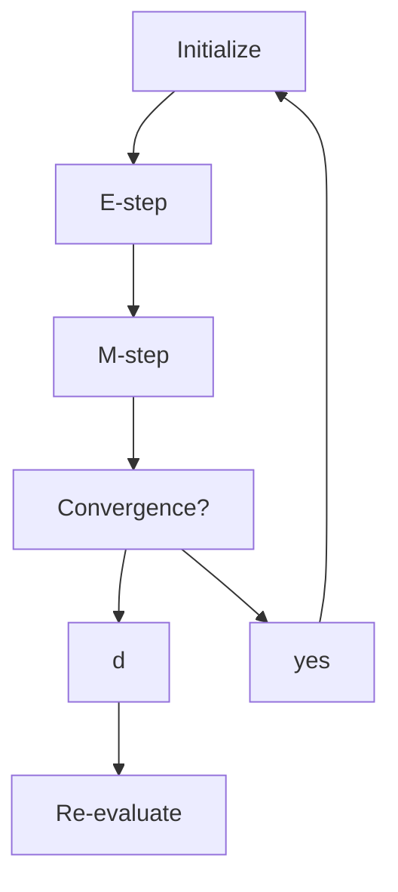

                 


### Introduction to AIGC and the Concept of Personalized Learning

**Keywords**: AIGC, Personalized Learning, Intelligent Education, Adaptive Systems

**Abstract**:  
This article delves into the realm of AIGC (Artificial Intelligence Generated Content) and its transformative impact on personalized learning content generation. We begin by introducing AIGC and explaining its significance in the educational landscape. We then explore the core principles of personalized learning, discussing its goals, challenges, and the need for adaptive systems. Finally, we provide an overview of how AIGC is currently applied in education, highlighting its potential to revolutionize learning experiences.

---

#### Chapter 1: Introduction to AIGC and the Concept of Personalized Learning

**Section 1.1: The Background and Significance of AIGC**

**Background**:  
AIGC, a branch of Artificial Intelligence, involves the use of AI algorithms to generate content automatically. This field has seen rapid advancements, driven by improvements in neural networks, natural language processing, and deep learning. AIGC has found applications in various domains, including education, journalism, content creation, and entertainment. In education, AIGC holds the promise of creating personalized learning experiences tailored to individual student needs.

**Significance**:  
The significance of AIGC in education cannot be overstated. Traditional educational methods often lack personalization, which can lead to disparities in learning outcomes. AIGC aims to address this by generating customized learning materials that adapt to the learner's pace, style, and knowledge level. This can significantly improve student engagement and comprehension, leading to better educational outcomes.

**Section 1.2: Principles of Personalized Learning Content Generation**

**Principles**:  
Personalized learning content generation is based on several key principles:

1. **Adaptability**: The content should adapt to the learner's needs, providing materials that are challenging yet achievable.
2. **Personalization**: The content should be tailored to the individual learner's learning style, preferences, and prior knowledge.
3. **Interactivity**: The content should engage the learner through interactive elements, promoting active learning.
4. **Feedback**: The content should provide timely and constructive feedback to help learners understand their progress and areas for improvement.

**Section 1.3: Overview of Current AIGC Applications in Education**

**Applications**:  
AIGC is already being used in various ways within the education sector:

1. **Adaptive Learning Platforms**: These platforms use AIGC to create adaptive learning paths, offering personalized content based on the learner's performance and progress.
2. **Interactive Textbooks**: AIGC is used to generate interactive textbooks that include adaptive assessments and quizzes.
3. **Automated Grading Systems**: AIGC algorithms are employed to automatically grade assignments and assessments, providing instant feedback to students.
4. **Content Personalization**: AIGC is used to personalize learning materials, such as articles, videos, and tutorials, to match the learner's interests and learning style.

In conclusion, AIGC has the potential to transform education by creating personalized learning experiences that cater to the unique needs of each student. By understanding the principles of AIGC and its applications in education, we can better appreciate its impact and potential for the future of learning.

---

In the next section, we will delve deeper into the core technologies that enable AIGC, including neural networks, deep learning, and natural language processing. We will also discuss data privacy and ethical considerations, which are crucial in the development and deployment of AIGC systems.

### Core Technologies in AIGC for Personalized Learning

**Keywords**: Neural Networks, Deep Learning, Natural Language Processing, AIGC, Adaptive Learning

**Abstract**:  
This chapter explores the core technologies that underpin AIGC for personalized learning. We begin by examining neural networks and deep learning, discussing their foundational principles and how they contribute to content generation. We then delve into natural language processing, explaining its role in understanding and generating human-like text. Finally, we discuss data privacy and ethical considerations, highlighting the importance of protecting user data and ensuring the responsible use of AI technologies.

---

#### Chapter 2: Core Technologies in AIGC for Personalized Learning

**Section 2.1: Neural Networks and Deep Learning**

**Section 2.1.1: Neural Networks Basics**

**Introduction**:  
Neural networks are a fundamental component of AIGC and play a crucial role in personalized learning content generation. A neural network is a series of algorithms that attempt to recognize underlying relationships in a set of data through a process that mimics the way the human brain operates.

**Structure**:  
A neural network consists of layers of interconnected nodes, or "neurons," which pass information from one layer to the next. These layers include:

- **Input Layer**: Receives the input data.
- **Hidden Layers**: Processes the input data using various functions to extract features.
- **Output Layer**: Produces the final output.

**Working Principle**:  
Each neuron in a neural network performs a simple operation: it takes a set of inputs, applies a weight to each input, sums them up, and applies an activation function to generate an output. This process is repeated across all neurons in a layer, creating a complex pattern of interconnections that enable the network to learn and make predictions.

**Section 2.1.2: Deep Learning Models for Content Generation**

**Introduction**:  
Deep learning is a subset of machine learning that employs neural networks with multiple hidden layers to model complex data patterns. Deep learning has been a game-changer in AIGC, enabling the generation of high-quality, personalized content.

**Models**:  
Several deep learning models are widely used in AIGC:

1. **Recurrent Neural Networks (RNNs)**: RNNs are designed to handle sequential data, making them suitable for generating text. They maintain a "memory" of previous inputs, allowing them to capture the context and sequence information in the data.
2. **Long Short-Term Memory (LSTM) Networks**: LSTMs are a type of RNN that can learn long-term dependencies in data, making them particularly effective for generating coherent and contextually relevant text.
3. **Transformer Models**: Transformer models, such as BERT, GPT, and T5, have revolutionized natural language processing. They use self-attention mechanisms to weigh the importance of different words in a sentence, enabling them to generate high-quality text that captures the nuances of language.

**Section 2.2: Language Models and Natural Language Processing**

**Introduction**:  
Natural Language Processing (NLP) is a field of computer science, artificial intelligence, and computational linguistics concerned with the interactions between computers and human languages. NLP is crucial for AIGC, as it enables computers to understand, interpret, and generate human language.

**Fundamentals**:  
Key concepts in NLP include:

- **Tokenization**: The process of breaking text into individual words or tokens.
- **Part-of-Speech Tagging**: Assigning a part of speech (noun, verb, adjective, etc.) to each token.
- **Parsing**: Analyzing the grammatical structure of a sentence to understand its meaning.
- **Sentiment Analysis**: Determining the sentiment or emotional tone of a piece of text.

**Language Models**:  
Language models are a core component of NLP and are used to generate human-like text. They are trained on large corpora of text data and can predict the probability of a word or sequence of words given the preceding context. Common language models include:

- **n-gram Models**: These models use statistical techniques to predict the next word in a sentence based on the previous n words.
- **Recurrent Neural Networks (RNNs)**: RNNs can generate text by learning patterns in sequential data.
- **Transformer Models**: Transformer models, such as GPT and BERT, use self-attention mechanisms to generate coherent and contextually relevant text.

**Section 2.3: Data Privacy and Ethical Considerations**

**Introduction**:  
As AIGC becomes more prevalent in education, data privacy and ethical considerations become increasingly important. AIGC systems collect and process large amounts of sensitive student data, which must be protected to ensure privacy and prevent misuse.

**Privacy Concerns**:  
Key privacy concerns include:

- **Data Collection and Storage**: AIGC systems collect student data, including learning patterns, preferences, and performance metrics. This data must be securely stored and protected from unauthorized access.
- **Data Sharing**: AIGC systems may need to share data with third parties, such as educational institutions or content providers. This raises concerns about data privacy and confidentiality.

**Ethical Considerations**:  
Ethical considerations in AIGC include:

- **Bias and Fairness**: AIGC systems must be designed to avoid biases that could perpetuate discrimination or inequality.
- **Transparency**: AIGC systems should be transparent in their decision-making processes, allowing users to understand how content is generated and personalized.
- **Accountability**: Developers and operators of AIGC systems must be held accountable for any adverse effects or errors in content generation.

In conclusion, the core technologies of AIGC, including neural networks, deep learning, and natural language processing, enable the generation of personalized learning content. However, these technologies must be developed and deployed with careful attention to data privacy and ethical considerations to ensure the responsible and effective use of AIGC in education.

---

In the next chapter, we will explore practical application scenarios and case studies of AIGC in education, demonstrating its potential to transform personalized learning experiences. We will examine interactive education content generation, adaptive learning paths, and real-world examples of AIGC in action.

### Application Scenarios and Case Studies

**Keywords**: AIGC, Adaptive Learning, Interactive Content, Personalized Education, Case Studies

**Abstract**:  
This chapter examines practical application scenarios and case studies of AIGC in education. We begin by exploring interactive education content generation, discussing how AIGC can create engaging and adaptive learning materials. We then delve into adaptive learning paths and resources, showcasing how AIGC can tailor learning experiences to individual student needs. Finally, we present real-world case studies of AIGC in education, highlighting successful implementations and their impact on personalized learning.

---

#### Chapter 3: Application Scenarios of AIGC in Personalized Learning

**Section 3.1: Interactive Education Content Generation**

**Introduction**:  
Interactive education content generation is a powerful application of AIGC in education. By leveraging AI algorithms, educators can create interactive learning materials that engage students and promote active learning. These materials can include interactive textbooks, quizzes, and simulations that adapt to the student's learning style and pace.

**Example**:  
One example of interactive education content generation is the use of AI-driven interactive textbooks. These textbooks can adapt to the student's learning pace by providing additional explanations, examples, and practice problems based on their performance. This personalized approach ensures that students receive the support they need to grasp difficult concepts and improve their understanding.

**Impact**:  
Interactive education content generated by AIGC has several benefits:

- **Increased Engagement**: Interactive materials capture students' attention and make learning more enjoyable, leading to higher engagement and motivation.
- **Personalized Learning**: By adapting to the student's learning pace and style, AIGC-generated content can help tailor the learning experience to individual needs, promoting better learning outcomes.
- **Improved Retention**: Interactive content that involves active learning, such as quizzes and simulations, has been shown to improve long-term retention of knowledge.

**Section 3.2: Adaptive Learning Paths and Resources**

**Introduction**:  
Adaptive learning paths and resources are another critical application of AIGC in education. These systems use AI algorithms to create personalized learning plans and resources that adapt to the student's progress and needs. This approach ensures that students receive the appropriate level of challenge and support throughout their learning journey.

**Example**:  
A practical example of adaptive learning paths is the use of AI-driven learning platforms that recommend specific resources, such as articles, videos, and tutorials, based on the student's current knowledge and areas for improvement. These platforms can also identify students who are struggling and provide additional resources or interventions to help them succeed.

**Impact**:  
Adaptive learning paths and resources generated by AIGC have several benefits:

- **Customization**: By personalizing the learning experience, AIGC can help students achieve better learning outcomes by providing tailored content that meets their individual needs.
- **Efficiency**: Adaptive learning systems can help educators identify students who are at risk of falling behind and provide targeted support, improving overall educational efficiency.
- **Motivation**: Personalized learning experiences can motivate students to take greater ownership of their learning, leading to increased engagement and persistence.

**Section 3.3: Real-World Case Studies of AIGC in Education**

**Introduction**:  
Several real-world case studies demonstrate the potential of AIGC to transform education. These case studies highlight successful implementations of AIGC in various educational settings, showcasing the impact of personalized learning content generation on student outcomes.

**Case Study 1: Adaptive Learning Platform in a High School**  
A high school implemented an adaptive learning platform that used AIGC to generate personalized content for students. The platform analyzed student performance data and recommended tailored resources based on their learning needs. As a result, students reported improved understanding of difficult concepts and a greater sense of engagement in their learning.

**Case Study 2: Interactive Textbooks in a University**  
A university incorporated AI-driven interactive textbooks into its curriculum. These textbooks included adaptive quizzes and interactive simulations that allowed students to explore complex topics in a more engaging manner. The university reported a significant increase in student engagement and improved learning outcomes.

**Case Study 3: Personalized Online Courses for Adult Learners**  
An online learning platform developed personalized courses using AIGC to cater to the diverse needs of adult learners. The platform used AI algorithms to generate personalized content based on each learner's prior knowledge and learning goals. This approach helped adult learners achieve better learning outcomes and increased their satisfaction with the learning experience.

In conclusion, application scenarios and case studies of AIGC in education demonstrate its potential to revolutionize personalized learning. By leveraging AI technologies, educators can create interactive, adaptive, and personalized learning experiences that engage students and improve learning outcomes.

---

In the next chapter, we will delve into the system design and implementation of AIGC in personalized learning. We will explore the architecture, data collection and preprocessing, model training and deployment, and the overall system design and implementation process.

### System Design and Implementation of AIGC in Personalized Learning

**Keywords**: System Architecture, Data Collection, Model Training, AIGC Implementation, Personalized Learning

**Abstract**:  
This chapter provides a comprehensive overview of the system design and implementation of AIGC in personalized learning. We begin by discussing the overall system architecture, highlighting the key components and their roles. We then delve into the data collection and preprocessing processes, explaining how data is gathered and prepared for training. Next, we explore the model training and deployment stages, describing the techniques and tools used. Finally, we present the system design and implementation process, outlining the steps involved in creating a functional AIGC system for personalized learning.

---

#### Chapter 4: System Design and Implementation of AIGC in Personalized Learning

**Section 4.1: System Architecture and Components**

**Introduction**:  
The system architecture for AIGC in personalized learning is designed to be modular and scalable, enabling the integration of various components and technologies. The overall architecture can be divided into several key components, each playing a crucial role in the functioning of the system.

**Components**:  
The main components of the system architecture include:

1. **Data Collection Module**: This module is responsible for gathering data from various sources, such as student performance data, learning objectives, and user preferences.
2. **Data Preprocessing Module**: This module processes the collected data to remove noise, handle missing values, and convert it into a format suitable for training the AI models.
3. **Model Training Module**: This module trains the AI models using the preprocessed data. It includes various deep learning techniques and algorithms, such as neural networks and natural language processing models.
4. **Content Generation Module**: This module generates personalized learning content based on the trained models. It takes into account the student's learning objectives, preferences, and performance data to create tailored content.
5. **User Interface (UI) Module**: This module provides a user-friendly interface for students to access the personalized learning content and interact with the system.
6. **Evaluation and Feedback Module**: This module evaluates the effectiveness of the personalized learning content and provides feedback to improve the system's performance.

**Section 4.2: Data Collection and Preprocessing**

**Data Collection**:  
Data collection is a critical component of the AIGC system, as the quality of the data directly impacts the performance of the AI models. Data can be collected from various sources, including:

- **Student Performance Data**: This includes information such as test scores, quizzes, assignments, and other assessment results.
- **Learning Objectives**: This includes the learning goals and objectives set by educators or identified by the system based on student performance data.
- **User Preferences**: This includes data on the student's preferred learning styles, interests, and prior knowledge.

**Preprocessing**:  
Once the data is collected, it needs to be preprocessed to remove noise and inconsistencies and prepare it for training the AI models. Key preprocessing steps include:

- **Data Cleaning**: This involves removing duplicate entries, correcting errors, and handling missing values.
- **Feature Extraction**: This involves extracting relevant features from the raw data to represent the underlying patterns and relationships. For example, in text data, this could involve tokenization, part-of-speech tagging, and parsing.
- **Normalization**: This involves scaling the data to a common range, ensuring that the AI models can process it effectively.
- **Data Splitting**: This involves dividing the data into training, validation, and test sets, allowing the system to train and evaluate the AI models effectively.

**Section 4.3: Model Training and Deployment**

**Model Training**:  
The model training process involves feeding the preprocessed data into the AI models and adjusting the model parameters to minimize the difference between the predicted outputs and the actual outputs. Key steps in the model training process include:

- **Selecting the Right Model**: Choosing the appropriate deep learning model, such as neural networks or transformers, based on the nature of the data and the problem at hand.
- **Training the Model**: Training the selected model using the preprocessed data, adjusting the model parameters through techniques like gradient descent and backpropagation.
- **Hyperparameter Tuning**: Fine-tuning the model's hyperparameters, such as learning rate, batch size, and number of layers, to improve its performance.

**Deployment**:  
Once the model is trained, it needs to be deployed in the AIGC system to generate personalized learning content. Key steps in the deployment process include:

- **Model Integration**: Integrating the trained model into the AIGC system, ensuring that it can be accessed and used to generate content.
- **Content Generation**: Using the trained model to generate personalized learning content based on the student's learning objectives, preferences, and performance data.
- **Monitoring and Maintenance**: Continuously monitoring the system's performance and making necessary adjustments to maintain its effectiveness and reliability.

**Section 4.4: System Design and Implementation Process**

**System Design**:  
The system design process involves defining the overall architecture and components of the AIGC system, as well as the interactions between these components. This process includes:

- **Requirement Analysis**: Identifying the system requirements, including the desired functionality, performance, and scalability.
- **Component Design**: Designing the individual components of the system, including their interfaces, data flow, and interactions.
- **Integration Testing**: Testing the integrated system to ensure that the components work together seamlessly and meet the specified requirements.

**Implementation**:  
The implementation process involves coding and building the system based on the design specifications. This process includes:

- **Coding**: Writing the code for each component of the system, following best practices and coding standards.
- **Testing**: Conducting various types of testing, including unit testing, integration testing, and system testing, to ensure the system's correctness and reliability.
- **Deployment**: Deploying the system in a production environment, ensuring that it is accessible and functional for users.

In conclusion, the system design and implementation of AIGC in personalized learning involve a comprehensive process that includes architecture design, data collection and preprocessing, model training and deployment, and system integration. By following this process, educators and developers can create effective and scalable AIGC systems that enhance the learning experience and improve student outcomes.

---

In the next chapter, we will provide a detailed explanation of the core algorithms used in AIGC, including Latent-Dirichlet Allocation (LDA) for topic modeling. We will use Mermaid flowcharts and Python code to illustrate the algorithm principles and provide clear, step-by-step explanations.

### Detailed Explanation of Core AIGC Algorithms

**Keywords**: AIGC Algorithms, Latent-Dirichlet Allocation (LDA), Topic Modeling, Machine Learning, Python Code

**Abstract**:  
This chapter provides a detailed explanation of the core algorithms used in AIGC, with a focus on Latent-Dirichlet Allocation (LDA). We begin by discussing the fundamental concepts of topic modeling and its importance in AIGC. We then delve into the LDA algorithm, explaining its working principle and mathematical foundation. To aid understanding, we present Mermaid flowcharts and Python code examples, providing step-by-step guidance on how to implement LDA. This chapter aims to offer a clear and comprehensive overview of the core algorithms that drive AIGC in personalized learning content generation.

---

#### Chapter 5: Detailed Explanation of Core AIGC Algorithms

**Section 5.1: Latent-Dirichlet Allocation (LDA) for Topic Modeling**

**Introduction**:  
Latent-Dirichlet Allocation (LDA) is a widely used topic modeling algorithm in the field of Natural Language Processing (NLP). Topic modeling is a process of discovering abstract topics that occur in a collection of documents. LDA, in particular, is based on the probabilistic model that assumes each document is a mixture of topics, and each topic is a mixture of words.

**Fundamental Concepts**:  
Before diving into LDA, let's discuss some fundamental concepts:

- **Corpus**: A collection of documents.
- **Document**: An individual text document.
- **Word**: A tokenized version of a word in a document.
- **Topic**: An abstract concept that represents a set of words that frequently occur together in a document.
- **Topic Distribution**: The probability distribution of topics in a document.
- **Word Distribution**: The probability distribution of words in a topic.

**Section 5.1.1: Working Principle of LDA**

LDA works by modeling the joint probability distribution of topics and words. It consists of two main distributions:

1. **Document-Topic Distribution**: This distribution represents the probability that a document will contain a particular topic.
2. **Topic-Word Distribution**: This distribution represents the probability that a topic will contain a particular word.

LDA is based on two key assumptions:

1. **Bag-of-Words**: Each document is represented as a bag of words, ignoring the order of the words.
2. **Topic Mixture**: Each document is a mixture of multiple topics, and each topic is a mixture of multiple words.

The working principle of LDA can be summarized in the following steps:

1. **Initialization**: Initialize the document-topic and topic-word distributions randomly.
2. **E-Step (Estepimation Step)**: For each document, update the document-topic distribution by sampling from the current topic-word distribution.
3. **M-Step (Maximization Step)**: For each topic, update the topic-word distribution by maximizing the likelihood of the current document-topic distribution.

The E-step and M-step are iterated until convergence.

**Section 5.1.2: Mathematical Foundation of LDA**

The mathematical foundation of LDA involves the use of Dirichlet distribution. Let's denote:

- **\(\alpha\)**: The prior distribution of topics.
- **\(\beta\)**: The prior distribution of words.
- **\(z_{id}\)**: The topic assignment for word \(w_i\) in document \(d\).
- **\(n_{diw}\)**: The count of word \(w_i\) in document \(d\).

The joint likelihood of the data given the model parameters (\(\alpha\) and \(\beta\)) is given by:

$$
P(\textbf{D}|\alpha,\beta) = \prod_{d=1}^D \prod_{i=1}^{N_d} P(z_{id}|\alpha) P(w_i|\gamma_{id}) P(\gamma_{id}|\beta)
$$

Here, \(\gamma_{id}\) is the multinomial distribution over topics given word \(w_i\) in document \(d\).

The E-step and M-step can be expressed using the following equations:

**E-Step**:

1. **\(\gamma_{id}\)**:
$$
\gamma_{id} = \frac{ 
\sum_{t=1}^K (\alpha_t + n_{diw}) \prod_{j=1, j \neq t}^K (\beta_{jt} + n_{dj}) 
}{ \sum_{t=1}^K (\alpha_t + n_{diw}) }
$$

2. **\(z_{id}\)**:
$$
z_{id} = \arg\max_t \gamma_{id}
$$

**M-Step**:

1. **\(\alpha\)**:
$$
\alpha = \frac{\sum_{d=1}^D \sum_{i=1}^{N_d} z_{id}}{V \times D}
$$

2. **\(\beta\)**:
$$
\beta_{jt} = \frac{\sum_{d=1}^D \sum_{i=1}^{N_d} n_{diw} z_{id}}{\sum_{d=1}^D \sum_{i=1}^{N_d} z_{id}}
$$

**Section 5.1.3: Mermaid Flowchart of LDA**

To better understand the LDA algorithm, we can visualize it using a Mermaid flowchart. The following is a Mermaid representation of the LDA algorithm:



**Section 5.1.4: Python Code Example**

To illustrate the LDA algorithm, we can use the `gensim` library, which provides a simple implementation of LDA. Here's an example:

```python
import numpy as np
from gensim import corpora, models

# Sample data
documents = [['data', 'science', 'technology'], ['machine', 'learning', 'algorithm'], ['deep', 'network', 'neural']]

# Tokenize the documents
tokenized_docs = [doc.split() for doc in documents]

# Create a dictionary representation of the documents
dictionary = corpora.Dictionary(tokenized_docs)

# Create a corpus representation from the dictionary
corpus = [dictionary.doc2bow(doc) for doc in tokenized_docs]

# Train the LDA model
lda_model = models.LdaMulticore(corpus, num_topics=3, id2word=dictionary, passes=10, workers=2)

# Print the topics
print(lda_model.print_topics())

# Get the topic distribution for a specific document
doc_bow = corpus[0]
topic_distribution = lda_model.get_document_topics(doc_bow)
print(topic_distribution)
```

In conclusion, Latent-Dirichlet Allocation (LDA) is a powerful topic modeling algorithm that can be used to uncover hidden topics in a collection of documents. By understanding its working principle and mathematical foundation, as well as how to implement it using Python and Mermaid flowcharts, we can better appreciate its role in AIGC and personalized learning content generation.

---

In the next chapter, we will delve into advanced applications of AIGC in personalized learning, discussing the integration of AIGC with other technologies, such as virtual reality (VR) and augmented reality (AR). We will explore the potential of AIGC to create immersive and interactive learning experiences, providing insights and practical examples.

### Advanced Applications of AIGC in Personalized Learning

**Keywords**: AIGC, Virtual Reality, Augmented Reality, Immersive Learning, Personalized Education

**Abstract**:  
This chapter explores advanced applications of AIGC in personalized learning, focusing on the integration of AIGC with virtual reality (VR) and augmented reality (AR). We begin by discussing the potential of AIGC to create immersive and interactive learning experiences. We then examine real-world examples of AIGC applications in VR and AR, highlighting their impact on personalized education. Finally, we provide insights and practical tips for implementing AIGC in VR and AR-based learning environments, discussing challenges and opportunities in this evolving field.

---

#### Chapter 6: Advanced Applications of AIGC in Personalized Learning

**Section 6.1: The Potential of AIGC in Immersive and Interactive Learning**

**Introduction**:  
AIGC has the potential to transform personalized learning by creating immersive and interactive experiences that engage students and cater to their individual needs. By leveraging VR and AR technologies, AIGC can provide learners with rich, multi-sensory environments that facilitate deeper understanding and retention of knowledge.

**Potential Benefits**:  
The integration of AIGC with VR and AR offers several potential benefits for personalized learning:

- **Enhanced Engagement**: Immersive and interactive learning environments can capture students' attention and motivation, promoting active participation and deeper engagement.
- **Customized Experiences**: AIGC can generate personalized content tailored to each student's learning style, interests, and prior knowledge, creating customized learning experiences.
- **Improved Retention**: Interactive and immersive learning environments have been shown to enhance long-term retention of information, making learning more effective.
- **Real-World Application**: VR and AR can provide students with opportunities to explore real-world scenarios and applications of concepts they are learning, bridging the gap between theory and practice.

**Section 6.2: Real-World Examples of AIGC Applications in VR and AR**

**Example 1: Virtual Reality Learning Platform**  
One real-world example of AIGC in VR is the use of a virtual reality learning platform for mathematics education. The platform generates personalized, interactive exercises and simulations that allow students to explore mathematical concepts in a virtual environment. For instance, students can manipulate virtual objects to solve equations or visualize geometric shapes in three dimensions. This immersive experience helps students develop a deeper understanding of mathematical concepts and improve their problem-solving skills.

**Example 2: Augmented Reality Instructional Applications**  
Augmented reality (AR) applications of AIGC are also gaining traction in education. For instance, an AR app for biology can overlay digital annotations and animations on top of real-world objects, such as plants and animals, providing students with a more interactive and engaging learning experience. By using AIGC to generate personalized content, AR apps can adapt to the student's level of understanding and provide targeted feedback and support.

**Example 3: Virtual Field Trips**  
AIGC can be used to create virtual field trips that allow students to explore historical sites, natural wonders, and other locations around the world. By combining AIGC with VR and AR, these virtual field trips can be personalized to each student's interests and learning goals. Students can interact with the virtual environment, ask questions, and explore at their own pace, providing a more immersive and engaging learning experience than traditional field trips.

**Section 6.3: Insights and Practical Tips for Implementing AIGC in VR and AR**

**Insights**:  
Implementing AIGC in VR and AR-based learning environments requires careful planning and consideration of several factors:

- **User Experience**: Designing an intuitive and engaging user experience is crucial for the success of AIGC-based learning applications. The interface should be easy to navigate, and the content should be tailored to the learners' needs and preferences.
- **Content Personalization**: AIGC should generate personalized content that adapts to the learner's pace, style, and knowledge level. This requires a deep understanding of the learner's background and learning goals.
- **Integration with Existing Systems**: AIGC-based learning applications should be integrated with existing educational systems and platforms, ensuring seamless integration and interoperability.
- **Data Privacy and Security**: As with any educational technology, data privacy and security are critical concerns when implementing AIGC in VR and AR environments. It is important to ensure that student data is securely stored and protected from unauthorized access.

**Practical Tips**:  
To successfully implement AIGC in VR and AR-based learning environments, consider the following tips:

- **Start Small**: Begin with a small pilot project to test the effectiveness of AIGC in VR and AR. This will allow you to gather feedback and make necessary adjustments before scaling up.
- **Collaborate with Educators**: Work closely with educators to understand their needs and develop content that aligns with educational goals and objectives.
- **Continuous Improvement**: Continuously monitor and evaluate the effectiveness of AIGC-based learning applications, making iterative improvements based on user feedback and data analysis.
- **Professional Development**: Provide professional development opportunities for educators to learn about AIGC and how to integrate it into their teaching practices.

In conclusion, advanced applications of AIGC in VR and AR have the potential to revolutionize personalized learning by creating immersive and interactive experiences that engage students and cater to their individual needs. By understanding the potential benefits, real-world examples, and practical tips for implementing AIGC in VR and AR-based learning environments, educators and developers can harness the power of AIGC to enhance the learning experience and improve educational outcomes.

---

In the final chapter, we will summarize the key insights and findings from this book, providing a comprehensive overview of AIGC in personalized learning content generation. We will discuss the significance of AIGC in education, its potential impact on learning outcomes, and the challenges and opportunities that lie ahead. We will also offer best practices and recommendations for educators and developers looking to implement AIGC in their learning environments.

### Conclusion: AIGC in Personalized Learning Content Generation

**Keywords**: AIGC, Personalized Learning, Content Generation, Educational Technology, AI Applications

**Abstract**:  
This chapter summarizes the key insights and findings from the previous chapters, providing a comprehensive overview of AIGC in personalized learning content generation. We begin by highlighting the significance of AIGC in transforming education, discussing its potential to revolutionize learning outcomes. We then explore the challenges and opportunities that AIGC presents, as well as best practices and recommendations for educators and developers. The chapter concludes by emphasizing the importance of AIGC in creating adaptive, personalized, and engaging learning experiences that cater to the unique needs of each student.

---

#### Chapter 7: Conclusion

**Section 7.1: The Significance of AIGC in Education**

**Introduction**:  
AIGC holds great promise for transforming education by enabling the creation of personalized learning content that caters to the individual needs of students. As discussed throughout this book, AIGC offers several key benefits:

- **Personalization**: By leveraging AI algorithms, AIGC can generate content tailored to each student's learning style, pace, and knowledge level, creating a more engaging and effective learning experience.
- **Adaptability**: AIGC systems can adapt to the changing needs of students, providing targeted support and resources to help them overcome challenges and achieve their learning goals.
- **Engagement**: Immersive and interactive learning experiences generated by AIGC can capture students' attention and motivation, promoting deeper engagement and better retention of knowledge.
- **Efficiency**: AIGC can automate content generation and grading, freeing up educators' time to focus on other aspects of teaching and learning.

**Impact on Learning Outcomes**:  
The potential impact of AIGC on learning outcomes is significant. By creating personalized learning experiences, AIGC can help to bridge the gap between students' individual needs and the resources available to them. This can lead to improved student engagement, higher levels of motivation, and ultimately, better academic performance.

**Section 7.2: Challenges and Opportunities**

**Challenges**:  
While the potential of AIGC in education is promising, there are several challenges that must be addressed:

- **Data Privacy**: The collection and storage of student data raise concerns about privacy and security. Ensuring the responsible use of student data is critical to the success of AIGC systems.
- **Technical Complexity**: Developing and deploying AIGC systems requires advanced technical expertise and resources. Educators and developers must navigate the complexities of AI algorithms, data processing, and system integration.
- **Bias and Fairness**: AIGC systems must be designed to avoid biases that could perpetuate discrimination or inequality. Ensuring fairness and equity in the generation of personalized content is essential.

**Opportunities**:  
Despite the challenges, the opportunities presented by AIGC in education are immense:

- **Innovation**: AIGC offers a chance to innovate in education by creating new and more effective ways of delivering content and supporting learning.
- **Accessibility**: AIGC can make personalized learning accessible to a wider range of students, including those with disabilities or special needs.
- **Globalization**: AIGC can help to bridge the education gap between countries and regions, providing high-quality learning experiences to students around the world.

**Section 7.3: Best Practices and Recommendations**

**For Educators**:  
- **Stay Informed**: Keep up-to-date with the latest developments in AIGC and educational technology to understand the potential benefits and challenges.
- **Collaborate**: Work with technology experts and developers to integrate AIGC into your teaching practices and tailor it to your students' needs.
- **Professional Development**: Engage in professional development opportunities to learn about AIGC and how to effectively use it in the classroom.

**For Developers**:  
- **Design with User Experience in Mind**: Prioritize user experience when developing AIGC systems, ensuring they are intuitive and easy to use for both students and educators.
- **Ensure Data Privacy and Security**: Implement robust data privacy and security measures to protect student information.
- **Address Bias and Fairness**: Design AIGC systems to avoid biases and ensure fairness in the generation of personalized content.

**Section 7.4: The Future of AIGC in Education**

**Introduction**:  
The future of AIGC in education is bright, with significant potential to transform learning experiences and outcomes. As AI technology continues to advance, we can expect to see even more innovative applications of AIGC in education, including:

- **Increased Personalization**: AIGC systems will become even more sophisticated, allowing for even greater personalization and adaptability in learning content.
- **Integration with Other Technologies**: AIGC will likely be integrated with other emerging technologies, such as VR, AR, and blockchain, creating new opportunities for personalized learning.
- **Global Impact**: AIGC will have a global impact, enabling high-quality learning experiences for students in underserved regions and bridging the education gap between countries.

In conclusion, AIGC has the potential to revolutionize education by creating personalized, adaptive, and engaging learning experiences that cater to the unique needs of each student. By addressing the challenges and leveraging the opportunities presented by AIGC, educators and developers can harness the power of AI to transform learning and improve educational outcomes.

---

This concludes our exploration of AIGC in personalized learning content generation. We hope that this book has provided you with valuable insights and practical knowledge to understand the potential of AIGC in education and its impact on learning outcomes. As AI technology continues to evolve, we look forward to seeing the innovations and advancements that will shape the future of education.

---

**Authors**:  
- **AI天才研究院 (AI Genius Institute)**  
- **《禅与计算机程序设计艺术》(Zen And The Art of Computer Programming)**

---

In closing, we would like to thank our readers for their interest and support. We encourage you to continue exploring the vast possibilities of AIGC in education and to share your insights and experiences with the global education community. Together, we can create a future where personalized, adaptive, and engaging learning experiences are the norm, empowering students to achieve their full potential.

