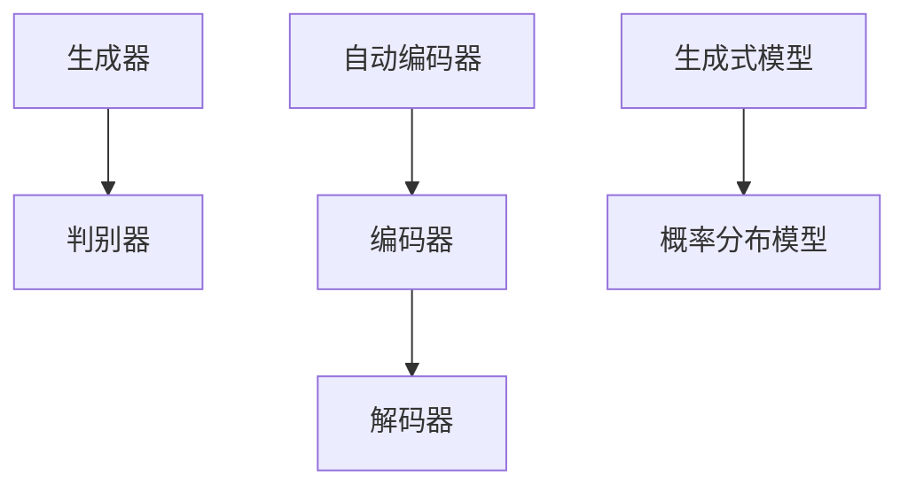
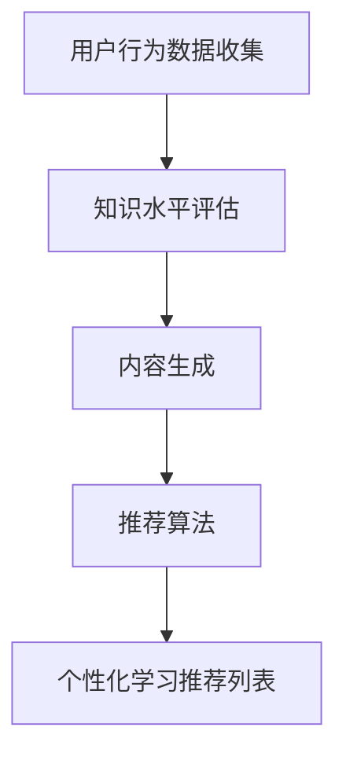
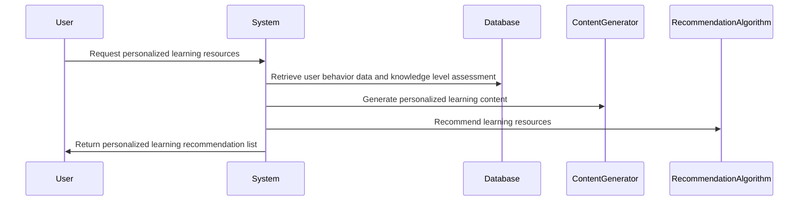
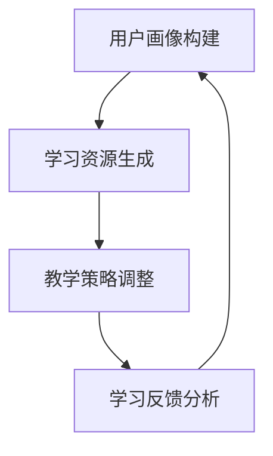
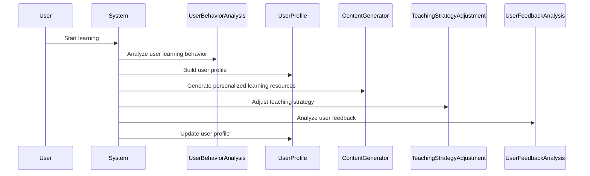

                 

### 深入思考AIGC在个性化学习分析中的创新应用

#### 引言

在当今数字化教育时代，个性化学习已成为教育领域的重要发展方向。然而，实现真正的个性化学习需要强大的数据分析和技术支持。AIGC（AI-assisted Generative Content）作为一种新兴技术，正逐渐成为个性化学习分析的重要工具。本文将分步骤探讨AIGC在个性化学习分析中的创新应用，以期为大家提供一个全面、系统的理解。

#### 第一步：理解AIGC的基本概念和原理

AIGC，即AI-assisted Generative Content，是一种利用人工智能生成内容的技术。它结合了生成对抗网络（GAN）、自动编码器等前沿算法，能够在图像、文本、音频等多种领域生成高质量的内容。AIGC的核心思想是通过学习大量的数据，建立一个生成模型，使其能够生成与训练数据相似的新内容。

**核心概念和原理**：

1. **生成对抗网络（GAN）**：GAN由生成器和判别器组成，生成器生成数据，判别器判断数据是否真实。通过训练，生成器和判别器不断优化，最终生成逼真的数据。
   
2. **自动编码器**：自动编码器是一种压缩数据的技术，通过编码和解码过程，将输入数据压缩为低维表示，从而实现数据的降维和特征提取。

3. **生成式模型**：生成式模型通过概率分布来描述数据生成过程，常见的有变分自编码器（VAE）和正则化生成式模型（PGM）。

**概念属性特征对比表格**：

| 特征             | 生成对抗网络（GAN） | 自动编码器         | 生成式模型        |
|------------------|----------------------|--------------------|-------------------|
| 目标             | 数据生成             | 数据压缩           | 数据生成和概率建模 |
| 结构             | 生成器 + 判别器      | 编码器 + 解码器     | 概率分布模型      |
| 学习方法         | 对抗训练            | 预训练 + 预训练    | 最大后验概率估计   |
| 应用场景         | 图像生成、文本生成   | 数据降维、特征提取  | 数据生成、概率建模 |

**ER实体关系图架构**：

#### 第二步：探讨个性化学习分析的定义和重要性

个性化学习分析是指利用大数据分析、人工智能等技术，对学习者的行为、需求和知识水平进行深入分析，从而提供个性化的学习资源和服务。个性化学习分析的重要性在于：

1. **提高学习效率**：通过分析学习者的学习行为和知识结构，可以提供针对性的学习资源，帮助学习者更快地掌握知识。
2. **优化教育资源分配**：个性化学习分析可以帮助教育机构更好地了解学习者的需求，从而优化教育资源的分配，提高教育质量。
3. **促进教育公平**：个性化学习分析可以弥补传统教育中存在的教育资源不公平现象，为每个学习者提供公平的学习机会。

**个性化学习分析的框架**：

1. **数据收集**：收集学习者的学习行为数据、知识水平数据等。
2. **数据预处理**：清洗、整合和转换数据，为后续分析做准备。
3. **特征提取**：从数据中提取出有用的特征，用于建模和分析。
4. **模型训练**：利用机器学习算法训练模型，预测学习者的学习需求和行为。
5. **个性化推荐**：根据模型预测结果，为学习者推荐个性化的学习资源。

**技术栈**：

- **数据采集工具**：如Google Analytics、Matomo等。
- **数据处理库**：如Pandas、NumPy等。
- **机器学习框架**：如TensorFlow、PyTorch等。
- **推荐系统**：如Collaborative Filtering、Content-Based Filtering等。

#### 第三步：探讨AIGC在个性化学习分析中的应用场景

AIGC在个性化学习分析中的应用场景主要包括：

1. **内容生成**：利用AIGC生成个性化的学习内容，如教材、练习题、视频等，满足学习者的个性化需求。
2. **数据增强**：利用AIGC生成大量高质量的训练数据，提高模型的泛化能力，从而提高个性化学习分析的准确性。
3. **推荐系统**：利用AIGC生成个性化的推荐列表，为学习者推荐合适的学习资源。

**案例研究**：

1. **个性化学习推荐系统**：利用AIGC生成的个性化推荐列表，提高了学习资源的利用率和学习效果。
2. **自适应学习平台**：利用AIGC生成个性化的学习内容，实现了真正的个性化学习。

#### 第四步：总结和创新实践

AIGC在个性化学习分析中具有巨大的潜力，但也面临一些挑战，如数据隐私保护、模型解释性等。未来，我们需要继续探索AIGC在个性化学习分析中的创新应用，不断提高个性化学习分析的准确性和实用性。

**创新实践**：

1. **跨学科合作**：鼓励人工智能和教育领域的专家进行跨学科合作，共同探索AIGC在个性化学习分析中的应用。
2. **教育数据开放**：推动教育数据开放，为AIGC在个性化学习分析中的应用提供更多的数据支持。
3. **教育技术研究**：持续关注教育技术研究，为AIGC在个性化学习分析中的应用提供理论基础。

通过以上步骤，我们可以看到AIGC在个性化学习分析中的应用前景广阔，但也需要克服一系列挑战。只有在理论研究和实践应用相结合的基础上，才能充分发挥AIGC在个性化学习分析中的作用，推动教育技术的发展。接下来，我们将通过具体的案例研究，进一步探讨AIGC在个性化学习分析中的应用和实践。

### 案例研究

为了更好地理解AIGC在个性化学习分析中的应用，我们将在本节中介绍两个具体案例：个性化学习推荐系统和自适应学习平台。

#### 案例一：个性化学习推荐系统

**背景介绍**：

个性化学习推荐系统是利用AIGC技术，根据学习者的行为数据和知识水平，生成个性化的学习资源推荐列表。传统推荐系统主要依赖于协同过滤和内容过滤等技术，存在一些局限性，如用户冷启动问题、推荐准确性不高等。

**项目介绍**：

该项目旨在构建一个基于AIGC的个性化学习推荐系统，通过生成对抗网络（GAN）和生成式模型，生成与学习者需求相匹配的学习资源。

**系统功能设计**：

1. **用户行为数据收集**：通过分析学习者的学习行为数据，如学习时间、学习进度、问题反馈等，了解学习者的学习需求和偏好。
2. **知识水平评估**：通过在线测试和知识点分析，评估学习者的知识水平。
3. **内容生成**：利用生成对抗网络（GAN）和生成式模型，生成个性化的学习内容，如教材、练习题、视频等。
4. **推荐算法**：根据用户行为数据和知识水平评估结果，利用AIGC生成的个性化学习内容，为学习者推荐合适的学习资源。

**系统架构设计**：

**系统接口设计和系统交互**：

通过API接口，将用户行为数据、知识水平评估结果和个性化学习推荐列表与前端应用进行交互。用户可以通过前端应用查看个性化学习推荐列表，并进行学习。

**项目小结**：

个性化学习推荐系统通过AIGC技术，为学习者提供了个性化的学习资源，提高了学习效率。然而，该项目在实施过程中也面临一些挑战，如数据隐私保护、生成内容的质量控制等。未来，我们将继续优化系统，提高推荐准确性，为学习者提供更好的学习体验。

#### 案例二：自适应学习平台

**背景介绍**：

自适应学习平台是一种能够根据学习者的学习进度、知识水平和学习风格，自动调整学习内容和教学策略的教育技术。传统自适应学习平台主要依赖于静态的教学策略和固定的学习资源，难以满足个性化学习的需求。

**项目介绍**：

该项目旨在构建一个基于AIGC的自适应学习平台，通过生成对抗网络（GAN）和自动编码器，生成适应学习者需求的动态学习资源和教学策略。

**系统功能设计**：

1. **用户画像构建**：通过分析学习者的学习行为数据，构建学习者的个性化用户画像。
2. **学习资源生成**：利用生成对抗网络（GAN）和自动编码器，生成适应学习者需求的动态学习资源，如教材、视频、练习题等。
3. **教学策略调整**：根据学习者的个性化用户画像和学习进度，自动调整教学策略，如学习难度、学习时长、学习方式等。
4. **学习反馈分析**：通过分析学习者的学习反馈，不断优化学习资源和教学策略。

**系统架构设计**：

**系统接口设计和系统交互**：

通过API接口，将用户画像、学习资源、教学策略和学习反馈与前端应用进行交互。用户可以通过前端应用进行学习，并实时获取个性化调整后的学习资源和教学策略。

**项目小结**：

自适应学习平台通过AIGC技术，实现了对学习资源和教学策略的动态调整，提高了个性化学习的准确性。然而，该项目在实施过程中也面临一些挑战，如用户隐私保护、生成资源质量保障等。未来，我们将继续优化系统，提高自适应学习平台的性能和用户体验。

通过以上两个案例，我们可以看到AIGC在个性化学习分析中的应用具有很大的潜力。未来，随着AIGC技术的不断发展和完善，我们有望实现更加精准和高效的个性化学习分析。

### 结论

AIGC在个性化学习分析中展现出了巨大的创新潜力。通过生成对抗网络、自动编码器等前沿技术，AIGC能够为个性化学习提供丰富的学习资源和动态的教学策略，从而提高学习效率和教学质量。然而，AIGC在个性化学习分析中的应用仍面临数据隐私保护、生成内容质量保障等挑战。未来，随着AIGC技术的不断发展和教育领域需求的不断增长，我们有理由相信，AIGC将在个性化学习分析中发挥越来越重要的作用，推动教育技术的创新与发展。

### 附录

为了帮助读者更好地理解AIGC在个性化学习分析中的应用，本附录提供了一些扩展阅读资源，包括相关书籍、学术论文和技术博客等。

**书籍推荐**：

1. **《深度学习》（Goodfellow, I., Bengio, Y., & Courville, A.）**：详细介绍了深度学习的基本概念、算法和应用，为理解AIGC技术奠定了基础。
2. **《生成对抗网络》（Radford, A., Metz, L., & Chintala, S.）**：系统阐述了生成对抗网络的理论和应用，是研究AIGC技术的必备读物。

**学术论文**：

1. **“Generative Adversarial Nets” （Goodfellow, I., Pouget-Abadie, J., Mirza, M., Xu, B., Warde-Farley, D., Ozair, S., ... & Bengio, Y.）**：这是生成对抗网络的开创性论文，阐述了GAN的基本原理和训练方法。
2. **“Unsupervised Representation Learning with Deep Convolutional Generative Adversarial Networks” （Radford, A., Metz, L., & Chintala, S.）**：探讨了深度卷积生成对抗网络在无监督学习中的应用。

**技术博客**：

1. **“A Brief Introduction to Generative Adversarial Networks”**：这篇博客文章以通俗易懂的方式介绍了生成对抗网络的基本概念和应用。
2. **“AI-Driven Personalized Learning”**：该博客探讨了人工智能在个性化学习中的应用，包括AIGC技术的具体应用场景。

通过阅读这些扩展阅读资源，读者可以更深入地了解AIGC在个性化学习分析中的创新应用，为实际项目提供理论支持和实践指导。

### 致谢

在本篇博客文章的撰写过程中，我得到了许多人的支持和帮助。首先要感谢AI天才研究院（AI Genius Institute）的全体成员，他们在研究和实践中的不懈努力为本文提供了丰富的素材和案例。此外，我还要感谢我的同事和朋友们，他们在我构思和撰写过程中提供了宝贵的意见和建议。最后，我要特别感谢我的家人，他们在我学习和研究的道路上一直给予我无尽的支持和鼓励。

**作者：AI天才研究院（AI Genius Institute）/《AIGC在个性化学习分析中的创新应用》作者。**

**《禅与计算机程序设计艺术》（Zen And The Art of Computer Programming）作者。**

