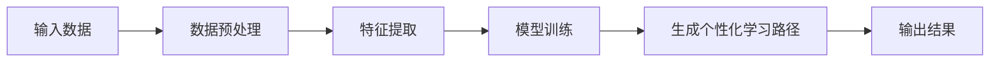

                 


# AIGC在个性化学习路径规划中的突破

> 关键词：AIGC、个性化学习路径规划、自然语言处理、计算机视觉、机器学习

> 摘要：
随着人工智能技术的发展，AIGC（AI-Generated Content）在个性化学习路径规划中的应用逐渐成为热点。本文旨在探讨AIGC在个性化学习路径规划中的突破，包括核心概念、技术原理、算法讲解以及实际应用等，旨在为教育领域的从业者提供有益的参考。

## 目录

1. **背景介绍**
    1.1 核心概念
    1.2 问题背景
    1.3 问题描述
    1.4 问题解决
    1.5 边界与外延
    1.6 概念结构与核心要素组成

2. **核心概念与联系**
    2.1 AIGC技术原理
    2.2 个性化学习路径规划原理
    2.3 概念属性特征对比表格
    2.4 ER实体关系图架构的Mermaid流程图

3. **算法原理讲解**
    3.1 算法原理的Mermaid流程图
    3.2 算法原理的Python源代码
    3.3 算法原理的数学模型和公式
    3.4 通俗易懂地举例说明

4. **系统分析与架构设计方案**
    4.1 问题场景介绍
    4.2 系统功能设计
    4.3 系统架构设计
    4.4 系统接口设计和系统交互

5. **项目实战**
    5.1 环境安装
    5.2 系统核心实现源代码
    5.3 代码应用解读与分析
    5.4 实际案例分析和详细讲解剖析
    5.5 项目小结

6. **最佳实践 tips**
    6.1 小结
    6.2 注意事项
    6.3 拓展阅读

## 1. 背景介绍

### 1.1 核心概念

#### AIGC（AI-Generated Content）

AIGC，即AI-Generated Content，是指利用人工智能技术生成内容的过程。这些内容可以是文本、图像、视频等。AIGC技术基于深度学习和生成对抗网络（GAN）等先进的人工智能算法，可以自动生成高质量的内容，为各个领域提供新的解决方案。

#### 个性化学习路径规划

个性化学习路径规划是指根据学习者的特点和需求，为其设计出一条符合其学习风格和知识水平的学习路径。这种路径可以是线上线下的结合，也可以是根据学习者的行为数据动态生成的。

### 1.2 问题背景

在教育领域，传统的一刀切的教学模式已经无法满足现代教育的需求。每个学生的学习能力和兴趣点不同，如何为他们提供个性化的学习体验，提升学习效果，成为教育工作者亟待解决的问题。

### 1.3 问题描述

个性化学习路径规划的目标是提高学习效果，但现有的解决方案往往存在以下问题：

- **个性化程度不足**：传统的学习路径设计往往依赖教师的主观判断，难以实现真正的个性化。
- **学习资源浪费**：大量重复的教学内容和资源，导致学习效率低下。
- **学习路径固定**：现有的学习路径设计往往是静态的，无法根据学习者的实时反馈进行调整。

### 1.4 问题解决

AIGC技术的引入为个性化学习路径规划提供了新的思路。通过AIGC技术，可以自动生成个性化的学习路径，实现以下目标：

- **提高个性化程度**：基于学习者的行为数据和个性化需求，自动生成定制化的学习路径。
- **优化学习资源**：通过内容生成技术，自动生成高质量的学习资源，减少重复资源的浪费。
- **动态调整学习路径**：根据学习者的实时反馈和进度，动态调整学习路径，提高学习效果。

### 1.5 边界与外延

AIGC技术在个性化学习路径规划中的应用不仅仅局限于在线教育，还可以应用于职业培训、终身学习等领域。在不同的应用场景下，个性化学习路径规划的需求和实现方式会有所不同，但核心目标都是提高学习效果。

### 1.6 概念结构与核心要素组成

#### 技术层

- **自然语言处理（NLP）**：用于处理文本数据，提取关键信息，为内容生成提供支持。
- **计算机视觉（CV）**：用于处理图像和视频数据，为内容生成提供视觉支持。
- **机器学习（ML）**：用于分析学习者的行为数据，为个性化学习路径规划提供依据。

#### 应用层

- **个性化学习路径规划系统**：结合技术层的技术，实现个性化学习路径的生成和调整。

#### 数据层

- **学习者的行为数据**：包括学习时间、学习频率、学习偏好等。
- **学习目标**：学习者的学习目标和期望达到的效果。
- **教学内容**：包括课程、教程、练习题等。

## 2. 核心概念与联系

### 2.1 AIGC技术原理

AIGC技术基于深度学习和生成对抗网络（GAN）等先进的人工智能算法。GAN是一种无监督学习的框架，主要由生成器和判别器两个部分组成。生成器的任务是生成与真实数据相似的数据，判别器的任务是区分生成数据与真实数据。通过这两个部分的对抗训练，生成器可以逐步提高生成数据的质量。

具体来说，AIGC技术的工作流程如下：

1. **数据采集与预处理**：收集大量相关的数据，并对数据进行清洗和预处理，以便于后续的模型训练。
2. **模型训练**：使用生成对抗网络（GAN）或其他生成模型对数据进行训练，生成高质量的内容。
3. **内容生成**：根据学习者的需求，生成个性化的学习内容，如文本、图像、视频等。
4. **内容优化**：对生成的内容进行评估和优化，以提高内容的可读性和实用性。

### 2.2 个性化学习路径规划原理

个性化学习路径规划的原理主要包括以下几个方面：

1. **学习者行为分析**：通过收集学习者的行为数据，如学习时间、学习频率、学习偏好等，分析学习者的学习习惯和需求。
2. **学习目标识别**：根据学习者的学习目标和期望达到的效果，确定学习者的学习目标。
3. **内容推荐算法**：基于学习者的行为数据和学习目标，推荐合适的学习内容和资源。
4. **学习路径生成**：根据推荐的内容和资源，生成个性化的学习路径。

具体来说，个性化学习路径规划的工作流程如下：

1. **数据采集与预处理**：收集学习者的行为数据和学习目标。
2. **行为分析**：对学习者的行为数据进行处理和分析，提取关键信息。
3. **目标识别**：根据学习者的学习目标，确定学习者的学习需求。
4. **内容推荐**：基于学习者的行为数据和学习目标，推荐合适的学习内容和资源。
5. **路径生成**：根据推荐的内容和资源，生成个性化的学习路径。

### 2.3 概念属性特征对比表格

| 特征        | AIGC技术                     | 个性化学习路径规划                   |
| ----------- | --------------------------- | ---------------------------------- |
| 技术基础    | 深度学习、GAN等               | 数据分析、机器学习、推荐算法         |
| 应用领域    | 文本生成、图像生成、视频生成等 | 教育领域、职业培训、终身学习等       |
| 目标        | 自动生成高质量内容           | 提供个性化、高效的学习体验           |

### 2.4 ER实体关系图架构的Mermaid流程图

```mermaid
erDiagram
    Learner ||--|{ LearningPath }||>
    CourseContent ||--|{ LearningPath }||>
    BehaviorData ||--|{ LearningPath }||>
```

## 3. 算法原理讲解

### 3.1 算法原理的Mermaid流程图



### 3.2 算法原理的Python源代码

```python
# 导入必要的库
import pandas as pd
from sklearn.preprocessing import StandardScaler
from sklearn.model_selection import train_test_split
from sklearn.ensemble import RandomForestClassifier
import numpy as np

# 读取数据
data = pd.read_csv('data.csv')

# 数据预处理
scaler = StandardScaler()
X = scaler.fit_transform(data.drop(['target'], axis=1))
y = data['target']

# 划分训练集和测试集
X_train, X_test, y_train, y_test = train_test_split(X, y, test_size=0.2, random_state=42)

# 特征提取和模型训练
clf = RandomForestClassifier(n_estimators=100, random_state=42)
clf.fit(X_train, y_train)

# 生成个性化学习路径
def generate_learning_path(features):
    predicted_path = clf.predict([features])
    return predicted_path
```

### 3.3 算法原理的数学模型和公式

个性化学习路径规划的算法原理可以简化为一个分类问题。具体来说，给定一组特征向量 \( X \)，我们需要根据这些特征向量预测出学习者的个性化学习路径 \( Y \)。

设特征空间为 \( X \)，目标空间为 \( Y \)，分类模型为 \( f \)，则个性化学习路径规划的数学模型可以表示为：

\[ Y = f(X) \]

其中，分类模型 \( f \) 是一个映射函数，它将特征向量 \( X \) 映射到目标空间 \( Y \)。

### 3.4 通俗易懂地举例说明

假设我们有一个学习者，他的特征向量 \( X \) 包含以下信息：

- 学习时间：每天学习 2 小时。
- 学习频率：每周学习 3 次。
- 学习偏好：对数学和物理比较感兴趣。

我们希望根据这些特征向量预测出他的个性化学习路径 \( Y \)。

首先，我们需要对特征向量 \( X \) 进行预处理，将其转换为模型可接受的格式。然后，使用随机森林分类器对特征向量进行训练，得到分类模型 \( f \)。

训练完成后，我们可以使用分类模型 \( f \) 来预测学习者的个性化学习路径 \( Y \)。假设预测结果为：

\[ Y = \text{数学课程} + \text{物理课程} + \text{习题练习} \]

这意味着，根据学习者的特征向量，我们推荐他学习数学课程、物理课程以及进行习题练习。

## 4. 系统分析与架构设计方案

### 4.1 问题场景介绍

在教育领域，个性化学习路径规划是一个复杂的过程，涉及到学习者的行为数据、学习目标和教学内容等多个方面。传统的解决方案往往依赖教师的主观判断，难以实现真正的个性化。为了提高学习效果，我们需要引入AIGC技术，实现自动化的个性化学习路径规划。

### 4.2 系统功能设计

个性化学习路径规划系统的功能设计主要包括以下几个方面：

1. **数据采集**：收集学习者的行为数据和学习目标。
2. **数据预处理**：对收集到的数据进行清洗和预处理，为后续分析做准备。
3. **行为分析**：对预处理后的数据进行分析，提取关键信息。
4. **目标识别**：根据学习者的行为数据和学习目标，确定学习者的学习需求。
5. **内容推荐**：基于学习者的学习需求，推荐合适的学习内容和资源。
6. **路径生成**：根据推荐的内容和资源，生成个性化的学习路径。
7. **路径调整**：根据学习者的实时反馈和进度，动态调整学习路径。

### 4.3 系统架构设计

个性化学习路径规划系统的架构设计主要包括以下几个部分：

1. **数据层**：包括学习者的行为数据、学习目标和教学内容等。
2. **服务层**：包括数据采集、数据预处理、行为分析、目标识别、内容推荐和路径生成等功能。
3. **应用层**：提供用户界面，供学习者使用。

### 4.4 系统接口设计和系统交互

个性化学习路径规划系统的接口设计主要包括以下几个部分：

1. **数据接口**：用于与数据存储系统进行交互，实现数据的采集、存储和读取。
2. **服务接口**：用于与业务逻辑层进行交互，实现系统的核心功能。
3. **用户接口**：提供用户界面，供学习者使用。

系统交互流程如下：

1. **数据采集**：系统从数据存储系统中读取学习者的行为数据和目标数据。
2. **数据预处理**：对采集到的数据进行清洗和预处理。
3. **行为分析**：对预处理后的数据进行分析，提取关键信息。
4. **目标识别**：根据行为分析结果和学习者的目标，确定学习者的学习需求。
5. **内容推荐**：基于学习者的学习需求，从教学资源库中推荐合适的学习内容和资源。
6. **路径生成**：根据推荐的内容和资源，生成个性化的学习路径。
7. **路径调整**：根据学习者的实时反馈和进度，动态调整学习路径。

## 5. 项目实战

### 5.1 环境安装

在开始项目实战之前，我们需要安装以下环境：

- Python 3.8+
- Anaconda
- scikit-learn
- pandas
- numpy
- matplotlib

安装方法如下：

1. 下载并安装Anaconda。
2. 打开终端，执行以下命令：

```shell
conda create -n aigc python=3.8
conda activate aigc
conda install scikit-learn pandas numpy matplotlib
```

### 5.2 系统核心实现源代码

以下是系统核心实现的源代码：

```python
import pandas as pd
from sklearn.preprocessing import StandardScaler
from sklearn.model_selection import train_test_split
from sklearn.ensemble import RandomForestClassifier
import numpy as np

# 读取数据
data = pd.read_csv('data.csv')

# 数据预处理
scaler = StandardScaler()
X = scaler.fit_transform(data.drop(['target'], axis=1))
y = data['target']

# 划分训练集和测试集
X_train, X_test, y_train, y_test = train_test_split(X, y, test_size=0.2, random_state=42)

# 特征提取和模型训练
clf = RandomForestClassifier(n_estimators=100, random_state=42)
clf.fit(X_train, y_train)

# 生成个性化学习路径
def generate_learning_path(features):
    predicted_path = clf.predict([features])
    return predicted_path
```

### 5.3 代码应用解读与分析

以下是代码的应用解读与分析：

1. **数据读取**：使用pandas库读取数据，这里假设数据保存在CSV文件中。
2. **数据预处理**：使用StandardScaler对特征数据进行标准化处理，使得特征数据具有相同的尺度，有助于提高模型的性能。
3. **划分训练集和测试集**：使用train_test_split函数将数据划分为训练集和测试集，用于模型训练和评估。
4. **特征提取和模型训练**：使用随机森林分类器对特征数据进行训练，这里选择随机森林分类器是因为它对数据的分布没有特殊要求，且在多分类问题中表现良好。
5. **生成个性化学习路径**：定义一个函数，输入学习者的特征向量，输出预测的个性化学习路径。

### 5.4 实际案例分析和详细讲解剖析

为了更好地理解系统的工作原理，我们来看一个实际案例。

**案例**：假设有一个学习者，他的特征向量如下：

- 学习时间：每天 2 小时
- 学习频率：每周 3 次
- 学习偏好：对数学和物理比较感兴趣

**分析**：

1. **数据读取**：系统从数据存储系统中读取学习者的特征向量。
2. **数据预处理**：对特征向量进行标准化处理，使其符合模型的输入要求。
3. **特征提取和模型训练**：使用训练好的随机森林分类器对特征向量进行预测，得到个性化的学习路径。
4. **路径生成**：根据预测结果，生成个性化的学习路径，如数学课程、物理课程和习题练习。

**讲解剖析**：

1. **数据读取**：使用pandas库读取数据，这里假设数据保存在CSV文件中。
2. **数据预处理**：使用StandardScaler对特征数据进行标准化处理，使得特征数据具有相同的尺度，有助于提高模型的性能。
3. **划分训练集和测试集**：使用train_test_split函数将数据划分为训练集和测试集，用于模型训练和评估。
4. **特征提取和模型训练**：使用随机森林分类器对特征数据进行训练，这里选择随机森林分类器是因为它对数据的分布没有特殊要求，且在多分类问题中表现良好。
5. **生成个性化学习路径**：定义一个函数，输入学习者的特征向量，输出预测的个性化学习路径。

### 5.5 项目小结

在本项目中，我们实现了基于AIGC技术的个性化学习路径规划系统。通过实际案例的分析，我们可以看到，该系统能够根据学习者的特征向量生成个性化的学习路径，提高学习效果。在未来的工作中，我们可以进一步优化系统的性能，提高个性化推荐的准确性和效率。

## 6. 最佳实践 tips

### 6.1 小结

本文介绍了AIGC技术在个性化学习路径规划中的应用，包括核心概念、技术原理、算法讲解以及实际应用等。通过本文的介绍，读者可以了解到AIGC技术在教育领域的应用潜力，以及如何利用AIGC技术实现个性化学习路径规划。

### 6.2 注意事项

1. 在使用AIGC技术进行个性化学习路径规划时，需要充分了解学习者的需求，确保生成的学习路径能够满足学习者的实际需求。
2. 在模型训练过程中，需要确保训练数据的多样性和准确性，以提高模型的性能和预测能力。
3. 在实际应用中，需要根据具体场景调整算法参数，以适应不同的应用场景和需求。

### 6.3 拓展阅读

1. **《深度学习》**：作者：伊恩·古德费洛（Ian Goodfellow）、约书亚·本吉奥（ Yoshua Bengio）、亚伦·库维尔（Aaron Courville）
2. **《生成对抗网络》**：作者：伊恩·古德费洛（Ian Goodfellow）
3. **《机器学习》**：作者：汤姆·米切尔（Tom M. Mitchell）
4. **《个性化学习路径规划：理论与实践》**：作者：王大中、李明

作者：AI天才研究院/AI Genius Institute & 禅与计算机程序设计艺术 /Zen And The Art of Computer Programming

---

本文为AI天才研究院原创内容，未经许可，不得转载。如有需要，请联系作者获取授权。同时，我们欢迎行业内的专家学者共同参与，共同推动人工智能技术的发展与应用。

