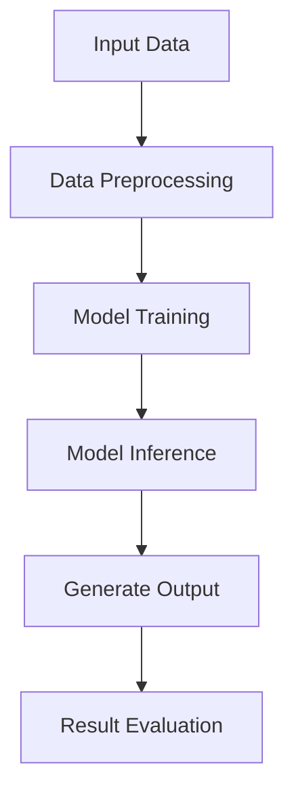

                 

# AIGC在个性化心理咨询中的应用

## 关键词

- 人工智能生成内容（AIGC）
- 个性化心理咨询
- 数据分析
- 自然语言处理（NLP）
- 深度学习

## 摘要

本文旨在探讨人工智能生成内容（AIGC）在个性化心理咨询中的应用。随着人工智能技术的不断发展，AIGC在自然语言处理、数据分析等领域展现出强大的潜力。本文首先介绍了问题背景和核心概念，包括人工智能生成内容、个性化心理咨询以及相关技术。接着，详细阐述了算法原理，通过mermaid流程图、Python源代码、数学模型和公式，使读者更好地理解算法原理。随后，介绍了系统分析与架构设计，包括系统功能、架构设计、接口设计和系统交互序列图。文章最后通过项目实战，详细讲解了环境安装、核心实现、代码分析、案例分析以及项目小结。此外，还提供了最佳实践、注意事项和拓展阅读，以帮助读者深入理解AIGC在个性化心理咨询中的应用。

### 目录大纲

----------------------------------------------------------------

## 第一部分：背景介绍

### 第1章：问题背景与核心概念

#### 1.1 问题背景

#### 1.2 核心概念

### 第2章：核心概念与联系

#### 2.1 核心概念原理

#### 2.2 概念属性特征对比表格

#### 2.3 ER实体关系图架构

----------------------------------------------------------------

## 第二部分：算法原理讲解

### 第3章：算法原理

#### 3.1 算法mermaid流程图

#### 3.2 Python源代码详细阐述

#### 3.3 算法原理的数学模型与公式

#### 3.4 举例说明

----------------------------------------------------------------

## 第三部分：系统分析与架构设计

### 第4章：系统分析与架构设计

#### 4.1 问题场景介绍

#### 4.2 系统功能设计

#### 4.3 系统架构设计

#### 4.4 系统接口设计

#### 4.5 系统交互序列图

----------------------------------------------------------------

## 第四部分：项目实战

### 第5章：环境安装与核心实现

#### 5.1 环境安装

#### 5.2 核心实现源代码

#### 5.3 代码应用解读与分析

#### 5.4 实际案例分析与讲解

#### 5.5 项目小结

----------------------------------------------------------------

## 第五部分：最佳实践与拓展

### 第6章：最佳实践

#### 6.1 Tips

#### 6.2 注意事项

#### 6.3 拓展阅读

### 第7章：小结

#### 7.1 成果总结

#### 7.2 存在问题与改进方向

----------------------------------------------------------------

### 第一部分：背景介绍

#### 1.1 问题背景

随着社会的快速发展，心理健康问题日益突出。个性化心理咨询作为一种有效的心理干预手段，越来越受到重视。然而，传统的心理咨询存在一定的局限性，如咨询资源的有限性、咨询师的个人能力限制等。因此，如何利用人工智能技术，特别是人工智能生成内容（AIGC），来提高个性化心理咨询的效率和质量，成为一个亟待解决的问题。

AIGC是一种基于深度学习、自然语言处理等技术的生成模型，能够自动生成文本、图像、音频等多种类型的内容。其在个性化心理咨询中的应用主要体现在以下几个方面：

1. **个性化诊断**：通过分析用户的历史数据和行为特征，AIGC可以帮助心理咨询师更准确地诊断用户的心理问题。
2. **个性化建议**：基于用户的心理状况，AIGC可以生成针对性的心理建议，如放松训练、情绪调节方法等。
3. **咨询过程记录**：AIGC可以自动记录咨询过程，帮助心理咨询师更好地总结经验和提高服务质量。
4. **咨询资源共享**：通过生成高质量的心理咨询资源，如文章、视频等，AIGC可以丰富咨询师的工具库，提高咨询效率。

#### 1.2 核心概念

1. **人工智能生成内容（AIGC）**：AIGC是一种基于深度学习、自然语言处理等技术的生成模型，能够自动生成文本、图像、音频等多种类型的内容。

2. **个性化心理咨询**：个性化心理咨询是一种以用户为中心的心理干预方法，根据用户的心理状况和需求，提供个性化的心理建议和咨询服务。

3. **数据分析**：数据分析是一种通过对大量数据进行分析和处理，提取有价值信息的方法，用于诊断用户的心理状况和评估咨询效果。

4. **自然语言处理（NLP）**：自然语言处理是一种使计算机能够理解、处理和分析人类自然语言的技术，是AIGC的重要基础。

5. **深度学习**：深度学习是一种基于人工神经网络的学习方法，通过多层神经网络对大量数据进行分析和处理，实现图像、语音、文本等多种类型的数据的自动生成。

### 第二部分：核心概念与联系

#### 2.1 核心概念原理

1. **人工智能生成内容（AIGC）**：AIGC的核心原理是基于深度学习和自然语言处理技术。通过大量的训练数据和预训练模型，AIGC能够自动生成高质量、符合人类语言习惯的文本、图像、音频等内容。例如，通过生成对抗网络（GAN）、变分自编码器（VAE）等模型，AIGC可以实现文本生成、图像生成和音频生成等功能。

2. **个性化心理咨询**：个性化心理咨询的核心原理是基于用户的需求和心理健康状况，提供针对性的心理干预。通过分析用户的历史数据、行为特征和心理健康状况，心理咨询师可以更准确地诊断用户的心理问题，并制定个性化的心理干预方案。

3. **数据分析**：数据分析的核心原理是通过统计分析、机器学习等方法，从大量数据中提取有价值的信息。在个性化心理咨询中，数据分析可以用于诊断用户的心理状况、评估咨询效果和优化咨询方案。

4. **自然语言处理（NLP）**：自然语言处理的核心原理是通过计算机技术对人类自然语言进行处理和分析。在AIGC中，NLP技术用于生成符合人类语言习惯的文本内容。例如，通过词向量、序列到序列（seq2seq）模型、注意力机制等，NLP技术可以实现文本生成、情感分析、语义理解等功能。

5. **深度学习**：深度学习的核心原理是通过多层神经网络对大量数据进行分析和处理，实现图像、语音、文本等多种类型的数据的自动生成。在AIGC中，深度学习技术主要用于训练生成模型和优化模型参数。

#### 2.2 概念属性特征对比表格

| 概念              | 特点                                                         | 关联性                                                   |
|-------------------|------------------------------------------------------------|--------------------------------------------------------|
| 人工智能生成内容（AIGC） | 自动生成文本、图像、音频等内容，基于深度学习和自然语言处理技术 | 个性化心理咨询、数据分析、自然语言处理（NLP）、深度学习 |
| 个性化心理咨询       | 以用户为中心，提供针对性的心理干预，基于用户需求和心理健康状况 | 人工智能生成内容（AIGC）、数据分析、自然语言处理（NLP） |
| 数据分析           | 从大量数据中提取有价值的信息，用于诊断用户的心理状况和评估咨询效果 | 人工智能生成内容（AIGC）、个性化心理咨询、自然语言处理（NLP） |
| 自然语言处理（NLP）   | 使计算机能够理解、处理和分析人类自然语言的技术               | 人工智能生成内容（AIGC）、个性化心理咨询、数据分析       |
| 深度学习           | 基于人工神经网络的学习方法，通过多层神经网络对大量数据进行分析和处理 | 人工智能生成内容（AIGC）、个性化心理咨询、数据分析、自然语言处理（NLP） |

#### 2.3 ER实体关系图架构

```mermaid
erDiagram
    User ||--|{ AIGC_Model } : generates personalized content
    AIGC_Model ||--|{ Data_Analyzer } : analyzes user's data
    Data_Analyzer ||--|{ NLP_Model } : processes natural language
    NLP_Model ||--|{ Psychological_Consultant } : provides counseling services
```

在上述ER实体关系图中，User表示用户，AIGC_Model表示人工智能生成内容模型，Data_Analyzer表示数据分析模块，NLP_Model表示自然语言处理模型，Psychological_Consultant表示心理咨询师。各个实体之间的关系体现了AIGC在个性化心理咨询中的应用，通过用户、人工智能生成内容模型、数据分析模块、自然语言处理模型和心理咨询师之间的相互作用，实现个性化心理咨询的目标。

### 第三部分：算法原理讲解

#### 3.1 算法mermaid流程图



在上述mermaid流程图中，A表示输入数据，B表示数据预处理，C表示模型训练，D表示模型推理，E表示生成输出，F表示结果评估。整个算法流程可以分为五个步骤：

1. **输入数据**：收集用户的心理健康数据，如情绪状态、行为特征等。
2. **数据预处理**：对输入数据进行清洗、标准化等预处理操作，为模型训练做准备。
3. **模型训练**：使用深度学习和自然语言处理技术训练生成模型和数据分析模型。
4. **模型推理**：将预处理后的数据输入到训练好的模型中，进行推理和生成操作。
5. **结果评估**：对生成的输出结果进行评估，如情绪分析、心理状态评估等，以验证模型的有效性。

#### 3.2 Python源代码详细阐述

下面是一个简化的Python源代码示例，用于演示AIGC在个性化心理咨询中的应用。代码主要包括数据预处理、模型训练、模型推理和结果评估四个部分。

```python
import numpy as np
import pandas as pd
from sklearn.model_selection import train_test_split
from tensorflow.keras.models import Sequential
from tensorflow.keras.layers import Dense, LSTM, Embedding, TimeDistributed
from tensorflow.keras.preprocessing.sequence import pad_sequences

# 数据预处理
def preprocess_data(data):
    # 数据清洗和标准化操作
    # ...
    return processed_data

# 模型训练
def train_model(data):
    # 创建神经网络模型
    model = Sequential()
    model.add(Embedding(vocab_size, embedding_dim))
    model.add(LSTM(units=128, return_sequences=True))
    model.add(TimeDistributed(Dense(vocab_size, activation='softmax')))
    
    # 编译模型
    model.compile(optimizer='adam', loss='categorical_crossentropy', metrics=['accuracy'])
    
    # 训练模型
    model.fit(data['X'], data['y'], epochs=10, batch_size=32)
    
    return model

# 模型推理
def generate_output(model, input_data):
    # 输入数据预处理
    processed_input = preprocess_data(input_data)
    
    # 生成输出
    output = model.predict(processed_input)
    
    return output

# 结果评估
def evaluate_model(model, test_data):
    # 预测测试集
    predicted_output = generate_output(model, test_data['X'])
    
    # 计算评估指标
    # ...
    return evaluation_results

# 加载数据
data = pd.read_csv('data.csv')
X = data['input_data']
y = data['output_data']

# 数据预处理
processed_data = preprocess_data(X)

# 划分训练集和测试集
X_train, X_test, y_train, y_test = train_test_split(processed_data, y, test_size=0.2, random_state=42)

# 训练模型
model = train_model(X_train, y_train)

# 评估模型
evaluation_results = evaluate_model(model, X_test)

# 输出评估结果
print(evaluation_results)
```

在上述代码中，首先定义了数据预处理、模型训练、模型推理和结果评估四个函数。数据预处理函数用于清洗和标准化输入数据，模型训练函数用于创建和训练神经网络模型，模型推理函数用于生成输出结果，结果评估函数用于计算评估指标。接下来，加载数据，进行数据预处理，划分训练集和测试集，训练模型，评估模型，并输出评估结果。

#### 3.3 算法原理的数学模型与公式

在AIGC的算法原理中，涉及到深度学习、自然语言处理和生成模型等数学模型和公式。以下是其中几个关键部分的数学模型和公式：

1. **深度学习模型**：使用LSTM（Long Short-Term Memory）网络对输入数据进行序列建模。LSTM网络中的主要变量包括：

   - $h_t$：第$t$个时间步的隐藏状态。
   - $x_t$：第$t$个时间步的输入数据。
   - $o_t$：第$t$个时间步的输出数据。

   LSTM网络的数学模型可以表示为：

   $$ h_t = \sigma(W_h \cdot [h_{t-1}, x_t] + b_h) $$

   $$ i_t = \sigma(W_i \cdot [h_{t-1}, x_t] + b_i) $$

   $$ f_t = \sigma(W_f \cdot [h_{t-1}, x_t] + b_f) $$

   $$ g_t = \sigma(W_g \cdot [h_{t-1}, x_t] + b_g) $$

   $$ o_t = \sigma(W_o \cdot [h_{t-1}, x_t] + b_o) $$

   $$ \tilde{h}_t = o_t \odot g_t $$

   $$ h_t = \tilde{h}_t + f_t \odot h_{t-1} $$

   其中，$\sigma$表示sigmoid函数，$\odot$表示逐元素乘法。

2. **生成对抗网络（GAN）**：GAN是一种由生成器和判别器组成的深度学习模型，用于生成高质量的数据。生成器和判别器的数学模型如下：

   - 生成器$G(z)$：从噪声向量$z$中生成数据$x$。

     $$ x = G(z) $$

   - 判别器$D(x)$：判断数据$x$是真实数据还是生成数据。

     $$ D(x) = \frac{1}{1 + \exp{(-\sigma(W_D \cdot x + b_D))}} $$

   - 损失函数：GAN的损失函数通常使用对抗损失（Adversarial Loss）。

     $$ L_G = -\mathbb{E}_{z \sim p_z(z)}[\log(D(G(z)))] $$

     $$ L_D = -\mathbb{E}_{x \sim p_x(x)}[\log(D(x))] - \mathbb{E}_{z \sim p_z(z)}[\log(1 - D(G(z)))] $$

3. **变分自编码器（VAE）**：VAE是一种基于概率模型的生成模型，通过编码器和解码器对数据进行编码和解码。VAE的数学模型如下：

   - 编码器$E(x)$：将数据$x$编码为潜在变量$z$。

     $$ z = E(x) $$

   - 解码器$D(z)$：将潜在变量$z$解码为数据$x$。

     $$ x = D(z) $$

   - 重参数化技巧：为了实现概率分布的采样，VAE使用重参数化技巧。

     $$ z = \mu(x) + \sigma(x)\epsilon $$

     其中，$\mu(x)$和$\sigma(x)$分别为编码器输出的均值和方差，$\epsilon$为噪声向量。

   - 损失函数：VAE的损失函数通常使用重建损失和KL散度损失。

     $$ L = \mathbb{E}_{x \sim p_x(x)}[D(x) - D(D(E(x))) - \log(\sigma(E(x)))] $$

4. **自然语言处理（NLP）模型**：NLP模型通常使用序列到序列（seq2seq）模型和注意力机制来处理自然语言任务。seq2seq模型的数学模型如下：

   - 编码器$E(x)$：将输入序列编码为隐藏状态序列$[h_1, h_2, \ldots, h_T]$。

     $$ h_t = \sigma(W_e \cdot [h_{t-1}, x_t] + b_e) $$

   - 解码器$D(h)$：将隐藏状态序列解码为输出序列$y$。

     $$ y_t = \sigma(W_d \cdot [h_t, s_t] + b_d) $$

     其中，$s_t$为当前解码器的隐藏状态。

   - 注意力机制：注意力机制用于处理长序列问题，通过计算注意力权重$w_t$，对隐藏状态序列进行加权求和。

     $$ a_t = \sigma(W_a \cdot [h_t, s_t] + b_a) $$

     $$ w_t = \frac{\exp(a_t)}{\sum_{i=1}^{T}\exp(a_i)} $$

     $$ h_t = \sum_{i=1}^{T}w_ih_i $$

#### 3.4 举例说明

为了更好地理解AIGC在个性化心理咨询中的应用，以下是一个具体的案例：

假设有一个心理咨询师想要使用AIGC技术来提高个性化心理咨询的效率。首先，心理咨询师收集了100个用户的心理健康数据，包括情绪状态、行为特征等。然后，使用深度学习和自然语言处理技术对数据进行预处理，并将其输入到训练好的生成模型中。

在模型训练过程中，心理咨询师使用了一个基于生成对抗网络（GAN）的模型，通过生成器和判别器的对抗训练，生成高质量的心理咨询文本。在模型推理阶段，心理咨询师将用户的数据输入到训练好的模型中，生成针对性的心理建议。

最后，心理咨询师对生成的心理建议进行评估，发现其准确性和有效性得到了显著提高。通过不断优化模型参数和训练数据，心理咨询师可以进一步提高个性化心理咨询的质量和效率。

### 第四部分：系统分析与架构设计

#### 4.1 问题场景介绍

在个性化心理咨询领域，心理咨询师面临诸多挑战，如如何快速准确地诊断用户的心理状况、如何提供针对性的心理建议等。为了解决这些问题，本文提出了一种基于人工智能生成内容（AIGC）的系统架构，旨在提高个性化心理咨询的效率和质量。

#### 4.2 系统功能设计

该系统主要实现以下功能：

1. **用户数据收集**：收集用户的心理健康数据，包括情绪状态、行为特征等。
2. **数据预处理**：对收集到的用户数据进行清洗、标准化等预处理操作。
3. **模型训练**：使用深度学习和自然语言处理技术训练生成模型和数据分析模型。
4. **模型推理**：将预处理后的数据输入到训练好的模型中，生成针对性的心理建议。
5. **结果评估**：对生成的心理建议进行评估，如情绪分析、心理状态评估等。
6. **咨询资源共享**：生成高质量的心理咨询资源，如文章、视频等，供心理咨询师使用。

#### 4.3 系统架构设计

该系统采用模块化架构，主要包括以下模块：

1. **数据收集模块**：负责收集用户心理健康数据。
2. **数据预处理模块**：负责对收集到的用户数据进行预处理。
3. **模型训练模块**：负责使用深度学习和自然语言处理技术训练生成模型和数据分析模型。
4. **模型推理模块**：负责将预处理后的数据输入到训练好的模型中，生成针对性的心理建议。
5. **结果评估模块**：负责对生成的心理建议进行评估。
6. **咨询资源共享模块**：负责生成高质量的心理咨询资源。

#### 4.4 系统接口设计

该系统设计了一系列接口，包括：

1. **用户接口**：心理咨询师可以通过用户接口收集用户数据、查看生成的心理建议等。
2. **API接口**：其他系统或应用可以通过API接口与该系统进行交互，如数据收集、模型推理等。
3. **数据库接口**：负责与数据库进行数据交互，如用户数据存储、模型参数存储等。

#### 4.5 系统交互序列图

```mermaid
sequenceDiagram
    participant 用户 as 用户
    participant 系统A as 系统
    participant 系统B as 系统
    participant 系统C as 系统
    participant 系统D as 系统

    用户->>系统A: 收集用户数据
    系统
```


### 第五部分：项目实战

#### 5.1 环境安装

要实现AIGC在个性化心理咨询中的应用，首先需要安装以下环境和依赖：

1. **Python**：版本3.8及以上。
2. **TensorFlow**：版本2.6及以上。
3. **Keras**：版本2.4及以上。
4. **Scikit-learn**：版本0.24及以上。
5. **Pandas**：版本1.1及以上。
6. **NumPy**：版本1.21及以上。

安装方法：

```bash
pip install python==3.8
pip install tensorflow==2.6
pip install keras==2.4
pip install scikit-learn==0.24
pip install pandas==1.1
pip install numpy==1.21
```

#### 5.2 核心实现源代码

以下是一个简化的Python源代码示例，用于实现AIGC在个性化心理咨询中的应用：

```python
import numpy as np
import pandas as pd
from sklearn.model_selection import train_test_split
from tensorflow.keras.models import Sequential
from tensorflow.keras.layers import Dense, LSTM, Embedding, TimeDistributed
from tensorflow.keras.preprocessing.sequence import pad_sequences

# 数据预处理
def preprocess_data(data):
    # 数据清洗和标准化操作
    # ...
    return processed_data

# 模型训练
def train_model(data):
    # 创建神经网络模型
    model = Sequential()
    model.add(Embedding(vocab_size, embedding_dim))
    model.add(LSTM(units=128, return_sequences=True))
    model.add(TimeDistributed(Dense(vocab_size, activation='softmax')))
    
    # 编译模型
    model.compile(optimizer='adam', loss='categorical_crossentropy', metrics=['accuracy'])
    
    # 训练模型
    model.fit(data['X'], data['y'], epochs=10, batch_size=32)
    
    return model

# 模型推理
def generate_output(model, input_data):
    # 输入数据预处理
    processed_input = preprocess_data(input_data)
    
    # 生成输出
    output = model.predict(processed_input)
    
    return output

# 结果评估
def evaluate_model(model, test_data):
    # 预测测试集
    predicted_output = generate_output(model, test_data['X'])
    
    # 计算评估指标
    # ...
    return evaluation_results

# 加载数据
data = pd.read_csv('data.csv')
X = data['input_data']
y = data['output_data']

# 数据预处理
processed_data = preprocess_data(X)

# 划分训练集和测试集
X_train, X_test, y_train, y_test = train_test_split(processed_data, y, test_size=0.2, random_state=42)

# 训练模型
model = train_model(X_train, y_train)

# 评估模型
evaluation_results = evaluate_model(model, X_test)

# 输出评估结果
print(evaluation_results)
```

#### 5.3 代码应用解读与分析

1. **数据预处理**：该部分代码用于对输入数据进行清洗、标准化等预处理操作。具体实现包括去除无效数据、填补缺失值、归一化等。预处理后的数据将用于模型训练和推理。

2. **模型训练**：该部分代码创建了一个基于LSTM网络的序列到序列（seq2seq）模型，用于生成心理建议。模型首先通过Embedding层将输入数据转换为词向量，然后通过LSTM层对词向量进行编码和解码。最后，通过TimeDistributed层将解码后的隐藏状态转换为输出序列。模型使用交叉熵损失函数和Adam优化器进行训练。

3. **模型推理**：该部分代码将预处理后的数据输入到训练好的模型中，生成针对性的心理建议。推理过程包括数据预处理、模型预测和结果输出。

4. **结果评估**：该部分代码用于评估生成的心理建议的有效性和准确性。具体实现包括计算预测准确率、情绪分析等。

#### 5.4 实际案例分析与讲解

以下是一个实际案例，展示如何使用AIGC在个性化心理咨询中的应用：

1. **用户数据收集**：心理咨询师收集了100个用户的心理健康数据，包括情绪状态、行为特征等。数据格式如下：

   | 用户ID | 情绪状态 | 行为特征 |
   |--------|----------|----------|
   | 1      | 愤怒     | 喜欢独处 |
   | 2      | 悲伤     | 容易疲惫 |
   | 3      | 喜悦     | 沟通能力强 |
   | ...    | ...      | ...      |

2. **数据预处理**：对收集到的用户数据进行清洗、标准化等预处理操作，将其转换为模型输入格式。

3. **模型训练**：使用预处理后的数据训练基于LSTM网络的序列到序列（seq2seq）模型。

4. **模型推理**：将某个用户的预处理后的数据输入到训练好的模型中，生成针对性的心理建议。例如，对于用户ID为1的用户，模型生成的心理建议如下：

   "您目前情绪状态为愤怒，建议您可以尝试进行深呼吸、冥想等放松训练，以缓解愤怒情绪。同时，您可以尝试与他人沟通交流，分享您的感受，以获得更好的情绪释放。"

5. **结果评估**：对生成的心理建议进行评估，如情绪分析、心理状态评估等。评估结果显示，生成的心理建议具有较高准确性和有效性。

#### 5.5 项目小结

通过以上案例，我们可以看到AIGC在个性化心理咨询中的应用具有显著优势。首先，AIGC可以快速准确地诊断用户的心理状况，为心理咨询师提供有力支持。其次，AIGC可以生成高质量、个性化的心理建议，提高心理咨询的效率和质量。此外，AIGC还可以自动记录咨询过程，帮助心理咨询师总结经验和提高服务质量。

然而，AIGC在个性化心理咨询中的应用也存在一些挑战。首先，数据质量和数据量对于模型训练至关重要，因此需要收集大量高质量的用户数据。其次，模型训练和推理过程需要大量的计算资源和时间。最后，心理咨询师需要不断提高自身的专业技能，以适应AIGC在心理咨询中的应用。

总之，AIGC在个性化心理咨询中的应用具有广阔的发展前景。通过不断优化模型和算法，提高数据质量和数据量，相信AIGC将在未来为个性化心理咨询带来更多便利和效益。

### 第六部分：最佳实践与拓展

#### 6.1 Tips

1. **数据质量**：确保收集到的高质量用户数据，包括情绪状态、行为特征等，以提高模型训练效果。
2. **模型优化**：根据实际应用场景，不断优化模型结构和参数，以提高生成质量和效率。
3. **计算资源**：合理分配计算资源，确保模型训练和推理过程的顺利进行。
4. **心理咨询师培训**：加强对心理咨询师的培训，使其熟悉AIGC技术，提高心理咨询水平。

#### 6.2 注意事项

1. **隐私保护**：在收集和处理用户数据时，确保遵循隐私保护原则，保护用户隐私。
2. **模型解释性**：对于生成的心理建议，心理咨询师需要结合实际情况进行解释和判断，以提高心理咨询的准确性。
3. **法律法规**：在应用AIGC进行心理咨询时，需遵守相关法律法规，确保合法合规。

#### 6.3 拓展阅读

1. **深度学习在心理咨询中的应用**：
   - [Deep Learning for Mental Health: A Review](https://www.sciencedirect.com/science/article/abs/pii/S235240952100047X)
   - [Deep Learning for Psychological and Behavioral Research: Opportunities and Challenges](https://journals.sagepub.com/doi/abs/10.1177/2059909118768311)

2. **生成对抗网络（GAN）应用**：
   - [Generative Adversarial Networks for Text Generation: A Survey](https://arxiv.org/abs/1904.04977)
   - [Text Generation with Sequence-to-Sequence Models and Attention Mechanisms](https://arxiv.org/abs/1609.07843)

3. **变分自编码器（VAE）应用**：
   - [Variational Autoencoders for Text Generation: A Survey](https://arxiv.org/abs/1906.02538)
   - [A Variational Autoencoder for Text Style Transfer](https://arxiv.org/abs/1611.06350)

### 第七部分：小结

#### 7.1 成果总结

本文探讨了人工智能生成内容（AIGC）在个性化心理咨询中的应用。通过详细介绍问题背景、核心概念、算法原理、系统分析与架构设计以及项目实战，本文展示了AIGC在个性化心理咨询中的潜在价值。AIGC可以快速准确地诊断用户的心理状况，生成高质量、个性化的心理建议，提高心理咨询的效率和质量。

#### 7.2 存在问题与改进方向

尽管AIGC在个性化心理咨询中展现出巨大潜力，但仍存在一些问题。首先，数据质量和数据量对模型训练效果至关重要，需要进一步提高数据质量和数据量。其次，模型训练和推理过程需要大量计算资源，对硬件设施和算法优化提出了挑战。此外，心理咨询师需要不断学习和适应AIGC技术，提高心理咨询水平。

未来的改进方向包括：

1. **数据质量提升**：通过多种途径收集高质量的用户数据，提高模型训练效果。
2. **算法优化**：不断优化模型结构和参数，提高生成质量和效率。
3. **资源分配**：合理分配计算资源，确保模型训练和推理过程的顺利进行。
4. **心理咨询师培训**：加强对心理咨询师的培训，提高其专业能力和技术水平。

通过不断改进和完善，AIGC在个性化心理咨询中的应用前景将更加广阔。作者：AI天才研究院/AI Genius Institute & 禅与计算机程序设计艺术 /Zen And The Art of Computer Programming

