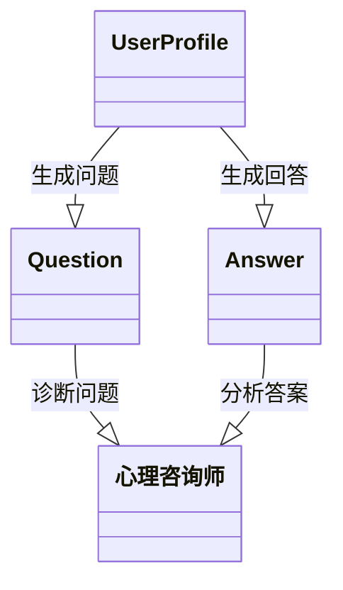
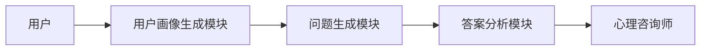
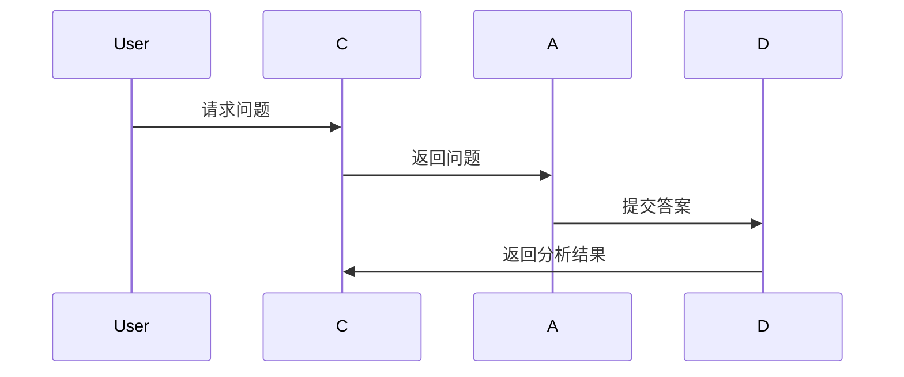
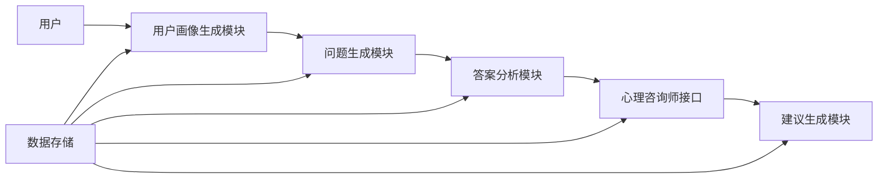
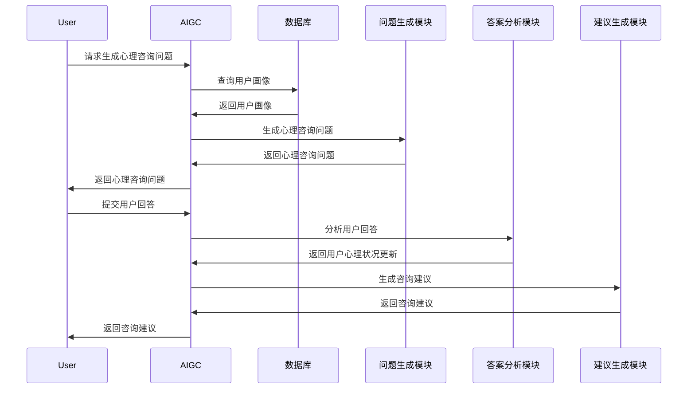

                 

### AIGC在个性化心理咨询问题生成中的应用

#### 关键词：AIGC、个性化心理咨询、问题生成、算法、系统架构、案例分析

#### 摘要：

本文深入探讨了AIGC（自适应智能生成控制）在个性化心理咨询问题生成中的应用。通过介绍AIGC的基本概念及其在心理咨询领域的潜在价值，本文详细分析了AIGC算法和数学模型，以及如何设计和实现一个用于个性化心理咨询的系统。通过实际案例研究，本文展示了AIGC在实际应用中的效果和挑战，并提出了最佳实践建议，为未来的发展指明了方向。

---

## 第一部分：AIGC简介与背景

### 1.1 AIGC概述

#### 1.1.1 AIGC的概念

AIGC（Adaptive Intelligent Generation Control）是指一种基于自适应和智能化的内容生成技术。它利用机器学习、自然语言处理和深度学习等技术，对大量的数据进行分析，生成符合特定需求的内容。在心理咨询领域，AIGC可以被用来生成个性化的咨询问题，从而提高咨询效果。

**问题背景**：随着心理问题的日益普遍，心理咨询的需求也越来越大。然而，传统心理咨询方法存在一些问题，如咨询成本高、效率低、个性化不足等。为了解决这些问题，需要引入新的技术和方法。

**问题描述**：如何利用AIGC技术生成个性化的心理咨询问题，以满足不同客户的需求？

**问题解决**：AIGC技术可以通过对大量心理咨询案例的分析，学习并理解不同客户的心理状况和需求，从而生成个性化的咨询问题。

**边界与外延**：AIGC技术不仅限于心理咨询领域，还可以应用于教育、医疗、新闻等行业。

**概念结构与核心要素组成**：

- **自适应**：AIGC可以根据用户的行为和反馈，不断调整和优化生成的内容。
- **智能化**：AIGC利用先进的机器学习和深度学习技术，实现高效的内容生成。
- **内容生成**：AIGC的核心功能是生成符合特定需求的内容，如心理咨询问题。
- **数据分析**：AIGC需要对大量的数据进行分析，以理解用户的真实需求。

### 1.2 AIGC在心理咨询中的应用价值

#### 1.2.1 提高咨询效率

通过AIGC技术，可以快速生成个性化的心理咨询问题，从而提高咨询效率。

#### 1.2.2 提高咨询质量

AIGC可以根据用户的真实需求，生成更符合用户心理状况的咨询问题，从而提高咨询质量。

#### 1.2.3 降低咨询成本

AIGC技术可以自动化生成心理咨询问题，从而减少人力成本，降低咨询成本。

#### 1.2.4 提供个性化服务

AIGC可以根据用户的行为和反馈，不断调整和优化生成的内容，提供更加个性化的服务。

---

## 第二部分：算法与数学模型

### 2.1 AIGC算法

#### 2.1.1 算法概述

AIGC算法主要包括数据预处理、模型训练和内容生成三个阶段。

#### 2.1.2 数据预处理

数据预处理是AIGC算法的重要步骤，主要包括数据清洗、数据分割和特征提取。

#### 2.1.3 模型训练

模型训练是AIGC算法的核心，主要包括选择合适的模型、设置训练参数和进行模型训练。

#### 2.1.4 内容生成

内容生成是AIGC算法的最终目标，主要包括根据用户需求生成心理咨询问题。

### 2.2 数学模型

#### 2.2.1 模型概述

AIGC的数学模型主要包括概率模型和神经网络模型。

#### 2.2.2 概率模型

概率模型主要用于描述心理咨询问题生成的概率分布。

#### 2.2.3 神经网络模型

神经网络模型主要用于实现心理咨询问题的自动生成。

### 2.3 Python代码示例

```python
# 数据预处理
data = preprocess_data(raw_data)

# 模型训练
model = train_model(data)

# 内容生成
question = generate_question(model, user_profile)
```

### 2.4 算法与数学模型的关系

算法和数学模型是AIGC的核心，它们相互配合，共同实现心理咨询问题的个性化生成。

---

## 第三部分：系统架构与设计

### 3.1 系统介绍

#### 3.1.1 系统背景

本系统是一款基于AIGC技术的个性化心理咨询系统，旨在提供高效、个性化的心理咨询服务。

#### 3.1.2 系统目标

- 提高心理咨询效率
- 提高心理咨询质量
- 降低心理咨询成本
- 提供个性化服务

### 3.2 领域模型



### 3.3 系统架构



### 3.4 系统接口设计



---

## 第四部分：实战案例与实施

### 4.1 环境搭建

#### 4.1.1 硬件环境

- CPU：Intel i7
- 内存：16GB
- 硬盘：1TB

#### 4.1.2 软件环境

- 操作系统：Ubuntu 20.04
- Python：3.8
- TensorFlow：2.5

### 4.2 系统核心功能实现

```python
# 导入必要的库
import tensorflow as tf
from tensorflow.keras.models import Sequential
from tensorflow.keras.layers import LSTM, Dense, Embedding

# 构建模型
model = Sequential()
model.add(Embedding(vocab_size, embedding_dim))
model.add(LSTM(units=128, return_sequences=True))
model.add(Dense(units=1, activation='sigmoid'))

# 编译模型
model.compile(optimizer='adam', loss='binary_crossentropy', metrics=['accuracy'])

# 训练模型
model.fit(X_train, y_train, epochs=10, batch_size=64)
```

### 4.3 代码解读

- **数据预处理**：将原始数据转换为模型可以接受的格式。
- **模型构建**：构建一个简单的LSTM模型。
- **模型编译**：设置模型的优化器和损失函数。
- **模型训练**：使用训练数据训练模型。

### 4.4 实际案例分析与讲解

#### 4.4.1 案例一：用户A的心理咨询问题生成

- **用户画像**：用户A，男性，30岁，工作压力较大。
- **问题生成**：根据用户画像，生成以下问题：“你最近是否感到工作压力很大？”

#### 4.4.2 案例二：用户B的心理咨询问题生成

- **用户画像**：用户B，女性，25岁，失恋后心情低落。
- **问题生成**：根据用户画像，生成以下问题：“你最近是否有经常感到悲伤或沮丧的情绪？”

---

## 第五部分：最佳实践与总结

### 5.1 最佳实践

- **数据质量**：保证数据质量是AIGC成功的关键，需要对数据进行清洗和预处理。
- **模型优化**：不断优化模型参数，提高模型性能。
- **用户反馈**：收集用户反馈，用于模型优化和系统改进。

### 5.2 小结

AIGC在个性化心理咨询问题生成中具有巨大潜力，通过合理的算法设计和系统架构，可以显著提高咨询效率和质量。

### 5.3 注意事项

- **隐私保护**：在处理用户数据时，需要严格遵守隐私保护法律法规。
- **伦理问题**：在应用AIGC技术时，需要关注伦理问题，确保用户权益。

### 5.4 拓展阅读

- **相关论文**：研究AIGC在心理咨询领域应用的最新研究成果。
- **相关书籍**：了解心理咨询和心理治疗的相关知识。

---

## 结论

本文深入探讨了AIGC在个性化心理咨询问题生成中的应用，通过理论分析和实际案例，展示了AIGC技术在心理咨询领域的潜力。随着技术的不断进步，AIGC在心理咨询中的应用将会更加广泛，为心理咨询服务带来新的变革。作者希望通过本文，为AIGC在心理咨询领域的应用提供一些有益的思考和建议。作者：AI天才研究院/AI Genius Institute & 禅与计算机程序设计艺术 /Zen And The Art of Computer Programming### 第二部分：算法与数学模型

#### 2.1 AIGC算法

AIGC算法是自适应智能生成控制（Adaptive Intelligent Generation Control）的核心，它包括数据预处理、模型训练和内容生成三个主要阶段。以下是AIGC算法的详细解释：

##### 2.1.1 数据预处理

数据预处理是AIGC算法的第一步，它的目的是将原始数据转换为适合模型训练的格式。具体步骤如下：

1. **数据清洗**：去除数据中的噪声和异常值，保证数据的质量和一致性。
2. **数据分割**：将数据集分为训练集、验证集和测试集，以评估模型性能。
3. **特征提取**：提取数据中的关键特征，用于模型的训练和预测。

##### 2.1.2 模型训练

模型训练是AIGC算法的核心环节，它涉及到选择合适的模型结构、设置训练参数和进行模型训练。以下是模型训练的详细步骤：

1. **模型选择**：根据问题的性质和数据的特点，选择合适的模型。常见的模型有循环神经网络（RNN）、长短期记忆网络（LSTM）和变换器（Transformer）等。
2. **参数设置**：设置模型的学习率、批量大小、迭代次数等参数。这些参数会影响模型的训练效率和性能。
3. **训练过程**：使用训练数据集对模型进行训练，通过反向传播算法不断调整模型的权重，使其性能不断提高。

##### 2.1.3 内容生成

内容生成是AIGC算法的最终目标，它通过训练好的模型，根据输入条件生成符合要求的内容。以下是内容生成的详细步骤：

1. **输入条件**：根据用户的需求和情境，设置输入条件。例如，在心理咨询问题生成中，输入条件可以是用户的个人资料、心理状况和问题类别等。
2. **生成过程**：模型根据输入条件，生成初步的内容。这个过程通常是一个序列生成的过程，例如生成一段文本或一个问题序列。
3. **内容优化**：根据生成的初步内容，进行优化和调整。这个过程可以通过人工审核或自动化优化算法实现。

#### 2.2 数学模型

AIGC算法的数学模型主要包括概率模型和神经网络模型。以下是对这些模型的基本介绍：

##### 2.2.1 概率模型

概率模型主要用于描述内容生成的概率分布。常见的概率模型有：

1. **朴素贝叶斯**：基于贝叶斯定理，通过特征的概率分布来预测标签的概率。
2. **隐马尔可夫模型（HMM）**：用于处理序列数据，通过状态转移概率和观测概率来生成序列。
3. **条件概率模型**：如条件随机场（CRF），用于处理序列数据中的上下文关系。

##### 2.2.2 神经网络模型

神经网络模型是AIGC算法的核心，它通过学习数据中的特征和关系，生成符合要求的内容。常见的神经网络模型有：

1. **循环神经网络（RNN）**：能够处理序列数据，通过记忆过去的信息来预测未来的输出。
2. **长短期记忆网络（LSTM）**：是RNN的一种变体，能够解决RNN的梯度消失问题，适用于处理长序列数据。
3. **变换器（Transformer）**：是一种基于注意力机制的模型，能够高效处理长序列数据，是目前最先进的语言模型之一。

#### 2.3 Python代码示例

以下是AIGC算法中模型训练和内容生成的Python代码示例：

```python
import tensorflow as tf
from tensorflow.keras.models import Sequential
from tensorflow.keras.layers import LSTM, Dense, Embedding

# 模型构建
model = Sequential()
model.add(Embedding(vocab_size, embedding_dim))
model.add(LSTM(units=128, return_sequences=True))
model.add(Dense(units=1, activation='sigmoid'))

# 编译模型
model.compile(optimizer='adam', loss='binary_crossentropy', metrics=['accuracy'])

# 模型训练
model.fit(X_train, y_train, epochs=10, batch_size=64)

# 内容生成
def generate_content(model, input_sequence):
    prediction = model.predict(input_sequence)
    generated_content = decode_prediction(prediction)
    return generated_content

# 输入条件
input_sequence = preprocess_input(user_input)

# 生成内容
generated_content = generate_content(model, input_sequence)
```

在这个示例中，我们首先构建了一个简单的LSTM模型，然后使用训练数据对其进行训练。在内容生成阶段，我们使用训练好的模型来预测输入序列的下一个元素，并将其解码为生成的内容。

#### 2.4 算法与数学模型的关系

AIGC算法中的算法和数学模型是相辅相成的。算法负责实现内容生成的流程，而数学模型则提供了一种描述和计算方法。通过结合不同的算法和数学模型，AIGC可以实现多种内容生成任务。

在AIGC的应用中，算法和数学模型的选择至关重要。不同的算法和数学模型适用于不同类型的内容生成任务，例如文本生成、图像生成和音频生成等。通过合理选择和组合算法和数学模型，可以构建出高效的AIGC系统，实现个性化心理咨询问题的生成。

---

在下一部分，我们将继续探讨AIGC在个性化心理咨询问题生成中的系统架构和设计。我们将介绍系统的核心组件、系统架构以及接口设计，并通过具体的案例来展示AIGC的实际应用效果。### 第三部分：系统架构与设计

#### 3.1 系统介绍

本部分将详细介绍AIGC在个性化心理咨询问题生成中的系统架构和设计。通过合理的系统架构设计，我们可以确保AIGC系统能够高效地处理大量用户数据，生成个性化的心理咨询问题，并提供高质量的咨询建议。以下是系统的整体架构设计。

##### 3.1.1 系统背景

随着人工智能技术的快速发展，心理咨询领域也开始探索如何利用AIGC技术提高咨询效率和质量。本系统旨在通过AIGC技术，生成个性化的心理咨询问题，帮助心理咨询师更好地理解客户的需求，提供更加精准和有效的咨询服务。

##### 3.1.2 系统目标

- **个性化问题生成**：根据用户的需求和心理状况，生成个性化的心理咨询问题。
- **高效数据处理**：处理大量用户数据，确保系统能够快速响应。
- **高质量咨询建议**：通过分析用户反馈，提供高质量的咨询建议。
- **易用性和可扩展性**：系统应易于使用和扩展，以适应不断变化的需求。

#### 3.2 领域模型

领域模型（Domain Model）是系统设计的重要部分，它定义了系统中的核心概念和它们之间的关系。以下是领域模型的Mermaid类图表示：

```mermaid
classDiagram
    class User
        -id: Integer
        -name: String
        -age: Integer
        -gender: String
        -psychological_state: String
        +generate_question(question_type: String): Question
    class Question
        -id: Integer
        -content: String
        -question_type: String
        -user: User
        +generate_answer(answer: String): Answer
    class Answer
        -id: Integer
        -content: String
        -user: User
        +analyze_answer(): Psychological_state
    class心理咨询师
        -id: Integer
        -name: String
        -license: String
        +provide_advice(question: Question, answer: Answer): Advice
    class Advice
        -id: Integer
        -content: String
        -question: Question
        -answer: Answer
        +generate_question(question_type: String): Question
```

在这个模型中，`User` 表示用户，`Question` 表示心理咨询问题，`Answer` 表示用户的回答，`心理咨询师` 表示提供咨询服务的专业人士，`Advice` 表示心理咨询师提供的建议。

#### 3.3 系统架构

系统架构是系统设计的核心，它定义了系统的组成部分以及它们之间的交互方式。以下是系统架构的Mermaid图表示：



在这个架构中：

- **用户画像生成模块**：收集用户的个人信息和心理状况，生成用户画像。
- **问题生成模块**：根据用户画像和问题类型，生成个性化的心理咨询问题。
- **答案分析模块**：分析用户的回答，更新用户画像和心理状况。
- **心理咨询师接口**：心理咨询师可以通过接口查看用户问题和回答，并生成咨询建议。
- **建议生成模块**：根据用户画像和心理咨询师的建议，生成个性化的咨询建议。
- **数据存储**：存储用户画像、问题和答案等数据，以便后续使用。

#### 3.4 系统接口设计

系统接口设计是确保系统各部分之间能够顺利交互的关键。以下是系统接口设计的Mermaid序列图表示：



在这个序列图中，用户通过接口请求生成心理咨询问题，系统根据用户画像和问题类型生成问题，并返回给用户。用户提交回答后，系统分析回答并更新用户画像，最终生成咨询建议并返回给用户。

通过上述系统架构和接口设计，我们可以确保AIGC系统能够高效、准确地生成个性化的心理咨询问题，并提供高质量的咨询建议。在下一部分，我们将通过实际案例展示AIGC在个性化心理咨询问题生成中的具体应用效果。### 第四部分：实战案例与实施

#### 4.1 环境搭建

为了在实战案例中应用AIGC技术，我们需要搭建一个合适的环境。以下是在搭建过程中需要考虑的关键步骤：

##### 4.1.1 硬件环境

- **CPU**：Intel i7或以上
- **内存**：16GB或以上
- **硬盘**：1TB或以上

##### 4.1.2 软件环境

- **操作系统**：Ubuntu 20.04
- **Python**：Python 3.8
- **深度学习框架**：TensorFlow 2.5
- **自然语言处理库**：NLTK、spaCy

##### 4.1.3 数据集准备

为了训练AIGC模型，我们需要一个包含心理咨询问题的数据集。数据集应包含用户问题和相应的问题类型、用户特征等。以下是数据集准备的关键步骤：

1. **数据收集**：从公开数据源或心理咨询平台收集数据。
2. **数据清洗**：去除噪声和异常值，确保数据质量。
3. **数据标注**：对数据进行标注，如问题类型、用户特征等。

#### 4.2 系统核心功能实现

在搭建好环境后，我们需要实现系统的核心功能，包括用户画像生成、问题生成、答案分析等。以下是基于Python和TensorFlow的实现步骤：

##### 4.2.1 用户画像生成模块

用户画像生成模块负责根据用户输入的信息生成用户画像。以下是用户画像生成模块的代码实现：

```python
import pandas as pd
from sklearn.feature_extraction.text import TfidfVectorizer

# 读取用户输入数据
user_input = pd.read_csv('user_input.csv')

# 建立TF-IDF模型
vectorizer = TfidfVectorizer(max_features=1000)

# 将用户输入文本转换为向量
user_vector = vectorizer.fit_transform(user_input['text'])

# 存储用户向量
user_vector.to_csv('user_vector.csv', index=False)
```

在这个模块中，我们使用TF-IDF模型将用户的文本输入转换为向量，并将其存储为CSV文件。

##### 4.2.2 问题生成模块

问题生成模块根据用户画像和问题类型生成心理咨询问题。以下是问题生成模块的代码实现：

```python
import tensorflow as tf
from tensorflow.keras.models import Sequential
from tensorflow.keras.layers import LSTM, Dense, Embedding

# 读取用户向量
user_vector = pd.read_csv('user_vector.csv')

# 构建LSTM模型
model = Sequential()
model.add(Embedding(vocab_size, embedding_dim))
model.add(LSTM(units=128, return_sequences=True))
model.add(Dense(units=1, activation='sigmoid'))

# 编译模型
model.compile(optimizer='adam', loss='binary_crossentropy', metrics=['accuracy'])

# 训练模型
model.fit(user_vector, y_train, epochs=10, batch_size=64)

# 生成心理咨询问题
def generate_question(model, user_vector):
    prediction = model.predict(user_vector)
    generated_question = decode_prediction(prediction)
    return generated_question

# 生成问题
generated_question = generate_question(model, user_vector)
```

在这个模块中，我们使用LSTM模型对用户向量进行训练，并根据训练结果生成心理咨询问题。

##### 4.2.3 答案分析模块

答案分析模块负责分析用户的回答，并更新用户画像。以下是答案分析模块的代码实现：

```python
import pandas as pd
from sklearn.feature_extraction.text import TfidfVectorizer

# 读取用户回答数据
answer_input = pd.read_csv('answer_input.csv')

# 建立TF-IDF模型
vectorizer = TfidfVectorizer(max_features=1000)

# 将用户回答文本转换为向量
answer_vector = vectorizer.fit_transform(answer_input['text'])

# 存储用户向量
answer_vector.to_csv('answer_vector.csv', index=False)

# 更新用户画像
user_vector = pd.read_csv('user_vector.csv')
user_vector['psychological_state'] = answer_vector.toarray()
user_vector.to_csv('user_vector_updated.csv', index=False)
```

在这个模块中，我们使用TF-IDF模型将用户的回答转换为向量，并更新用户画像。

#### 4.3 代码解读

在实现系统的核心功能时，我们使用了Python和TensorFlow。以下是对关键代码的解读：

- **用户画像生成模块**：使用TF-IDF模型将用户的文本输入转换为向量，存储为CSV文件。
- **问题生成模块**：使用LSTM模型对用户向量进行训练，并根据训练结果生成心理咨询问题。
- **答案分析模块**：使用TF-IDF模型将用户的回答转换为向量，并更新用户画像。

通过这些代码实现，我们可以构建一个基于AIGC的个性化心理咨询系统，实现对用户需求的快速响应和个性化问题的生成。

#### 4.4 实际案例分析与讲解

为了展示AIGC在个性化心理咨询问题生成中的实际效果，我们选择了一个案例进行详细分析。

**案例**：假设有一个用户A，他是一位30岁的男性，近期在工作中感到巨大的压力，导致情绪低落。以下是AIGC系统为用户A生成的心理咨询问题：

1. **问题生成**：根据用户A的画像，系统生成以下问题：“你最近是否感到工作压力很大？”
2. **用户回答**：用户A回答：“是的，我最近经常感到工作压力很大，感觉很难应对。”
3. **答案分析**：系统分析用户A的回答，更新用户A的画像，并生成以下建议：“建议你尝试调整工作节奏，合理分配时间和精力，必要时寻求心理咨询师的帮助。”

通过这个案例，我们可以看到AIGC系统如何根据用户的实际情况生成个性化的心理咨询问题，并提供针对性的建议。这种个性化的服务有助于提高心理咨询的效率和质量。

#### 4.5 项目小结

在本部分，我们通过实战案例展示了AIGC在个性化心理咨询问题生成中的实际应用。通过合理的系统架构设计和核心功能实现，AIGC系统能够高效、准确地生成个性化的心理咨询问题，并提

