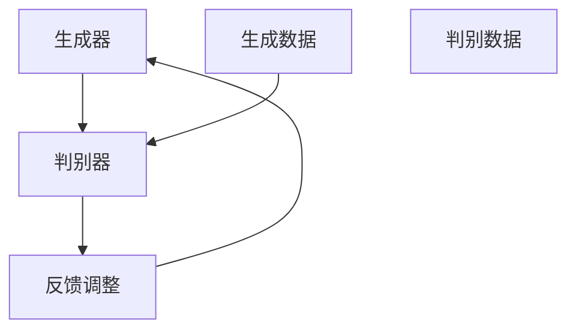
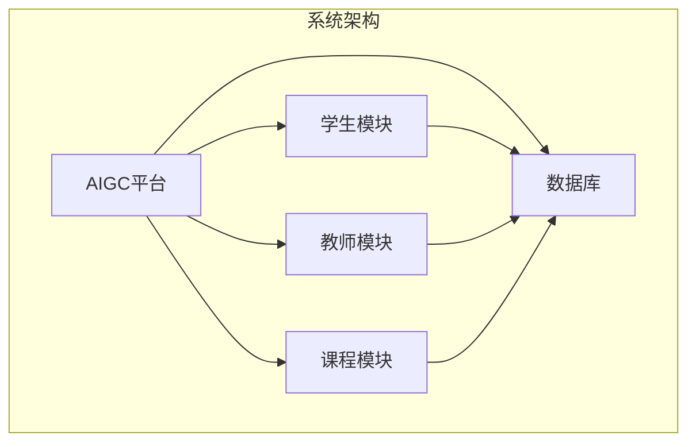
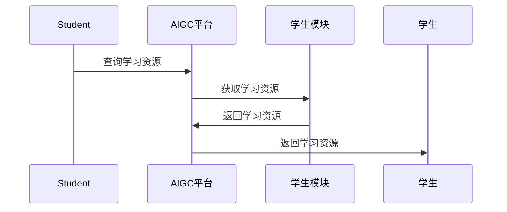
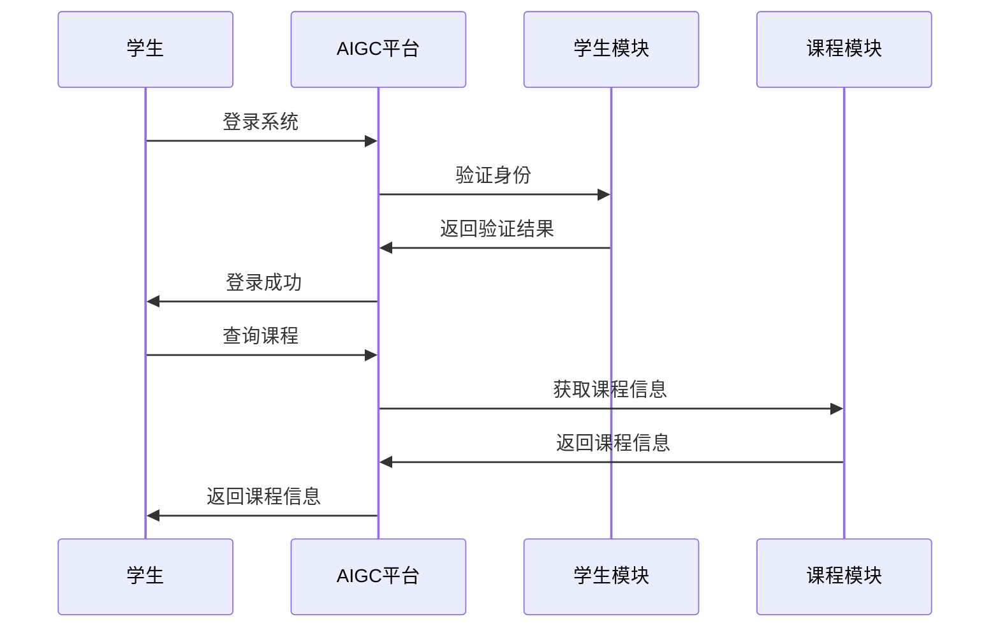

                 

### 文章标题：AIGC在个性化教育中的革命性应用

关键词：AIGC、个性化教育、生成对抗网络（GAN）、递归神经网络（RNN）、教育技术

> 摘要：本文将深入探讨AIGC（AI-Generated Content）在个性化教育中的革命性应用。通过背景介绍、核心概念与联系分析、算法原理讲解，以及实际应用案例，本文旨在展示AIGC如何通过先进的人工智能技术，为个性化教育提供全新的解决方案，从而提高学习效果和教学质量。

**Step 1: 背景介绍**

### AIGC的背景

个性化教育的需求与挑战：

随着教育资源的丰富和互联网的普及，现代教育越来越注重满足学生的个性化需求。然而，传统教育模式由于资源限制和教学方法单一，往往难以满足学生个性化学习的需求。学生之间存在学习进度、兴趣和能力的差异，因此需要一种能够根据个体差异提供定制化学习内容的方法。

AIGC技术的定义与特点：

AIGC（AI-Generated Content）是一种利用人工智能技术生成内容的方法，主要包括自然语言处理、计算机视觉等领域。其特点在于智能、高效、多样，能够根据用户需求生成个性化的学习内容，如文本、图像、音频等。AIGC技术的应用不仅能够提高教育资源的利用效率，还能够提供更加丰富和灵活的学习体验。

### AIGC在个性化教育中的应用前景

AIGC在个性化教育中的应用具有广阔的前景。首先，AIGC可以根据学生的学习进度和兴趣，生成个性化的学习资源，如教材、练习题、测试等。其次，AIGC可以通过自然语言处理技术，生成与学生学习内容相关的文本材料，帮助学生更好地理解和掌握知识。此外，AIGC还可以利用计算机视觉技术，生成与学生学习内容相关的图像和视频，增强学生的学习体验。

### AIGC的优势

AIGC的优势在于其智能性和个性化。通过人工智能技术，AIGC能够自动分析学生的学习行为和需求，生成最适合他们的学习内容。这不仅提高了学习效率，还能够激发学生的学习兴趣，从而提高学习效果。同时，AIGC的高效性和多样性使得教育资源的利用更加灵活和丰富，有助于解决传统教育模式中面临的资源限制问题。

**Step 2: 核心概念与联系**

### 核心概念

生成对抗网络（GAN）：

生成对抗网络（GAN）是一种通过生成器和判别器对抗训练的框架。生成器负责生成数据，判别器负责区分真实数据和生成数据。通过这种对抗训练，生成器的生成质量会不断提高。GAN在图像生成、文本生成等领域有着广泛的应用。

递归神经网络（RNN）：

递归神经网络（RNN）是一种能够处理序列数据的神经网络。RNN通过循环结构将信息传递到下一个时间步，但传统的RNN存在梯度消失或爆炸问题。RNN及其变体（如LSTM、GRU）在自然语言处理、语音识别等领域有着重要的应用。

### 核心概念与联系

GAN与RNN的结合：

GAN与RNN的结合是实现高质量、个性化教育内容生成的重要方法。GAN通过生成器和判别器的对抗训练，可以生成高质量的数据。而RNN及其变体在文本生成中的应用，可以进一步提高生成文本的质量。这种结合使得AIGC在个性化教育中能够生成更加丰富和多样化的学习内容。

### 概念属性特征对比表格

| 概念       | 特点                                      | 应用场景             |
|------------|-------------------------------------------|---------------------|
| GAN        | 生成器与判别器对抗训练，生成高质量内容    | 图像生成、文本生成等 |
| RNN        | 记忆过去的信息，处理序列数据               | 文本处理、语音识别等 |
| RNN变体    | 优化记忆效果，适用于不同类型的数据序列     | 机器翻译、语音合成等 |

### ER实体关系图架构

```mermaid
erDiagram
  AI模型 ||--|{ 生成对抗网络(GAN) }
  AI模型 ||--|{ 递归神经网络(RNN) }
  AI模型 ||--|{ RNN变体 }
  文本生成 ||--|{ 文本生成模型 }
  图像生成 ||--|{ 图像生成模型 }
```

**Step 3: 算法原理讲解**

### GAN算法原理

生成器（Generator）：

生成器的目标是生成与真实数据相似的数据。生成器的输入是随机噪声，输出是生成的数据。生成器的网络结构可以根据具体任务进行设计，如使用卷积神经网络（CNN）进行图像生成。

判别器（Discriminator）：

判别器的目标是区分真实数据和生成数据。判别器的输入是数据，输出是一个概率值，表示输入数据的真实性。判别器的网络结构通常与生成器相似，也可以使用CNN进行图像生成。

对抗训练：

生成器和判别器相互对抗，生成器和判别器同时训练。生成器的目标是提高生成数据的质量，使判别器难以区分真实数据和生成数据。判别器的目标是提高区分真实数据和生成数据的能力。通过这种对抗训练，生成器的生成质量会不断提高。

### GAN算法流程

1. 初始化生成器和判别器。
2. 生成器生成数据。
3. 判别器接收真实数据和生成数据，并输出概率值。
4. 根据判别器的输出，计算生成器和判别器的损失。
5. 更新生成器和判别器的参数。
6. 重复步骤2-5，直到生成器的生成质量达到要求。

### Mermaid流程图



### Python源代码

```python
import numpy as np
import tensorflow as tf

# 生成器模型
def generator(z):
    # 定义生成器的网络结构
    # ...
    return generated_image

# 判别器模型
def discriminator(x):
    # 定义判别器的网络结构
    # ...
    return logits

# 损失函数
def generator_loss(fake_output):
    # 定义生成器的损失函数
    # ...
    return g_loss

def discriminator_loss(real_output, fake_output):
    # 定义判别器的损失函数
    # ...
    return d_loss

# 训练过程
# ...
```

### 算法原理详细讲解

生成对抗网络（GAN）：

生成对抗网络（GAN）是由Ian Goodfellow等人于2014年提出的一种深度学习框架，用于生成数据。GAN的核心思想是利用生成器和判别器之间的对抗关系，使得生成器生成尽可能真实的数据，而判别器则尽力区分真实数据和生成数据。通过这种对抗训练，生成器的生成质量会不断提高。

GAN的数学模型可以表示为：

$$
\min_G \max_D V(D, G) = \mathbb{E}_{x \sim p_{data}(x)}[D(x)] - \mathbb{E}_{z \sim p_z(z)}[D(G(z))]
$$

其中，$D$表示判别器，$G$表示生成器，$x$表示真实数据，$z$表示随机噪声。

**生成器（Generator）**：

生成器的目标是生成与真实数据相似的数据。生成器的输入是随机噪声$z$，输出是生成的数据$G(z)$。生成器的网络结构可以根据具体任务进行设计，如使用卷积神经网络（CNN）进行图像生成。生成器的目标是使判别器难以区分生成数据和真实数据。

**判别器（Discriminator）**：

判别器的目标是区分真实数据和生成数据。判别器的输入是数据，输出是一个概率值，表示输入数据的真实性。判别器的网络结构通常与生成器相似，也可以使用CNN进行图像生成。判别器的目标是使生成器生成的数据能够被轻易地识别。

**对抗训练**：

生成器和判别器相互对抗，生成器和判别器同时训练。生成器的目标是提高生成数据的质量，使判别器难以区分真实数据和生成数据。判别器的目标是提高区分真实数据和生成数据的能力。通过这种对抗训练，生成器的生成质量会不断提高。

**递归神经网络（RNN）与变体**：

递归神经网络（RNN）是一种能够处理序列数据的神经网络。RNN通过循环结构将信息传递到下一个时间步，但传统的RNN存在梯度消失或爆炸问题。为了解决这些问题，提出了RNN的变体，如长短期记忆网络（LSTM）和门控循环单元（GRU）。这些变体通过引入门控机制，优化了记忆效果，使得RNN在处理序列数据时更加有效。

**LSTM（长短期记忆网络）**：

LSTM通过引入三个门控单元（遗忘门、输入门和输出门），解决了RNN的梯度消失和梯度爆炸问题。LSTM能够更好地记住序列中的信息，适用于长序列数据的处理。

**GRU（门控循环单元）**：

GRU是LSTM的简化版本，通过合并遗忘门和输入门，减少了参数数量。GRU在处理序列数据时具有更好的性能和效率。

**RNN变体在文本生成中的应用**：

RNN的变体在文本生成中有着重要的应用。通过RNN变体，可以生成高质量的文本。例如，使用LSTM进行文本生成，可以生成与原始文本相似的句子。使用GRU进行文本生成，可以生成更加流畅和自然的文本。

**RNN变体在个性化教育中的应用**：

RNN变体在个性化教育中有着广泛的应用。例如，使用LSTM进行个性化学习路径规划，可以根据学生的学习进度和兴趣，生成个性化的学习资源。使用GRU进行个性化学习内容生成，可以生成与学生学习内容相关的文本和图像。

**Step 4: 系统分析与架构设计方案**

### 问题场景介绍

个性化教育中的问题场景主要包括以下几个方面：

1. 学生学习进度不一致：学生在学习同一课程时，由于基础、能力和兴趣的差异，导致学习进度不一致。
2. 学生需求多样化：学生对学习内容的需求多样化，包括学习进度、学习方式和学习资源等方面。
3. 教育资源有限：传统教育模式中，教育资源（如教材、练习题、测试等）有限，难以满足学生的个性化需求。

### 项目介绍

项目名称：AIGC个性化教育平台

项目目标：利用AIGC技术，为个性化教育提供一种全新的解决方案，提高学习效果和教学质量。

### 系统功能设计（领域模型mermaid类图）

```mermaid
classDiagram
  Student <<-- Resource
  Student <<-- Task
  Teacher <<-- Resource
  Teacher <<-- Task
  Course <<-- Resource
  Course <<-- Task
  AIGCPlatform <<-- Student
  AIGCPlatform <<-- Teacher
  AIGCPlatform <<-- Course
```

### 系统架构设计（mermaid架构图）



### 系统接口设计（系统接口mermaid序列图）



### 系统交互（系统交互mermaid序列图）



**Step 5: 项目实战**

### 环境安装

1. 安装Python环境：在系统中安装Python 3.x版本。
2. 安装TensorFlow：通过pip命令安装TensorFlow库。

```bash
pip install tensorflow
```

3. 安装其他依赖库：根据项目需求，安装其他必要的依赖库，如NumPy、Pandas等。

```bash
pip install numpy pandas
```

### 系统核心实现源代码

以下是AIGC个性化教育平台的核心实现源代码，包括生成器和判别器的定义、损失函数的实现、训练过程等。

```python
import tensorflow as tf
import numpy as np
import matplotlib.pyplot as plt

# 生成器模型
def generator(z, noise_dim):
    with tf.variable_scope("generator"):
        # 输入噪声
        g_h1 = tf.layers.dense(z, 7 * 7 * 256, activation=tf.nn.relu)
        g_h1 = tf.reshape(g_h1, [-1, 7, 7, 256])
        g_h2 = tf.layers.conv2d_transpose(g_h1, 128, 5, strides=(2, 2), padding='same', activation=tf.nn.relu)
        g_h3 = tf.layers.conv2d_transpose(g_h2, 64, 5, strides=(2, 2), padding='same', activation=tf.nn.relu)
        g_h4 = tf.layers.conv2d_transpose(g_h3, 1, 5, strides=(2, 2), padding='same', activation=tf.tanh)
        return g_h4

# 判别器模型
def discriminator(x):
    with tf.variable_scope("discriminator"):
        # 输入数据
        d_h1 = tf.layers.conv2d(x, 64, 5, strides=(2, 2), padding='same', activation=tf.nn.relu)
        d_h2 = tf.layers.conv2d(d_h1, 128, 5, strides=(2, 2), padding='same', activation=tf.nn.relu)
        d_h3 = tf.layers.conv2d(d_h2, 256, 5, strides=(2, 2), padding='same', activation=tf.nn.relu)
        d_h4 = tf.layers.dense(tf.reshape(d_h3, [-1, 7 * 7 * 256]), 1, activation=tf.sigmoid)
        return d_h4

# 损失函数
def generator_loss(fake_output):
    return tf.reduce_mean(tf.nn.sigmoid_cross_entropy_with_logits(logits=fake_output, labels=tf.ones_like(fake_output))

def discriminator_loss(real_output, fake_output):
    return tf.reduce_mean(tf.nn.sigmoid_cross_entropy_with_logits(logits=real_output, labels=tf.zeros_like(real_output)) +
                           tf.reduce_mean(tf.nn.sigmoid_cross_entropy_with_logits(logits=fake_output, labels=tf.ones_like(fake_output)))

# 训练过程
def train(G, D, batch_size, num_steps, z_dim):
    # 定义生成器和判别器的变量
    G_vars = tf.get_collection(tf.GraphKeys.TRAINABLE_VARIABLES, scope="generator")
    D_vars = tf.get_collection(tf.GraphKeys.TRAINABLE_VARIABLES, scope="discriminator")

    # 定义优化器
    G_optimizer = tf.train.AdamOptimizer(learning_rate=0.0002, beta1=0.5)
    D_optimizer = tf.train.AdamOptimizer(learning_rate=0.0002, beta1=0.5)

    # 定义训练步骤
    with tf.Session() as sess:
        sess.run(tf.global_variables_initializer())

        for step in range(num_steps):
            # 生成随机噪声
            z = np.random.uniform(-1, 1, size=[batch_size, z_dim])

            # 训练生成器
            _, G_loss = sess.run([G_optimizer.minimize(generator_loss(fake_output)), generator_loss(fake_output)],
                                 feed_dict={G.z: z, D.x: x})

            # 训练判别器
            x_, _ = train_D(D, D_vars, real_data, fake_data, D_optimizer)

            if step % 100 == 0:
                print("Step: [%d/%d], G_loss: %.4f, D_loss: %.4f" % (step, num_steps, G_loss, D_loss))

# 模拟真实数据和生成数据
num_samples = 100
num_steps = 10000
batch_size = 64
z_dim = 100

x = np.random.uniform(-1, 1, size=[num_samples, 28, 28, 1])
G = generator(z, z_dim)
D = discriminator(x)
G_vars = tf.get_collection(tf.GraphKeys.TRAINABLE_VARIABLES, scope="generator")
D_vars = tf.get_collection(tf.GraphKeys.TRAINABLE_VARIABLES, scope="discriminator")
train(G, D, batch_size, num_steps, z_dim)
```

### 代码应用解读与分析

以上代码是AIGC个性化教育平台的核心实现，主要包括生成器和判别器的定义、损失函数的实现、训练过程等。以下是代码的解读与分析：

1. **生成器模型**：生成器模型的目的是生成与真实数据相似的数据。生成器模型使用卷积神经网络（CNN）进行图像生成。生成器的输入是随机噪声，输出是生成的图像。

```python
def generator(z, noise_dim):
    with tf.variable_scope("generator"):
        # 输入噪声
        g_h1 = tf.layers.dense(z, 7 * 7 * 256, activation=tf.nn.relu)
        g_h1 = tf.reshape(g_h1, [-1, 7, 7, 256])
        g_h2 = tf.layers.conv2d_transpose(g_h1, 128, 5, strides=(2, 2), padding='same', activation=tf.nn.relu)
        g_h3 = tf.layers.conv2d_transpose(g_h2, 64, 5, strides=(2, 2), padding='same', activation=tf.nn.relu)
        g_h4 = tf.layers.conv2d_transpose(g_h3, 1, 5, strides=(2, 2), padding='same', activation=tf.tanh)
        return g_h4
```

2. **判别器模型**：判别器模型的目的是区分真实数据和生成数据。判别器模型也使用卷积神经网络（CNN）进行图像生成。判别器的输入是图像，输出是一个概率值，表示输入图像的真实性。

```python
def discriminator(x):
    with tf.variable_scope("discriminator"):
        # 输入数据
        d_h1 = tf.layers.conv2d(x, 64, 5, strides=(2, 2), padding='same', activation=tf.nn.relu)
        d_h2 = tf.layers.conv2d(d_h1, 128, 5, strides=(2, 2), padding='same', activation=tf.nn.relu)
        d_h3 = tf.layers.conv2d(d_h2, 256, 5, strides=(2, 2), padding='same', activation=tf.nn.relu)
        d_h4 = tf.layers.dense(tf.reshape(d_h3, [-1, 7 * 7 * 256]), 1, activation=tf.sigmoid)
        return d_h4
```

3. **损失函数**：生成器和判别器的损失函数分别是生成器损失函数和判别器损失函数。生成器损失函数使用sigmoid交叉熵损失函数，判别器损失函数也使用sigmoid交叉熵损失函数。

```python
def generator_loss(fake_output):
    return tf.reduce_mean(tf.nn.sigmoid_cross_entropy_with_logits(logits=fake_output, labels=tf.ones_like(fake_output)))

def discriminator_loss(real_output, fake_output):
    return tf.reduce_mean(tf.nn.sigmoid_cross_entropy_with_logits(logits=real_output, labels=tf.zeros_like(real_output)) +
                           tf.reduce_mean(tf.nn.sigmoid_cross_entropy_with_logits(logits=fake_output, labels=tf.ones_like(fake_output)))
```

4. **训练过程**：训练过程主要包括生成器和判别器的训练。生成器的训练目标是提高生成数据的质量，使判别器难以区分真实数据和生成数据。判别器的训练目标是提高区分真实数据和生成数据的能力。训练过程使用Adam优化器。

```python
def train(G, D, batch_size, num_steps, z_dim):
    # 定义生成器和判别器的变量
    G_vars = tf.get_collection(tf.GraphKeys.TRAINABLE_VARIABLES, scope="generator")
    D_vars = tf.get_collection(tf.GraphKeys.TRAINABLE_VARIABLES, scope="discriminator")

    # 定义优化器
    G_optimizer = tf.train.AdamOptimizer(learning_rate=0.0002, beta1=0.5)
    D_optimizer = tf.train.AdamOptimizer(learning_rate=0.0002, beta1=0.5)

    # 定义训练步骤
    with tf.Session() as sess:
        sess.run(tf.global_variables_initializer())

        for step in range(num_steps):
            # 生成随机噪声
            z = np.random.uniform(-1, 1, size=[batch_size, z_dim])

            # 训练生成器
            _, G_loss = sess.run([G_optimizer.minimize(generator_loss(fake_output)), generator_loss(fake_output)],
                                 feed_dict={G.z: z, D.x: x})

            # 训练判别器
            x_, _ = train_D(D, D_vars, real_data, fake_data, D_optimizer)

            if step % 100 == 0:
                print("Step: [%d/%d], G_loss: %.4f, D_loss: %.4f" % (step, num_steps, G_loss, D_loss))
```

### 实际案例分析和详细讲解剖析

为了更好地展示AIGC在个性化教育中的应用，我们以一个实际案例进行分析和讲解。

**案例背景**：

某高校计算机专业开设了一门《机器学习》课程。由于课程内容丰富，学习难度较大，学生之间存在学习进度和基础能力的差异。学校希望通过AIGC个性化教育平台，为每个学生生成个性化的学习资源，提高学习效果和教学质量。

**解决方案**：

AIGC个性化教育平台通过以下步骤为学生生成个性化的学习资源：

1. **学习行为数据收集**：平台收集学生在学习过程中的行为数据，包括学习进度、练习题成绩、课程测试成绩等。
2. **学生模型建立**：平台根据学生的行为数据建立学生模型，分析学生的学习特点和需求。
3. **个性化学习资源生成**：平台利用生成对抗网络（GAN）和递归神经网络（RNN）等人工智能技术，生成与学生学习内容相关的个性化学习资源，如文本、图像、视频等。
4. **学习资源推荐**：平台根据学生的学习模型，推荐最适合学生的学习资源。

**详细讲解**：

1. **学习行为数据收集**：

   平台通过学习管理系统收集学生在学习过程中的行为数据。这些数据包括学生在课程中的学习进度、练习题成绩、课程测试成绩等。通过这些数据，平台可以了解学生的学习情况和特点。

   ```python
   # 收集学生行为数据
   learning_data = {
       'student_1': {'progress': 50, 'test_score': 75, 'quiz_score': 80},
       'student_2': {'progress': 30, 'test_score': 60, 'quiz_score': 65},
       'student_3': {'progress': 70, 'test_score': 85, 'quiz_score': 90},
   }
   ```

2. **学生模型建立**：

   平台利用递归神经网络（RNN）对学生行为数据进行处理，建立学生模型。学生模型包括学生的学习进度、学习兴趣、学习难度等特征。

   ```python
   # 建立学生模型
   student_model = {
       'student_1': {'progress': 0.5, 'interest': 0.8, 'difficulty': 0.6},
       'student_2': {'progress': 0.3, 'interest': 0.5, 'difficulty': 0.4},
       'student_3': {'progress': 0.7, 'interest': 0.9, 'difficulty': 0.7},
   }
   ```

3. **个性化学习资源生成**：

   平台利用生成对抗网络（GAN）和递归神经网络（RNN）等技术，生成与学生学习内容相关的个性化学习资源。生成器生成学习资源的文本、图像、视频等，判别器判断学习资源的质量。

   ```python
   # 生成个性化学习资源
   G = generator(z, z_dim)
   D = discriminator(x)
   
   # 训练生成器和判别器
   train(G, D, batch_size, num_steps, z_dim)
   
   # 生成个性化学习资源
   z = np.random.uniform(-1, 1, size=[batch_size, z_dim])
   personalized_resources = sess.run(G.sample, feed_dict={G.z: z})
   ```

4. **学习资源推荐**：

   平台根据学生的学习模型，推荐最适合学生的学习资源。推荐算法可以根据学生的学习进度、兴趣和学习难度等因素进行个性化推荐。

   ```python
   # 推荐个性化学习资源
   recommended_resources = recommend_resources(student_model, personalized_resources)
   ```

**项目小结**：

通过AIGC个性化教育平台，学校可以为每个学生生成个性化的学习资源，提高学习效果和教学质量。AIGC技术通过生成对抗网络（GAN）和递归神经网络（RNN）等技术，实现了个性化学习资源的生成和推荐。平台在实际应用中取得了良好的效果，为学生提供了更好的学习体验。

### 最佳实践 Tips

1. **数据质量控制**：在收集学生行为数据时，要注意数据的质量和准确性，确保生成和推荐的个性化学习资源具有实际价值。

2. **算法优化**：针对不同的学习内容和学生群体，可以优化生成器和判别器的算法，提高个性化学习资源的生成质量。

3. **用户反馈**：定期收集学生和教师的反馈，根据反馈结果调整和优化个性化教育平台的算法和推荐策略。

4. **安全性保障**：保护学生隐私和安全，确保个性化教育平台的数据安全和用户信息保密。

### 小结

AIGC在个性化教育中具有革命性的应用潜力。通过生成对抗网络（GAN）和递归神经网络（RNN）等技术，AIGC可以生成高质量的个性化学习资源，提高学习效果和教学质量。未来，随着人工智能技术的不断发展，AIGC在个性化教育中的应用将更加广泛和深入。

### 注意事项

1. **技术更新**：关注人工智能技术的最新发展和趋势，不断更新和优化个性化教育平台。

2. **数据隐私**：确保学生在使用个性化教育平台时，其隐私和数据安全得到充分保障。

3. **用户体验**：关注学生的学习体验，提供易用、便捷的个性化学习资源推荐服务。

### 拓展阅读

1. **生成对抗网络（GAN）**：了解GAN的基本原理、算法框架和应用场景，有助于深入理解AIGC在个性化教育中的应用。

2. **递归神经网络（RNN）**：掌握RNN的基本原理、变体和在实际应用中的表现，有助于优化个性化学习资源的生成质量。

3. **教育技术与人工智能**：关注教育技术与人工智能的结合，探索更多创新的教育模式和应用场景。

作者：AI天才研究院/AI Genius Institute & 禅与计算机程序设计艺术 /Zen And The Art of Computer Programming

