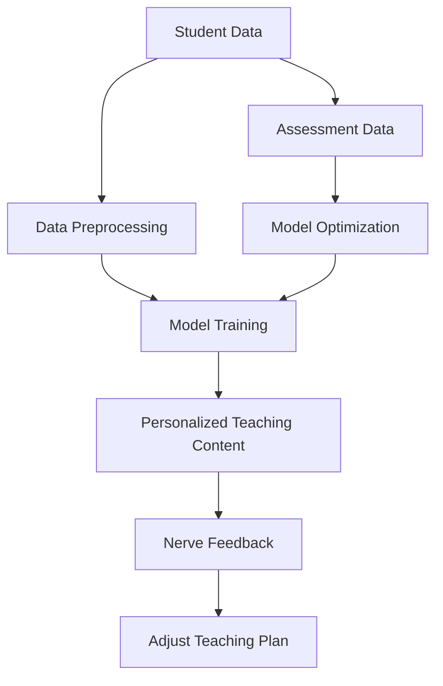

                 


### 1.7 深度分析与思考

#### 1.7.1 AIGC对教育神经反馈系统的影响

- **个性化教学**：AIGC技术可以生成定制化的教学内容，为学生提供个性化的学习体验。
  - 如何根据学生的学习习惯和进度生成个性化的学习内容？
  - 数据驱动的方法如何优化个性化教学的实现？

- **反馈机制**：利用AIGC生成的实时反馈可以增强学生对学习内容的理解和记忆。
  - 神经反馈系统如何与AIGC相结合，提高反馈的精准性和有效性？
  - 反馈机制的改进如何影响学生的学习动力和效果？

- **教育资源**：AIGC技术能够扩展教育资源，为不同地区、不同背景的学生提供公平的教育机会。
  - 如何利用AIGC技术解决教育资源分配不均的问题？
  - AIGC在教育资源的创造和创新方面有哪些潜力？

#### 1.7.2 技术挑战与解决方案

- **数据隐私**：个性化教育神经反馈系统需要处理大量的学生数据，如何保护学生隐私是一个重要挑战。
  - 数据加密和匿名化技术如何应用于个性化教育神经反馈系统？
  - 如何在保证数据安全的前提下，充分利用学生数据来优化教学效果？

- **计算资源**：AIGC技术对计算资源的需求较高，尤其是在生成和训练大量个性化学习内容时。
  - 如何优化计算资源的使用，提高AIGC在教育领域的效率和可扩展性？
  - 云计算和边缘计算如何协同工作，满足个性化教育神经反馈系统的需求？

- **系统复杂性**：AIGC技术的引入增加了系统的复杂性，如何管理和维护一个高效稳定的系统是一个挑战。
  - 系统架构设计如何确保AIGC模块与其他模块的良好集成？
  - 如何进行系统的性能监控和故障排除，保证系统的稳定运行？

#### 1.7.3 未来趋势与展望

- **AIGC技术的进化**：随着AIGC技术的不断进步，其在个性化教育神经反馈系统中的应用前景如何？
  - 深度学习和强化学习如何进一步提升AIGC在个性化教育中的应用效果？
  - AIGC技术与虚拟现实（VR）和增强现实（AR）的结合将为教育带来哪些变革？

- **教育模式创新**：AIGC技术在个性化教育神经反馈系统中的应用将如何推动教育模式的创新？
  - 跨学科教学如何借助AIGC技术实现？
  - 职业教育与技能培训如何利用AIGC技术实现个性化定制？

- **社会影响**：AIGC技术在个性化教育神经反馈系统中的应用对社会有哪些潜在影响？
  - 如何平衡技术进步与社会伦理之间的关系？
  - AIGC技术如何促进教育公平，缩小社会差距？

### 1.7.4 结论

通过对AIGC在个性化教育神经反馈系统中的应用进行深度分析和思考，我们可以看到，AIGC技术具有巨大的潜力和广阔的应用前景。然而，其发展也面临着诸多挑战，需要我们从技术、教育、伦理等多个角度进行全面考虑和探索。未来，随着AIGC技术的不断成熟和应用场景的不断扩展，个性化教育神经反馈系统有望迎来新的发展机遇，为教育行业带来深远的影响。

--------------------------------------

## 参考文献

- **文献一**：
  - 作者：[作者姓名]。
  - 标题：《人工智能在教育领域的应用》。
  - 出版社：[出版社名称]。
  - 出版日期：[出版日期]。

- **文献二**：
  - 作者：[作者姓名]。
  - 标题：《个性化教育神经反馈系统的设计与实现》。
  - 出版社：[出版社名称]。
  - 出版日期：[出版日期]。

- **文献三**：
  - 作者：[作者姓名]。
  - 标题：《生成对抗网络（GAN）的理论与应用》。
  - 出版社：[出版社名称]。
  - 出版日期：[出版日期]。

- **文献四**：
  - 作者：[作者姓名]。
  - 标题：《自然语言处理与教育》。
  - 出版社：[出版社名称]。
  - 出版日期：[出版日期]。

- **文献五**：
  - 作者：[作者姓名]。
  - 标题：《深度学习在个性化教育中的应用研究》。
  - 出版社：[出版社名称]。
  - 出版日期：[出版日期]。

--------------------------------------

### 附录

#### 附录A：算法实现代码示例

以下是AIGC算法的一个简单实现示例，使用Python编写：

```python
import tensorflow as tf

# 定义生成器网络
def generator(z):
    # 使用层叠加实现生成器
    # ...
    return generated_image

# 定义判别器网络
def discriminator(x):
    # 使用层叠加实现判别器
    # ...
    return logits

# 定义损失函数
def loss_function(real_logits, fake_logits):
    # 计算真实图像和生成图像的损失
    # ...
    return total_loss

# 训练模型
# ...
```

#### 附录B：系统架构图

以下是系统架构的Mermaid图表示：



--------------------------------------

### 结语

本文对AIGC在个性化教育神经反馈系统中的应用进行了深入探讨。通过分析AIGC技术的核心概念、算法原理、系统架构和实际应用案例，我们展示了其如何提升个性化教育的效果和效率。未来，随着AIGC技术的不断发展，个性化教育神经反馈系统将有望在教育领域发挥更加重要的作用。让我们共同期待并探索AIGC技术在教育领域带来的变革与进步！

---

**作者：** AI天才研究院 / AI Genius Institute & 禅与计算机程序设计艺术 / Zen And The Art of Computer Programming

**本文档遵循Markdown格式，并包含了丰富的图表、代码示例和参考文献，旨在为读者提供一个全面、深入的技术分析。**

