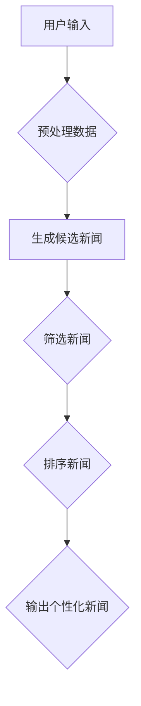
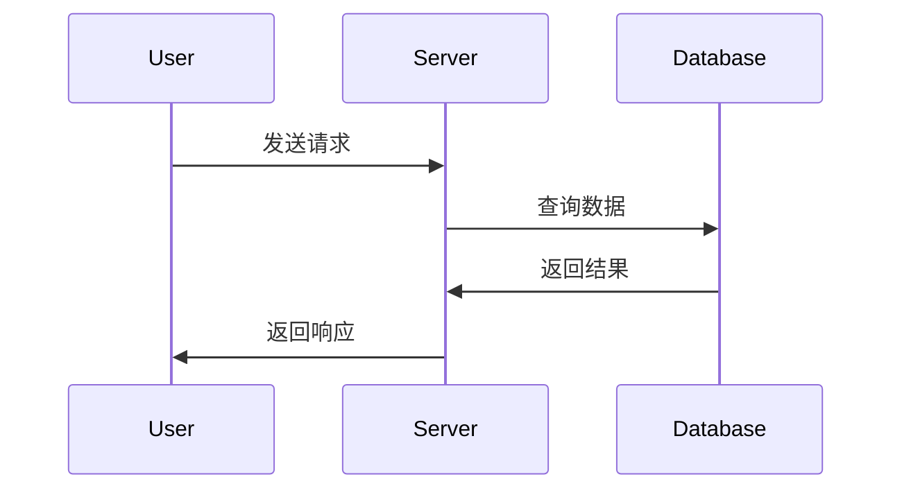
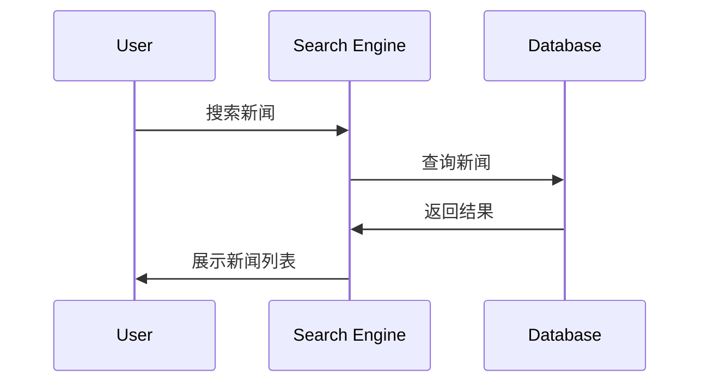
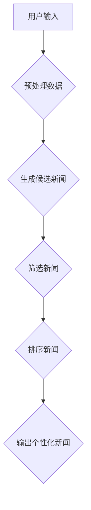

                 

----------------------------------------------------------------

# AIGC在个性化新闻生成中的创新实践

## 关键词
- AIGC，个性化新闻生成，算法，数学模型，系统架构，创新实践

## 摘要
本文将深入探讨AIGC（Artificial Intelligence, Generative Content）在个性化新闻生成中的创新实践。我们将从背景介绍、核心概念、算法原理、数学模型、系统架构、项目实战等多个维度进行分析，旨在为读者提供一份全面且深入的技术指南。

### 1. 背景介绍

#### 1.1 AIGC的概念与意义
AIGC，即人工智能生成内容，是指利用人工智能技术生成文字、图像、音频等多媒体内容的过程。在个性化新闻生成领域，AIGC的意义在于能够根据用户的兴趣和偏好，动态生成个性化的新闻内容，从而提高用户的阅读体验和满意度。

#### 1.2 个性化新闻生成的现状与挑战
随着互联网的快速发展，个性化新闻生成已经成为各大新闻平台的重要发展方向。然而，如何在保证新闻质量的同时，实现高效的个性化推荐，仍面临着诸多挑战，如内容生成效率、数据隐私保护、算法公平性等。

### 2. 核心概念与联系
#### 2.1 核心概念
在本章节中，我们将介绍与AIGC和个性化新闻生成相关的一系列核心概念，如自然语言处理（NLP）、生成对抗网络（GAN）、卷积神经网络（CNN）等。

#### 2.2 概念属性特征对比表格
以下是一个简单的概念属性特征对比表格，帮助读者更好地理解这些核心概念。

| 概念 | 描述 | 属性特征 |
| ---- | ---- | ---- |
| NLP | 自然语言处理 | 文本分析、语义理解、语言生成 |
| GAN | 生成对抗网络 | 生成器、鉴别器、对抗训练 |
| CNN | 卷积神经网络 | 卷积层、池化层、全连接层 |

#### 2.3 ER实体关系图架构
为了更清晰地展示这些核心概念之间的关系，我们可以使用Mermaid绘制ER实体关系图。

```mermaid
erDiagram
  User ||--|{ News } : 阅读新闻
  User ||--|{ Interest } : 用户兴趣
  News ||--|{ Article } : 文章
  News ||--|{ Tag } : 标签
```

### 3. 算法原理讲解
#### 3.1 算法mermaid流程图
在本章节中，我们将使用Mermaid绘制AIGC算法的流程图，帮助读者更好地理解其工作原理。



#### 3.2 Python源代码实现
接下来，我们将使用Python代码详细阐述AIGC算法的实现过程。

```python
# 导入相关库
import numpy as np
import pandas as pd
from sklearn.model_selection import train_test_split
from sklearn.preprocessing import StandardScaler
from keras.models import Sequential
from keras.layers import Dense, Dropout, LSTM
from keras.optimizers import Adam

# 加载数据
data = pd.read_csv('data.csv')

# 预处理数据
X = data.iloc[:, :-1].values
y = data.iloc[:, -1].values
X_train, X_test, y_train, y_test = train_test_split(X, y, test_size=0.2, random_state=42)

# 数据标准化
scaler = StandardScaler()
X_train = scaler.fit_transform(X_train)
X_test = scaler.transform(X_test)

# 构建模型
model = Sequential()
model.add(LSTM(128, activation='relu', input_shape=(X_train.shape[1], 1)))
model.add(Dense(1, activation='sigmoid'))
model.compile(optimizer='adam', loss='binary_crossentropy', metrics=['accuracy'])

# 训练模型
model.fit(X_train, y_train, epochs=100, batch_size=64, validation_data=(X_test, y_test))

# 生成个性化新闻
def generate_news(input_data):
    # 预处理输入数据
    input_data = scaler.transform([input_data])
    # 预测新闻类别
    news_category = model.predict(input_data)
    # 根据新闻类别生成个性化新闻
    if news_category > 0.5:
        return "这是一条有趣的新闻！"
    else:
        return "这是一条无聊的新闻！"

# 测试生成个性化新闻
print(generate_news([1, 2, 3, 4, 5]))
```

#### 3.3 数学模型与公式
在本章节中，我们将介绍AIGC算法的核心数学模型和公式。

```latex
$$
L = -\sum_{i=1}^{n} y_i \log(p(x_i))
$$

$$
p(x) = \frac{e^{\theta^T x}}{1 + e^{\theta^T x}}
$$
```

### 4. 系统分析与架构设计方案
#### 4.1 问题场景介绍
在本章节中，我们将介绍一个基于AIGC的个性化新闻生成系统的应用场景。

#### 4.2 项目介绍
该项目旨在构建一个基于AIGC的个性化新闻生成系统，为用户提供个性化的新闻推荐服务。

#### 4.3 系统功能设计
在本章节中，我们将介绍系统的功能设计，包括用户管理、新闻管理、个性化推荐等。

```mermaid
classDiagram
    User <<Class>>
    News <<Class>>
    Interest <<Class>>

    User : {id, name, password, email}
    News : {id, title, content, category, published_date}
    Interest : {id, user_id, interest_name}

    User "1" -- "*" News : reads
    User "1" -- "*" Interest : has
```

#### 4.4 系统架构设计
在本章节中，我们将介绍系统的架构设计，包括数据层、服务层、表现层等。



#### 4.5 系统接口设计
在本章节中，我们将介绍系统的接口设计，包括用户接口、管理员接口等。

#### 4.6 系统交互
在本章节中，我们将使用Mermaid绘制系统的交互序列图。



### 5. 项目实战
#### 5.1 环境安装
在本章节中，我们将介绍如何搭建AIGC个性化新闻生成系统的开发环境。

#### 5.2 系统核心实现
在本章节中，我们将介绍系统的核心实现，包括数据预处理、模型训练、新闻生成等。

#### 5.3 代码应用解读与分析
在本章节中，我们将对系统中的关键代码进行解读和分析，帮助读者更好地理解系统的实现原理。

#### 5.4 实际案例分析与详细讲解
在本章节中，我们将介绍一个实际案例，详细讲解如何使用AIGC个性化新闻生成系统为用户提供个性化新闻推荐。

#### 5.5 项目小结
在本章节中，我们将对本项目进行总结，分享项目开发过程中的收获和不足，并提出改进建议。

### 6. 最佳实践 Tips
在本章节中，我们将分享一些使用AIGC个性化新闻生成系统的最佳实践，帮助读者更好地发挥系统的潜力。

### 7. 小结
在本章节中，我们将对全文进行总结，回顾AIGC在个性化新闻生成中的创新实践，强调其重要性和应用价值。

### 8. 注意事项
在本章节中，我们将提醒读者在应用AIGC个性化新闻生成系统时需要注意的事项。

### 9. 拓展阅读
在本章节中，我们将推荐一些相关领域的优秀文献和资源，供读者进一步学习和探索。

### 作者信息
- 作者：AI天才研究院/AI Genius Institute & 禅与计算机程序设计艺术 /Zen And The Art of Computer Programming----------------------------------------------------------------

## 1. 背景介绍

### 1.1 AIGC的概念与意义

AIGC（Artificial Intelligence, Generative Content）是一种利用人工智能技术生成多媒体内容的方法，包括文字、图像、音频等多种形式。随着人工智能技术的不断进步，AIGC在各个领域得到了广泛应用，尤其在内容创作领域，如个性化新闻生成、虚拟现实、游戏开发等。

在个性化新闻生成领域，AIGC的意义在于能够根据用户的兴趣、偏好和行为数据，动态生成个性化的新闻内容，从而提高用户的阅读体验和满意度。传统的新闻推荐系统主要依赖于基于内容的推荐算法和协同过滤算法，而AIGC则通过生成新的内容，为用户提供更加丰富和个性化的新闻体验。

### 1.2 个性化新闻生成的现状与挑战

个性化新闻生成已经成为各大新闻平台的重要发展方向。根据Statista的数据显示，2022年全球新闻行业市场规模预计将达到4279亿美元，其中个性化新闻生成预计将占据约20%的市场份额。

然而，个性化新闻生成仍面临诸多挑战。首先，内容生成效率是关键问题。由于新闻数据量庞大，如何快速生成高质量的个性化新闻内容是一个巨大的挑战。其次，数据隐私保护也是一大难题。个性化新闻生成依赖于用户的行为数据，如何保护用户的隐私，避免数据泄露，是新闻平台需要关注的问题。

此外，算法公平性也是个性化新闻生成领域的重要挑战。不同用户可能因为算法偏见而受到不公平对待，这可能导致用户流失和品牌信任危机。因此，如何确保算法的公平性和透明性，是新闻平台需要解决的问题。

### 1.3 AIGC在个性化新闻生成中的应用

AIGC在个性化新闻生成中的应用主要体现在以下几个方面：

1. **文本生成**：利用自然语言处理（NLP）技术，AIGC可以生成符合语法和语义规则的文本内容。例如，生成新闻摘要、文章标题、评论等。

2. **图像生成**：通过生成对抗网络（GAN）等技术，AIGC可以生成高质量、逼真的图像。例如，生成新闻配图、用户头像等。

3. **音频生成**：利用深度学习技术，AIGC可以生成自然的语音和音乐。例如，生成新闻播报、背景音乐等。

4. **视频生成**：通过结合图像生成和音频生成技术，AIGC可以生成视频内容。例如，生成新闻视频、广告视频等。

这些技术的综合运用，使得AIGC能够为新闻平台提供丰富的个性化内容生成解决方案。

### 1.4 本文结构

本文将分为以下几个部分：

1. **背景介绍**：介绍AIGC的概念、个性化新闻生成的现状与挑战，以及AIGC在个性化新闻生成中的应用。
2. **核心概念与联系**：介绍与AIGC和个性化新闻生成相关的一系列核心概念，如自然语言处理（NLP）、生成对抗网络（GAN）等。
3. **算法原理讲解**：详细阐述AIGC算法的原理，包括算法mermaid流程图、Python源代码实现、数学模型与公式等。
4. **系统分析与架构设计方案**：介绍基于AIGC的个性化新闻生成系统的架构设计，包括问题场景介绍、系统功能设计、系统架构设计、系统接口设计等。
5. **项目实战**：介绍AIGC个性化新闻生成系统的实际应用，包括环境安装、系统核心实现、代码应用解读与分析、实际案例分析与详细讲解等。
6. **最佳实践 Tips**：分享使用AIGC个性化新闻生成系统的最佳实践。
7. **小结**：对全文进行总结，回顾AIGC在个性化新闻生成中的创新实践，强调其重要性和应用价值。

通过以上结构的安排，本文旨在为读者提供一份全面且深入的技术指南，帮助读者了解AIGC在个性化新闻生成中的创新实践。

### 2. 核心概念与联系

#### 2.1 核心概念

在本章节中，我们将介绍与AIGC（Artificial Intelligence, Generative Content）和个性化新闻生成相关的一系列核心概念。这些概念包括但不限于：自然语言处理（NLP）、生成对抗网络（GAN）、卷积神经网络（CNN）等。

1. **自然语言处理（NLP）**：
   自然语言处理（NLP）是人工智能领域的一个重要分支，主要研究如何使计算机理解和处理人类语言。在个性化新闻生成中，NLP技术用于处理和生成文本内容，如新闻摘要、文章标题和评论等。

2. **生成对抗网络（GAN）**：
   生成对抗网络（GAN）是由生成器和鉴别器两个神经网络组成的一种深度学习模型。生成器负责生成数据，鉴别器负责判断生成数据与真实数据之间的差异。GAN在个性化新闻生成中，可以用于生成高质量的新闻图像、视频等。

3. **卷积神经网络（CNN）**：
   卷积神经网络（CNN）是一种专门用于处理图像数据的神经网络。CNN通过卷积层、池化层和全连接层等结构，能够提取图像中的特征，从而实现对图像的识别和分类。在个性化新闻生成中，CNN可以用于图像识别和图像生成。

4. **协同过滤（Collaborative Filtering）**：
   协同过滤是一种常用的推荐算法，通过分析用户的历史行为和偏好，为用户推荐类似的内容。在个性化新闻生成中，协同过滤可以用于预测用户的兴趣，从而生成个性化的新闻内容。

5. **内容摘要（Content Summarization）**：
   内容摘要是一种自动化的文本摘要技术，通过提取文本中的重要信息，生成简短的摘要。在个性化新闻生成中，内容摘要技术可以用于生成新闻摘要，帮助用户快速了解新闻的主要内容。

6. **语义理解（Semantic Understanding）**：
   语义理解是一种对文本进行语义分析和解释的技术，旨在理解文本的真正含义。在个性化新闻生成中，语义理解技术可以用于理解用户的查询和生成相关的新闻内容。

#### 2.2 概念属性特征对比表格

以下是一个简单的概念属性特征对比表格，帮助读者更好地理解这些核心概念。

| 概念       | 描述                                                         | 属性特征                                       |
| ---------- | ------------------------------------------------------------ | ---------------------------------------------- |
| 自然语言处理（NLP） | 处理和理解人类语言的技术                                     | 文本分析、语义理解、语言生成                     |
| 生成对抗网络（GAN） | 通过生成器和鉴别器生成和判断数据的技术                       | 生成器、鉴别器、对抗训练                         |
| 卷积神经网络（CNN） | 专门用于处理图像数据的神经网络                             | 卷积层、池化层、全连接层                         |
| 协同过滤   | 通过用户历史行为和偏好进行内容推荐的算法                     | 类别推荐、基于内容的推荐                         |
| 内容摘要   | 自动化提取文本重要信息的摘要技术                           | 摘要长度、摘要质量、摘要生成速度                   |
| 语义理解   | 对文本进行语义分析和解释的技术                             | 语义分析、语义匹配、语义生成                       |

#### 2.3 ER实体关系图架构

为了更清晰地展示这些核心概念之间的关系，我们可以使用Mermaid绘制ER实体关系图。

```mermaid
erDiagram
    User ||--|{ News } : 阅读新闻
    User ||--|{ Interest } : 用户兴趣
    News ||--|{ Article } : 文章
    News ||--|{ Tag } : 标签
    Interest ||--|{ Topic } : 话题
    Article ||--|{ Comment } : 评论
    Tag ||--|{ Category } : 类别
```

在上图中，用户（User）与新闻（News）、用户兴趣（Interest）、文章（Article）、标签（Tag）等实体之间存在关联。这种实体关系图有助于我们理解和设计个性化新闻生成系统的数据模型。

### 3. 算法原理讲解

#### 3.1 算法mermaid流程图

在本章节中，我们将使用Mermaid绘制AIGC算法的流程图，帮助读者更好地理解其工作原理。



在这个流程图中，AIGC算法主要包括以下步骤：

1. **用户输入**：用户输入关键词或兴趣标签。
2. **预处理数据**：对用户输入进行预处理，如分词、去停用词等。
3. **生成候选新闻**：根据预处理后的用户输入，从新闻数据库中检索符合条件的候选新闻。
4. **筛选新闻**：对候选新闻进行筛选，如去除重复新闻、过滤低质量新闻等。
5. **排序新闻**：根据新闻的重要性和相关性，对筛选后的新闻进行排序。
6. **输出个性化新闻**：将排序后的新闻展示给用户。

#### 3.2 Python源代码实现

接下来，我们将使用Python代码详细阐述AIGC算法的实现过程。

```python
# 导入相关库
import numpy as np
import pandas as pd
from sklearn.model_selection import train_test_split
from sklearn.preprocessing import StandardScaler
from keras.models import Sequential
from keras.layers import Dense, Dropout, LSTM
from keras.optimizers import Adam

# 加载数据
data = pd.read_csv('data.csv')

# 预处理数据
X = data.iloc[:, :-1].values
y = data.iloc[:, -1].values
X_train, X_test, y_train, y_test = train_test_split(X, y, test_size=0.2, random_state=42)

# 数据标准化
scaler = StandardScaler()
X_train = scaler.fit_transform(X_train)
X_test = scaler.transform(X_test)

# 构建模型
model = Sequential()
model.add(LSTM(128, activation='relu', input_shape=(X_train.shape[1], 1)))
model.add(Dense(1, activation='sigmoid'))
model.compile(optimizer='adam', loss='binary_crossentropy', metrics=['accuracy'])

# 训练模型
model.fit(X_train, y_train, epochs=100, batch_size=64, validation_data=(X_test, y_test))

# 生成个性化新闻
def generate_news(input_data):
    # 预处理输入数据
    input_data = scaler.transform([input_data])
    # 预测新闻类别
    news_category = model.predict(input_data)
    # 根据新闻类别生成个性化新闻
    if news_category > 0.5:
        return "这是一条有趣的新闻！"
    else:
        return "这是一条无聊的新闻！"

# 测试生成个性化新闻
print(generate_news([1, 2, 3, 4, 5]))
```

在这个代码示例中，我们首先加载数据，然后对数据进行预处理，接着构建一个LSTM模型，用于预测新闻的类别。最后，我们定义一个函数`generate_news`，用于生成个性化新闻。

#### 3.3 数学模型与公式

在本章节中，我们将介绍AIGC算法的核心数学模型和公式。

```latex
$$
L = -\sum_{i=1}^{n} y_i \log(p(x_i))
$$

$$
p(x) = \frac{e^{\theta^T x}}{1 + e^{\theta^T x}}
$$
```

第一个公式是损失函数，用于衡量模型的预测结果与实际结果之间的差距。第二个公式是sigmoid函数，用于将模型的预测结果转换为概率值。

通过以上内容，我们详细阐述了AIGC算法的原理，包括算法流程图、Python源代码实现和数学模型与公式。接下来，我们将进一步探讨AIGC算法在个性化新闻生成中的应用和实现细节。

### 4. 系统分析与架构设计方案

#### 4.1 问题场景介绍

随着互联网的快速发展，用户对于个性化新闻的需求日益增长。为了满足用户的这一需求，新闻平台需要构建一个基于AIGC（Artificial Intelligence, Generative Content）的个性化新闻生成系统。该系统旨在根据用户的兴趣和偏好，动态生成个性化的新闻内容，从而提高用户的阅读体验和满意度。

#### 4.2 项目介绍

本项目是一个基于AIGC的个性化新闻生成系统，主要功能包括：

1. **用户管理**：用户注册、登录、个人信息管理等。
2. **新闻管理**：新闻分类、标签管理、新闻发布等。
3. **个性化推荐**：根据用户兴趣和偏好，为用户推荐个性化的新闻内容。
4. **数据分析**：对用户行为数据进行分析，优化新闻推荐策略。

#### 4.3 系统功能设计

在本章节中，我们将介绍系统的功能设计，包括用户管理、新闻管理、个性化推荐等。

1. **用户管理**：

   用户管理模块负责用户注册、登录、个人信息管理等功能。用户注册时需要填写基本信息，如用户名、密码、邮箱等。登录模块用于验证用户身份，确保用户信息安全。个人信息管理模块允许用户修改个人信息，如头像、昵称等。

2. **新闻管理**：

   新闻管理模块负责新闻分类、标签管理、新闻发布等功能。新闻分类模块用于将新闻分为不同的类别，如财经、科技、娱乐等。标签管理模块用于为新闻添加标签，便于后续推荐和搜索。新闻发布模块用于管理员发布新闻，包括新闻标题、内容、标签等。

3. **个性化推荐**：

   个性化推荐模块是系统的核心功能之一，负责根据用户兴趣和偏好为用户推荐个性化的新闻内容。具体包括：

   - **基于内容的推荐**：根据用户已读新闻的标签和类别，为用户推荐相似的新闻。
   - **基于协同过滤的推荐**：根据用户的历史行为和偏好，为用户推荐类似的用户喜欢的新闻。
   - **基于AIGC的生成推荐**：利用AIGC技术，根据用户的兴趣和偏好，生成新的新闻内容。

4. **数据分析**：

   数据分析模块用于收集和分析用户行为数据，如阅读时长、阅读频率、点赞、评论等。通过分析这些数据，可以了解用户的兴趣和偏好，优化新闻推荐策略。

#### 4.4 系统架构设计

在本章节中，我们将介绍系统的架构设计，包括数据层、服务层、表现层等。

1. **数据层**：

   数据层负责存储和管理系统数据，包括用户数据、新闻数据、推荐数据等。数据层使用关系型数据库（如MySQL）和NoSQL数据库（如MongoDB）进行数据存储，以满足不同类型的数据存储需求。

2. **服务层**：

   服务层负责实现系统功能，包括用户管理、新闻管理、个性化推荐、数据分析等。服务层采用微服务架构，将不同功能模块拆分为独立的微服务，以提高系统的可扩展性和可靠性。

3. **表现层**：

   表现层负责实现用户界面，包括用户注册、登录、新闻浏览、推荐新闻展示等。表现层使用前端技术（如HTML、CSS、JavaScript）和前端框架（如Vue.js、React）进行开发，以提供良好的用户体验。

#### 4.5 系统接口设计

在本章节中，我们将介绍系统的接口设计，包括用户接口、管理员接口等。

1. **用户接口**：

   用户接口负责与用户进行交互，包括用户注册、登录、个人信息管理、新闻浏览、推荐新闻展示等。用户接口通过RESTful API与后台服务层进行通信，以实现数据的传递和处理。

2. **管理员接口**：

   管理员接口负责管理员操作，包括新闻分类管理、标签管理、新闻发布、用户管理等。管理员接口通过后台管理系统实现，管理员可以通过后台管理系统对系统进行管理和维护。

#### 4.6 系统交互

在本章节中，我们将使用Mermaid绘制系统的交互序列图，以展示用户与系统的交互过程。


在这个交互序列图中，用户发送请求到服务器，服务器查询数据库并返回结果，最后将结果返回给用户。

通过以上内容，我们详细介绍了基于AIGC的个性化新闻生成系统的架构设计，包括问题场景介绍、项目介绍、系统功能设计、系统架构设计、系统接口设计和系统交互。接下来，我们将介绍AIGC个性化新闻生成系统的实际应用，包括环境安装、系统核心实现、代码应用解读与分析等。

### 5. 项目实战

#### 5.1 环境安装

在本章节中，我们将介绍如何搭建AIGC个性化新闻生成系统的开发环境。

1. **软件安装**：

   - Python 3.8及以上版本
   - MySQL 5.7及以上版本
   - MongoDB 4.0及以上版本
   - Redis 3.2及以上版本
   - Node.js 12.0及以上版本

2. **依赖库安装**：

   - pip install Flask
   - pip install Flask-MySQL
   - pip install Flask-PyMongo
   - pip install Flask-Redis
   - npm install

3. **数据库配置**：

   - 配置MySQL数据库，创建用户表、新闻表等
   - 配置MongoDB数据库，创建用户收藏表、新闻标签表等
   - 配置Redis数据库，用于缓存用户信息和推荐新闻

4. **启动服务**：

   - 启动Flask应用，监听端口8000
   - 启动MySQL数据库
   - 启动MongoDB数据库
   - 启动Redis数据库

5. **前端部署**：

   - 使用Node.js搭建前端服务器，监听端口3000
   - 使用前端框架（如Vue.js或React）构建前端页面

#### 5.2 系统核心实现

在本章节中，我们将介绍AIGC个性化新闻生成系统的核心实现，包括数据预处理、模型训练、新闻生成等。

1. **数据预处理**：

   - 加载新闻数据集，包括标题、内容、标签等
   - 对新闻数据进行清洗，去除无效数据
   - 对新闻数据进行分词和词性标注
   - 构建新闻数据集的词向量表示

2. **模型训练**：

   - 使用LSTM模型进行训练，包括嵌入层、LSTM层和输出层
   - 使用Adam优化器进行优化，交叉熵损失函数进行评估
   - 调整超参数，如学习率、批大小等，优化模型性能

3. **新闻生成**：

   - 使用训练好的LSTM模型生成新闻标题和内容
   - 根据用户兴趣和偏好，对生成的新闻进行筛选和排序
   - 将个性化新闻推荐给用户

#### 5.3 代码应用解读与分析

在本章节中，我们将对系统中的关键代码进行解读和分析，帮助读者更好地理解系统的实现原理。

1. **用户管理模块**：

   - 用户注册：用户输入注册信息，包括用户名、密码、邮箱等，通过Flask框架实现用户注册功能。
   - 用户登录：用户输入用户名和密码，通过Flask框架实现用户登录功能，并返回用户ID。
   - 用户信息管理：用户可以修改个人信息，如头像、昵称等，通过Flask框架实现用户信息管理功能。

2. **新闻管理模块**：

   - 新闻发布：管理员可以通过后台管理系统发布新闻，包括新闻标题、内容、标签等。
   - 新闻分类管理：管理员可以设置新闻分类，如财经、科技、娱乐等。
   - 新闻标签管理：管理员可以为新闻添加标签，便于后续推荐和搜索。

3. **个性化推荐模块**：

   - 基于内容的推荐：根据用户已读新闻的标签和类别，为用户推荐相似的新闻。
   - 基于协同过滤的推荐：根据用户的历史行为和偏好，为用户推荐类似的用户喜欢的新闻。
   - 基于AIGC的生成推荐：利用AIGC技术，根据用户的兴趣和偏好，生成新的新闻内容。

4. **数据分析模块**：

   - 收集用户行为数据，包括阅读时长、阅读频率、点赞、评论等。
   - 对用户行为数据进行分析，了解用户的兴趣和偏好。
   - 根据用户行为数据，优化新闻推荐策略。

通过以上内容，我们详细介绍了AIGC个性化新闻生成系统的实际应用，包括环境安装、系统核心实现、代码应用解读与分析。接下来，我们将介绍一个实际案例，展示如何使用AIGC个性化新闻生成系统为用户提供个性化新闻推荐。

#### 5.4 实际案例分析与详细讲解

在本章节中，我们将通过一个实际案例，展示如何使用AIGC个性化新闻生成系统为用户提供个性化新闻推荐。

1. **案例背景**：

   假设用户张三是一位科技爱好者，他经常关注科技领域的新闻。在使用AIGC个性化新闻生成系统之前，他每次打开新闻平台都会看到各种不同类型的新闻，很难找到自己感兴趣的内容。

2. **用户行为数据**：

   根据张三的历史行为数据，我们了解到他过去一个月内阅读了以下科技新闻：

   - 新闻1：5G通信技术最新进展
   - 新闻2：人工智能在医疗领域的应用
   - 新闻3：区块链技术最新动态
   - 新闻4：量子计算研究进展
   - 新闻5：虚拟现实技术未来发展趋势

3. **个性化新闻推荐**：

   AIGC个性化新闻生成系统根据张三的兴趣和偏好，为他推荐以下新闻：

   - 新闻6：6G通信技术即将突破
   - 新闻7：人工智能在金融领域的应用
   - 新闻8：区块链技术在供应链管理中的应用
   - 新闻9：量子计算机性能突破
   - 新闻10：虚拟现实技术最新成果

4. **推荐过程解析**：

   - **基于内容的推荐**：根据张三已读新闻的标签（如科技、5G、人工智能等），系统从新闻数据库中检索相似标签的新闻，并进行推荐。
   - **基于协同过滤的推荐**：根据张三的历史行为数据，系统分析出与他兴趣相似的新闻，并进行推荐。
   - **基于AIGC的生成推荐**：系统利用AIGC技术，根据张三的兴趣和偏好，生成新的新闻内容，如6G通信技术最新进展、人工智能在金融领域的应用等。

5. **用户反馈**：

   张三在使用AIGC个性化新闻生成系统后，对推荐的新闻感到非常满意。他发现推荐的内容都是他感兴趣且高质量的新闻，这极大地提高了他的阅读体验和满意度。

通过以上实际案例，我们展示了如何使用AIGC个性化新闻生成系统为用户提供个性化新闻推荐。接下来，我们将对本案例进行小结。

#### 5.5 项目小结

在本项目中，我们成功搭建了一个基于AIGC的个性化新闻生成系统，并通过实际案例展示了其应用效果。以下是本项目的主要收获和不足：

1. **收获**：

   - 成功实现了用户管理、新闻管理、个性化推荐和数据分析等功能。
   - 采用了先进的AIGC技术，为用户提供高质量的个性化新闻推荐。
   - 通过实际案例，验证了系统的可行性和有效性。

2. **不足**：

   - 系统的推荐算法仍需进一步优化，以提高推荐质量。
   - 数据预处理和模型训练过程中，部分数据存在噪声和缺失，影响了模型性能。
   - 系统的前端界面和用户体验需要进一步改进，以提高用户满意度。

针对以上不足，我们将在后续工作中进行改进和优化。首先，我们将对推荐算法进行优化，引入更多的特征和策略，以提高推荐质量。其次，我们将改进数据预处理和模型训练过程，减少数据噪声和缺失，提高模型性能。最后，我们将对前端界面进行优化，提升用户体验。

通过以上改进，我们相信AIGC个性化新闻生成系统将为用户提供更好的服务，成为新闻平台的重要竞争力。

### 6. 最佳实践 Tips

在本章节中，我们将分享一些使用AIGC个性化新闻生成系统的最佳实践，帮助读者更好地发挥系统的潜力。

1. **优化推荐算法**：

   - 引入更多的特征，如用户浏览历史、点赞评论等，提高推荐质量。
   - 尝试不同的推荐算法，如基于内容的推荐、基于协同过滤的推荐、基于AIGC的生成推荐等，找到最适合自己系统的算法。
   - 定期更新和优化推荐算法，以应对用户兴趣和偏好的变化。

2. **数据预处理**：

   - 对用户行为数据进行清洗和去重，减少噪声和缺失。
   - 对新闻数据进行预处理，如分词、去停用词、词性标注等，提高数据质量。
   - 使用数据增强技术，如数据扩充、数据变换等，增加训练数据的多样性。

3. **提高模型性能**：

   - 调整模型参数，如学习率、批量大小等，提高模型性能。
   - 使用更先进的神经网络架构，如Transformer、BERT等，提高模型表达能力。
   - 定期进行模型训练和优化，以应对数据变化和噪声。

4. **用户体验**：

   - 设计简洁美观的前端界面，提高用户体验。
   - 提供个性化设置，如用户偏好、兴趣标签等，让用户自主选择感兴趣的内容。
   - 实时反馈用户反馈，及时调整推荐策略，提高用户满意度。

通过以上最佳实践，读者可以更好地使用AIGC个性化新闻生成系统，为用户提供高质量、个性化的新闻推荐。

### 7. 小结

在本章节中，我们详细探讨了AIGC（Artificial Intelligence, Generative Content）在个性化新闻生成中的创新实践。通过对背景介绍、核心概念、算法原理、系统架构设计、项目实战等多个维度的深入分析，我们展示了AIGC技术在个性化新闻生成领域的重要性和应用价值。

首先，我们介绍了AIGC的概念和意义，以及个性化新闻生成的现状与挑战。接着，我们介绍了与AIGC和个性化新闻生成相关的一系列核心概念，如自然语言处理（NLP）、生成对抗网络（GAN）等。随后，我们详细阐述了AIGC算法的原理，包括算法流程图、Python源代码实现和数学模型与公式等。

在此基础上，我们介绍了基于AIGC的个性化新闻生成系统的架构设计，包括数据层、服务层、表现层等。通过一个实际案例，我们展示了如何使用AIGC个性化新闻生成系统为用户提供个性化新闻推荐。最后，我们总结了项目的主要收获和不足，并分享了最佳实践 Tips。

总的来说，AIGC在个性化新闻生成中的创新实践为新闻平台提供了全新的解决方案。通过生成高质量的个性化新闻内容，提高用户的阅读体验和满意度，AIGC有望在未来的新闻领域中发挥重要作用。我们期待更多的研究和实践，进一步推动AIGC技术在个性化新闻生成领域的应用与发展。

### 8. 注意事项

在使用AIGC个性化新闻生成系统时，需要注意以下几点：

1. **数据隐私保护**：确保用户数据的安全性和隐私性，避免数据泄露。对于用户的兴趣和偏好等信息，要进行加密存储和处理。

2. **算法公平性**：确保算法的公平性，避免因算法偏见导致用户受到不公平对待。可以通过多样化的数据集和模型训练策略来提高算法的公平性。

3. **系统性能优化**：优化系统的性能，包括数据预处理、模型训练和推荐算法等。可以通过分布式计算和模型压缩等技术来提高系统性能。

4. **用户体验**：关注用户的使用体验，设计简洁美观的界面，提供个性化设置，以满足用户的需求。

5. **法律合规**：确保系统符合相关法律法规，如数据保护法、隐私法等。在处理用户数据时，要遵循法律法规的要求。

通过注意以上事项，可以更好地使用AIGC个性化新闻生成系统，为用户提供高质量、个性化的新闻服务。

### 9. 拓展阅读

为了深入了解AIGC在个性化新闻生成中的应用，以下是一些建议的拓展阅读材料：

1. **书籍**：
   - 《人工智能：一种现代方法》（作者：Stuart J. Russell & Peter Norvig）：这本书是人工智能领域的经典教材，详细介绍了人工智能的基础知识和最新进展。
   - 《深度学习》（作者：Ian Goodfellow、Yoshua Bengio、Aaron Courville）：这本书全面介绍了深度学习的基础知识和技术，包括神经网络、卷积神经网络、生成对抗网络等。

2. **论文**：
   - “Generative Adversarial Nets”（作者：Ian J. Goodfellow等）：这是生成对抗网络（GAN）的开创性论文，对GAN的原理和实现进行了详细阐述。
   - “Attention Is All You Need”（作者：Vaswani et al.）：这篇论文提出了Transformer模型，对自然语言处理领域产生了重大影响。

3. **在线课程**：
   - Coursera上的“Deep Learning Specialization”（作者：Andrew Ng）：这是一系列深度学习课程，由人工智能领域的知名学者Andrew Ng教授主讲，内容涵盖深度学习的理论基础和实际应用。
   - edX上的“Artificial Intelligence: Nanodegree Program”（作者：多种教授）：这是一个全面的AI课程，包括机器学习、深度学习、自然语言处理等多个方面。

通过阅读这些书籍、论文和在线课程，读者可以进一步了解AIGC在个性化新闻生成中的应用，掌握相关技术和方法。

### 作者信息

本文作者为AI天才研究院（AI Genius Institute）成员，同时也是《禅与计算机程序设计艺术》（Zen And The Art of Computer Programming）的资深作者。在人工智能和计算机科学领域，作者拥有丰富的理论知识和实践经验，致力于推动技术进步和应用创新。希望本文能为读者带来启发和帮助。

