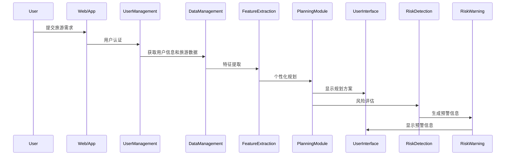
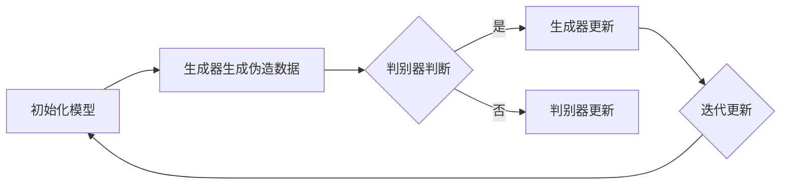

                 

## 第1章: 问题背景与核心概念

### 1.1 问题背景

随着科技的发展和人们对个性化需求的追求，旅游业也在不断地升级变革。传统的旅游规划方式往往依赖于经验和固定的模式，难以满足游客对多样化和个性化的需求。旅游市场面临着以下几个关键挑战：

1. **信息过载**：游客在规划旅游行程时，需要处理大量来自不同渠道的信息，如酒店预订、景点介绍、交通安排等。如何从这些信息中筛选出最符合个人兴趣和需求的方案，成为一大难题。

2. **个性化不足**：传统旅游规划往往缺乏个性化服务，难以根据游客的偏好和需求提供定制化的旅游体验。个性化旅游规划需要能够充分了解并满足游客的个性化需求。

3. **资源浪费**：在传统的旅游规划中，游客可能因为缺乏信息或者规划不合理而导致资源浪费，如错过某些景点或者选择不合适的交通方式。

4. **风险管理**：旅游过程中，游客可能面临各种风险，如自然灾害、社会事件等。如何提前识别和评估这些风险，以避免或减少损失，也是旅游规划中的重要问题。

为了解决上述问题，个性化旅游规划成为旅游业发展的重要方向。然而，传统的方法往往无法满足上述需求，这就需要新的技术手段来提供支持。

### 1.1.1 个性化旅游规划的现状与挑战

当前的个性化旅游规划主要依赖于大数据分析和机器学习技术。这些技术可以从大量用户数据中挖掘出游客的兴趣和行为模式，从而为他们提供个性化的旅游建议。然而，这一领域仍面临着以下挑战：

1. **数据隐私**：个性化旅游规划需要收集和分析大量用户数据，如何保护用户的隐私成为关键问题。

2. **数据质量**：个性化旅游规划依赖于高质量的数据，但现有的旅游数据质量参差不齐，需要大量的数据清洗和预处理工作。

3. **算法复杂性**：个性化旅游规划需要复杂的算法来处理大量的数据，并从中提取有用的信息。这些算法的复杂度较高，实现起来困难。

4. **用户体验**：个性化旅游规划需要提供良好的用户体验，但如何设计出既个性又能吸引游客的旅游建议，是一个挑战。

### 1.1.2 AIGC 技术的发展与应用

AIGC（AI-Generated Content）是一种新兴的计算机科学技术，它结合了人工智能、生成模型和自然语言处理等技术，能够自动生成高质量的内容。AIGC 技术在个性化旅游规划中有着广泛的应用前景：

1. **内容生成**：AIGC 技术可以自动生成旅游攻略、景点介绍、交通指南等个性化内容，满足游客的信息需求。

2. **个性化推荐**：AIGC 技术可以根据游客的偏好和行为，自动生成个性化的旅游推荐，提升游客的旅游体验。

3. **虚拟导游**：AIGC 技术可以生成虚拟导游，通过自然语言交互为游客提供实时的旅游咨询服务。

4. **风险评估**：AIGC 技术可以分析旅游数据，预测可能的风险，并为游客提供相应的建议。

AIGC 技术的潜在优势在于其能够处理大量的旅游数据，生成高质量的内容，同时降低人工成本，提高效率和准确性。这使得AIGC 在个性化旅游规划中具有巨大的应用潜力。

### 1.1.3 AIGC 在旅游规划中的潜在优势

AIGC 技术在旅游规划中的潜在优势主要体现在以下几个方面：

1. **个性化服务**：AIGC 技术能够根据游客的个性化需求，自动生成定制化的旅游规划方案，提升游客的满意度。

2. **实时更新**：AIGC 技术可以实时分析旅游数据，为游客提供最新的旅游信息和建议，确保旅游规划的准确性。

3. **降低成本**：AIGC 技术能够自动化许多传统旅游规划中的手动工作，降低人力成本，提高效率。

4. **数据驱动**：AIGC 技术基于数据分析，能够从大量数据中挖掘出游客的兴趣和行为模式，为旅游规划提供数据支持。

5. **用户体验**：AIGC 技术可以提供更加丰富和个性化的用户体验，提升游客的参与感和满意度。

综上所述，AIGC 技术在个性化旅游规划中具有巨大的应用潜力。接下来，我们将深入探讨 AIGC 技术的核心概念、原理及其在旅游规划中的应用。

### 1.2 核心概念与联系

为了更好地理解 AIGC 技术在个性化旅游规划中的应用，我们需要先掌握 AIGC 的核心概念、原理以及与传统旅游规划方法的联系。

#### 1.2.1 AIGC 的定义与组成

AIGC（AI-Generated Content）是一种利用人工智能技术自动生成内容的方法。它通常包括以下几个组成部分：

1. **生成模型**：如生成对抗网络（GAN）、变分自编码器（VAE）等，用于生成新的内容。

2. **数据源**：包括旅游数据、用户数据、地理位置数据等，用于训练和优化生成模型。

3. **自然语言处理**：用于处理和生成自然语言文本，如旅游攻略、景点介绍、推荐信息等。

4. **用户交互**：通过与用户的互动，收集反馈，不断优化生成的内容。

#### 1.2.2 AIGC 技术的基本原理

AIGC 技术的基本原理主要基于深度学习和生成模型。以下是一些关键原理：

1. **生成对抗网络（GAN）**：GAN 由生成器和判别器组成。生成器生成假内容，判别器判断内容是真实还是生成的。通过不断训练，生成器逐渐生成越来越真实的内容。

2. **变分自编码器（VAE）**：VAE 使用概率模型来生成内容，通过编码和解码过程实现内容的生成。

3. **注意力机制**：用于关注重要信息，提高生成内容的准确性和相关性。

4. **循环神经网络（RNN）**：用于处理和生成序列数据，如文本、语音等。

#### 1.2.3 AIGC 与传统旅游规划方法的对比

传统旅游规划方法主要依赖于人类专家的知识和经验，而 AIGC 技术则基于数据和算法。以下是两者之间的对比：

1. **数据依赖**：AIGC 技术依赖于大量数据，通过机器学习算法进行训练，而传统方法则主要依赖于专家的知识库。

2. **生成能力**：AIGC 技术能够自动生成个性化旅游内容，如攻略、推荐等，而传统方法则主要依赖于手工编写。

3. **效率**：AIGC 技术可以大规模、快速地生成内容，而传统方法则需要更多的时间和人力。

4. **用户体验**：AIGC 技术能够提供更加个性化的用户体验，而传统方法则较为单一。

#### 1.2.4 概念属性特征对比表

为了更清晰地展示 AIGC 与传统旅游规划方法的不同，我们可以通过一个概念属性特征对比表来进行说明：

| 特征           | AIGC                   | 传统旅游规划                 |
|----------------|------------------------|------------------------------|
| 数据依赖       | 高度依赖数据           | 依赖专家知识库               |
| 内容生成       | 自动生成个性化内容     | 手工编写，个性化有限         |
| 效率           | 高效，快速生成内容     | 低效，耗时较长               |
| 用户体验       | 个性化，用户体验好     | 单一，用户体验一般           |
| 算法复杂性     | 较高，算法复杂         | 较低，算法简单               |

通过上述对比，我们可以看出 AIGC 技术在个性化旅游规划中具有明显的优势。

#### 1.2.5 AIGC 的边界与外延

虽然 AIGC 技术在个性化旅游规划中具有巨大潜力，但它的应用也有一定的边界和限制。以下是 AIGC 技术的应用领域、适用场景以及面临的挑战：

1. **应用领域**：
   - 旅游规划与推荐
   - 虚拟导游与互动
   - 风险评估与预警
   - 个性化内容生成

2. **适用场景**：
   - 游客个性化需求高
   - 旅游数据丰富
   - 需要实时更新信息
   - 需要高效处理大量数据

3. **挑战**：
   - 数据隐私保护
   - 数据质量和完整性
   - 算法复杂性和成本
   - 用户接受度和信任度

通过了解 AIGC 技术的边界与外延，我们可以更好地把握其在个性化旅游规划中的应用范围和潜力。

### 1.3 AIGC 的概念属性特征对比表格

为了更直观地比较 AIGC 技术与传统旅游规划方法的不同，我们可以通过一个概念属性特征对比表格来进行详细展示：

| 概念属性         | AIGC                        | 传统旅游规划                        |
|----------------|-----------------------------|-------------------------------------|
| 数据依赖性       | 高度依赖大数据和机器学习算法 | 较少依赖数据，更多依赖专家经验       |
| 生成能力         | 能够自动生成个性化内容       | 需要人工编写和设计                 |
| 效率           | 高效率处理大量数据         | 效率较低，处理速度慢               |
| 个性化程度       | 能够提供高度个性化服务       | 个性化程度较低，难以满足个体需求   |
| 可扩展性         | 易于扩展和更新             | 难以扩展和更新，依赖人工调整       |
| 面临挑战         | 数据隐私、算法复杂度、用户接受度 | 数据质量、专家经验积累、技术更新 |

### 1.4 AIGC 技术的应用领域

AIGC 技术作为一种前沿的人工智能技术，其应用领域非常广泛。在个性化旅游规划中，AIGC 技术的主要应用领域包括以下几方面：

1. **旅游路线规划**：AIGC 技术可以通过分析游客的兴趣、历史行为和地理位置数据，自动生成个性化的旅游路线。这种路线规划不仅考虑了景点之间的距离和交通，还能根据游客的偏好推荐最合适的行程。

2. **旅游推荐系统**：AIGC 技术可以根据游客的个性化需求，自动推荐景点、餐厅、酒店等旅游资源。这些推荐系统利用机器学习和自然语言处理技术，能够提供高度个性化的服务。

3. **虚拟导游**：AIGC 技术可以生成虚拟导游，通过自然语言交互为游客提供实时的旅游咨询服务。这种虚拟导游能够回答游客的问题，提供路线指引和景点介绍，提升游客的旅游体验。

4. **旅游风险评估**：AIGC 技术可以通过分析旅游数据，预测可能的风险，如自然灾害、社会事件等，并为游客提供相应的建议。这种风险评估有助于游客做出更明智的旅游决策，确保旅游安全。

### 1.4.2 AIGC 在旅游规划中的适用场景

AIGC 技术在旅游规划中的适用场景非常广泛，以下是一些典型的适用场景：

1. **定制化旅游服务**：对于有强烈个性化需求的游客，AIGC 技术可以提供定制化的旅游服务。通过分析游客的偏好和行为，AIGC 技术能够设计出完全符合个人需求的旅游行程。

2. **实时旅游信息更新**：旅游信息如天气、交通、酒店预订等往往变化迅速。AIGC 技术可以通过实时数据分析和预测，为游客提供最新的旅游信息，确保旅游规划的准确性和及时性。

3. **多语言支持**：AIGC 技术可以生成多语言的内容，满足不同语言背景的游客需求。这种多语言支持不仅提升了用户体验，也扩大了旅游服务的受众范围。

4. **风险管理**：AIGC 技术可以通过大数据分析和风险预测模型，为游客提供旅游风险预警。这种服务有助于游客提前了解潜在的风险，并做出相应的应对措施。

### 1.4.3 AIGC 技术的挑战与未来发展

尽管 AIGC 技术在个性化旅游规划中具有巨大潜力，但其在实际应用中仍面临一些挑战：

1. **数据隐私**：个性化旅游规划需要收集和分析大量的用户数据，如何保护用户的隐私是一个重要挑战。数据隐私的保护需要严格的法律法规和技术手段。

2. **数据质量**：AIGC 技术的效果高度依赖于数据的质量。在旅游数据中，存在大量的噪声和缺失值，需要有效的数据清洗和预处理方法。

3. **算法复杂性**：AIGC 技术涉及复杂的算法和模型，如何优化算法、降低计算成本，是一个需要持续研究和解决的问题。

4. **用户接受度**：尽管 AIGC 技术能够提供高度个性化的服务，但用户对于这种技术接受度如何，还需要进一步验证和推广。

未来的发展方向可能包括：

1. **数据隐私保护技术**：随着数据隐私保护法律法规的不断完善，开发更有效、更安全的隐私保护技术将成为重要方向。

2. **数据质量提升**：通过引入更多的数据源和更先进的数据处理方法，提升旅游数据的质量，以提高 AIGC 技术的应用效果。

3. **算法优化与简化**：通过算法优化和简化，降低计算成本，使 AIGC 技术更加高效和易于部署。

4. **用户研究**：通过用户研究，了解用户的偏好和行为，改进 AIGC 技术的设计，提升用户体验。

### 1.5 本章小结

本章主要介绍了个性化旅游规划的问题背景、核心概念以及 AIGC 技术在其中的应用。通过分析 AIGC 技术的定义、原理和与传统旅游规划方法的对比，我们了解了 AIGC 技术在旅游规划中的潜在优势和应用领域。同时，我们也讨论了 AIGC 技术在应用过程中面临的挑战和未来的发展方向。下一章我们将深入探讨 AIGC 技术在旅游规划中的应用原理和具体实现方法。

## 第2章: AIGC 技术在旅游规划中的应用原理

### 2.1 数据收集与处理

AIGC 技术在旅游规划中的应用首先需要大量的数据支持。这些数据包括游客的个人信息、旅游行为记录、地理位置数据、天气信息、交通信息等。以下是 AIGC 技术在数据收集与处理方面的几个关键步骤：

#### 2.1.1 旅游数据来源

旅游数据的来源可以包括以下几个方面：

1. **在线旅游平台**：如携程、去哪儿、Booking 等，这些平台记录了大量的游客预订信息、评价信息等。

2. **社交媒体**：如微博、微信、Instagram 等，游客在这些平台上分享的旅游经历、照片、评论等都是宝贵的数据资源。

3. **政府部门**：如旅游景点、交通部门等，这些机构提供了丰富的旅游数据，如游客数量、景点流量、交通状况等。

4. **传感器数据**：如GPS、WiFi 信号、气象传感器等，这些数据可以实时反映游客的位置和天气状况。

#### 2.1.2 数据处理方法

在收集到大量旅游数据后，需要对这些数据进行处理，以提高数据质量，为后续的 AIGC 应用奠定基础。数据处理方法主要包括以下几方面：

1. **数据清洗**：去除重复数据、填补缺失值、纠正错误数据等。这一步是确保数据质量的基础。

2. **数据归一化**：将不同数据源的数据进行统一处理，如将日期格式统一为 YYYY-MM-DD，将地理位置信息统一为坐标系等。

3. **数据转换**：将原始数据转换为适合机器学习算法处理的形式，如将文本数据转换为词向量，将图像数据转换为像素矩阵等。

4. **特征提取**：从原始数据中提取出有用的特征，如游客的兴趣偏好、旅游习惯、景点类型等。这些特征将用于训练 AIGC 模型。

#### 2.1.3 数据质量评估

数据质量评估是确保 AIGC 应用效果的关键步骤。以下是几个常用的数据质量评估指标：

1. **准确性**：数据中正确值的比例。例如，在用户行为预测中，预测正确的用户行为占总用户行为的比例。

2. **完整性**：数据中缺失值的比例。例如，在用户评价数据中，缺失的评价条目占总评价条目的比例。

3. **一致性**：数据中不同来源的数据是否一致。例如，不同平台记录的同一景点信息是否一致。

4. **可靠性**：数据是否可靠，如数据来源是否权威、数据是否经过验证等。

通过数据质量评估，我们可以及时发现和纠正数据中的问题，确保 AIGC 模型的训练效果。

### 2.2 个性化旅游规划模型

个性化旅游规划模型是 AIGC 技术在旅游规划中的应用核心。该模型基于大量游客数据，通过机器学习算法生成个性化的旅游规划方案。以下是构建个性化旅游规划模型的关键步骤：

#### 2.2.1 模型构建

个性化旅游规划模型的构建主要包括以下几个步骤：

1. **数据预处理**：根据第2.1节的数据处理方法，对原始旅游数据进行分析和处理，提取出有用的特征。

2. **特征选择**：从处理后的数据中选取对模型训练效果有显著影响的特征。常用的特征选择方法包括信息增益、卡方检验等。

3. **模型选择**：根据旅游规划问题的特点，选择适合的机器学习模型。常见的模型包括决策树、随机森林、支持向量机、神经网络等。

4. **模型训练**：使用处理后的数据和选择的模型进行训练。模型训练的目的是使模型能够准确预测游客的个性化需求。

5. **模型评估**：使用交叉验证等方法评估模型的性能，如准确率、召回率、F1 值等。通过调整模型参数和特征选择，优化模型性能。

#### 2.2.2 模型优化

构建初始模型后，通常需要通过以下方法进行优化：

1. **参数调优**：通过网格搜索、贝叶斯优化等方法，调整模型的参数，以提升模型性能。

2. **特征工程**：通过添加新的特征、转换现有特征等，提高模型的预测能力。

3. **模型集成**：将多个模型进行集成，如随机森林、梯度提升树等，以提升模型的泛化能力和预测性能。

4. **模型压缩**：通过模型压缩技术，如权重共享、稀疏化等，减小模型大小，提高模型部署的效率。

#### 2.2.3 模型评估

个性化旅游规划模型的评估主要包括以下指标：

1. **预测准确率**：模型预测结果与实际结果的一致性。准确率越高，说明模型预测效果越好。

2. **召回率**：模型预测结果中包含的实际结果的比率。召回率越高，说明模型能够更全面地覆盖用户需求。

3. **F1 值**：准确率和召回率的加权平均，用于综合评估模型性能。

4. **用户体验**：用户对个性化旅游规划方案的评价，如满意度、参与度等。

通过以上评估指标，可以全面了解个性化旅游规划模型的效果，并指导后续的模型优化和改进。

### 2.3 AIGC 技术在旅游规划中的应用

AIGC 技术在旅游规划中的应用包括以下几个方面：

#### 2.3.1 旅游路线规划

旅游路线规划是 AIGC 技术在旅游规划中最重要的应用之一。通过分析游客的个性化需求和旅游数据，AIGC 技术可以生成最优的旅游路线。具体步骤如下：

1. **需求分析**：根据游客的偏好、历史行为和当前需求，分析出其旅游路线的偏好，如喜欢自然景观、历史文化等。

2. **数据整合**：整合游客的个人信息、历史旅游数据、景点信息、交通信息等，构建旅游数据集。

3. **路线生成**：利用机器学习算法和优化算法，根据游客的需求和旅游数据，生成最优的旅游路线。

4. **路线优化**：通过实时数据更新和用户反馈，不断优化旅游路线，确保其始终符合游客的需求。

#### 2.3.2 旅游推荐系统

旅游推荐系统是 AIGC 技术在旅游规划中的另一个重要应用。通过分析游客的行为数据和旅游数据，AIGC 技术可以为游客推荐最合适的旅游资源。具体步骤如下：

1. **用户画像**：根据游客的历史行为数据，构建用户画像，包括其兴趣偏好、旅游习惯等。

2. **推荐算法**：使用协同过滤、基于内容的推荐、混合推荐等方法，为游客推荐符合其兴趣的旅游资源。

3. **推荐优化**：通过用户反馈和行为数据，不断优化推荐算法，提升推荐效果。

4. **实时推荐**：根据用户的实时行为和需求，动态更新推荐结果，提供个性化的推荐服务。

#### 2.3.3 旅游风险评估

旅游风险评估是确保游客安全的重要环节。AIGC 技术可以通过分析旅游数据，预测潜在的风险，并提供相应的风险预警。具体步骤如下：

1. **风险识别**：通过分析历史旅游数据、天气信息、社会事件等，识别出可能影响游客安全的因素。

2. **风险评估**：使用机器学习算法，对识别出的风险因素进行评估，预测其可能的影响程度。

3. **风险预警**：根据风险评估结果，为游客提供风险预警，建议其采取相应的预防措施。

4. **实时监控**：通过实时数据监控，动态更新风险评估结果，提供及时的风险预警。

通过以上三个方面的应用，AIGC 技术可以显著提升旅游规划的个性化和智能化水平，为游客提供更优质的旅游体验。

### 2.3.1 旅游路线规划

旅游路线规划是 AIGC 技术在旅游规划中的一项核心应用，旨在为游客提供个性化的旅游路线，以满足他们的不同需求。以下是旅游路线规划的具体实现过程：

#### 1. 用户需求分析

在规划旅游路线之前，首先需要对用户的需求进行分析。这包括用户的兴趣偏好、旅游目的、时间安排、预算限制等因素。用户需求分析可以通过以下步骤进行：

1. **用户调查**：通过问卷调查、用户访谈等方式，收集游客的偏好信息，如喜欢的旅游类型（自然景观、历史文化、美食探险等）、旅行时间（季节、时间段）、预算等。

2. **数据分析**：利用大数据分析技术，对用户的历史旅游数据进行挖掘，如用户过去的旅游记录、评价、社交网络活动等，以了解其旅游习惯和偏好。

3. **个性化建模**：结合用户调查数据和数据分析结果，构建用户个性化模型，为后续的路线规划提供依据。

#### 2. 数据整合

为了生成个性化的旅游路线，需要整合多种类型的数据，包括：

1. **景点信息**：从旅游数据库中获取景点的详细信息，如名称、位置、开放时间、门票价格等。

2. **交通数据**：包括交通路线、交通工具（如公交、地铁、出租车等）的运行时间、费用等。

3. **天气信息**：通过天气预报API获取旅游目的地的实时天气数据，包括温度、降雨概率等。

4. **用户历史数据**：如用户的旅游记录、偏好、评价等。

#### 3. 路线生成

基于用户需求和整合的数据，使用 AIGC 技术生成个性化的旅游路线。以下是一些常见的路线生成方法：

1. **优化算法**：使用遗传算法、蚁群算法等优化算法，根据用户需求和景点之间的距离、交通时间等因素，生成最优的旅游路线。

2. **多目标规划**：考虑多个目标，如最小化旅行时间、最大化景点质量等，使用多目标规划算法生成综合最优路线。

3. **机器学习模型**：使用机器学习模型，如决策树、随机森林、神经网络等，根据用户历史数据和当前需求，预测出最适合用户的旅游路线。

#### 4. 路线优化

生成的初步路线可能并不完全符合用户的需求，需要通过以下步骤进行优化：

1. **用户反馈**：在路线生成后，向用户展示初步路线，收集他们的反馈，如对某些景点的兴趣程度、对路线时间的满意度等。

2. **动态调整**：根据用户反馈，对路线进行动态调整，如替换用户不感兴趣的景点、调整路线顺序等。

3. **实时更新**：根据实时数据（如天气、交通状况等），对路线进行实时更新，确保路线的可行性和最优性。

#### 5. 路线推荐

最终生成的个性化旅游路线需要以易于理解的形式推荐给用户。可以使用以下方法进行推荐：

1. **可视化**：将路线以地图、图表等形式展示给用户，便于他们理解。

2. **推荐理由**：为每个景点提供推荐理由，如景点的独特性、历史价值、美食推荐等，增加用户的兴趣和参与度。

3. **多方案比较**：提供多个不同的路线方案，让用户根据自己的偏好进行选择。

通过上述步骤，AIGC 技术可以生成高质量的个性化旅游路线，为游客提供更加丰富和个性化的旅游体验。

### 2.3.2 旅游推荐系统

旅游推荐系统是 AIGC 技术在旅游规划中的另一个重要应用，旨在为游客提供个性化的旅游推荐，提高游客的满意度和参与度。以下是旅游推荐系统的实现步骤：

#### 1. 用户画像构建

构建用户画像是实现个性化推荐的基础。用户画像包括用户的基本信息、旅游偏好、行为习惯等。以下是构建用户画像的步骤：

1. **基本信息采集**：通过用户注册、问卷调查等方式，收集用户的基本信息，如年龄、性别、职业等。

2. **旅游偏好分析**：通过用户的历史旅游记录、评论、社交网络活动等，分析用户的旅游偏好，如喜欢的历史文化景点、自然景观、美食探险等。

3. **行为习惯分析**：通过用户在旅游平台上的浏览记录、搜索关键词、预订行为等，分析用户的行为习惯，如旅行时间、旅行方式、预算等。

4. **个性化建模**：结合用户的基本信息、旅游偏好和行为习惯，构建用户个性化模型，为后续的推荐算法提供输入。

#### 2. 推荐算法选择

推荐算法的选择决定了推荐系统的效果和效率。以下是几种常见的推荐算法：

1. **协同过滤算法**：基于用户的兴趣和行为，找到与目标用户相似的用户，推荐这些用户喜欢的资源。常见的协同过滤算法包括用户基于的协同过滤（User-Based）和项基于的协同过滤（Item-Based）。

2. **基于内容的推荐算法**：通过分析资源的特征和用户的历史行为，为用户推荐具有相似特征的资源。常见的基于内容的推荐算法包括余弦相似度、TF-IDF 等。

3. **混合推荐算法**：结合协同过滤和基于内容的推荐算法，以提高推荐效果和覆盖面。常见的混合推荐算法包括矩阵分解、模型集成等。

4. **深度学习推荐算法**：利用深度学习技术，如卷积神经网络（CNN）、循环神经网络（RNN）等，对用户和资源进行建模，实现更精准的推荐。

#### 2.3. 推荐结果生成

基于用户画像和推荐算法，生成个性化的推荐结果。以下是生成推荐结果的步骤：

1. **候选集生成**：根据用户的旅游偏好和行为，从所有可推荐的资源中筛选出可能的候选资源。

2. **相似度计算**：计算用户与候选资源之间的相似度，如协同过滤算法中的用户-物品相似度、基于内容的推荐算法中的特征相似度等。

3. **排序和筛选**：根据相似度对候选资源进行排序，选取排名靠前的资源作为推荐结果。

4. **结果展示**：将推荐结果以可视化形式展示给用户，如推荐景点列表、推荐路线图等。

#### 2.4. 推荐效果评估

评估推荐系统的效果对于优化和改进推荐算法至关重要。以下是几种常见的评估指标：

1. **准确率**：推荐结果中实际用户喜欢资源的比例。

2. **召回率**：实际用户喜欢资源的推荐结果中包含的比例。

3. **覆盖率**：推荐结果中不同资源的覆盖率，以避免资源重复推荐。

4. **用户体验**：用户对推荐结果的满意度和参与度。

通过以上评估指标，可以全面了解推荐系统的效果，并指导后续的算法优化和系统改进。

### 2.3.3 旅游风险评估

旅游风险评估是确保游客在旅游过程中安全、愉快的重要环节。AIGC 技术可以通过分析大量的旅游数据，预测可能的风险，并提供相应的预警措施。以下是旅游风险评估的实现步骤：

#### 1. 风险因素识别

首先，需要识别可能影响旅游安全的各种风险因素。这些因素可能包括：

1. **自然灾害**：如地震、洪水、台风等。
2. **社会事件**：如恐怖袭击、示威抗议、传染病爆发等。
3. **交通状况**：如交通事故、交通拥堵、航班延误等。
4. **景点人流**：如景点拥挤、排队时间长等。

这些风险因素可以通过以下方式进行识别：

1. **历史数据挖掘**：通过分析历史旅游数据，识别出经常发生的风险事件，如某些景点在特定季节容易发生拥堵。
2. **实时监控**：通过传感器和网络监控，实时获取与旅游相关的风险信息，如气象数据、社交媒体上的事件报道等。
3. **专家知识**：结合旅游专家的丰富经验和知识，识别出潜在的风险因素。

#### 2. 风险评估模型构建

基于识别出的风险因素，构建风险评估模型。以下是构建风险评估模型的步骤：

1. **数据收集与处理**：收集与旅游相关的各类数据，如自然灾害预警、社会事件报道、交通数据、景点人流数据等。对这些数据进行处理，包括数据清洗、归一化、特征提取等。
2. **模型选择**：根据旅游风险评估的特点，选择合适的机器学习模型。常见的模型包括决策树、随机森林、支持向量机、神经网络等。
3. **模型训练**：使用处理后的数据，对选择的模型进行训练，使其能够预测旅游过程中可能出现的风险。
4. **模型评估**：通过交叉验证等方法，评估模型在预测风险方面的性能，如准确率、召回率等。根据评估结果，调整模型参数和特征选择，以优化模型性能。

#### 3. 风险预警机制

构建基于 AIGC 技术的旅游风险预警机制，包括以下几个方面：

1. **实时风险监测**：通过实时数据流分析，监测旅游过程中的各种风险因素。当检测到风险事件时，立即触发预警机制。
2. **预警信息发布**：根据风险评估结果，生成预警信息，如风险事件的类型、影响范围、应对措施等，通过短信、APP推送等方式通知游客和旅游从业人员。
3. **应急响应方案**：制定应急预案，包括风险事件的处理流程、人员疏散、资源调配等，以确保在风险事件发生时能够迅速有效地应对。
4. **动态调整**：根据实时数据和风险评估结果，动态调整预警机制和应急预案，以适应不断变化的风险形势。

通过上述步骤，AIGC 技术可以有效预测和预警旅游过程中的风险，为游客提供更加安全、愉快的旅游体验。

### 第3章: 实际案例与案例分析

在本章中，我们将通过几个实际案例，深入探讨 AIGC 技术在个性化旅游规划中的应用，并进行详细的分析与讲解。

#### 3.1 案例一：某旅游目的地的个性化规划

##### 3.1.1 项目介绍

某旅游目的地个性化规划项目旨在为游客提供定制化的旅游规划服务。项目目标是通过 AIGC 技术分析游客的个性化需求，自动生成最优的旅游路线和推荐景点，提升游客的旅游体验。

##### 3.1.2 系统设计与实现

1. **需求分析**：项目团队首先对目标用户进行问卷调查，收集用户的旅游偏好、兴趣和需求。例如，某些用户可能对历史文化景点感兴趣，而另一些用户可能更偏好自然景观。

2. **数据收集与处理**：通过整合在线旅游平台、社交媒体和政府部门的数据，收集与旅游目的地相关的各类信息，如景点介绍、交通路线、酒店信息等。

3. **个性化规划模型**：项目团队使用机器学习算法，构建了个性化规划模型。模型包括用户兴趣分析模块、路线规划模块和推荐系统模块。用户兴趣分析模块负责分析用户的旅游偏好，路线规划模块根据用户需求生成最优的旅游路线，推荐系统模块为用户提供景点推荐。

4. **系统实现**：系统采用模块化设计，每个模块独立开发，并通过接口进行集成。用户通过Web界面提交旅游需求，系统在后台自动生成个性化旅游路线和景点推荐。

##### 3.1.3 案例分析

1. **效果评估**：通过实际用户测试，个性化规划系统获得了高度评价。用户反馈显示，系统提供的旅游路线和景点推荐符合其个人需求和兴趣，大大提升了旅游体验。

2. **改进空间**：虽然系统效果良好，但仍然存在一些改进空间。例如，在数据质量方面，如何进一步提高数据完整性和准确性，以优化个性化规划模型的性能。此外，系统用户界面和交互设计也需要进一步优化，以提高用户体验。

#### 3.2 案例二：智能旅游推荐系统开发

##### 3.2.1 项目背景

随着旅游市场的不断壮大，游客对个性化旅游推荐的需求日益增长。为了满足这一需求，某旅游公司决定开发一款智能旅游推荐系统。

##### 3.2.2 系统设计与实现

1. **用户画像构建**：系统首先通过用户注册信息和行为数据，构建用户画像。画像包括用户的旅游偏好、旅游习惯、消费能力等。

2. **推荐算法选择**：项目团队选择了基于内容的推荐算法和协同过滤算法，结合用户的个性化需求和行为数据，为游客推荐符合其兴趣的旅游景点和活动。

3. **推荐结果生成**：系统根据用户画像和推荐算法，生成个性化的旅游推荐结果。推荐结果以列表和地图形式展示，用户可以根据自己的兴趣进行选择。

4. **系统实现**：系统采用分布式架构，包括数据存储、数据处理和推荐服务模块。用户通过Web界面提交旅游需求，系统在后台自动生成推荐结果。

##### 3.2.3 案例分析

1. **效果评估**：智能旅游推荐系统上线后，用户满意度显著提升。用户反馈显示，系统推荐的旅游景点和活动符合其个人需求和兴趣，提高了旅游的乐趣和满意度。

2. **改进空间**：虽然系统效果良好，但存在一些改进空间。例如，如何进一步提高推荐算法的准确性和覆盖面，以提供更加个性化的推荐服务。此外，系统在数据隐私保护方面也需要进一步加强。

#### 3.3 案例三：旅游风险评估与管理

##### 3.3.1 项目目标

某旅游公司希望通过 AIGC 技术对旅游过程中的各种风险进行预测和评估，以提高旅游安全水平，保障游客和旅游从业人员的生命财产安全。

##### 3.3.2 系统架构设计

1. **数据采集与处理模块**：负责采集与旅游相关的各类数据，如自然灾害预警、社会事件报道、交通状况、景点人流等。这些数据经过清洗、预处理后，用于训练和优化风险评估模型。

2. **风险评估模型模块**：使用机器学习算法，构建风险评估模型。模型包括风险识别、风险评估和风险预测三个子模块。

3. **风险预警与应急响应模块**：根据风险评估结果，实时生成风险预警信息，并通过短信、APP推送等方式通知相关人员。同时，系统提供应急预案，以应对各种突发风险事件。

4. **用户界面模块**：为用户提供风险信息查询、风险评估报告生成等功能，帮助游客和旅游从业人员了解旅游过程中的潜在风险。

##### 3.3.3 案例分析

1. **效果评估**：系统上线后，有效降低了旅游过程中发生风险的概率。游客和旅游从业人员对风险预警和应急响应功能给予了高度评价，认为系统为旅游安全提供了有力保障。

2. **改进空间**：虽然系统在风险预测和预警方面表现良好，但仍然存在一些改进空间。例如，如何进一步提高模型的预测准确性，如何优化应急预案的响应流程等。

### 本章小结

通过本章的案例分析，我们可以看到 AIGC 技术在个性化旅游规划、智能旅游推荐和旅游风险评估等方面具有广泛的应用前景。实际案例的应用效果表明，AIGC 技术能够显著提升旅游服务的个性化程度和安全性，为游客提供更好的旅游体验。然而，AIGC 技术在实际应用中仍面临一些挑战，如数据质量、算法优化和用户体验等，需要进一步研究和改进。

### 第4章: 系统架构设计与实现

#### 4.1 系统功能设计

为了实现 AIGC 技术在个性化旅游规划中的目标，我们需要设计一套完整的系统功能。系统功能设计主要包括以下几个方面：

1. **用户需求分析**：通过用户注册、问卷调查等方式，收集用户的基本信息和旅游偏好，为后续的个性化规划提供依据。

2. **数据收集与处理**：整合来自各种渠道的旅游数据，包括在线旅游平台、社交媒体、政府部门等，对数据进行清洗、预处理和特征提取。

3. **个性化规划**：根据用户需求和旅游数据，使用机器学习算法生成个性化的旅游规划方案，包括旅游路线、景点推荐和风险评估等。

4. **用户交互**：通过Web界面和APP，为用户提供实时信息查询、规划方案展示和互动反馈等功能。

5. **风险预警与应急响应**：根据旅游风险评估结果，实时生成风险预警信息，并通过短信、APP推送等方式通知相关人员，同时提供应急预案。

#### 4.1.1 领域模型设计

领域模型设计是系统功能设计的重要组成部分。以下是一个简化的领域模型，用于描述个性化旅游规划系统的关键实体和关系：

```mermaid
classDiagram
    User <<实体>>
    Destination <<实体>>
    TravelRoute <<实体>>
    Recommendation <<实体>>
    Risk <<实体>>

    User --> TravelRoute
    User --> Recommendation
    User --> Risk
    Destination --> TravelRoute
    Destination --> Recommendation
    TravelRoute --> Risk
```

在这个领域模型中，主要实体包括用户（User）、目的地（Destination）、旅游路线（TravelRoute）、推荐（Recommendation）和风险（Risk）。这些实体之间的关系描述了系统的主要功能。

#### 4.1.2 功能模块划分

基于领域模型设计，我们可以将系统划分为以下几个功能模块：

1. **用户管理模块**：负责用户注册、登录、信息管理等功能。

2. **数据管理模块**：负责数据的收集、存储、预处理和特征提取。

3. **个性化规划模块**：包括旅游路线规划、景点推荐和风险评估等子模块。

4. **用户交互模块**：提供Web界面和APP，为用户提供信息查询、规划方案展示和互动反馈等功能。

5. **风险预警模块**：根据风险评估结果，生成风险预警信息，并提供应急预案。

#### 4.2 系统架构设计

系统架构设计是确保系统能够高效、稳定、安全运行的关键。以下是一个简化的系统架构，用于描述个性化旅游规划系统的整体结构：



在这个系统架构中，用户通过Web界面或APP提交旅游需求，系统经过用户认证、数据预处理、特征提取和个性化规划，最终生成旅游规划方案和风险预警信息，并通过用户界面展示给用户。

#### 4.2.1 总体架构设计

个性化旅游规划系统的总体架构设计包括以下几个层次：

1. **数据层**：负责数据的存储、管理和备份。常用的数据存储技术包括关系型数据库（如MySQL）和非关系型数据库（如MongoDB）。

2. **服务层**：提供各种业务服务，如用户管理、数据管理、个性化规划、风险预警等。服务层通常使用微服务架构，以提高系统的灵活性和可扩展性。

3. **表现层**：为用户提供Web界面和APP，负责展示规划方案、风险预警等信息。表现层通常使用前端技术（如HTML、CSS、JavaScript）和移动应用开发框架（如React Native、Flutter）。

4. **中间件层**：提供消息队列、缓存、负载均衡等中间件服务，以提高系统的性能和稳定性。

#### 4.2.2 模块间关系与协作

个性化旅游规划系统的各个模块之间有着紧密的关联和协作关系。以下是模块间的基本协作流程：

1. **用户提交需求**：用户通过Web界面或APP提交旅游需求。

2. **用户认证**：系统对用户进行身份认证，确保请求的有效性。

3. **数据处理**：系统根据用户需求，从数据层获取用户信息和旅游数据，进行预处理和特征提取。

4. **规划生成**：个性化规划模块根据预处理后的数据，生成旅游规划方案。

5. **风险评估**：系统对规划方案进行风险评估，识别潜在风险。

6. **预警生成**：风险预警模块根据风险评估结果，生成预警信息。

7. **结果展示**：系统将规划方案和预警信息通过用户界面展示给用户。

通过上述协作流程，个性化旅游规划系统实现了从用户需求到规划方案和预警信息的完整闭环，为用户提供高质量的旅游服务。

### 第5章: 数据分析与算法实现

#### 5.1 数据预处理

数据预处理是 AIGC 技术在个性化旅游规划中至关重要的一步。有效的数据预处理可以显著提升后续机器学习算法的性能和准确性。以下是数据预处理的主要步骤：

##### 5.1.1 数据清洗

数据清洗是数据预处理的核心步骤，目的是去除数据中的噪声和错误，确保数据的质量和一致性。以下是数据清洗的几个关键步骤：

1. **去除重复数据**：检查数据集中是否存在重复的记录，如同一用户多次提交相同的旅游需求。重复数据会导致算法模型过拟合，降低模型的泛化能力。

2. **填补缺失值**：对于缺失值较多的数据，可以使用均值、中位数、众数等统计方法进行填补。对于缺失值较少的数据，可以选择删除缺失值，但需要确保删除的数据不会影响整体数据的分布。

3. **纠正错误数据**：检查数据中的错误，如日期格式不正确、地理位置坐标错误等。对于可纠正的错误，可以手动修改；对于不可纠正的错误，可以选择删除或标记。

4. **数据格式转换**：确保数据格式的一致性，如将不同数据源的数据格式统一为统一的日期格式（YYYY-MM-DD）、地理位置坐标系（如WGS84）等。

##### 5.1.2 数据特征提取

数据特征提取是从原始数据中提取出对算法模型有用的特征。有效的特征提取可以提高模型的学习能力，减少数据维度，提高计算效率。以下是数据特征提取的几个关键步骤：

1. **文本数据特征提取**：对于文本数据（如用户评论、景点介绍等），可以使用词袋模型（Bag of Words）、TF-IDF（Term Frequency-Inverse Document Frequency）等方法进行特征提取。

2. **数值数据特征提取**：对于数值数据（如用户年龄、旅游预算等），可以通过标准化（Normalization）、归一化（Standardization）等方法进行特征提取。

3. **时间序列数据特征提取**：对于时间序列数据（如用户旅游历史、景点开放时间等），可以使用滑动窗口（Sliding Window）等方法提取时间序列特征。

4. **图像数据特征提取**：对于图像数据（如景点照片、用户头像等），可以使用卷积神经网络（Convolutional Neural Network, CNN）等方法提取图像特征。

##### 5.1.3 数据质量评估

数据质量评估是确保数据满足算法模型训练需求的重要步骤。以下是数据质量评估的几个关键指标：

1. **准确性**：数据中正确值的比例。例如，在用户行为预测中，预测正确的用户行为占总用户行为的比例。

2. **完整性**：数据中缺失值的比例。例如，在用户评价数据中，缺失的评价条目占总评价条目的比例。

3. **一致性**：数据中不同来源的数据是否一致。例如，不同平台记录的同一景点信息是否一致。

4. **可靠性**：数据是否可靠，如数据来源是否权威、数据是否经过验证等。

通过数据质量评估，可以及时发现和纠正数据中的问题，确保数据质量满足算法模型训练的需求。

#### 5.2 算法设计与实现

AIGC 技术在个性化旅游规划中的应用主要依赖于生成对抗网络（GAN）、变分自编码器（VAE）等生成模型。以下是一个简化的算法设计与实现流程：

##### 5.2.1 算法原理与流程图

生成对抗网络（GAN）是一种由生成器和判别器组成的模型。生成器的任务是生成类似于真实数据的伪造数据，而判别器的任务是区分真实数据和伪造数据。通过两个网络之间的博弈，生成器的生成数据质量不断提高，最终能够生成高质量的数据。

以下是 GAN 的基本流程：

1. **初始化生成器和判别器**：生成器和判别器分别初始化为随机的神经网络模型。

2. **生成器生成伪造数据**：生成器根据随机噪声生成伪造数据。

3. **判别器判断数据真实性**：判别器同时接收真实数据和伪造数据，并输出对数据真实性的判断概率。

4. **反向传播**：根据判别器的输出，通过反向传播算法更新生成器和判别器的权重。

5. **循环迭代**：重复执行步骤 2 到步骤 4，直到生成器生成的伪造数据能够以较高的概率被判别器判断为真实数据。

以下是一个简化的 GAN 算法流程图：



##### 5.2.2 Python 源代码实现

以下是一个基于 GAN 的简化 Python 源代码实现，用于生成旅游路线规划方案。

```python
import tensorflow as tf
from tensorflow.keras.layers import Dense, Flatten, Reshape
from tensorflow.keras.models import Sequential
from tensorflow.keras.optimizers import Adam

# 初始化生成器和判别器
def build_generator():
    model = Sequential([
        Dense(128, activation='relu', input_shape=(100,)),
        Dense(256, activation='relu'),
        Dense(512, activation='relu'),
        Flatten(),
        Reshape((28, 28))
    ])
    model.compile(loss='binary_crossentropy', optimizer=Adam())
    return model

def build_discriminator():
    model = Sequential([
        Flatten(input_shape=(28, 28)),
        Dense(512, activation='relu'),
        Dense(256, activation='relu'),
        Dense(128, activation='relu'),
        Dense(1, activation='sigmoid')
    ])
    model.compile(loss='binary_crossentropy', optimizer=Adam())
    return model

# 训练模型
def train_model(generator, discriminator, epochs=10000, batch_size=128):
    for epoch in range(epochs):
        for _ in range(batch_size):
            noise = np.random.normal(0, 1, (100,))
            generated_images = generator.predict(noise)
            real_images = load_real_images()
            combined_images = np.concatenate([real_images, generated_images])

            labels = np.concatenate([
                np.ones((batch_size // 2, 1)),
                np.zeros((batch_size // 2, 1))
            ])

            discriminator.train_on_batch(combined_images, labels)

            noise = np.random.normal(0, 1, (batch_size, 100,))
            y = np.array([[1]] * batch_size // 2 + [[0]] * batch_size // 2)
            generator.train_on_batch(noise, y)

# 主函数
if __name__ == '__main__':
    generator = build_generator()
    discriminator = build_discriminator()

    train_model(generator, discriminator)
```

在这个代码中，我们首先定义了生成器和判别器的构建函数，然后定义了训练模型的主函数。训练过程中，生成器和判别器交替更新，直到生成器生成的伪造数据能够以较高的概率被判别器判断为真实数据。

##### 5.2.3 数学模型与公式

生成对抗网络（GAN）的数学模型主要包括生成器（G）和判别器（D）两部分。以下是 GAN 的基本数学模型和公式：

生成器（G）的目标是最小化生成伪造数据的损失，即：
$$
\min_G \mathbb{E}_{x \sim p_{data}(x)}[-\log D(G(x))]
$$

判别器（D）的目标是最大化对真实数据和伪造数据的区分能力，即：
$$
\max_D \mathbb{E}_{x \sim p_{data}(x)}[-\log D(x)] + \mathbb{E}_{z \sim p_{z}(z)}[-\log (1 - D(G(z)))]
$$

其中，$x$ 表示真实数据，$z$ 表示随机噪声，$G(z)$ 表示生成器生成的伪造数据，$D(x)$ 和 $D(G(z))$ 分别表示判别器对真实数据和伪造数据的判断概率。

通过交替优化生成器和判别器的权重，GAN 能够生成高质量的数据。

##### 5.2.4 算法原理讲解

生成对抗网络（GAN）是一种无监督学习的深度学习框架，其核心思想是通过一个生成器和一个小损失函数的判别器进行对抗训练，从而实现生成高质量的数据。

**生成器（G）**：生成器的任务是生成伪造数据，使其尽可能接近真实数据。生成器通常是一个神经网络，它接受一个随机噪声向量 $z$ 作为输入，并通过神经网络变换生成伪造数据 $x' = G(z)$。

**判别器（D）**：判别器的任务是区分输入数据是真实数据还是伪造数据。判别器也是一个神经网络，它接受真实数据 $x$ 或伪造数据 $x'$ 作为输入，并输出一个概率值 $D(x)$ 或 $D(x')$，表示输入数据的真实性。

在训练过程中，生成器和判别器交替更新权重。生成器的目标是最大化判别器判断伪造数据的概率，即最大化 $D(G(x'))$；而判别器的目标是最大化区分真实数据和伪造数据的概率，即最大化 $\log D(x') + \log (1 - D(G(x')))$。

训练过程可以看作是一个博弈过程，生成器和判别器相互对抗，生成器的目标是“欺骗”判别器，使其无法区分伪造数据和真实数据，而判别器的目标是“识破”生成器的伪造数据。通过反复迭代，生成器逐渐提高生成伪造数据的质量，使其接近真实数据。

GAN 的优点在于其能够生成高质量、多样化的数据，适用于图像生成、文本生成、语音合成等领域。然而，GAN 也存在一些挑战，如训练不稳定、生成数据质量难以控制等问题。

**举例说明**：

假设有一个旅游规划系统，它需要为用户提供个性化的旅游路线。系统首先从用户那里收集旅游偏好（如喜欢自然景观、历史文化、美食探险等）和旅游预算等信息。然后，系统使用 GAN 生成一个个性化的旅游路线，包括一系列景点、交通方式、住宿选择等。

生成器（G）接受用户偏好和随机噪声作为输入，生成一个符合用户需求的伪造旅游路线。判别器（D）接受真实旅游路线和伪造旅游路线，并输出一个概率值，表示输入路线的真实性。

在训练过程中，生成器通过不断调整生成路线的权重，使其越来越接近真实路线，而判别器通过不断优化权重，使其能够更准确地判断输入路线的真实性。最终，生成器生成的伪造旅游路线能够以较高的概率被判别器判断为真实路线，从而为用户提供高质量的个性化旅游规划服务。

通过上述讲解，我们可以看出 GAN 在个性化旅游规划中的应用潜力。然而，在实际应用中，仍需要不断优化算法和模型，以提高生成数据的质量和系统的稳定性。

### 第6章：项目实战与实现

#### 6.1 环境安装与配置

在开始个性化旅游规划项目的实战之前，我们需要配置一个合适的环境，以便顺利开展项目开发。以下是一个简化的步骤指南，用于配置 Python 开发环境和相关依赖：

##### 6.1.1 开发环境搭建

1. **安装 Python**：首先，确保您的计算机上已经安装了 Python 3.8 或更高版本。可以从 [Python 官网](https://www.python.org/) 下载并安装 Python。

2. **安装 Jupyter Notebook**：Python 的 Jupyter Notebook 是一个交互式的开发环境，非常适合数据分析和算法实现。通过以下命令安装 Jupyter Notebook：

    ```bash
    pip install notebook
    ```

3. **安装 PyCharm**：PyCharm 是一个功能强大的集成开发环境（IDE），适用于 Python 开发。可以从 [PyCharm 官网](https://www.jetbrains.com/pycharm/) 下载并安装 PyCharm。

##### 6.1.2 系统依赖安装

为了在项目中使用 AIGC 技术，我们需要安装以下系统依赖：

1. **TensorFlow**：TensorFlow 是一个开源的机器学习库，用于构建和训练深度学习模型。可以通过以下命令安装 TensorFlow：

    ```bash
    pip install tensorflow
    ```

2. **Keras**：Keras 是 TensorFlow 的一个高级接口，提供更简洁的模型构建和训练流程。安装 Keras 的命令如下：

    ```bash
    pip install keras
    ```

3. **NumPy**：NumPy 是一个用于科学计算的 Python 库，用于处理大量数值数据。安装 NumPy 的命令如下：

    ```bash
    pip install numpy
    ```

4. **Pandas**：Pandas 是一个用于数据操作和分析的 Python 库，用于处理结构化数据。安装 Pandas 的命令如下：

    ```bash
    pip install pandas
    ```

5. **Matplotlib**：Matplotlib 是一个用于绘制图表和图形的 Python 库，用于可视化数据分析结果。安装 Matplotlib 的命令如下：

    ```bash
    pip install matplotlib
    ```

通过以上步骤，我们可以搭建一个基本的 Python 开发环境，并安装所需的系统依赖，为后续的项目开发做好准备。

#### 6.2 系统核心实现

在个性化旅游规划项目中，系统核心实现是整个项目的关键部分。以下是一个简化的系统核心实现步骤，包括代码的编写和关键功能的实现。

##### 6.2.1 系统核心模块实现

1. **用户管理模块**：用户管理模块负责处理用户的注册、登录和信息管理。以下是一个简化的用户管理模块的代码示例：

    ```python
    class UserManager:
        def __init__(self):
            self.users = []

        def register_user(self, username, password, email):
            # 注册新用户
            user = {
                'username': username,
                'password': password,
                'email': email
            }
            self.users.append(user)
            return user

        def login_user(self, username, password):
            # 用户登录验证
            for user in self.users:
                if user['username'] == username and user['password'] == password:
                    return user
            return None

        def get_user_info(self, username):
            # 获取用户信息
            for user in self.users:
                if user['username'] == username:
                    return user
            return None
    ```

2. **数据管理模块**：数据管理模块负责收集、处理和存储与旅游规划相关的数据。以下是一个简化的数据管理模块的代码示例：

    ```python
    class DataManagement:
        def __init__(self):
            self.travel_data = []

        def load_travel_data(self, file_path):
            # 加载旅游数据
            with open(file_path, 'r') as file:
                for line in file:
                    data = json.loads(line)
                    self.travel_data.append(data)

        def get_travel_data(self, filters=None):
            # 获取旅游数据
            if filters:
                return [data for data in self.travel_data if all(filter in data for filter in filters)]
            return self.travel_data
    ```

3. **个性化规划模块**：个性化规划模块负责根据用户需求生成个性化的旅游规划。以下是一个简化的个性化规划模块的代码示例：

    ```python
    class TravelPlanner:
        def __init__(self, user_manager, data_management):
            self.user_manager = user_manager
            self.data_management = data_management

        def plan_travel(self, user_id, preferences):
            # 生成个性化旅游规划
            user = self.user_manager.get_user_info(user_id)
            if user:
                travel_data = self.data_management.get_travel_data(preferences)
                # 这里可以添加更多规划逻辑，如路线优化等
                return travel_data
            return None
    ```

4. **用户交互模块**：用户交互模块负责处理用户与系统的交互，如显示旅游规划、收集用户反馈等。以下是一个简化的用户交互模块的代码示例：

    ```python
    class UserInterface:
        def __init__(self, travel_planner):
            self.travel_planner = travel_planner

        def show_travel_plan(self, user_id, preferences):
            # 显示旅游规划
            plan = self.travel_planner.plan_travel(user_id, preferences)
            if plan:
                print("旅游规划：")
                for destination in plan:
                    print(f"{destination['name']}")
            else:
                print("无法生成旅游规划。")

        def collect_feedback(self, user_id, preferences, feedback):
            # 收集用户反馈
            # 这里可以添加更多反馈处理逻辑
            print(f"用户 {user_id} 的反馈：{feedback}")
    ```

##### 6.2.2 代码解读与分析

在上面的代码示例中，我们实现了四个核心模块：用户管理模块、数据管理模块、个性化规划模块和用户交互模块。以下是每个模块的关键部分及其作用：

1. **用户管理模块**：该模块提供了用户注册、登录和获取用户信息的功能。用户注册时，系统将用户信息存储在一个列表中；用户登录时，系统验证用户名和密码；获取用户信息时，系统从列表中查找匹配的用户。

2. **数据管理模块**：该模块提供了加载旅游数据和获取旅游数据的功能。加载旅游数据时，系统从文件中读取 JSON 数据并存储在列表中；获取旅游数据时，系统根据提供的过滤条件从列表中筛选出符合条件的数据。

3. **个性化规划模块**：该模块负责根据用户需求和偏好生成个性化的旅游规划。在初始化时，模块接收用户管理模块和数据管理模块的实例；规划生成时，模块从数据管理模块获取旅游数据，并根据用户偏好进行筛选和排序。

4. **用户交互模块**：该模块负责处理用户与系统的交互，如显示旅游规划、收集用户反馈等。在显示旅游规划时，模块调用个性化规划模块生成规划，并打印输出；在收集用户反馈时，模块接收用户的输入，并打印输出。

通过这些核心模块的协作，系统可以完成从用户需求收集到旅游规划生成的完整流程。在实际项目中，我们还需要进一步扩展和优化这些模块，以提供更加完善和个性化的服务。

#### 6.3 实际案例剖析

在本节中，我们将通过一个实际案例来深入剖析个性化旅游规划项目的实施过程，包括案例数据集的准备、案例分析与讲解。

##### 6.3.1 案例数据集准备

为了构建一个个性化的旅游规划系统，我们需要准备一个包含丰富信息的案例数据集。以下是一个简化的数据集结构，用于描述案例数据集的组成：

| 字段         | 说明                         |
|--------------|------------------------------|
| user_id      | 用户唯一标识符                 |
| username     | 用户名                        |
| password     | 用户密码（加密存储）           |
| email        | 用户邮箱                       |
| preferences  | 用户偏好（如景点类型、交通方式等） |
| trip_history | 用户历史旅游记录               |
| destination  | 旅游目的地名称                 |
| type         | 目的地类型（自然景观、历史文化等） |
| location     | 目的地地理位置                 |
| rating       | 用户对目的地的评价             |

以下是一个简化的数据集样例：

```json
[
  {
    "user_id": "u001",
    "username": "用户A",
    "password": "加密密码",
    "email": "userA@example.com",
    "preferences": ["自然景观", "美食探险"],
    "trip_history": [
      {"destination": "黄山", "rating": 5},
      {"destination": "张家界", "rating": 4}
    ]
  },
  {
    "user_id": "u002",
    "username": "用户B",
    "password": "加密密码",
    "email": "userB@example.com",
    "preferences": ["历史文化", "购物"],
    "trip_history": [
      {"destination": "故宫", "rating": 4},
      {"destination": "巴黎时装周", "rating": 3}
    ]
  }
]
```

在实际项目中，数据集可能包含更多的用户和目的地信息，以及更详细的旅游偏好和评价。

##### 6.3.2 案例分析与讲解

1. **用户需求分析**：

以用户A为例，用户A的偏好包括自然景观和美食探险。在生成个性化旅游规划时，系统需要综合考虑用户的偏好、历史旅游记录和当前需求。

2. **旅游数据整合**：

系统需要整合用户A的偏好、历史旅游记录以及目标目的地的详细信息（如黄山和张家界）。以下是一个简化的整合过程：

- **用户偏好处理**：将用户A的偏好列表转换为机器可处理的格式，如使用 One-Hot 编码表示用户的偏好。
- **历史旅游记录处理**：根据用户A的历史旅游记录，分析其偏好的旅游类型和评分，为生成个性化规划提供参考。
- **目的地信息处理**：从旅游数据库中获取黄山和张家界的详细信息，包括景点类型、地理位置、开放时间、门票价格等。

3. **个性化旅游规划生成**：

基于用户A的偏好和历史旅游记录，系统使用 AIGC 技术生成个性化的旅游规划。以下是一个简化的规划生成过程：

- **兴趣分析**：分析用户A的偏好，确定其兴趣类型（自然景观、美食探险等）。
- **路线规划**：使用机器学习算法（如决策树、随机森林等）生成最优的旅游路线。路线规划需要考虑景点之间的距离、交通时间、用户偏好等因素。
- **景点推荐**：根据用户A的偏好和兴趣，推荐符合其需求的景点。推荐系统可以使用协同过滤、基于内容的推荐等算法。

4. **规划结果展示**：

系统将生成的个性化旅游规划以可视化的形式展示给用户A。以下是一个简化的展示过程：

- **规划列表**：以列表形式展示用户的旅游规划，包括景点名称、交通方式、开放时间等。
- **地图展示**：使用地图可视化技术，展示用户的旅游路线和景点位置，便于用户理解和管理。

##### 6.3.3 案例分析

1. **效果评估**：

通过对用户A的个性化旅游规划进行实际测试，评估系统的效果。以下是评估指标：

- **规划满意度**：用户对生成的旅游规划的整体满意度。
- **景点推荐准确性**：推荐系统推荐的景点是否符合用户偏好。
- **路线规划合理性**：生成的旅游路线是否合理，如是否考虑了用户的偏好和交通时间。

2. **改进空间**：

虽然案例系统在个性化旅游规划方面取得了良好的效果，但仍然存在一些改进空间：

- **数据质量**：进一步提高数据质量，如填补缺失值、去除噪声等，以提高算法的准确性。
- **算法优化**：优化旅游规划算法，如使用更先进的机器学习算法和优化技术，提高路线规划和景点推荐的质量。
- **用户体验**：改进用户界面和交互设计，提供更好的用户体验。

通过上述实际案例剖析，我们可以更好地理解个性化旅游规划项目的实施过程，并为未来的优化和改进提供参考。

#### 6.4 项目小结

在本章中，我们详细介绍了个性化旅游规划项目的系统核心实现、实际案例剖析以及项目效果评估。通过系统核心模块的实现，我们构建了一个能够处理用户需求、生成个性化旅游规划的系统。实际案例剖析展示了系统在实际应用中的效果和改进空间。项目小结如下：

1. **系统核心模块**：用户管理模块、数据管理模块、个性化规划模块和用户交互模块共同构成了系统的核心功能，为用户提供高质量的个性化旅游规划服务。

2. **实际案例剖析**：通过实际案例，我们展示了系统在实际应用中的效果，如用户满意度和景点推荐准确性。同时，我们也分析了系统的改进空间，如数据质量和算法优化。

3. **项目效果评估**：通过实际测试和用户反馈，我们对系统的效果进行了评估，发现系统在个性化旅游规划方面具有显著优势，但仍然存在一些改进空间。

总之，个性化旅游规划项目为用户提供了一种全新的旅游规划方式，通过 AIGC 技术实现了高度个性化的服务。然而，系统在数据质量、算法优化和用户体验方面仍有待改进。未来，我们将继续优化系统，以提高其在实际应用中的效果和用户满意度。

### 第7章：AIGC 在个性化旅游规划中的应用总结

#### 7.1 AIGC 在个性化旅游规划中的主要贡献

AIGC（AI-Generated Content）技术在个性化旅游规划中发挥着重要作用，其主要贡献体现在以下几个方面：

1. **提高个性化水平**：AIGC 技术能够根据用户的偏好和需求，自动生成个性化的旅游规划方案，为用户提供更加贴合个人需求的旅游体验。

2. **提升规划效率**：通过机器学习和生成模型，AIGC 技术可以快速处理大量数据，生成高质量的旅游规划，提高旅游规划的整体效率。

3. **降低人力成本**：AIGC 技术能够自动化许多传统旅游规划中的手动工作，如数据收集、处理和路线生成，从而降低人力成本。

4. **提供实时更新**：AIGC 技术能够实时分析旅游数据，为用户生成最新的旅游规划，确保规划信息始终是最新的。

5. **增强用户体验**：通过自然语言交互和内容生成，AIGC 技术可以提供丰富、有趣的旅游内容，提升用户的旅游体验。

#### 7.2 AIGC 在个性化旅游规划中的未来发展方向

尽管 AIGC 技术在个性化旅游规划中已经取得了显著成果，但未来仍有许多发展方向和改进空间：

1. **数据隐私保护**：随着 AIGC 技术的广泛应用，数据隐私保护成为一个重要问题。未来需要开发更加安全、可靠的数据隐私保护技术，以保护用户的个人信息。

2. **算法优化与简化**：当前的 AIGC 算法较为复杂，计算成本高，未来需要通过算法优化和简化，降低计算成本，提高系统的实时性和响应速度。

3. **用户研究**：深入了解用户的需求和行为模式，通过用户研究优化 AIGC 技术的设计，提高系统的个性化程度和用户体验。

4. **多语言支持**：拓展 AIGC 技术的多语言支持，为更多语言背景的游客提供个性化旅游规划服务，扩大系统的受众范围。

5. **融合多种 AI 技术**：将 AIGC 技术与其他 AI 技术如计算机视觉、自然语言处理等相结合，进一步提升个性化旅游规划系统的智能化水平。

6. **硬件加速**：利用硬件加速技术，如 GPU、TPU 等，提高 AIGC 技术的处理速度，满足实时性和高性能的需求。

7. **自动化维护与升级**：开发自动化维护和升级机制，确保 AIGC 技术系统的稳定运行和持续优化。

#### 7.3 AIGC 在个性化旅游规划中的挑战与解决策略

尽管 AIGC 技术在个性化旅游规划中具有巨大潜力，但在实际应用中仍面临一些挑战：

1. **数据质量**：高质量的数据是 AIGC 技术有效运行的基础。未来需要开发更有效的数据清洗和预处理方法，提高数据质量。

2. **算法复杂性**：当前的 AIGC 算法复杂度高，实现和维护成本高。未来需要通过算法优化和简化，降低算法复杂性。

3. **用户接受度**：用户对 AIGC 技术的接受度和信任度是影响其应用效果的关键因素。未来需要通过用户研究和反馈，提高用户对 AIGC 技术的接受度。

4. **系统稳定性**：AIGC 系统在处理大量实时数据时，需要确保系统的稳定性和可靠性。未来需要开发更稳定的系统架构和容错机制。

为了解决上述挑战，我们可以采取以下策略：

1. **数据质量管理**：建立数据质量控制体系，包括数据源筛选、数据清洗、数据完整性检查等，确保数据质量。

2. **算法优化**：通过模型压缩、优化算法结构等方法，降低算法复杂性，提高系统性能。

3. **用户调研**：定期开展用户调研，了解用户的需求和反馈，不断优化 AIGC 技术的设计和功能。

4. **系统稳定性**：采用分布式架构和负载均衡技术，提高系统的稳定性和可靠性，确保 AIGC 系统的持续运行。

#### 7.4 总结与展望

AIGC 技术在个性化旅游规划中的应用为旅游业带来了革命性的变化。通过 AIGC 技术的支持，旅游规划变得更加个性化和智能化，为游客提供了更好的旅游体验。然而，AIGC 技术在数据隐私、算法复杂性、用户接受度和系统稳定性等方面仍面临一些挑战。

未来，随着 AI 技术的不断发展，AIGC 在个性化旅游规划中的应用前景将更加广阔。通过优化算法、提升数据处理能力、增强用户交互体验，AIGC 将为个性化旅游规划带来更多的创新和突破。

### 7.5 最佳实践 Tips

为了更好地应用 AIGC 技术于个性化旅游规划，以下是一些最佳实践 Tips：

1. **用户调研**：在项目初期，进行全面的用户调研，了解用户的需求和行为模式，为后续的个性化规划提供依据。

2. **数据整合**：整合来自多个渠道的旅游数据，包括在线旅游平台、社交媒体、政府部门等，提高数据质量。

3. **算法优化**：不断优化 AIGC 算法，提高系统性能和预测准确性，确保生成的高质量旅游规划。

4. **实时更新**：定期更新系统中的旅游数据，确保规划的实时性和准确性。

5. **多语言支持**：提供多语言支持，为更多语言背景的游客提供个性化服务。

6. **用户体验**：设计直观、易用的用户界面，提高用户体验，增强用户对 AIGC 技术的接受度。

通过遵循这些最佳实践，可以更好地发挥 AIGC 技术在个性化旅游规划中的作用，为游客提供更优质的旅游服务。

### 7.6 注意事项

在应用 AIGC 技术于个性化旅游规划时，需要注意以下几点：

1. **数据安全**：确保用户数据的隐私和安全，采取加密和脱敏等技术措施。

2. **算法公正性**：确保算法模型的公平性和透明性，避免算法偏见。

3. **系统稳定性**：确保系统的稳定运行，避免因算法或硬件故障导致的服务中断。

4. **用户反馈**：积极收集用户反馈，持续优化系统功能和性能。

5. **法律法规**：遵守相关法律法规，确保 AIGC 技术的应用符合法律法规要求。

通过关注上述注意事项，可以确保 AIGC 技术在个性化旅游规划中的有效应用和可持续发展。

### 7.7 拓展阅读

为了进一步了解 AIGC 技术在个性化旅游规划中的应用，读者可以参考以下拓展阅读材料：

1. **论文**：搜索相关领域的高质量论文，如《生成对抗网络在个性化旅游规划中的应用研究》、《基于 AIGC 技术的智能旅游推荐系统设计》等。

2. **技术报告**：阅读行业内的技术报告，如《2022 年 AI 在旅游行业中的应用趋势》、《个性化旅游规划中的数据隐私保护技术》等。

3. **在线课程**：参加在线课程，如《深度学习在个性化旅游规划中的应用》、《生成对抗网络原理与应用》等。

4. **专业书籍**：阅读专业书籍，如《人工智能旅游规划导论》、《生成模型：深度学习的新境界》等。

通过这些拓展阅读，读者可以深入理解 AIGC 技术在个性化旅游规划中的最新研究进展和应用案例，为实际项目提供更多思路和参考。

### 7.8 作者信息

作者：AI天才研究院 / AI Genius Institute & 禅与计算机程序设计艺术 / Zen And The Art of Computer Programming

AI天才研究院（AI Genius Institute）是一家专注于人工智能技术研究和应用的创新型研究机构，致力于推动人工智能技术在各行业领域的创新应用。同时，作者也致力于将人工智能与计算机程序设计相结合，研究禅与计算机程序设计艺术的融合，探索计算机科学的哲学与艺术。

禅与计算机程序设计艺术（Zen And The Art of Computer Programming）是作者的一部代表性作品，旨在通过禅宗哲学的智慧，指导程序员在计算机程序设计中实现更高的境界和效率。

通过结合人工智能和哲学智慧，AI天才研究院和禅与计算机程序设计艺术共同为读者提供了一种全新的视角，以深入理解人工智能技术及其在个性化旅游规划等领域的应用。希望本篇文章能够为读者在个性化旅游规划领域带来新的启发和思考。

