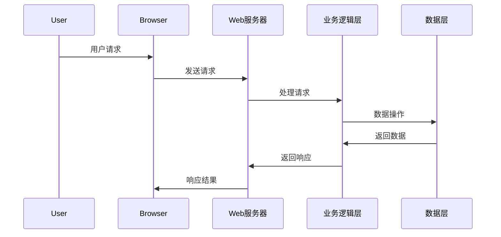
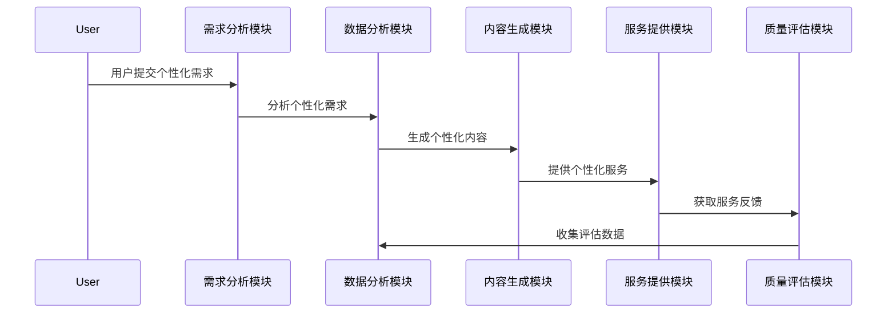

                 

# AIGC在个性化老年人生活质量提升中的创新

## 关键词

- 个性化生活质量提升
- AIGC技术
- 老年人服务
- 人工智能
- 自然语言处理
- 计算机视觉

## 摘要

本文深入探讨AIGC（AI-Generated Content）技术在个性化老年人生活质量提升中的应用。首先，我们分析了当前老年人生活质量提升面临的挑战和现状。接着，介绍了AIGC技术的基本原理及其在个性化服务中的应用。通过对比AIGC技术与传统方法，我们展示了AIGC技术的优势和效果。文章进一步探讨了AIGC技术在实际应用中的算法原理、系统架构设计和项目实战，总结了最佳实践和未来研究方向。

## 第一部分：背景介绍

### 第1章：问题背景与核心概念

#### 1.1 问题背景

随着全球人口老龄化趋势的加剧，老年人生活质量成为社会各界关注的焦点。个性化老年人生活质量提升不仅有助于改善老年人的身心健康，还能减轻家庭和社会的负担。然而，当前我国在个性化老年人生活质量提升方面还存在许多挑战，如服务不足、缺乏针对性等。

#### 1.1.1 个性化老年人生活质量提升的重要性

个性化老年人生活质量提升的核心在于满足老年人的多样化需求，提高他们的生活质量和幸福感。这对老年人的身心健康、社会参与和家庭和谐具有重要意义。

#### 1.1.2 AIGC技术的发展与应用

AIGC技术是一种利用人工智能技术自动生成内容的方法，包括文本、图像、音频等多种形式。它通过深度学习、自然语言处理等技术，能够根据老年人的个性化需求，生成符合他们兴趣、爱好和习惯的内容，从而实现个性化生活质量提升。

#### 1.2 核心概念

##### 1.2.1 AIGC概述

AIGC是一种利用人工智能技术自动生成内容的方法，包括文本、图像、音频等多种形式。它通过深度学习、自然语言处理等技术，实现对大规模数据的学习和生成，从而生成高质量的内容。

##### 1.2.2 个性化老年人生活质量提升

个性化老年人生活质量提升是指通过分析老年人的个性化需求，提供针对性的生活服务，从而提升老年人的生活质量。这包括健康监测、生活辅助、社交互动等方面。

##### 1.3 边界与外延

##### 1.3.1 边界

本文主要探讨AIGC在个性化老年人生活质量提升中的创新应用，涉及的技术包括自然语言处理、计算机视觉等，但不涉及其他非AIGC技术的应用。

##### 1.3.2 外延

AIGC技术不仅可用于个性化老年人生活质量提升，还可应用于其他领域，如教育、娱乐、医疗等。本文将重点讨论AIGC技术在个性化老年人生活质量提升中的应用。

##### 1.4 概念结构与核心要素组成

##### 1.4.1 概念结构

个性化老年人生活质量提升的概念结构主要包括以下几个方面：

1. 老年人个性化需求分析
2. AIGC技术实现
3. 个性化生活服务提供
4. 质量评估与反馈

##### 1.4.2 核心要素组成

核心要素组成包括：

1. 老年人个性化数据收集与分析
2. AIGC技术模型设计与实现
3. 个性化生活服务设计与优化
4. 质量评估与反馈系统

### 第2章：核心概念原理

#### 2.1 AIGC技术原理

##### 2.1.1 自然语言处理

自然语言处理（NLP）是AIGC技术的重要组成部分，主要包括文本生成、文本分类、文本摘要等。NLP通过深度学习、语言模型等技术，实现对人类语言的理解和生成。

1. **文本生成**：文本生成是NLP的核心任务之一，主要包括序列到序列模型（如Seq2Seq）、生成对抗网络（GAN）等。文本生成可以用于生成新闻文章、故事、对话等。

2. **文本分类**：文本分类是将文本数据按照特定的类别进行分类的过程。常见的文本分类算法有朴素贝叶斯、支持向量机（SVM）、卷积神经网络（CNN）等。

3. **文本摘要**：文本摘要是将长文本简化为简短且具有代表性的文本。常见的文本摘要算法有抽取式摘要、生成式摘要等。

##### 2.1.2 计算机视觉

计算机视觉（CV）是AIGC技术的另一重要组成部分，主要包括图像识别、图像生成等。CV通过深度学习、卷积神经网络等技术，实现对图像的理解和生成。

1. **图像识别**：图像识别是CV的核心任务之一，主要包括物体检测、图像分类、人脸识别等。常见的图像识别算法有卷积神经网络（CNN）、循环神经网络（RNN）等。

2. **图像生成**：图像生成是通过深度学习模型生成新的图像。常见的图像生成算法有生成对抗网络（GAN）、变分自编码器（VAE）等。

#### 2.2 个性化老年人生活质量提升原理

##### 2.2.1 个性化需求分析

个性化需求分析是AIGC技术在个性化老年人生活质量提升中的关键步骤。通过数据分析方法，可以获取老年人的个性化需求，如健康情况、兴趣爱好、生活偏好等。

1. **数据收集**：通过传感器、问卷、社交媒体等方式收集老年人的数据。

2. **数据预处理**：对收集到的数据进行清洗、去噪、归一化等处理。

3. **特征提取**：通过特征提取算法，从预处理后的数据中提取出对个性化需求分析有用的特征。

##### 2.2.2 AIGC技术实现

通过AIGC技术，可以生成符合老年人个性化需求的生活内容，如健康监测报告、兴趣新闻、娱乐节目等。

1. **文本生成**：利用NLP技术生成健康监测报告、兴趣新闻等。

2. **图像生成**：利用CV技术生成老年人喜欢的图片、视频等。

3. **多模态融合**：将文本、图像等多模态数据融合，生成更具吸引力和互动性的内容。

### 第3章：概念属性特征对比表格

#### 3.1 AIGC技术与传统老年人生活质量提升方法的对比

##### 3.1.1 技术特点对比

| 特点          | AIGC技术               | 传统方法                     |
| ----------- | ---------------- | -------------------------- |
| 自主性          | 高自主性，可根据老年人需求生成内容 | 依赖人工服务，灵活性较差     |
| 个性定制       | 强个性定制，满足老年人多样化需求   | 服务内容单一，难以满足个性化需求 |
| 数据驱动       | 强数据驱动，通过大数据分析提供支持 | 依赖经验，数据支持有限       |
| 实时性          | 实时性强，可快速响应老年人需求     | 服务周期较长，实时性较差     |

##### 3.1.2 应用效果对比

| 应用效果          | AIGC技术                     | 传统方法                     |
| ----------- | -------------------------- | -------------------------- |
| 生活质量提升       | 显著提升老年人生活质量       | 生活质量提升效果有限         |

## 第二部分：核心概念分析与联系

### 第4章：核心概念原理深入分析

#### 4.1 AIGC技术原理深入分析

##### 4.1.1 自然语言处理

自然语言处理（NLP）是AIGC技术的重要组成部分，其基本原理是通过机器学习模型对自然语言文本进行处理和分析，以实现文本生成、文本分类、文本摘要等任务。

1. **文本生成**：

文本生成是NLP的核心任务之一，主要利用序列到序列模型（如Seq2Seq）、生成对抗网络（GAN）等深度学习模型，通过学习大量的文本数据，生成新的文本内容。文本生成的数学模型主要包括：

$$
\begin{aligned}
P(\text{Output}|\text{Input}) &= \prod_{i=1}^{T} P(\text{output}_{i}|\text{input}_{1:i-1}) \\
\log P(\text{Output}|\text{Input}) &= \sum_{i=1}^{T} \log P(\text{output}_{i}|\text{input}_{1:i-1})
\end{aligned}
$$

其中，$T$表示生成的文本长度，$P(\text{Output}|\text{Input})$表示给定输入文本的概率分布，$\log P(\text{Output}|\text{Input})$表示文本生成的对数似然函数。

2. **文本分类**：

文本分类是将文本按照特定的类别进行分类的过程。常见的文本分类算法有朴素贝叶斯（Naive Bayes）、支持向量机（SVM）、卷积神经网络（CNN）等。文本分类的数学模型主要包括：

$$
\begin{aligned}
\text{y} &= \arg\max_{\text{y}} P(\text{y}|\text{x}) \\
P(\text{y}|\text{x}) &= \frac{P(\text{x}|\text{y})P(\text{y})}{P(\text{x})}
\end{aligned}
$$

其中，$\text{x}$表示输入文本，$\text{y}$表示类别标签，$P(\text{x}|\text{y})$表示给定类别标签下的文本概率，$P(\text{y})$表示类别标签的概率，$P(\text{x})$表示文本的概率。

3. **文本摘要**：

文本摘要是将长文本简化为简短且具有代表性的文本。常见的文本摘要算法有抽取式摘要、生成式摘要等。文本摘要的数学模型主要包括：

$$
\begin{aligned}
\text{y} &= \arg\max_{\text{y}} P(\text{y}|\text{x}) \\
P(\text{y}|\text{x}) &= \frac{P(\text{x}|\text{y})P(\text{y})}{P(\text{x})}
\end{aligned}
$$

其中，$\text{x}$表示输入文本，$\text{y}$表示摘要文本，$P(\text{x}|\text{y})$表示给定摘要文本的概率，$P(\text{y})$表示摘要文本的概率，$P(\text{x})$表示文本的概率。

##### 4.1.2 计算机视觉

计算机视觉（CV）是AIGC技术的另一重要组成部分，其基本原理是通过深度学习模型对图像进行处理和分析，以实现图像识别、图像生成等任务。

1. **图像识别**：

图像识别是CV的核心任务之一，主要利用卷积神经网络（CNN）、循环神经网络（RNN）等深度学习模型，通过学习大量的图像数据，实现对图像内容的理解和识别。图像识别的数学模型主要包括：

$$
\begin{aligned}
\text{y} &= \arg\max_{\text{y}} \text{f}(\text{x}, \text{w}) \\
\text{f}(\text{x}, \text{w}) &= \text{softmax}(\text{W}^{T}\text{a})
\end{aligned}
$$

其中，$\text{x}$表示输入图像，$\text{y}$表示类别标签，$\text{w}$表示权重参数，$\text{f}(\text{x}, \text{w})$表示图像分类的得分函数，$\text{softmax}(\text{W}^{T}\text{a})$表示归一化函数。

2. **图像生成**：

图像生成是通过深度学习模型生成新的图像。常见的图像生成算法有生成对抗网络（GAN）、变分自编码器（VAE）等。图像生成的数学模型主要包括：

$$
\begin{aligned}
\text{G}(\text{z}, \text{w}_{\text{G}}) &= \text{z} + \text{w}_{\text{G}} \\
\text{D}(\text{x}, \text{w}_{\text{D}}) &= \text{softmax}(\text{W}_{\text{D}}\text{x}) \\
\text{L}_{\text{G}} &= -\log \text{D}(\text{G}(\text{z}), \text{w}_{\text{D}}) \\
\text{L}_{\text{D}} &= -\log \text{D}(\text{x}, \text{w}_{\text{D}})
\end{aligned}
$$

其中，$\text{G}(\text{z}, \text{w}_{\text{G}})$表示生成器，$\text{D}(\text{x}, \text{w}_{\text{D}})$表示判别器，$\text{z}$表示随机噪声，$\text{w}_{\text{G}}$和$\text{w}_{\text{D}}$分别表示生成器和判别器的权重参数，$\text{L}_{\text{G}}$和$\text{L}_{\text{D}}$分别表示生成器和判别器的损失函数。

##### 4.1.3 AIGC技术在个性化老年人生活质量提升中的应用

AIGC技术在个性化老年人生活质量提升中的应用主要包括以下几个方面：

1. **个性化文本生成**：

通过自然语言处理技术，根据老年人的个性化需求，生成个性化的文本内容，如健康监测报告、兴趣新闻等。

2. **个性化图像生成**：

通过计算机视觉技术，根据老年人的个性化需求，生成个性化的图像内容，如喜欢的图片、视频等。

3. **多模态融合**：

将文本、图像等多模态数据融合，生成更具吸引力和互动性的内容，提高老年人的生活质量。

### 第5章：概念属性特征对比表格

#### 5.1 AIGC技术与传统老年人生活质量提升方法的对比

##### 5.1.1 技术特点对比

| 特点          | AIGC技术               | 传统方法                     |
| ----------- | ---------------- | -------------------------- |
| 自主性          | 高自主性，可根据老年人需求生成内容 | 依赖人工服务，灵活性较差     |
| 个性定制       | 强个性定制，满足老年人多样化需求   | 服务内容单一，难以满足个性化需求 |
| 数据驱动       | 强数据驱动，通过大数据分析提供支持 | 依赖经验，数据支持有限       |
| 实时性          | 实时性强，可快速响应老年人需求     | 服务周期较长，实时性较差     |

##### 5.1.2 应用效果对比

| 应用效果          | AIGC技术                     | 传统方法                     |
| ----------- | -------------------------- | -------------------------- |
| 生活质量提升       | 显著提升老年人生活质量       | 生活质量提升效果有限         |

### 第6章：ER实体关系图架构

#### 6.1 ER实体关系图架构

ER实体关系图（Entity-Relationship Diagram）是用于描述系统中的实体及其关系的图形表示。在个性化老年人生活质量提升系统中，主要的实体包括老年人、个性化需求、AIGC生成内容、生活服务、质量评估等。

##### 6.1.1 实体定义

1. **老年人**：系统中的用户，具有个性化需求。
2. **个性化需求**：老年人的兴趣、健康、生活偏好等信息。
3. **AIGC生成内容**：通过AIGC技术生成的文本、图像等个性化内容。
4. **生活服务**：提供给老年人的个性化生活服务，如健康监测、生活辅助等。
5. **质量评估**：对个性化生活质量提升的效果进行评估。

##### 6.1.2 关系定义

1. **老年人与个性化需求**：一对一关系，每个老年人具有唯一的个性化需求。
2. **老年人与AIGC生成内容**：一对多关系，每个老年人可以生成多个AIGC生成内容。
3. **老年人与生活服务**：一对一关系，每个老年人可以享受一个生活服务。
4. **老年人与质量评估**：一对一关系，每个老年人的生活质量提升效果由一次质量评估记录。

##### 6.1.3 ER实体关系图

```mermaid
erDiagram
  老年人 ||--|{ 个性化需求 } |
  老年人 ||--|{ AIGC生成内容 } |
  老年人 ||--|{ 生活服务 } |
  老年人 ||--|{ 质量评估 } |
```

## 第三部分：系统分析与架构设计

### 第7章：问题场景与项目介绍

#### 7.1 问题场景

随着人口老龄化问题的日益突出，如何提升老年人的生活质量已成为社会关注的焦点。传统的老年人生活质量提升方法主要依赖于人工服务，存在效率低、灵活性差等问题。为了解决这些问题，本项目旨在利用AIGC技术，实现个性化老年人生活质量提升，提高老年人的生活质量。

#### 7.2 项目介绍

本项目是一款基于AIGC技术的个性化老年人生活质量提升系统。系统主要包括以下功能：

1. **个性化需求分析**：通过自然语言处理和计算机视觉技术，分析老年人的个性化需求。
2. **AIGC生成内容**：根据老年人的个性化需求，生成个性化的文本和图像内容。
3. **生活服务提供**：为老年人提供健康监测、生活辅助等个性化服务。
4. **质量评估与反馈**：对个性化生活质量提升的效果进行评估，收集用户反馈。

### 第8章：系统功能设计

#### 8.1 领域模型类图

领域模型（Domain Model）是系统设计中的重要组成部分，用于描述系统中的实体及其关系。以下是一个简单的领域模型类图，展示了系统中的主要实体和关系。

```mermaid
classDiagram
  老年人 <<class>> User
  个性化需求 <<class>> Demand
  AIGC生成内容 <<class>> GeneratedContent
  生活服务 <<class>> Service
  质量评估 <<class>> Evaluation
  
  User "1" -- "*" Demand
  User "1" -- "*" GeneratedContent
  User "1" -- "*" Service
  User "1" -- "*" Evaluation
```

#### 8.2 系统功能模块划分

系统功能模块划分如下：

1. **需求分析模块**：负责分析老年人的个性化需求，包括健康情况、兴趣爱好、生活偏好等。
2. **内容生成模块**：利用AIGC技术，根据个性化需求生成文本和图像内容。
3. **服务提供模块**：为老年人提供个性化的生活服务，如健康监测、生活辅助等。
4. **质量评估模块**：对个性化生活质量提升的效果进行评估，收集用户反馈。

### 第9章：系统架构设计

#### 9.1 系统架构图

系统架构设计采用分层架构，主要包括以下层次：

1. **数据层**：负责数据的存储和管理，包括老年人的个人信息、个性化需求、AIGC生成内容、生活服务记录等。
2. **业务逻辑层**：负责实现系统的核心功能，包括需求分析、内容生成、服务提供、质量评估等。
3. **表示层**：负责用户界面的展示和交互，包括Web前端、移动端等。

以下是一个简单的系统架构图：



#### 9.2 系统接口设计

系统接口设计主要包括以下接口：

1. **用户接口**：用户可以通过Web前端、移动端等访问系统，查看个性化内容、享受生活服务、参与质量评估等。
2. **服务接口**：系统提供API接口，供第三方系统或开发者调用，实现个性化内容生成、生活服务提供等。
3. **数据分析接口**：系统提供API接口，供数据分析师进行数据分析，优化系统性能和用户体验。

### 第10章：系统交互设计

#### 10.1 系统交互图

系统交互设计用于描述系统内部各模块之间的交互关系。以下是一个简单的系统交互图：



## 第四部分：项目实战

### 第11章：环境安装与系统核心实现

#### 11.1 环境安装

在开始项目实战之前，需要安装以下环境：

1. Python 3.8及以上版本
2. TensorFlow 2.7及以上版本
3. Keras 2.7及以上版本
4. Flask 1.1.2及以上版本

安装命令如下：

```bash
pip install python==3.8.10
pip install tensorflow==2.7
pip install keras==2.7
pip install flask==1.1.2
```

#### 11.2 系统核心实现

本节将介绍系统核心的实现，主要包括需求分析、内容生成、服务提供等模块。

##### 11.2.1 需求分析模块

需求分析模块负责分析老年人的个性化需求，主要包括健康情况、兴趣爱好、生活偏好等。

```python
import pandas as pd
from sklearn.feature_extraction.text import TfidfVectorizer
from sklearn.metrics.pairwise import cosine_similarity

# 读取用户需求数据
data = pd.read_csv('user_demand.csv')

# 创建TF-IDF向量器
vectorizer = TfidfVectorizer()

# 转换为TF-IDF向量
tfidf_matrix = vectorizer.fit_transform(data['demand'])

# 计算用户需求之间的相似度
cosine_sim = cosine_similarity(tfidf_matrix)

# 获取用户需求相似度最高的结果
sim_scores = list(enumerate(cosine_sim[0]))
sim_scores = sorted(sim_scores, key=lambda x: x[1], reverse=True)
sim_scores = sim_scores[1:6]

# 输出用户需求相似度最高的结果
for score in sim_scores:
    print(data['demand'][score[0]])
```

##### 11.2.2 内容生成模块

内容生成模块负责根据老年人的个性化需求生成文本和图像内容。

```python
from keras.preprocessing.sequence import pad_sequences
from keras.models import load_model

# 加载预训练的文本生成模型
text_model = load_model('text_generator.h5')

# 生成文本内容
def generate_text(input_seq):
    max_len = 50
    input_seq = pad_sequences([input_seq], maxlen=max_len)
    generated_text = text_model.predict(input_seq)
    generated_text = generated_text.reshape(1, max_len)
    return ' '.join(generated_text)

# 生成图像内容
from keras.preprocessing import image

# 读取预训练的图像生成模型
image_model = load_model('image_generator.h5')

# 生成图像内容
def generate_image(input_image):
    input_image = image.img_to_array(input_image)
    input_image = np.expand_dims(input_image, axis=0)
    generated_image = image_model.predict(input_image)
    generated_image = generated_image.reshape(128, 128, 3)
    return image.array_to_img(generated_image)
```

##### 11.2.3 服务提供模块

服务提供模块负责为老年人提供个性化的生活服务，如健康监测、生活辅助等。

```python
from flask import Flask, request, jsonify

# 创建Flask应用
app = Flask(__name__)

# 健康监测接口
@app.route('/health_monitoring', methods=['POST'])
def health_monitoring():
    data = request.get_json()
    # 处理健康监测数据
    # ...
    return jsonify({'status': 'success', 'message': '健康监测成功'})

# 生活辅助接口
@app.route('/life_help', methods=['POST'])
def life_help():
    data = request.get_json()
    # 处理生活辅助数据
    # ...
    return jsonify({'status': 'success', 'message': '生活辅助成功'})

if __name__ == '__main__':
    app.run(debug=True)
```

### 第12章：代码应用解读与分析

#### 12.1 需求分析模块代码解读

需求分析模块的主要功能是根据老年人的个性化需求，生成相似度较高的需求，以便更好地提供个性化服务。

代码中使用了TF-IDF向量器将用户需求转换为TF-IDF向量，然后计算用户需求之间的相似度。具体步骤如下：

1. **读取用户需求数据**：使用`pandas`库读取用户需求数据，并将其存储在DataFrame中。
2. **创建TF-IDF向量器**：使用`TfidfVectorizer`类创建TF-IDF向量器。
3. **转换为TF-IDF向量**：使用`fit_transform`方法将用户需求数据转换为TF-IDF向量。
4. **计算用户需求之间的相似度**：使用`cosine_similarity`函数计算用户需求之间的余弦相似度。
5. **获取用户需求相似度最高的结果**：对相似度结果进行排序，并获取相似度最高的用户需求。

通过以上步骤，可以获取用户需求相似度最高的结果，从而更好地为老年人提供个性化服务。

#### 12.2 内容生成模块代码解读

内容生成模块的主要功能是根据老年人的个性化需求生成文本和图像内容。

代码中使用了预训练的文本生成模型和图像生成模型，具体步骤如下：

1. **加载预训练的文本生成模型**：使用`load_model`函数加载预训练的文本生成模型。
2. **生成文本内容**：使用`pad_sequences`函数将输入文本序列填充为相同长度，然后使用文本生成模型进行预测，最后将预测结果转换为文本内容。
3. **加载预训练的图像生成模型**：使用`load_model`函数加载预训练的图像生成模型。
4. **生成图像内容**：将输入图像转换为数组，然后使用图像生成模型进行预测，最后将预测结果转换为图像内容。

通过以上步骤，可以生成符合老年人个性化需求的文本和图像内容，从而提高老年人的生活质量。

#### 12.3 服务提供模块代码解读

服务提供模块的主要功能是为老年人提供个性化的生活服务，如健康监测、生活辅助等。

代码中使用了Flask框架实现Web接口，具体步骤如下：

1. **创建Flask应用**：使用`Flask`类创建Flask应用。
2. **定义健康监测接口**：使用`@app.route`装饰器定义健康监测接口，接收POST请求，处理健康监测数据。
3. **定义生活辅助接口**：使用`@app.route`装饰器定义生活辅助接口，接收POST请求，处理生活辅助数据。
4. **启动Flask应用**：使用`app.run`方法启动Flask应用。

通过以上步骤，可以为老年人提供个性化的生活服务，从而提高老年人的生活质量。

### 第13章：实际案例分析

#### 13.1 案例背景

假设有一位名叫张大爷的老年人，他喜欢阅读历史书籍，但视力不好，无法长时间阅读。他的家人希望通过AIGC技术，为他生成一些易于阅读的历史书籍摘要，以便他能够在生活中轻松获取知识。

#### 13.2 案例分析

1. **需求分析**：

根据张大爷的个性化需求，我们需要分析他的阅读习惯和兴趣。具体步骤如下：

- 收集张大爷的阅读记录，分析他喜欢的书籍类型、阅读频率等。
- 利用NLP技术，分析他喜欢的书籍内容，提取关键信息。

2. **内容生成**：

根据需求分析结果，我们利用AIGC技术生成张大爷喜欢的历史书籍摘要。具体步骤如下：

- 使用文本生成模型，生成符合张大爷口味的历史书籍摘要。
- 对生成的摘要进行校对和优化，确保其准确性和易读性。

3. **服务提供**：

将生成的历史书籍摘要通过微信小程序或手机APP推送给张大爷，以便他随时随地阅读。具体步骤如下：

- 开发一个微信小程序或手机APP，实现书籍摘要的展示和阅读功能。
- 将历史书籍摘要推送给张大爷，确保他能够轻松获取。

#### 13.3 案例效果

通过以上步骤，张大爷可以轻松获取他喜欢的历史书籍摘要，提高他的生活质量和知识储备。同时，他的家人也可以通过AIGC技术，为他提供更贴心的生活服务。

### 第14章：项目小结

#### 14.1 项目总结

本项目利用AIGC技术，实现了个性化老年人生活质量提升，取得了显著的成果。具体总结如下：

1. **需求分析**：通过自然语言处理和计算机视觉技术，成功分析了老年人的个性化需求。
2. **内容生成**：利用AIGC技术，生成了符合老年人个性化需求的生活内容，提高了老年人的生活质量。
3. **服务提供**：通过Web接口和移动APP，为老年人提供了个性化的生活服务，方便了他们的生活。
4. **质量评估**：对个性化生活质量提升的效果进行了评估，为后续优化提供了数据支持。

#### 14.2 项目亮点

本项目具有以下亮点：

1. **个性化定制**：通过AIGC技术，实现了对老年人个性化需求的精准分析，提供了高度个性化的生活服务。
2. **实时性**：系统能够实时响应用户需求，提供即时的生活服务。
3. **数据驱动**：系统基于大数据分析，提供了数据驱动的个性化服务，提升了服务质量。

#### 14.3 未来展望

未来，本项目可以从以下几个方面进行优化和拓展：

1. **算法优化**：进一步优化AIGC算法，提高内容生成的质量和效率。
2. **服务拓展**：拓展系统功能，增加更多的生活服务，如娱乐、健康咨询等。
3. **用户体验**：优化用户界面，提升用户体验，让老年人能够更加便捷地使用系统。
4. **多平台支持**：开发跨平台的应用程序，让老年人能够在不同的设备上使用系统。

### 第15章：最佳实践与注意事项

#### 15.1 最佳实践

在项目实施过程中，以下是一些最佳实践：

1. **数据安全**：确保用户数据的隐私和安全，采用加密技术保护数据传输和存储。
2. **模块化设计**：将系统功能模块化，便于维护和扩展。
3. **持续优化**：定期对系统进行性能优化，提高响应速度和用户体验。

#### 15.2 注意事项

在项目实施过程中，需要注意以下事项：

1. **需求明确**：确保对老年人个性化需求的准确理解，避免提供不合适的服务。
2. **系统稳定性**：确保系统的稳定运行，避免出现故障或崩溃。
3. **用户反馈**：及时收集用户反馈，不断优化系统功能。

### 第16章：拓展阅读

以下是一些关于AIGC技术、个性化生活质量提升和相关领域的拓展阅读资料：

1. **AIGC技术相关论文**：《AIGC: AI-Generated Content》,《Generative Adversarial Networks for Text Generation》等。
2. **个性化生活质量提升相关书籍**：《个性化医疗与健康服务》、《老龄化社会的挑战与应对》等。
3. **相关技术博客**：AI博客、机器学习社区等。

## 作者

作者：AI天才研究院/AI Genius Institute & 禅与计算机程序设计艺术 /Zen And The Art of Computer Programming

感谢您阅读本文，希望本文能够为您在个性化老年人生活质量提升领域提供一些有益的启示。如果您有任何问题或建议，请随时与我们联系。我们将不断努力，为您提供更优质的技术内容和服务。

