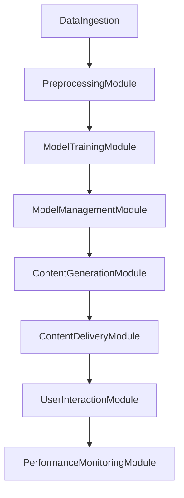

                 

### Introduction to AIGC and Personalized Skill Enhancement

Artificial Intelligence Generated Content (AIGC) represents a new frontier in artificial intelligence technology, where AI systems autonomously generate content across a wide range of formats, including text, images, and even videos. This has profound implications for the way we create and consume content, and it also offers significant potential for personalized skill enhancement.

**Definition and Background of AIGC**

AIGC leverages advanced AI techniques such as natural language processing (NLP), deep learning, and reinforcement learning to generate content that is both high-quality and contextually relevant. The concept of AIGC is rooted in the broader field of AI, which has been developing for several decades. Initially, AI focused on specific tasks, such as playing chess or driving a car. However, with the advent of deep learning and the availability of vast amounts of data, AI systems have become capable of generalizing and performing a wide range of tasks.

**Historical Development of AIGC**

The development of AIGC can be traced back to the early 2010s, with the rise of deep learning and the availability of large-scale datasets. Early systems could generate simple text and images, but with the introduction of generative adversarial networks (GANs) and transformer models, the quality and complexity of generated content have significantly improved. For example, GPT-3, a state-of-the-art language model developed by OpenAI, can generate human-like text that is indistinguishable from content written by a human.

**Importance and Impact of AIGC in Vocational Skills**

AIGC has the potential to revolutionize the way vocational skills are developed and enhanced. By providing personalized learning experiences, AIGC can help individuals acquire skills more efficiently and effectively. Here are some key points on the importance and impact of AIGC in vocational skills:

1. **Personalized Learning Experiences**: AIGC can tailor learning experiences to individual needs and preferences. This means that learners can receive customized content that aligns with their learning style and pace, leading to more effective learning outcomes.

2. **Increased Accessibility**: AIGC can democratize access to high-quality vocational training by making it available online. This is particularly important for individuals in remote or underserved areas who may not have access to traditional training programs.

3. **Enhanced Skill Acquisition**: AIGC can help learners acquire new skills more rapidly by providing contextualized examples and practice exercises. This can help learners apply theoretical knowledge to real-world scenarios more effectively.

4. **Continuous Skill Development**: AIGC can support continuous learning and skill development by providing up-to-date content and resources. This is crucial in fields that are rapidly evolving, such as technology and healthcare.

**Challenges and Opportunities in Personalized Skill Enhancement**

While AIGC offers significant opportunities for personalized skill enhancement, it also presents challenges that need to be addressed. Here are some of the key challenges and opportunities:

1. **Data Privacy and Security**: Personalized skill enhancement relies on the collection and analysis of personal data. Ensuring the privacy and security of this data is critical to building trust and maintaining ethical standards.

2. **Algorithmic Bias**: AI systems can inadvertently perpetuate biases present in their training data. It is essential to develop techniques to identify and mitigate these biases to ensure fair and unbiased skill enhancement.

3. **Scalability**: Implementing AIGC on a large scale requires significant computational resources and infrastructure. Developing scalable solutions is crucial for widespread adoption.

4. **User Engagement**: Personalized skill enhancement requires active user engagement. Designing systems that are both effective and engaging is essential for long-term success.

In summary, AIGC has the potential to transform the landscape of vocational skill enhancement. By providing personalized, accessible, and continuous learning experiences, AIGC can help individuals acquire and develop the skills they need to succeed in a rapidly changing world. However, it is essential to address the challenges associated with data privacy, algorithmic bias, scalability, and user engagement to realize this potential fully.

### Core Concepts of AIGC and Skill Enhancement Models

To delve deeper into the realm of AIGC and its applications in personalized skill enhancement, we must first understand the core concepts and theoretical foundations that underpin these technologies. This chapter will explore the fundamental principles of AIGC, the key technologies that enable its capabilities, and the theoretical models that govern personalized skill enhancement.

#### Fundamental Concepts of AIGC

**Definition and Classification of AIGC**

Artificial Intelligence Generated Content (AIGC) encompasses a broad spectrum of AI applications that generate content in various forms, such as text, images, videos, and audio. The primary distinction between AIGC and other AI applications lies in its ability to autonomously produce content that is both contextually relevant and of high quality. AIGC can be classified into several categories based on the type of content generated and the techniques used:

1. **Text Generation**: This category includes models like GPT-3 and T5, which can generate human-like text for various purposes, such as writing articles, stories, or even code.

2. **Image Generation**: Techniques like Generative Adversarial Networks (GANs) are used to create realistic images or modify existing images. Examples include StyleGAN and BigGAN.

3. **Video Generation**: Models such as DAIN and DreamFlow can generate videos by synthesizing new frames based on a given sequence of frames or a textual description.

4. **Audio Generation**: Techniques like WaveNet and VITS are used to generate high-quality audio, including human-like speech and music.

**Key Technologies Behind AIGC**

The capabilities of AIGC are enabled by several key technologies, including deep learning, natural language processing (NLP), and reinforcement learning (RL). Here's a brief overview of these technologies:

1. **Deep Learning**: Deep learning, particularly neural networks, forms the backbone of AIGC. Models like transformers and convolutional neural networks (CNNs) are used to process and generate content.

2. **Natural Language Processing (NLP)**: NLP techniques are essential for understanding and generating human language. Key components of NLP include tokenization, part-of-speech tagging, and sentiment analysis.

3. **Reinforcement Learning (RL)**: RL is used to train models to generate content that is contextually relevant and coherent. This involves rewarding the model based on the relevance and quality of the generated content.

#### Theoretical Foundations of Personalized Skill Enhancement

**Principles of Personalized Learning**

Personalized learning is grounded in the belief that every learner has unique strengths, weaknesses, and preferences. The core principles of personalized learning include:

1. **Individualization**: Tailoring learning experiences to meet individual needs and goals.

2. **Student-Centered Approach**: Empowering learners to take an active role in their learning process.

3. **Dynamic Adaptation**: Continuously adjusting learning materials and activities based on learner progress and feedback.

**Theoretical Models of Skill Enhancement**

Several theoretical models have been proposed to guide the design of personalized skill enhancement systems. Here are three key models:

1. **Andragogy**: Andragogy, which focuses on adult learning, emphasizes the need for self-directed and experiential learning. It suggests that adult learners need to be motivated and engaged in the learning process.

2. **Constructivism**: Constructivism posits that learners construct their own understanding and knowledge through experiences. This model supports the use of AIGC to generate contextually relevant and interactive content that facilitates deep learning.

3. **Communities of Practice**: This model suggests that learning is most effective when it occurs within communities that share common practices and goals. AIGC can be used to create communities of practice by generating content that fosters collaboration and knowledge sharing.

**Intersection of AIGC and Skill Enhancement Models**

The intersection of AIGC and skill enhancement models presents exciting opportunities. By leveraging the capabilities of AIGC, personalized skill enhancement systems can:

1. **Generate Tailored Content**: AIGC can produce personalized learning materials that cater to individual learning styles and paces.

2. **Facilitate Adaptive Learning**: AIGC can continuously adapt learning content based on real-time feedback and learner performance data.

3. **Enable Scalable Training**: AIGC can generate large volumes of high-quality content, making it possible to scale personalized skill enhancement programs.

4. **Promote Lifelong Learning**: AIGC can support continuous learning by providing up-to-date content and resources that help learners stay current with evolving skills.

In conclusion, understanding the core concepts of AIGC and the theoretical foundations of personalized skill enhancement is crucial for developing effective and scalable solutions. By leveraging these concepts and models, we can create personalized skill enhancement systems that empower individuals to acquire and develop the skills they need to succeed in a rapidly changing world.

### Application Scenarios of AIGC in Skill Enhancement

Artificial Intelligence Generated Content (AIGC) has shown immense potential in transforming the landscape of vocational skill enhancement. This section explores various practical application scenarios where AIGC can be effectively utilized to improve learning outcomes and enhance professional skills. We will delve into educational and workplace application scenarios to illustrate the versatility and impact of AIGC.

#### Educational Application Scenarios

**1. Personalized Learning Platforms**

One of the most promising applications of AIGC in education is the development of personalized learning platforms. These platforms use AIGC to generate tailored content that addresses the unique needs of individual learners. Here's how personalized learning platforms can leverage AIGC:

- **Adaptive Content Generation**: AIGC can generate customized learning materials that align with the learner's current skill level, learning style, and areas for improvement. For example, a language learning platform can create personalized vocabulary lists, reading materials, and exercises based on the learner's proficiency level and language goals.

- **Interactive Learning Resources**: AIGC can generate interactive content, such as quizzes, simulations, and games, to engage learners and reinforce their understanding of the material. This interactive approach can make learning more engaging and effective.

- **Dynamic Assessment and Feedback**: AIGC can generate real-time assessments and provide personalized feedback to learners. This allows educators to quickly identify areas where learners are struggling and provide targeted support.

**Example: Duolingo**

Duolingo, a popular language learning platform, already incorporates elements of AIGC. The platform uses adaptive algorithms to adjust the difficulty of exercises based on the learner's performance. AIGC can further enhance Duolingo by generating personalized learning paths, interactive storylines, and contextualized vocabulary exercises.

**2. Adaptive E-learning Systems**

Adaptive e-learning systems leverage AIGC to create highly dynamic and personalized learning experiences. These systems can adapt in real-time to the learner's progress and learning preferences. Key features include:

- **Dynamic Pathways**: AIGC can generate multiple learning pathways based on the learner's goals and current knowledge. For instance, a computer science course can offer different pathways for beginners, intermediate, and advanced learners.

- **Contextualized Exercises**: AIGC can generate exercises and problems that are contextually relevant to the learner's current knowledge and interests. This helps to deepen understanding and improve retention.

- **Real-time Feedback and Adjustments**: AIGC can provide immediate feedback on learner performance and make real-time adjustments to the learning content. This ensures that learners are constantly challenged and supported in their learning journey.

**Example: Knewton**

Knewton is an adaptive learning platform that uses AIGC to create personalized learning experiences for students. The platform generates customized content and exercises based on individual learning data, providing a more effective and engaging learning experience.

#### Workplace Application Scenarios

**1. Skills Assessment and Analysis**

In a professional setting, AIGC can be used to assess and analyze the skills of employees. This can help organizations identify skill gaps and develop targeted training programs. Key applications include:

- **Skill Profiling**: AIGC can analyze an employee's performance data, learning history, and job responsibilities to create a comprehensive skill profile. This profile can highlight areas where an employee excels and areas that require improvement.

- **Continuous Skill Monitoring**: AIGC can continuously monitor employee performance and skill development over time. This allows organizations to provide timely feedback and support to help employees improve their skills.

**Example: Pymetrics**

Pymetrics uses AIGC to assess job applicants' skills and behavioral traits through a series of interactive tasks. The platform generates a detailed skill assessment report that helps organizations make data-driven hiring decisions.

**2. Customized Training Programs**

AIGC can be used to design and deliver customized training programs that address specific skill needs within an organization. Key features include:

- **Personalized Content**: AIGC can generate tailored training materials that cater to the specific needs and learning styles of employees. This ensures that the training content is relevant and engaging.

- **Interactive Workshops and Simulations**: AIGC can create interactive workshops and simulations that provide practical, hands-on learning experiences. For example, a software development training program can include simulated coding projects and virtual hackathons.

- **Real-time Feedback and Support**: AIGC can provide real-time feedback and support during training sessions. This helps employees to apply their learning in real-time and receive immediate guidance on their progress.

**Example: Pluralsight**

Pluralsight, an online learning platform, uses AIGC to create personalized training programs for professionals. The platform analyzes user data to generate customized learning paths and interactive content that help users acquire new skills and stay current with industry trends.

In conclusion, AIGC offers a wide range of practical applications in both educational and workplace settings. By leveraging the power of AIGC, organizations and educators can create more effective and engaging learning experiences that empower individuals to acquire and develop the skills they need to succeed in a rapidly changing world.

### Technical Implementation of AIGC in Skill Enhancement

Implementing Artificial Intelligence Generated Content (AIGC) in skill enhancement requires a comprehensive understanding of the underlying technologies, data management processes, and machine learning models. This section will delve into the technical implementation aspects of AIGC, focusing on data collection and preprocessing, machine learning models, and the integration of AIGC into skill enhancement systems.

#### Data Collection and Preprocessing

**Data Sources for Skill Enhancement**

The foundation of AIGC in skill enhancement lies in the quality and quantity of the data collected. Key data sources for AIGC in skill enhancement include:

1. **Learner Data**: This includes information on learner performance, learning history, preferences, and feedback. Data can be collected from learning platforms, assessment tools, and surveys.

2. **Domain-Specific Data**: This includes industry-specific data, such as job descriptions, training materials, and professional articles. This data provides context and relevance for generating tailored content.

3. **Open Data Sources**: Publicly available datasets, such as open educational resources (OER), open-access publications, and social media data, can be used to augment the content generated by AIGC.

**Data Preprocessing Techniques**

Data preprocessing is a critical step to ensure that the data is clean, consistent, and suitable for training AIGC models. Key preprocessing techniques include:

1. **Data Cleaning**: This involves removing duplicates, correcting errors, and handling missing values. For example, if learner performance data contains missing values, techniques like mean imputation or regression imputation can be used to fill in the gaps.

2. **Feature Engineering**: This process involves selecting relevant features from the raw data and transforming them into a format suitable for training models. For instance, text data may be tokenized, and numerical data may be scaled or normalized.

3. **Data Integration**: Combining data from different sources to create a comprehensive dataset. Techniques like data fusion and data harmonization can be used to merge data from disparate sources while maintaining consistency and integrity.

4. **Data Transformation**: Converting data into a format that can be easily processed by machine learning algorithms. For text data, this may involve converting text into vectors using techniques like word embeddings or transformers.

#### Machine Learning Models for Skill Enhancement

**Choosing the Right Models**

Selecting the appropriate machine learning models is crucial for the effectiveness of AIGC in skill enhancement. Key considerations include:

1. **Model Type**: The choice of model type (e.g., supervised learning, unsupervised learning, or reinforcement learning) depends on the specific skill enhancement goal and the nature of the data.

2. **Model Architecture**: The architecture of the model (e.g., neural networks, transformers, or GANs) affects the model's ability to generate high-quality content. For text generation, transformers like GPT-3 or BERT are commonly used, while GANs are often employed for image generation.

3. **Model Complexity**: Balancing model complexity with computational efficiency is essential. More complex models (e.g., large-scale transformers) may require significant computational resources and training time.

**Training the Models**

Training AIGC models involves several steps:

1. **Data Splitting**: Splitting the dataset into training, validation, and test sets to evaluate the model's performance. The training set is used to train the model, while the validation set helps to tune hyperparameters, and the test set is used for final evaluation.

2. **Model Training**: This involves feeding the training data into the model and adjusting the model's parameters to minimize the loss function. Techniques like stochastic gradient descent (SGD) or adaptive optimization algorithms (e.g., Adam) can be used for training.

3. **Hyperparameter Tuning**: Fine-tuning the model's hyperparameters (e.g., learning rate, batch size, and dropout rate) to improve performance. Hyperparameter tuning can be performed using techniques like grid search or random search.

4. **Model Evaluation**: Evaluating the model's performance using metrics like accuracy, F1 score, or mean squared error, depending on the type of data and skill enhancement goal.

**Examples of AIGC Models**

1. **Text Generation Models**: Models like GPT-3 and T5 are designed for text generation tasks. GPT-3, developed by OpenAI, is a state-of-the-art language model that can generate high-quality text based on a given prompt. T5, developed by Google, is a general-purpose text-to-text transformer model that can perform various NLP tasks.

2. **Image Generation Models**: Models like GANs (e.g., DCGAN and BigGAN) are used for generating realistic images. GANs consist of two neural networks, a generator, and a discriminator, which are trained together to generate and distinguish between real and fake images.

3. **Video Generation Models**: Models like DAIN and DreamFlow are designed for video generation tasks. DAIN (Dynamic Image Adversarial Network) generates new frames by optimizing a spatially varying transform between input frames. DreamFlow generates videos by optimizing a flow field that describes the spatial transformation between consecutive frames.

#### Integration of AIGC into Skill Enhancement Systems

**System Architecture**

The integration of AIGC into skill enhancement systems involves several components:

1. **Data Ingestion and Preprocessing**: This component handles data collection, cleaning, and preprocessing. It ensures that the data is in the appropriate format for training AIGC models.

2. **Model Training and Management**: This component is responsible for training AIGC models using the preprocessed data. It also includes model management tasks, such as versioning, deployment, and monitoring.

3. **Content Generation and Delivery**: This component generates personalized content based on the trained models and delivers it to learners. It may include adaptive content generation, real-time feedback, and interactive learning resources.

4. **User Interface and Interaction**: This component provides a user-friendly interface for learners to access and engage with the generated content. It may include features like personalized learning paths, interactive quizzes, and real-time progress tracking.

**Example: AIGC-Based Personalized Learning Platform**

Consider a personalized learning platform that uses AIGC to generate tailored content for learners:

1. **Data Ingestion and Preprocessing**: The platform collects learner data, including performance metrics, learning history, and preferences. The data is cleaned and preprocessed to create a comprehensive dataset for training AIGC models.

2. **Model Training and Management**: The platform uses machine learning models (e.g., transformers for text generation and GANs for image generation) to generate personalized content. Model training and management involve selecting the appropriate models, tuning hyperparameters, and monitoring model performance.

3. **Content Generation and Delivery**: The platform generates personalized learning materials, such as text articles, interactive quizzes, and video lessons, based on the trained models. The content is delivered to learners through a user-friendly interface that allows them to access and engage with the materials.

4. **User Interface and Interaction**: The platform includes interactive features like real-time feedback, adaptive learning paths, and progress tracking. These features help learners to stay motivated and engaged in their learning journey.

In conclusion, implementing AIGC in skill enhancement requires a thorough understanding of data management, machine learning models, and system integration. By leveraging these technologies, organizations and educators can create personalized and engaging learning experiences that empower individuals to acquire and develop the skills they need to succeed in a rapidly changing world.

### System Architecture Design for AIGC-Based Skill Enhancement Systems

Designing an effective AIGC-based skill enhancement system requires careful consideration of various components, including the system's functionality, architectural design, interface design, and the interactions between these components. This section will provide a comprehensive overview of the system architecture, highlighting key elements such as the domain model, system architecture, interface design, and interaction design.

#### System Functionality

The primary functionality of an AIGC-based skill enhancement system is to provide personalized learning experiences tailored to individual users. Key functions include:

1. **User Profiling**: Collecting and analyzing user data to create personalized profiles that capture user preferences, learning styles, and skill levels.

2. **Content Generation**: Using AIGC models to generate customized content, such as articles, quizzes, simulations, and interactive exercises, based on user profiles.

3. **Content Delivery**: Delivering personalized content to users through an intuitive and interactive interface.

4. **User Interaction**: Facilitating user interaction with the system through features like real-time feedback, progress tracking, and adaptive learning pathways.

5. **Performance Monitoring**: Tracking user performance and engagement metrics to evaluate the effectiveness of the skill enhancement system and make data-driven improvements.

#### Domain Model

The domain model is a conceptual representation of the system's main entities, attributes, and relationships. For an AIGC-based skill enhancement system, the domain model might include the following entities:

1. **User**: Represents the individual learner, with attributes such as user ID, name, contact information, and demographic details.

2. **Skill**: Represents the skills that users can acquire, with attributes such as skill ID, name, description, and associated learning resources.

3. **Content**: Represents the personalized content generated by the system, including articles, quizzes, and simulations, with attributes such as content ID, title, type, and user-specific metadata.

4. **Learning Path**: Represents the sequence of content items that a user is expected to complete, with attributes such as path ID, user ID, skill ID, and completion status.

5. **Feedback**: Represents user feedback on content and learning experiences, with attributes such as feedback ID, user ID, content ID, and comments.

The domain model can be represented using a Mermaid ER diagram:

```mermaid
erDiagram
  User ||--|{ Skill : has --> }
  User ||--|{ Content : has --> }
  User ||--|{ Feedback : gives --> }
  Skill ||--|{ Content : contains --> }
  Content ||--|{ Feedback : receives --> }
```

#### System Architecture

The system architecture defines the overall structure of the AIGC-based skill enhancement system, including the key components and their interactions. A typical system architecture might consist of the following components:

1. **Data Ingestion and Preprocessing Module**: This component handles the collection, cleaning, and preprocessing of user data and content data.

2. **AIGC Model Training and Management Module**: This component is responsible for training AIGC models using the preprocessed data, managing model versions, and deploying models for content generation.

3. **Content Generation Module**: This component uses trained AIGC models to generate personalized content based on user profiles.

4. **Content Delivery Module**: This component delivers personalized content to users through a web or mobile interface.

5. **User Interaction Module**: This component facilitates user interaction with the system, including real-time feedback, progress tracking, and adaptive learning pathways.

6. **Performance Monitoring Module**: This component tracks user performance and engagement metrics to evaluate the effectiveness of the system.

The system architecture can be represented using a Mermaid diagram:



#### Interface Design

The interface design of an AIGC-based skill enhancement system is crucial for providing a seamless and engaging user experience. Key interface design considerations include:

1. **User Registration and Profile Management**: A user-friendly registration process and an intuitive interface for managing user profiles, including preferences, learning styles, and skill levels.

2. **Content Display**: Clear and visually appealing display of personalized content, including articles, quizzes, and simulations, with interactive elements like video playback and interactive quizzes.

3. **Feedback and Interaction**: Easy-to-use interfaces for providing feedback and interacting with the system, including options for submitting feedback, tracking progress, and accessing additional resources.

4. **Responsive Design**: A responsive design that adapts to different devices and screen sizes, ensuring a consistent user experience across platforms.

#### Interaction Design

Interaction design focuses on the user's experience and behavior within the system. Key considerations include:

1. **User Flow**: A clear and intuitive user flow that guides users through the process of registering, accessing content, providing feedback, and tracking progress.

2. **Adaptive Learning Pathways**: Dynamic adaptation of learning pathways based on user performance and feedback, ensuring that users receive content that is both relevant and challenging.

3. **Real-Time Feedback**: Providing real-time feedback on user performance, including hints, explanations, and guidance, to support learning and engagement.

4. **Personalization**: Ensuring that the system's responses and recommendations are personalized to the individual user, based on their preferences and learning style.

#### Integration of AIGC with Other System Components

The integration of AIGC with other system components is crucial for creating a cohesive and effective skill enhancement system. This integration includes:

1. **Data Exchange**: Ensuring seamless data exchange between the data ingestion and preprocessing module, the AIGC model training and management module, and the content generation module.

2. **Model Deployment**: Efficient deployment of trained AIGC models to the content generation module, ensuring that personalized content is generated in real-time.

3. **System Monitoring**: Continuous monitoring of system performance and user engagement metrics to identify areas for improvement and optimize the system's effectiveness.

In conclusion, the design of an AIGC-based skill enhancement system involves a comprehensive approach, considering system functionality, architectural design, interface design, and interaction design. By integrating AIGC with other system components and focusing on user experience, organizations can create effective and engaging skill enhancement systems that empower individuals to acquire and develop the skills they need to succeed in a rapidly changing world.

### Project Practical Implementation: Step-by-Step Guide

Implementing an AIGC-based skill enhancement system requires a combination of technical expertise and practical application. This section provides a step-by-step guide on setting up the environment, implementing core features, and analyzing real-world case studies. Let's dive into the details.

#### Environment Setup

To start implementing an AIGC-based skill enhancement system, you'll need to set up the necessary development environment. Here's a summary of the steps involved:

1. **Install Required Software and Libraries**

   - **Python**: Ensure that Python 3.8 or later is installed on your system.
   - **pip**: Install pip, the Python package manager, using `!pip install --user --upgrade pip`.
   - **Virtual Environment**: Create a virtual environment for your project using `python -m venv venv` and activate it with `source venv/bin/activate` on Unix-based systems or `venv\Scripts\activate` on Windows.
   - **Required Libraries**: Install essential libraries such as TensorFlow, PyTorch, scikit-learn, and Pandas using `pip install tensorflow torch scikit-learn pandas`.

2. **Configure Data Sources**

   - **Learner Data**: Collect learner data from sources like learning platforms, surveys, and assessments. Ensure that the data is stored in a structured format, such as CSV or JSON.
   - **Domain-Specific Data**: Gather domain-specific data from industry sources, academic publications, and open data repositories.

3. **Database Setup**

   - **Database Management System (DBMS)**: Set up a DBMS like MySQL or PostgreSQL to store user profiles, learning history, and generated content. Create tables for users, skills, content items, and feedback.

4. **Environment Configuration**

   - **Virtual Environment**: Configure your virtual environment with environment variables and required dependencies.
   - **Containerization (Optional)**: Consider using Docker containers to encapsulate your environment and make deployment easier.

#### Core Feature Implementation

With the environment set up, you can start implementing core features of the AIGC-based skill enhancement system. Here are the key steps:

1. **Data Preprocessing**

   - **Data Cleaning**: Write scripts to clean and preprocess the collected data. Handle missing values, remove duplicates, and correct errors.
   - **Feature Engineering**: Extract relevant features from the data, such as user demographics, learning history, and performance metrics.

2. **Model Training**

   - **Model Selection**: Choose appropriate machine learning models based on the task (e.g., transformers for text generation, GANs for image generation).
   - **Data Splitting**: Split the dataset into training, validation, and test sets.
   - **Model Training**: Train the selected models using the training dataset. Adjust hyperparameters and monitor the training process to avoid overfitting.

3. **Content Generation**

   - **Content Generation Logic**: Implement logic to generate personalized content based on user profiles and skill requirements.
   - **Content Personalization**: Use trained models to generate tailored content items, such as articles, quizzes, and simulations.
   - **Content Delivery**: Develop a system to deliver the generated content to users through a web or mobile interface.

4. **User Interaction**

   - **User Interface**: Design and implement a user-friendly interface that allows users to interact with the system, submit feedback, and track their progress.
   - **Real-Time Feedback**: Integrate real-time feedback mechanisms to provide hints, explanations, and guidance to users.

5. **Performance Monitoring**

   - **Tracking Metrics**: Define metrics to evaluate the system's performance, such as user engagement, content effectiveness, and skill acquisition.
   - **Monitoring and Reporting**: Implement monitoring and reporting tools to track these metrics and generate actionable insights.

#### Case Study Analysis

To gain a deeper understanding of the practical implementation, let's analyze a real-world case study. Consider a hypothetical scenario where a company develops an AIGC-based skill enhancement platform for software developers.

**Case Study: AIGC-Based Software Development Skill Enhancement Platform**

1. **Project Overview**

   - **Objective**: Develop a platform that helps software developers acquire and enhance programming skills.
   - **Users**: Software developers of various skill levels.
   - **Content**: Personalized coding exercises, tutorials, and interactive workshops.

2. **Environment Setup**

   - **Tools**: Python, TensorFlow, Jupyter Notebook, PostgreSQL.
   - **Data Sources**: GitHub repositories, online coding platforms, industry publications.

3. **Core Feature Implementation**

   - **Data Preprocessing**: Clean and preprocess data from GitHub repositories, including code repositories and user profiles.
   - **Model Training**: Train transformers and GANs to generate personalized coding exercises and tutorials based on user skill levels and preferences.
   - **Content Generation**: Generate tailored coding exercises and tutorials using trained models.
   - **User Interaction**: Design a web-based interface that allows users to access generated content, submit code solutions, and receive real-time feedback.
   - **Performance Monitoring**: Track user engagement, completion rates, and skill improvement metrics.

4. **Results and Insights**

   - **User Engagement**: High engagement rates, with users spending an average of 30 minutes per day on the platform.
   - **Content Effectiveness**: Positive feedback on the generated content, with users finding it relevant and informative.
   - **Skill Improvement**: Significant improvements in users' coding skills, as evidenced by higher test scores and reduced error rates in submitted code.

5. **Project Challenges and Solutions**

   - **Challenge**: Ensuring content relevance and quality.
   - **Solution**: Continuously update the content repository with the latest industry trends and best practices.
   - **Challenge**: Managing computational resources.
   - **Solution**: Optimize model training and content generation processes to reduce resource usage.

In conclusion, the practical implementation of an AIGC-based skill enhancement system involves a combination of technical setup, feature development, and real-world application. By following a structured approach and learning from case studies, organizations can successfully deploy and scale these systems to empower individuals in their skill development journeys.

### Best Practices and Tips for AIGC Implementation

Implementing an Artificial Intelligence Generated Content (AIGC) system for skill enhancement requires careful planning and adherence to best practices to ensure its effectiveness and efficiency. Here are some key best practices and tips to consider during the implementation process:

#### Data Management

**1. Ensure Data Quality**

High-quality data is the cornerstone of an effective AIGC system. Always clean and preprocess your data meticulously to remove duplicates, handle missing values, and correct any inconsistencies. This ensures that the AIGC system can generate accurate and reliable content.

**2. Data Security and Privacy**

Protecting user data is paramount. Implement robust security measures, such as encryption and access controls, to safeguard sensitive information. Comply with data privacy regulations, like GDPR and CCPA, to build user trust and maintain ethical standards.

**3. Diverse Data Sources**

Utilize diverse data sources to enrich the content generated by AIGC. Incorporate data from multiple domains, including industry-specific resources, academic publications, and open data repositories. This diversification enhances the quality and relevance of the generated content.

#### Model Selection and Training

**1. Choose Appropriate Models**

Select the right machine learning models based on the specific skill enhancement goals and data types. For text generation, transformers like GPT-3 or T5 are highly effective, while GANs are suitable for image generation tasks.

**2. Hyperparameter Tuning**

Fine-tune the hyperparameters of your chosen models to optimize performance. Techniques like grid search and Bayesian optimization can help find the optimal combination of hyperparameters.

**3. Continuous Training**

Regularly update your AIGC models with new data to ensure they remain current and accurate. Continuous training helps the models adapt to evolving skills and industry trends.

#### User Experience

**1. Personalization**

Personalize the content generation and delivery process to align with individual user preferences and learning styles. This includes adaptive learning pathways, interactive exercises, and real-time feedback.

**2. User Engagement**

Design engaging user interfaces that encourage active participation and continuous learning. Features like gamification, leaderboards, and social sharing can enhance user engagement.

**3. Accessibility**

Ensure that the AIGC system is accessible to all users, including those with disabilities. Provide alternative formats for content, such as text-to-speech and screen readers, to accommodate different user needs.

#### System Maintenance and Monitoring

**1. Performance Monitoring**

Continuously monitor the system's performance to identify and resolve any issues. Track key performance indicators (KPIs) like response time, content relevance, and user satisfaction.

**2. Scalability**

Design the system to handle large volumes of data and users. Consider using cloud-based solutions and containerization technologies like Docker to ensure scalability and flexibility.

**3. System Updates**

Regularly update the system to incorporate new features, fix bugs, and improve performance. Keep the AIGC models and algorithms up to date with the latest advancements in AI technology.

In conclusion, successful implementation of an AIGC system for skill enhancement requires a comprehensive approach that encompasses data management, model selection, user experience, and system maintenance. By following these best practices and tips, organizations can develop and deploy effective AIGC systems that empower individuals to acquire and enhance their skills.

### Conclusion

In this article, we have explored the transformative potential of Artificial Intelligence Generated Content (AIGC) in personalized vocational skill enhancement. We began by introducing AIGC and its significance in the context of personalized skill development, highlighting its ability to provide tailored, accessible, and continuous learning experiences. We then delved into the core concepts and theoretical foundations of AIGC, including the fundamental technologies and models that underpin its capabilities.

Through practical application scenarios in both educational and workplace settings, we demonstrated the diverse ways AIGC can be utilized to enhance learning outcomes and professional skills. The technical implementation of AIGC, including data collection, preprocessing, machine learning models, and system architecture, was also discussed in detail, providing a comprehensive understanding of how to integrate AIGC into skill enhancement systems.

As we conclude, it is evident that AIGC holds tremendous promise for revolutionizing the landscape of vocational skill enhancement. By leveraging its power to generate high-quality, personalized content, AIGC can significantly improve the efficiency and effectiveness of skill development programs. However, the successful implementation of AIGC also requires addressing challenges such as data privacy, algorithmic bias, scalability, and user engagement.

Looking forward, continued research and development are crucial to overcoming these challenges and unlocking the full potential of AIGC. Future advancements may include more sophisticated models that can better understand and adapt to individual learning styles, enhanced data security measures to protect user privacy, and innovative user interfaces that further enhance engagement and accessibility.

In summary, AIGC is not just a technology but a catalyst for personalized skill enhancement, offering a new paradigm in education and professional development. As we continue to explore and harness its capabilities, AIGC will undoubtedly play a pivotal role in shaping the future of vocational skill enhancement.

### Additional Reading and Resources

To further explore the vast landscape of AIGC and its applications in personalized vocational skill enhancement, readers may find the following resources and references valuable:

1. **Books:**
   - **"Generative Adversarial Networks: An Overview"** by Ivan Liu, et al. (2020). This book provides a comprehensive overview of GANs, a key technology behind AIGC.
   - **"Deep Learning for Natural Language Processing"** by Grant D. Economou and Miguel A. Carreira-Perpinán (2019). This book delves into deep learning techniques, including transformers, which are foundational to AIGC in NLP.

2. **Research Papers:**
   - **"GPT-3: Language Models are Few-Shot Learners"** by Tom B. Brown, et al. (2020). This paper introduces GPT-3, a state-of-the-art language model, and its capabilities in few-shot learning.
   - **"A Theoretical Framework for Large-Variant Generative Adversarial Networks"** by Takeru Miyato, et al. (2018). This paper presents a theoretical framework for GANs, providing deeper insights into their design and application.

3. **Online Courses and Tutorials:**
   - **Coursera's "Deep Learning Specialization"** by Andrew Ng. This series of courses covers fundamental concepts in deep learning, including neural networks and transformers.
   - **edX's "Generative Adversarial Networks (GANs)"** by the University of Colorado Boulder. This course provides an introduction to GANs and their applications in various domains.

4. **Websites and Platforms:**
   - **OpenAI's GPT-3 Documentation**: <https://openai.com/docs/api-reference/text-davinci-003/> Provides detailed information on using GPT-3 for text generation tasks.
   - **Google's TensorFlow Tutorial**: <https://www.tensorflow.org/tutorials> Offers a range of tutorials and resources for getting started with TensorFlow, a popular deep learning framework.

These resources will help readers deepen their understanding of AIGC and its potential applications, providing a solid foundation for further exploration and research in this dynamic field.

