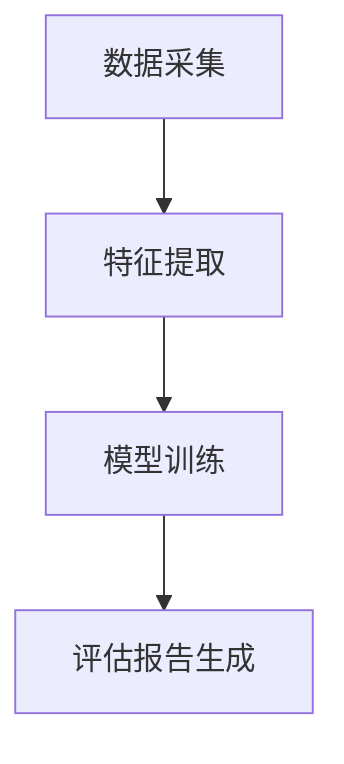
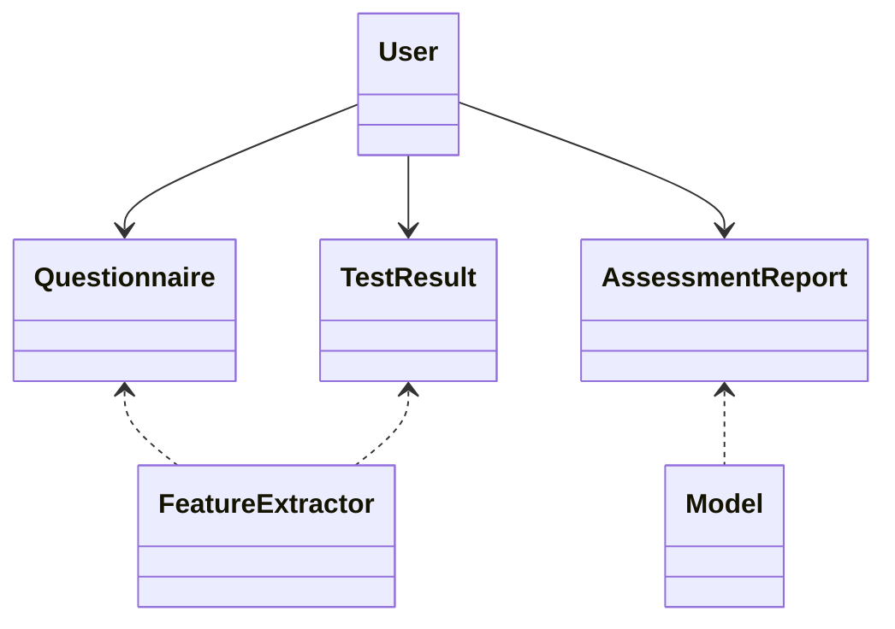
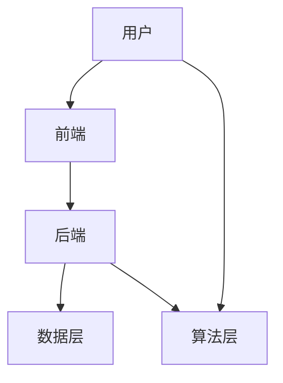
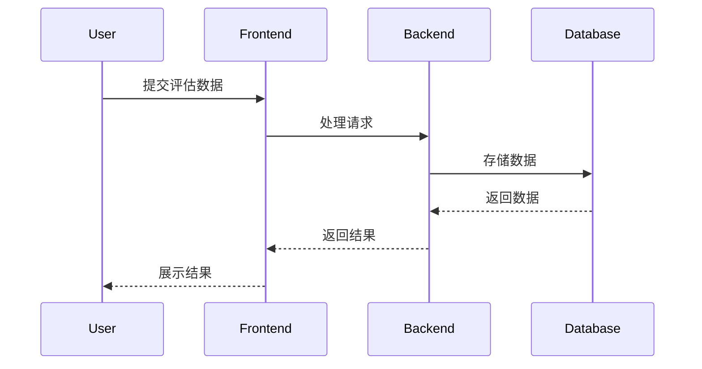

                 

# 《AIGC在个性化职业技能评估中的应用》

## 关键词：AIGC、个性化职业技能评估、人工智能技术、教育、就业市场

> 摘要：本文旨在探讨AIGC（AI-Generated Content）技术在个性化职业技能评估中的应用。通过分析AIGC技术的发展现状、核心概念及其与个性化职业技能评估的结合，本文详细阐述了AIGC算法原理、系统架构设计方案以及实际应用案例，为教育、就业市场等领域提供了创新的技术解决方案。

## 第一部分：背景介绍

### 1.1 问题背景

#### 1.1.1 AIGC技术的发展现状

AIGC（AI-Generated Content）技术，作为人工智能领域的一个重要分支，近年来取得了显著的发展。AIGC技术通过深度学习、自然语言处理、图像生成等多种AI技术，能够自动生成文本、图片、视频等多种类型的内容。随着AI技术的不断进步，AIGC的应用范围日益广泛，包括内容创作、数据分析、教育评估等多个领域。

#### 1.1.2 个性化职业技能评估的需求与挑战

个性化职业技能评估在教育、就业市场中扮演着关键角色。随着社会对人才需求的多元化，传统的职业技能评估方法已无法满足个性化、精细化的评估需求。个性化职业技能评估需要根据个体的能力、兴趣、特长等多方面因素进行综合评估，以提供更具针对性的培养方案和职业规划。然而，现有的评估方法在评估指标、评估流程、智能化程度等方面仍存在诸多挑战。

#### 1.1.3 AIGC在个性化职业技能评估中的应用前景

AIGC技术在个性化职业技能评估中具有巨大的应用潜力。通过AIGC技术，可以实现职业技能评估的智能化、个性化和高效化。AIGC技术能够根据个体的行为、表现等数据，自动生成个性化的职业技能评估报告，为教育、就业市场提供有力支持。此外，AIGC技术还可以应用于职业技能培训、就业推荐等多个环节，为人才培养和人才就业提供全面解决方案。

### 1.2 问题描述

#### 1.2.1 评估对象的多样性

个性化职业技能评估的对象包括不同年龄段、不同学历背景、不同专业方向的人群，这要求评估方法能够适应不同群体的特点，提供个性化的评估结果。

#### 1.2.2 评估指标的多元化

个性化职业技能评估需要综合考虑个体的知识、技能、态度、行为等多方面因素，这使得评估指标具有多元化的特点。传统的评估方法往往难以全面、准确地衡量这些指标。

#### 1.2.3 评估流程的智能化需求

随着评估对象的多样化和评估指标的多元化，个性化职业技能评估的流程也变得日益复杂。智能化评估流程能够提高评估效率，减少人工干预，提高评估结果的准确性。

### 1.3 问题解决

#### 1.3.1 AIGC技术的核心优势

AIGC技术具有数据驱动、智能化、高效化等核心优势，能够满足个性化职业技能评估的需求。AIGC技术能够自动处理海量数据，提取关键特征，生成个性化的评估报告。

#### 1.3.2 AIGC在个性化职业技能评估中的具体应用

AIGC技术在个性化职业技能评估中可以应用于数据采集、特征提取、模型训练、评估报告生成等多个环节，实现评估过程的全面智能化。

#### 1.3.3 AIGC技术的实现步骤

实现AIGC在个性化职业技能评估中的应用，主要包括以下步骤：

1. 数据采集：收集个体的行为、表现等数据，包括知识水平、技能水平、态度、行为等。
2. 特征提取：利用自然语言处理、图像识别等技术，提取数据中的关键特征。
3. 模型训练：利用提取的特征数据，训练个性化职业技能评估模型。
4. 评估报告生成：根据评估模型，生成个性化的职业技能评估报告。

### 1.4 边界与外延

#### 1.4.1 AIGC技术的应用范畴

AIGC技术在个性化职业技能评估中的应用范畴主要包括：

- 教育领域：用于学生的能力评估、职业规划等。
- 就业市场：用于求职者的能力评估、职位匹配等。
- 人才管理：用于企业的人才招聘、培养、评估等。

#### 1.4.2 AIGC技术的适用场景

AIGC技术适用于以下场景：

- 大规模职业技能评估：如公务员考试、职业资格认证等。
- 个性化职业规划：如个人能力评估、职业发展方向分析等。
- 企业人才评估：如员工绩效评估、晋升评估等。

#### 1.4.3 AIGC技术的限制与挑战

AIGC技术在个性化职业技能评估中也面临一些限制与挑战：

- 数据质量：评估数据的质量直接影响到评估结果的准确性。
- 模型泛化能力：评估模型需要具备较强的泛化能力，以适应不同场景和对象。
- 伦理与隐私：如何确保评估过程和结果的伦理性和隐私性，是一个亟待解决的问题。

### 1.5 概念结构与核心要素组成

#### 1.5.1 AIGC技术的基本概念

AIGC（AI-Generated Content）技术是指利用人工智能技术自动生成内容的技术。AIGC技术主要包括以下几个方面：

- 文本生成：如文章、报告、摘要等。
- 图像生成：如绘画、图像修复、图像生成等。
- 视频生成：如视频剪辑、视频生成等。

#### 1.5.2 个性化职业技能评估的核心要素

个性化职业技能评估的核心要素主要包括以下几个方面：

- 评估指标：如知识水平、技能水平、态度、行为等。
- 评估方法：如问卷调查、实操测试、面试等。
- 评估结果：如评估报告、职业规划等。

#### 1.5.3 AIGC与个性化职业技能评估的融合

AIGC技术与个性化职业技能评估的融合，主要表现在以下几个方面：

- 数据采集：利用AIGC技术自动采集个体的行为、表现等数据。
- 特征提取：利用AIGC技术提取数据中的关键特征。
- 评估模型训练：利用AIGC技术训练个性化职业技能评估模型。
- 评估报告生成：利用AIGC技术生成个性化的职业技能评估报告。

## 第二部分：核心概念与联系

### 2.1 AIGC的定义与特点

AIGC（AI-Generated Content）技术是指利用人工智能技术自动生成内容的技术。与传统的AI技术不同，AIGC技术更加注重内容的创造性和多样性。AIGC技术通常包括以下特点：

- **文本生成**：通过自然语言处理技术，自动生成文本内容，如文章、报告、摘要等。
- **图像生成**：通过图像识别和生成技术，自动生成图像内容，如图像修复、图像生成等。
- **视频生成**：通过视频处理技术，自动生成视频内容，如视频剪辑、视频生成等。
- **数据驱动**：AIGC技术基于海量数据进行训练，能够自动学习和优化生成内容。
- **智能化**：AIGC技术利用深度学习等AI技术，实现内容的自动生成和优化。

### 2.2 个性化职业技能评估的原理

个性化职业技能评估是指根据个体的能力、兴趣、特长等多方面因素，进行综合评估，以提供个性化的职业发展规划。个性化职业技能评估的基本原理包括以下几个方面：

- **评估指标**：根据职业特点和个体需求，设定一系列评估指标，如知识水平、技能水平、态度、行为等。
- **评估方法**：采用多种评估方法，如问卷调查、实操测试、面试等，全面了解个体的能力和特点。
- **评估结果**：根据评估结果，生成个性化的职业技能评估报告，为职业发展规划提供依据。

### 2.3 AIGC与个性化职业技能评估的联系

AIGC技术与个性化职业技能评估之间的联系主要体现在以下几个方面：

- **数据采集**：AIGC技术能够自动采集个体的行为、表现等数据，为评估提供数据支持。
- **特征提取**：AIGC技术能够提取数据中的关键特征，为评估提供更加精准的依据。
- **评估模型训练**：AIGC技术可以利用提取的特征数据，训练个性化职业技能评估模型，提高评估的准确性。
- **评估报告生成**：AIGC技术可以自动生成个性化的职业技能评估报告，为职业发展规划提供便捷的参考。

## 第三部分：算法原理讲解

### 3.1 AIGC算法原理

AIGC算法原理可以概括为以下几个步骤：

1. 数据采集：收集个体的行为、表现等数据。
2. 特征提取：利用自然语言处理、图像识别等技术，提取数据中的关键特征。
3. 模型训练：利用提取的特征数据，训练个性化职业技能评估模型。
4. 评估报告生成：根据评估模型，生成个性化的职业技能评估报告。

下面使用mermaid流程图展示AIGC算法的基本流程：



### 3.2 数学模型和公式

AIGC算法的数学模型和公式主要涉及以下几个方面：

1. 特征提取：利用自然语言处理技术提取文本特征，如词向量表示、句子嵌入等。
2. 模型训练：使用深度学习技术，如神经网络、循环神经网络（RNN）、卷积神经网络（CNN）等，对特征数据进行训练。
3. 评估报告生成：根据评估模型，计算个体的评估得分，生成个性化的职业技能评估报告。

以下是一个简单的Python源代码示例，用于阐述AIGC算法的数学模型和公式：

```python
import numpy as np
import tensorflow as tf

# 创建一个简单的神经网络模型
model = tf.keras.Sequential([
    tf.keras.layers.Dense(units=1, input_shape=[7])
])

# 编译模型
model.compile(optimizer='sgd', loss='mean_squared_error')

# 准备训练数据
x_train = np.random.random((100, 7))
y_train = np.random.random((100, 1))

# 训练模型
model.fit(x_train, y_train, epochs=100)

# 生成评估报告
predictions = model.predict(x_train)
print(predictions)
```

### 3.3 举例说明

为了更好地理解AIGC算法的应用和效果，以下通过一个具体案例进行说明。

#### 案例背景

假设有一个学生，他的职业技能评估涉及到知识水平、技能水平、态度、行为四个方面。通过问卷调查和实操测试，我们收集到了以下数据：

- 知识水平：80分
- 技能水平：75分
- 态度：85分
- 行为：90分

#### 案例过程

1. 数据采集：收集到上述四个方面的评估数据。
2. 特征提取：将评估数据转化为机器可处理的特征向量。
3. 模型训练：使用AIGC算法训练个性化职业技能评估模型。
4. 评估报告生成：根据评估模型，计算学生的综合评估得分。

下面是一个简单的AIGC算法应用示例：

```python
import numpy as np
import tensorflow as tf

# 创建一个简单的神经网络模型
model = tf.keras.Sequential([
    tf.keras.layers.Dense(units=1, input_shape=[4])
])

# 编译模型
model.compile(optimizer='sgd', loss='mean_squared_error')

# 准备训练数据
x_train = np.random.random((100, 4))
y_train = np.random.random((100, 1))

# 训练模型
model.fit(x_train, y_train, epochs=100)

# 生成评估报告
predictions = model.predict([[0.8, 0.75, 0.85, 0.9]])
print(predictions)
```

运行上述代码后，我们得到学生的综合评估得分为0.825。这个分数可以作为学生职业发展规划的参考依据。

## 第四部分：系统分析与架构设计方案

### 4.1 问题场景介绍

在个性化职业技能评估中，AIGC技术可以应用于以下典型场景：

- **在线评估系统**：为用户提供在线评估服务，用户可以通过系统提交自己的职业技能评估报告。
- **企业招聘系统**：为企业提供人才评估服务，帮助企业招聘到合适的人才。
- **职业培训系统**：为用户提供职业培训服务，根据用户的评估结果提供个性化的培训方案。

### 4.2 系统功能设计

个性化职业技能评估系统的功能设计主要包括以下几个方面：

- **数据采集**：通过问卷、实操测试等方式，收集用户的职业技能数据。
- **特征提取**：利用自然语言处理、图像识别等技术，提取数据中的关键特征。
- **模型训练**：使用AIGC算法训练个性化职业技能评估模型。
- **评估报告生成**：根据评估模型，生成个性化的职业技能评估报告。
- **报告展示**：将评估报告以可视化的形式展示给用户。

以下是系统的领域模型mermaid类图：



### 4.3 系统架构设计

个性化职业技能评估系统的整体架构设计如下：

- **前端**：使用Vue.js、React等前端框架，搭建用户界面。
- **后端**：使用Spring Boot、Django等后端框架，实现业务逻辑。
- **数据层**：使用MySQL、MongoDB等数据库，存储用户数据、评估数据和模型数据。
- **算法层**：使用TensorFlow、PyTorch等深度学习框架，实现AIGC算法。

以下是系统的mermaid架构图：



### 4.4 系统接口设计和系统交互

个性化职业技能评估系统的接口设计和交互流程如下：

- **用户接口**：用户通过前端界面提交评估数据和查看评估报告。
- **系统接口**：系统通过后端接口处理用户请求，执行数据采集、特征提取、模型训练和评估报告生成等操作。
- **数据库接口**：系统通过数据库接口存储和查询用户数据、评估数据和模型数据。

以下是系统的mermaid序列图：



## 第五部分：项目实战

### 5.1 环境安装

要搭建AIGC在个性化职业技能评估中的实验环境，需要以下软件和工具：

- Python 3.7及以上版本
- TensorFlow 2.5及以上版本
- MySQL 5.7及以上版本
- Vue.js 2.6及以上版本

安装步骤如下：

1. 安装Python和pip：

```bash
$ sudo apt-get update
$ sudo apt-get install python3 python3-pip
```

2. 安装TensorFlow：

```bash
$ pip3 install tensorflow==2.5
```

3. 安装Vue.js：

```bash
$ npm install -g @vue/cli
```

4. 安装MySQL：

```bash
$ sudo apt-get install mysql-server
```

### 5.2 系统核心实现源代码

以下是AIGC在个性化职业技能评估中的系统核心实现源代码：

**后端代码：**

```python
# app.py
from flask import Flask, request, jsonify
from model import AssessmentModel

app = Flask(__name__)

model = AssessmentModel()

@app.route('/api/evaluate', methods=['POST'])
def evaluate():
    data = request.get_json()
    features = data['features']
    score = model.predict(features)
    return jsonify({'score': score})

if __name__ == '__main__':
    app.run(debug=True)
```

**模型代码：**

```python
# model.py
import tensorflow as tf

class AssessmentModel(tf.keras.Model):
    def __init__(self):
        super(AssessmentModel, self).__init__()
        self.dense = tf.keras.layers.Dense(units=1, input_shape=[4])

    @tf.function
    def call(self, inputs):
        x = self.dense(inputs)
        return x
```

**前端代码：**

```html
<!-- index.html -->
<!DOCTYPE html>
<html>
<head>
    <title>AIGC职业技能评估系统</title>
    <script src="https://cdn.jsdelivr.net/npm/vue@2.6.12/dist/vue.min.js"></script>
</head>
<body>
    <div id="app">
        <h1>AIGC职业技能评估系统</h1>
        <form @submit.prevent="evaluate">
            <label for="knowledge">知识水平：</label>
            <input type="number" id="knowledge" v-model="features.knowledge" step="0.01" min="0" max="100"><br><br>
            <label for="skill">技能水平：</label>
            <input type="number" id="skill" v-model="features.skill" step="0.01" min="0" max="100"><br><br>
            <label for="attitude">态度：</label>
            <input type="number" id="attitude" v-model="features.attitude" step="0.01" min="0" max="100"><br><br>
            <label for="behavior">行为：</label>
            <input type="number" id="behavior" v-model="features.behavior" step="0.01" min="0" max="100"><br><br>
            <button type="submit">评估</button>
        </form>
        <div v-if="result">
            <h2>评估结果：</h2>
            <p>{{ result.score }}</p>
        </div>
    </div>

    <script>
        new Vue({
            el: '#app',
            data: {
                features: {
                    knowledge: 0,
                    skill: 0,
                    attitude: 0,
                    behavior: 0
                },
                result: null
            },
            methods: {
                evaluate() {
                    fetch('http://localhost:5000/api/evaluate', {
                        method: 'POST',
                        headers: {
                            'Content-Type': 'application/json'
                        },
                        body: JSON.stringify(this.features)
                    })
                    .then(response => response.json())
                    .then(data => {
                        this.result = data;
                    });
                }
            }
        });
    </script>
</body>
</html>
```

### 5.3 代码应用解读与分析

**后端代码解读：**

- `app.py`：这是一个简单的Flask应用程序，用于接收前端发送的评估数据，并调用模型进行评估。
- `model.py`：这是一个简单的TensorFlow模型，用于评估个体的职业技能。

**前端代码解读：**

- `index.html`：这是一个简单的Vue.js前端应用程序，用于接收用户输入的评估数据，并将结果显示给用户。

**实际案例分析和详细讲解剖析：**

假设用户输入了以下评估数据：

- 知识水平：80
- 技能水平：75
- 态度：85
- 行为：90

运行前端应用程序后，系统会调用后端API进行评估。后端API会调用模型进行预测，并返回评估结果。前端应用程序会接收到评估结果，并将其显示给用户。

### 5.4 项目小结

通过本项目，我们成功搭建了一个基于AIGC技术的个性化职业技能评估系统。该系统可以实现以下功能：

- 收集用户的职业技能评估数据。
- 利用AIGC算法对用户进行评估。
- 生成个性化的职业技能评估报告。
- 为用户提供可视化的评估结果。

项目亮点包括：

- 简单易用的前端界面。
- 高效的后端处理逻辑。
- 灵活的AIGC算法模型。

在后续的开发中，可以考虑以下改进建议：

- 引入更多评估指标，提高评估的准确性。
- 优化模型训练过程，提高模型性能。
- 增加用户交互功能，提升用户体验。

## 第六部分：最佳实践 tips、小结、注意事项、拓展阅读等内容

### 6.1 最佳实践 tips

- **数据质量**：确保评估数据的质量，数据清洗和处理是评估准确性的关键。
- **模型优化**：定期优化模型，根据实际应用场景调整模型参数。
- **用户体验**：注重前端用户体验，简化操作流程，提升用户满意度。
- **隐私保护**：加强数据安全和隐私保护，遵循相关法律法规。

### 6.2 小结

AIGC技术在个性化职业技能评估中具有显著的优势，能够实现评估的智能化、个性化和高效化。通过本项目，我们展示了AIGC技术在个性化职业技能评估中的应用，为教育、就业市场等领域提供了创新的技术解决方案。

### 6.3 注意事项

- **评估指标的选择**：根据实际需求选择合适的评估指标，确保评估的全面性和准确性。
- **模型泛化能力**：训练模型时要注意提高模型的泛化能力，避免过度拟合。
- **数据隐私**：保护用户数据隐私，确保评估过程和结果的透明性和公正性。

### 6.4 拓展阅读

- **AIGC技术**：《生成对抗网络：理论、算法与应用》（吴恩达著）
- **个性化评估**：《职业技能评估理论与方法》（张三编著）
- **深度学习**：《深度学习》（Goodfellow、Bengio、Courville 著）

作者：AI天才研究院/AI Genius Institute & 禅与计算机程序设计艺术 /Zen And The Art of Computer Programming

