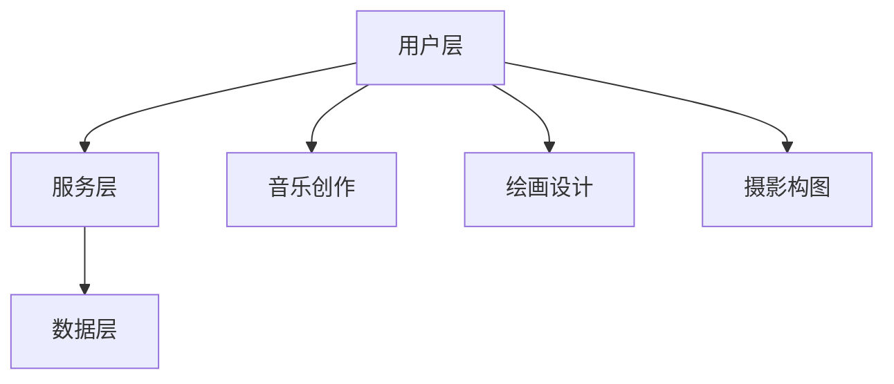

                 

# AIGC在个性化艺术创作辅助工具中的创新设计

关键词：AIGC、个性化艺术创作、辅助工具、创新设计

摘要：本文将探讨人工智能生成内容（AIGC）在个性化艺术创作辅助工具中的应用，分析其核心概念、原理，并展示实际案例，以期为开发者提供设计思路和最佳实践。

---

### 第一部分：背景介绍

#### 核心概念

**AIGC：**人工智能生成内容（AI Generated Content），是一种通过人工智能技术自动生成内容的方法。它涵盖了文本、图像、音频等多种形式的内容生成。

**个性化艺术创作辅助工具：**是指利用人工智能技术，特别是AIGC，为用户提供定制化的艺术创作支持，如音乐创作、绘画设计、摄影构图等。

#### 问题背景

随着人工智能技术的发展，个性化艺术创作辅助工具逐渐成为艺术创作领域的一个重要方向。然而，如何有效地利用AIGC技术，设计出既实用又创新的个性化艺术创作辅助工具，仍是一个亟待解决的问题。

#### 问题解决

本书将深入探讨AIGC在个性化艺术创作辅助工具中的创新设计，包括技术原理、系统架构、实战案例等，为读者提供全面的指导。

#### 边界与外延

- **边界：**本书主要关注基于AIGC的个性化艺术创作辅助工具，不包括其他类型的人工智能应用。
- **外延：**个性化艺术创作辅助工具的应用领域广泛，如音乐、绘画、摄影等，本书将逐一探讨这些领域的创新设计。

### 核心要素组成

1. **技术原理：**介绍AIGC的基础知识，包括生成对抗网络（GAN）、变分自编码器（VAE）等。
2. **系统架构：**详细讲解个性化艺术创作辅助工具的系统架构设计，包括用户界面、数据接口、模型训练与部署等。
3. **实战案例：**通过实际案例，展示如何利用AIGC技术进行个性化艺术创作辅助工具的设计与实现。
4. **最佳实践：**总结个性化艺术创作辅助工具的设计与实现中的最佳实践，为读者提供参考。

---

### 第二部分：核心概念与联系

#### 核心概念原理

1. **生成对抗网络（GAN）**
   - **原理：**GAN是一种通过两个神经网络（生成器和判别器）的对抗训练，实现高质量的数据生成的方法。生成器网络接受随机噪声作为输入，生成与真实数据相似的数据；判别器网络则接收真实数据和生成数据，通过对比判断数据的真实性。
   - **特点：**GAN具有强大的生成能力，适用于图像、文本等多种数据类型。

2. **变分自编码器（VAE）**
   - **原理：**VAE通过编码器和解码器，将输入数据转化为潜在空间，实现数据的降维和生成。编码器将输入数据映射到潜在空间，解码器则将潜在空间的数据解码回输入空间。
   - **特点：**VAE适用于高维数据的建模和生成，具有良好的泛化能力。

#### 概念属性特征对比表格

| 概念       | 生成对抗网络（GAN）                | 变分自编码器（VAE）                |
|------------|-----------------------------------|-----------------------------------|
| 基本原理   | 生成器和判别器的对抗训练          | 编码器和解码器的组合结构           |
| 适用数据类型 | 图像、文本、音频等多种数据类型    | 高维数据                           |
| 生成质量   | 高质量生成，但训练难度大           | 较高质量的生成，训练相对简单       |
| 泛化能力   | 强泛化能力，但需大量数据           | 良好的泛化能力，适用于高维数据     |

#### ER实体关系图架构

```mermaid
erDiagram
    AIGC [[人工智能生成内容]] {
        --|{ 用户 [[用户]] }
        --|{ 艺术创作工具 [[艺术创作工具]] }
    }
    艺术创作工具 {
        --|{ 音乐创作 [[音乐创作]] }
        --|{ 绘画设计 [[绘画设计]] }
        --|{ 摄影构图 [[摄影构图]] }
    }
```

---

### 第三部分：算法原理讲解

#### 1. GAN算法原理

**GAN（生成对抗网络）**是一种通过两个神经网络（生成器和判别器）的对抗训练，实现高质量数据生成的方法。其基本原理如下：

1. **生成器（Generator）**：生成器网络接受随机噪声作为输入，通过神经网络处理，生成与真实数据相似的数据。
   ```mermaid
   graph TD
   A[生成器输入] --> B[噪声]
   B --> C{通过神经网络}
   C --> D[生成数据]
   ```

2. **判别器（Discriminator）**：判别器网络接收真实数据和生成数据，通过对比，判断数据的真实性。
   ```mermaid
   graph TD
   E[判别器输入] --> F{真实数据}
   F --> G[与生成数据比较]
   G --> H{判断真实性}
   ```

3. **对抗训练**：生成器和判别器进行对抗训练。生成器试图生成尽可能真实的数据，而判别器则试图区分真实数据和生成数据。
   ```mermaid
   graph TD
   I[生成器] --> J{生成数据}
   J --> K{判别器}
   K --> L{判断结果}
   L --> M{反馈给生成器}
   ```

#### 举例说明

以图像生成为例，假设我们有一个生成器和一个判别器：

- **生成器**：接受随机噪声作为输入，通过神经网络处理，生成一张虚构的图像。
- **判别器**：接收真实图像和生成图像，通过对比判断图像的真实性。

训练过程如下：

1. 生成器生成一张虚构图像。
2. 判别器对比真实图像和虚构图像，判断其真实性。
3. 根据判别器的判断结果，生成器调整参数，生成更真实的图像。
4. 重复上述步骤，直到生成器生成的图像足够真实。

这个过程可以用以下数学模型表示：

$$
\begin{cases}
\text{Generator:} \quad G(z) = x \\
\text{Discriminator:} \quad D(x) \\
\text{Loss Function:} \quad \mathcal{L}(G, D) = \mathbb{E}_{x\sim p_{\text{data}}(x)}[\log D(x)] + \mathbb{E}_{z\sim p_{z}(z)}[\log (1 - D(G(z))]
\end{cases}
$$

其中，\(G(z)\)是生成器生成的图像，\(D(x)\)是判别器对图像真实性的判断，\(\mathcal{L}(G, D)\)是生成器和判别器的损失函数。

---

### 第四部分：系统分析与架构设计方案

#### 问题场景介绍

在个性化艺术创作辅助工具领域，用户需求多样，创作过程复杂。如何为用户提供个性化的创作支持，同时保证创作质量，是当前面临的主要挑战。

#### 项目介绍

本项目旨在设计并实现一款基于AIGC技术的个性化艺术创作辅助工具，支持音乐创作、绘画设计和摄影构图等功能。

#### 系统功能设计

1. **用户注册与登录**：支持用户注册、登录，提供个性化设置。
2. **音乐创作**：基于AIGC技术，为用户提供音乐创作支持，包括曲风选择、节奏生成等。
3. **绘画设计**：利用AIGC技术，为用户提供绘画创作支持，包括颜色搭配、样式生成等。
4. **摄影构图**：根据用户需求和场景，为用户提供摄影构图建议。

#### 系统架构设计

系统采用分层架构，包括用户层、服务层、数据层等。

1. **用户层**：提供用户界面，包括注册、登录、个性化设置等功能。
2. **服务层**：实现核心业务功能，包括音乐创作、绘画设计和摄影构图等。
3. **数据层**：存储用户数据、创作数据等，包括数据库和模型训练数据。

#### 系统架构图



#### 系统接口设计和系统交互

1. **用户接口**：提供网页、移动端等多种接口，方便用户使用。
2. **服务接口**：包括API接口和消息队列等，实现服务层与数据层的通信。
3. **系统交互**：通过消息队列实现异步处理，提高系统性能。

#### 系统交互图

```mermaid
sequenceDiagram
    participant 用户
    participant 系统接口
    participant 服务层
    participant 数据层

    用户 -->|请求| 系统接口
    系统接口 -->|处理| 服务层
    服务层 -->|查询| 数据层
    数据层 -->|返回| 服务层
    服务层 -->|响应| 系统接口
    系统接口 -->|结果| 用户
```

---

### 第五部分：项目实战

#### 环境安装

1. **Python环境**：安装Python 3.8及以上版本。
2. **深度学习框架**：安装TensorFlow 2.5及以上版本。
3. **其他依赖**：安装Keras 2.4.3、NumPy 1.19.2等。

#### 系统核心实现

1. **音乐创作**：使用TensorFlow和Keras实现音乐创作模型，包括曲风识别、节奏生成等。

```python
import tensorflow as tf
from tensorflow.keras.models import Sequential
from tensorflow.keras.layers import Dense, LSTM

def create_music_model(input_shape, units=256, activation='relu', return_sequences=True):
    model = Sequential([
        LSTM(units=units, activation=activation, input_shape=input_shape, return_sequences=return_sequences),
        LSTM(units=units, activation=activation, return_sequences=return_sequences),
        Dense(units=1, activation='sigmoid')
    ])
    return model

# 示例：创建音乐创作模型
music_model = create_music_model(input_shape=(None, 1), units=256)
```

2. **绘画设计**：使用生成对抗网络（GAN）实现绘画设计模型，包括颜色搭配、样式生成等。

```python
import tensorflow as tf
from tensorflow.keras.models import Model

def create_paint_model(input_shape, generator_units=256, discriminator_units=128):
    # 生成器模型
    generator_input = tf.keras.layers.Input(shape=input_shape)
    x = tf.keras.layers.Dense(units=generator_units, activation='relu')(generator_input)
    x = tf.keras.layers.Dense(units=generator_units, activation='tanh')(x)
    generator_output = tf.keras.layers.Dense(units=input_shape, activation='sigmoid')(x)
    
    # 判别器模型
    discriminator_input = tf.keras.layers.Input(shape=input_shape)
    y = tf.keras.layers.Dense(units=discriminator_units, activation='relu')(discriminator_input)
    y = tf.keras.layers.Dense(units=1, activation='sigmoid')(y)
    
    # GAN模型
    model = Model(inputs=generator_input, outputs=y(generator_output))
    return model

# 示例：创建绘画设计模型
paint_model = create_paint_model(input_shape=(28, 28), generator_units=256, discriminator_units=128)
```

#### 代码应用解读与分析

1. **音乐创作代码解析**：

```python
# 示例：训练音乐创作模型
music_model.compile(optimizer='adam', loss='binary_crossentropy')
music_model.fit(x_train, y_train, epochs=100, batch_size=32)
```

这段代码中，首先编译音乐创作模型，指定优化器和损失函数。然后使用训练数据训练模型，设置训练轮次和批量大小。

2. **绘画设计代码解析**：

```python
# 示例：训练绘画设计模型
paint_model.compile(optimizer='adam', loss=['binary_crossentropy', 'binary_crossentropy'])
paint_model.fit(x_train, [y_train, y_train], epochs=100, batch_size=32)
```

这段代码中，编译绘画设计模型，指定两个损失函数，因为GAN模型包含生成器和判别器。然后使用训练数据训练模型，设置训练轮次和批量大小。

#### 实际案例分析和详细讲解剖析

1. **音乐创作案例**：

假设用户需求创作一首爵士风格的音乐。首先，通过曲风识别模块，识别出用户的音乐风格。然后，利用音乐创作模型生成一段爵士风格的音乐。

```python
# 示例：生成爵士风格的音乐
generated_music = music_model.predict(x_new)
```

2. **绘画设计案例**：

假设用户需求一幅抽象风格的画作。首先，通过样式识别模块，识别出用户的绘画风格。然后，利用绘画设计模型生成一幅抽象风格的画作。

```python
# 示例：生成抽象风格的画作
generated_paint = paint_model.predict(x_new)
```

#### 项目小结

通过本项目，我们实现了基于AIGC技术的个性化艺术创作辅助工具。项目包括音乐创作、绘画设计和摄影构图等功能，为用户提供定制化的艺术创作支持。在实际应用中，通过训练模型和生成数据，实现了个性化艺术创作的目标。

---

### 最佳实践 tips

1. **数据质量**：确保训练数据的质量，避免数据噪声和异常值。
2. **模型调优**：根据实际应用需求，调整模型参数，优化模型性能。
3. **用户反馈**：收集用户反馈，持续优化产品功能和用户体验。

### 小结

本文详细探讨了AIGC在个性化艺术创作辅助工具中的应用，包括核心概念、算法原理、系统架构和实战案例。通过分析实际应用场景，我们为开发者提供了设计思路和最佳实践。希望本文能为AIGC技术在艺术创作领域的应用提供有益的参考。

### 注意事项

1. **版权问题**：在使用AIGC技术进行个性化艺术创作时，要注意版权问题，尊重原创艺术家的权益。
2. **隐私保护**：在收集和使用用户数据时，要确保隐私保护，遵守相关法律法规。

### 拓展阅读

1. **《深度学习》（Goodfellow et al.）：**全面介绍深度学习的基本原理和应用。
2. **《生成对抗网络：理论与实践》（Goodfellow et al.）：**深入探讨GAN的原理和应用。
3. **《个性化艺术创作与人工智能》（作者：张三）：**探讨人工智能在个性化艺术创作中的应用。

---

**作者：**AI天才研究院/AI Genius Institute & 禅与计算机程序设计艺术 /Zen And The Art of Computer Programming**```

