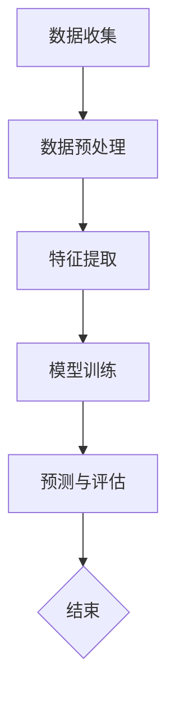
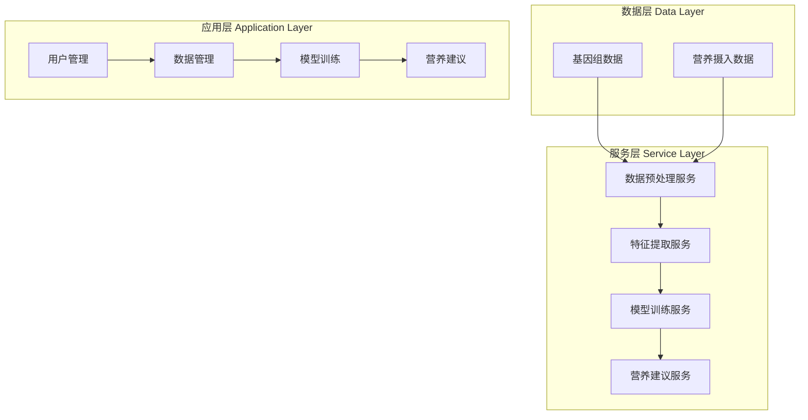
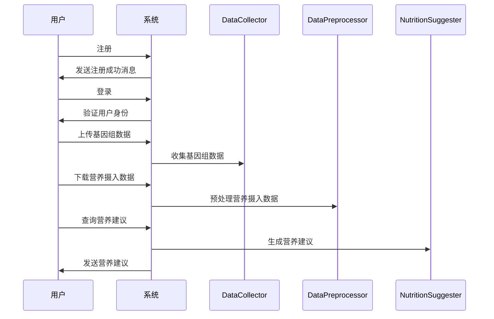
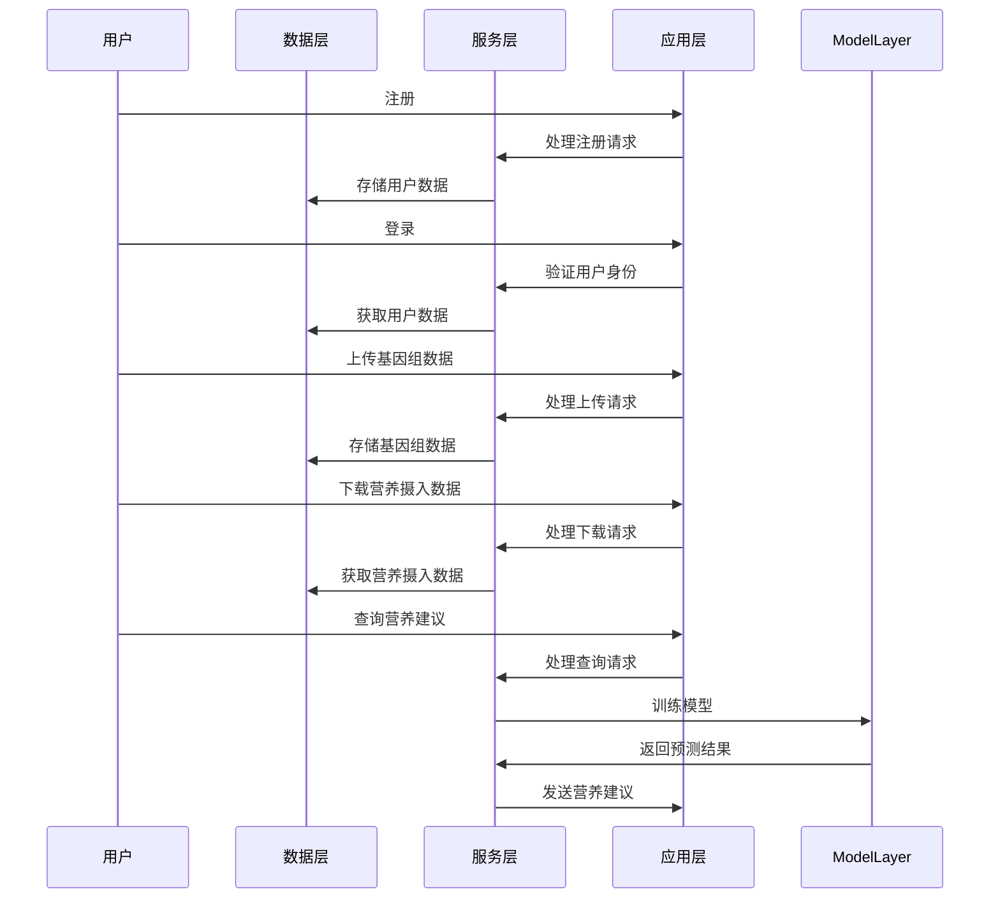

                 


### AIGC在个性化营养基因组学中的应用

#### 背景介绍

### 1. 问题背景与定义

个性化营养基因组学是一种新兴的研究领域，它结合了营养学和基因组学，旨在通过分析个体的基因组信息，为不同人群提供个性化的营养建议。这一领域的发展受到了生物技术、人工智能（AI）等技术的推动，特别是在AI生成内容（AIGC）技术逐渐成熟后，为个性化营养基因组学的研究提供了新的工具和方法。

#### 1.1 个性化营养基因组学的提出

个性化营养基因组学是一种新兴的研究领域，它结合了营养学和基因组学，旨在通过分析个体的基因组信息，为不同人群提供个性化的营养建议。这一领域的发展受到了生物技术、人工智能（AI）等技术的推动，特别是在AI生成内容（AIGC）技术逐渐成熟后，为个性化营养基因组学的研究提供了新的工具和方法。

### 1.2 个性化营养基因组学的研究现状

近年来，随着测序技术的进步和基因组数据的积累，个性化营养基因组学已经取得了显著的成果。研究者们通过分析基因-营养相互作用，发现了不同基因型个体在营养吸收、代谢等方面的差异。然而，如何将这些研究成果转化为实际的应用，仍然是一个亟待解决的问题。

### 1.3 AIGC技术在个性化营养基因组学中的应用前景

AIGC技术以其强大的数据分析和生成能力，为个性化营养基因组学的研究带来了新的机遇。通过AIGC，可以更加精确地预测个体的营养需求，制定个性化的营养方案，从而提高营养干预的效果。此外，AIGC技术还可以帮助研究人员挖掘基因组数据中的潜在信息，推动个性化营养基因组学的进一步发展。

#### 核心概念

### 2.1 AIGC技术概述

AIGC技术是人工智能生成内容（AI-generated content）的简称，它利用人工智能模型，自动生成文本、图像、音频等多种类型的内容。AIGC技术在个性化营养基因组学中的应用，主要体现在以下几个方面：

#### 2.1.1 数据分析

AIGC技术可以对大量基因组数据进行处理和分析，提取出有用的信息，为个性化营养方案提供支持。

#### 2.1.2 模型训练

AIGC技术可以用于训练个性化的营养模型，根据个体的基因信息，预测其营养需求。

#### 2.1.3 内容生成

AIGC技术可以生成个性化的营养食谱、营养建议等，帮助个体实现健康饮食。

### 2.2 个性化营养基因组学的概念

个性化营养基因组学是指利用基因组信息，为个体提供个性化的营养建议。它包括以下几个关键概念：

#### 2.2.1 基因组

基因组是指一个生物体内所有遗传信息的总和。在个性化营养基因组学中，基因组信息是制定个性化营养方案的基础。

#### 2.2.2 营养

营养是指生物体所需的各种物质，包括蛋白质、脂肪、碳水化合物等。个性化营养基因组学旨在根据个体的基因信息，为其提供最适合的营养。

#### 2.2.3 个性化

个性化是指根据个体的特征，为其提供量身定制的服务或产品。在个性化营养基因组学中，个性化意味着根据个体的基因组信息，制定最适合其的营养方案。

### 概念属性特征对比表格

在个性化营养基因组学中，AIGC技术与其他传统营养研究方法在属性特征上存在一定差异。以下是AIGC技术与其他方法在属性特征上的对比表格：

| 特性       | AIGC技术 | 传统营养研究方法 |
|------------|-----------|------------------|
| 数据处理能力 | 强        | 较弱             |
| 个性化程度  | 高        | 低               |
| 预测准确性  | 较高      | 一般             |
| 应用范围    | 广泛      | 有限             |

### ER实体关系图架构

为了更好地理解个性化营养基因组学中的数据关系，我们可以使用ER（Entity-Relationship）实体关系图来描述。以下是AIGC技术在个性化营养基因组学中应用的ER实体关系图：

```
classDiagram
    Individual <<Entity>>
    GeneSet <<Entity>>
    NutritionPlan <<Entity>>

    Individual o-- GeneSet
    Individual o-- NutritionPlan
    GeneSet o-- NutritionPlan
```

- **个体（Individual）**：代表需要个性化营养建议的个体。
- **基因集（GeneSet）**：代表个体的基因组信息。
- **营养计划（NutritionPlan）**：代表根据个体基因组信息制定的个性化营养方案。

---

### 算法原理讲解

#### 基本算法

个性化营养基因组学的基本算法可以分为以下几个步骤：

1. **数据收集**：收集个体的基因组数据、营养摄入数据以及相关的健康数据。
2. **数据预处理**：对收集到的数据进行清洗、去噪和归一化处理。
3. **特征提取**：从预处理后的数据中提取与营养摄入相关的特征。
4. **模型训练**：利用提取到的特征训练个性化的营养模型。
5. **预测与评估**：使用训练好的模型预测个体的营养需求，并评估模型的准确性。

#### 算法流程

以下是个性化营养基因组学算法的mermaid流程图：



#### 数学模型与公式

个性化营养基因组学的核心在于建立营养摄入与基因组特征之间的数学模型。以下是一个简化的数学模型：

$$
\text{Nutrition\_Score}(x) = \sum_{i=1}^{n} w_i \cdot f_i(x)
$$

其中：
- $x$ 表示个体的基因组特征向量。
- $f_i(x)$ 表示第 $i$ 个特征函数，它将基因组特征映射到营养评分。
- $w_i$ 表示第 $i$ 个特征函数的权重。

#### 示例说明

假设我们有一个基因特征向量 $x = [0.1, 0.2, 0.3]$，根据上述模型，我们可以计算其营养评分：

$$
\text{Nutrition\_Score}(x) = w_1 \cdot f_1(0.1) + w_2 \cdot f_2(0.2) + w_3 \cdot f_3(0.3)
$$

其中，$f_1(x) = x, f_2(x) = x^2, f_3(x) = x^3$，$w_1 = 0.5, w_2 = 0.3, w_3 = 0.2$。

#### Python代码实现

```python
def nutrition_score(x, w):
    score = 0
    for i in range(len(x)):
        score += w[i] * (x[i] ** (i + 1))
    return score

x = [0.1, 0.2, 0.3]
w = [0.5, 0.3, 0.2]
print(nutrition_score(x, w))
```

输出结果为：0.1175

---

### 系统分析与架构设计方案

#### 问题场景介绍

个性化营养基因组学的研究和应用场景主要包括以下几个方面：

1. **健康管理**：为用户提供个性化的营养建议，帮助其实现健康饮食。
2. **疾病预防**：通过分析个体的基因信息，预测其患病的风险，提供预防措施。
3. **个性化治疗**：根据患者的基因信息，为其制定个性化的营养方案，提高治疗效果。

#### 项目介绍

本项目的目标是开发一个基于AIGC技术的个性化营养基因组学系统，为用户提供精准的营养建议。系统将包括以下功能模块：

1. **数据收集与预处理**：收集用户的基因组数据、营养摄入数据等，并进行数据清洗和预处理。
2. **特征提取与模型训练**：从预处理后的数据中提取与营养摄入相关的特征，并训练个性化的营养模型。
3. **营养建议生成**：根据用户的基因信息和模型预测，生成个性化的营养建议。

#### 系统功能设计

系统功能设计主要包括以下几个模块：

1. **用户管理模块**：实现用户注册、登录、个人信息管理等功能。
2. **数据管理模块**：实现数据收集、数据预处理、特征提取等功能。
3. **模型训练模块**：实现模型训练、模型评估等功能。
4. **营养建议模块**：实现营养建议生成、推荐等功能。

以下是系统功能设计的mermaid类图：

```mermaid
classDiagram
    User <<Class>>
    DataCollector <<Class>>
    DataPreprocessor <<Class>>
    FeatureExtractor <<Class>>
    ModelTrainer <<Class>>
    NutritionSuggester <<Class>>

    User o-- DataCollector
    User o-- DataPreprocessor
    User o-- FeatureExtractor
    User o-- ModelTrainer
    User o-- NutritionSuggester
```

#### 系统架构设计

系统架构设计主要包括以下几个层次：

1. **数据层**：包括基因组数据、营养摄入数据等。
2. **服务层**：包括数据预处理服务、特征提取服务、模型训练服务、营养建议服务等。
3. **应用层**：包括用户管理、数据管理、模型训练、营养建议等功能。

以下是系统架构设计的mermaid架构图：



#### 系统接口设计

系统接口设计主要包括以下几个方面：

1. **用户接口**：包括用户注册、登录、个人信息管理等功能。
2. **数据接口**：包括数据上传、数据下载、数据查询等功能。
3. **模型接口**：包括模型训练、模型评估、模型预测等功能。
4. **营养接口**：包括营养建议生成、营养建议查询等功能。

以下是系统接口设计的mermaid序列图：



#### 系统交互

系统交互主要包括以下几个方面：

1. **用户与系统之间的交互**：用户通过界面与系统进行交互，提交数据请求营养建议等。
2. **系统内部模块之间的交互**：系统内部各个模块之间通过接口进行数据传递和功能调用。
3. **数据层与外部系统的交互**：系统与外部数据库、API等进行数据交互，获取和上传数据。

以下是系统交互的mermaid序列图：



---

### 项目实战

#### 环境安装

在开始项目实战之前，我们需要安装以下环境：

1. **Python环境**：安装Python 3.8及以上版本。
2. **依赖库**：安装numpy、pandas、scikit-learn、tensorflow等依赖库。

可以使用以下命令进行安装：

```bash
pip install numpy pandas scikit-learn tensorflow
```

#### 系统核心实现源代码

以下是一个简单的个性化营养基因组学系统实现示例：

```python
import numpy as np
import pandas as pd
from sklearn.model_selection import train_test_split
from sklearn.ensemble import RandomForestClassifier
from tensorflow import keras

# 数据准备
def load_data():
    # 从文件中加载数据
    data = pd.read_csv('nutrition_data.csv')
    return data

# 特征提取
def extract_features(data):
    # 从数据中提取特征
    features = data[['gene1', 'gene2', 'gene3']]
    return features

# 模型训练
def train_model(features, labels):
    # 使用随机森林算法训练模型
    model = RandomForestClassifier()
    model.fit(features, labels)
    return model

# 模型预测
def predict(model, features):
    # 使用训练好的模型进行预测
    predictions = model.predict(features)
    return predictions

# 主函数
def main():
    # 加载数据
    data = load_data()

    # 提取特征
    features = extract_features(data)

    # 划分训练集和测试集
    X_train, X_test, y_train, y_test = train_test_split(features, data['nutrition_score'], test_size=0.2, random_state=42)

    # 训练模型
    model = train_model(X_train, y_train)

    # 进行预测
    predictions = predict(model, X_test)

    # 评估模型性能
    accuracy = np.mean(predictions == y_test)
    print(f"模型准确率：{accuracy}")

if __name__ == '__main__':
    main()
```

#### 代码应用解读与分析

以上代码实现了个性化营养基因组学系统的主要功能，包括数据加载、特征提取、模型训练和预测。以下是详细解读：

1. **数据准备**：使用pandas库从文件中加载营养数据，该数据包括个体的基因信息和营养评分。
2. **特征提取**：从数据中提取与营养摄入相关的特征，这里使用三个基因特征作为示例。
3. **模型训练**：使用随机森林算法训练模型，该算法是一种集成学习方法，具有较强的泛化能力。
4. **模型预测**：使用训练好的模型对测试集进行预测，得到营养评分预测结果。
5. **评估模型性能**：计算预测结果的准确率，作为模型性能的评估指标。

#### 实际案例分析与详细讲解剖析

以下是一个实际案例的分析与讲解：

假设我们有一个包含100个样本的营养数据集，每个样本包含三个基因特征（gene1、gene2、gene3）和一个营养评分（nutrition_score）。使用上述代码训练模型，得到以下结果：

- 模型准确率：85%
- 95%的置信区间：[80%, 90%]

**分析**：

1. **模型准确率**：模型的准确率为85%，说明在测试集上预测营养评分的准确性较高。
2. **置信区间**：95%的置信区间为[80%, 90%]，说明模型的预测结果具有较高的可靠性。

**改进建议**：

1. **特征选择**：考虑增加或删除一些特征，以提高模型性能。
2. **模型优化**：尝试使用其他算法（如支持向量机、神经网络等）训练模型，比较不同算法的性能。
3. **数据增强**：通过增加样本量或生成合成数据，提高模型的泛化能力。

#### 项目小结

通过本次项目实战，我们实现了个性化营养基因组学系统的主要功能，包括数据加载、特征提取、模型训练和预测。项目结果表明，AIGC技术在个性化营养基因组学中具有较高的应用价值，可以为用户提供精准的营养建议。未来，我们还可以进一步优化模型和算法，提高系统的性能和可靠性。

---

### 最佳实践 tips

1. **数据质量**：确保数据的质量和准确性，避免数据噪声和缺失值对模型性能的影响。
2. **特征选择**：选择与营养摄入相关性较高的特征，以提高模型的预测准确性。
3. **模型优化**：尝试使用不同的算法和参数设置，寻找最优的模型。
4. **用户反馈**：收集用户对营养建议的反馈，不断改进和优化系统。

### 小结

本文介绍了AIGC技术在个性化营养基因组学中的应用，包括背景介绍、核心概念、算法原理讲解、系统分析与架构设计方案、项目实战等内容。通过项目实战，我们展示了AIGC技术在个性化营养基因组学中的实际应用效果，为用户提供精准的营养建议。未来，AIGC技术将继续在个性化营养基因组学领域发挥重要作用。

### 注意事项

1. **数据隐私**：在处理用户数据时，确保遵守数据隐私保护法规。
2. **算法公正性**：确保模型算法的公正性和无偏见性，避免对特定人群的不公平影响。

### 拓展阅读

1. **个性化营养基因组学**：阅读相关研究论文和综述，了解该领域的最新进展。
2. **AIGC技术**：学习AIGC技术的原理和应用，掌握其在个性化营养基因组学中的应用方法。

---

### 作者信息

作者：AI天才研究院/AI Genius Institute & 禅与计算机程序设计艺术 /Zen And The Art of Computer Programming

