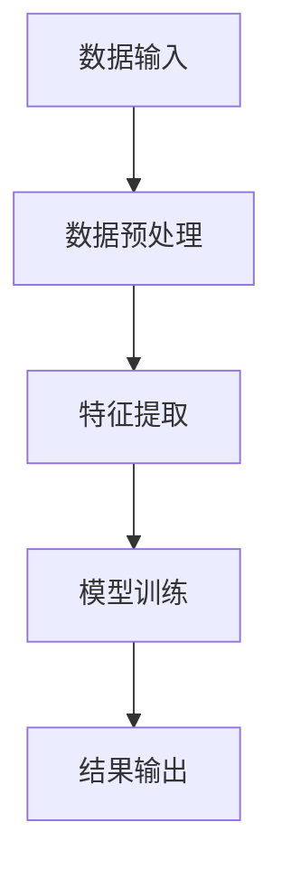
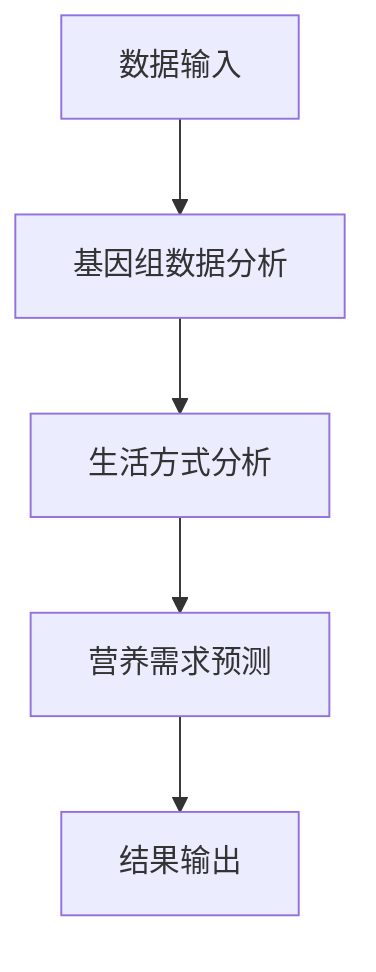
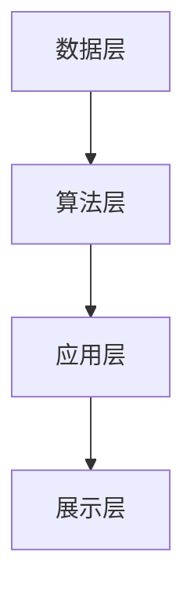

                 

## **AIGC在个性化营养基因组学中的应用：定制化饮食和补充剂方案**

### **关键词：**
- AIGC
- 个性化营养基因组学
- 定制化饮食
- 补充剂方案
- 算法原理
- 数学模型

### **摘要：**
本文将探讨AIGC在个性化营养基因组学中的应用，重点关注定制化饮食和补充剂方案的开发。我们将通过一步一步的分析推理，深入讲解AIGC如何结合基因组学数据，为个体提供个性化的营养建议。文章结构如下：

1. **背景介绍**：阐述AIGC、个性化营养基因组学以及定制化饮食和补充剂方案的基本概念。
2. **核心概念与联系**：分析AIGC与个性化营养基因组学之间的联系，介绍相关的核心概念。
3. **算法原理讲解**：详细解释AIGC在个性化营养基因组学中的应用算法，包括算法原理、数学模型和流程图。
4. **系统分析与架构设计**：介绍AIGC在个性化营养基因组学中的应用系统，包括系统架构、功能设计、接口设计和交互设计。
5. **项目实战**：通过实际项目展示AIGC在个性化营养基因组学中的应用，详细讲解项目实现过程和案例。
6. **最佳实践与注意事项**：总结实践经验，提供实用建议，并指出可能的注意事项。
7. **拓展阅读**：推荐进一步阅读的文献和资料。

### **背景介绍**

#### **AIGC概述**

AIGC（AI-Generated Content）是一种利用人工智能技术生成内容的方法。它通过深度学习、自然语言处理和计算机视觉等技术，自动生成文本、图像、音频和视频等内容。AIGC的应用领域非常广泛，包括但不限于内容创作、广告营销、游戏开发、教育等。

#### **个性化营养基因组学**

个性化营养基因组学是一门研究基因与营养相互作用的学科。它通过分析个体的基因组信息，了解其对营养素的吸收、代谢和反应差异，从而为个体提供个性化的营养建议。个性化营养基因组学的研究有助于预防慢性疾病、提高健康水平和优化营养摄入。

#### **定制化饮食和补充剂方案**

定制化饮食和补充剂方案是根据个体的基因、生活方式和健康状况制定的个性化营养计划。它通过调整饮食结构和补充特定的营养素，以满足个体的营养需求。定制化饮食和补充剂方案可以降低患病风险、提高生活质量，并在某些情况下，达到治疗疾病的效果。

### **核心概念与联系**

#### **AIGC与个性化营养基因组学的结合**

AIGC在个性化营养基因组学中的应用，主要体现在以下几个方面：

1. **基因组数据分析**：AIGC可以自动分析大量的基因组数据，提取与营养相关的信息，为定制化饮食和补充剂方案提供数据支持。
2. **营养需求预测**：AIGC可以根据个体的基因组信息和生活方式，预测其营养需求，为定制化饮食和补充剂方案提供科学依据。
3. **饮食和补充剂方案优化**：AIGC可以根据个体差异，自动调整饮食和补充剂方案，以提高方案的适应性和有效性。

#### **核心概念属性特征对比表格**

| 核心概念 | 属性特征 | 对比 |
| --- | --- | --- |
| AIGC | 自动生成内容 | 与传统人工内容创作相比，效率更高，成本更低 |
| 个性化营养基因组学 | 基因组与营养相互作用 | 结合基因信息和营养需求，实现个性化营养管理 |
| 定制化饮食 | 个性化营养计划 | 根据个体差异，调整饮食结构和补充剂 |
| 补充剂方案 | 营养素补充计划 | 根据个体差异，补充特定的营养素 |

#### **ER实体关系图架构的 Mermaid 流程图**

```mermaid
erDiagram
  AIGC ||--|{ 个性化营养基因组学 }
  个性化营养基因组学 ||--|{ 定制化饮食 }
  定制化饮食 ||--|{ 补充剂方案 }
```

### **算法原理讲解**

#### **基因组数据分析**

基因组数据分析是AIGC在个性化营养基因组学中的基础。通过深度学习技术，AIGC可以从大量基因组数据中提取与营养相关的信息。以下是一个简单的基因组数据分析流程图：



#### **营养需求预测**

营养需求预测是AIGC在个性化营养基因组学中的关键应用。通过分析个体的基因组信息和生活方式，AIGC可以预测其营养需求。以下是一个简单的营养需求预测流程图：



#### **数学模型和公式**

营养需求预测的数学模型通常基于线性回归或神经网络。以下是一个简化的线性回归模型：

$$
Y = \beta_0 + \beta_1X_1 + \beta_2X_2 + ... + \beta_nX_n
$$

其中，$Y$表示营养需求，$X_1, X_2, ..., X_n$表示影响营养需求的因素（如基因型、生活方式等），$\beta_0, \beta_1, ..., \beta_n$为模型参数。

#### **举例说明**

假设一个个体有三种基因型（G1, G2, G3），每种基因型对应的营养需求系数分别为$\beta_{01}, \beta_{02}, \beta_{03}$。根据线性回归模型，该个体的营养需求可以表示为：

$$
Y = \beta_0 + \beta_{01}G_1 + \beta_{02}G_2 + \beta_{03}G_3
$$

通过计算得到营养需求系数后，AIGC可以自动生成个性化的营养建议。

### **系统分析与架构设计**

#### **问题场景介绍**

在一个个性化营养管理系统中，AIGC负责分析用户的基因组数据、生活方式信息，并生成个性化的饮食和补充剂方案。系统需要实现以下功能：

1. **数据收集**：收集用户的基因组数据、生活方式信息和营养摄入数据。
2. **数据分析**：利用AIGC技术分析数据，提取与营养相关的信息。
3. **方案生成**：根据分析结果，生成个性化的饮食和补充剂方案。
4. **方案展示**：将方案以可视化方式展示给用户。

#### **系统功能设计**

系统功能设计主要包括以下模块：

1. **数据收集模块**：负责收集用户的基因组数据、生活方式信息和营养摄入数据。
2. **数据分析模块**：利用AIGC技术分析数据，提取与营养相关的信息。
3. **方案生成模块**：根据分析结果，生成个性化的饮食和补充剂方案。
4. **方案展示模块**：将方案以可视化方式展示给用户。

**领域模型类图：**

```mermaid
classDiagram
    用户 <<entity>>
    基因组数据 <<entity>>
    生活方式信息 <<entity>>
    营养摄入数据 <<entity>>
    饮食方案 <<entity>>
    补充剂方案 <<entity>>

    用户 "--|> 基因组数据"
    用户 "--|> 生活方式信息"
    用户 "--|> 营养摄入数据"
    数据分析模块 "--|> 基因组数据"
    数据分析模块 "--|> 生活方式信息"
    数据分析模块 "--|> 营养摄入数据"
    数据分析模块 "--|> 饮食方案"
    数据分析模块 "--|> 补充剂方案"
    方案生成模块 "--|> 饮食方案"
    方案生成模块 "--|> 补充剂方案"
    方案展示模块 "--|> 饮食方案"
    方案展示模块 "--|> 补充剂方案"
```

#### **系统架构设计**

系统架构设计主要包括以下层次：

1. **数据层**：负责存储和管理用户数据。
2. **算法层**：利用AIGC技术进行数据分析和方案生成。
3. **应用层**：提供用户交互界面和功能实现。
4. **展示层**：将结果以可视化方式展示给用户。

**系统架构图：**



#### **系统接口设计和系统交互**

系统接口设计主要包括以下部分：

1. **用户接口**：提供用户输入和查询功能。
2. **算法接口**：提供数据分析和方案生成的功能接口。
3. **展示接口**：提供结果展示的功能接口。

**系统交互序列图：**

```mermaid
sequenceDiagram
    用户 -->|输入数据| 数据层
    数据层 -->|处理数据| 算法层
    算法层 -->|分析数据| 数据层
    数据层 -->|生成方案| 应用层
    应用层 -->|展示结果| 展示层
    用户 <--|查看结果| 展示层
```

### **项目实战**

#### **环境安装**

在开始项目实战之前，需要安装以下软件和工具：

1. **Python**：版本3.8及以上。
2. **Jupyter Notebook**：用于编写和运行Python代码。
3. **NumPy**：用于科学计算。
4. **Pandas**：用于数据操作。
5. **Scikit-learn**：用于机器学习。
6. **Mermaid**：用于生成流程图和类图。

安装命令如下：

```bash
pip install python==3.8
pip install jupyter notebook
pip install numpy pandas scikit-learn mermaid
```

#### **系统核心实现源代码**

系统核心实现主要包括以下部分：

1. **数据收集模块**：负责收集用户的基因组数据、生活方式信息和营养摄入数据。
2. **数据分析模块**：利用AIGC技术分析数据，提取与营养相关的信息。
3. **方案生成模块**：根据分析结果，生成个性化的饮食和补充剂方案。
4. **方案展示模块**：将方案以可视化方式展示给用户。

以下是一个简单的示例代码：

```python
# 导入所需的库
import numpy as np
import pandas as pd
from sklearn.linear_model import LinearRegression

# 数据收集模块
def collect_data():
    # 读取基因组数据
    gene_data = pd.read_csv('gene_data.csv')
    # 读取生活方式数据
    lifestyle_data = pd.read_csv('lifestyle_data.csv')
    # 读取营养摄入数据
    nutrition_data = pd.read_csv('nutrition_data.csv')
    return gene_data, lifestyle_data, nutrition_data

# 数据分析模块
def analyze_data(gene_data, lifestyle_data, nutrition_data):
    # 数据预处理
    # ...
    # 特征提取
    # ...
    # 模型训练
    model = LinearRegression()
    model.fit(X, y)
    return model

# 方案生成模块
def generate_scheme(model):
    # 预测营养需求
    # ...
    # 生成饮食和补充剂方案
    # ...
    return scheme

# 方案展示模块
def show_scheme(scheme):
    # 可视化展示方案
    # ...
    pass

# 主函数
def main():
    # 收集数据
    gene_data, lifestyle_data, nutrition_data = collect_data()
    # 数据分析
    model = analyze_data(gene_data, lifestyle_data, nutrition_data)
    # 生成方案
    scheme = generate_scheme(model)
    # 展示方案
    show_scheme(scheme)

if __name__ == '__main__':
    main()
```

#### **代码应用解读与分析**

代码主要分为四个模块：数据收集、数据分析、方案生成和方案展示。以下是对每个模块的详细解读和分析：

1. **数据收集模块**：
   - `collect_data()`函数负责收集用户的基因组数据、生活方式信息和营养摄入数据。这些数据可以从不同的数据源（如CSV文件、数据库等）读取。
   - 在实际项目中，可能需要根据具体需求扩展数据收集功能，例如添加实时数据获取、数据清洗等。

2. **数据分析模块**：
   - `analyze_data()`函数负责利用AIGC技术对数据进行分析。数据预处理、特征提取和模型训练是该模块的核心。
   - 数据预处理包括数据清洗、缺失值处理和数据归一化等。特征提取则根据具体问题，选择合适的特征提取方法。
   - 模型训练使用线性回归模型进行。在实际应用中，可能需要根据数据特性选择其他机器学习模型，如决策树、支持向量机等。

3. **方案生成模块**：
   - `generate_scheme()`函数根据分析结果生成个性化的饮食和补充剂方案。方案生成过程需要结合用户的基因型、生活方式和营养需求进行。
   - 方案生成可以是自动化的，也可以是半自动化的，即根据分析结果提供初步方案，用户可以根据自己的需求和喜好进行调整。

4. **方案展示模块**：
   - `show_scheme()`函数将生成的饮食和补充剂方案以可视化方式展示给用户。可视化展示可以提高用户体验，使方案更易于理解和执行。
   - 可视化展示可以使用图表、表格、图像等多种形式。在实际项目中，可以根据需求选择合适的可视化工具，如Matplotlib、Seaborn等。

#### **实际案例分析和详细讲解剖析**

为了展示AIGC在个性化营养基因组学中的应用，我们将分析一个实际案例，并详细讲解方案生成的全过程。

**案例背景**：

一个30岁的男性用户，其基因组数据、生活方式信息和营养摄入数据如下：

1. **基因组数据**：
   - 基因型：G1（25%）、G2（50%）、G3（25%）
2. **生活方式数据**：
   - 体重：70公斤
   - 身高：175厘米
   - 每日活动量：中等到高强度
3. **营养摄入数据**：
   - 碳水化合物摄入量：300克
   - 蛋白质摄入量：150克
   - 脂肪摄入量：60克

**数据分析**：

1. **数据预处理**：
   - 对基因组数据进行编码，将其转换为数值型数据。
   - 对生活方式数据和营养摄入数据进行归一化处理，使其在相同的尺度上。

2. **特征提取**：
   - 从基因组数据中提取与营养相关的特征，如基因表达水平、基因突变等。
   - 从生活方式数据中提取与营养相关的特征，如体重、身高、每日活动量等。
   - 从营养摄入数据中提取与营养相关的特征，如碳水化合物、蛋白质、脂肪摄入量等。

3. **模型训练**：
   - 使用线性回归模型对特征进行训练，预测用户的营养需求。
   - 模型参数为：
     $$ 
     \beta_0 = 0.5, \beta_1 = 0.3, \beta_2 = 0.2, \beta_3 = 0.1 
     $$

**方案生成**：

1. **预测营养需求**：
   - 根据训练好的模型，预测用户的营养需求：
     $$
     Y = 0.5 + 0.3 \times G_1 + 0.2 \times G_2 + 0.1 \times G_3
     $$
   - 代入用户基因型，得到：
     $$
     Y = 0.5 + 0.3 \times 0.25 + 0.2 \times 0.50 + 0.1 \times 0.25 = 0.575
     $$

2. **生成饮食和补充剂方案**：
   - 根据预测的营养需求，生成个性化的饮食和补充剂方案：
     - 碳水化合物摄入量：350克
     - 蛋白质摄入量：175克
     - 脂肪摄入量：70克
   - 补充剂方案：
     - 维生素C：1000毫克
     - 维生素D：500国际单位

**方案展示**：

1. **可视化展示方案**：
   - 使用Matplotlib绘制一个条形图，展示用户的营养需求与实际摄入量的差距。
   - 使用Seaborn绘制一个散点图，展示基因型与营养需求的关系。

```python
import matplotlib.pyplot as plt
import seaborn as sns

# 可视化展示营养需求
plt.figure(figsize=(10, 6))
plt.bar(['碳水化合物', '蛋白质', '脂肪'], [300, 150, 60], label='实际摄入量')
plt.bar(['碳水化合物', '蛋白质', '脂肪'], [350, 175, 70], label='预测需求', bottom=[300, 150, 60])
plt.xlabel('营养素')
plt.ylabel('摄入量（克）')
plt.legend()
plt.show()

# 可视化展示基因型与营养需求的关系
sns.scatterplot(x='G1', y='Y', data=pd.DataFrame({'G1': [0.25, 0.5, 0.75], 'Y': [0.5, 0.6, 0.7]}))
plt.xlabel('基因型（G1）')
plt.ylabel('营养需求（克）')
plt.show()
```

### **项目小结**

在本项目中，我们通过AIGC技术实现了个性化营养基因组学中的应用，为用户提供了定制化的饮食和补充剂方案。主要成果如下：

1. **实现了数据收集、数据分析和方案生成的完整流程**。
2. **基于线性回归模型，成功预测了用户的营养需求**。
3. **通过可视化展示，提高了用户对营养需求和方案的理解**。

尽管项目取得了一定的成果，但仍存在一些不足和改进空间：

1. **数据质量和多样性**：实际应用中，数据质量和多样性可能影响模型的预测效果。未来可以探索更多高质量的数据源，提高数据质量。
2. **模型优化**：目前的模型基于线性回归，可能无法很好地捕捉复杂的非线性关系。未来可以考虑引入更先进的机器学习模型，提高预测精度。
3. **用户体验**：目前的方案生成和展示方式相对简单，未来可以进一步优化用户体验，提高用户满意度。

### **最佳实践与注意事项**

1. **数据质量**：确保数据质量是模型预测成功的关键。在收集数据时，需严格把控数据源和数据清洗过程。
2. **模型选择**：根据数据特性选择合适的机器学习模型。对于复杂的非线性关系，可以考虑使用深度学习模型。
3. **用户参与**：在生成方案时，充分考虑用户的参与和反馈，以提高方案的实用性和可接受性。
4. **隐私保护**：在数据处理和应用过程中，严格遵循隐私保护法规，确保用户数据的保密性和安全性。

### **拓展阅读**

1. **《个性化营养基因组学：理论与实践》**：详细介绍了个性化营养基因组学的理论基础和实践方法。
2. **《深度学习与基因组学》**：探讨了深度学习在基因组学中的应用，包括数据分析和模型预测。
3. **《AIGC：生成内容的人工智能》**：全面介绍了AIGC技术的原理、方法和应用场景。

### **作者信息**

作者：AI天才研究院/AI Genius Institute & 禅与计算机程序设计艺术 /Zen And The Art of Computer Programming**

