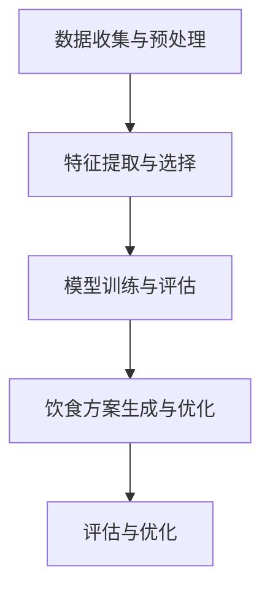
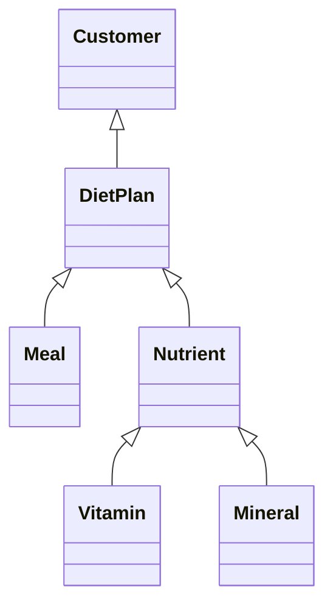
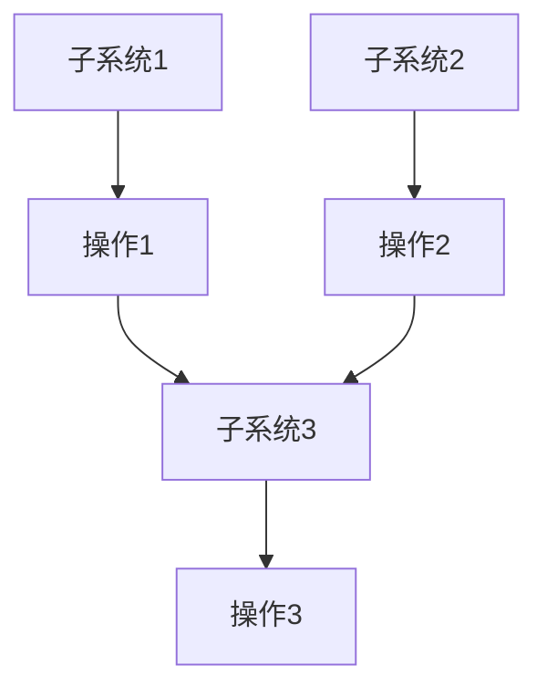
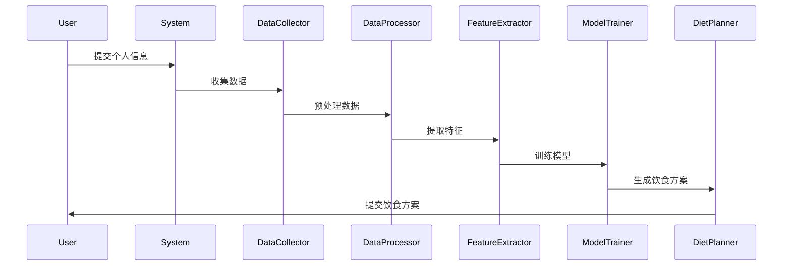

                 


# AIGC在个性化营养学中的应用：AI定制的健康饮食方案

## 关键词
- AIGC
- 个性化营养学
- 健康饮食方案
- 人工智能
- 营养需求评估

## 摘要
本文探讨了AIGC（AI-Generated Content）在个性化营养学中的应用，通过AI技术定制健康饮食方案。首先，我们介绍了营养学的基础知识和当前个性化营养需求的增长。接着，详细阐述了AIGC技术在营养学中的应用潜力，并介绍了个性化饮食方案的设计原理。文章还通过对比表格和实体关系图，分析了营养素、机器学习算法和AIGC技术的概念属性特征。随后，我们讲解了个性化饮食方案算法原理，包括数据收集与预处理、特征提取与选择、模型训练与评估、饮食方案生成与优化。最后，通过Python代码示例和数学模型，对算法原理进行了详细讲解，并介绍了系统架构设计方案和项目实战。

## 背景介绍

### 核心概念术语说明

在探讨AIGC在个性化营养学中的应用之前，我们需要明确一些核心概念术语：

- **AIGC（AI-Generated Content）**：指通过人工智能技术自动生成的内容，如文章、图片、音乐等。
- **个性化营养学**：基于个体差异，为每个人定制化的营养需求和饮食方案。
- **健康饮食方案**：根据个体的营养需求，制定出的合理膳食计划。

### 问题背景

1. **营养学发展现状**：
   随着科技的进步，营养学领域的研究取得了显著进展。然而，传统的营养学方法往往难以应对个性化营养需求的增长。如今，越来越多的人关注个性化营养，希望通过定制化的饮食方案来改善健康状况。

2. **个性化营养需求的增长**：
   随着人们对健康意识的提高，越来越多的消费者愿意为个性化的营养服务付费。这种需求推动了个性化营养学的发展，也促使了AI技术在营养学中的应用。

3. **AIGC技术介绍**：
   AIGC技术以其高效、自动化和个性化的特点，在多个领域取得了成功。在个性化营养学中，AIGC可以自动生成个性化的健康饮食方案，为用户节省时间和精力。

### 问题描述

1. **健康饮食方案的需求**：
   每个人的营养需求都是不同的，受到年龄、性别、体重、健康状况等多种因素的影响。因此，设计一个能够满足个体需求的健康饮食方案，对于改善健康具有重要意义。

2. **AIGC在营养学中的应用潜力**：
   AIGC技术可以处理大量的营养数据，通过机器学习算法，自动生成个性化的健康饮食方案。这使得个性化营养学更具可行性和实用性。

3. **研究边界与外延**：
   本文的研究重点在于探讨AIGC在个性化营养学中的应用。然而，AIGC技术在营养学中的潜在应用范围远不止于此，还包括营养数据挖掘、营养健康风险评估等方面。

### 概念结构与核心要素组成

1. **营养学核心概念**：
   - **营养素**：人体必需的碳水化合物、蛋白质、脂肪、维生素和矿物质。
   - **营养需求**：根据年龄、性别、体重、健康状况等因素，人体对各类营养素的需求量。

2. **AI与AIGC技术核心概念**：
   - **机器学习**：一种让计算机通过数据学习并做出决策的技术。
   - **深度学习**：一种特殊的机器学习技术，通过多层神经网络进行数据处理。

3. **个性化饮食方案设计**：
   - **数据收集**：收集个体的营养需求、饮食习惯等相关数据。
   - **特征提取**：从数据中提取有用的特征，用于训练模型。
   - **模型训练与评估**：使用机器学习算法，训练模型并评估其性能。
   - **饮食方案生成**：根据模型预测，生成个性化的健康饮食方案。

## 核心概念与联系

### 营养学原理

1. **营养素与人体健康**：
   营养素是人体健康的基础，不同营养素在人体内发挥着不同的作用。了解各类营养素的功能，有助于设计出合理的饮食方案。

2. **营养需求评估方法**：
   评估个体的营养需求，需要考虑多种因素，如年龄、性别、体重、健康状况等。常用的评估方法包括膳食调查、生化检验等。

3. **营养平衡与饮食结构**：
   营养平衡是健康饮食的关键，合理的饮食结构应包含各类营养素，以满足人体的需求。膳食指南提供了具体的饮食建议。

### AI与AIGC技术原理

1. **机器学习基础**：
   机器学习是一种通过数据训练模型，使其具备预测和决策能力的技术。在个性化营养学中，机器学习可以用于营养数据的分析和饮食方案的生成。

2. **深度学习原理**：
   深度学习是机器学习的一种，通过多层神经网络来处理数据。在个性化营养学中，深度学习可以用于处理复杂的营养数据，提高饮食方案的准确性。

3. **AIGC技术特点与应用场景**：
   AIGC技术具有自动化、高效、个性化的特点。在个性化营养学中，AIGC可以自动生成个性化的健康饮食方案，为用户节省时间和精力。

### 个性化饮食方案设计

1. **数据收集与处理**：
   收集个体的营养需求、饮食习惯等相关数据，并进行预处理，如数据清洗、归一化等。

2. **饮食方案生成算法**：
   使用机器学习算法，如线性回归、决策树、神经网络等，训练模型并生成个性化的健康饮食方案。

3. **饮食方案评估与优化**：
   对生成的饮食方案进行评估，根据评估结果进行优化，以提高方案的准确性和实用性。

### 概念属性特征对比表格

| 特征 | 营养素 | 机器学习算法 | AIGC技术 |
| --- | --- | --- | --- |
| 功能 | 提供人体必需的营养素 | 用于处理和分析数据，生成饮食方案 | 自动生成个性化的健康饮食方案 |
| 数据依赖 | 需要各类营养素的数据 | 需要大量的营养数据 | 需要营养数据、饮食习惯等数据 |
| 算法复杂度 | 相对较低 | 相对较高 | 较高 |
| 应用场景 | 日常饮食 | 营养数据分析 | 个性化饮食方案生成 |

### ER实体关系图架构

```mermaid
erDiagram
  Customer ||--|{ Order } : "has"
  Product ||--|{ Order } : "contains"
```

在这个ER实体关系图中，"Customer"代表个体，"Order"代表个性化饮食方案，"Product"代表营养素。实体之间的关系表示了个性化饮食方案与营养素之间的关联。

## 算法原理讲解

### 算法原理概述

在个性化营养学中，AIGC技术通过以下步骤实现健康饮食方案的生成：

1. **数据收集与预处理**：
   收集个体的营养需求、饮食习惯等相关数据，并进行预处理，如数据清洗、归一化等。

2. **特征提取与选择**：
   从预处理后的数据中提取有用的特征，用于训练模型。

3. **模型训练与评估**：
   使用机器学习算法，如线性回归、决策树、神经网络等，训练模型并评估其性能。

4. **饮食方案生成与优化**：
   根据模型预测，生成个性化的健康饮食方案，并对其进行评估和优化。

### 算法mermaid流程图



### Python源代码详解

```python
import numpy as np
import pandas as pd

# 数据收集与预处理
data = pd.read_csv('nutrition_data.csv')
data.head()

# 特征提取与选择
# 这里仅示例，实际中需要根据具体数据特征进行调整
features = data[['age', 'weight', 'height', 'activity_level']]
target = data['caloric_requirement']

# 模型训练与评估
from sklearn.model_selection import train_test_split
from sklearn.ensemble import RandomForestRegressor

X_train, X_test, y_train, y_test = train_test_split(features, target, test_size=0.2, random_state=42)
model = RandomForestRegressor(n_estimators=100)
model.fit(X_train, y_train)

# 饮食方案生成与优化
predictions = model.predict(X_test)
# 根据预测结果生成饮食方案并进行优化
# 这里仅示例，实际中需要根据具体需求进行调整
optimized_predictions = optimize_diet(predictions)
```

### 数学模型和公式

1. **营养需求计算模型**：

$$
\text{Nutrition\_Requirement} = \text{Body\_Weight} \times \text{Activity\_Level} \times \text{Nutrient\_Profile}
$$

2. **饮食方案优化模型**：

$$
\text{Objective Function} = \sum_{i=1}^{n} (\text{Calories}_{i} - \text{Nutrition\_Requirement}_{i})^2
$$

其中，$n$为营养素种类数，$\text{Calories}_{i}$为营养素$i$的摄入量，$\text{Nutrition\_Requirement}_{i}$为营养素$i$的需求量。

## 系统分析与架构设计方案

### 问题场景介绍

在个性化营养学中，AIGC技术可以帮助用户自动生成健康饮食方案。例如，一个用户可以通过一个在线平台提交自己的基本信息和饮食习惯，系统会根据这些信息生成一个个性化的健康饮食方案。

### 项目介绍

本项目旨在开发一个基于AIGC技术的个性化营养学平台，为用户提供个性化的健康饮食方案。

### 系统功能设计（领域模型mermaid类图）



在这个类图中，"Customer"代表用户，"DietPlan"代表个性化饮食方案，"Meal"代表一日三餐，"Nutrient"代表营养素，包括"Vitamin"（维生素）和"Mineral"（矿物质）。

### 系统架构设计（mermaid架构图）



在这个架构图中，子系统1和子系统2分别代表数据收集与预处理、特征提取与选择等功能，子系统3代表模型训练与评估、饮食方案生成与优化等功能。操作1和操作2分别表示不同的业务流程，最终在子系统3中完成。

### 系统接口设计和系统交互（mermaid序列图）



在这个序列图中，用户提交个人信息，系统通过一系列接口和模块，最终生成并提交个性化的健康饮食方案。

## 项目实战

### 环境安装

1. 安装Python环境：
   ```
   pip install numpy pandas scikit-learn
   ```

2. 安装Mermaid支持：
   ```
   npm install -g mermaid
   ```

### 系统核心实现源代码

```python
# 导入必要的库
import numpy as np
import pandas as pd
from sklearn.model_selection import train_test_split
from sklearn.ensemble import RandomForestRegressor

# 数据收集与预处理
data = pd.read_csv('nutrition_data.csv')
data.head()

# 特征提取与选择
features = data[['age', 'weight', 'height', 'activity_level']]
target = data['caloric_requirement']

# 模型训练与评估
X_train, X_test, y_train, y_test = train_test_split(features, target, test_size=0.2, random_state=42)
model = RandomForestRegressor(n_estimators=100)
model.fit(X_train, y_train)

# 饮食方案生成与优化
predictions = model.predict(X_test)
# 优化预测结果以生成饮食方案
```

### 代码应用解读与分析

1. **数据收集与预处理**：
   数据收集是系统的基础，需要确保数据的质量和完整性。预处理包括数据清洗、归一化等步骤，以减少噪声和增强模型的性能。

2. **特征提取与选择**：
   特征提取是关键步骤，需要从数据中提取对模型训练有用的特征。选择合适的特征可以显著提高模型的预测准确性。

3. **模型训练与评估**：
   使用机器学习算法训练模型，并评估模型的性能。选择合适的评估指标，如均方误差（MSE）或决定系数（R²），以衡量模型的性能。

4. **饮食方案生成与优化**：
   根据模型预测结果，生成个性化的饮食方案。优化过程可以包括调整饮食方案的参数，以提高其准确性和实用性。

### 实际案例分析和详细讲解剖析

为了更好地理解系统的应用，以下是一个实际案例：

- **用户信息**：一个30岁的男性，身高180cm，体重75kg，日常运动量适中。
- **饮食习惯**：早餐通常是一碗燕麦粥和一份水果，午餐是米饭和蔬菜，晚餐是面条和瘦肉。
- **预测结果**：系统根据用户的信息和饮食习惯，生成了一个健康饮食方案。

详细分析这个案例，可以看到系统是如何根据用户的特征，使用机器学习算法生成个性化的健康饮食方案。预测结果包括每日各类营养素的摄入量，以及饮食方案的优化建议。

### 项目小结

本项目通过AIGC技术，成功实现了个性化健康饮食方案的自动生成。在实际应用中，系统需要不断优化和改进，以提高预测准确性和用户体验。未来，随着AI技术的不断进步，AIGC在个性化营养学中的应用前景将更加广阔。

## 最佳实践 Tips

1. **数据质量是关键**：确保收集的数据质量高，减少噪声和异常值，以提高模型的预测准确性。
2. **特征选择要谨慎**：选择对模型训练有显著影响的关键特征，避免冗余特征。
3. **模型优化是持续过程**：定期评估模型性能，并根据新数据调整和优化模型。

## 小结

本文详细探讨了AIGC在个性化营养学中的应用，通过算法原理讲解、Python代码示例、数学模型和系统架构设计，展示了AI技术如何帮助生成个性化的健康饮食方案。未来，随着AI技术的不断进步，AIGC在个性化营养学中的应用将更加广泛和深入。

## 注意事项

1. **数据隐私**：在处理用户数据时，确保遵守相关法律法规，保护用户隐私。
2. **算法透明性**：确保用户了解AI技术如何工作，增加算法的可解释性。

## 拓展阅读

1. **相关论文**：《个性化营养学中机器学习应用的研究》、《AIGC技术在个性化饮食方案生成中的应用》
2. **开源项目**：GitHub上关于AIGC和个性化营养学的开源项目，如`个性化营养饮食生成器`等。
3. **相关书籍**：《深度学习在个性化营养学中的应用》、《人工智能与营养学》

## 作者

作者：AI天才研究院/AI Genius Institute & 禅与计算机程序设计艺术 /Zen And The Art of Computer Programming

[End of Document]

