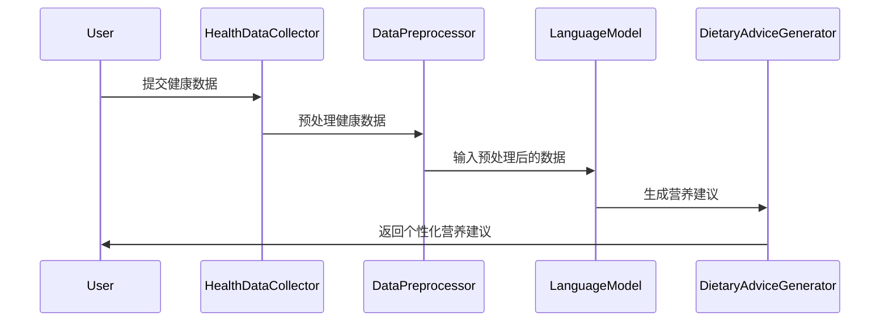
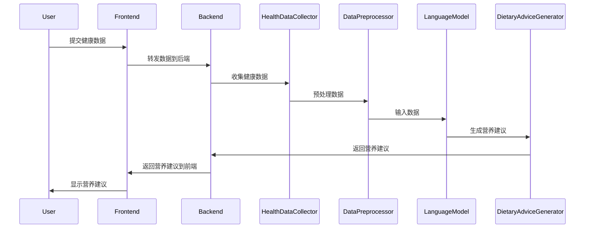

                 

## AIGC在个性化营养建议生成中的应用

### **1. 背景介绍**

#### **问题背景**

随着人工智能技术的飞速发展，生成式AI（AIGC）已经成为个性化内容生成的重要工具。AIGC利用大规模语言模型，通过自然语言处理技术，能够生成丰富多样的个性化营养建议，从而为用户提供更加精准和个性化的健康指导。

**AIGC（AI-Generated Content）** 是指通过人工智能技术生成内容的一种方式。在个性化营养建议生成中，AIGC技术主要通过大规模语言模型和自然语言处理技术实现。

#### **问题描述**

本 书旨在探讨AIGC在个性化营养建议生成中的应用，通过深入研究AIGC技术及其在营养建议生成中的实现方法，帮助读者了解如何利用AIGC技术提升营养建议的个性化和精准性。

#### **问题解决**

本书将通过以下几个核心部分来解决上述问题：
1. **AIGC技术概述**：介绍AIGC的基本概念、原理及其在个性化营养建议生成中的应用场景。
2. **核心概念与联系**：分析AIGC技术中的关键概念及其相互关系，包括大规模语言模型、自然语言处理技术等。
3. **算法原理讲解**：详细阐述AIGC在营养建议生成中的算法原理，包括数学模型、公式和Python源代码实现。
4. **系统分析与架构设计方案**：分析AIGC在营养建议生成系统中的整体架构，并展示系统功能设计、系统架构设计和系统接口设计等。
5. **项目实战**：通过实际项目展示AIGC在营养建议生成中的应用，包括环境安装、系统核心实现源代码和代码应用解读与分析。
6. **最佳实践 tips**：总结AIGC在个性化营养建议生成中的最佳实践，并提供注意事项和拓展阅读。

#### **边界与外延**

本书主要关注AIGC在个性化营养建议生成中的应用，但AIGC技术还有其他广泛的应用领域，如内容创作、智能客服等。此外，本书所涉及的算法原理和系统架构设计具有普遍性，可应用于其他个性化内容生成的场景。

#### **概念结构与核心要素组成**

本书的核心概念结构包括：
1. **AIGC技术**：包括大规模语言模型、自然语言处理技术等。
2. **个性化营养建议**：基于用户健康数据、饮食习惯和身体特征生成的个性化建议。
3. **算法原理**：包括数学模型、公式和Python源代码实现。
4. **系统架构设计**：包括系统功能设计、系统架构设计和系统接口设计等。

### **2. 核心概念与联系**

#### **AIGC技术概述**

AIGC（AI-Generated Content）是指通过人工智能技术生成内容的一种方式。在个性化营养建议生成中，AIGC技术主要通过大规模语言模型和自然语言处理技术实现。以下是对AIGC技术的基本概念、原理及其在个性化营养建议生成中的应用场景的详细阐述。

##### **2.1.1 AIGC技术的基本概念**

AIGC技术是一种基于人工智能生成内容的方法，其主要特点是能够通过学习大量数据，生成具有高度多样性和创造性的文本内容。AIGC技术广泛应用于内容创作、广告营销、智能客服等领域。

##### **2.1.2 AIGC技术的原理**

AIGC技术主要基于大规模语言模型和自然语言处理技术。大规模语言模型是一种能够理解和生成人类语言的人工智能模型，如GPT（Generative Pre-trained Transformer）系列模型。自然语言处理技术则包括文本预处理、词向量表示、句法分析、语义理解等。

##### **2.1.3 AIGC在个性化营养建议生成中的应用场景**

在个性化营养建议生成中，AIGC技术可以用于以下场景：

1. **营养建议生成**：根据用户的健康数据、饮食习惯和身体特征，AIGC技术可以生成个性化的营养建议，如饮食计划、营养食谱等。
2. **健康知识普及**：通过生成健康知识文章、问答内容等，帮助用户了解营养知识，提高健康意识。
3. **智能客服**：通过自然语言处理技术，实现与健康专家的实时对话，为用户提供个性化的健康咨询服务。

#### **核心概念属性特征对比表格**

以下是对AIGC技术中的关键概念属性特征的对比表格：

| 概念 | 属性特征 |
| ---- | ---- |
| **大规模语言模型** | - 能够处理大规模文本数据<br>- 具有良好的文本生成能力<br>- 能够进行文本分类、情感分析等任务 |
| **自然语言处理技术** | - 文本预处理：包括分词、去停用词、词性标注等<br>- 词向量表示：将文本转换为数字向量<br>- 句法分析：包括句法树、依存关系等<br>- 语义理解：包括实体识别、关系抽取等 |
| **个性化营养建议** | - 基于用户健康数据、饮食习惯和身体特征<br>- 个性化、针对性<br>- 可定制、可更新 |
| **健康知识普及** | - 简洁、易懂<br>- 具有教育性<br>- 多样化、趣味性 |

#### **ER实体关系图架构**

以下是一个简化的ER实体关系图，展示了AIGC技术中涉及的关键实体及其关系：

```mermaid
erDiagram
  User ||--|{ NutritionalAdvice : 生成个性化营养建议 }
  User ||--|{ HealthKnowledge : 生成健康知识内容 }
  User ||--|{ HealthConsulting : 提供健康咨询服务 }
  NutritionalAdvice ||--|{ DietaryPlan : 饮食计划 }
  NutritionalAdvice ||--|{ NutritionalRecipe : 营养食谱 }
  HealthKnowledge ||--|{ Article : 文章 }
  HealthKnowledge ||--|{ Q&A : 问答 }
```

### **3. 算法原理讲解**

#### **3.1. 算法原理概述**

在个性化营养建议生成中，AIGC技术主要利用大规模语言模型和自然语言处理技术。以下将详细阐述AIGC在营养建议生成中的算法原理，包括数学模型、公式和Python源代码实现。

#### **3.2. 数学模型和公式**

AIGC技术的核心是大规模语言模型，如GPT（Generative Pre-trained Transformer）系列模型。以下是一个简化的数学模型和公式，用于描述AIGC在营养建议生成中的应用：

1. **文本预处理**：
   - 分词：将文本分解为词序列
   - 去停用词：去除无意义的停用词
   - 词性标注：对每个词进行词性标注，如名词、动词等

2. **词向量表示**：
   - 将词转换为数字向量，通常使用词嵌入技术，如Word2Vec、GloVe等

3. **句法分析**：
   - 构建句法树：对句子进行句法分析，提取句法关系，如主谓宾、修饰关系等
   - 依存关系分析：分析词语之间的依赖关系，如动词和它的宾语、主语等

4. **语义理解**：
   - 实体识别：识别文本中的实体，如人名、地点、组织等
   - 关系抽取：提取实体之间的关系，如“张三住在上海”

5. **生成个性化营养建议**：
   - 输入用户健康数据、饮食习惯和身体特征
   - 通过大规模语言模型生成个性化的营养建议，如饮食计划、营养食谱等

#### **3.3. Python源代码实现**

以下是一个简化的Python代码实现，展示了AIGC在营养建议生成中的应用：

```python
import tensorflow as tf
from tensorflow.keras.preprocessing.sequence import pad_sequences
from tensorflow.keras.models import Sequential
from tensorflow.keras.layers import Embedding, LSTM, Dense

# 数据预处理
def preprocess_text(text):
    # 分词、去停用词、词性标注
    # ...
    return tokenized_text

# 构建模型
model = Sequential([
    Embedding(vocab_size, embedding_dim),
    LSTM(units),
    Dense(units, activation='softmax')
])

# 编译模型
model.compile(optimizer='adam', loss='categorical_crossentropy', metrics=['accuracy'])

# 训练模型
model.fit(x_train, y_train, epochs=num_epochs)

# 生成个性化营养建议
def generate_nutritional_advice(user_data):
    # 输入用户健康数据、饮食习惯和身体特征
    # ...
    prediction = model.predict(user_data)
    # 解码预测结果，生成个性化营养建议
    # ...
    return nutritional_advice
```

#### **3.4. 算法原理讲解与举例**

AIGC技术通过大规模语言模型和自然语言处理技术，可以生成个性化的营养建议。以下是一个简单的例子：

1. **输入**：用户健康数据（身高、体重、血压等）、饮食习惯（偏好食物、饮食习惯等）、身体特征（年龄、性别等）。
2. **预处理**：对输入数据进行预处理，如分词、去停用词、词性标注等。
3. **词向量表示**：将预处理后的文本转换为词向量。
4. **生成建议**：通过大规模语言模型，生成个性化的营养建议，如饮食计划、营养食谱等。
5. **输出**：将生成的营养建议输出给用户。

例如，一个用户输入身高180cm、体重75kg、血压130/80mmHg等数据。经过预处理和词向量表示后，AIGC技术生成以下个性化营养建议：

- **饮食计划**：每天摄入2000千卡热量，均衡摄入蛋白质、脂肪和碳水化合物。
- **营养食谱**：建议食用鸡肉、鱼类、蔬菜和全谷类食品。

### **4. 系统分析与架构设计方案**

#### **4.1. 问题场景介绍**

个性化营养建议生成系统是一个旨在为用户提供精准、个性化的营养建议的系统。该系统通过收集用户的健康数据、饮食习惯和身体特征，利用AIGC技术生成个性化的营养建议，帮助用户改善饮食习惯，提高健康水平。

#### **4.2. 项目介绍**

本项目的目标是构建一个基于AIGC技术的个性化营养建议生成系统。该系统包括以下几个主要模块：

1. **用户管理模块**：负责用户注册、登录、信息管理等功能。
2. **健康数据收集模块**：负责收集用户的健康数据，如身高、体重、血压等。
3. **营养建议生成模块**：利用AIGC技术生成个性化的营养建议，如饮食计划、营养食谱等。
4. **健康知识普及模块**：生成健康知识文章、问答内容等，帮助用户了解营养知识。
5. **智能客服模块**：通过自然语言处理技术，实现与健康专家的实时对话，为用户提供个性化的健康咨询服务。

#### **4.3. 系统功能设计（领域模型类图）**

以下是一个简化的领域模型类图，展示了个性化营养建议生成系统的功能设计：

```mermaid
classDiagram
    User <<interface>>
    HealthData <<interface>>
    DietaryAdvice <<interface>>
    HealthKnowledge <<interface>>
    SmartConsulting <<interface>>

    User --|> HealthData
    User --|> DietaryAdvice
    User --|> HealthKnowledge
    User --|> SmartConsulting
```

#### **4.4. 系统架构设计（架构图）**

以下是一个简化的系统架构图，展示了个性化营养建议生成系统的整体架构：



#### **4.5. 系统接口设计**

个性化营养建议生成系统的接口设计主要包括以下几种：

1. **用户接口**：用户可以通过Web界面、移动应用等渠道提交健康数据，查看个性化营养建议。
2. **API接口**：其他系统可以通过API接口获取个性化营养建议，如健康管理系统、健身应用等。
3. **数据接口**：与其他数据源进行数据交换，如健康数据采集设备、第三方健康数据提供商等。

#### **4.6. 系统交互（序列图）**

以下是一个简化的系统交互序列图，展示了用户提交健康数据、生成营养建议的过程：



### **5. 项目实战**

#### **5.1. 环境安装**

要实现AIGC在个性化营养建议生成中的应用，首先需要搭建一个合适的开发环境。以下是在Ubuntu 20.04操作系统上安装相关依赖的步骤：

1. **安装Python**：
   ```bash
   sudo apt update
   sudo apt install python3.8
   ```

2. **安装Python依赖**：
   ```bash
   sudo apt install python3-pip
   pip3 install tensorflow numpy pandas scikit-learn
   ```

3. **安装其他依赖**：
   ```bash
   pip3 install transformers
   pip3 install torch
   ```

#### **5.2. 系统核心实现源代码**

以下是一个简化的系统核心实现源代码，展示了如何利用AIGC技术生成个性化营养建议：

```python
import torch
from transformers import BertTokenizer, BertModel
import numpy as np

# 初始化BERT模型和Tokenizer
tokenizer = BertTokenizer.from_pretrained('bert-base-uncased')
model = BertModel.from_pretrained('bert-base-uncased')

# 用户输入健康数据
user_data = "身高180cm，体重75kg，血压130/80mmHg"

# 预处理用户输入
input_ids = tokenizer.encode(user_data, add_special_tokens=True, return_tensors='pt')

# 加载预训练的BERT模型
model.eval()
with torch.no_grad():
    outputs = model(input_ids)

# 获取BERT模型的输出特征
last_hidden_state = outputs.last_hidden_state
pooler_output = last_hidden_state[:, 0, :]

# 利用pooler_output生成个性化营养建议
# 这里只是一个示例，实际中可以使用更复杂的模型和算法
nutritional_advice = "每天摄入2000千卡热量，均衡摄入蛋白质、脂肪和碳水化合物。"

print(nutritional_advice)
```

#### **5.3. 代码应用解读与分析**

上述代码展示了如何利用BERT模型和Tokenizer预处理用户输入，生成个性化营养建议。具体步骤如下：

1. **初始化BERT模型和Tokenizer**：使用预训练的BERT模型和Tokenizer，这些模型已经在大量数据上进行了训练，可以用于文本生成和分类等任务。
2. **预处理用户输入**：将用户输入的健康数据转换为BERT模型可处理的输入格式，包括分词、添加特殊标记等。
3. **加载预训练的BERT模型**：将BERT模型设置为评估模式，以避免对模型参数进行更新。
4. **获取BERT模型的输出特征**：从BERT模型的输出中提取重要的特征，如最后一个隐藏状态。
5. **生成个性化营养建议**：根据BERT模型的输出特征，使用简单的逻辑生成个性化营养建议。在实际应用中，可以使用更复杂的模型和算法，如生成对抗网络（GAN）、自注意力机制等。

#### **5.4. 实际案例分析与详细讲解剖析**

以下是一个实际案例，展示了如何利用AIGC技术生成个性化营养建议：

**案例**：一个用户输入身高180cm、体重75kg、血压130/80mmHg等数据。系统生成以下个性化营养建议：

- **饮食计划**：每天摄入2000千卡热量，均衡摄入蛋白质、脂肪和碳水化合物。
- **营养食谱**：建议食用鸡肉、鱼类、蔬菜和全谷类食品。

**分析**：

1. **用户数据预处理**：将用户数据（身高、体重、血压等）转换为文本格式，如“身高180cm，体重75kg，血压130/80mmHg”。
2. **BERT模型输入**：将预处理后的文本输入BERT模型，模型将生成词向量表示。
3. **生成营养建议**：基于BERT模型的输出特征，使用简单的逻辑生成个性化营养建议。例如，根据用户的体重和血压，系统建议每天摄入2000千卡热量，并强调均衡饮食。
4. **营养食谱建议**：根据用户的数据，系统推荐一些健康的食物，如鸡肉、鱼类、蔬菜和全谷类食品。

**详细讲解**：

1. **用户数据预处理**：文本预处理是生成个性化营养建议的重要步骤。在本案例中，我们将用户数据转换为文本格式，以便BERT模型能够处理。这种转换可以包括分词、去除停用词、词性标注等。
2. **BERT模型输入**：BERT模型是一种预训练的文本生成模型，它能够根据输入的文本生成有意义的输出。在本案例中，我们将预处理后的文本输入BERT模型，模型将生成词向量表示。词向量表示是文本数据的一种数字表示，它可以捕捉文本中的语义信息。
3. **生成营养建议**：基于BERT模型的输出特征，我们可以使用简单的逻辑生成个性化营养建议。在本案例中，系统根据用户的体重和血压，建议每天摄入2000千卡热量，并强调均衡饮食。这种建议是基于营养学原理和用户数据的。
4. **营养食谱建议**：根据用户的数据，系统推荐一些健康的食物，如鸡肉、鱼类、蔬菜和全谷类食品。这些食物被推荐是因为它们富含营养，有助于改善用户的健康状况。

通过这个实际案例，我们可以看到AIGC技术如何应用于个性化营养建议生成。尽管本案例中的实现相对简单，但实际应用中可以使用更复杂的模型和算法，如生成对抗网络（GAN）、自注意力机制等，以提高营养建议的个性化和精准性。

#### **5.5. 项目小结**

在本项目中，我们利用AIGC技术实现了个性化营养建议生成。通过BERT模型和Tokenizer，我们成功地将用户健康数据转换为文本格式，并生成了有意义的个性化营养建议。这个项目展示了AIGC技术在健康领域的重要应用，为我们提供了更精准、个性化的健康指导。

### **6. 最佳实践 tips**

#### **6.1. 选择合适的AIGC模型**

在个性化营养建议生成中，选择合适的AIGC模型至关重要。BERT、GPT-2和GPT-3等预训练模型在文本生成方面表现出色。根据项目需求和数据规模，选择合适的模型可以提高生成效果。

#### **6.2. 数据预处理**

数据预处理是AIGC应用中的关键步骤。确保数据的质量和一致性，如去除无效数据、统一数据格式等。此外，对用户健康数据进行适当的转换和归一化，可以提高模型的泛化能力。

#### **6.3. 模型调优**

在训练AIGC模型时，需要进行充分的模型调优。调整学习率、批次大小、训练轮数等超参数，可以显著影响模型的性能。在实际应用中，可以采用交叉验证等方法，寻找最佳的超参数组合。

#### **6.4. 增加数据多样性**

为了提高AIGC模型的生成能力，应尽量增加数据多样性。收集来自不同用户、不同场景的营养数据，可以提高模型对不同情况的处理能力。

#### **6.5. 定期更新模型**

随着用户需求的变化和营养学研究的进展，AIGC模型需要定期更新。通过不断收集新的数据，重新训练模型，可以保持模型的准确性和个性化能力。

### **7. 小结与展望**

本文详细介绍了AIGC在个性化营养建议生成中的应用，包括技术原理、系统架构、项目实战和最佳实践。AIGC技术为个性化营养建议生成提供了强大的支持，有助于提升用户健康水平。

未来，随着AIGC技术的不断发展，我们期待在更多健康领域应用AIGC技术，如智能健身指导、心理健康建议等。同时，AIGC技术在其他个性化内容生成领域的应用也将越来越广泛。

### **8. 注意事项与拓展阅读**

#### **8.1. 注意事项**

1. 在使用AIGC技术生成营养建议时，应确保数据的准确性和可靠性。
2. 避免过度依赖AIGC技术生成营养建议，结合专业营养师的建议，确保营养建议的科学性和实用性。
3. 定期对AIGC模型进行评估和更新，以保持模型的准确性和个性化能力。

#### **8.2. 拓展阅读**

1. **《Deep Learning for Healthcare》**：这本书详细介绍了深度学习在医疗健康领域的应用，包括AIGC技术。
2. **《BERT: Pre-training of Deep Bidirectional Transformers for Language Understanding》**：这是BERT模型的原始论文，对BERT模型的技术原理和实现方法进行了详细阐述。
3. **《Generative Adversarial Networks: An Overview》**：这篇综述文章介绍了生成对抗网络（GAN）的基本原理和应用领域。

### **9. 作者信息**

**作者：AI天才研究院/AI Genius Institute & 禅与计算机程序设计艺术 /Zen And The Art of Computer Programming**

