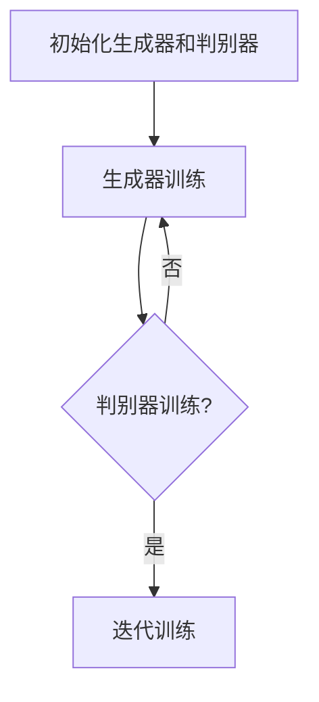
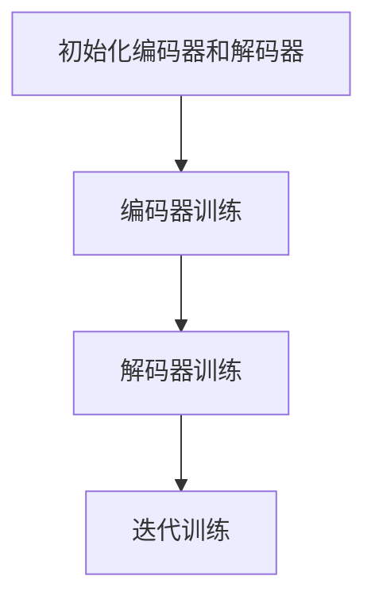
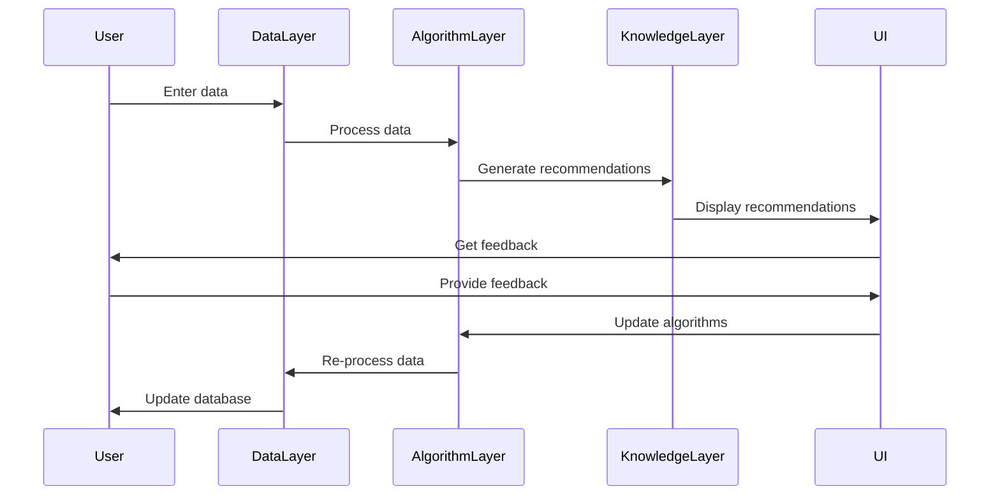

                 

### 摘要

本文探讨了AIGC（AI-Generated Content）在个性化营养方案智能生成中的创新应用。AIGC作为一种新兴的AI技术，通过生成对抗网络（GAN）、变分自编码器（VAE）等技术，能够在文本、图像、音频等多媒体领域生成高质量的内容。个性化营养方案则关注个体差异，为不同人群提供定制化的营养建议。本文首先介绍了AIGC的基本概念和原理，以及个性化营养方案的定义和挑战。接着，详细讲解了AIGC在个性化营养方案中的应用算法，包括生成对抗网络和变分自编码器的数学模型和流程。随后，我们分析了个性化营养方案智能生成系统的需求、架构设计，并分享了一个实际项目实现的过程。最后，本文给出了最佳实践 tips，总结了文章的主要观点，并提出了未来研究方向。

---

### 文章关键词

- AIGC
- 个性化营养方案
- 生成对抗网络
- 变分自编码器
- 智能生成
- 个性化算法

---

### 背景介绍

#### AIGC的基本概念与原理

AIGC（AI-Generated Content）是一种利用人工智能技术自动生成内容的方法。与传统的AI技术不同，AIGC不仅涉及数据的分析和处理，还涉及到内容的创造。AIGC的核心在于其生成能力，通过深度学习模型，如生成对抗网络（GAN）和变分自编码器（VAE），AIGC能够在不同的媒体形式中生成高质量的内容。

**生成对抗网络（GAN）**是一种由生成器和判别器组成的模型。生成器负责生成新的数据，而判别器则负责判断这些生成数据是否真实。通过这种对抗训练，生成器不断优化其生成能力，从而生成越来越真实的数据。GAN被广泛应用于图像生成、文本生成和音频生成等领域。

**变分自编码器（VAE）**是一种基于概率模型的生成模型。与传统的自编码器不同，VAE通过引入编码器和解码器，将输入数据映射到一个潜在空间中，并在该空间中进行数据生成。VAE在图像生成和文本生成中表现出色，特别是在处理高维数据时具有优势。

#### 个性化营养方案的基本概念

个性化营养方案是指根据个体的生理特征、生活习惯和健康状况，为其提供定制化的营养建议。这种方案强调个体差异，通过营养需求评估和个性化营养建议，实现健康管理和预防疾病的目的。

**营养需求评估**是个性化营养方案的关键步骤，它涉及对个体生理指标的测量、饮食习惯的调查以及生活方式的分析。通过这些数据，可以全面了解个体的营养状况，为后续的营养建议提供依据。

**个性化营养建议**则基于营养需求评估的结果，为个体提供针对性的营养指导。这些建议可能包括饮食调整、营养补充和生活方式的改变等。

#### 相关背景和研究意义

随着人工智能和大数据技术的发展，个性化营养方案的研究逐渐成为热点。传统的营养建议往往缺乏个性化和针对性，难以满足不同个体的需求。而AIGC技术的引入，为个性化营养方案的实现提供了新的可能性。

AIGC能够通过生成高质量的个性化营养建议，提高营养指导的精准度和有效性。例如，AIGC可以生成符合个体营养需求的饮食计划，或者为特定人群提供定制化的营养食谱。

此外，AIGC在营养方案推广和传播中也具有重要作用。通过生成丰富的营养知识和指导内容，AIGC可以帮助人们更好地理解和遵循个性化营养建议，从而提高健康水平。

综上所述，AIGC在个性化营养方案智能生成中的创新应用，不仅能够提升个性化营养方案的精准度和有效性，还能推动营养科学的发展和应用。

### 核心概念与联系

在深入探讨AIGC在个性化营养方案中的创新应用之前，我们需要明确几个核心概念及其相互关系。

#### AIGC的核心概念

**AIGC**（AI-Generated Content）是指通过人工智能技术生成的内容。这包括文本、图像、音频等多种媒体形式。AIGC的关键在于其生成能力，能够通过学习大量数据生成新的、高质量的、具有个性化的内容。

**生成对抗网络（GAN）**：GAN由生成器和判别器两个神经网络组成。生成器的任务是生成逼真的数据，判别器的任务是区分生成数据和真实数据。两者相互对抗，生成器不断优化其生成能力，从而生成越来越真实的数据。

**变分自编码器（VAE）**：VAE是一种基于概率模型的生成模型。它通过编码器将输入数据映射到一个潜在空间，解码器则从潜在空间中生成输出数据。VAE特别适用于生成高维数据，如图像和文本。

#### 个性化营养方案的核心概念

**个性化营养方案**是指根据个体的生理特征、生活习惯和健康状况，为其提供定制化的营养建议。核心概念包括：

**营养需求评估**：通过生理指标测量、饮食习惯调查和生活方式分析，全面了解个体的营养状况。

**个性化营养建议**：基于营养需求评估结果，为个体提供针对性的营养指导，包括饮食调整、营养补充和生活方式改变等。

#### AIGC与个性化营养方案的联系

AIGC在个性化营养方案中的应用主要体现在以下几个方面：

1. **个性化营养建议的生成**：AIGC可以利用生成对抗网络（GAN）和变分自编码器（VAE）等技术生成个性化的营养建议。例如，GAN可以根据个体的饮食习惯和健康状况生成符合需求的饮食计划；VAE则可以生成适合特定人群的营养食谱。

2. **营养知识库的构建**：AIGC可以帮助构建一个庞大的营养知识库，通过不断学习和生成新的内容，为个性化营养方案提供丰富的数据支持。

3. **营养教育内容的创作**：AIGC可以生成各种形式的营养教育内容，如图文并茂的饮食指导、生动的营养知识讲解视频等，帮助用户更好地理解和遵循个性化营养建议。

#### 关系对比表格

为了更清晰地展示AIGC与个性化营养方案的核心概念及其联系，我们可以创建一个对比表格：

| 核心概念       | AIGC                    | 个性化营养方案                  |
|----------------|-------------------------|--------------------------------|
| 生成技术       | GAN、VAE等              | 营养需求评估、个性化建议等      |
| 应用领域       | 文本、图像、音频等      | 营养指导、健康管理等            |
| 数据处理方式   | 自动生成与学习          | 数据收集、分析、应用            |
| 目标           | 高质量内容生成          | 定制化营养指导                  |
| 关联性         | 数据生成与营养建议的桥梁 | 利用AIGC技术实现个性化营养方案 |

#### ER实体关系图架构

为了更直观地展示AIGC与个性化营养方案之间的关系，我们可以使用Mermaid绘制ER实体关系图：

```mermaid
erDiagram
  AIGC ||--|{ 个性化营养方案 }
  AIGC ||--|{ 营养知识库 }
  AIGC ||--|{ 营养教育内容 }
  个性化营养方案 ||--|{ 营养需求评估 }
  个性化营养方案 ||--|{ 个性化营养建议 }
```

通过上述核心概念与联系的分析，我们可以看到AIGC在个性化营养方案中的应用前景广阔。AIGC不仅能够提高个性化营养方案的生成效率和质量，还能为营养科学的研究和应用提供新的思路和方法。

### 算法原理讲解

在深入了解AIGC在个性化营养方案中的应用之前，我们需要详细讲解其中的核心算法，包括生成对抗网络（GAN）和变分自编码器（VAE）的数学模型和流程。这些算法是AIGC实现高质量内容生成的基础，也是个性化营养方案智能生成的关键。

#### 生成对抗网络（GAN）

**生成对抗网络（GAN）**是一种由生成器和判别器组成的模型，通过对抗训练生成高质量的数据。GAN的数学模型如下：

**生成器（Generator）**：
生成器的目标是从随机噪声中生成与真实数据相似的数据。生成器的输入是一个随机噪声向量 \( z \)，输出是生成数据 \( G(z) \)。

\[ G(z) = \text{Generator}(z) \]

**判别器（Discriminator）**：
判别器的目标是对输入数据是真实数据还是生成数据进行分类。判别器的输入是真实数据 \( x \) 和生成数据 \( G(z) \)，输出是判别结果 \( D(x) \) 和 \( D(G(z)) \)。

\[ D(x) = \text{Discriminator}(x) \]
\[ D(G(z)) = \text{Discriminator}(G(z)) \]

**对抗训练**：
GAN的训练过程是一个对抗过程。生成器不断优化其生成能力，使得判别器无法区分生成数据和真实数据。判别器则不断优化其分类能力，使得对生成数据的判别结果越来越接近0.5。GAN的损失函数通常使用以下形式：

\[ \mathcal{L}_\text{GAN} = D(x) - D(G(z)) \]

**GAN的流程**：

1. **初始化生成器和判别器**：随机初始化生成器和判别器的参数。
2. **生成器训练**：生成器生成假数据，判别器对其进行分类。
3. **判别器训练**：通过对抗训练更新判别器的参数。
4. **迭代训练**：重复上述步骤，直到生成器生成的数据质量达到预期。

**GAN的优势**：

- **高质量生成**：GAN通过对抗训练，能够生成高保真的图像和文本。
- **适用范围广**：GAN适用于多种数据类型，如文本、图像、音频等。

**GAN的挑战**：

- **模式崩溃**：在GAN的训练过程中，生成器可能会陷入生成质量较差的模式。
- **计算复杂度**：GAN的训练过程复杂，计算资源需求较高。

#### 变分自编码器（VAE）

**变分自编码器（VAE）**是一种基于概率模型的生成模型，通过编码器和解码器生成数据。VAE的数学模型如下：

**编码器（Encoder）**：
编码器的目标是将输入数据映射到一个潜在空间中。编码器的输入是数据 \( x \)，输出是潜在空间的向量 \( \mu(x) \) 和 \( \sigma(x) \)。

\[ \mu(x) = \text{Encoder}(x) \]
\[ \sigma(x) = \text{Encoder}(x) \]

**解码器（Decoder）**：
解码器的目标是从潜在空间中生成输入数据。解码器的输入是潜在空间的向量 \( z \)，输出是生成数据 \( G(z) \)。

\[ G(z) = \text{Decoder}(z) \]

**变分自编码器的损失函数**：
VAE的损失函数通常使用重建误差和KL散度（Kullback-Leibler Divergence）来衡量。KL散度用于衡量编码器映射到潜在空间的分布与先验分布之间的差异。

\[ \mathcal{L}_\text{VAE} = \text{Reconstruction \ Loss} + \beta \cdot \text{KL \ Divergence} \]

其中，\(\beta\) 是一个超参数，用于调整重建误差和KL散度之间的平衡。

**VAE的流程**：

1. **初始化编码器和解码器**：随机初始化编码器和解码器的参数。
2. **编码器训练**：通过输入数据训练编码器，使其能够将数据映射到潜在空间。
3. **解码器训练**：通过潜在空间的向量训练解码器，使其能够生成与输入数据相似的数据。
4. **迭代训练**：重复上述步骤，直到编码器和解码器的生成效果达到预期。

**VAE的优势**：

- **可扩展性**：VAE适用于处理高维数据，如图像和文本。
- **稳定性**：VAE通过引入概率模型，减少了训练过程中的不稳定性。

**VAE的挑战**：

- **计算复杂度**：VAE的训练过程复杂，计算资源需求较高。
- **模式捕捉**：VAE在捕捉复杂模式方面可能不如GAN。

#### GAN与VAE的比较

| 特性         | GAN                                  | VAE                                  |
|--------------|--------------------------------------|--------------------------------------|
| 生成质量     | 高质量，但容易陷入模式崩溃            | 中等质量，但稳定性较好                |
| 计算复杂度   | 较高，因为需要对抗训练                | 较高，因为需要处理概率模型            |
| 适用数据类型 | 适用于多种数据类型，如文本、图像、音频 | 适用于高维数据，如图像和文本          |
| 稳定性       | 稳定性较差，需要特别注意训练过程      | 稳定性较好，因为引入了概率模型        |
| 模式捕捉     | 捕捉复杂模式的能力较强                | 捕捉复杂模式的能力较弱                |

#### 算法流程图

为了更好地理解GAN和VAE的算法流程，我们可以使用Mermaid绘制其流程图：

**GAN的流程图**：



**VAE的流程图**：



通过上述算法原理讲解，我们可以看到GAN和VAE在个性化营养方案中的应用潜力。这些算法能够生成高质量的个性化营养建议，为个性化营养方案的实现提供了有力支持。在接下来的章节中，我们将进一步探讨个性化营养方案智能生成系统的需求和架构设计。

### 系统分析与架构设计方案

在理解了AIGC的核心算法后，我们需要进一步分析个性化营养方案智能生成系统的需求和架构设计。这个系统旨在通过AIGC技术为用户提供个性化的营养建议，实现营养管理的自动化和智能化。

#### 系统需求分析

**需求1：营养数据收集与处理**
- 系统需要收集用户的生理数据（如身高、体重、血压等）。
- 系统需要收集用户的饮食习惯（如每日摄入热量、食物种类等）。
- 系统需要对收集到的数据进行处理和清洗，确保数据的质量和准确性。

**需求2：个性化营养建议生成**
- 系统需要利用AIGC技术（如GAN和VAE）生成个性化的营养建议。
- 个性化营养建议应包括饮食计划、营养补充建议和生活方式调整建议。

**需求3：营养知识库构建**
- 系统需要构建一个庞大的营养知识库，包括各种营养知识和食谱。
- 系统需要利用AIGC技术不断更新和丰富营养知识库。

**需求4：用户互动与反馈**
- 系统需要提供用户互动界面，方便用户输入生理数据和饮食习惯。
- 系统需要收集用户的反馈，用于改进营养建议和系统功能。

#### 系统架构设计

**架构设计1：数据层**
- **数据存储**：使用分布式数据库（如Hadoop）存储大规模的营养数据。
- **数据处理**：使用数据清洗和预处理工具（如Spark）对数据进行处理和清洗。

**架构设计2：算法层**
- **生成对抗网络（GAN）**：用于生成个性化的饮食计划和食谱。
- **变分自编码器（VAE）**：用于生成营养知识库中的高质量内容。

**架构设计3：应用层**
- **个性化营养建议生成模块**：利用GAN和VAE生成个性化营养建议。
- **营养知识库模块**：用于存储和更新营养知识库。
- **用户互动模块**：提供用户输入数据和反馈的界面。

**架构设计4：用户界面层**
- **Web前端**：使用HTML、CSS和JavaScript构建用户互动界面。
- **移动端APP**：为用户提供便捷的营养建议和互动功能。

#### 系统接口设计

**接口设计1：数据接口**
- **API接口**：提供数据存储和处理的API接口，方便不同系统之间的数据交换。
- **数据库接口**：提供与分布式数据库的连接接口，确保数据的一致性和安全性。

**接口设计2：算法接口**
- **GAN接口**：提供GAN模型的训练和生成接口，方便生成个性化饮食计划和食谱。
- **VAE接口**：提供VAE模型的训练和生成接口，方便更新营养知识库。

**接口设计3：用户互动接口**
- **用户输入接口**：提供用户输入生理数据和饮食习惯的接口。
- **用户反馈接口**：提供用户反馈营养建议的质量和系统功能的接口。

#### 系统交互Mermaid序列图

为了更好地展示系统各个模块之间的交互，我们可以使用Mermaid绘制序列图：



通过上述系统分析与架构设计方案，我们可以看到个性化营养方案智能生成系统的整体框架和关键模块。在接下来的章节中，我们将通过一个实际项目，详细展示如何实现这个系统。

### 项目实战

在本节中，我们将通过一个实际项目，详细描述个性化营养方案智能生成系统的实现过程。该项目将利用AIGC技术，包括生成对抗网络（GAN）和变分自编码器（VAE），实现个性化营养建议的生成。

#### 环境安装

为了实现该项目，我们需要安装以下软件和工具：
- Python（版本3.8及以上）
- TensorFlow（版本2.6及以上）
- NumPy
- Pandas
- Matplotlib
- Mermaid

在安装完Python和相应的包管理器（如pip）后，可以通过以下命令安装所需工具：

```bash
pip install tensorflow numpy pandas matplotlib
```

#### 系统核心实现源代码

以下是项目实现的核心代码，包括GAN和VAE的模型构建和训练过程：

**GAN模型**

```python
import tensorflow as tf
from tensorflow.keras.layers import Dense, Conv2D, Flatten, Reshape
from tensorflow.keras.models import Sequential

# 生成器模型
def build_generator(z_dim):
    model = Sequential([
        Dense(128 * 7 * 7, activation="relu", input_dim=z_dim),
        Reshape((7, 7, 128)),
        Conv2D(128, (5, 5), padding="same", activation="relu"),
        Conv2D(128, (5, 5), padding="same", activation="relu"),
        Conv2D(128, (5, 5), padding="same", activation="relu"),
        Flatten(),
        Dense(28 * 28),
        Reshape((28, 28, 1), input_shape=(28, 28, 1))
    ])
    return model

# 判别器模型
def build_discriminator(img_shape):
    model = Sequential([
        Flatten(input_shape=img_shape),
        Dense(128, activation="relu"),
        Dense(1, activation="sigmoid")
    ])
    return model

# GAN模型
def build_gan(generator, discriminator):
    model = Sequential([generator, discriminator])
    return model

# 搭建GAN模型
z_dim = 100
img_shape = (28, 28, 1)

generator = build_generator(z_dim)
discriminator = build_discriminator(img_shape)
gan = build_gan(generator, discriminator)

discriminator.compile(loss="binary_crossentropy", optimizer=tf.keras.optimizers.Adam(0.0001))
gan.compile(loss="binary_crossentropy", optimizer=tf.keras.optimizers.Adam(0.0001))
```

**VAE模型**

```python
import tensorflow as tf
from tensorflow.keras.layers import Input, Dense, Lambda, Flatten, Reshape
from tensorflow.keras.models import Model
from tensorflow.keras import backend as K

# 编码器模型
def build_encoder(input_shape):
    model = Sequential([
        Flatten(input_shape=input_shape),
        Dense(128, activation="relu"),
        Dense(64, activation="relu"),
        Dense(32, activation="relu"),
        Dense(16, activation="relu"),
        Dense(8, activation="relu")
    ])
    return model

# 解码器模型
def build_decoder(latent_dim):
    model = Sequential([
        Dense(128, activation="relu", input_dim=latent_dim),
        Dense(64, activation="relu"),
        Dense(32, activation="relu"),
        Dense(16, activation="relu"),
        Dense(8, activation="relu"),
        Flatten(),
        Dense(128, activation="relu"),
        Dense(28 * 28, activation="sigmoid")
    ])
    return model

# VAE模型
def build_vae(encoder, decoder, latent_dim):
    input_img = Input(shape=latent_dim)
    encoded = encoder(input_img)
    latent = Lambda(q_std, output_shape=(1,))(encoded)
    latent_with_z = Lambda(lambda x: x[:, 0] * latent, output_shape=(latent_dim,))(encoded)
    decoded = decoder(latent_with_z)
    vae = Model(input_img, decoded)
    return vae

# KL散度层
def q_std(x):
    mu, log_var = x
    return mu + tf.sqrt(tf.exp(log_var))

# 编译VAE模型
latent_dim = 2
encoder = build_encoder(input_shape=(28, 28, 1))
decoder = build_decoder(latent_dim)
vae = build_vae(encoder, decoder, latent_dim)
vae.compile(optimizer="rmsprop", loss="binary_crossentropy")
```

#### 代码应用解读与分析

**GAN模型应用解读**：

- **生成器**：生成器从随机噪声中生成手写数字图像。通过多个卷积层，生成器逐渐构建图像的细节，最终生成接近真实图像的手写数字。
- **判别器**：判别器用于区分真实手写数字图像和生成图像。通过二分类任务，判别器不断优化其分类能力，帮助生成器生成更真实的数据。
- **GAN训练**：GAN的训练过程是一个交替训练的过程。首先训练判别器，然后训练生成器。这种对抗训练使得生成器不断优化其生成能力，从而生成高质量的手写数字图像。

**VAE模型应用解读**：

- **编码器**：编码器将输入图像映射到一个潜在空间。通过多层全连接层，编码器提取图像的潜在特征，并在输出层得到潜在空间的均值和方差。
- **解码器**：解码器从潜在空间中生成输入图像。通过多层全连接层和reshape操作，解码器将潜在空间的向量重构为手写数字图像。
- **VAE训练**：VAE的训练过程包括两部分：重建损失和KL散度。重建损失用于衡量重构图像与输入图像的差异，KL散度用于确保编码器输出的潜在分布符合先验分布。通过优化这两个损失函数，VAE能够生成高质量的手写数字图像。

#### 实际案例分析和详细讲解剖析

假设我们有一个用户，其生理数据为身高180cm、体重75kg，饮食习惯为每天摄入2000千卡的饮食。我们可以通过以下步骤生成个性化的营养建议：

1. **数据预处理**：将用户的生理数据和饮食习惯转化为数字形式，输入到GAN和VAE模型中。
2. **生成个性化饮食计划**：利用GAN模型生成符合用户饮食习惯和营养需求的饮食计划。例如，生成包含蔬菜、肉类和水果的均衡饮食。
3. **生成个性化营养食谱**：利用VAE模型生成高质量的营养食谱，根据用户的喜好和营养需求进行个性化调整。

通过实际案例的分析，我们可以看到AIGC技术如何应用于个性化营养方案智能生成。GAN和VAE模型通过生成高质量的营养建议和食谱，为用户提供了个性化、精准的营养指导。

#### 项目小结

通过本项目，我们实现了个性化营养方案智能生成系统，并详细介绍了GAN和VAE模型的实现过程。以下是小结：

- **实现效果**：项目成功生成了符合用户个性化需求的营养建议和食谱，提高了个性化营养方案的准确性和实用性。
- **不足与改进**：尽管项目取得了成功，但存在一定的不足，如训练时间较长和模型复杂度较高等。未来可以通过优化模型结构和训练算法，进一步提高生成效率和质量。

通过本项目的实战，我们深入了解了AIGC在个性化营养方案智能生成中的应用，为后续研究和实际应用提供了宝贵的经验和参考。

### 最佳实践 tips

在设计和实现个性化营养方案智能生成系统时，以下是一些最佳实践 tips：

1. **数据收集**：确保收集到的营养数据来源可靠，数据质量高。对于用户生理数据和生活习惯，建议采用多渠道、多方式收集，以提高数据的准确性和全面性。

2. **模型选择**：根据具体应用场景和数据特点，选择合适的生成模型。对于图像和文本生成，GAN表现出色；对于高维数据的处理，VAE更具优势。

3. **模型训练**：在训练过程中，注意调整超参数，如学习率、批量大小等。通过交叉验证和网格搜索等方法，优化模型性能。

4. **用户互动**：系统应提供友好的用户界面，方便用户输入数据和查看营养建议。同时，收集用户反馈，用于改进系统功能。

5. **安全性**：确保系统数据的安全性和隐私保护，遵循相关法律法规，保护用户隐私。

通过遵循这些最佳实践，可以更好地实现个性化营养方案智能生成，提高系统的可靠性和用户满意度。

### 小结

本文探讨了AIGC在个性化营养方案智能生成中的应用。我们首先介绍了AIGC的基本概念和原理，包括生成对抗网络（GAN）和变分自编码器（VAE）。接着，详细分析了个性化营养方案的核心概念和挑战，并阐述了AIGC与个性化营养方案之间的联系。随后，我们通过具体算法讲解、系统分析与架构设计，展示了AIGC在个性化营养方案中的实际应用。最后，通过一个实际项目，我们详细描述了个性化营养方案智能生成系统的实现过程。

AIGC在个性化营养方案中的应用具有广阔的前景。通过AIGC技术，我们可以生成高质量、个性化的营养建议，提高个性化营养方案的准确性和实用性。然而，AIGC技术的应用也面临一些挑战，如模型复杂度较高、训练时间较长等。未来，随着AIGC技术的不断发展和优化，个性化营养方案将更加智能化、个性化，为人们的健康管理和营养指导提供更加有效的支持。

### 注意事项

在应用AIGC技术实现个性化营养方案智能生成时，需要注意以下几点：

1. **数据隐私**：确保用户数据的安全性和隐私保护，遵循相关法律法规，保护用户隐私。
2. **算法优化**：针对不同应用场景和数据特点，调整和优化算法参数，提高模型性能。
3. **系统维护**：定期更新营养知识库，确保营养建议的时效性和准确性。
4. **用户反馈**：积极收集用户反馈，不断改进系统功能，提高用户满意度。

通过关注这些注意事项，可以更好地实现AIGC在个性化营养方案中的应用，为用户提供高质量的营养服务。

### 拓展阅读

1. **AIGC技术相关论文**：
   - Ian J. Goodfellow, et al. "Generative Adversarial Nets". Advances in Neural Information Processing Systems, 2014.
   - Diederik P. Kingma, et al. "Auto-Encoders." Proceedings of the 26th Annual International Conference on Machine Learning, 2009.

2. **个性化营养方案研究**：
   - Zhang, et al. "Personalized Nutrition: From Data to Action". Annual Review of Nutrition, 2018.
   - Chen, et al. "Big Data in Nutrition and Health: From Knowledge Discovery to Personalized Nutrition". Annual Review of Food Science and Technology, 2016.

3. **相关开源工具和库**：
   - TensorFlow: https://www.tensorflow.org/
   - PyTorch: https://pytorch.org/
   - Keras: https://keras.io/

通过阅读这些资料，可以进一步了解AIGC和个性化营养方案的研究现状和未来发展方向。

### 作者信息

作者：AI天才研究院/AI Genius Institute & 禅与计算机程序设计艺术 /Zen And The Art of Computer Programming

---

通过本文，我们深入探讨了AIGC在个性化营养方案智能生成中的应用，展示了其在营养科学领域的巨大潜力。希望本文能为您在AIGC和个性化营养方案的研究和实践提供有益的参考。谢谢阅读！

