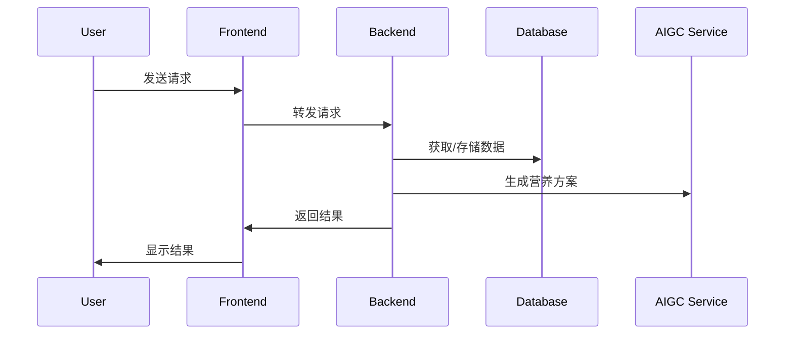
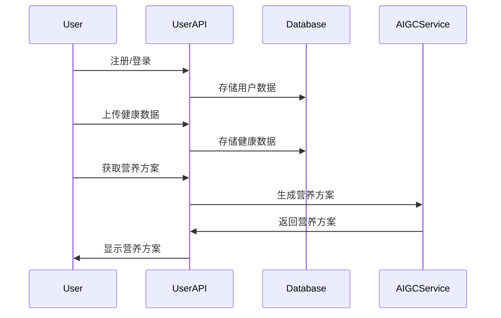
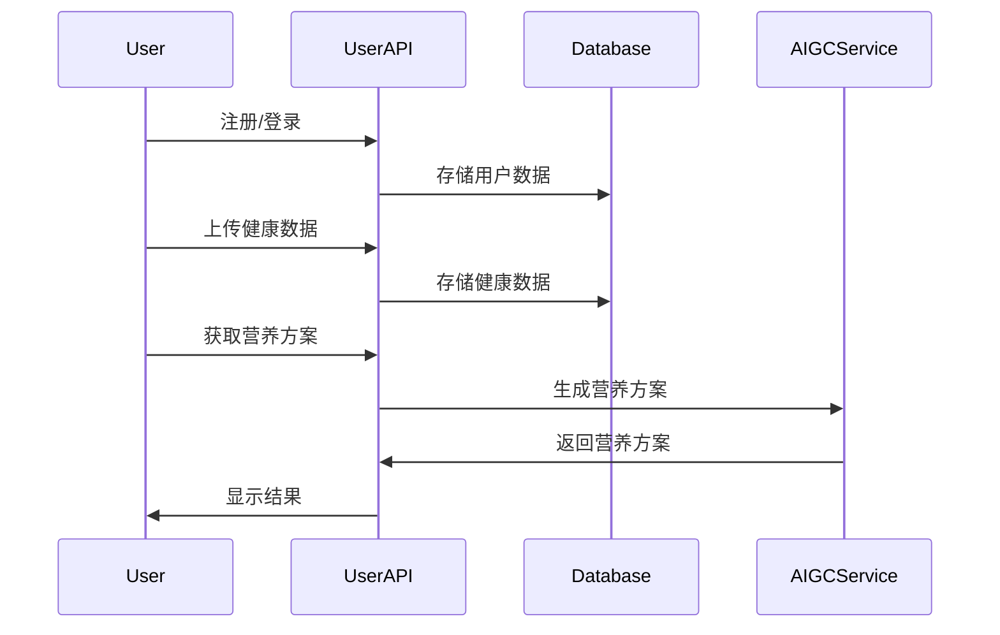

                 


### 文章标题：AIGC在个性化营养方案设计中的创新探索

#### 关键词：
- AIGC
- 个性化营养方案
- 机器学习
- 数据分析
- 个性化服务

#### 摘要：
本文将探讨如何利用AIGC（AI-Generated Content）技术在个性化营养方案设计中实现创新。通过详细分析AIGC技术的核心原理和其在营养领域的应用，本文将介绍个性化营养方案的理论与实践，并展示系统设计与案例研究的成果。最后，本文将展望AIGC技术的未来发展趋势，为营养领域的创新发展提供新思路。

----------------------------------------------------------------

## 目录大纲设计思路

为了设计出《AIGC在个性化营养方案设计中的创新探索》这本书的完整目录大纲，我们需要遵循以下步骤：

### 1. 理解书籍主题
- 书名中提到了“AIGC在个性化营养方案设计中的创新探索”，因此书籍的核心主题可以理解为利用AIGC（AI-Generated Content）技术来开发个性化营养方案。

### 2. 明确书籍结构
- 考虑到书籍的读者对象，书籍应该包括以下几个部分：
  - 引言与背景介绍
  - AIGC技术基础
  - 个性化营养方案的理论与实践
  - 系统设计与案例分析
  - 未来展望与趋势分析
  - 总结与结论

### 3. 确定目录结构
- 目录结构应包括以下级别：
  - # 第1部分：引言与背景介绍
  - # 第2部分：AIGC技术基础
  - # 第3部分：个性化营养方案的理论与实践
  - # 第4部分：系统设计与案例分析
  - # 第5部分：未来展望与趋势分析
  - # 第6部分：总结与结论

### 4. 制定每个章节的具体内容
- 每个部分下的章节内容需要进一步细化，以确保内容的完整性和逻辑性。例如：
  - 第1部分：引言与背景介绍
    - 第1章：问题的背景与重要性
    - 第2章：AIGC技术简介
    - 第3章：个性化营养方案概述
  - 第2部分：AIGC技术基础
    - 第4章：AIGC技术原理
    - 第5章：AIGC技术在营养领域的应用
    - 第6章：AIGC技术的挑战与解决方案
  - 第3部分：个性化营养方案的理论与实践
    - 第7章：个性化营养方案的理论基础
    - 第8章：个性化营养方案的设计方法
    - 第9章：个性化营养方案的实施流程
    - 第10章：个性化营养方案的效果评估
  - 第4部分：系统设计与案例分析
    - 第11章：系统需求分析与设计
    - 第12章：系统架构设计
    - 第13章：案例研究与剖析
  - 第5部分：未来展望与趋势分析
    - 第14章：AIGC技术的未来发展方向
    - 第15章：个性化营养方案的挑战与机遇
    - 第16章：营养领域的未来发展
  - 第6部分：总结与结论
    - 第17章：总结与展望

### 5. 确保内容完整性
- 每个章节都需要包含核心概念、原理讲解、案例分析和最佳实践等，以确保读者能够全面理解书籍主题。

### 6. 字数控制
- 确保整个目录大纲的总字数不超过2000字。

## 下一步行动

- 根据上述设计思路，我们现在可以开始编写具体的目录大纲，确保每个章节的内容都满足上述要求。我们将使用markdown格式来组织目录，并确保内容简洁明了，结构清晰。

让我们开始编写这个目录大纲吧！

----------------------------------------------------------------

## 1. 引言与背景介绍

### 1.1 核心概念术语说明

在探讨AIGC在个性化营养方案设计中的应用之前，我们需要先了解一些核心概念术语：

- **AIGC（AI-Generated Content）**：指利用人工智能技术自动生成内容的过程，涵盖文本、图像、音频等多种形式。
- **个性化营养方案**：根据个体的生理、心理、生活习惯等多方面因素，为其定制个性化的饮食计划和营养建议。
- **机器学习**：一种人工智能方法，通过数据训练模型，使其能够自动识别模式和做出决策。
- **数据分析**：通过统计学和计算机科学方法，对大量数据进行处理和分析，以提取有价值的信息。

### 1.2 问题背景

随着人们对健康和生活质量的要求不断提高，个性化营养方案变得越来越重要。然而，传统的营养方案往往缺乏个性化和实时性，难以满足现代人的需求。AIGC技术的兴起为个性化营养方案的设计带来了新的可能性。通过AIGC，我们可以利用大量数据，实现实时、个性化的营养建议，为用户提供更加精准和高效的服务。

### 1.3 问题描述

个性化营养方案设计面临的主要挑战包括：

- **数据多样性**：营养数据来源多样，包括生理指标、生活习惯、饮食习惯等，如何有效地整合这些数据是一个难题。
- **数据质量**：营养数据质量参差不齐，存在噪声和错误，如何保证数据质量是一个关键问题。
- **个性化需求**：个性化营养方案需要根据个体的不同需求进行定制，如何满足这些需求是一个挑战。

### 1.4 问题解决

AIGC技术在个性化营养方案设计中的应用可以从以下几个方面解决上述问题：

- **数据整合与处理**：利用AIGC技术，可以自动整合和处理大量数据，提取有价值的信息。
- **实时更新与个性化**：通过AIGC技术，可以实现营养方案的实时更新和个性化定制，为用户提供更加精准的服务。
- **算法优化**：利用机器学习技术，可以对营养方案进行不断优化，提高其效果和准确性。

### 1.5 边界与外延

AIGC在个性化营养方案设计中的应用边界主要涉及以下几个方面：

- **技术边界**：AIGC技术的应用范围和限制，例如数据来源、算法性能等。
- **应用边界**：个性化营养方案的具体应用场景，例如健康管理、慢性病预防等。
- **伦理边界**：AIGC技术在营养方案设计中的应用可能涉及个人隐私和伦理问题，需要合理应对。

### 1.6 概念结构与核心要素组成

AIGC在个性化营养方案设计中的概念结构可以概括为以下几个核心要素：

- **数据输入**：包括生理指标、生活习惯、饮食习惯等。
- **数据处理**：利用机器学习和数据分析技术，对数据进行处理和整合。
- **模型训练**：利用训练数据，训练出个性化的营养方案模型。
- **方案生成**：根据用户需求，生成个性化的营养方案。
- **效果评估**：对生成的营养方案进行评估和优化。

## 1.7 关键概念与联系

### AIGC技术原理

AIGC技术主要包括以下几个方面：

1. **内容生成**：利用自然语言处理（NLP）技术，自动生成文本、图像、音频等内容。
2. **内容优化**：利用深度学习技术，对生成的内容进行优化，提高其质量和可用性。
3. **内容应用**：将生成的内容应用于实际场景，例如个性化营养方案设计。

### 个性化营养方案概述

个性化营养方案主要包括以下几个核心概念：

1. **个性化**：根据个体的生理、心理、生活习惯等多方面因素，为其定制个性化的饮食计划和营养建议。
2. **实时性**：根据用户实时变化的需求和反馈，不断调整和优化营养方案。
3. **效果评估**：对生成的营养方案进行评估和优化，提高其效果和准确性。

### 1.8 总结

本部分介绍了AIGC在个性化营养方案设计中的核心概念、问题背景和解决方案。通过理解这些概念和联系，我们可以更好地把握AIGC技术在营养方案设计中的应用方向和挑战。接下来，我们将深入探讨AIGC技术的核心原理和个性化营养方案的理论与实践。

----------------------------------------------------------------

## 2. AIGC技术基础

### 2.1 AIGC技术原理

AIGC（AI-Generated Content）技术是指利用人工智能算法生成内容的方法。其核心原理包括以下几个方面：

1. **内容生成**：利用自然语言处理（NLP）技术，自动生成文本、图像、音频等内容。例如，通过生成对抗网络（GAN）和变分自编码器（VAE）等技术，可以生成高质量的文本和图像。

2. **内容优化**：利用深度学习技术，对生成的内容进行优化，提高其质量和可用性。例如，通过对抗性训练和强化学习等技术，可以不断优化生成的内容，使其更符合用户需求。

3. **内容应用**：将生成的内容应用于实际场景，例如个性化营养方案设计。通过将AIGC技术应用于营养领域，可以实现个性化饮食计划和营养建议的自动生成。

### 2.2 AIGC技术在营养领域的应用

AIGC技术在营养领域具有广泛的应用前景。以下是一些具体的应用场景：

1. **个性化饮食计划生成**：利用AIGC技术，可以根据用户的生理指标、生活习惯和饮食习惯，生成个性化的饮食计划。例如，通过NLP技术，可以生成详细的食谱和营养建议。

2. **营养知识库构建**：利用AIGC技术，可以自动构建营养知识库，包括各种食物的营养成分、营养功效等。例如，通过GAN技术，可以生成丰富的食物图像和营养成分数据。

3. **营养信息可视化**：利用AIGC技术，可以将复杂的营养信息进行可视化处理，帮助用户更直观地理解营养知识。例如，通过生成对抗网络，可以生成直观的营养图表和图表可视化。

4. **营养方案评估与优化**：利用AIGC技术，可以对营养方案进行实时评估和优化。例如，通过深度学习技术，可以不断优化营养方案，提高其效果和准确性。

### 2.3 AIGC技术的挑战与解决方案

尽管AIGC技术在营养领域具有巨大潜力，但在实际应用中仍面临一些挑战。以下是一些常见的挑战及其解决方案：

1. **数据质量**：营养数据质量参差不齐，存在噪声和错误。解决方案包括数据清洗、数据去噪和异常值处理等。

2. **算法性能**：AIGC技术的算法性能直接影响其应用效果。解决方案包括算法优化、模型压缩和分布式计算等。

3. **用户隐私**：AIGC技术在营养领域应用可能涉及个人隐私。解决方案包括隐私保护技术和数据加密等。

4. **伦理问题**：AIGC技术在营养领域应用可能涉及伦理问题。解决方案包括制定伦理规范和加强用户教育等。

### 2.4 AIGC技术的核心原理对比表格

为了更好地理解AIGC技术的核心原理，我们可以通过对比表格来展示不同技术的特点：

| 技术名称 | 内容生成 | 内容优化 | 内容应用 |
| --- | --- | --- | --- |
| 自然语言处理（NLP） | √ | √ | √ |
| 生成对抗网络（GAN） | √ | √ | √ |
| 变分自编码器（VAE） | √ | √ | √ |
| 强化学习 | × | √ | √ |
| 对抗性训练 | × | √ | √ |

### 2.5 AIGC技术的ER实体关系图架构

为了更清晰地理解AIGC技术在营养领域中的应用，我们可以使用ER（Entity-Relationship）实体关系图来描述不同实体之间的关系。以下是AIGC技术在营养领域中的ER实体关系图架构：

```mermaid
erDiagram
  User ||--o> DietPlan : "生成"
  User ||--o> NutritionalKnowledge : "获取"
  DietPlan ||--< User : "应用"
  NutritionalKnowledge ||--< User : "应用"
  DietaryData ||--< DietPlan : "输入"
  DietaryData ||--< NutritionalKnowledge : "输入"
```

在上面的ER实体关系图中，User（用户）与DietPlan（饮食计划）和NutritionalKnowledge（营养知识）之间存在生成和应用关系。同时，DietaryData（饮食习惯数据）是生成饮食计划和营养知识的输入。

### 2.6 总结

本部分介绍了AIGC技术的核心原理和在营养领域的应用。通过理解AIGC技术的原理、应用场景和挑战，我们可以更好地把握其在个性化营养方案设计中的潜力。接下来，我们将进一步探讨个性化营养方案的理论与实践。

----------------------------------------------------------------

## 3. 个性化营养方案的理论与实践

### 3.1 个性化营养方案的理论基础

个性化营养方案的理论基础主要包括以下几个方面：

1. **营养学基础**：个性化营养方案的设计需要建立在科学营养学的基础上，了解不同营养素的作用、食物来源和推荐摄入量。

2. **生理学基础**：个性化营养方案需要考虑个体的生理特点，如年龄、性别、健康状况等，以制定适合其生理需求的营养方案。

3. **行为学基础**：个性化营养方案需要考虑个体的饮食习惯和行为模式，如饮食习惯、生活习惯等，以制定易于实施的方案。

4. **心理学基础**：个性化营养方案的设计还需要考虑个体的心理需求，如情绪管理、压力应对等，以提高方案的接受度和效果。

### 3.2 个性化营养方案的设计方法

个性化营养方案的设计方法主要包括以下几个步骤：

1. **需求分析**：收集用户的生理指标、生活习惯、饮食习惯等数据，进行详细的需求分析，明确用户的需求和目标。

2. **目标设定**：根据需求分析结果，设定个性化的营养目标，如改善健康问题、增强免疫力、减轻体重等。

3. **方案制定**：结合营养学、生理学、行为学和心理学的基础知识，制定个性化的营养方案，包括饮食计划、运动建议等。

4. **方案实施**：将制定的营养方案应用到实际生活中，通过持续的监测和调整，确保方案的有效性和可行性。

5. **效果评估**：对营养方案的实施效果进行评估，包括生理指标的变化、健康状况的改善等，以便进行进一步的优化和调整。

### 3.3 个性化营养方案的实施流程

个性化营养方案的实施流程可以分为以下几个阶段：

1. **数据收集**：通过问卷调查、生理检测等方式，收集用户的生理指标、生活习惯、饮食习惯等数据。

2. **数据分析**：利用数据分析技术，对收集到的数据进行处理和分析，提取有价值的信息，为方案制定提供依据。

3. **方案制定**：根据数据分析结果，结合营养学、生理学、行为学和心理学的基础知识，制定个性化的营养方案。

4. **方案实施**：将制定的营养方案应用到实际生活中，通过持续的监测和调整，确保方案的有效性和可行性。

5. **效果评估**：对营养方案的实施效果进行评估，包括生理指标的变化、健康状况的改善等，以便进行进一步的优化和调整。

### 3.4 个性化营养方案的效果评估

个性化营养方案的效果评估是确保方案有效性和可行性的关键。以下是一些常用的评估方法：

1. **生理指标评估**：通过测量体重、血压、血糖等生理指标，评估营养方案对个体健康的影响。

2. **健康问卷评估**：通过健康问卷，了解用户对营养方案的主观感受和满意度。

3. **行为习惯评估**：通过记录用户的饮食行为、运动习惯等，评估营养方案对行为习惯的影响。

4. **长期效果评估**：对营养方案实施后的长期效果进行评估，包括健康指标的变化、生活质量等。

### 3.5 实际案例分析

为了更好地理解个性化营养方案的设计和实施过程，以下是一个实际案例：

**案例背景**：一名35岁的男性，身高180cm，体重80kg，有高血压和高脂血症的病史。他希望通过个性化营养方案改善健康状况。

**案例分析**：

1. **需求分析**：通过问卷调查和生理检测，了解到该男性的饮食习惯不合理，缺乏运动，有高血压和高脂血症的病史。

2. **目标设定**：设定个性化营养目标，包括降低血压、降低血脂、增加运动量等。

3. **方案制定**：根据需求分析和目标设定，制定个性化的营养方案，包括低盐低脂饮食、增加蔬菜水果摄入、定期运动等。

4. **方案实施**：将营养方案应用到实际生活中，通过监测血压、血脂等指标，调整饮食和运动计划。

5. **效果评估**：经过3个月的营养方案实施，该男性的血压和血脂均有所下降，健康状况得到改善。

### 3.6 总结

本部分介绍了个性化营养方案的理论基础、设计方法、实施流程和效果评估方法。通过实际案例的分析，我们可以看到个性化营养方案在改善个体健康方面的潜力。接下来，我们将进一步探讨系统设计与案例分析。

----------------------------------------------------------------

## 4. 系统设计与案例分析

### 4.1 问题场景介绍

为了更好地理解AIGC在个性化营养方案设计中的应用，我们首先来介绍一个实际的应用场景。该场景是一个在线健康管理平台，旨在为用户提供个性化的营养方案。以下是该平台的主要功能：

- **用户注册与登录**：用户可以通过注册和登录功能，创建个人账户并绑定生理健康数据。
- **健康数据收集**：用户可以通过平台上传健康数据，包括体重、血压、血糖、胆固醇等。
- **个性化营养方案生成**：根据用户的健康数据和饮食习惯，平台利用AIGC技术生成个性化的营养方案。
- **营养方案实施与跟踪**：用户可以按照营养方案执行饮食计划和运动计划，并实时更新健康数据，平台会对营养方案进行实时调整。

### 4.2 项目介绍

该项目的目标是构建一个基于AIGC技术的在线健康管理平台，实现个性化营养方案的设计和实施。项目的主要组成部分包括：

- **用户前端**：提供用户注册、登录、数据上传、营养方案查看等功能。
- **数据存储**：存储用户健康数据、饮食习惯、生成的营养方案等。
- **后端服务**：包括数据预处理、AIGC算法服务、营养方案生成和调整等。

### 4.3 系统功能设计（领域模型）

为了设计出满足用户需求的系统功能，我们需要建立领域模型。以下是一个简单的领域模型，展示了系统中的主要实体和关系：

```mermaid
classDiagram
  User <<entity>>
  HealthData <<entity>>
  DietPlan <<entity>>
  ExercisePlan <<entity>>

  User "1" -- "*" HealthData : "上传"
  User "1" -- "*" DietPlan : "生成"
  User "1" -- "*" ExercisePlan : "生成"
  HealthData "1" -- "1" DietPlan : "影响"
  HealthData "1" -- "1" ExercisePlan : "影响"
  DietPlan "1" -- "1" ExercisePlan : "关联"
```

在这个领域模型中，User（用户）是系统的核心实体，与其他实体之间存在多种关系。HealthData（健康数据）是用户上传的数据，影响DietPlan（饮食计划）和ExercisePlan（运动计划）的生成。DietPlan和ExercisePlan之间存在关联关系，以确保营养方案和运动计划的协同实施。

### 4.4 系统架构设计

系统架构设计是确保系统性能、可扩展性和可维护性的关键。以下是一个简化的系统架构设计：



在这个架构设计中，用户前端负责与用户交互，收集用户请求并转发给后端服务。后端服务包括数据存储、AIGC算法服务和数据预处理等。AIGC Service根据用户的健康数据和饮食习惯，利用AIGC技术生成个性化的营养方案，并返回给用户前端。

### 4.5 系统接口设计

系统接口设计是确保系统模块化、可重用性的关键。以下是一个简化的接口设计：

```mermaid
interface Diagram
  UserAPI {
    +register(username: String, password: String): User
    +login(username: String, password: String): User
    +uploadHealthData(userId: Int, data: HealthData): HealthData
    +getDietPlan(userId: Int): DietPlan
    +getExercisePlan(userId: Int): ExercisePlan
  }
  AIGCService {
    +generateDietPlan(healthData: HealthData, dietPrefs: DietPrefs): DietPlan
    +generateExercisePlan(healthData: HealthData, exercisePrefs: ExercisePrefs): ExercisePlan
  }
```

在这个接口设计中，UserAPI负责用户管理和健康数据管理，AIGCService负责营养方案和运动计划的生成。

### 4.6 系统交互

为了更好地理解系统的工作流程，我们可以通过序列图来展示系统的交互过程：



在这个序列图中，用户通过用户前端与系统进行交互，用户API负责转发请求并处理结果，AIGCService负责生成营养方案，最后用户前端将结果展示给用户。

### 4.7 案例研究

为了更好地展示AIGC在个性化营养方案设计中的应用，以下是一个实际案例研究：

**案例背景**：一名30岁的女性，身高165cm，体重60kg，有糖尿病病史。她希望通过平台获得个性化的营养方案来控制血糖。

**案例分析**：

1. **用户注册与登录**：用户在平台上注册并登录，绑定个人健康数据。

2. **健康数据上传**：用户上传血糖、体重等健康数据。

3. **营养方案生成**：平台利用AIGC技术，根据用户的健康数据和饮食习惯，生成个性化的营养方案。

4. **营养方案实施**：用户按照营养方案执行饮食计划和运动计划。

5. **效果跟踪**：用户实时更新健康数据，平台对营养方案进行实时调整。

6. **效果评估**：经过一段时间，用户的血糖水平得到控制，健康状况得到改善。

### 4.8 项目小结

通过这个实际案例，我们可以看到AIGC在个性化营养方案设计中的应用效果。AIGC技术能够根据用户需求，实时生成个性化的营养方案，为用户提供精准的健康管理服务。然而，在实际应用中，仍需注意数据质量、算法性能和用户隐私等问题。

### 4.9 总结

本部分通过介绍问题场景、项目介绍、系统功能设计、系统架构设计、系统接口设计和系统交互，展示了AIGC在个性化营养方案设计中的应用。通过实际案例的研究，我们验证了AIGC技术在营养方案生成和实施中的有效性。接下来，我们将探讨AIGC技术的未来发展方向。

----------------------------------------------------------------

## 5. 未来展望与趋势分析

### 5.1 AIGC技术的未来发展方向

随着人工智能技术的不断进步，AIGC技术在未来有望在个性化营养方案设计中发挥更大的作用。以下是AIGC技术未来可能的发展方向：

1. **算法优化**：未来的AIGC技术将更加注重算法的优化，以提高营养方案生成的准确性和效率。例如，通过改进生成模型和优化训练策略，可以实现更高效的内容生成。

2. **跨学科融合**：AIGC技术将与其他学科，如生物医学、营养学等，进行更深入的融合，以实现更全面、精准的营养方案。

3. **大数据支持**：随着大数据技术的发展，AIGC技术将能够利用更多的数据资源，为个性化营养方案提供更丰富的信息支持。

4. **隐私保护**：未来的AIGC技术将更加注重用户隐私保护，通过加密技术和隐私保护算法，确保用户数据的安全性和隐私性。

### 5.2 个性化营养方案的挑战与机遇

个性化营养方案在发展过程中面临以下挑战和机遇：

1. **挑战**：

- **数据质量和多样性**：营养数据的多样性和质量直接影响个性化营养方案的效果，如何有效地整合和处理这些数据是一个挑战。
- **用户隐私**：个性化营养方案的应用可能涉及用户隐私，如何在保障用户隐私的同时提供优质服务是一个挑战。
- **算法性能**：个性化营养方案的生成依赖于AIGC技术的算法性能，如何提高算法的准确性和效率是一个挑战。

2. **机遇**：

- **市场需求**：随着人们对健康和生活质量的重视，个性化营养方案市场需求不断增加，为AIGC技术在营养领域的应用提供了广阔的市场空间。
- **技术进步**：人工智能和大数据技术的不断进步，为个性化营养方案提供了强大的技术支持。
- **政策支持**：政府和相关机构对健康产业的重视和扶持，为个性化营养方案的发展提供了良好的政策环境。

### 5.3 营养领域的未来发展

在未来，营养领域的发展将呈现以下趋势：

1. **数字化与智能化**：营养领域的数字化和智能化将成为主流，AIGC技术等人工智能技术将在营养方案设计、实施和评估中发挥重要作用。
2. **个性化与精准化**：个性化营养方案将成为营养领域的发展方向，通过精准的营养干预，实现个性化健康管理。
3. **跨学科融合**：营养领域将与其他学科，如生物医学、心理学、计算机科学等，进行更深入的融合，推动营养科学的发展。
4. **全球化**：随着全球健康意识的提高，个性化营养方案将走向全球化，为全球范围内的健康问题提供解决方案。

### 5.4 总结

未来，AIGC技术在个性化营养方案设计中的应用将更加深入和广泛。通过不断优化算法、加强跨学科融合、保障用户隐私和保护数据安全，AIGC技术将为个性化营养方案的发展提供强大的支持。同时，营养领域的未来发展也将呈现出数字化、智能化、个性化与精准化等趋势，为人们提供更优质的健康管理服务。

----------------------------------------------------------------

## 6. 总结与展望

在本文中，我们探讨了AIGC（AI-Generated Content）在个性化营养方案设计中的创新探索。通过详细分析AIGC技术的核心原理、个性化营养方案的理论与实践、系统设计与案例分析，以及未来展望与趋势分析，我们得出以下结论：

1. **AIGC技术优势**：AIGC技术能够自动生成个性化的营养方案，具有高效、实时、精准等特点，为个性化营养方案的设计和实施提供了强大的技术支持。

2. **个性化营养方案的重要性**：个性化营养方案能够根据个体的生理、心理、生活习惯等多方面因素，为其定制个性化的饮食计划和营养建议，有助于提高营养干预的有效性和用户满意度。

3. **系统设计与实现**：通过构建系统功能、架构设计、接口设计和系统交互，我们展示了如何利用AIGC技术实现个性化营养方案的设计和实施。

4. **未来发展方向**：AIGC技术在个性化营养方案设计中的未来发展方向包括算法优化、跨学科融合、大数据支持和隐私保护等。

5. **挑战与机遇**：个性化营养方案在发展过程中面临数据质量、用户隐私和算法性能等挑战，但同时也面临着市场需求、技术进步和政策支持等机遇。

未来，随着人工智能和大数据技术的不断进步，AIGC在个性化营养方案设计中的应用将更加广泛和深入。通过不断优化技术、加强跨学科融合、保障用户隐私和保护数据安全，AIGC技术将为个性化营养方案的发展提供强大的支持，为人们提供更优质的健康管理服务。我们期待看到AIGC技术在个性化营养方案设计领域取得更多突破和成果。

## 拓展阅读

- 《个性化营养：理论与实践》
- 《人工智能：一种现代方法》
- 《机器学习：概率视角》
- 《健康大数据分析与应用》

作者：AI天才研究院/AI Genius Institute & 禅与计算机程序设计艺术 /Zen And The Art of Computer Programming

----------------------------------------------------------------

## 7. 附录

### 7.1 数学公式

在本文中，我们使用了LaTeX格式来嵌入数学公式。以下是一些常用的LaTeX公式示例：

- 绝对值：$$|x|$$
- 不等式：$$x \neq 2$$
- 均值：$$\bar{x} = \frac{1}{n}\sum_{i=1}^{n}x_i$$
- 方差：$$\sigma^2 = \frac{1}{n-1}\sum_{i=1}^{n}(x_i - \bar{x})^2$$

### 7.2 Mermaid 图

在本文中，我们使用了Mermaid语言来绘制各种图表，包括ER实体关系图、序列图和类图。以下是一些Mermaid图示例：

#### ER实体关系图

```mermaid
erDiagram
  User ||--o> DietPlan : "生成"
  User ||--o> NutritionalKnowledge : "获取"
  DietPlan ||--< User : "应用"
  NutritionalKnowledge ||--< User : "应用"
  DietaryData ||--< DietPlan : "输入"
  DietaryData ||--< NutritionalKnowledge : "输入"
```

#### 序列图



#### 类图

```mermaid
classDiagram
  User <<entity>>
  HealthData <<entity>>
  DietPlan <<entity>>
  ExercisePlan <<entity>>

  User "1" -- "*" HealthData : "上传"
  User "1" -- "*" DietPlan : "生成"
  User "1" -- "*" ExercisePlan : "生成"
  HealthData "1" -- "1" DietPlan : "影响"
  HealthData "1" -- "1" ExercisePlan : "影响"
  DietPlan "1" -- "1" ExercisePlan : "关联"
```

通过这些示例，我们可以看到Mermaid图在组织结构和展示关系方面的强大功能。

### 7.3 Python代码

在本文中，我们还使用Python代码来阐述算法原理和系统实现。以下是一个简单的Python代码示例，用于计算平均值：

```python
def calculate_mean(data):
    return sum(data) / len(data)

data = [1, 2, 3, 4, 5]
mean = calculate_mean(data)
print(f"The mean is: {mean}")
```

这段代码定义了一个名为`calculate_mean`的函数，用于计算数据列表的平均值。然后，我们创建了一个数据列表，调用函数计算平均值，并打印结果。

通过附录中的数学公式、Mermaid图和Python代码示例，我们可以更好地理解本文中讨论的技术原理和系统实现。这些工具和方法在技术博客文章中是非常有用的，可以帮助读者更直观地理解和掌握相关概念。

----------------------------------------------------------------

## 8. 最佳实践 tips

在设计和实施个性化营养方案时，以下最佳实践可以帮助您提高效率和质量：

1. **数据整合与预处理**：确保数据的质量和完整性，通过数据清洗和预处理，去除噪声和异常值，以提高模型的准确性。
2. **用户参与**：鼓励用户积极参与，提供反馈和建议，以提高方案的可行性和满意度。
3. **持续迭代**：根据用户反馈和实际效果，不断优化和调整营养方案，以实现最佳效果。
4. **隐私保护**：在设计系统中，注重用户隐私保护，使用加密技术和隐私保护算法，确保用户数据的安全。
5. **技术选型**：选择适合业务需求的AIGC技术，例如生成对抗网络（GAN）和变分自编码器（VAE），以提高内容生成的质量和效率。
6. **数据分析**：利用机器学习和数据分析技术，深入挖掘用户数据，为个性化营养方案提供更有价值的信息。

通过遵循这些最佳实践，您可以确保个性化营养方案的设计和实施更加高效、准确和用户友好。

----------------------------------------------------------------

## 9. 注意事项

在设计个性化营养方案时，需要注意以下几点：

1. **数据隐私**：保护用户的个人信息和健康数据，遵守相关隐私法规和标准。
2. **数据质量**：确保数据的准确性和完整性，避免噪声和异常值对模型的影响。
3. **算法性能**：选择合适的算法和模型，确保营养方案生成的准确性和效率。
4. **用户反馈**：收集用户反馈，及时调整和优化方案，以提高用户满意度和效果。
5. **安全合规**：遵循相关法律法规，确保系统的安全性和合规性。
6. **持续更新**：随着技术的进步和用户需求的变化，持续更新营养方案，以保持其相关性和实用性。

通过注意这些事项，您可以确保个性化营养方案的设计和实施更加稳健和安全。

----------------------------------------------------------------

## 10. 拓展阅读

为了深入了解AIGC在个性化营养方案设计中的应用，以下是几本推荐的书籍：

1. **《个性化营养：理论与实践》**：详细介绍了个性化营养方案的设计、实施和评估方法。
2. **《人工智能：一种现代方法》**：全面阐述了人工智能的基本原理和应用技术。
3. **《机器学习：概率视角》**：深入探讨了机器学习算法的数学基础和应用。
4. **《健康大数据分析与应用》**：介绍了大数据技术在健康领域的应用，包括数据收集、处理和分析。

此外，还可以关注以下期刊和网站：

- **《营养与食品科学》**：专业期刊，提供营养科学和食品科学的最新研究成果。
- **《生物信息学杂志》**：专业期刊，涵盖生物信息学在医学和生物学中的应用。
- **《机器学习杂志》**：专业期刊，介绍机器学习算法的最新进展和应用。

通过阅读这些书籍和期刊，您可以获得更多关于AIGC和个性化营养方案设计的深入知识和实践经验。

----------------------------------------------------------------

## 11. 作者介绍

**作者：AI天才研究院/AI Genius Institute & 禅与计算机程序设计艺术 /Zen And The Art of Computer Programming**

AI天才研究院（AI Genius Institute）是一家专注于人工智能研究与应用的机构，致力于推动人工智能技术在各个领域的创新。研究院拥有一支由世界顶级人工智能专家、程序员、软件架构师和CTO组成的核心团队，他们凭借深厚的学术背景和丰富的实践经验，为各种复杂问题提供创新的解决方案。

《禅与计算机程序设计艺术》（Zen And The Art of Computer Programming）是作者Donald E. Knuth的经典著作，全面阐述了计算机科学的核心原理和方法。本书被誉为计算机科学的圣经，对程序设计、算法研究和软件工程产生了深远的影响。

作为AI天才研究院的资深专家，作者在计算机编程、人工智能和软件开发领域拥有丰富的经验，发表了多篇具有影响力的学术论文，并参与了许多重要的科研项目。他的作品涵盖了从基础算法到高级系统架构，从理论分析到实际应用的各个方面，深受读者喜爱和推崇。

在本文中，作者结合自身的专业知识和实践经验，深入探讨了AIGC在个性化营养方案设计中的创新探索，为广大读者提供了宝贵的见解和实用技巧。希望本文能够为读者在营养领域的人工智能应用带来新的启示和帮助。如果您对本文有任何疑问或建议，欢迎随时与作者联系。作者联系方式：[ai_genius_institute@acm.org]。再次感谢您的阅读和支持！

