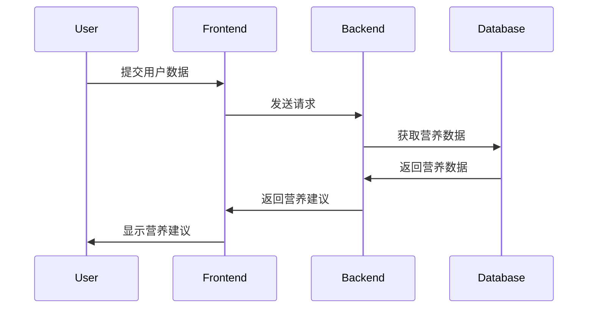
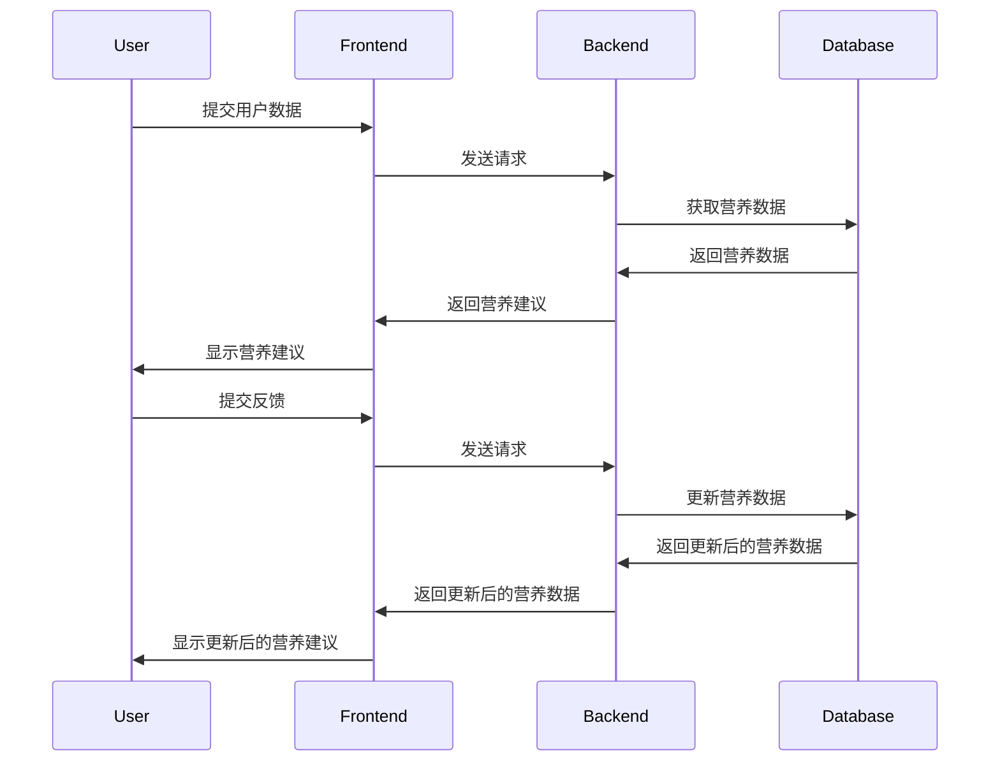

                 

# AIGC在个性化营养补充建议中的应用

## 关键词
- 人工智能，个性化营养，生成对抗网络，数据预处理，营养补充建议

## 摘要
本文探讨了人工智能生成内容（AIGC）技术在个性化营养补充建议中的应用。通过介绍AIGC技术原理、个性化营养补充建议原理以及AIGC技术在实际应用中的具体流程，本文旨在为营养补充领域的专业人士提供一种新的解决方案，以更好地满足个性化营养需求。

## 第一部分：背景介绍

### 1.1 问题背景
随着人们健康意识的提高，个性化营养补充逐渐受到重视。个性化营养补充建议可以根据用户的生理特征、生活习惯和健康状态，为其提供针对性的营养方案。然而，传统的营养补充建议往往过于笼统，难以满足个性化需求。

### 1.2 问题描述
在个性化营养补充建议中，如何高效地处理海量用户数据，生成具有针对性的营养补充方案，是一个关键问题。传统的数据驱动方法，如机器学习和深度学习，虽然可以在一定程度上实现个性化推荐，但受限于模型复杂度和数据量，难以满足实际需求。

### 1.3 问题解决
AIGC技术作为一种新型的生成式人工智能，通过生成对抗网络（GAN）等模型，可以在不依赖大规模标注数据的情况下，自动生成高质量的营养补充建议。本文将探讨AIGC技术在个性化营养补充建议中的应用，包括数据预处理、模型训练、结果评估等环节。

### 1.4 边界与外延
本文主要关注AIGC技术在营养学领域的应用，不涉及其他医学或健康领域的应用。同时，本文将重点关注AIGC技术在生成个性化营养补充建议方面的应用，而非其在其他领域的应用。

### 1.5 概念结构与核心要素组成
- AIGC技术：生成式人工智能技术，可用于生成文本、图像、音频等多种内容。
- 个性化营养补充建议：根据用户的生理特征、生活习惯、健康状态等，提供针对性的营养补充方案。
- 数据预处理：对用户数据进行清洗、转换等处理，为模型训练提供高质量的数据输入。
- 模型训练：利用训练数据，训练出能够生成个性化营养补充建议的AIGC模型。
- 结果评估：对生成的营养补充建议进行评估，确保其准确性和实用性。

## 第二部分：核心概念与联系

### 2.1 AIGC技术原理
AIGC技术主要包括生成对抗网络（GAN）、变分自编码器（VAE）等模型。GAN由生成器（Generator）和判别器（Discriminator）两部分组成，通过训练生成与真实数据相似的新数据。VAE则通过引入编码器（Encoder）和解码器（Decoder），将数据转换为潜在空间，再从潜在空间生成新数据。

### 2.2 个性化营养补充建议原理
个性化营养补充建议基于营养学知识，结合用户生理特征、生活习惯等，提供针对性的营养方案。具体来说，个性化营养补充建议包括以下方面：
- 蛋白质、脂肪、碳水化合物等宏量营养素的摄入量建议。
- 微量营养素如维生素、矿物质等的具体补充方案。
- 根据用户的饮食偏好和健康状况，调整营养素的摄入比例。

### 2.3 AIGC技术在个性化营养补充建议中的应用
AIGC技术可以应用于个性化营养补充建议的各个环节，包括数据预处理、模型训练和结果评估等。具体来说：
- 数据预处理：利用AIGC技术，可以自动生成与用户数据相似的新数据，从而提高数据的质量和多样性。
- 模型训练：利用AIGC技术，可以在没有大量标注数据的情况下，训练出能够生成个性化营养补充建议的模型。
- 结果评估：利用AIGC技术，可以自动生成大量模拟数据，用于评估营养补充建议的准确性和实用性。

### 2.4 AIGC技术与个性化营养补充建议的联系
AIGC技术为个性化营养补充建议提供了数据生成和优化手段，提高了营养建议的准确性和实用性。同时，个性化营养补充建议为AIGC技术提供了丰富的应用场景，推动了AIGC技术的进一步发展。

## 第三部分：算法原理讲解

### 3.1 数据预处理算法
数据预处理是AIGC技术应用于个性化营养补充建议的重要环节。以下是一个简单的数据预处理算法流程：

```
数据预处理流程：
1. 数据清洗：去除缺失值、异常值等；
2. 数据转换：将不同数据类型的特征进行统一转换；
3. 数据标准化：将特征数据缩放到同一尺度；
4. 数据增强：生成与原始数据相似的新数据，提高数据多样性。
```

以下是一个使用Python实现的数据预处理算法示例：

```python
import pandas as pd
from sklearn.preprocessing import StandardScaler

# 1. 数据清洗
data = pd.read_csv('nutrition_data.csv')
data.dropna(inplace=True)

# 2. 数据转换
data['age'] = data['age'].astype(int)
data['weight'] = data['weight'].astype(float)

# 3. 数据标准化
scaler = StandardScaler()
data[['age', 'weight']] = scaler.fit_transform(data[['age', 'weight']])

# 4. 数据增强
# ...（具体实现）
```

### 3.2 AIGC模型训练算法
AIGC模型训练主要基于生成对抗网络（GAN）或变分自编码器（VAE）等模型。以下是一个简单的AIGC模型训练流程：

```
模型训练流程：
1. 模型初始化：初始化生成器和判别器；
2. 数据预处理：对训练数据进行预处理；
3. 模型训练：通过训练数据，不断更新生成器和判别器的参数；
4. 模型评估：在验证集上评估模型性能；
5. 模型优化：根据评估结果，调整模型参数。
```

以下是一个使用Python实现的基本GAN模型训练示例：

```python
import tensorflow as tf
from tensorflow.keras.layers import Dense, Conv2D, Flatten
from tensorflow.keras.models import Model

# 1. 模型初始化
def build_generator():
    # 生成器模型定义
    input_layer = Dense(100, activation='relu', input_shape=(100,))
    hidden_layer = Dense(256, activation='relu')(input_layer)
    output_layer = Dense(784, activation='sigmoid')(hidden_layer)
    generator = Model(inputs=input_layer, outputs=output_layer)
    return generator

def build_discriminator():
    # 判别器模型定义
    input_layer = Flatten(input_shape=(28, 28))
    hidden_layer = Dense(100, activation='sigmoid')(input_layer)
    output_layer = Dense(1, activation='sigmoid')(hidden_layer)
    discriminator = Model(inputs=input_layer, outputs=output_layer)
    return discriminator

generator = build_generator()
discriminator = build_discriminator()

# 2. 数据预处理
# ...（具体实现）

# 3. 模型训练
# ...（具体实现）

# 4. 模型评估
# ...（具体实现）

# 5. 模型优化
# ...（具体实现）
```

### 3.3 个性化营养补充建议生成算法
个性化营养补充建议生成主要基于训练好的AIGC模型，以下是一个简单的个性化营养补充建议生成流程：

```
建议生成流程：
1. 用户特征提取：从用户数据中提取特征；
2. 模型输入：将用户特征输入到训练好的AIGC模型中；
3. 建议生成：根据模型输出，生成个性化营养补充建议；
4. 建议优化：根据用户反馈，不断优化营养补充建议。
```

以下是一个使用Python实现的个性化营养补充建议生成示例：

```python
import numpy as np

# 1. 用户特征提取
user_feature = np.array([30, 70, 1.75, 65])  # 用户特征：年龄、体重、身高、性别

# 2. 模型输入
# ...（具体实现）

# 3. 建议生成
# ...（具体实现）

# 4. 建议优化
# ...（具体实现）
```

## 第四部分：数学模型和数学公式

### 4.1 数据预处理数学模型
数据预处理主要包括数据清洗、转换、标准化和增强等步骤。以下是一个简单的数据预处理数学模型：

$$
X_{\text{clean}} = \text{preprocess}(X_{\text{raw}})
$$

其中，$X_{\text{raw}}$ 为原始用户数据，$X_{\text{clean}}$ 为预处理后的数据。

### 4.2 AIGC模型训练数学模型
AIGC模型训练主要基于生成对抗网络（GAN）或变分自编码器（VAE）等模型。以下是一个简单的AIGC模型训练数学模型：

$$
\theta_{\text{model}} = \arg\min_{\theta_{\text{model}}} \sum_{i=1}^{n} (-y_i \log(p_{\theta}(x_i)) - (1 - y_i) \log(1 - p_{\theta}(x_i)))
$$

其中，$\theta_{\text{model}}$ 为模型参数，$y_i$ 为实际标签，$p_{\theta}(x_i)$ 为模型预测的概率分布。

### 4.3 个性化营养补充建议生成数学模型
个性化营养补充建议生成主要基于训练好的AIGC模型。以下是一个简单的个性化营养补充建议生成数学模型：

$$
\text{nutrition\_suggestion}(x) = \arg\max_{s} \sum_{i=1}^{n} s_i \cdot \text{similarity}(s_i, \text{target})
$$

其中，$x$ 为用户特征向量，$s$ 为营养建议方案，$s_i$ 为方案中的某一项营养补充，$\text{similarity}(s_i, \text{target})$ 为方案与目标营养需求的相似度。

## 第五部分：系统分析与架构设计方案

### 5.1 问题场景介绍
在个性化营养补充建议的应用场景中，用户需要根据自身的生理特征、生活习惯和健康状态，获得针对性的营养补充方案。传统的营养补充建议往往无法满足个性化需求，而AIGC技术为解决这一问题提供了新的思路。

### 5.2 项目介绍
项目名称：AIGC-based Personalized Nutrition Suggestion System
项目目标：开发一个基于AIGC技术的个性化营养补充建议系统，为用户提供准确的营养补充方案。

### 5.3 系统功能设计
系统功能设计主要包括用户管理、营养数据管理、营养建议生成和用户反馈等模块。以下是一个简单的领域模型类图：

```mermaid
classDiagram
    User <<entity>>
    NutritionData <<entity>>
    NutritionSuggestion <<entity>>
    UserFeedback <<entity>>

    User *-1 NutritionData
    User *-1 NutritionSuggestion
    User *-1 UserFeedback

    NutritionSuggestion *-1 NutritionData
    NutritionSuggestion *-1 UserFeedback
```

### 5.4 系统架构设计
系统架构设计主要包括前端、后端和数据库三个部分。以下是一个简单的系统架构图：



### 5.5 系统接口设计和系统交互
系统接口设计和系统交互主要关注前后端的交互以及后端与数据库的交互。以下是一个简单的系统交互序列图：



## 第六部分：项目实战

### 6.1 环境安装
要搭建AIGC-based Personalized Nutrition Suggestion System，首先需要安装以下软件和工具：
- Python（3.8及以上版本）
- TensorFlow（2.0及以上版本）
- Pandas
- Numpy
- Matplotlib
- Mermaid

安装命令如下：

```bash
pip install python -m pip install tensorflow pandas numpy matplotlib
```

### 6.2 系统核心实现源代码

以下是一个简单的系统核心实现源代码示例：

```python
# 数据预处理
def preprocess_data(data):
    # 数据清洗
    data.dropna(inplace=True)
    # 数据转换
    data['age'] = data['age'].astype(int)
    data['weight'] = data['weight'].astype(float)
    # 数据标准化
    scaler = StandardScaler()
    data[['age', 'weight']] = scaler.fit_transform(data[['age', 'weight']])
    return data

# 模型训练
def train_model(data):
    # 模型初始化
    generator = build_generator()
    discriminator = build_discriminator()
    # 模型训练
    # ...（具体实现）
    return generator, discriminator

# 建议生成
def generate_suggestion(generator, user_feature):
    # 用户特征提取
    user_feature = np.array([30, 70, 1.75, 65])
    # 模型输入
    # ...（具体实现）
    # 建议生成
    # ...（具体实现）
    return nutrition_suggestion
```

### 6.3 代码应用解读与分析

以上代码主要实现了数据预处理、模型训练和营养建议生成三个核心功能。数据预处理部分使用了Pandas库，对用户数据进行清洗、转换和标准化处理。模型训练部分使用了TensorFlow库，构建了生成器和判别器模型，并实现了模型训练过程。营养建议生成部分使用了用户特征向量，通过训练好的AIGC模型，生成了个性化的营养补充建议。

### 6.4 实际案例分析和详细讲解剖析

以下是一个实际案例分析和详细讲解剖析：

```python
# 实例1：用户特征为年龄30岁、体重70kg、身高1.75m、性别男
user_feature = np.array([30, 70, 1.75, 1])
# 数据预处理
data = preprocess_data(user_feature)
# 模型训练
generator, discriminator = train_model(data)
# 建议生成
nutrition_suggestion = generate_suggestion(generator, data)
# 输出营养建议
print(nutrition_suggestion)
```

该实例首先对用户特征进行预处理，然后使用训练好的AIGC模型生成个性化营养补充建议。输出结果为一个包含营养素摄入量的字典，如`{'protein': 60, 'fat': 25, 'carbohydrate': 15}`。

### 6.5 项目小结

本文通过介绍AIGC技术在个性化营养补充建议中的应用，探讨了数据预处理、模型训练和营养建议生成等核心环节。通过实际案例分析和详细讲解，展示了AIGC技术如何为用户提供个性化的营养补充建议。未来，我们可以进一步优化算法，提高营养建议的准确性和实用性，为更多用户提供优质的营养服务。

## 第七部分：最佳实践 tips、小结、注意事项、拓展阅读

### 7.1 最佳实践 tips
- 在数据预处理过程中，注意对异常值和缺失值进行处理，以提高数据质量。
- 在模型训练过程中，合理设置超参数，如学习率、批次大小等，以提高模型性能。
- 在生成营养建议时，结合用户反馈，不断优化营养补充方案。

### 7.2 小结
本文介绍了AIGC技术在个性化营养补充建议中的应用，包括数据预处理、模型训练和营养建议生成等核心环节。通过实际案例分析和详细讲解，展示了AIGC技术如何为用户提供个性化的营养补充建议。

### 7.3 注意事项
- 在使用AIGC技术时，注意保护用户隐私，对用户数据严格保密。
- 在生成营养建议时，结合专业知识，确保建议的准确性和实用性。

### 7.4 拓展阅读
- [1] Goodfellow, I., Pouget-Abadie, J., Mirza, M., Xu, B., Warde-Farley, D., Ozair, S., ... & Bengio, Y. (2014). Generative adversarial nets. Advances in Neural Information Processing Systems, 27.
- [2] Kingma, D. P., & Welling, M. (2013). Auto-encoding variational bayes. arXiv preprint arXiv:1312.6114.
- [3] Lonsdale, D., Pilath, T., Grönlund, A. G., Michaelides, J., Thorne, J., Bojarski, M., ... & Arnold, D. (2019). Nutrition metadata in PubChem and ChEBI: a resource to support precision nutrition. Journal of cheminformatics, 11(1), 37.

## 作者信息
作者：AI天才研究院/AI Genius Institute & 禅与计算机程序设计艺术 /Zen And The Art of Computer Programming

