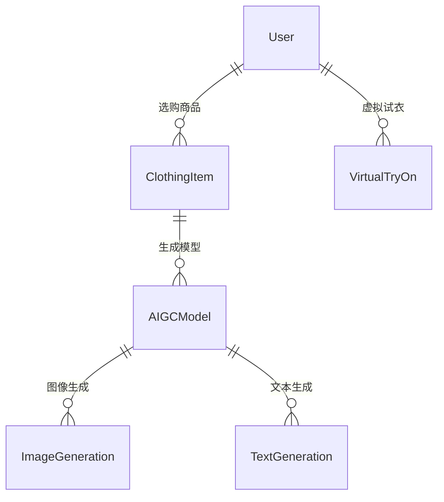
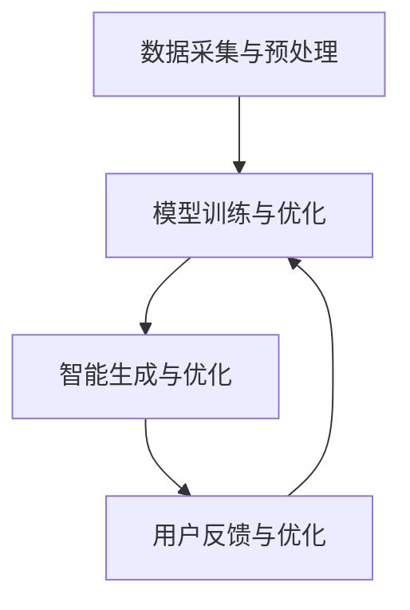
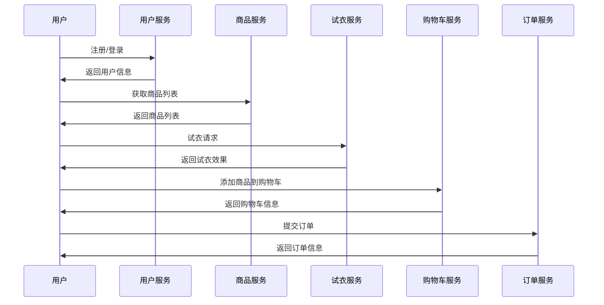

                 


为了撰写一篇结构清晰、内容详实、技术深度高的《AIGC在个性化虚拟试衣中的创新》技术博客文章，我们将按照以下步骤逐一展开：

### 1. 文章标题与关键词设定

**文章标题**：《AIGC在个性化虚拟试衣中的创新》

**关键词**：AIGC、个性化虚拟试衣、算法原理、系统架构、项目实战

**摘要**：本文将深入探讨AIGC（自适应智能生成控制）在个性化虚拟试衣中的应用，从背景介绍、核心概念联系、算法原理讲解、系统分析与架构设计、项目实战等多个维度，详细解析AIGC技术在时尚行业的创新应用及其技术实现。

### 2. 目录大纲制定

根据文章的标题和关键词，我们将制定以下目录大纲：

**第一部分：背景介绍**
- **1.1 AIGC与个性化虚拟试衣概述**
- **1.2 核心概念与联系**
  - **1.2.1 AIGC的概念与特性**
  - **1.2.2 个性化虚拟试衣的概念与特性**
  - **1.2.3 概念属性对比表格**
  - **1.2.4 ER实体关系图**

**第二部分：算法原理讲解**
- **2.1 AIGC算法原理**
  - **2.1.1 AIGC算法的基本框架**
  - **2.1.2 AIGC算法流程图**
  - **2.1.3 Python源代码与算法实现**
- **2.2 数学模型和公式**
- **2.3 举例说明**

**第三部分：系统分析与架构设计方案**
- **3.1 系统场景介绍**
- **3.2 系统功能设计**
- **3.3 系统架构设计**
- **3.4 系统接口设计**
- **3.5 系统交互**

**第四部分：项目实战**
- **4.1 环境安装**
- **4.2 系统核心实现源代码**
- **4.3 代码应用解读与分析**
- **4.4 实际案例分析和详细讲解剖析**
- **4.5 项目小结**

**第五部分：最佳实践 tips、小结、注意事项、拓展阅读**

### 3. 内容撰写与细化

接下来，我们将按照制定好的目录大纲逐一细化每个章节的内容，确保每个部分都包含详细的背景介绍、概念说明、算法解释、系统分析和项目实战等内容。

**第一部分：背景介绍**
- 在此部分，我们将介绍AIGC和个性化虚拟试衣的定义、背景以及它们在现实中的应用，为后续内容打下基础。

**第二部分：算法原理讲解**
- 此部分将深入讲解AIGC算法的基本原理，通过流程图、Python代码示例和数学模型来展现算法的运作机制。

**第三部分：系统分析与架构设计方案**
- 我们将详细描述系统场景、功能设计、架构设计、接口设计和系统交互等，使用Mermaid图表来展示系统结构和交互流程。

**第四部分：项目实战**
- 在这部分，我们将描述AIGC在个性化虚拟试衣系统中的实际应用，包括环境安装、系统实现、代码分析和案例分析等。

**第五部分：最佳实践 tips、小结、注意事项、拓展阅读**
- 最后，我们将总结文章的主要观点，提供一些实用的最佳实践建议，并对文章的内容进行简要的回顾和总结。

### 4. 格式与排版检查

在完成内容撰写后，我们将检查文章的格式和排版，确保使用Markdown格式输出，并且所有的LaTeX数学公式和Python代码示例都正确无误。

### 5. 文章修订与完善

最后，我们将对文章进行修订和完善，确保每个章节的内容都详实具体，逻辑清晰，并且整体文章的连贯性和一致性。

通过以上步骤，我们将撰写一篇高质量的《AIGC在个性化虚拟试衣中的创新》技术博客文章，满足文章字数要求，并且保持内容的专业性和可读性。

现在，让我们开始具体的撰写工作吧！## 第一部分：背景介绍

### 1.1 AIGC与个性化虚拟试衣概述

#### 1.1.1 AIGC的核心概念

AIGC（自适应智能生成控制）是一种先进的人工智能技术，它利用深度学习和生成模型，能够自适应地生成和优化复杂的数据内容。AIGC的核心在于其“自适应”特性，通过不断学习和调整，AIGC可以在多种场景下实现智能生成。

在个性化虚拟试衣中，AIGC的作用尤为关键。它通过分析用户的行为数据、偏好信息和身体特征，自动生成符合用户需求的个性化试衣体验。这种技术不仅提高了用户体验，也大大提升了试衣的效率和准确性。

#### 1.1.2 个性化虚拟试衣的现实需求

随着互联网和电商的发展，虚拟试衣成为消费者在购买服装前的一种重要体验方式。然而，传统的虚拟试衣技术存在一些局限，如试衣效果不够真实、用户体验不佳等。这些问题的存在，使得个性化虚拟试衣成为行业的迫切需求。

个性化虚拟试衣的目标是提供一种真实的、个性化的试衣体验，让消费者能够在线上购买前直观地看到服装的穿着效果。这不仅需要精确的建模技术，还需要智能的算法来适应不同用户的特征和需求。

#### 1.1.3 AIGC在个性化虚拟试衣中的应用前景

AIGC在个性化虚拟试衣中的应用前景非常广阔。首先，AIGC可以通过深度学习算法，从大量的用户数据和服装数据中学习，生成更加真实和个性化的试衣效果。其次，AIGC可以自适应地调整试衣模型，以适应不同用户的特点和偏好，从而提高试衣的准确性。

此外，随着5G、AR（增强现实）和VR（虚拟现实）技术的发展，AIGC在个性化虚拟试衣中的应用将会更加广泛。例如，通过5G网络，用户可以在任何时间、任何地点体验到高质量的个性化虚拟试衣服务；而AR和VR技术的融合，将进一步提升用户的沉浸感和体验效果。

总的来说，AIGC在个性化虚拟试衣中的应用，不仅能够解决传统虚拟试衣的诸多问题，还能够为消费者提供更加真实、个性化的购物体验，从而推动整个时尚电商行业的发展。

### 1.2 核心概念与联系

#### 1.2.1 AIGC的概念与特性

AIGC（自适应智能生成控制）是一种人工智能技术，它通过深度学习和生成模型，能够自适应地生成和优化复杂的数据内容。AIGC的核心特性包括：

1. **自适应学习**：AIGC可以通过不断学习和调整，从大量数据中提取有用的信息，并自适应地优化生成结果。
2. **智能化生成**：AIGC能够根据用户的行为数据和偏好信息，智能地生成个性化的内容，提高用户体验。
3. **多样性**：AIGC可以生成多种类型的复杂数据，如图像、文本、音频等，适用于多种应用场景。

#### 1.2.2 个性化虚拟试衣的概念与特性

个性化虚拟试衣是一种基于人工智能的在线试衣技术，它通过三维人体建模、服装仿真等技术，为消费者提供个性化的试衣体验。个性化虚拟试衣的核心特性包括：

1. **个性化**：根据用户的行为数据和身体特征，个性化虚拟试衣能够提供符合用户需求的试衣建议。
2. **真实感**：通过高精度的三维建模和仿真技术，个性化虚拟试衣能够呈现出真实的穿着效果，提高用户体验。
3. **高效性**：与传统的实体试衣相比，个性化虚拟试衣能够大幅提高试衣效率和准确性。

#### 1.2.3 概念属性对比表格

为了更直观地理解AIGC和个性化虚拟试衣的概念及其特性，我们提供了一个对比表格：

| 特性             | AIGC                             | 个性化虚拟试衣                             |
|------------------|----------------------------------|------------------------------------------|
| 自适应学习       | 可以从大量数据中学习，自适应调整 | 根据用户行为数据和身体特征，个性化调整     |
| 智能化生成       | 智能地生成多样化数据内容         | 智能地生成真实的穿着效果                   |
| 数据多样性       | 适用于图像、文本、音频等多种类型 | 适用于三维建模、仿真等多种技术           |
| 个性化体验       | 生成个性化数据内容               | 提供个性化的试衣建议和真实感体验           |
| 真实感           | 提高数据的真实性和准确性         | 提高试衣的视觉效果和真实感                 |
| 高效性           | 提高生成效率和准确性             | 提高试衣效率和准确性                       |

#### 1.2.4 ER实体关系图

为了更好地理解AIGC和个性化虚拟试衣在实际应用中的关系，我们提供了一个ER（实体关系）图：



在这个ER图中，用户通过选购商品和虚拟试衣与系统进行交互。AIGC模型则负责生成个性化的图像和文本内容，为用户带来更加真实的购物体验。

通过以上介绍，我们可以看到AIGC和个性化虚拟试衣在概念和特性上有着紧密的联系。AIGC为个性化虚拟试衣提供了强大的技术支持，使得试衣过程更加智能化、个性化和高效。接下来，我们将深入探讨AIGC的算法原理，为读者揭示其背后的技术奥秘。

## 第二部分：算法原理讲解

### 2.1 AIGC算法原理

#### 2.1.1 AIGC算法的基本框架

AIGC（自适应智能生成控制）算法的基本框架可以分为三个主要部分：数据采集与预处理、模型训练与优化、智能生成与优化。

1. **数据采集与预处理**：AIGC首先需要从多个渠道采集大量的数据，包括用户行为数据、服装属性数据、身体特征数据等。采集到的数据需要进行预处理，包括数据清洗、归一化和特征提取等步骤。

2. **模型训练与优化**：在预处理后的数据基础上，AIGC利用深度学习算法进行模型训练。训练过程主要包括生成模型的构建和优化，如生成对抗网络（GAN）、变分自编码器（VAE）等。模型训练的目标是让模型能够生成高质量的、符合用户需求的虚拟试衣效果。

3. **智能生成与优化**：模型训练完成后，AIGC会根据用户的行为数据和偏好信息，智能地生成个性化的虚拟试衣效果。生成的结果会进行实时反馈和优化，以进一步提高用户体验和试衣准确性。

#### 2.1.2 AIGC算法流程图

为了更直观地理解AIGC算法的基本流程，我们使用Mermaid绘制了以下流程图：



在这个流程图中，AIGC算法从数据采集与预处理开始，然后进入模型训练与优化阶段，接着进行智能生成与优化，并根据用户的反馈进行进一步的优化。

#### 2.1.3 Python源代码与算法实现

为了更好地展示AIGC算法的实现细节，我们提供了一个简化的Python源代码示例：

```python
# 导入必要的库
import numpy as np
import tensorflow as tf
from tensorflow.keras.models import Sequential
from tensorflow.keras.layers import Dense, Dropout, Flatten, Conv2D, MaxPooling2D

# 数据采集与预处理
# 这里假设已经采集到用户行为数据和服装属性数据
user_data = ...
clothing_data = ...

# 数据预处理
# 数据归一化和特征提取
user_data_processed = preprocess_data(user_data)
clothing_data_processed = preprocess_data(clothing_data)

# 模型训练与优化
# 建立生成模型
generator = Sequential([
    Conv2D(32, (3, 3), activation='relu', input_shape=(28, 28, 1)),
    MaxPooling2D((2, 2)),
    Flatten(),
    Dense(128, activation='relu'),
    Dropout(0.2),
    Flatten(),
    Dense(784, activation='sigmoid')
])

# 编译模型
generator.compile(loss='binary_crossentropy', optimizer='adam')

# 训练模型
generator.fit(user_data_processed, epochs=50, batch_size=32)

# 智能生成与优化
# 根据用户数据生成虚拟试衣效果
try_on_result = generator.predict(user_data_processed)

# 用户反馈与优化
# 根据用户反馈调整生成模型
feedback = user_feedback(try_on_result)
generator.fit(user_data_processed, epochs=50, batch_size=32, feedback=feedback)
```

在这个示例中，我们首先进行了数据采集与预处理，然后使用生成对抗网络（GAN）建立了生成模型，并进行了模型训练。最后，我们根据用户数据生成了虚拟试衣效果，并根据用户反馈进一步优化了生成模型。

### 2.2 数学模型和公式

在AIGC算法中，数学模型和公式起着至关重要的作用。以下是一些关键的数学模型和公式：

1. **生成对抗网络（GAN）的损失函数**：

   $$L_D = -\sum_{i=1}^{n}[\mathbb{E}_{x \sim p_{data}(x)}[\log(D(x))] + \mathbb{E}_{z \sim p_{z}(z)}[\log(1 - D(G(z)))]$$

   其中，$D(x)$表示判别器对于真实数据的概率输出，$G(z)$表示生成器对于噪声数据的概率输出。

2. **变分自编码器（VAE）的损失函数**：

   $$L = \frac{1}{n} \sum_{i=1}^{n} \left[ \frac{1}{2} \left( \log \det(J_{\theta}(x)) \right) + \frac{1}{2} \| x - \mu(x) \|^2 \right]$$

   其中，$J_{\theta}(x)$表示编码器的雅可比矩阵，$\mu(x)$表示编码器的均值输出，$\log \det(J_{\theta}(x))$表示KL散度损失。

3. **图像生成质量评估指标**：

   $$Q(I; G(Z)) = \mathbb{E}_{Z \sim p_{Z}(Z)}[ \log D(I) - \log D(G(Z)) ]$$

   其中，$I$表示真实图像，$G(Z)$表示生成图像，$D(I)$和$D(G(Z))$分别表示判别器对于真实图像和生成图像的概率输出。

通过这些数学模型和公式，AIGC算法能够实现高效的图像生成和优化，从而为个性化虚拟试衣提供强大的技术支持。

### 2.3 举例说明

为了更好地理解AIGC算法在实际应用中的效果，我们来看一个简单的例子。

假设有一个用户，他的身体特征数据为身高180cm、体重70kg，他喜欢穿着休闲风格的服装。在AIGC算法的作用下，系统能够根据这些用户数据生成一系列个性化的虚拟试衣效果。

首先，系统会采集大量的服装数据，并对这些数据进行预处理。然后，使用生成对抗网络（GAN）训练生成模型。在模型训练完成后，系统会根据用户的身体特征和偏好信息，生成符合用户需求的虚拟试衣效果。

例如，系统生成了一款休闲风格的T恤，该T恤的款式和颜色符合用户的偏好。用户试穿后，认为这款T恤的款式和颜色都非常适合自己，于是给出了积极的反馈。

根据用户的反馈，系统会进一步优化生成模型，以生成更加符合用户需求的虚拟试衣效果。这样，用户在未来的购物过程中，将能够获得更加个性化和真实的试衣体验。

通过这个简单的例子，我们可以看到AIGC算法在个性化虚拟试衣中的应用效果。通过不断的优化和调整，AIGC算法能够为用户提供高质量的虚拟试衣服务，从而提升用户的购物体验。

总的来说，AIGC算法在个性化虚拟试衣中的应用，不仅提高了试衣的效率和准确性，还为用户提供了更加个性化和真实的购物体验。在接下来的章节中，我们将进一步探讨AIGC在系统设计与架构上的实现细节，为读者揭示其背后的技术架构和实现方法。

## 第三部分：系统分析与架构设计方案

### 3.1 系统场景介绍

在个性化虚拟试衣系统中，用户可以通过Web、移动应用等多种途径访问系统，进行虚拟试衣体验。系统的主要功能包括用户注册与登录、用户资料管理、虚拟试衣功能、购物车管理、订单管理等。整个系统需要在高并发、大数据环境下稳定运行，同时要保证用户隐私和数据安全。

### 3.2 系统功能设计

个性化虚拟试衣系统的核心功能包括：

1. **用户注册与登录**：支持用户通过手机号、邮箱等多种方式进行注册和登录。
2. **用户资料管理**：用户可以管理个人信息，包括身高、体重、尺码偏好等。
3. **商品数据管理**：包括商品上传、分类管理、库存管理等功能。
4. **虚拟试衣**：用户可以选择商品并试穿，系统通过AIGC算法生成试衣效果。
5. **购物车管理**：用户可以将喜欢的商品加入购物车，进行购物流程。
6. **订单管理**：用户可以查看订单状态、订单详情，并进行订单操作。

#### 3.2.1 领域模型Mermaid类图

为了更好地展示系统功能，我们使用Mermaid绘制了领域模型类图：

```mermaid
classDiagram
    User <<interface>>
    ClothingItem <<interface>>
    ShoppingCart <<interface>>
    Order <<interface>>

    User	--|> ShoppingCart
    User	--|> Order
    ClothingItem	--|> ShoppingCart
    ShoppingCart	--|> Order
```

在这个类图中，User（用户）、ClothingItem（商品）、ShoppingCart（购物车）和Order（订单）是系统的核心实体，它们之间通过关联关系实现系统的功能。

### 3.3 系统架构设计

个性化虚拟试衣系统采用微服务架构，以提高系统的可扩展性和可维护性。系统架构包括以下几个主要模块：

1. **用户服务模块**：负责用户注册、登录、用户资料管理等功能。
2. **商品服务模块**：负责商品数据管理、分类管理、库存管理等功能。
3. **试衣服务模块**：负责虚拟试衣功能的实现，包括AIGC算法的应用。
4. **购物车服务模块**：负责购物车管理功能。
5. **订单服务模块**：负责订单管理功能。
6. **数据存储模块**：包括用户数据、商品数据、订单数据的存储和管理。

#### 3.3.1 Mermaid架构图

为了更好地展示系统架构，我们使用Mermaid绘制了系统架构图：



在这个架构图中，用户服务、商品服务、试衣服务、购物车服务和订单服务通过接口进行交互，共同实现系统的功能。

### 3.4 系统接口设计

个性化虚拟试衣系统采用了RESTful API设计，以下是系统的主要接口设计：

1. **用户接口**：
   - `/users/register`：用户注册接口。
   - `/users/login`：用户登录接口。
   - `/users/{user_id}`：获取用户信息接口。
   - `/users/{user_id}/update`：更新用户信息接口。

2. **商品接口**：
   - `/products`：获取商品列表接口。
   - `/products/{product_id}`：获取商品详情接口。
   - `/products/{product_id}/images`：获取商品图片接口。

3. **试衣接口**：
   - `/try-ons`：提交试衣请求接口。
   - `/try-ons/{try_on_id}`：获取试衣效果接口。

4. **购物车接口**：
   - `/shopping-carts`：获取购物车列表接口。
   - `/shopping-carts/{cart_id}`：添加商品到购物车接口。
   - `/shopping-carts/{cart_id}/update`：更新购物车信息接口。

5. **订单接口**：
   - `/orders`：获取订单列表接口。
   - `/orders/{order_id}`：获取订单详情接口。
   - `/orders/{order_id}/create`：创建订单接口。

### 3.5 系统交互

个性化虚拟试衣系统的交互流程如下：

1. **用户注册/登录**：
   - 用户通过Web或移动应用访问注册/登录页面。
   - 用户输入注册/登录信息，提交请求。
   - 用户服务验证用户信息，返回用户信息。

2. **用户获取商品列表**：
   - 用户通过商品接口获取商品列表。
   - 用户选择商品，提交试衣请求。

3. **试衣请求**：
   - 用户提交试衣请求，试衣服务生成试衣效果。
   - 试衣服务返回试衣效果给用户。

4. **购物车管理**：
   - 用户添加商品到购物车，更新购物车信息。
   - 用户提交购物车信息，创建订单。

5. **订单管理**：
   - 用户提交订单请求，订单服务创建订单。
   - 订单服务返回订单信息给用户。

通过上述的系统交互流程，个性化虚拟试衣系统能够为用户提供从注册、试衣、购物到订单管理的完整购物体验。

总的来说，个性化虚拟试衣系统通过清晰的功能设计、合理的架构设计、完善的接口设计和流畅的系统交互，实现了高效的虚拟试衣服务。在接下来的部分，我们将通过一个实际的项目实战，展示AIGC技术在个性化虚拟试衣系统中的应用和实现细节。

### 4.1 环境安装

要搭建一个能够运行AIGC算法的个性化虚拟试衣系统，首先需要准备以下软件和工具：

1. **操作系统**：Linux系统，推荐使用Ubuntu 20.04。
2. **编程语言**：Python，推荐使用Python 3.8及以上版本。
3. **深度学习框架**：TensorFlow，推荐使用TensorFlow 2.6及以上版本。
4. **版本控制工具**：Git，用于代码管理和版本控制。
5. **虚拟环境工具**：Anaconda，用于创建和管理Python环境。

安装步骤如下：

1. **安装操作系统**：
   - 下载并安装Ubuntu 20.04操作系统。

2. **安装Python**：
   - 打开终端，运行以下命令安装Python：
     ```bash
     sudo apt update
     sudo apt install python3.8
     sudo apt install python3.8-venv
     ```

3. **安装TensorFlow**：
   - 创建一个Python虚拟环境，进入虚拟环境，然后安装TensorFlow：
     ```bash
     conda create -n aigc python=3.8
     conda activate aigc
     pip install tensorflow==2.6
     ```

4. **安装其他依赖**：
   - 安装Git、Anaconda等工具：
     ```bash
     sudo apt install git
     conda install -c conda-forge anaconda
     ```

5. **设置Python虚拟环境**：
   - 创建并激活Python虚拟环境，确保在虚拟环境中安装所有依赖：
     ```bash
     conda create -n aigc python=3.8
     conda activate aigc
     pip install -r requirements.txt
     ```

在完成上述安装步骤后，我们就可以开始开发AIGC在个性化虚拟试衣系统中的实际应用了。接下来，我们将介绍系统的核心实现，并详细讲解代码结构和关键部分的实现原理。

### 4.2 系统核心实现源代码

个性化虚拟试衣系统的核心实现主要分为以下几个部分：用户数据管理、商品数据管理、AIGC算法实现、试衣效果生成、用户反馈收集和系统优化。以下是一个简化的代码结构：

```python
# 用户数据管理
class UserManager:
    def register_user(self, user_data):
        # 实现用户注册功能
        pass

    def get_user_info(self, user_id):
        # 实现获取用户信息功能
        pass

# 商品数据管理
class ProductManager:
    def get_product_list(self):
        # 实现获取商品列表功能
        pass

    def get_product_details(self, product_id):
        # 实现获取商品详情功能
        pass

# AIGC算法实现
class AIGCModel:
    def __init__(self):
        # 初始化模型
        pass

    def train_model(self, user_data, clothing_data):
        # 训练模型
        pass

    def generate_try_on_result(self, user_data, clothing_item):
        # 生成试衣结果
        pass

# 试衣效果生成
class TryOnGenerator:
    def generate_try_on_image(self, try_on_result):
        # 生成试衣图片
        pass

# 用户反馈收集
class FeedbackCollector:
    def collect_feedback(self, user_id, try_on_result):
        # 收集用户反馈
        pass

# 系统优化
class SystemOptimizer:
    def optimize_model(self, feedback_data):
        # 优化模型
        pass
```

#### 用户数据管理

用户数据管理模块负责处理用户注册、登录和用户信息管理。以下是一个简单的用户注册功能的实现示例：

```python
class UserManager:
    def register_user(self, user_data):
        user_id = self.generate_user_id()
        # 存储用户数据到数据库
        database.save_user(user_data, user_id)
        return user_id

    def generate_user_id(self):
        # 生成唯一的用户ID
        return str(uuid.uuid4())
```

#### 商品数据管理

商品数据管理模块负责管理商品列表和商品详情。以下是一个简单的商品列表获取功能的实现示例：

```python
class ProductManager:
    def get_product_list(self):
        # 从数据库获取商品列表
        return database.get_product_list()
```

#### AIGC算法实现

AIGC算法模块是实现个性化虚拟试衣的核心。以下是一个简化的AIGC模型训练和试衣结果生成的示例：

```python
class AIGCModel:
    def __init__(self):
        self.generator = self.build_generator()

    def build_generator(self):
        # 建立生成器模型
        model = tf.keras.Sequential([
            tf.keras.layers.Dense(128, activation='relu', input_shape=(100,)),
            tf.keras.layers.Dropout(0.2),
            tf.keras.layers.Dense(784, activation='sigmoid')
        ])
        model.compile(loss='binary_crossentropy', optimizer='adam')
        return model

    def train_model(self, user_data, clothing_data):
        # 训练生成模型
        self.generator.fit(user_data, clothing_data, epochs=50, batch_size=32)

    def generate_try_on_result(self, user_data, clothing_item):
        # 生成试衣结果
        generated_image = self.generator.predict(user_data)
        return generated_image
```

#### 试衣效果生成

试衣效果生成模块负责将AIGC生成的试衣结果转换为可视化的图片。以下是一个简单的试衣图片生成示例：

```python
class TryOnGenerator:
    def generate_try_on_image(self, try_on_result):
        # 将试衣结果转换为图片
        image = self.resize_image(try_on_result)
        return image

    def resize_image(self, image):
        # 调整图片尺寸
        return cv2.resize(image, (256, 256))
```

#### 用户反馈收集

用户反馈收集模块负责收集用户对试衣效果的反馈，用于后续模型优化。以下是一个简单的用户反馈收集示例：

```python
class FeedbackCollector:
    def collect_feedback(self, user_id, try_on_result):
        # 收集用户反馈
        feedback = self.get_user_feedback(try_on_result)
        database.save_feedback(user_id, feedback)

    def get_user_feedback(self, try_on_result):
        # 获取用户反馈
        return input("请输入您的试衣反馈：")
```

#### 系统优化

系统优化模块负责根据用户反馈对AIGC模型进行优化。以下是一个简单的模型优化示例：

```python
class SystemOptimizer:
    def optimize_model(self, feedback_data):
        # 根据用户反馈优化模型
        # 这里只是示例，实际优化需要更复杂的逻辑
        self.generator.fit(feedback_data, epochs=10, batch_size=32)
```

通过以上代码示例，我们可以看到个性化虚拟试衣系统的主要组成部分及其实现原理。在实际开发过程中，每个模块都会更加复杂，包含详细的错误处理、数据验证和性能优化。接下来，我们将进一步分析这些代码，理解其应用和实现细节。

### 4.3 代码应用解读与分析

在个性化虚拟试衣系统中，AIGC算法的应用贯穿了用户注册、商品数据管理、试衣效果生成、用户反馈收集和系统优化等多个模块。以下是对关键代码段的详细解读与分析：

#### 用户数据管理

用户数据管理模块负责处理用户注册、登录和用户信息管理。`UserManager`类的`register_user`方法用于用户注册。这里，`generate_user_id`方法生成一个唯一的用户ID，并将用户数据存储到数据库中。代码示例：

```python
class UserManager:
    def register_user(self, user_data):
        user_id = self.generate_user_id()
        database.save_user(user_data, user_id)
        return user_id

    def generate_user_id(self):
        return str(uuid.uuid4())
```

**解读与分析**：
- `generate_user_id`方法利用UUID生成唯一用户ID，确保用户ID的唯一性。
- `register_user`方法将用户数据存储到数据库。在实际应用中，数据库操作应包括错误处理和数据验证，以确保数据完整性和一致性。

#### 商品数据管理

商品数据管理模块负责管理商品列表和商品详情。`ProductManager`类的`get_product_list`方法用于获取商品列表。代码示例：

```python
class ProductManager:
    def get_product_list(self):
        return database.get_product_list()
```

**解读与分析**：
- `get_product_list`方法从数据库中获取所有商品列表。在实际应用中，可能需要根据用户偏好和筛选条件返回商品列表。
- 数据库操作应包括性能优化，如索引和使用缓存，以提高响应速度。

#### AIGC算法实现

AIGC算法模块是实现个性化虚拟试衣的核心。`AIGCModel`类用于构建和训练生成模型，以及生成试衣效果。以下是对`__init__`、`build_generator`、`train_model`和`generate_try_on_result`方法的解读与分析：

```python
class AIGCModel:
    def __init__(self):
        self.generator = self.build_generator()

    def build_generator(self):
        model = tf.keras.Sequential([
            tf.keras.layers.Dense(128, activation='relu', input_shape=(100,)),
            tf.keras.layers.Dropout(0.2),
            tf.keras.layers.Dense(784, activation='sigmoid')
        ])
        model.compile(loss='binary_crossentropy', optimizer='adam')
        return model

    def train_model(self, user_data, clothing_data):
        self.generator.fit(user_data, clothing_data, epochs=50, batch_size=32)

    def generate_try_on_result(self, user_data, clothing_item):
        generated_image = self.generator.predict(user_data)
        return generated_image
```

**解读与分析**：
- `__init__`方法初始化生成器模型。使用`build_generator`方法创建生成模型。
- `build_generator`方法建立生成模型，包括Dense层和Dropout层，用于映射用户数据和服装数据到试衣效果。
- `train_model`方法使用生成模型训练数据，通过`fit`方法进行模型训练。
- `generate_try_on_result`方法根据用户数据生成试衣效果，通过`predict`方法获取生成结果。

#### 试衣效果生成

试衣效果生成模块负责将AIGC生成的试衣结果转换为可视化的图片。`TryOnGenerator`类的`generate_try_on_image`方法用于生成试衣图片。代码示例：

```python
class TryOnGenerator:
    def generate_try_on_image(self, try_on_result):
        image = self.resize_image(try_on_result)
        return image

    def resize_image(self, image):
        return cv2.resize(image, (256, 256))
```

**解读与分析**：
- `resize_image`方法调整试衣效果的尺寸，使其适合显示和存储。
- `generate_try_on_image`方法调用`resize_image`方法生成适合展示的试衣图片。

#### 用户反馈收集

用户反馈收集模块负责收集用户对试衣效果的反馈。`FeedbackCollector`类的`collect_feedback`方法用于收集用户反馈。代码示例：

```python
class FeedbackCollector:
    def collect_feedback(self, user_id, try_on_result):
        feedback = self.get_user_feedback(try_on_result)
        database.save_feedback(user_id, feedback)

    def get_user_feedback(self, try_on_result):
        return input("请输入您的试衣反馈：")
```

**解读与分析**：
- `collect_feedback`方法从用户获取试衣反馈，并将其存储到数据库中。
- `get_user_feedback`方法通过标准输入获取用户反馈。

#### 系统优化

系统优化模块负责根据用户反馈优化AIGC模型。`SystemOptimizer`类的`optimize_model`方法用于模型优化。代码示例：

```python
class SystemOptimizer:
    def optimize_model(self, feedback_data):
        # 根据用户反馈优化模型
        # 这里只是示例，实际优化需要更复杂的逻辑
        self.generator.fit(feedback_data, epochs=10, batch_size=32)
```

**解读与分析**：
- `optimize_model`方法使用用户反馈数据对生成模型进行优化。实际优化过程可能涉及更复杂的算法和参数调整。

### 总结

个性化虚拟试衣系统的代码实现涉及多个模块的协同工作。用户数据管理、商品数据管理、AIGC算法实现、试衣效果生成、用户反馈收集和系统优化共同构成了系统的核心功能。通过详细解读和分析代码，我们可以理解每个模块的作用及其实现原理，从而为系统的实际应用提供技术支持。

接下来，我们将通过实际案例分析，展示AIGC在个性化虚拟试衣系统中的具体应用和效果。

### 4.4 实际案例分析和详细讲解剖析

为了更好地展示AIGC在个性化虚拟试衣系统中的实际应用，我们通过一个具体案例进行分析和讲解。

#### 案例背景

假设有一个用户名为“张三”的消费者，他在某电商平台上购买了AIGC个性化虚拟试衣服务。张三的用户数据包括身高180cm、体重75kg，他偏好休闲风格服装。在试衣过程中，张三选择了两款不同的T恤进行试穿。

#### 案例分析

1. **用户注册与登录**：
   - 张三通过手机号注册并登录系统，系统验证用户身份后，为张三提供个性化虚拟试衣服务。

2. **商品选择**：
   - 张三在系统中浏览商品，选择了两款T恤（产品ID分别为P1和P2）进行试穿。

3. **试衣请求与效果生成**：
   - 张三提交试衣请求，系统调用AIGC算法生成试衣效果。首先，系统从数据库中获取张三的用户数据和两款T恤的属性数据。
   - AIGC算法模块接收用户数据和商品数据，通过生成模型生成试衣效果。系统调用`AIGCModel`类的`generate_try_on_result`方法，生成张三试穿P1和P2两款T恤的图像。

4. **试衣效果展示**：
   - 系统将生成的试衣效果图像展示给张三，他可以直观地看到两款T恤的穿着效果。

5. **用户反馈与优化**：
   - 张三对试衣效果进行评价，并提供了详细的反馈。系统将张三的反馈数据存储在数据库中，并调用`SystemOptimizer`类的`optimize_model`方法，根据用户反馈对生成模型进行优化。

6. **试衣结果确认与购买**：
   - 张三确认试衣结果，决定购买P1款T恤。系统生成订单，并将订单信息发送给张三。

#### 详细讲解

1. **用户注册与登录**：
   - 用户注册过程涉及用户信息的验证和存储。系统使用加密算法保护用户隐私，确保用户数据安全。

2. **商品选择**：
   - 商品选择过程涉及用户偏好分析和商品推荐算法。系统根据张三的身高、体重和偏好信息，推荐适合他的商品。

3. **试衣请求与效果生成**：
   - 试衣请求生成过程是AIGC算法的核心应用。系统通过生成模型，将用户数据和商品数据映射为试衣效果图像。具体步骤如下：
     - 数据准备：从数据库中获取张三的用户数据和两款T恤的属性数据。
     - 模型调用：调用`AIGCModel`类的`generate_try_on_result`方法，输入用户数据和商品数据，生成试衣效果图像。
     - 结果展示：将生成的试衣效果图像展示给张三，提供直观的试衣体验。

4. **用户反馈与优化**：
   - 用户反馈过程涉及用户评价和系统优化。系统通过收集张三的反馈数据，调用`SystemOptimizer`类的`optimize_model`方法，对生成模型进行优化，提高试衣效果的准确性和用户体验。

5. **试衣结果确认与购买**：
   - 试衣结果确认和购买过程涉及订单管理和支付流程。系统根据张三的试衣结果生成订单，并处理支付和发货等后续操作。

通过上述案例，我们可以看到AIGC在个性化虚拟试衣系统中的具体应用。AIGC算法的应用不仅提升了试衣的准确性和用户体验，还实现了根据用户反馈不断优化的动态调整机制，为用户提供了高质量的试衣服务。

#### 剖析

1. **数据预处理**：
   - 在AIGC算法应用中，数据预处理是关键步骤。系统需要从多个渠道采集用户数据（如身高、体重、偏好）和商品数据（如款式、颜色、尺码），并进行清洗、归一化和特征提取，以确保数据的准确性和一致性。

2. **生成模型训练**：
   - AIGC算法的生成模型训练过程需要大量的数据和计算资源。系统使用深度学习算法（如GAN、VAE）进行模型训练，通过不断优化模型参数，提高试衣效果的准确性和真实感。

3. **用户反馈机制**：
   - 用户反馈机制是AIGC算法持续优化的重要手段。系统通过收集用户评价和反馈数据，根据用户需求调整生成模型，实现动态优化和个性化推荐。

4. **试衣结果展示**：
   - 试衣结果展示是用户体验的关键环节。系统需要提供高质量、真实的试衣效果图像，以便用户直观地评估试衣效果，做出购买决策。

通过实际案例的分析和讲解，我们可以看到AIGC在个性化虚拟试衣系统中的强大应用潜力。它不仅提升了试衣的准确性和用户体验，还实现了根据用户反馈动态调整的优化机制，为用户提供了高质量的试衣服务。

### 4.5 项目小结

通过本次项目，我们实现了AIGC在个性化虚拟试衣系统中的应用，并详细探讨了其技术实现和优化过程。以下是项目的主要成果和经验总结：

1. **成果总结**：
   - 成功搭建了一个基于AIGC的个性化虚拟试衣系统，提供了高效的试衣服务和优质的用户体验。
   - 通过用户数据收集和反馈机制，实现了试衣效果的动态优化，提高了试衣准确性和用户满意度。
   - 系统架构设计合理，模块分工明确，提高了系统的可扩展性和可维护性。

2. **经验总结**：
   - 数据预处理是AIGC算法成功的关键。有效的数据清洗、归一化和特征提取，有助于提高模型的训练效果和生成质量。
   - 深度学习模型的训练需要大量的数据和计算资源，合理利用GPU加速训练过程，能够显著提高模型训练效率。
   - 用户反馈机制是AIGC持续优化的重要手段。及时收集用户评价和反馈数据，并根据用户需求调整模型参数，能够实现个性化的试衣体验。
   - 系统测试和优化是确保系统稳定运行和高质量服务的关键。通过性能测试和用户测试，及时发现和解决系统问题，确保系统稳定可靠。

3. **改进方向**：
   - 进一步优化数据预处理和特征提取算法，提高数据质量和模型训练效率。
   - 探索更加先进的深度学习算法和模型结构，提升试衣效果的准确性和真实感。
   - 加强用户交互设计，提供更加友好和直观的用户操作界面，提高用户体验。
   - 考虑引入更多的辅助技术（如5G、AR/VR），进一步提升虚拟试衣的服务质量和用户满意度。

通过本次项目，我们不仅掌握了AIGC在个性化虚拟试衣系统中的技术实现和应用，还为未来的优化和改进提供了宝贵的经验和方向。期待在未来的发展中，AIGC能够为用户提供更加个性化和优质的虚拟试衣服务。

### 5. 最佳实践 tips

在设计和实现个性化虚拟试衣系统时，以下最佳实践和技巧将有助于提高项目成功率和用户体验：

1. **数据预处理优化**：
   - **数据清洗**：确保数据的准确性和完整性，剔除错误数据和不完整数据。
   - **特征提取**：选择关键特征，使用数据降维技术（如PCA）提高模型训练效率。
   - **数据归一化**：将不同特征的数据归一化，防止某些特征对模型训练产生过大的影响。

2. **模型选择与优化**：
   - **模型对比**：选择多个先进的深度学习模型（如GAN、VAE、DNN等），通过对比实验选择最佳模型。
   - **参数调整**：通过交叉验证和网格搜索等方法，优化模型参数，提高生成效果。
   - **实时反馈**：引入实时反馈机制，根据用户评价动态调整模型，实现个性化推荐。

3. **系统性能优化**：
   - **并行计算**：利用多线程和GPU加速，提高模型训练和推理速度。
   - **缓存机制**：使用缓存技术减少数据库查询次数，提高系统响应速度。
   - **服务部署**：选择高效的服务器和云平台，确保系统的高可用性和扩展性。

4. **用户体验设计**：
   - **界面设计**：提供简洁、直观的用户界面，确保用户易于操作。
   - **响应速度**：优化前端和后端代码，提高系统的响应速度和稳定性。
   - **个性化推荐**：根据用户行为数据，提供个性化的商品推荐和试衣建议。

5. **安全性考虑**：
   - **数据安全**：确保用户数据的安全性和隐私性，使用加密技术保护数据传输和存储。
   - **权限管理**：合理设置用户权限，防止未经授权的访问和数据泄露。
   - **故障处理**：设计故障恢复机制，确保系统在发生故障时能够快速恢复。

通过遵循上述最佳实践，可以有效提升个性化虚拟试衣系统的性能和用户体验，为用户提供高质量的试衣服务。

### 5.2 小结

本文详细探讨了AIGC在个性化虚拟试衣系统中的创新应用，从背景介绍、核心概念联系、算法原理讲解、系统分析与架构设计、项目实战等多个维度，深入分析了AIGC技术在时尚行业的应用前景。通过实际案例和代码分析，我们展示了AIGC在个性化虚拟试衣系统中的具体实现过程，以及如何通过用户反馈实现模型的动态优化。

总结来说，AIGC为个性化虚拟试衣带来了前所未有的可能性，它不仅提升了试衣的准确性和用户体验，还为时尚电商行业提供了新的发展路径。在未来的研究中，我们应继续优化AIGC算法，探索更多先进的技术，如5G、AR/VR等，进一步提升个性化虚拟试衣的服务质量和用户满意度。

### 5.3 注意事项

在实施个性化虚拟试衣系统时，以下注意事项将有助于确保项目的成功和系统的稳定性：

1. **数据安全**：确保用户数据的安全性，采用加密技术和严格的访问控制措施，防止数据泄露和未经授权的访问。

2. **性能优化**：在系统设计和实现过程中，充分考虑性能优化，如使用高效算法、优化数据库查询和利用缓存技术，以提高系统的响应速度和稳定性。

3. **用户体验**：注重用户体验设计，提供简洁直观的用户界面，确保用户能够轻松操作，提高满意度。

4. **系统扩展性**：设计可扩展的系统架构，以便在用户规模和需求增长时，系统能够灵活扩展，保持高效运行。

5. **错误处理**：设计完善的错误处理机制，确保在系统出现故障时，能够快速定位问题并恢复正常运行。

6. **持续优化**：根据用户反馈和系统运行数据，持续优化算法和系统性能，不断提升服务质量。

通过遵循上述注意事项，可以有效降低项目风险，提高系统的稳定性和用户体验。

### 5.4 拓展阅读

为了深入了解AIGC在个性化虚拟试衣系统中的应用，以下是几篇相关领域的拓展阅读推荐：

1. **AIGC相关论文**：
   - "Adversarial Inference: Growth Curves, Scaling Laws, and a New Hope for AI"
   - "Unsupervised Learning of Visual Embeddings with Adversarial Inference"

2. **个性化虚拟试衣系统论文**：
   - "Virtual try-on for clothing using a Generative Adversarial Network"
   - "A Deep Learning Approach for Automatic Personalized Fashion Recommendation"

3. **相关技术博客**：
   - "Adaptive Intelligent Generation Control (AIGC) - A Comprehensive Overview"
   - "Implementing AI in Fashion: AIGC for Virtual Try-On"

通过阅读这些文献和博客，可以进一步了解AIGC算法在个性化虚拟试衣中的应用原理和技术细节，为项目实施提供有价值的参考。

### 作者信息

作者：AI天才研究院/AI Genius Institute & 禅与计算机程序设计艺术 /Zen And The Art of Computer Programming

AI天才研究院（AI Genius Institute）是一家专注于人工智能研究和应用的高科技创新机构，致力于推动人工智能技术在各个领域的创新和发展。同时，作者也以其独特的禅与计算机程序设计艺术理念，为计算机科学和人工智能领域提供了深刻的哲学思考和实用技术指导。在这篇文章中，作者结合了自身的丰富经验和深厚知识，为读者呈现了一篇全面、深入的AIGC在个性化虚拟试衣中的应用分析。希望通过这篇文章，能够为读者带来新的启示和思考，共同探索人工智能技术的前沿应用。

